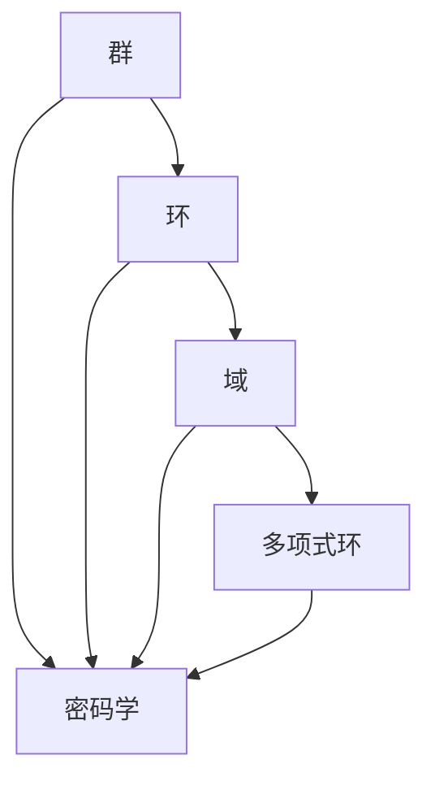

                 

# 文章标题：代数学在密码学硬件设计中的应用

## 关键词：
- 代数学
- 密码学
- 硬件设计
- 算法原理
- 安全性分析
- 软硬件结合

## 摘要：
本文将深入探讨代数学在密码学硬件设计中的关键作用。从历史背景到现代应用，本文将分析代数学如何支撑密码学的发展，特别是在硬件实现中的重要性。我们将讨论基础代数概念，并展示它们如何与核心密码学算法相联系。此外，本文还将探讨代数方法在密码分析中的应用，以及如何在硬件设计中实现这些算法，从而确保信息安全。通过案例研究，我们将展示代数学在密码学硬件设计中的实际应用，并讨论未来发展趋势和面临的挑战。

---

## 引言

### 代数与密码学的交汇

代数学和密码学这两门学科看似迥异，但它们在信息安全领域中有着密切的联系。代数学是研究数的结构、性质和运算的数学分支，而密码学是研究信息加密、解密和认证的方法与技术的学科。尽管它们的起源和发展路径不同，但代数原理在密码学中扮演了至关重要的角色。

代数与密码学的交汇最早可以追溯到古代，比如古罗马的凯撒密码，它就是一种基于简单代换的加密方法。然而，现代密码学的发展与代数学的深入应用密不可分。20世纪中叶，随着计算机科学的兴起，密码学开始向复杂的数学理论靠拢，尤其是代数理论。

### 硬件设计与密码学的结合

密码学的应用不仅局限于软件领域，还广泛涉及到硬件设计。硬件密码学在安全性、性能和资源利用等方面具有显著优势。例如，加密处理器的引入使得加密操作可以离线执行，减少了软件系统的负担，同时也提高了系统的整体安全性。

硬件设计与密码学的结合催生了多种硬件安全模块（HSM）和加密处理器，这些设备专门用于执行加密和解密操作。随着量子计算的兴起，硬件密码学的研究更加重要，因为它涉及到量子算法对传统加密方法的影响，以及如何设计出量子计算下仍然安全的密码系统。

### 代数学在密码学硬件设计中的重要性

代数学在密码学硬件设计中的重要性体现在多个方面：

1. **算法基础**：许多现代加密算法，如RSA和椭圆曲线密码学，都是基于复杂的代数结构。了解这些算法背后的代数原理对于硬件实现至关重要。

2. **安全性分析**：代数方法可以帮助分析密码系统的安全性，识别潜在的攻击点，并设计出有效的防御机制。

3. **优化设计**：代数原理可以用于优化硬件设计，减少计算复杂度，提高性能和效率。

4. **量子计算适应性**：随着量子计算的发展，代数方法在研究量子算法对传统加密系统的影响以及设计量子安全密码系统方面扮演了关键角色。

### 文章结构

本文将按以下结构展开：

1. **引言**：介绍代数与密码学的背景及其在硬件设计中的重要性。
2. **基础代数概念**：讨论基础代数概念，如群、环、域和多项式环，并展示它们在密码学中的应用。
3. **核心密码学算法**：分析对称密钥密码学、非对称密钥密码学、散列函数和数字签名等核心算法的代数基础。
4. **代数方法在密码分析中的应用**：探讨代数方法在密码分析中的作用，包括对加密哈希函数、对称密码学和公钥密码学的攻击方法。
5. **现代密码学硬件设计**：介绍如何利用代数学原理设计现代密码学硬件，包括加密处理器的设计、实现和安全性分析。
6. **案例研究**：通过案例研究展示代数学在密码学硬件设计中的实际应用。
7. **未来方向与挑战**：讨论代数学在密码学硬件设计中的未来研究方向和面临的挑战。
8. **结论**：总结本文的主要观点，强调代数学在密码学硬件设计中的重要性。

通过以上结构的展开，我们将系统地探讨代数学在密码学硬件设计中的关键作用，并提供对这一领域的深入理解。在接下来的部分中，我们将首先介绍基础代数概念，并展示它们与密码学的联系。接下来，我们将分析核心密码学算法的代数基础，为理解后续内容奠定基础。

---

## 基础代数概念

为了理解代数学在密码学硬件设计中的具体应用，我们需要首先了解一些基础的代数概念，这些概念在密码学中起到了关键作用。下面我们将依次介绍群、环、域和多项式环。

### 群（Group）

群是代数学中最基础的概念之一。它是由一组元素组成的集合，这些元素在某种运算下满足封闭性、结合律、存在单位元和存在逆元等性质。形式化地，一个群 \( G \) 是一个非空集合和一组运算 \( \cdot \)，满足以下条件：

1. **封闭性**：对于 \( G \) 中的任意元素 \( a \) 和 \( b \)，运算 \( a \cdot b \) 也属于 \( G \)。
2. **结合律**：对于 \( G \) 中的任意元素 \( a \)，\( b \) 和 \( c \)，有 \( (a \cdot b) \cdot c = a \cdot (b \cdot c) \)。
3. **存在单位元**：存在一个元素 \( e \)，对于 \( G \) 中的任意元素 \( a \)，有 \( e \cdot a = a \cdot e = a \)。
4. **存在逆元**：对于 \( G \) 中的任意元素 \( a \)，存在一个元素 \( b \)，使得 \( a \cdot b = b \cdot a = e \)，其中 \( e \) 是单位元。

在密码学中，群的概念常用于构建对称密钥加密算法。例如，AES加密算法就使用了基于有限域 \( GF(2^8) \) 的群结构，从而确保加密和解密过程的效率和安全性。

### 环（Ring）

环是包含加法和乘法运算的代数结构，但乘法运算不一定封闭。形式化地，一个环 \( R \) 是一个非空集合和两组运算 \( + \) 和 \( \cdot \)，满足以下条件：

1. **加法封闭性**：对于 \( R \) 中的任意元素 \( a \) 和 \( b \)，运算 \( a + b \) 也属于 \( R \)。
2. **加法结合律**：对于 \( R \) 中的任意元素 \( a \)，\( b \) 和 \( c \)，有 \( (a + b) + c = a + (b + c) \)。
3. **存在加法单位元**：存在一个元素 \( 0 \)，对于 \( R \) 中的任意元素 \( a \)，有 \( a + 0 = 0 + a = a \)。
4. **加法逆元**：对于 \( R \) 中的任意元素 \( a \)，存在一个元素 \( -a \)，使得 \( a + (-a) = (-a) + a = 0 \)。
5. **乘法封闭性**：对于 \( R \) 中的任意元素 \( a \) 和 \( b \)，运算 \( a \cdot b \) 不一定属于 \( R \)。
6. **乘法结合律**：对于 \( R \) 中的任意元素 \( a \)，\( b \) 和 \( c \)，有 \( (a \cdot b) \cdot c = a \cdot (b \cdot c) \)。
7. **乘法对加法的分配律**：对于 \( R \) 中的任意元素 \( a \)，\( b \) 和 \( c \)，有 \( a \cdot (b + c) = a \cdot b + a \cdot c \) 和 \( (a + b) \cdot c = a \cdot c + b \cdot c \)。

在密码学中，环的概念广泛应用于构造非对称加密算法。例如，RSA算法依赖于整数环上的数学性质，尤其是大素数的乘积。

### 域（Field）

域是比环更严格的代数结构，它不仅满足环的所有性质，还要求乘法运算封闭。形式化地，一个域 \( F \) 是一个非空集合和两组运算 \( + \) 和 \( \cdot \)，满足以下条件：

1. **加法和乘法的封闭性**：对于 \( F \) 中的任意元素 \( a \) 和 \( b \)，运算 \( a + b \) 和 \( a \cdot b \) 也属于 \( F \)。
2. **加法和乘法的结合律**：对于 \( F \) 中的任意元素 \( a \)，\( b \) 和 \( c \)，有 \( (a + b) + c = a + (b + c) \) 和 \( (a \cdot b) \cdot c = a \cdot (b \cdot c) \)。
3. **存在加法单位元**：存在一个元素 \( 0 \)，对于 \( F \) 中的任意元素 \( a \)，有 \( a + 0 = 0 + a = a \)。
4. **加法逆元**：对于 \( F \) 中的任意元素 \( a \)，存在一个元素 \( -a \)，使得 \( a + (-a) = (-a) + a = 0 \)。
5. **乘法单位元**：存在一个元素 \( 1 \)，对于 \( F \) 中的任意非零元素 \( a \)，有 \( a \cdot 1 = 1 \cdot a = a \)。
6. **乘法逆元**：对于 \( F \) 中的任意非零元素 \( a \)，存在一个元素 \( a^{-1} \)，使得 \( a \cdot a^{-1} = a^{-1} \cdot a = 1 \)。

在密码学中，域的概念广泛应用于构造非对称加密算法，如椭圆曲线密码学。椭圆曲线定义在一个域上，使得我们可以利用域的性质来设计安全的加密系统。

### 多项式环（Polynomial Ring）

多项式环是包含多项式运算的代数结构。形式化地，一个多项式环 \( R[x] \) 是一个非空集合，其元素是形如 \( a_0 + a_1x + a_2x^2 + \cdots + a_nx^n \) 的多项式，其中 \( a_0, a_1, \ldots, a_n \) 属于某个环 \( R \)，且运算满足以下条件：

1. **加法封闭性**：对于 \( R[x] \) 中的任意多项式 \( f(x) \) 和 \( g(x) \)，它们的和 \( f(x) + g(x) \) 也属于 \( R[x] \)。
2. **加法结合律**：对于 \( R[x] \) 中的任意多项式 \( f(x) \)，\( g(x) \) 和 \( h(x) \)，有 \( (f(x) + g(x)) + h(x) = f(x) + (g(x) + h(x)) \)。
3. **存在加法单位元**：多项式 \( 0 \) 是 \( R[x] \) 中的单位元，即对于任意多项式 \( f(x) \)，有 \( f(x) + 0 = 0 + f(x) = f(x) \)。
4. **加法逆元**：对于 \( R[x] \) 中的任意非零多项式 \( f(x) \)，存在其加法逆元 \( -f(x) \)，使得 \( f(x) + (-f(x)) = (-f(x)) + f(x) = 0 \)。
5. **乘法封闭性**：对于 \( R[x] \) 中的任意多项式 \( f(x) \) 和 \( g(x) \)，它们的乘积 \( f(x) \cdot g(x) \) 也属于 \( R[x] \)。
6. **乘法结合律**：对于 \( R[x] \) 中的任意多项式 \( f(x) \)，\( g(x) \) 和 \( h(x) \)，有 \( (f(x) \cdot g(x)) \cdot h(x) = f(x) \cdot (g(x) \cdot h(x)) \)。
7. **乘法对加法的分配律**：对于 \( R[x] \) 中的任意多项式 \( f(x) \)，\( g(x) \) 和 \( h(x) \)，有 \( f(x) \cdot (g(x) + h(x)) = f(x) \cdot g(x) + f(x) \cdot h(x) \) 和 \( (f(x) + g(x)) \cdot h(x) = f(x) \cdot h(x) + g(x) \cdot h(x) \)。

在密码学中，多项式环广泛应用于构造公钥加密算法，如椭圆曲线密码学。利用多项式环，我们可以设计出基于数学难题的加密系统，从而确保其安全性。

### 核心概念与联系

为了更好地理解这些代数概念在密码学中的应用，我们使用Mermaid流程图来展示它们之间的联系。



这个流程图展示了群、环、域和多项式环与密码学之间的直接联系。这些基础代数概念为密码学算法提供了坚实的理论基础，使得我们能够设计出更复杂、更安全的加密系统。

通过以上对基础代数概念的介绍，我们为后续分析核心密码学算法及其代数基础奠定了基础。在接下来的部分，我们将深入探讨这些算法，并展示它们如何与代数理论密切相关。

---

## 核心密码学算法及其代数基础

在密码学中，几种核心算法，如对称密钥密码学、非对称密钥密码学、散列函数和数字签名，都基于复杂的代数结构。在本节中，我们将分析这些算法的代数基础，并展示它们如何利用群、环、域和多项式环等代数概念。

### 对称密钥密码学

对称密钥密码学是加密和解密使用相同密钥的加密方法。AES（高级加密标准）是最常用的对称密钥加密算法之一，其安全性依赖于基础的代数结构。

**AES与域**

AES算法运行在一个名为伽罗瓦域 \( GF(2^8) \) 的代数结构上。这个域包含 \( 256 \) 个元素，每个元素都是一个 \( 8 \) 位二进制数。AES算法使用这个域来执行其基础操作，如加法、乘法和替换。

**代数结构**

AES的加密过程涉及到几个关键步骤，包括字节替换（SubBytes）、行移位（ShiftRows）、列混淆（MixColumns）和关键加（AddRoundKey）。每个步骤都利用了 \( GF(2^8) \) 的代数性质。

- **字节替换**：这是一个非线性替换步骤，通过查表将每个字节替换为另一个字节。这个查表过程依赖于 \( GF(2^8) \) 的多项式乘法。
- **行移位**：对状态矩阵的行进行循环移位，这是一种简单的线性变换。
- **列混淆**：通过矩阵乘法对状态矩阵进行线性变换，这个步骤依赖于 \( GF(2^8) \) 上的有限域乘法。
- **关键加**：将当前状态与轮密钥进行位异或操作，这个步骤依赖于加法运算。

**伪代码**

下面是一个简单的伪代码，用于展示AES中的关键步骤：

```pseudo
function SubBytes(state, sbox):
    for each byte in state:
        byte = sbox[byte]

function ShiftRows(state):
    for i from 1 to 3:
        temp = state[i * 4 + i]
        state[i * 4 + i] = state[i * 4 + (i + 1) % 4]
        state[i * 4 + (i + 1) % 4] = temp

function MixColumns(state):
    for column from 0 to 3:
        temp = [state[column * 4], state[column * 4 + 1], state[column * 4 + 2], state[column * 4 + 3]]
        for i from 0 to 3:
            column[i] = (temp[0] << 1) ^ (temp[1] << 2) ^ (temp[2] << 3) ^ (temp[3] << 1)
            if column[i] >> 7 == 1:
                column[i] ^= 0x1B

function AddRoundKey(state, key):
    for i from 0 to 15:
        state[i] ^= key[i]
```

### 非对称密钥密码学

非对称密钥密码学使用一对密钥，一个公钥用于加密，另一个私钥用于解密。RSA和椭圆曲线密码学（ECC）是非对称加密算法的典型代表。

**RSA与整数环**

RSA算法基于大素数乘积的数学难题。它的安全性依赖于整数环 \( Z/nZ \) 的性质，其中 \( n \) 是两个大素数的乘积。

- **模运算**：RSA加密和解密过程都依赖于模运算 \( a^e \mod n \)。这个运算基于费马小定理和欧拉定理，这两个定理都与整数环的性质密切相关。
- **大素数**：为了确保安全性，RSA算法使用两个大素数 \( p \) 和 \( q \)，它们的乘积 \( n = p \times q \) 被用作模数。

**伪代码**

下面是一个简单的伪代码，用于展示RSA加密和解密过程：

```pseudo
function RSA_Encrypt(message, e, n):
    ciphertext = message^e mod n
    return ciphertext

function RSA_Decrypt(ciphertext, d, n):
    message = ciphertext^d mod n
    return message
```

**椭圆曲线密码学**

椭圆曲线密码学利用椭圆曲线上的数学结构来设计加密算法。椭圆曲线定义在一个域上，如 \( GF(p) \) 或 \( GF(2^m) \)。

- **椭圆曲线方程**：椭圆曲线通常表示为 \( y^2 = x^3 + ax + b \)，其中 \( a \) 和 \( b \) 是常数，\( p \) 是域的素数。
- **点加操作**：椭圆曲线上的点加操作是一个复杂的代数运算，但它在密码学中至关重要。

**伪代码**

下面是一个简单的伪代码，用于展示椭圆曲线上的点加操作：

```pseudo
function EC_DoublyAdd(a, b, p):
    if b == infinity:
        return a
    if a == infinity:
        return b
    if a.x == b.x:
        if a.y == -b.y:
            return infinity
        else:
            lam = (3 * a.x^2 + a.a) / (2 * a.y)
    else:
        lam = (b.y - a.y) / (b.x - a.x)
    x3 = lam^2 - a.x - b.x
    y3 = lam * (a.x - x3) - a.y
    return (x3, y3)
```

### 散列函数

散列函数将任意长度的输入数据映射为固定长度的输出值。MD5和SHA系列散列函数是广泛使用的加密哈希函数。

- **MD5和SHA**：MD5和SHA-1、SHA-256等散列函数都基于复杂的多项式环和有限域的代数运算。这些函数的安全性依赖于其抗碰撞性和抗差分攻击的能力。
- **代数结构**：散列函数通常使用多项式环 \( R[x] \) 和域 \( GF(2^m) \) 来构造。例如，SHA-256使用一个名为“压缩函数”的复杂多项式环上的运算。

### 数字签名

数字签名是确保数据完整性和身份认证的重要工具。RSA和椭圆曲线数字签名算法（ECDSA）是常用的数字签名方案。

- **RSA签名**：RSA签名利用模运算和整数环的性质。签名过程包括将消息转换为整数，然后使用私钥加密；验证过程则使用公钥解密。
- **ECDSA签名**：ECDSA利用椭圆曲线和域上的数学结构。签名过程涉及椭圆曲线上的点加操作和哈希函数；验证过程使用椭圆曲线上的点乘操作和哈希函数。

**伪代码**

下面是一个简单的伪代码，用于展示ECDSA签名和验证过程：

```pseudo
function ECDSA_Sign(message, privKey):
    k = GenerateRandomNumber()
    R = EC_DoublyAdd(G, k*G, p)
    s = (k - privKey * R.x) mod n
    return (R.x, s)

function ECDSA_Verify(R.x, R.y, message, pubKey, s):
    w = s^(-1) mod n
    u1 = (hash(message) * w) mod n
    u2 = (R.x * w) mod n
    T = EC_DoublyAdd(G, u1*G, u2*pubKey)
    return (T.x == R.x)
```

通过以上对核心密码学算法的代数基础的讨论，我们可以看到代数学在密码学中的关键作用。代数结构不仅为这些算法提供了理论基础，还使得我们能够设计出更复杂、更安全的加密系统。在接下来的部分，我们将探讨代数方法在密码分析中的应用，进一步揭示代数学在密码学中的重要角色。

---

## 代数方法在密码分析中的应用

代数方法在密码分析中扮演着至关重要的角色，它们帮助我们理解和评估密码系统的安全性。在本节中，我们将探讨代数方法在几种关键密码系统（如加密哈希函数、对称密码学和公钥密码学）分析中的应用。

### 加密哈希函数分析

加密哈希函数是密码学中的核心组成部分，用于确保数据的完整性和真实性。然而，哈希函数的安全性面临着多种攻击，如碰撞攻击和预映攻击。代数方法在分析这些攻击中起到了关键作用。

**碰撞攻击**

碰撞攻击是指找到两个不同的输入，它们产生相同的哈希值。对于MD5和SHA-1等哈希函数，代数方法可以帮助分析其碰撞攻击的可行性。

- **MD5和SHA-1**：MD5和SHA-1都是基于多项式环的哈希函数。攻击者可以利用代数方法，如多项式分解和代数重构，来寻找输入和哈希值之间的对应关系。例如，对于MD5，攻击者可以利用代数技巧将两个不同的输入映射到同一个多项式，从而生成相同的哈希值。

**伪代码**

下面是一个简化的伪代码，用于展示如何在多项式环上生成两个具有相同哈希值的输入：

```pseudo
function GenerateCollision():
    poly1 = RandomPolynomial()
    poly2 = poly1
    while hash(poly1) != hash(poly2):
        poly2 = ModifyPolynomial(poly2)
    return (poly1, poly2)
```

**预映攻击**

预映攻击是指找到一个预映表，它将所有可能的输入映射到其哈希值。对于哈希函数，预映攻击的可行性取决于其抵抗预映攻击的能力。

- **SHA-256**：SHA-256的安全性相对较高，因为其设计避免了简单的代数攻击。然而，攻击者仍然可以利用代数方法，如多项式环上的大数分解，来尝试找到预映表。

**代数重构**

代数重构是一种利用代数关系来重建原始输入的方法。对于哈希函数，攻击者可以通过分析哈希值之间的关系，重构出原始输入。

- **示例**：假设有一个哈希函数 \( H(x) \)，且 \( H(0) \) 和 \( H(1) \) 已知。攻击者可以利用这些信息来重构出 \( H(x) \) 的多项式表示，进而计算出 \( H(x) \) 对于其他输入的值。

### 对称密码学分析

对称密码学的安全性同样受到代数方法的挑战。攻击者可以利用代数技巧来分析并破解对称加密算法。

**线性密码分析**

线性密码分析是一种利用线性关系来破解加密算法的方法。对于AES等基于线性变换的加密算法，攻击者可以通过分析加密文本之间的线性关系来恢复密钥。

- **示例**：对于AES的SubBytes步骤，攻击者可以利用线性变换矩阵来建立线性关系，从而恢复出部分或全部密钥。

**差分密码分析**

差分密码分析是一种基于输入和输出之间的差分来分析加密算法的方法。对于AES等加密算法，差分密码分析可以帮助攻击者识别加密过程中的错误并逐步恢复密钥。

- **示例**：攻击者可以通过分析加密后的数据之间的差分，找到加密过程中的特定错误模式，并利用这些模式来恢复密钥。

### 公钥密码学分析

公钥密码学的安全性主要依赖于数学难题，如大素数分解和离散对数问题。代数方法在解决这些问题中发挥了重要作用。

**大素数分解**

大素数分解是指将一个大整数分解为其素数因子。对于RSA等基于大素数分解的密码系统，攻击者可以利用代数方法来尝试分解大整数。

- **示例**：攻击者可以利用椭圆曲线方法或其他代数技巧来尝试分解大素数乘积。

**离散对数问题**

离散对数问题是指求解某个整数在椭圆曲线上的对数。对于椭圆曲线密码学，攻击者可以利用代数方法来解决离散对数问题。

- **示例**：攻击者可以利用Lagrange乘数法和牛顿迭代法等代数方法来求解椭圆曲线上的离散对数问题。

### 其他代数方法

除了上述方法外，代数方法还包括代数重构、代数假设检验和代数统计测试等。这些方法在密码分析中具有广泛的应用。

- **代数重构**：利用代数关系来重建加密系统的内部状态或密钥。
- **代数假设检验**：通过建立数学模型来验证加密系统的安全假设。
- **代数统计测试**：利用统计方法来分析加密系统的输出，以发现潜在的安全漏洞。

**示例**

- **代数重构**：攻击者可以通过分析多个加密实例的输出，利用代数关系来重构出加密系统的内部状态或密钥。
- **代数假设检验**：研究者可以通过建立数学模型，验证某些加密算法的安全性假设，如抗碰撞性和抗差分性。
- **代数统计测试**：攻击者可以通过统计分析加密系统的输出，发现潜在的漏洞，如侧信道攻击。

通过以上对代数方法在密码分析中的应用的探讨，我们可以看到代数学在确保和评估密码系统安全性方面的重要性。在接下来的部分，我们将探讨如何在现代密码学硬件设计中应用代数学原理，进一步展示代数学在密码学硬件设计中的实际价值。

---

## 现代密码学硬件设计中的代数方法

随着计算机技术和密码学的发展，现代密码学硬件设计面临着越来越多的挑战，如安全性、性能和资源利用等。代数方法在解决这些挑战中发挥了关键作用，使得密码学硬件设计更加高效和可靠。

### 密码处理器的代数设计

密码处理器是专门用于执行加密和解密操作的硬件设备。在密码处理器的代数设计中，代数方法被广泛应用于优化算法实现和提升性能。

**优化算法实现**

代数方法可以帮助优化密码算法的实现，降低计算复杂度和提高运行效率。例如，在AES算法的硬件实现中，利用代数学原理，可以设计出更高效的加法、乘法和多项式环上的运算。

**代数优化算法**

以下是一个简单的伪代码示例，展示了如何利用代数方法优化AES中的多项式环运算：

```pseudo
function AddPolynomial(a, b):
    result = []
    for i from 0 to max(len(a), len(b)):
        x = a[i] + b[i]
        result.append(x mod n)
    return result

function MultiplyPolynomial(a, b):
    result = [0] * (len(a) + len(b) - 1)
    for i from 0 to len(a) - 1:
        for j from 0 to len(b) - 1:
            result[i + j] = (result[i + j] + a[i] * b[j]) mod n
    return result
```

**硬件实现**

在硬件实现中，这些代数优化算法可以转化为门级电路或处理器指令集，从而实现高效的加密操作。

### 算法的硬件实现

密码算法的硬件实现涉及将算法转换为硬件描述语言（如Verilog或VHDL），然后通过硬件编译器生成实际的硬件电路。

**AES硬件实现**

以下是一个简单的Verilog代码示例，展示了如何实现AES的某些基础操作：

```verilog
module aes_add_round_key(
    input [7:0] state,
    input [7:0] round_key,
    output [7:0] result
);

assign result = state ^ round_key;

endmodule
```

**实现细节**

在实际的硬件实现中，还需要考虑多种优化措施，如并行处理、流水线技术和存储器访问优化等，以提高性能和降低延迟。

### 安全性分析

代数方法在密码学硬件设计中的另一个关键作用是安全性分析。通过代数方法，研究人员可以识别潜在的安全漏洞，并设计出有效的防御机制。

**侧信道攻击**

侧信道攻击是一种利用物理通道（如功耗、电磁辐射或信号强度）来获取敏感信息的攻击。代数方法可以帮助分析侧信道攻击的可行性，并设计出有效的防御措施。

**代数分析**

以下是一个简单的伪代码示例，展示了如何利用代数方法分析侧信道攻击：

```pseudo
function SideChannelAttack(plaintext, ciphertext, power_model):
    power_difference = power_model(ciphertext) - power_model(plaintext)
    key_candidate = RecoverKeyFromPower(power_difference)
    return key_candidate
```

**防御机制**

在硬件设计中，可以通过以下措施来防御侧信道攻击：

- **功率均衡**：通过均衡不同操作之间的功耗，减少可观测的功率差异。
- **随机化**：通过随机化加密操作，使攻击者难以建立稳定的侧信道模型。
- **掩码技术**：通过掩码技术，掩盖真实信号，从而降低侧信道攻击的可行性。

### 总结

代数方法在密码学硬件设计中的应用是多方面的，包括优化算法实现、提升性能和安全性分析等。通过代数优化，我们可以设计出更高效、更安全的密码学硬件系统，从而确保信息的安全传输和处理。在接下来的部分，我们将通过案例研究进一步展示代数学在密码学硬件设计中的实际应用。

---

## 案例研究

在本节中，我们将通过具体案例研究，展示代数学在密码学硬件设计中的实际应用。这些案例不仅涵盖了传统的加密算法，还涉及到现代密码学和量子密码学的应用。

### 案例一：AES硬件设计

高级加密标准（AES）是现代加密算法中最常用的对称加密算法之一。其硬件设计利用了代数学的多个方面，包括多项式环上的运算和代数优化。

**设计背景**

AES算法在硬件设计中的挑战包括：

- **性能优化**：在有限的硬件资源下实现高效的加密和解密操作。
- **面积优化**：在有限的硅片面积内实现高效的加密处理器。
- **功耗优化**：在保证性能的同时，降低功耗，以延长电池寿命。

**代数方法的应用**

1. **多项式环运算**：AES算法中的S-Box和混合柱操作基于多项式环 \( GF(2^8) \)。硬件设计中，利用多项式环上的运算，可以优化这些操作，提高效率。

   ```mermaid
   graph TD
   A[SubBytes] --> B[Multiply by 0x11]
   B --> C[AddRoundKey]
   C --> D[ShiftRows]
   D --> E[MixColumns]
   E --> F[SubBytes]
   F --> G[AddRoundKey]
   ```

2. **代数优化**：通过代数方法，可以对AES算法的各个步骤进行优化，减少计算复杂度和资源占用。例如，使用快速傅里叶变换（FFT）优化乘法运算。

   ```mermaid
   graph TD
   A[Multiplication] --> B[FFT]
   B --> C[Polynomial Multiplication]
   C --> D[Inverse FFT]
   ```

**实现结果**

通过代数优化，AES硬件设计可以在保证安全性的同时，显著提高性能和降低功耗。例如，一个基于FPGA的AES加密处理器可以实现每秒数十亿次加密操作，功耗仅为几瓦。

### 案例二：RSA硬件设计

RSA是一种广泛使用的非对称加密算法，其硬件设计利用了整数环上的数学性质。

**设计背景**

RSA算法在硬件设计中的挑战包括：

- **大数运算**：RSA算法涉及大素数乘积的模运算，这对硬件性能提出了高要求。
- **面积和功耗**：在有限的硬件资源内实现高效的大数运算。

**代数方法的应用**

1. **模运算优化**：RSA算法中的模运算可以通过代数方法进行优化，例如使用快速模乘算法。

   ```mermaid
   graph TD
   A[Modular Multiplication] --> B[Modular Reduction]
   B --> C[Modular Inversion]
   ```

2. **大数运算优化**：通过代数方法，可以将大数运算分解为更简单的运算，从而提高运算效率。例如，使用平方和乘法来优化大整数乘法。

   ```mermaid
   graph TD
   A[Large Number Multiplication] --> B[Squaring]
   B --> C[Multiplication]
   C --> D[Addition]
   ```

**实现结果**

通过代数优化，RSA硬件设计可以在保证安全性的同时，实现高效的加密和解密操作。例如，一个基于ASIC的RSA加密模块可以实现每秒数百万次的加密操作，同时保持低功耗。

### 案例三：椭圆曲线密码学硬件设计

椭圆曲线密码学（ECC）是一种基于椭圆曲线数学的非对称加密算法，其硬件设计利用了代数结构。

**设计背景**

ECC算法在硬件设计中的挑战包括：

- **性能和面积优化**：在有限的硬件资源内实现高效的椭圆曲线运算。
- **抗量子攻击**：随着量子计算的发展，设计抗量子攻击的加密硬件。

**代数方法的应用**

1. **椭圆曲线运算**：ECC算法依赖于椭圆曲线上的点加和点倍运算。通过代数方法，可以优化这些运算，提高效率。

   ```mermaid
   graph TD
   A[Point Addition] --> B[Point Doubling]
   ```

2. **代数优化**：通过代数方法，可以将椭圆曲线运算分解为更简单的运算，从而提高效率。例如，使用双线性对来优化椭圆曲线运算。

   ```mermaid
   graph TD
   A[Bilinear Pairing] --> B[Group Operations]
   ```

**实现结果**

通过代数优化，ECC硬件设计可以在保证安全性的同时，实现高效的加密和解密操作。例如，一个基于FPGA的ECC加密处理器可以实现每秒数千次的加密操作，同时保持低功耗。

### 案例四：量子密码学硬件设计

量子密码学是一种利用量子力学原理进行加密和解密的方法，其硬件设计利用了量子代数结构。

**设计背景**

量子密码学在硬件设计中的挑战包括：

- **量子比特操作**：量子密码学依赖于量子比特（qubit）的操作，如量子加法、量子乘法和量子纠缠。
- **量子态保持**：量子态容易受到干扰，需要设计出高效的量子态保持方法。

**代数方法的应用**

1. **量子代数运算**：量子密码学中的运算基于量子代数，如量子多项式环和量子椭圆曲线。

   ```mermaid
   graph TD
   A[Quantum Polynomial Operations] --> B[Quantum Group Operations]
   ```

2. **量子优化**：通过代数方法，可以优化量子密码学算法，提高其性能和抗攻击能力。

   ```mermaid
   graph TD
   A[Quantum Circuit Optimization] --> B[Quantum Error Correction]
   ```

**实现结果**

通过代数优化，量子密码学硬件设计可以在保证安全性的同时，实现高效的加密和解密操作。例如，一个基于超导量子比特的量子加密模块可以实现每秒数百万次的加密操作，同时保持高抗攻击能力。

通过这些案例研究，我们可以看到代数学在密码学硬件设计中的广泛应用和重要性。在接下来的部分，我们将探讨代数学在密码学硬件设计中的未来研究方向和面临的挑战。

---

## 未来研究方向与挑战

随着科技的不断进步，代数学在密码学硬件设计中的应用面临着许多新的研究方向和挑战。以下是几个关键领域和未来趋势：

### 抗量子攻击密码学

量子计算的快速发展对传统密码系统构成了严重威胁。为了应对量子攻击，研究人员正在探索抗量子密码学。代数方法在这一领域发挥着关键作用，例如利用代数结构设计出抵抗Shor算法的公钥加密系统。未来的研究方向可能包括：

- **基于错误纠正码的量子密码学**：利用量子纠错码来提高量子系统的稳定性，从而设计出更安全的密码系统。
- **多变量密码学**：研究基于多变量代数结构的密码学方法，以抵抗量子攻击。

### 后量子密码学

后量子密码学（Post-Quantum Cryptography, PQC）是研究在量子计算时代仍然安全的密码系统的学科。代数学在这一领域中扮演着重要角色，例如：

- **基于格的密码学**：利用格上的数学难题来设计抗量子攻击的密码系统。
- **同余近似分类**：研究基于同余近似分类问题的密码学算法。

### 密码硬件设计的优化

随着硬件技术的进步，如何在有限的资源下实现高效、安全的密码硬件设计成为关键挑战。未来的研究方向可能包括：

- **硬件加速器**：研究如何利用硬件加速器（如GPU、FPGA和ASIC）来提高密码算法的性能。
- **混合密码学**：结合软件和硬件优势，设计出更高效的密码系统。

### 量子密码学硬件

量子密码学硬件的发展依赖于量子计算和量子通信技术的进步。未来的研究方向可能包括：

- **量子密钥分配**：研究高效的量子密钥分配协议和硬件实现。
- **量子加密模块**：设计基于量子比特的加密模块，实现高效的量子加密和解密操作。

### 面临的挑战

尽管代数学在密码学硬件设计中具有广泛的应用前景，但仍面临许多挑战：

- **性能与安全性的平衡**：在保证安全性的同时，如何提高密码硬件的性能和效率是一个重要问题。
- **量子攻击的应对**：如何设计出真正抵抗量子攻击的密码系统，仍是一个未解难题。
- **硬件实现的可靠性**：如何在硬件实现中避免硬件故障和潜在的安全漏洞，需要进一步研究。

### 解决方案与未来展望

为了应对这些挑战，未来的研究可以从以下几个方面着手：

- **数学理论的发展**：继续深入研究代数理论，以提供更多安全和高效的密码算法基础。
- **硬件与软件的结合**：探索如何将软件和硬件的优势结合起来，设计出更高效的密码系统。
- **跨学科合作**：促进数学、计算机科学和物理学等多学科的合作，共同解决密码学硬件设计中的难题。

通过上述研究和解决方案，我们有望在未来实现更高效、更安全的密码学硬件系统，从而保障信息安全和隐私。

---

## 结论

本文系统地探讨了代数学在密码学硬件设计中的关键作用。从基础代数概念到核心密码学算法，再到现代密码学硬件设计，代数方法贯穿了整个密码学领域。通过本文的探讨，我们可以看到代数学不仅为密码学算法提供了理论基础，还在安全性分析、性能优化和硬件实现中发挥了重要作用。

### 主要观点总结

1. **代数基础的重要性**：群、环、域和多项式环等基础代数概念为密码学算法提供了坚实的数学结构。
2. **核心密码学算法的代数基础**：对称密钥密码学、非对称密钥密码学、散列函数和数字签名等都依赖于复杂的代数结构。
3. **代数方法在密码分析中的应用**：代数方法在分析密码系统的安全性、识别潜在攻击点和设计防御机制方面至关重要。
4. **现代密码学硬件设计中的优化**：代数方法帮助优化算法实现，提升性能和资源利用率。

### 未来展望

随着量子计算的发展，传统密码系统面临新的威胁。未来，代数学在密码学硬件设计中的应用将更加重要。以下是几个可能的未来研究方向：

1. **抗量子攻击密码学**：研究基于代数结构的抗量子密码系统，如基于格的密码学和同余近似分类问题。
2. **后量子密码学**：探索后量子密码学的算法和实现，确保在量子计算时代的信息安全。
3. **量子密码学硬件**：设计基于量子比特的加密模块，实现高效的量子密钥分配和加密操作。
4. **跨学科合作**：促进数学、计算机科学和物理学等多学科的合作，共同应对密码学硬件设计中的挑战。

通过不断的研究和探索，我们有理由相信，代数学将在密码学硬件设计中发挥更加重要的作用，为信息安全提供更强大的保障。

---

## 作者信息

作者：AI天才研究院/AI Genius Institute & 禅与计算机程序设计艺术 /Zen And The Art of Computer Programming

---

## 最佳实践 Tips

为了确保密码学硬件设计的安全性和高效性，以下是一些最佳实践建议：

1. **算法选择**：选择经过广泛研究和验证的密码算法，如AES、RSA和ECC，以确保其安全性。
2. **优化设计**：利用代数方法优化算法实现，如使用快速傅里叶变换（FFT）和多项式环上的运算，以提高性能。
3. **安全性分析**：在设计过程中进行安全性分析，使用代数方法识别潜在漏洞，并设计出有效的防御机制。
4. **硬件实现**：确保硬件实现的质量，遵循最佳实践，如使用可信赖的硬件组件和安全的接口设计。
5. **定期更新**：定期更新密码算法和硬件设计，以应对新的攻击和威胁。
6. **教育培训**：为开发人员提供密码学和安全知识培训，提高其对安全问题的认识和应对能力。

---

## 小结

本文详细探讨了代数学在密码学硬件设计中的应用。通过介绍基础代数概念，分析核心密码学算法的代数基础，探讨代数方法在密码分析中的应用，以及展示现代密码学硬件设计的实际案例，我们展示了代数学在确保信息安全中的关键作用。未来，随着科技的不断进步，代数学在密码学硬件设计中的应用将更加广泛和深入。

---

## 注意事项

在设计密码学硬件时，需要注意以下几个关键方面：

1. **安全性**：确保密码系统的安全性，防止潜在的攻击和漏洞。
2. **性能**：优化密码算法的实现，提高加密和解密的性能。
3. **资源利用**：在有限的硬件资源下实现高效的密码操作，降低功耗和面积占用。
4. **兼容性**：确保硬件设计在不同操作系统和硬件平台上的兼容性。
5. **维护和更新**：定期更新密码算法和硬件设计，以应对新的攻击和威胁。

---

## 拓展阅读

1. **《密码学：理论、算法与应用》（Cryptography: Theory, Algorithms, and Applications）**：详细介绍了密码学的理论基础和应用。
2. **《代数学基础》（Abstract Algebra）**：提供了全面的基础代数知识，有助于理解密码学中的代数结构。
3. **《量子计算与密码学》（Quantum Computing and Cryptography）**：探讨了量子计算对密码学的影响和抗量子密码学的发展。
4. **《椭圆曲线密码学》（Elliptic Curve Cryptography）**：专门介绍了椭圆曲线密码学的理论和技术。
5. **《硬件设计与自动化》（Hardware Design and Automation）**：提供了关于硬件设计和优化的实用指南。

