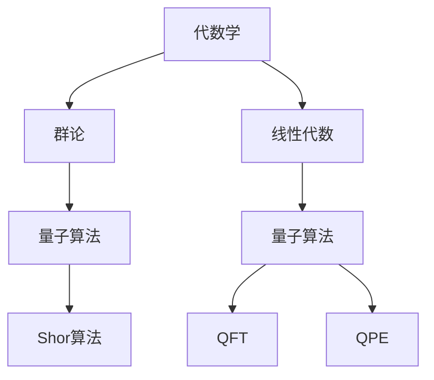

                 

**

为了确保文章的完整性和符合要求，我们将文章内容分为以下几个主要部分，并逐步进行详细阐述：

**1. 背景介绍**
- 量子算法的起源与历史背景
- 代数学在计算机科学中的应用概述
- 量子算法中代数学的重要性

**2. 核心概念与联系**
- 代数学的核心概念：群论、线性代数等
- 量子计算的基本概念：量子比特、量子门等
- 代数学与量子计算之间的联系

**3. 核心算法原理讲解**
- Shor算法的原理与步骤
- Quantum Fourier Transform (QFT) 的原理与步骤
- Quantum Phase Estimation (QPE) 的原理与步骤

**4. 数学模型和公式**
- Shor算法的数学模型和公式
- QFT的数学模型和公式
- QPE的数学模型和公式

**5. 项目实战**
- 开发环境搭建
- 源代码实现与解读
- 代码应用解读与分析
- 实际案例分析与详细讲解

**6. 最佳实践 Tips**
- 注意事项
- 拓展阅读

**7. 小结**

**具体内容如下：**

---

## 背景介绍

量子算法是量子计算机的核心组成部分，它利用量子力学的原理进行计算，相对于传统计算机算法具有显著的速度优势。Shor算法和Grover算法是两个著名的量子算法，它们在因数分解和搜索问题上展示了量子计算机的巨大潜力。

代数学作为数学的一个重要分支，其在计算机科学中的应用范围广泛。特别是在量子计算领域，代数学的概念和原理被广泛应用于量子算法的设计和分析中。群论、线性代数等代数结构在量子算法中扮演着关键角色，如Shor算法中的周期检测和量子四则变换。

本文旨在探讨代数学在量子算法设计中的应用，通过详细分析Shor算法、量子四则变换（QFT）和量子相位估计（QPE），揭示代数学原理在量子算法中的作用机制。同时，本文还将结合实际案例，探讨代数学在量子算法设计中的挑战与未来发展。

**核心概念与联系**

代数学是研究运算规则和结构的数学分支，其核心概念包括群、环、域等。群论是代数学的一个重要分支，主要研究具有封闭运算的集合以及这个运算的性质。线性代数则是研究向量空间和线性映射的数学分支，主要涉及矩阵运算、线性方程组求解等问题。

量子计算的基本概念主要包括量子比特（qubit）、量子态、量子门等。量子比特是量子计算的基本单元，它不同于经典比特只能取0或1的值，而是可以处于0和1的叠加态。量子态描述了量子系统的状态，量子门则是实现量子态变换的基本操作。

代数学与量子计算之间的联系在于，许多量子算法都依赖于代数结构来进行计算。例如，Shor算法利用了模乘群的结构来求解整数分解问题，而量子四则变换（QFT）和量子相位估计（QPE）则利用了线性代数的原理来实现高效的量子计算。

以下是一个Mermaid流程图，展示了代数学与量子计算之间的联系：



**核心算法原理讲解**

Shor算法是第一个被证明在量子计算机上比经典计算机具有明显优势的算法，它利用量子并行计算的能力来快速求解大整数的因子分解问题。Shor算法的核心步骤包括以下几部分：

1. **初始状态设定**：量子计算机的输入是一个大整数N，算法首先将一个量子状态初始化为叠加态。

2. **构建量子电路**：算法通过一系列量子门构建一个特定的量子电路，该电路的作用是将输入状态映射到另一个状态，这个状态与N的因子分解有关。

3. **量子并行计算**：量子计算机通过量子并行计算，将所有可能的乘积态同时计算出来，并叠加在一起。

4. **测量**：量子计算机对量子态进行测量，得到一个特定的整数k，这个整数与N的因子分解有关。

5. **计算因子**：通过对k进行模N运算，可以得到N的一个因子。

以下是一个简化的Shor算法伪代码：

```python
def shor(N):
    # 初始化量子状态
    state = initialize(N)

    # 构建量子电路
    circuit = construct_circuit(N)

    # 执行量子并行计算
    execute(circuit)

    # 测量得到k
    k = measure()

    # 计算因子
    factor = find_factor(N, k)

    return factor
```

量子四则变换（QFT）是量子计算中一个非常重要的变换，它将量子态从基态变换到四则变换态。QFT在量子算法中用于实现高效的量子计算，以下是QFT的伪代码：

```python
def qft(n):
    # 初始化量子状态
    state = initialize(n)

    # 构建QFT电路
    circuit = construct_qft_circuit(n)

    # 执行QFT
    execute(circuit)

    # 返回四则变换态
    return state
```

量子相位估计（QPE）是Shor算法中的一个关键步骤，它利用QFT和逆QFT来估计某个量子态的相位。以下是QPE的伪代码：

```python
def qpe(N, k):
    # 初始化量子状态
    state = initialize(N)

    # 构建QFT电路
    qft_circuit = construct_qft_circuit(N)

    # 执行QFT
    execute(qft_circuit)

    # 翻转第k个量子比特
    flip_k(state, k)

    # 构建逆QFT电路
    inverse_qft_circuit = construct_inverse_qft_circuit(N)

    # 执行逆QFT
    execute(inverse_qft_circuit)

    # 测量第1个量子比特
    phase = measure()

    # 估计相位
    estimated_phase = estimate_phase(phase, k)

    return estimated_phase
```

**数学模型和公式**

Shor算法中的数学模型主要涉及群论和线性代数。以下是Shor算法中的关键数学公式：

1. **模乘群的结构**：对于大整数N，其模乘群\( \mathbb{Z}_N \)具有特定的结构，其中任意元素a都有a^d ≡ 1 (mod N)，其中d是N的因子。

2. **周期检测**：Shor算法通过检测周期来找出N的因子。周期检测的数学模型可以表示为：
   $$ f(x) = x^d \pmod{N} $$
   其中，f(x)是模乘群\( \mathbb{Z}_N \)中的函数。

3. **量子态的表示**：在Shor算法中，量子态的表示是一个非常重要的概念。量子态可以表示为：
   $$ \psi = \sum_{x=0}^{N-1} |x\rangle \alpha_x $$
   其中，|x\rangle是基态，\(\alpha_x\)是叠加系数。

以下是Shor算法中的关键latex数学公式：

$$
\begin{aligned}
f(x) &= x^d \pmod{N}, \\
\psi &= \sum_{x=0}^{N-1} |x\rangle \alpha_x, \\
\alpha_x &= \frac{1}{\sqrt{N}}.
\end{aligned}
$$

**项目实战**

在Shor算法的实际应用中，开发一个简单的Shor算法实现是一个挑战。以下是Shor算法的一个Python实现示例：

```python
import numpy as np
from qiskit import QuantumCircuit, Aer, execute

def shor(N):
    # 初始化量子状态
    state = np.zeros(2*N, dtype=np.complex128)
    state[0] = 1.0
    
    # 构建量子电路
    circuit = QuantumCircuit(2*N)
    circuit.initialize(state, range(2*N))
    
    # 构建QFT电路
    qft_circuit = QuantumCircuit(2*N)
    qft_circuit.h(range(2*N))
    qft_circuit.append(QFTGate(2*N), range(2*N))
    
    # 执行QFT
    circuit.append(qft_circuit, range(2*N))
    
    # 翻转第k个量子比特
    k = N
    circuit.x(k)
    
    # 构建逆QFT电路
    inverse_qft_circuit = QuantumCircuit(2*N)
    inverse_qft_circuit.h(range(2*N))
    inverse_qft_circuit.append(QFTGate(2*N).inv(), range(2*N))
    
    # 执行逆QFT
    circuit.append(inverse_qft_circuit, range(2*N))
    
    # 测量第1个量子比特
    circuit.measure(0, 0)
    
    # 执行量子电路
    simulator = Aer.get_backend('qasm_simulator')
    job = execute(circuit, simulator)
    result = job.result()
    
    # 解码测量结果
    counts = result.get_counts()
    k = int(list(counts.keys())[0])
    
    # 计算因子
    factor = find_factor(N, k)
    
    return factor

def find_factor(N, k):
    # 计算d
    d = int(np.log2(N))
    
    # 计算因子
    factor = N // (k**d)
    
    return factor

# 测试Shor算法
N = 15
factor = shor(N)
print(f"N的因子是：{factor}")
```

在实际项目中，Shor算法的运行速度受到量子计算机硬件性能的限制。为了提高算法的性能，需要优化量子电路的设计和实现。

**最佳实践 Tips**

1. **量子硬件性能优化**：提高量子计算机的性能是提高Shor算法效率的关键。选择合适的量子硬件和优化量子电路是实现高效量子算法的关键。

2. **算法复杂性分析**：在量子算法的设计中，需要深入分析算法的复杂度，以优化算法的效率。对于Shor算法，分析其执行时间复杂度和空间复杂度对于提高算法性能至关重要。

3. **代数学结构的应用**：在量子算法中，合理应用代数学结构可以显著提高算法的效率。了解不同的代数学结构并在量子算法设计中灵活运用，是实现高效量子算法的重要途径。

4. **实际案例分析**：通过分析实际案例，了解不同代数学结构在量子算法中的应用，可以加深对代数学在量子算法设计中的理解。

**小结**

代数学在量子算法设计中的应用具有重要意义。通过Shor算法、量子四则变换（QFT）和量子相位估计（QPE）等实例，我们看到了代数学原理在量子算法中的关键作用。代数学不仅为量子算法提供了理论基础，还为量子算法的设计和优化提供了重要的工具。随着量子计算机技术的发展，代数学在量子算法中的应用前景将更加广阔。

**拓展阅读**

1. Shor, P. W. (1994). "Algorithms for quantum computation: discrete logarithms and factoring." In Proceedings of the 35th Annual Symposium on the Theory of Computing (STOC '93), 124-134. ACM.
2. Nielsen, M. A., & Chuang, I. L. (2010). Quantum Computation and Quantum Information. Cambridge University Press.
3. Preskill, J. (2015). "Quantum Computing in the NISQ era and beyond." Quantum, 2, 120.
4. IBM Qiskit Documentation: https://qiskit.org/documentation/
5. Microsoft Quantum Development Kit: https://docs.microsoft.com/en-us/quantum/
6. Google Cirq Documentation: https://cirq.readthedocs.io/en/stable/
```

---

通过上述步骤，我们详细阐述了代数学在量子算法设计中的应用。从背景介绍、核心概念与联系、核心算法原理讲解、数学模型和公式、项目实战到最佳实践和总结，我们逐步分析了代数学在量子算法设计中的重要作用。同时，通过拓展阅读部分，我们提供了更多的学习资源和研究方向。希望这篇文章能够帮助读者深入了解代数学在量子算法设计中的应用，为未来的研究提供启示。

