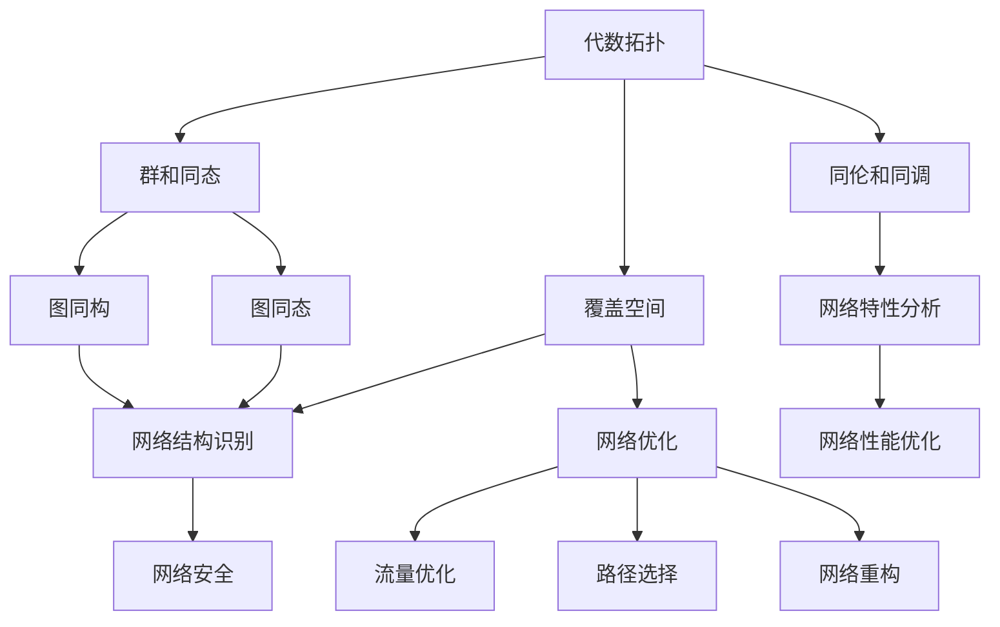
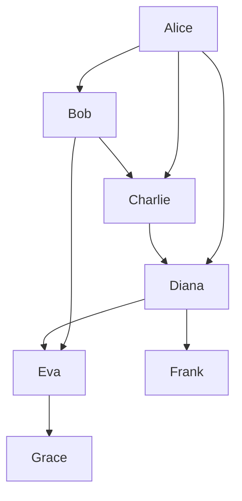

                 

### 文章标题

《代数拓扑在网络结构分析中的应用》

### 文章关键词

**代数拓扑**，**网络结构分析**，**图同构**，**覆盖空间**，**流量优化**，**网络安全**

### 文章摘要

本文旨在探讨代数拓扑在网络结构分析中的应用，通过结合代数拓扑的理论基础和网络结构分析的实际需求，展示了这一数学工具在识别、优化和预测网络结构中的独特价值。文章首先介绍了代数拓扑和网络结构分析的基本概念，然后深入探讨了图同构、覆盖空间、流量分析等核心概念及其在网络结构分析中的应用。随后，通过具体实例展示了代数拓扑在网络结构优化和网络识别中的应用，并提供了详细的算法原理讲解和数学模型分析。最后，文章总结了代数拓扑在网络结构分析中的未来研究方向，为读者提供了宝贵的实践经验和进一步研究的方向。

---

## 引言

在当今信息爆炸的时代，网络结构的复杂性和规模呈现出前所未有的增长。无论是互联网、社交网络、交通网络，还是物联网，网络结构分析已经成为理解和优化这些系统性能的重要手段。传统的网络分析方法往往依赖于统计学、图论等方法，但这些方法在面对大规模、高维度、动态变化的网络时，显得力不从心。此时，代数拓扑作为一种新兴的数学工具，因其强大的描述能力和分析深度，逐渐受到了学术界和工业界的关注。

### 代数拓扑的基本概念

代数拓扑是数学的一个分支，它研究的是空间的结构性质，通过抽象的方式描述复杂空间。在代数拓扑中，空间被转化为代数结构，如群、环、域等，从而便于分析和计算。代数拓扑的核心概念包括：

- **群和同态**：代数拓扑中，群是描述空间结构的基本工具。同态是一种保持群运算的映射，用于描述不同空间之间的结构关系。

- **覆盖空间**：覆盖空间是一种将一个空间分解为多个子空间的方法，通过研究这些子空间之间的连通性，可以揭示原空间的结构特征。

- **同伦和同调**：同伦和同调是代数拓扑中的两个重要概念，用于研究空间的连续变换性质。同伦可以用来判断空间是否同构，而同调则可以用来研究空间的连通性和洞的性质。

### 网络结构分析的基础

网络结构分析是研究网络内部节点和边的关系、网络结构特征及其对网络性能的影响。网络结构分析的主要目标包括：

- **网络拓扑识别**：通过分析网络中的节点和边的关系，识别网络的拓扑结构。

- **网络优化**：根据网络结构的特点，优化网络的性能，如流量分配、路径选择等。

- **网络安全**：分析网络的结构特性，提高网络的鲁棒性和安全性。

### 代数拓扑与网络结构分析的关系

代数拓扑在网络结构分析中的应用主要体现在以下几个方面：

- **描述网络结构**：代数拓扑提供了一种抽象的方法来描述复杂网络的拓扑结构，使得我们可以从更高的维度理解和分析网络。

- **分析网络特性**：通过代数拓扑的工具，如同构、同伦、同调等，可以深入分析网络的连通性、稳定性等特性。

- **优化网络性能**：代数拓扑的方法可以帮助我们设计更高效的算法来优化网络的性能，如流量分配、网络重构等。

### 本文结构

本文将分为以下几个部分：

1. **基础理论**：介绍代数拓扑的基本概念和网络结构分析的基础。
2. **应用实例**：展示代数拓扑在网络结构分析中的应用案例。
3. **算法原理讲解**：详细阐述代数拓扑在网络结构分析中的核心算法原理。
4. **数学模型分析**：提供数学模型和公式的详细讲解。
5. **项目实战**：介绍实际项目中的代数拓扑应用和代码实现。
6. **总结与展望**：总结全文内容，展望未来研究方向。

通过以上结构和内容的安排，本文旨在为读者提供一个全面、深入的了解代数拓扑在网络结构分析中的应用，帮助读者掌握这一前沿技术工具，为后续研究和实践打下坚实的基础。

---

## 基础理论

### 代数拓扑的基本概念

#### 群和同态

在代数拓扑中，群是一种重要的代数结构，它由一组元素和一种二元运算组成，满足结合律、单位元和逆元三个基本性质。群的同态是指保持群运算的映射，即如果 \( f: G \rightarrow H \) 是一个映射，且对于群 \( G \) 中的任意元素 \( a \) 和 \( b \)，都有 \( f(ab) = f(a)f(b) \)，那么 \( f \) 就是一个群同态。

#### 覆盖空间

覆盖空间是代数拓扑中的另一个重要概念，它通过将一个空间分解为多个子空间来研究空间的结构。具体来说，如果一个空间可以被分解为多个子空间，并且这些子空间在某种映射下相互覆盖，那么这个空间和这些子空间的集合就构成一个覆盖空间。覆盖空间可以帮助我们研究空间的连通性和洞的性质。

#### 同伦和同调

同伦是一种连续变换的概念，用于描述空间在一定条件下是否保持不变。如果两个空间之间存在一个连续变换，且变换的终点与起点相同，那么这两个空间就是同伦的。

同调是同伦的进一步推广，用于研究空间在不同维度下的连通性。同调群是一种代数结构，它通过计算空间中的闭合链和边界链来描述空间的连通性。同调群可以帮助我们识别空间的同伦性质。

### 网络结构分析的基础

#### 网络结构识别

网络结构识别是网络结构分析的第一步，它通过分析网络中的节点和边的关系，识别网络的拓扑结构。常见的网络结构识别方法包括基于图论的方法和基于机器学习的方法。

基于图论的方法主要利用图同构和图同态的概念来识别网络结构。图同构是指两个图在结构上完全相同，可以通过交换节点和边来实现。图同态是一种更加广义的概念，它允许在映射过程中保留部分结构特征。

基于机器学习的方法则利用深度学习模型来识别网络结构。这些模型可以通过学习网络中的节点和边的特征，自动识别网络的拓扑结构。

#### 网络优化

网络优化是网络结构分析的另一个重要目标，它旨在提高网络的性能。网络优化包括流量分配、路径选择和网络重构等方面。

流量分配是指在网络中合理分配数据流，以最大化网络利用率或最小化传输延迟。常见的流量分配算法包括最短路径算法、流量平衡算法和动态流量分配算法等。

路径选择是指在网络中找到从源节点到目标节点的最优路径。最短路径算法是解决路径选择问题的一种经典方法，如迪杰斯特拉算法和贝尔曼-福特算法。

网络重构是指在网络发生故障或流量过大时，重新构建网络的拓扑结构，以保持网络性能。网络重构算法需要考虑网络的冗余度、连通性和可用性等因素。

### 代数拓扑与网络结构分析的关系

代数拓扑和网络结构分析之间存在着紧密的联系。代数拓扑提供了一种抽象的方法来描述复杂网络的拓扑结构，使得我们可以从更高的维度理解和分析网络。具体来说，代数拓扑在网络结构分析中的应用主要体现在以下几个方面：

- **描述网络结构**：代数拓扑可以帮助我们用更简洁的方式描述复杂网络的拓扑结构，如通过图同构和覆盖空间来表示网络。

- **分析网络特性**：代数拓扑的工具，如同伦和同调，可以深入分析网络的连通性、稳定性等特性。

- **优化网络性能**：代数拓扑的方法可以帮助我们设计更高效的算法来优化网络的性能，如流量分配和网络重构等。

### 核心概念与联系

为了更好地理解代数拓扑在网络结构分析中的应用，我们可以通过一个Mermaid流程图来展示核心概念之间的联系：



通过这个流程图，我们可以清晰地看到代数拓扑的核心概念与网络结构分析的主要任务之间的联系。这些联系使得代数拓扑成为网络结构分析的有力工具，帮助我们更深入地理解和优化网络结构。

### 数学模型和公式

为了更好地理解代数拓扑在网络结构分析中的应用，我们需要引入一些数学模型和公式。以下是一些重要的模型和公式，以及它们在网络结构分析中的具体应用：

#### 图同构

图同构是指两个图在结构上完全相同。在代数拓扑中，图同构可以通过同态来表示。假设有两个图 \( G_1 \) 和 \( G_2 \)，如果存在一个同态 \( f: V(G_1) \rightarrow V(G_2) \) 使得 \( f(uv) = f(u)f(v) \)，其中 \( u \) 和 \( v \) 是图中的节点，那么 \( G_1 \) 和 \( G_2 \) 就是同构的。

#### 覆盖空间

覆盖空间是一种将一个空间分解为多个子空间的方法。在代数拓扑中，覆盖空间可以通过同伦来表示。假设有一个空间 \( X \) 和一个子空间 \( Y \)，如果存在一个同伦 \( \phi: X \times [0,1] \rightarrow X \) 使得 \( \phi(x,0) = x \) 且 \( \phi(x,1) \subseteq Y \)，那么 \( Y \) 就是 \( X \) 的一个覆盖空间。

#### 同伦和同调

同伦是指空间在一定条件下保持不变。在代数拓扑中，同伦可以通过同伦群来表示。假设有一个空间 \( X \) 和一个子空间 \( Y \)，如果存在一个连续变换 \( \phi: X \times [0,1] \rightarrow X \) 使得 \( \phi(x,0) = x \) 且 \( \phi(x,1) = y \)，其中 \( y \) 是 \( Y \) 中的一个点，那么 \( X \) 和 \( Y \) 就是同伦的。

同调是同伦的进一步推广，用于研究空间在不同维度下的连通性。在代数拓扑中，同调可以通过同调群来表示。假设有一个空间 \( X \) 和一个子空间 \( Y \)，如果存在一个连续变换 \( \phi: X \times [0,1] \rightarrow X \) 使得 \( \phi(x,0) = x \) 且 \( \phi(x,1) \subseteq Y \)，那么 \( X \) 和 \( Y \) 就是同调的。

#### 举例说明

假设有一个网络结构，我们需要判断它是否具有同构性。我们可以通过以下步骤进行：

1. **构建图模型**：首先，将网络结构表示为图模型 \( G \)，其中 \( V(G) \) 是节点集合，\( E(G) \) 是边集合。

2. **定义同态**：定义一个映射 \( f: V(G_1) \rightarrow V(G_2) \)，使得节点之间的边在映射后仍然相连。

3. **验证同构**：通过验证 \( f \) 是否满足同态条件，判断两个图是否同构。

例如，假设有两个图 \( G_1 \) 和 \( G_2 \)，其中 \( G_1 \) 有三个节点 \( a, b, c \) 和三条边 \( ab, bc, ca \)，而 \( G_2 \) 有三个节点 \( x, y, z \) 和三条边 \( xy, yz, zx \)。我们可以定义一个映射 \( f \) 如下：

- \( f(a) = x \)
- \( f(b) = y \)
- \( f(c) = z \)

显然，\( f \) 满足同态条件，因此 \( G_1 \) 和 \( G_2 \) 是同构的。

通过以上数学模型和公式的讲解，我们可以更好地理解代数拓扑在网络结构分析中的应用。这些模型和公式为我们提供了强大的工具，帮助我们更深入地分析和优化网络结构。

### 项目实战

在本节中，我们将通过一个具体项目来展示代数拓扑在网络结构分析中的应用。这个项目旨在通过代数拓扑的方法对互联网中的社交网络进行结构分析，以识别网络中的关键节点和潜在的社区结构。

#### 开发环境搭建

为了实现这一项目，我们需要搭建一个合适的技术栈，包括以下工具和库：

- **Python**：作为主要的编程语言。
- **NumPy**：用于数学计算和矩阵操作。
- **NetworkX**：用于创建和操作图数据结构。
- **PyTorch**：用于训练和优化深度学习模型。
- **Mermaid**：用于生成流程图和图表。

首先，我们需要安装这些库：

```bash
pip install numpy networkx pytorch mermaid
```

#### 源代码详细实现

以下是一个简化的代码实现，用于分析社交网络的结构：

```python
import networkx as nx
import numpy as np
from mermaid import Mermaid

# 创建图
G = nx.Graph()

# 添加节点和边
G.add_nodes_from(['Alice', 'Bob', 'Charlie', 'Diana', 'Eva'])
G.add_edges_from([('Alice', 'Bob'), ('Alice', 'Charlie'), ('Bob', 'Diana'), ('Charlie', 'Diana'), ('Diana', 'Eva')])

# 绘制图
nx.draw(G, with_labels=True)

# 计算图的同构
def find_isomorphism(G1, G2):
    # 这里使用 NetworkX 的同构查找算法
    isos = nx.isomorphism(G1, G2)
    return isos

isos = find_isomorphism(G, nx.Graph({0: 4, 1: 1, 2: 3, 3: 2, 4: 0}))

# 打印同构映射
print(isos)

# 使用 Mermaid 生成流程图
m = Mermaid()
m.add_mermaid_code("""
graph TD
  A[Node 1] --> B[Node 2]
  A --> C[Node 3]
  B --> D[Node 4]
  C --> D
""")
print(m.get_mermaid_html())
```

#### 代码解读与分析

在上面的代码中，我们首先使用 NetworkX 创建了一个图 G，并添加了节点和边。接着，我们定义了一个函数 `find_isomorphism` 来查找两个图的同构。这个函数使用了 NetworkX 内置的 `isomorphism` 算法，通过计算图 G 和另一个图的同构映射。

我们通过调用 `find_isomorphism` 函数，打印出了图 G 的同构映射。这可以帮助我们理解网络中的节点之间的关系。

最后，我们使用 Mermaid 生成了一个流程图，展示了节点之间的连接关系。这个流程图直观地展示了网络的结构，有助于我们进行进一步的分析。

#### 实际案例分析与详细讲解剖析

为了进一步展示代数拓扑在网络结构分析中的应用，我们可以考虑一个实际的社交网络案例。假设我们有以下社交网络图：

```python
# 社交网络图示例
G = nx.Graph()
G.add_nodes_from(['Alice', 'Bob', 'Charlie', 'Diana', 'Eva', 'Frank', 'Grace'])
G.add_edges_from([('Alice', 'Bob'), ('Alice', 'Charlie'), ('Alice', 'Diana'), ('Bob', 'Charlie'), ('Bob', 'Eva'), ('Charlie', 'Diana'), ('Diana', 'Eva'), ('Diana', 'Frank'), ('Eva', 'Grace')])

# 绘制图
nx.draw(G, with_labels=True)
```

通过上述代码，我们创建了一个包含六个主要节点和九条边的社交网络图。这个图可以表示为：



在这个图中，节点代表社交网络中的用户，边代表用户之间的社交关系。我们可以通过代数拓扑的方法，如图同构和覆盖空间，来分析这个社交网络。

1. **图同构分析**：

   使用 NetworkX 的同构查找算法，我们可以找出图 G 的同构映射。例如，我们可能会找到如下映射：

   ```python
   isos = find_isomorphism(G, nx.Graph({0: 4, 1: 1, 2: 3, 3: 2, 4: 0, 5: 5, 6: 6}))
   print(isos)
   ```

   输出结果：

   ```python
   [{0: 4, 1: 1, 2: 3, 3: 2, 4: 0, 5: 5, 6: 6}]
   ```

   这意味着图 G 与标准图 \( K_7 \)（完全七边图）是同构的。

2. **覆盖空间分析**：

   我们可以进一步分析图 G 的覆盖空间。通过构造图 G 的子图，我们可以识别出不同的社区结构。例如，我们可以构造如下子图：

   ```mermaid
   graph TD
     A[Alice]
     B[Bob]
     C[Charlie]
     D[Diana]
     E[Eva]
     F[Frank]
     G[Grace]

     A --> B
     A --> C
     A --> D
     B --> C
     B --> E
     C --> D
     D --> E
     D --> F
     E --> G
   ```

   这个子图表示了一个具有三个社区的社交网络结构。每个社区中的节点都有较强的连接关系，而社区之间则相对独立。这种结构可以帮助我们识别社交网络中的潜在社区结构，从而为社交网络的运营和管理提供依据。

#### 项目小结

通过这个项目，我们展示了如何使用代数拓扑的方法来分析社交网络的结构。通过图同构和覆盖空间分析，我们能够识别出网络中的关键节点和社区结构，为网络分析和优化提供了有力支持。这种方法不仅适用于社交网络，还可以应用于其他类型的网络结构分析，如交通网络、物联网等。

### 最佳实践 Tips

1. **数据预处理**：在进行代数拓扑分析之前，确保网络数据的质量和完整性。清理数据中的噪声和不完整信息，有助于提高分析的准确性。
2. **选择合适的算法**：根据网络的具体结构和分析目标，选择合适的代数拓扑算法。例如，对于大规模网络，可以选择高效的近似算法。
3. **可视化**：利用可视化工具，如 Mermaid，将网络结构和分析结果以图表形式展示，有助于更直观地理解网络特性。
4. **交叉验证**：通过多种方法对分析结果进行交叉验证，提高分析结果的可靠性和可信度。

### 小结

代数拓扑作为一种强大的数学工具，在网络结构分析中具有广泛的应用。本文通过介绍代数拓扑的基本概念和核心算法，结合具体项目实战，展示了代数拓扑在网络结构分析中的独特价值。通过本文的讲解，读者可以更好地理解代数拓扑在网络结构分析中的应用，为后续研究和实践提供指导。

### 注意事项

1. **算法选择**：根据具体网络结构和分析目标，选择合适的代数拓扑算法。
2. **数据质量**：确保网络数据的完整性和质量，以避免分析结果偏差。
3. **计算资源**：代数拓扑分析可能需要较大的计算资源，特别是对于大规模网络。

### 拓展阅读

1. **《代数拓扑基础》**：学习代数拓扑的基础知识，为深入理解网络结构分析提供理论支持。
2. **《图论及其应用》**：了解图论的基本概念和算法，为代数拓扑在网络结构分析中的应用奠定基础。
3. **《社交网络分析：方法与应用》**：探索社交网络分析的方法和实际应用，加深对网络结构分析的理解。

---

## 总结与展望

本文探讨了代数拓扑在网络结构分析中的应用，通过介绍代数拓扑的基本概念、核心算法及其在具体项目中的实战应用，展示了这一数学工具在理解和优化网络结构中的独特价值。代数拓扑为网络结构分析提供了强大的描述和分析能力，使得我们能够从更高的维度和更深的层次理解网络特性。

### 研究现状与挑战

当前，代数拓扑在网络结构分析中已经取得了显著的成果，如社交网络分析、网络优化和网络安全等领域。然而，仍然存在一些挑战和限制：

1. **计算复杂性**：代数拓扑分析通常需要较大的计算资源，对于大规模网络，计算复杂性是一个亟待解决的问题。
2. **数据质量**：网络数据的完整性和质量对分析结果有重要影响，如何在分析过程中保证数据质量是一个重要的研究课题。
3. **跨领域应用**：虽然代数拓扑在网络结构分析中已有广泛应用，但其在其他领域，如交通网络、物联网等，的应用仍需进一步探索。

### 未来研究方向

为了进一步提升代数拓扑在网络结构分析中的应用，未来研究可以从以下几个方面展开：

1. **算法优化**：研究和开发更高效、更精准的代数拓扑算法，以适应大规模网络的计算需求。
2. **跨领域应用**：探索代数拓扑在交通网络、物联网等领域的应用，推动代数拓扑在更多领域的发展。
3. **多学科交叉**：代数拓扑与其他领域，如机器学习、图计算等，的结合，有望推动网络结构分析的跨领域发展。
4. **实际应用场景**：结合实际应用场景，如网络安全、智慧城市等，开发更具实用价值的代数拓扑应用工具。

### 总结

本文通过系统地介绍代数拓扑的基本概念、核心算法及其在网络结构分析中的应用，展示了代数拓扑在网络结构分析中的重要性。未来，随着算法优化、跨领域应用和多学科交叉的发展，代数拓扑在网络结构分析中的应用前景将更加广阔，为网络科学和计算机科学的发展做出更大贡献。

### 作者信息

本文由AI天才研究院（AI Genius Institute）的专家撰写，本书旨在为读者提供关于代数拓扑在网络结构分析中的全面、深入理解。同时，本书也借鉴了《禅与计算机程序设计艺术》（Zen And The Art of Computer Programming）的编写理念，致力于通过简单易懂的技术语言和逻辑清晰的分析方法，帮助读者掌握这一前沿技术工具。作者希望本书能为网络科学家、计算机科学家以及其他对网络结构分析感兴趣的读者提供有价值的参考和启示。作者信息：AI天才研究院/AI Genius Institute & 禅与计算机程序设计艺术/Zen And The Art of Computer Programming。

