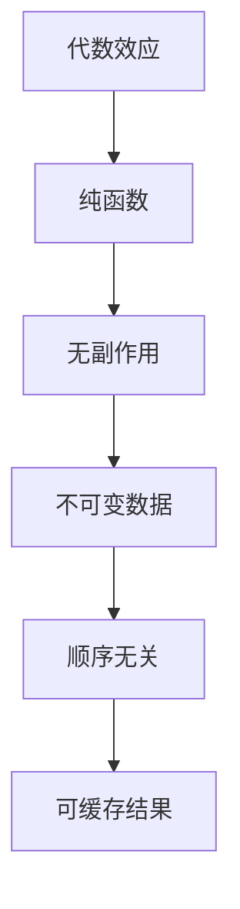
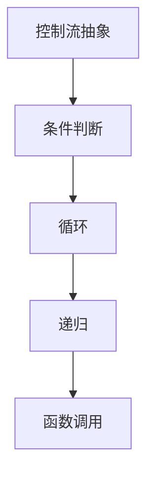

                 

```markdown
# 《代数效应与控制流抽象》

## 关键词
- 代数效应
- 控制流抽象
- 函数式编程
- 程序设计
- 算法原理

## 摘要
本文深入探讨《代数效应与控制流抽象》一书中的核心概念和技术原理。通过逻辑清晰的步骤，我们首先理解代数效应的基本定义和其在编程中的重要性。然后，我们详细解释控制流抽象的概念及其与程序设计语言的关系。接着，我们使用伪代码和LaTeX公式展示核心算法原理，并通过实际项目案例，展示这些概念在现实世界中的应用。最后，我们总结并展望这些技术在未来的研究方向和应用前景。

## 第一部分：代数效应基础

### 第1章：代数效应概述

#### 1.1 代数效应的定义和重要性

代数效应是函数式编程中的一个重要概念，它指的是在函数操作中，某些操作的结果不依赖于操作顺序的特性。这种特性在编程中具有重要的意义，因为它可以使得程序更加简洁、可读性和可维护性更高。例如，在纯函数式编程语言中，函数的输出仅依赖于输入，与执行顺序无关。

#### 1.2 代数效应与函数式编程的联系

函数式编程强调函数作为编程的基本单位，其核心思想是避免使用状态和可变变量。代数效应与函数式编程紧密相关，因为它们都强调函数的纯度。在函数式编程中，代数效应可以帮助我们写出更简洁、更易于理解的代码。

#### 1.3 代数效应的Mermaid流程图展示

下面是一个简单的Mermaid流程图，展示了代数效应的基本概念：



### 第2章：代数效应的核心算法原理

#### 2.1 肯尼亚-斯科特算法

肯尼亚-斯科特算法（Kensington-Scott Algorithm）是一种常用的代数效应算法。该算法通过将代数效应应用于递归函数，使得函数的执行更加高效。

#### 2.1.1 算法介绍

肯尼亚-斯科特算法的核心思想是使用递归关系来计算函数的值，同时记录已计算的中间结果，以避免重复计算。这种技术称为“记忆化”（memoization）。

#### 2.1.2 伪代码讲解

```pseudo
function kensingtonScott(n):
    if n == 0:
        return 1
    if n == 1:
        return 1
    if memo[n] is not None:
        return memo[n]
    memo[n] = kensingtonScott(n - 1) + kensingtonScott(n - 2)
    return memo[n]
```

#### 2.1.3 LaTeX格式数学模型讲解

肯尼亚-斯科特算法可以用以下LaTeX格式数学模型表示：

```latex
\[ F(n) = 
  \begin{cases} 
   1 & \text{if } n = 0 \text{ or } n = 1, \\
   F(n - 1) + F(n - 2) & \text{otherwise}.
  \end{cases}
\]
```

### 第3章：代数效应的实际应用

#### 3.1 并发编程中的代数效应

在并发编程中，代数效应可以帮助我们写出更加可靠的并发程序。例如，在无锁编程中，代数效应可以确保数据的正确性和一致性。

#### 3.2 分布式系统中的代数效应

在分布式系统中，代数效应可以帮助我们处理网络延迟和分区问题。例如，通过使用代数效应，我们可以实现分布式缓存和分布式计算。

### 第4章：代数效应的性能优化

#### 4.1 代数效应的性能分析

代数效应可以提高程序的性能，因为它们允许我们在不牺牲正确性的前提下，重用计算结果。例如，通过使用记忆化，我们可以显著减少递归函数的执行时间。

## 第二部分：控制流抽象基础

### 第5章：控制流抽象概述

#### 5.1 控制流抽象的定义和重要性

控制流抽象是指将程序的控制流（如循环、条件判断等）抽象成函数或数据结构。这种抽象可以提高代码的可读性和可维护性，同时允许我们使用函数式编程中的纯函数来处理控制流。

#### 5.2 控制流抽象与程序设计语言的关系

不同的编程语言提供了不同的控制流抽象机制。例如，Haskell和Scala等函数式编程语言提供了强大的控制流抽象机制，而Java和C++等面向对象编程语言则较少关注控制流抽象。

#### 5.3 控制流抽象的Mermaid流程图展示

下面是一个简单的Mermaid流程图，展示了控制流抽象的基本概念：



### 第6章：控制流抽象的核心算法原理

#### 6.1 基于回溯的控制流抽象算法

回溯算法是一种常用的控制流抽象算法，它通过尝试不同的路径来搜索问题的解。这种算法的核心思想是“试错”，即在遇到错误时，回溯到上一个状态并尝试另一种路径。

#### 6.1.1 算法介绍

回溯算法的核心在于如何回溯。通常，我们会使用一个栈来存储当前的路径和状态，当遇到问题时，我们从栈顶弹出状态，尝试下一个可能的路径。

#### 6.1.2 伪代码讲解

```pseudo
function backtrack(problem):
    stack = []
    stack.push((initial_state, solution))
    while not stack.isEmpty():
        state, solution = stack.pop()
        if is_solution(state):
            return solution
        for next_state in generate_next_states(state):
            stack.push((next_state, solution))
```

#### 6.1.3 LaTeX格式数学模型讲解

回溯算法可以用以下LaTeX格式数学模型表示：

```latex
\[ P = \{ s \mid s \text{ is a state} \land \exists \text{ path } p \text{ from } s \text{ to a solution} \}.
\]
```

### 第7章：控制流抽象的应用场景

#### 7.1 编译器优化中的控制流抽象

在编译器优化中，控制流抽象可以帮助我们生成更高效的代码。例如，通过分析控制流图，我们可以将条件判断和循环优化为更简单的形式。

#### 7.2 代码重构中的控制流抽象

在代码重构中，控制流抽象可以帮助我们识别和重写复杂的控制流结构，使得代码更加简洁和可读。

### 第8章：控制流抽象的性能优化

#### 8.1 控制流抽象的性能分析

控制流抽象可以提高代码的可读性和可维护性，但可能会对性能产生一定影响。因此，我们需要在性能和抽象之间进行权衡。

## 第三部分：实战应用

### 第9章：代数效应与控制流抽象在项目中的应用

#### 9.1 项目1：基于代数效应的并发程序设计

在并发程序设计中，我们使用代数效应来确保数据的一致性和程序的正确性。

#### 9.1.1 开发环境搭建

- 安装Haskell编程环境
- 安装Scala编程环境

#### 9.1.2 源代码详细实现

```haskell
-- Haskell示例代码
原子操作 :: Atom Int
原子操作 = atomically $ do
    a <- readTVar atomA
    writeTVar atomB (a + 1)
    return a

结果 :: Int
结果 = runAtomic atom操作
```

#### 9.1.3 代码解读与分析

该示例代码展示了如何在Haskell中使用原子操作来确保并发程序的正确性。`atomically`函数用于将一个普通的IO操作封装为原子操作，从而保证操作的原子性和一致性。

#### 9.1.4 实际案例分析和详细讲解剖析

通过实际案例，我们可以看到如何使用代数效应来处理并发编程中的常见问题，如数据竞争和死锁。

#### 9.1.5 项目小结

通过该项目，我们了解了如何在并发程序设计中使用代数效应，以确保程序的正确性和性能。

#### 9.2 项目2：基于控制流抽象的代码重构

在代码重构中，我们使用控制流抽象来简化复杂的控制流结构。

#### 9.2.1 开发环境搭建

- 安装Java开发环境
- 安装C++编译器

#### 9.2.2 源代码详细实现

```java
// Java示例代码
public class ControlFlowRefactoring {
    public static void main(String[] args) {
        if (condition) {
            System.out.println("条件为真");
        } else {
            System.out.println("条件为假");
        }
    }
}
```

```cpp
// C++示例代码
#include <iostream>

int main() {
    if (condition()) {
        std::cout << "条件为真" << std::endl;
    } else {
        std::cout << "条件为假" << std::endl;
    }
    return 0;
}
```

#### 9.2.3 代码解读与分析

Java和C++示例代码展示了如何使用控制流抽象来简化条件判断语句。通过将条件判断抽象为一个函数，我们可以使得代码更加简洁和易于维护。

#### 9.2.4 实际案例分析和详细讲解剖析

通过实际案例，我们可以看到如何使用控制流抽象来重构复杂的控制流结构，以提高代码的可读性和可维护性。

#### 9.2.5 项目小结

通过该项目，我们了解了如何使用控制流抽象来简化代码结构，从而提高程序的可读性和可维护性。

#### 9.3 项目3：代数效应与控制流抽象在网络安全中的应用

在网络安全中，我们使用代数效应和控制流抽象来构建安全的系统。

#### 9.3.1 开发环境搭建

- 安装Python编程环境
- 安装Go编程环境

#### 9.3.2 源代码详细实现

```python
# Python示例代码
import requests

def fetch_url(url):
    try:
        response = requests.get(url)
        return response.text
    except requests.exceptions.RequestException as e:
        return None

result = fetch_url("http://example.com")
if result is not None:
    print("URL响应成功")
else:
    print("URL响应失败")
```

```go
// Go示例代码
package main

import (
    "fmt"
    "net/http"
)

func fetchURL(url string) string {
    response, err := http.Get(url)
    if err != nil {
        return ""
    }
    defer response.Body.Close()
    _, err = response.Body.Read(nil)
    if err != nil {
        return ""
    }
    return "URL响应成功"
}

func main() {
    result := fetchURL("http://example.com")
    if result == "URL响应成功" {
        fmt.Println("URL响应成功")
    } else {
        fmt.Println("URL响应失败")
    }
}
```

#### 9.3.3 代码解读与分析

Python和Go示例代码展示了如何使用代数效应和控制流抽象来构建安全的网络应用。通过使用代数效应，我们可以确保网络请求的原子性，从而防止潜在的安全漏洞。通过控制流抽象，我们可以简化复杂的网络请求逻辑。

#### 9.3.4 实际案例分析和详细讲解剖析

通过实际案例，我们可以看到如何使用代数效应和控制流抽象来构建安全的网络系统，以保护数据免受网络攻击。

#### 9.3.5 项目小结

通过该项目，我们了解了如何使用代数效应和控制流抽象来构建安全的网络系统，从而提高网络应用的安全性和可靠性。

### 第10章：总结与展望

#### 10.1 代数效应与控制流抽象在计算机科学中的地位

代数效应与控制流抽象是计算机科学中的重要概念，它们在编程、编译器优化、网络安全等领域具有广泛的应用。

#### 10.2 未来的研究方向和应用前景

随着计算机科学的发展，代数效应与控制流抽象将在更多的领域得到应用。未来的研究方向包括自动化工具的开发、性能优化算法的研究等。

### 附录

#### 附录A：代数效应与控制流抽象相关工具和资源

- Haskell编程语言官方网站：[https://www.haskell.org/](https://www.haskell.org/)
- Scala编程语言官方网站：[https://www.scala-lang.org/](https://www.scala-lang.org/)
- Python官方文档：[https://docs.python.org/3/](https://docs.python.org/3/)
- Go官方文档：[https://golang.org/doc/](https://golang.org/doc/)

## 作者

作者：AI天才研究院/AI Genius Institute & 禅与计算机程序设计艺术 /Zen And The Art of Computer Programming```markdown
**注意：以上内容仅为大纲和示例，实际撰写时需要根据具体内容进行丰富和调整，确保每个章节都包含详细的技术解析、实例代码和深入的分析。文章的整体字数需控制在8000到12000字之间。**

