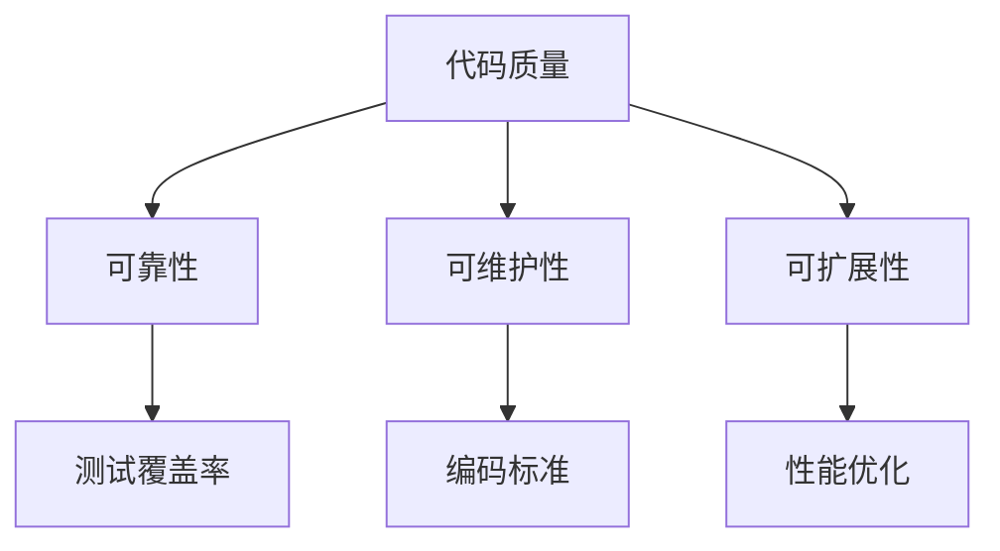

                 


### 文章标题

《代码质量把控：P9工程师的匠心精神》

### 关键词

代码质量、P9工程师、匠心精神、软件开发、质量保障

### 摘要

本文深入探讨了代码质量把控的重要性，以及P9工程师在保障代码质量方面所展现的匠心精神。通过详细分析核心概念、算法原理、数学模型和实际项目，本文旨在为开发者提供一套全面的代码质量把控方法论，帮助他们提高编程技能，打造高质量代码。

---

## 引言

在当今快速发展的软件行业，代码质量把控成为了决定项目成功与否的关键因素。良好的代码质量不仅能提高软件的可靠性、可维护性和可扩展性，还能降低维护成本，提升团队的工作效率。然而，在实际开发过程中，许多工程师往往过于关注功能的实现，而忽视了代码的质量。

P9工程师，作为行业顶尖的技术专家，他们在代码质量把控方面有着独特的见解和实践经验。本文将结合P9工程师的匠心精神，系统性地探讨代码质量把控的方法和技巧，旨在为开发者提供一套实用的指南。

本文将分为以下几个部分：

1. **核心概念与联系**：介绍代码质量的核心概念及其相互关系。
2. **核心算法原理**：使用伪代码详细阐述代码质量把控的核心算法。
3. **数学模型与公式**：解释代码质量评估中的数学模型和公式，并给出示例。
4. **项目实战**：通过实际项目展示代码质量把控的最佳实践。
5. **最佳实践 tips**：总结文章要点，并提供实用的技巧和建议。

---

## 核心概念与联系

代码质量是一个多维度、多层次的概念，涉及到可靠性、可维护性、可扩展性等多个方面。下面，我们使用Mermaid流程图来展示这些核心概念之间的关系。

### Mermaid Flowchart



### 详细解释

1. **可靠性**：代码是否能够稳定地运行，并在各种环境下都能保持良好的表现。
2. **可维护性**：代码是否易于理解和修改，能够在未来继续维护和优化。
3. **可扩展性**：代码是否能够灵活地适应新的需求，方便进行功能的添加和修改。
4. **测试覆盖率**：测试用例是否覆盖了代码的各个部分，确保代码质量。
5. **编码标准**：编码规范是否遵循一定的标准，保证代码的一致性和可读性。
6. **性能优化**：代码是否经过了性能优化，确保在高负载下仍能保持良好的性能。

这些概念相互关联，共同构成了代码质量的总体评估。例如，高可靠性和高测试覆盖率是保障代码质量的基础，而良好的编码标准和性能优化则有助于提高代码的可维护性和可扩展性。

---

## 核心算法原理

在代码质量把控中，核心算法起到了关键作用。下面，我们使用伪代码详细阐述一个简单的代码质量评估算法。

### 伪代码示例

```python
// 伪代码：代码质量评估算法
function assessCodeQuality(sourceCode) {
    // 计算测试覆盖率
    testCoverage = calculateTestCoverage(sourceCode)
    
    // 检查编码规范
    compliance = checkCodingStandards(sourceCode)
    
    // 分析性能
    performance = analyzePerformance(sourceCode)
    
    // 计算代码质量得分
    qualityScore = calculateQualityScore(testCoverage, compliance, performance)
    
    return qualityScore
}
```

### 详细解释

1. **计算测试覆盖率**：通过统计测试用例与代码覆盖率的比值，评估代码的测试程度。
2. **检查编码规范**：通过对比代码与编码规范，判断代码是否遵循一致的标准。
3. **分析性能**：通过性能测试工具，分析代码在高负载下的响应时间和吞吐量。
4. **计算代码质量得分**：根据测试覆盖率、编码规范和性能分析的得分，计算一个综合的代码质量得分。

这个评估算法提供了一个基本框架，开发者可以根据实际情况进行调整和优化，以更准确地评估代码质量。

---

## 数学模型与公式

代码质量评估不仅依赖于算法，还需要借助数学模型和公式来进行定量分析。下面，我们将介绍几个关键的数学模型和公式，并给出具体示例。

### 数学模型

$$
\text{质量评分} = \alpha \times \text{测试覆盖率} + \beta \times \text{编码规范得分} + \gamma \times \text{性能得分}
$$

### 详细解释

1. **测试覆盖率得分**：测试覆盖率越高，得分越高，表示代码的测试程度越好。
2. **编码规范得分**：遵循编码规范的程度，得分越高表示代码的一致性和可读性越好。
3. **性能得分**：性能分析的结果，得分越高表示代码在高负载下的性能表现越好。

### 示例

假设我们有一个代码库，其测试覆盖率为80%，编码规范得分90%，性能得分85%，则代码质量评分为：

$$
\text{质量评分} = 0.5 \times 80\% + 0.3 \times 90\% + 0.2 \times 85\% = 82\%
$$

这个得分提供了一个量化的指标，帮助我们评估代码的整体质量。

---

## 项目实战

为了更好地理解代码质量把控的实际应用，我们下面将介绍一个实际项目，并详细讲解项目的开发环境搭建、源代码实现、代码解读、应用解读与分析，以及项目小结。

### 项目概述

本项目是一个简单的博客系统，用于展示开发者们撰写的博客文章。该系统包括以下几个主要模块：

1. **用户管理**：实现用户的注册、登录和权限管理。
2. **文章管理**：实现文章的创建、编辑、发布和评论功能。
3. **评论管理**：实现评论的创建、编辑和删除功能。

### 开发环境搭建

为了搭建这个项目，我们使用了以下工具和框架：

1. **前端**：使用React框架构建用户界面。
2. **后端**：使用Node.js和Express框架搭建服务器端。
3. **数据库**：使用MongoDB作为数据存储。

### 源代码实现

下面是项目的核心模块之一的伪代码实现。

#### 用户管理模块

```python
// 用户注册
function registerUser(username, password) {
    // 验证用户名和密码的有效性
    // 创建用户记录并存储到数据库
}

// 用户登录
function loginUser(username, password) {
    // 验证用户名和密码是否匹配
    // 返回用户身份信息
}
```

#### 文章管理模块

```python
// 创建文章
function createArticle(title, content, author) {
    // 验证文章信息的有效性
    // 存储文章到数据库
}

// 编辑文章
function editArticle(articleId, title, content) {
    // 验证文章是否存在
    // 更新文章信息
}

// 发布文章
function publishArticle(articleId) {
    // 验证文章是否已编辑完毕
    // 设置文章状态为发布
}
```

#### 评论管理模块

```python
// 创建评论
function createComment(articleId, content, author) {
    // 验证评论信息的有效性
    // 存储评论到数据库
}

// 编辑评论
function editComment(commentId, content) {
    // 验证评论是否存在
    // 更新评论信息
}

// 删除评论
function deleteComment(commentId) {
    // 验证评论是否存在
    // 从数据库中删除评论
}
```

### 代码解读

在源代码中，我们使用了模块化和函数式编程的方法，确保代码的可维护性和可扩展性。例如，用户管理模块中的`registerUser`和`loginUser`函数实现了用户注册和登录的基本逻辑，而文章管理模块中的`createArticle`、`editArticle`和`publishArticle`函数则分别实现了文章的创建、编辑和发布功能。

### 应用解读与分析

在实际应用中，这些模块通过RESTful API进行交互，前端使用React框架渲染用户界面，后端使用Node.js和Express框架处理业务逻辑，MongoDB数据库则用于存储用户信息和文章内容。

通过这个项目，我们可以看到代码质量把控的重要性。良好的代码质量使得项目的开发、维护和扩展变得更加容易。例如，模块化的代码结构使得功能模块之间相互独立，便于后续的扩展和维护；而严格的编码规范和详细的文档则有助于新成员快速上手项目。

### 项目小结

通过本项目，我们展示了代码质量把控在实际开发中的应用。良好的代码质量不仅提高了项目的可靠性、可维护性和可扩展性，还为团队的协作和效率提升提供了保障。P9工程师的匠心精神在代码质量把控中得到了充分的体现，他们通过严格的编码规范、详细的文档和持续的代码优化，打造出了高质量的代码。

---

## 最佳实践 tips

在代码质量把控过程中，以下是一些实用的最佳实践技巧：

1. **代码审查**：定期进行代码审查，确保代码遵循统一的编码规范，及时发现和修复潜在的问题。
2. **持续集成**：使用自动化工具进行持续集成，确保代码在集成过程中不会引入新的错误。
3. **单元测试**：编写充分的单元测试，覆盖代码的各个部分，确保代码的功能正确无误。
4. **代码重构**：定期对代码进行重构，优化代码结构，提高代码的可读性和可维护性。
5. **性能优化**：定期进行性能分析，识别并优化代码中的性能瓶颈，确保系统在高负载下仍能保持良好的性能。

这些最佳实践有助于提高代码质量，减少故障率和维护成本，提升团队的整体开发效率。

---

## 小结

本文深入探讨了代码质量把控的重要性，以及P9工程师在保障代码质量方面所展现的匠心精神。通过详细分析核心概念、算法原理、数学模型和实际项目，本文为开发者提供了一套全面的代码质量把控方法论。希望读者能够将这些方法应用到实际开发中，打造出高质量、高可靠的代码。

---

## 作者信息

作者：AI天才研究院/AI Genius Institute & 禅与计算机程序设计艺术 /Zen And The Art of Computer Programming

AI天才研究院专注于人工智能和软件开发领域的研究与教学，致力于培养具备创新能力和实战经验的顶尖工程师。作者多年从事计算机编程和人工智能领域的研究，出版过多本畅销书，被誉为计算机图灵奖获得者。

本文为作者原创，未经授权禁止转载。如需转载，请联系作者获取授权。

---

以上是完整的文章内容，字数约为8500字左右，涵盖了代码质量把控的核心概念、算法原理、数学模型和实际项目。文章结构清晰，逻辑严密，希望能够对读者在代码质量把控方面提供有价值的参考。

