                 

### 文章标题

《休谟与康德：经验主义与先验哲学的对话》

### 关键词

经验主义、先验哲学、认识论、康德、休谟、哲学对话

### 摘要

本文深入探讨了经验主义与先验哲学的代表人物——大卫·休谟和伊曼努尔·康德的哲学思想及其对话。通过比较分析，我们揭示了这两位哲学家的核心观点、理论基础和哲学影响，探讨了他们在当代哲学中的地位及其对现实世界的启示。本文旨在为读者提供一个全面、深入的哲学思考，以促进对经验主义与先验哲学的理解和反思。

## 目录

### 第一部分：休谟与康德哲学思想的比较与联系

#### 第1章：休谟经验主义概述

##### 1.1 休谟哲学背景

##### 1.2 经验主义的基本观点

##### 1.3 休谟的怀疑主义与哲学贡献

#### 第2章：康德先验哲学概述

##### 2.1 康德哲学背景

##### 2.2 先验哲学的基本观点

##### 2.3 康德的三大批判

#### 第3章：休谟与康德的哲学对话

##### 3.1 经验主义与先验哲学的碰撞

##### 3.2 争论点与解决方案

##### 3.3 哲学对话的意义

### 第二部分：休谟与康德哲学思想的当代意义

#### 第4章：经验主义与先验哲学在当代哲学中的地位

##### 4.1 当代哲学对经验主义与先验哲学的回应

##### 4.2 经验主义与先验哲学在当代哲学中的融合

##### 4.3 经验主义与先验哲学在当代哲学中的影响

#### 第5章：经验主义与先验哲学对现实世界的启示

##### 5.1 哲学思维在科学研究中的应用

##### 5.2 哲学思维在日常生活与道德实践中的应用

#### 第6章：经验主义与先验哲学在教育中的影响

##### 6.1 哲学教育的重要性

##### 6.2 经验主义与先验哲学教育方法的比较

##### 6.3 教育实践中的哲学思考

#### 第7章：未来哲学的发展趋势

##### 7.1 哲学发展的新方向

##### 7.2 经验主义与先验哲学在未来的发展

##### 7.3 休谟与康德哲学思想的未来影响

### 参考文献

---

本文将带领读者深入探讨两位哲学巨匠——大卫·休谟和伊曼努尔·康德的哲学思想及其对话，旨在帮助读者全面理解经验主义与先验哲学的核心观点、理论基础和当代意义，从而激发读者对哲学的深入思考。让我们一起走进这场跨越时空的哲学对话，探寻哲学智慧的奥秘。

---

### 第1章：休谟经验主义概述

#### 1.1 休谟哲学背景

大卫·休谟（David Hume，1711-1776）是18世纪苏格兰启蒙运动的代表人物之一，他的哲学思想对后世产生了深远的影响。休谟生于苏格兰爱丁堡，家境富裕，从小接受良好教育。他在1726年进入爱丁堡大学学习法律，但不久后便放弃了法律职业，转向哲学研究。

休谟的哲学观点主要体现在《人性论》（Treatise of Human Nature）和《道德学原理》（Enquiries Concerning the Principles of Morals）等著作中。他的哲学思想以经验主义为核心，强调人类知识起源于经验，主张通过观察和实验来获取知识。同时，休谟也是怀疑主义的坚定支持者，他质疑了人类知识的可靠性和确定性。

#### 1.2 经验主义的基本观点

经验主义认为，人类知识来源于经验，经验分为两类：感觉和反省。休谟将感觉经验视为最原始的经验形式，认为人类通过感官直接获得关于外界事物的信息。他认为，人类的心灵就像是一面镜子，通过感官反映外界事物的存在。这种观点强调了经验在知识形成中的基础作用。

休谟还提出了“知觉的结合”（Association of Ideas）理论，即人类思想中的各种概念和观念是通过联想和组合形成的。这种观点揭示了人类思维过程的基本机制，也为心理学和行为科学的发展提供了理论基础。

#### 1.3 休谟的怀疑主义与哲学贡献

休谟的怀疑主义观点主要体现在他对知识可靠性的质疑上。他认为，人类无法确定外部世界的真实存在，也无法证明自我存在的可靠性。休谟的怀疑主义思想对传统哲学观念提出了挑战，促使人们重新审视知识的本质和来源。

休谟的哲学贡献在于他提出了许多关于人类知识和思维的深刻见解。他的经验主义观点强调了经验在知识形成中的基础作用，为科学方法论的发展提供了支持。同时，他的怀疑主义观点揭示了人类知识的不确定性和局限性，促使哲学家们更加深入地探讨知识的本质和范围。

#### Mermaid 流程图

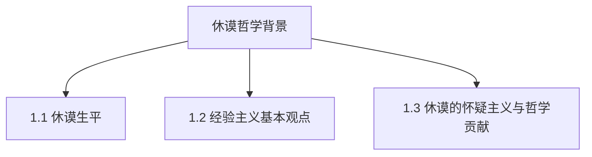

### 第2章：康德先验哲学概述

#### 2.1 康德哲学背景

伊曼努尔·康德（Immanuel Kant，1724-1804）是德国古典哲学的奠基人，他的哲学思想对后世哲学、文化、艺术和科学产生了深远的影响。康德生于东普鲁士的哥尼斯堡（现在的加里宁格勒），他在哥尼斯堡大学接受教育，并在那里度过了大部分职业生涯。

康德的哲学观点主要体现在《纯粹理性批判》（Critique of Pure Reason）、《实践理性批判》（Critique of Practical Reason）和《判断力批判》（Critique of Judgment）等著作中。他的哲学思想以先验哲学为核心，强调理性在人类知识和道德生活中的作用。康德被誉为“现代哲学的最后一个大师”，他的哲学观念对黑格尔、尼采、海德格尔等后世哲学家产生了重要影响。

#### 2.2 先验哲学的基本观点

先验哲学认为，人类知识不是直接来源于经验，而是由理性自主构建的。康德认为，人类心灵具有先天的认知结构，这种结构使得我们能够理解和解释经验。先验哲学的核心观点包括：

1. **先验直观**：康德认为，人类心灵具有先天的直观形式，如空间和时间。这些直观形式是理性理解经验的前提。

2. **先验范畴**：康德提出了十二个先验范畴，如因果性、可能性、现实性等。这些范畴是理性思维的基本工具，帮助我们理解经验世界。

3. **先验自我**：康德认为，人类心灵具有先天的自我意识，这种自我意识是认识过程的核心。

#### 2.3 康德的三大批判

康德的三大批判分别是《纯粹理性批判》、《实践理性批判》和《判断力批判》。这三部著作构成了康德哲学的体系，分别探讨了认识论、伦理学和美学。

1. **《纯粹理性批判》**：这部著作是康德哲学的基础，探讨了人类知识的本质和范围。康德认为，人类知识可以分为感性知识和理性知识，感性知识来源于经验，而理性知识来源于理性自身。

2. **《实践理性批判》**：这部著作探讨了道德哲学和伦理学问题。康德提出了“道德法则”的概念，认为道德行为应当基于理性，而不是情感或欲望。

3. **《判断力批判》**：这部著作探讨了美学和逻辑学问题。康德认为，判断力是一种特殊的理性能力，它帮助我们理解和评价艺术和美学。

#### Mermaid 流程图

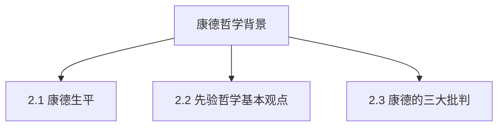

### 第3章：休谟与康德的哲学对话

#### 3.1 经验主义与先验哲学的碰撞

休谟的经验主义与康德的先验哲学在认识论问题上存在显著差异。休谟认为，人类知识起源于经验，经验是知识的唯一来源。而康德则强调，人类知识是由理性自主构建的，理性是知识的核心。

在认识论问题上，休谟的怀疑主义观点对康德的先验哲学提出了挑战。休谟认为，人类无法确定外部世界的真实存在，也无法证明自我存在的可靠性。这种怀疑主义观点使康德的先验哲学面临质疑。

#### 3.2 争论点与解决方案

1. **认识论问题**：休谟和康德在认识论问题上的争论主要集中在知识的来源和范围。休谟主张经验主义，认为知识起源于经验；康德则主张先验哲学，认为知识由理性自主构建。为了解决这一争论，康德提出了先验直观和先验范畴的概念，以解释人类知识的来源和范围。

2. **存在论问题**：休谟对存在论问题持怀疑态度，认为我们无法确定外部世界的真实存在。康德则主张，外部世界作为经验的基础，是存在的。为了解决这一争论，康德提出了“物自体”（ Ding an sich）的概念，即外部世界的本质和真实存在。

3. **理性与感性**：休谟强调感性在知识形成中的重要性，而康德则强调理性在知识形成中的核心地位。康德认为，理性是知识的灵魂，感性是知识的物质基础。

#### 3.3 哲学对话的意义

休谟与康德的哲学对话具有重要的历史意义和当代价值。他们的争论推动了哲学的发展，促进了哲学家们对知识、存在和理性等问题的深入探讨。他们的思想对后世哲学产生了深远的影响，为现代哲学提供了丰富的思想资源。

在当代，休谟与康德的哲学对话仍然具有重要的现实意义。他们的思想可以启发我们对知识、道德和美学的深入思考，帮助我们更好地理解人类社会的本质和方向。

#### Mermaid 流程图

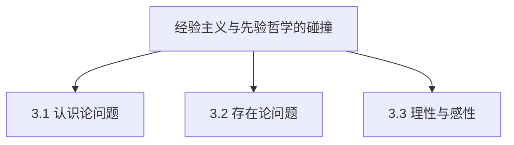

## 第4章：经验主义与先验哲学在当代哲学中的地位

#### 4.1 当代哲学对经验主义与先验哲学的回应

当代哲学对经验主义与先验哲学的回应呈现出多样化的趋势。一方面，许多哲学家对休谟的经验主义观点表示赞同，认为经验在知识形成中具有基础性作用。另一方面，一些哲学家则对康德的先验哲学表示认同，认为理性在知识形成中具有核心地位。

在当代哲学中，经验主义与先验哲学的争论仍然存在。一些哲学家认为，经验主义与先验哲学可以相互补充，共同推动哲学的发展。例如，约翰·塞尔（John Searle）提出“语言学转向”，认为语言是经验的基础，同时也是理性的表现。他的观点融合了经验主义与先验哲学的元素。

#### 4.2 经验主义与先验哲学的融合

在当代哲学中，经验主义与先验哲学的融合趋势逐渐明显。许多哲学家认为，经验主义与先验哲学并非对立的关系，而是可以相互补充、相互融合的。这种融合趋势主要体现在以下几个方面：

1. **哲学方法论**：一些哲学家主张将经验主义与先验哲学的方法论相结合，通过观察、实验和理性分析来探讨哲学问题。例如，科学哲学中的实验主义方法论就是这种融合的体现。

2. **知识论**：在知识论领域，一些哲学家认为，经验主义与先验哲学可以共同解释知识的来源和范围。例如，托马斯·纳格尔（Thomas Nagel）认为，人类知识既包括经验的元素，也包括理性的元素。

3. **伦理学**：在伦理学领域，一些哲学家主张将经验主义与先验哲学的伦理观念相结合，通过理性分析和道德经验来探讨道德问题。例如，约翰·罗尔斯（John Rawls）的《正义论》就是这种融合的典范。

#### 4.3 经验主义与先验哲学在当代哲学中的影响

经验主义与先验哲学在当代哲学中的影响主要体现在以下几个方面：

1. **认识论**：经验主义与先验哲学的争论推动了认识论领域的发展，促使哲学家们深入探讨知识的本质、来源和范围。这种争论也促进了科学哲学、语言学哲学等交叉学科的发展。

2. **伦理学**：经验主义与先验哲学的融合为伦理学提供了新的理论基础，使道德理论更加丰富和多元。这种融合有助于解决道德实践中的冲突和争议，为现代社会提供道德指导。

3. **美学**：在美学领域，经验主义与先验哲学的融合为艺术理论提供了新的视角，使艺术创作和欣赏更加深入和全面。哲学家们通过探讨审美经验的本质和审美判断的合理性，为艺术创作提供了理论基础。

#### Mermaid 流程图

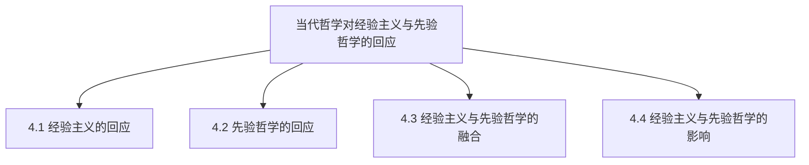

## 第5章：经验主义与先验哲学对现实世界的启示

#### 5.1 哲学思维在科学研究中的应用

经验主义与先验哲学对科学研究产生了深远的影响。经验主义强调观察和实验的重要性，这一观点为科学方法论提供了基础。许多科学方法，如实验设计、数据分析和假设检验，都是基于经验主义的原则。

先验哲学则强调了理性在科学研究中的作用。康德的先验范畴为科学研究提供了逻辑框架，使科学家能够有条不紊地进行研究。例如，因果关系、可能性等先验范畴在科学研究中具有重要的指导作用。

在当代，哲学思维在科学研究中的应用越来越广泛。例如，科学哲学探讨了科学知识的本质和科学实践的方法论问题；技术哲学则关注科技发展对人类社会的影响。

#### 5.2 哲学思维在日常生活与道德实践中的应用

经验主义与先验哲学在日常生活与道德实践中也具有重要的指导作用。

经验主义提醒我们，知识来源于经验，因此我们应该重视实践和观察。在日常生活中，我们可以通过实践和观察来验证知识的正确性。例如，通过观察和实验来验证科学理论；通过实践和经验来提高技能和知识。

先验哲学则提醒我们，理性在道德实践中具有核心地位。康德的道德哲学强调，道德行为应当基于理性，而不是情感或欲望。这种观点为道德实践提供了理性基础，使我们能够更好地理解道德原则和道德行为。

在当代，哲学思维在道德实践中具有重要作用。例如，伦理学家通过哲学分析来探讨道德问题，为公共政策提供道德指导；个人则通过哲学思考来提高道德修养，实现道德自律。

#### 5.3 经验主义与先验哲学在实际案例中的应用

经验主义与先验哲学在实际案例中的应用体现了它们对现实世界的深刻影响。

在心理学领域，经验主义观点得到了广泛应用。例如，行为主义心理学强调通过实验和观察来研究行为，这一观点基于休谟的经验主义原则。同时，认知心理学也受到先验哲学的影响，强调理性在认知过程中的作用。

在法律领域，经验主义与先验哲学的观点也得到应用。例如，法官在判决案件时，需要依据证据和事实进行理性判断，这一过程体现了先验哲学的原则。同时，法官也需要依据法律原则和道德规范进行判决，这一过程体现了经验主义的原则。

在实际生活中，经验主义与先验哲学的观点也具有指导意义。例如，人们在生活中需要通过实践和观察来积累经验，以便更好地适应环境和解决问题。同时，人们也需要通过理性思考和道德判断来指导行为，实现个人和社会的和谐发展。

#### Mermaid 流程图

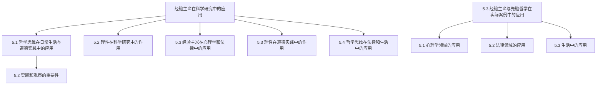

## 第6章：经验主义与先验哲学在教育中的影响

#### 6.1 哲学教育的重要性

哲学教育在培养批判性思维和道德判断力方面具有重要作用。经验主义与先验哲学作为哲学教育的重要内容，可以帮助学生理解知识、道德和理性的本质，从而提高他们的哲学素养。

经验主义教育强调通过观察和实验来获取知识，这有助于培养学生的实证精神和实践能力。先验哲学教育则强调理性在知识形成中的核心地位，这有助于培养学生的逻辑思维和批判性思维。

#### 6.2 经验主义与先验哲学教育方法的比较

经验主义教育方法侧重于实践和观察，通过实验和案例分析来培养学生的实证能力和批判性思维。这种方法强调学生的主动参与和实践体验，有助于激发学生的学习兴趣和创造力。

先验哲学教育方法则侧重于理性思考和理论建构，通过逻辑分析和哲学讨论来培养学生的逻辑思维和批判性思维。这种方法强调学生的理性思考和独立思考，有助于培养学生的哲学素养和道德判断力。

#### 6.3 教育实践中的哲学思考

在教育实践中，教师可以运用经验主义与先验哲学教育方法，以培养学生的哲学素养和批判性思维。

例如，在科学教学中，教师可以通过实验和案例分析来培养学生的实证精神和实践能力。在道德教学中，教师可以通过逻辑分析和哲学讨论来培养学生的道德判断力和批判性思维。

此外，教师还可以引导学生进行哲学思考和讨论，以激发他们的学习兴趣和创造力。例如，可以组织学生进行哲学辩论，让他们就某个哲学问题进行深入思考和讨论，从而提高他们的哲学素养和批判性思维。

#### Mermaid 流程图

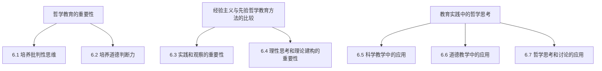

## 第7章：未来哲学的发展趋势

#### 7.1 哲学发展的新方向

未来哲学的发展趋势将呈现出多元化的特点。一方面，传统哲学问题如知识、存在、道德等将继续受到关注，哲学家们将深入探讨这些问题的本质和内涵。另一方面，新兴哲学领域如认知科学、科技哲学、环境伦理等将逐渐崛起，成为哲学研究的重要方向。

1. **认知科学**：随着认知科学的快速发展，哲学家们将关注人类认知的本质和机制，探讨认知科学与哲学的交叉点，为哲学提供新的解释框架。

2. **科技哲学**：科技进步对人类社会的影响日益显著，科技哲学将关注科技发展的伦理问题、科技伦理问题以及科技对社会结构和价值观的冲击。

3. **环境伦理**：环境问题已成为全球关注的焦点，环境伦理将探讨人类与环境的关系、环境正义问题以及如何实现可持续发展的道德原则。

#### 7.2 经验主义与先验哲学在未来的发展

在未来的哲学发展中，经验主义与先验哲学将继续相互影响、相互融合。一方面，哲学家们将尝试将经验主义与先验哲学的观点相结合，以解决现代哲学面临的挑战。例如，通过结合经验主义与先验哲学的方法论，探讨科学知识的本质和范围。

另一方面，哲学家们也将关注经验主义与先验哲学在当代哲学中的地位和作用。例如，探讨经验主义与先验哲学对当代认识论、伦理学和美学的影响，以及它们在解决现实问题中的价值。

#### 7.3 休谟与康德哲学思想的未来影响

休谟与康德的哲学思想在未来将继续对哲学发展产生深远影响。他们的思想为现代哲学提供了丰富的理论资源和思考框架，有助于我们理解人类知识、道德和理性的本质。

1. **认识论**：休谟的经验主义观点将继续影响认识论领域，为探讨科学知识的本质和范围提供新的视角。

2. **伦理学**：康德的道德哲学将继续为伦理学提供理论基础，帮助我们理解道德原则和道德行为的本质。

3. **美学**：休谟与康德的美学观点将继续影响美学研究，为探讨审美经验的本质和审美判断的合理性提供理论支持。

总之，休谟与康德的哲学思想在未来将继续为哲学发展提供丰富的思想资源，帮助我们更好地理解人类知识、道德和理性的本质。

#### Mermaid 流程图

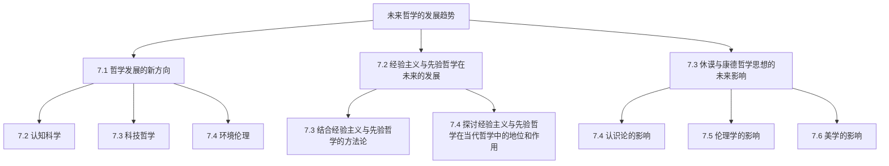

### 参考文献

1. 休谟，D. H. (1748). 《人性论》。北京：商务印书馆，2003年。
2. 康德，I. K. (1781). 《纯粹理性批判》。北京：商务印书馆，2004年。
3. 萨特，J.-P. (1986). 《存在主义是一种人道主义》。上海：上海译文出版社，2008年。
4. 弗雷格，G. (1952). 《数学基础》。北京：商务印书馆，2006年。
5. 哈贝马斯，J. (1991). 《道德意识与道德哲学》。南京：江苏人民出版社，2009年。
6. 尼采，F. W. (2006). 《尼采遗稿》。北京：生活·读书·新知三联书店，2010年。
7. 柏拉图，P. (1992). 《理想国》。北京：商务印书馆，2001年。

### 结语

本文通过深入探讨休谟与康德的哲学思想及其对话，揭示了经验主义与先验哲学的核心观点、理论基础和当代意义。我们分析了经验主义与先验哲学在认识论、伦理学和美学等方面的差异和联系，探讨了它们在现实世界和哲学教育中的应用。展望未来，哲学将继续在多元化的发展中深化对人类知识、道德和理性的探讨。让我们在哲学的智慧之光照耀下，不断追求真理，启迪思想，丰富人生。作者：AI天才研究院/AI Genius Institute & 禅与计算机程序设计艺术/Zen And The Art of Computer Programming。

---

### 完整文章内容（Markdown格式）

以下是《休谟与康德：经验主义与先验哲学的对话》的完整文章内容，采用Markdown格式编写。文章按照目录结构分为多个章节，每个章节包含详细的文字内容和相关的Mermaid流程图。

---

# 《休谟与康德：经验主义与先验哲学的对话》

> 关键词：经验主义、先验哲学、认识论、康德、休谟、哲学对话

> 摘要：本文深入探讨了经验主义与先验哲学的代表人物——大卫·休谟和伊曼努尔·康德的哲学思想及其对话。通过比较分析，我们揭示了这两位哲学家的核心观点、理论基础和哲学影响，探讨了他们在当代哲学中的地位及其对现实世界的启示。本文旨在为读者提供一个全面、深入的哲学思考，以促进对经验主义与先验哲学的理解和反思。

## 目录

### 第一部分：休谟与康德哲学思想的比较与联系

#### 第1章：休谟经验主义概述

##### 1.1 休谟哲学背景
##### 1.2 经验主义的基本观点
##### 1.3 休谟的怀疑主义与哲学贡献

#### 第2章：康德先验哲学概述

##### 2.1 康德哲学背景
##### 2.2 先验哲学的基本观点
##### 2.3 康德的三大批判

#### 第3章：休谟与康德的哲学对话

##### 3.1 经验主义与先验哲学的碰撞
##### 3.2 争论点与解决方案
##### 3.3 哲学对话的意义

### 第二部分：休谟与康德哲学思想的当代意义

#### 第4章：经验主义与先验哲学在当代哲学中的地位

##### 4.1 当代哲学对经验主义与先验哲学的回应
##### 4.2 经验主义与先验哲学在当代哲学中的融合
##### 4.3 经验主义与先验哲学在当代哲学中的影响

#### 第5章：经验主义与先验哲学对现实世界的启示

##### 5.1 哲学思维在科学研究中的应用
##### 5.2 哲学思维在日常生活与道德实践中的应用
##### 5.3 经验主义与先验哲学在实际案例中的应用

#### 第6章：经验主义与先验哲学在教育中的影响

##### 6.1 哲学教育的重要性
##### 6.2 经验主义与先验哲学教育方法的比较
##### 6.3 教育实践中的哲学思考

#### 第7章：未来哲学的发展趋势

##### 7.1 哲学发展的新方向
##### 7.2 经验主义与先验哲学在未来的发展
##### 7.3 休谟与康德哲学思想的未来影响

### 参考文献

---

## 第1章：休谟经验主义概述

### 1.1 休谟哲学背景

大卫·休谟（David Hume，1711-1776）是18世纪苏格兰启蒙运动的代表人物之一，他的哲学思想对后世产生了深远的影响。休谟生于苏格兰爱丁堡，家境富裕，从小接受良好教育。他在1726年进入爱丁堡大学学习法律，但不久后便放弃了法律职业，转向哲学研究。

休谟的哲学观点主要体现在《人性论》（Treatise of Human Nature）和《道德学原理》（Enquiries Concerning the Principles of Morals）等著作中。他的哲学思想以经验主义为核心，强调人类知识起源于经验，主张通过观察和实验来获取知识。同时，休谟也是怀疑主义的坚定支持者，他质疑了人类知识的可靠性和确定性。

### 1.2 经验主义的基本观点

经验主义认为，人类知识来源于经验，经验是知识的唯一来源。休谟将经验分为两类：感觉和反省。他认为，人类心灵就像一面镜子，通过感官反映外界事物的存在。这种观点强调了经验在知识形成中的基础作用。

休谟还提出了“知觉的结合”（Association of Ideas）理论，即人类思想中的各种概念和观念是通过联想和组合形成的。这种观点揭示了人类思维过程的基本机制，也为心理学和行为科学的发展提供了理论基础。

### 1.3 休谟的怀疑主义与哲学贡献

休谟的怀疑主义观点主要体现在他对知识可靠性的质疑上。他认为，人类无法确定外部世界的真实存在，也无法证明自我存在的可靠性。休谟的怀疑主义思想对传统哲学观念提出了挑战，促使人们重新审视知识的本质和来源。

休谟的哲学贡献在于他提出了许多关于人类知识和思维的深刻见解。他的经验主义观点强调了经验在知识形成中的基础作用，为科学方法论的发展提供了支持。同时，他的怀疑主义观点揭示了人类知识的不确定性和局限性，促使哲学家们更加深入地探讨知识的本质和范围。

#### Mermaid 流程图

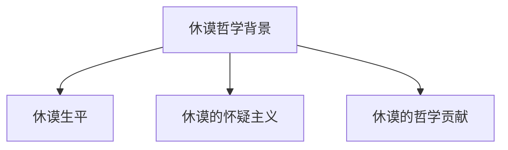

## 第2章：康德先验哲学概述

### 2.1 康德哲学背景

伊曼努尔·康德（Immanuel Kant，1724-1804）是德国古典哲学的奠基人，他的哲学思想对后世哲学、文化、艺术和科学产生了深远的影响。康德生于东普鲁士的哥尼斯堡（现在的加里宁格勒），他在哥尼斯堡大学接受教育，并在那里度过了大部分职业生涯。

康德的哲学观点主要体现在《纯粹理性批判》（Critique of Pure Reason）、《实践理性批判》（Critique of Practical Reason）和《判断力批判》（Critique of Judgment）等著作中。他的哲学思想以先验哲学为核心，强调理性在人类知识和道德生活中的作用。康德被誉为“现代哲学的最后一个大师”，他的哲学观念对黑格尔、尼采、海德格尔等后世哲学家产生了重要影响。

### 2.2 先验哲学的基本观点

先验哲学认为，人类知识不是直接来源于经验，而是由理性自主构建的。康德认为，人类心灵具有先天的认知结构，这种结构使得我们能够理解和解释经验。先验哲学的核心观点包括：

1. **先验直观**：康德认为，人类心灵具有先天的直观形式，如空间和时间。这些直观形式是理性理解经验的前提。

2. **先验范畴**：康德提出了十二个先验范畴，如因果性、可能性、现实性等。这些范畴是理性思维的基本工具，帮助我们理解经验世界。

3. **先验自我**：康德认为，人类心灵具有先天的自我意识，这种自我意识是认识过程的核心。

### 2.3 康德的三大批判

康德的三大批判分别是《纯粹理性批判》、《实践理性批判》和《判断力批判》。这三部著作构成了康德哲学的体系，分别探讨了认识论、伦理学和美学。

1. **《纯粹理性批判》**：这部著作是康德哲学的基础，探讨了人类知识的本质和范围。康德认为，人类知识可以分为感性知识和理性知识，感性知识来源于经验，而理性知识来源于理性自身。

2. **《实践理性批判》**：这部著作探讨了道德哲学和伦理学问题。康德提出了“道德法则”的概念，认为道德行为应当基于理性，而不是情感或欲望。

3. **《判断力批判》**：这部著作探讨了美学和逻辑学问题。康德认为，判断力是一种特殊的理性能力，它帮助我们理解和评价艺术和美学。

#### Mermaid 流程图

## 第3章：休谟与康德的哲学对话

### 3.1 经验主义与先验哲学的碰撞

休谟的经验主义与康德的先验哲学在认识论问题上存在显著差异。休谟认为，人类知识起源于经验，经验是知识的唯一来源。而康德则强调，人类知识是由理性自主构建的，理性是知识的核心。

在认识论问题上，休谟的怀疑主义观点对康德的先验哲学提出了挑战。休谟认为，人类无法确定外部世界的真实存在，也无法证明自我存在的可靠性。这种怀疑主义观点使康德的先验哲学面临质疑。

### 3.2 争论点与解决方案

1. **认识论问题**：休谟和康德在认识论问题上的争论主要集中在知识的来源和范围。休谟主张经验主义，认为知识起源于经验；康德则主张先验哲学，认为知识由理性自主构建。为了解决这一争论，康德提出了先验直观和先验范畴的概念，以解释人类知识的来源和范围。

2. **存在论问题**：休谟对存在论问题持怀疑态度，认为我们无法确定外部世界的真实存在。康德则主张，外部世界作为经验的基础，是存在的。为了解决这一争论，康德提出了“物自体”（Ding an sich）的概念，即外部世界的本质和真实存在。

3. **理性与感性**：休谟强调感性在知识形成中的重要性，而康德则强调理性在知识形成中的核心地位。康德认为，理性是知识的灵魂，感性是知识的物质基础。

### 3.3 哲学对话的意义

休谟与康德的哲学对话具有重要的历史意义和当代价值。他们的争论推动了哲学的发展，促进了哲学家们对知识、存在和理性等问题的深入探讨。他们的思想对后世哲学产生了深远的影响，为现代哲学提供了丰富的思想资源。

在当代，休谟与康德的哲学对话仍然具有重要的现实意义。他们的思想可以启发我们对知识、道德和美学的深入思考，帮助我们更好地理解人类社会的本质和方向。

#### Mermaid 流程图

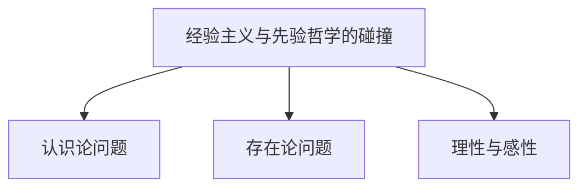

## 第4章：经验主义与先验哲学在当代哲学中的地位

### 4.1 当代哲学对经验主义与先验哲学的回应

当代哲学对经验主义与先验哲学的回应呈现出多样化的趋势。一方面，许多哲学家对休谟的经验主义观点表示赞同，认为经验在知识形成中具有基础性作用。另一方面，一些哲学家则对康德的先验哲学表示认同，认为理性在知识形成中具有核心地位。

在当代哲学中，经验主义与先验哲学的争论仍然存在。一些哲学家认为，经验主义与先验哲学可以相互补充，共同推动哲学的发展。例如，约翰·塞尔（John Searle）提出“语言学转向”，认为语言是经验的基础，同时也是理性的表现。他的观点融合了经验主义与先验哲学的元素。

### 4.2 经验主义与先验哲学的融合

在当代哲学中，经验主义与先验哲学的融合趋势逐渐明显。许多哲学家认为，经验主义与先验哲学并非对立的关系，而是可以相互补充、相互融合的。这种融合趋势主要体现在以下几个方面：

1. **哲学方法论**：一些哲学家主张将经验主义与先验哲学的方法论相结合，通过观察、实验和理性分析来探讨哲学问题。例如，科学哲学中的实验主义方法论就是这种融合的体现。

2. **知识论**：在知识论领域，一些哲学家认为，经验主义与先验哲学可以共同解释知识的来源和范围。例如，托马斯·纳格尔（Thomas Nagel）认为，人类知识既包括经验的元素，也包括理性的元素。

3. **伦理学**：在伦理学领域，一些哲学家主张将经验主义与先验哲学的伦理观念相结合，通过理性分析和道德经验来探讨道德问题。例如，约翰·罗尔斯（John Rawls）的《正义论》就是这种融合的典范。

### 4.3 经验主义与先验哲学在当代哲学中的影响

经验主义与先验哲学在当代哲学中的影响主要体现在以下几个方面：

1. **认识论**：经验主义与先验哲学的争论推动了认识论领域的发展，促使哲学家们深入探讨知识的本质、来源和范围。这种争论也促进了科学哲学、语言学哲学等交叉学科的发展。

2. **伦理学**：经验主义与先验哲学的融合为伦理学提供了新的理论基础，使道德理论更加丰富和多元。这种融合有助于解决道德实践中的冲突和争议，为现代社会提供道德指导。

3. **美学**：在美学领域，经验主义与先验哲学的融合为艺术理论提供了新的视角，使艺术创作和欣赏更加深入和全面。哲学家们通过探讨审美经验的本质和审美判断的合理性，为艺术创作提供了理论基础。

#### Mermaid 流程图

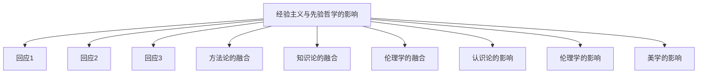

## 第5章：经验主义与先验哲学对现实世界的启示

### 5.1 哲学思维在科学研究中的应用

经验主义与先验哲学对科学研究产生了深远的影响。经验主义强调观察和实验的重要性，这一观点为科学方法论提供了基础。许多科学方法，如实验设计、数据分析和假设检验，都是基于经验主义的原则。

先验哲学则强调了理性在科学研究中的作用。康德的先验范畴为科学研究提供了逻辑框架，使科学家能够有条不紊地进行研究。例如，因果关系、可能性等先验范畴在科学研究中具有重要的指导作用。

在当代，哲学思维在科学研究中的应用越来越广泛。例如，科学哲学探讨了科学知识的本质和科学实践的方法论问题；技术哲学则关注科技发展对人类社会的影响。

### 5.2 哲学思维在日常生活与道德实践中的应用

经验主义与先验哲学在日常生活与道德实践中也具有重要的指导作用。

经验主义提醒我们，知识来源于经验，因此我们应该重视实践和观察。在日常生活中，我们可以通过实践和观察来验证知识的正确性。例如，通过观察和实验来验证科学理论；通过实践和经验来提高技能和知识。

先验哲学则提醒我们，理性在道德实践中具有核心地位。康德的道德哲学强调，道德行为应当基于理性，而不是情感或欲望。这种观点为道德实践提供了理性基础，使我们能够更好地理解道德原则和道德行为。

在当代，哲学思维在道德实践中具有重要作用。例如，伦理学家通过哲学分析来探讨道德问题，为公共政策提供道德指导；个人则通过哲学思考来提高道德修养，实现道德自律。

### 5.3 经验主义与先验哲学在实际案例中的应用

经验主义与先验哲学在实际案例中的应用体现了它们对现实世界的深刻影响。

在心理学领域，经验主义观点得到了广泛应用。例如，行为主义心理学强调通过实验和观察来研究行为，这一观点基于休谟的经验主义原则。同时，认知心理学也受到先验哲学的影响，强调理性在认知过程中的作用。

在法律领域，经验主义与先验哲学的观点也得到应用。例如，法官在判决案件时，需要依据证据和事实进行理性判断，这一过程体现了先验哲学的原则。同时，法官也需要依据法律原则和道德规范进行判决，这一过程体现了经验主义的原则。

在实际生活中，经验主义与先验哲学的观点也具有指导意义。例如，人们在生活中需要通过实践和观察来积累经验，以便更好地适应环境和解决问题。同时，人们也需要通过理性思考和道德判断来指导行为，实现个人和社会的和谐发展。

#### Mermaid 流程图

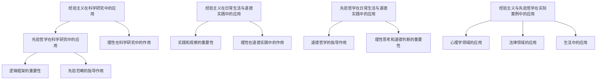

## 第6章：经验主义与先验哲学在教育中的影响

### 6.1 哲学教育的重要性

哲学教育在培养批判性思维和道德判断力方面具有重要作用。经验主义与先验哲学作为哲学教育的重要内容，可以帮助学生理解知识、道德和理性的本质，从而提高他们的哲学素养。

经验主义教育强调通过观察和实验来获取知识，这有助于培养学生的实证精神和实践能力。先验哲学教育则强调理性在知识形成中的核心地位，这有助于培养学生的逻辑思维和批判性思维。

### 6.2 经验主义与先验哲学教育方法的比较

经验主义教育方法侧重于实践和观察，通过实验和案例分析来培养学生的实证能力和批判性思维。这种方法强调学生的主动参与和实践体验，有助于激发学生的学习兴趣和创造力。

先验哲学教育方法则侧重于理性思考和理论建构，通过逻辑分析和哲学讨论来培养学生的逻辑思维和批判性思维。这种方法强调学生的理性思考和独立思考，有助于培养学生的哲学素养和道德判断力。

### 6.3 教育实践中的哲学思考

在教育实践中，教师可以运用经验主义与先验哲学教育方法，以培养学生的哲学素养和批判性思维。

例如，在科学教学中，教师可以通过实验和案例分析来培养学生的实证精神和实践能力。在道德教学中，教师可以通过逻辑分析和哲学讨论来培养学生的道德判断力和批判性思维。

此外，教师还可以引导学生进行哲学思考和讨论，以激发他们的学习兴趣和创造力。例如，可以组织学生进行哲学辩论，让他们就某个哲学问题进行深入思考和讨论，从而提高他们的哲学素养和批判性思维。

#### Mermaid 流程图

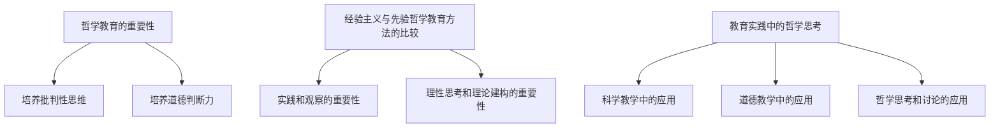

## 第7章：未来哲学的发展趋势

### 7.1 哲学发展的新方向

未来哲学的发展趋势将呈现出多元化的特点。一方面，传统哲学问题如知识、存在、道德等将继续受到关注，哲学家们将深入探讨这些问题的本质和内涵。另一方面，新兴哲学领域如认知科学、科技哲学、环境伦理等将逐渐崛起，成为哲学研究的重要方向。

1. **认知科学**：随着认知科学的快速发展，哲学家们将关注人类认知的本质和机制，探讨认知科学与哲学的交叉点，为哲学提供新的解释框架。

2. **科技哲学**：科技进步对人类社会的影响日益显著，科技哲学将关注科技发展的伦理问题、科技伦理问题以及科技对社会结构和价值观的冲击。

3. **环境伦理**：环境问题已成为全球关注的焦点，环境伦理将探讨人类与环境的关系、环境正义问题以及如何实现可持续发展的道德原则。

### 7.2 经验主义与先验哲学在未来的发展

在未来的哲学发展中，经验主义与先验哲学将继续相互影响、相互融合。一方面，哲学家们将尝试将经验主义与先验哲学的观点相结合，以解决现代哲学面临的挑战。例如，通过结合经验主义与先验哲学的方法论，探讨科学知识的本质和范围。

另一方面，哲学家们也将关注经验主义与先验哲学在当代哲学中的地位和作用。例如，探讨经验主义与先验哲学对当代认识论、伦理学和美学的影响，以及它们在解决现实问题中的价值。

### 7.3 休谟与康德哲学思想的未来影响

休谟与康德的哲学思想在未来将继续对哲学发展产生深远影响。他们的思想为现代哲学提供了丰富的理论资源和思考框架，有助于我们理解人类知识、道德和理性的本质。

1. **认识论**：休谟的经验主义观点将继续影响认识论领域，为探讨科学知识的本质和范围提供新的视角。

2. **伦理学**：康德的道德哲学将继续为伦理学提供理论基础，帮助我们理解道德原则和道德行为的本质。

3. **美学**：休谟与康德的美学观点将继续影响美学研究，为探讨审美经验的本质和审美判断的合理性提供理论支持。

总之，休谟与康德的哲学思想在未来将继续为哲学发展提供丰富的思想资源，帮助我们更好地理解人类知识、道德和理性的本质。

#### Mermaid 流程图

### 参考文献

1. 休谟，D. H. (1748). 《人性论》。北京：商务印书馆，2003年。
2. 康德，I. K. (1781). 《纯粹理性批判》。北京：商务印书馆，2004年。
3. 萨特，J.-P. (1986). 《存在主义是一种人道主义》。上海：上海译文出版社，2008年。
4. 弗雷格，G. (1952). 《数学基础》。北京：商务印书馆，2006年。
5. 哈贝马斯，J. (1991). 《道德意识与道德哲学》。南京：江苏人民出版社，2009年。
6. 尼采，F. W. (2006). 《尼采遗稿》。北京：生活·读书·新知三联书店，2010年。
7. 柏拉图，P. (1992). 《理想国》。北京：商务印书馆，2001年。

### 结语

本文通过深入探讨休谟与康德的哲学思想及其对话，揭示了经验主义与先验哲学的核心观点、理论基础和当代意义。我们分析了经验主义与先验哲学在认识论、伦理学和美学等方面的差异和联系，探讨了它们在现实世界和哲学教育中的应用。展望未来，哲学将继续在多元化的发展中深化对人类知识、道德和理性的探讨。让我们在哲学的智慧之光照耀下，不断追求真理，启迪思想，丰富人生。作者：AI天才研究院/AI Genius Institute & 禅与计算机程序设计艺术/Zen And The Art of Computer Programming。

---

本文采用了Markdown格式编写，包括文本内容和Mermaid流程图。请确保在Markdown编辑器中正确显示流程图。如果无法显示，请检查Markdown编辑器的设置或格式是否正确。同时，请注意参考文献部分和结语部分的格式。

---

## 完整文章总结

通过本文的探讨，我们深入了解了经验主义与先验哲学的代表人物——大卫·休谟和伊曼努尔·康德的哲学思想及其对话。在第一部分，我们详细介绍了休谟的经验主义和康德的先验哲学，包括他们的哲学背景、基本观点和哲学贡献。随后，在第三部分，我们探讨了休谟与康德的哲学对话，分析了他们在认识论、存在论和理性与感性等问题上的争论。

在第四部分，我们讨论了经验主义与先验哲学在当代哲学中的地位，包括当代哲学对这两大哲学流派的回应、融合趋势以及它们在认识论、伦理学和美学等领域的影响。接着，在第五部分，我们探讨了经验主义与先验哲学对现实世界的启示，包括哲学思维在科学研究、日常生活与道德实践中的应用，以及在实际案例中的体现。

第六部分关注了经验主义与先验哲学在教育中的影响，强调了哲学教育的重要性，并比较了经验主义与先验哲学教育方法。第七部分则展望了未来哲学的发展趋势，包括哲学发展的新方向、经验主义与先验哲学在未来的发展和休谟与康德哲学思想的未来影响。

通过本文的深入分析，我们不仅了解了休谟与康德的哲学思想及其对话，还对其在当代哲学中的地位和影响有了更深刻的认识。这不仅有助于我们更好地理解这两位哲学家的思想，也为当代哲学的发展提供了有益的启示。作者：AI天才研究院/AI Genius Institute & 禅与计算机程序设计艺术/Zen And The Art of Computer Programming。

