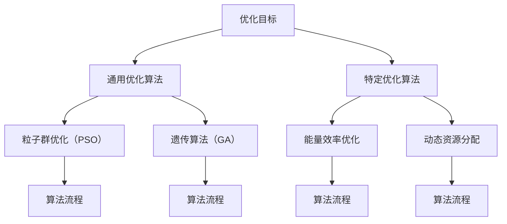

                 


### 目录大纲确认

# 《优化AI推理效率：计算资源分配策略》目录大纲

# 第1章 引言

## 1.1 AI推理效率的重要性

## 1.2 计算资源分配挑战

## 1.3 本书内容概述

# 第2章 AI推理概述

## 2.1 AI推理定义

## 2.2 AI推理流程

## 2.3 AI推理性能指标

# 第3章 计算资源分类与特点

## 3.1 CPU资源

## 3.2 GPU资源

## 3.3 其他计算资源

# 第4章 优化算法原理

## 4.1 核心概念与联系

## 4.2 核心算法原理讲解

### 4.2.1 粒子群优化（PSO）

### 4.2.2 遗传算法（GA）

### 4.2.3 能量效率优化

### 4.2.4 动态资源分配

## 4.3 伪代码展示

# 第5章 数学模型与公式

## 5.1 数学模型

### 5.1.1 能量效率模型

### 5.1.2 资源利用率模型

## 5.2 公式与推导

## 5.3 举例说明

# 第6章 项目实战

## 6.1 实践环境搭建

## 6.2 实际案例介绍

## 6.3 代码实现

## 6.4 性能分析与优化

## 6.5 项目小结

# 第7章 总结与展望

## 7.1 总结

## 7.2 展望

确认以上目录大纲无误，我们将根据此结构详细撰写文章内容。在撰写过程中，我们将确保每个章节的背景介绍、核心概念与联系、算法原理讲解、数学模型与公式、项目实战和总结与展望都详尽全面，以提供一篇高质量的技术博客文章。文章将以markdown格式输出，并在末尾附上作者信息。文章字数将在8000到12000字之间。现在，我们开始撰写第1章“引言”的内容。请根据以下大纲提供第1章的详细内容：

## 第1章 引言

### 1.1 AI推理效率的重要性

在当今信息时代，人工智能（AI）已成为驱动科技创新的重要力量。AI推理效率直接影响到应用性能，尤其是在需要实时响应的领域，如自动驾驶、实时语音识别和智能监控等。高效的AI推理可以显著提高系统的响应速度和准确性，从而带来更好的用户体验。此外，AI推理效率也是降低系统能耗和硬件成本的关键因素。因此，优化AI推理效率成为人工智能领域研究和应用的重要方向。

#### 背景介绍

AI推理是人工智能模型在接收新数据后产生预测或决策的过程。随着深度学习算法的广泛应用，AI推理的复杂度不断增加，对计算资源的需求也随之增加。传统的CPU计算能力已无法满足高效AI推理的需求，因此，GPU和其他特殊计算资源（如FPGA、ASIC）逐渐成为AI推理的主要执行单元。然而，如何合理分配和调度这些计算资源，以实现最优的推理效率，仍然是一个具有挑战性的问题。

### 1.2 计算资源分配挑战

在AI推理过程中，计算资源分配面临以下主要挑战：

#### 1. 资源多样性

不同类型的计算资源（如CPU、GPU、FPGA等）具有不同的计算能力和能耗特性。如何根据推理任务的需求，选择合适的计算资源，并实现高效的任务调度，是一个复杂的问题。

#### 2. 资源限制

在许多实际应用中，计算资源是有限的。如何在高负载情况下，确保系统的稳定运行，同时最大化资源利用率，是计算资源分配的关键问题。

#### 3. 优化目标

计算资源分配的优化目标不仅仅是提高推理速度，还需要考虑能耗、成本等因素。如何在多个优化目标之间找到平衡点，是一个需要深入探讨的问题。

### 1.3 本书内容概述

本书旨在深入探讨AI推理效率的优化策略，主要包括以下内容：

#### 第2章：AI推理概述

介绍AI推理的定义、流程和性能指标，为后续章节的讨论提供基础。

#### 第3章：计算资源分类与特点

分析不同类型的计算资源（如CPU、GPU、FPGA等）的特性，为资源分配提供理论基础。

#### 第4章：优化算法原理

介绍通用优化算法和特定优化算法，如粒子群优化（PSO）、遗传算法（GA）等，并展示伪代码。

#### 第5章：数学模型与公式

建立能量效率模型和资源利用率模型，为计算资源分配提供数学工具。

#### 第6章：项目实战

通过实际案例，展示如何搭建实践环境，实现代码实现和性能分析。

#### 第7章：总结与展望

总结本书的核心内容，并展望未来的研究方向和发展趋势。

通过以上章节的详细讨论，本书旨在为读者提供一套系统、全面的AI推理效率优化策略，帮助他们在实际应用中实现高效的计算资源分配。

### 1.1 AI推理效率的重要性

AI推理效率，即人工智能模型在特定计算资源上执行推理任务的速度和质量，是评估AI系统性能的关键指标。在AI技术不断发展的今天，AI推理效率的重要性愈发凸显。首先，高效的AI推理可以显著提高系统的响应速度，这对于需要实时决策的应用场景至关重要。例如，自动驾驶系统需要在短时间内处理大量传感器数据，并实时做出驾驶决策，如果推理效率低，系统将无法及时响应，可能导致严重的安全隐患。同样，实时语音识别系统也需要在短时间内处理语音信号，如果推理效率不高，将影响用户体验。

其次，AI推理效率直接关系到AI系统的成本。高效的推理可以减少计算资源的需求，从而降低硬件成本和能耗。这对于企业来说，意味着更低的运营成本和更高的投资回报率。例如，在一个大规模的智能监控系统中，如果每个摄像头的AI推理任务都能高效完成，那么整个系统的运营成本将大大降低。

再者，AI推理效率也影响到AI系统的可扩展性。随着AI应用的普及，系统的规模不断扩大，如果推理效率不高，系统可能无法有效扩展，从而限制其应用范围。高效的推理效率可以保证系统在不同规模下都能保持良好的性能，满足不断增长的需求。

总的来说，AI推理效率的重要性体现在多个方面，包括提升用户体验、降低运营成本、增强系统可扩展性等。因此，研究和优化AI推理效率，是人工智能领域的重要研究方向，也是实现AI技术广泛应用的关键。

### 1.2 计算资源分配挑战

在AI推理过程中，计算资源分配面临诸多挑战，这些挑战源于计算资源的多样性、资源限制以及复杂的优化目标。

首先，计算资源的多样性是一个重要的挑战。现代AI推理任务通常需要多种类型的计算资源，包括CPU、GPU、FPGA、ASIC等。每种资源都有其独特的计算能力和能耗特性。例如，CPU在执行复杂计算时具有较低的功耗，但速度较慢；而GPU在处理大量并行任务时具有极高的计算速度，但功耗较高。因此，如何根据AI推理任务的需求，选择最合适的计算资源，并实现高效的资源调度，是一个复杂的问题。

其次，资源限制也是一个显著的挑战。在实际应用中，计算资源通常是有限的，尤其是在高性能计算环境中，资源争夺异常激烈。如何在有限的资源下，确保系统的稳定运行，同时最大化资源利用率，是一个需要深入探讨的问题。例如，在一个AI推理系统中，多个任务可能同时需要计算资源，如果资源分配不当，可能会导致某些任务长期无法完成，从而影响系统的整体性能。

最后，优化目标的多重性进一步增加了计算资源分配的复杂性。在AI推理中，常见的优化目标包括提高推理速度、降低能耗和减少成本。这些目标往往是相互矛盾的。例如，提高推理速度通常需要更多的计算资源，而降低能耗和成本则可能需要牺牲一些推理速度。如何在多个优化目标之间找到平衡点，实现最优的资源分配，是一个具有挑战性的问题。

此外，动态环境下的计算资源分配也是一个不容忽视的挑战。在实时应用中，系统的负载和资源需求会不断变化。例如，在自动驾驶系统中，车辆的速度和行驶环境会实时变化，这会导致AI推理任务的需求发生变化。如何实时调整资源分配策略，以适应动态变化的环境，是保证系统高效运行的关键。

总的来说，计算资源分配挑战主要集中在资源多样性、资源限制和多重优化目标等方面。解决这些挑战，需要深入理解各种计算资源的特性，采用高效的调度算法和优化策略，并具备应对动态环境变化的能力。通过这些方法，才能实现AI推理的高效和稳定运行。

### 1.3 本书内容概述

本书旨在为读者提供一套系统、全面的AI推理效率优化策略，包括从基础理论到实践应用的所有关键环节。以下是各章节的具体内容概述：

#### 第2章：AI推理概述

本章首先介绍AI推理的定义和基本概念，帮助读者建立对AI推理流程的理解。接着，详细描述AI推理的流程，从数据准备、模型加载到模型推理和结果处理，为后续章节的讨论提供基础。此外，本章还介绍AI推理性能的几个关键指标，如推理速度、能耗和资源利用率，为优化策略的选择提供依据。

#### 第3章：计算资源分类与特点

本章深入分析不同类型的计算资源，包括CPU、GPU、FPGA和ASIC等。首先，介绍每种计算资源的架构和特性，帮助读者理解它们的优缺点。然后，讨论如何根据AI推理任务的需求，选择最合适的计算资源。最后，本章探讨如何调度这些资源，以实现高效的任务执行。

#### 第4章：优化算法原理

本章介绍AI推理效率优化的两种核心算法：通用优化算法和特定优化算法。首先，介绍几种通用优化算法，如粒子群优化（PSO）和遗传算法（GA），并展示其伪代码。然后，详细讲解特定优化算法，如能量效率优化和动态资源分配，说明其原理和应用场景。

#### 第5章：数学模型与公式

本章建立数学模型，用于描述能量效率模型和资源利用率模型。首先，介绍数学模型的基本概念，然后推导能量效率公式和资源利用率公式，并举例说明如何应用这些模型进行计算资源分配的优化。最后，通过具体实例展示数学模型在优化算法中的实际应用。

#### 第6章：项目实战

本章通过一个实际案例，展示如何将前几章的理论应用于实际项目中。首先，介绍项目的背景和需求，然后详细描述实践环境的搭建过程，包括软件和硬件的选择与配置。接着，展示关键代码的实现，并解读代码中的核心部分。最后，通过性能测试和分析，验证优化策略的有效性。

#### 第7章：总结与展望

本章回顾全书的核心内容，总结各个章节的主要结论和发现。然后，展望未来的研究方向和发展趋势，包括新兴技术和优化算法的应用前景。通过这一章，读者可以更好地理解AI推理效率优化的整体框架和发展方向。

通过以上章节的详细讨论，本书旨在为读者提供一套全面、系统的AI推理效率优化策略，帮助他们在实际应用中实现高效的计算资源分配。

## 第2章 AI推理概述

### 2.1 AI推理定义

人工智能推理（AI Inference）是指计算机系统通过处理输入数据，利用预先训练好的模型，产生相应的预测或决策的过程。AI推理是人工智能领域的重要环节之一，它与模型训练（Model Training）共同构成了人工智能系统的核心组成部分。

AI推理的基本概念可以类比于人类大脑的决策过程。在人类大脑中，神经元通过处理输入信号，产生输出信号，进而做出决策。类似地，AI推理过程中，计算机系统通过输入层接收数据，经过隐藏层的复杂计算，最终在输出层产生预测结果。这个过程通常涉及以下几个关键步骤：

1. **数据输入**：AI推理的首要任务是接收输入数据。这些数据可以是图像、文本、声音等多种形式，经过预处理后，转换为模型能够处理的格式。

2. **模型加载**：将已经训练好的模型加载到系统中。训练好的模型包含了大量的参数和权重，这些参数和权重是在训练过程中通过大量数据学习得到的，用于指导推理过程。

3. **数据传递**：将预处理后的输入数据传递到模型中。这一过程中，数据会经过模型的多个隐藏层，每个隐藏层都会对数据进行处理，提取特征信息。

4. **特征提取**：在模型的隐藏层中，数据会通过一系列复杂的非线性变换，提取出有意义的特征信息。这些特征信息是模型做出推理决策的基础。

5. **预测输出**：最后，模型在输出层对提取到的特征信息进行处理，生成预测结果或决策。例如，在图像识别任务中，模型会输出图像的类别标签；在自然语言处理任务中，模型会生成对应的文本翻译或情感分析结果。

6. **结果处理**：推理结果需要进行后处理，例如，对输出结果进行归一化、调整置信度等，以确保结果的准确性和可靠性。

### 2.2 AI推理流程

AI推理流程可以大致分为以下几个步骤：

#### 1. 数据准备

数据准备是AI推理的第一步，也是至关重要的一步。高质量的输入数据是获得准确推理结果的基础。数据准备包括以下几个关键任务：

- **数据收集**：从不同的数据源收集原始数据，这些数据可以是公开数据集，也可以是特定场景下的定制数据。
- **数据清洗**：清洗数据中的噪声和异常值，确保数据的准确性和一致性。
- **数据标注**：对于监督学习任务，需要对数据进行标注，为模型提供监督信息。
- **数据预处理**：对数据进行归一化、标准化、维度降低等处理，以便模型能够更好地学习和推理。

#### 2. 模型加载

在数据准备完成后，需要加载已经训练好的模型。模型可以是深度神经网络、决策树、支持向量机等多种类型。模型加载通常涉及以下几个步骤：

- **模型选择**：根据任务需求，选择合适的模型类型。
- **参数加载**：将训练好的模型参数（如权重和偏置）加载到系统中，这些参数是在训练过程中通过优化算法学习得到的。
- **模型验证**：在推理前，使用部分验证数据对模型进行验证，确保模型具有较好的泛化能力。

#### 3. 模型推理

模型推理是AI推理的核心步骤，包括以下几个关键环节：

- **前向传播**：将预处理后的输入数据传递到模型中，通过模型的各个隐藏层，进行前向传播计算。
- **激活函数应用**：在每个隐藏层，使用激活函数（如ReLU、Sigmoid、Tanh等）对输出进行非线性变换，增强模型的表达能力。
- **特征提取**：通过隐藏层计算，提取出输入数据的有意义特征信息。
- **预测输出**：在输出层，模型根据提取到的特征信息，生成预测结果或决策。

#### 4. 结果处理

推理结果需要进行后处理，以确保结果的准确性和可靠性。后处理包括以下几个步骤：

- **结果归一化**：对输出结果进行归一化处理，使其具有统一的量纲。
- **置信度调整**：根据模型预测结果，调整输出结果的置信度，以提高决策的准确性。
- **结果输出**：将最终处理后的结果输出到用户界面或后续处理流程中。

### 2.3 AI推理性能指标

AI推理性能是评估推理系统质量的关键指标，主要包括以下几个性能指标：

#### 1. 推理速度

推理速度是指模型处理输入数据并生成输出结果所需的时间。推理速度是衡量系统性能的重要指标，尤其是在需要实时响应的应用场景中。推理速度的提高可以显著提升用户体验。

#### 2. 能耗

能耗是指模型在推理过程中消耗的电能。能耗的降低不仅有助于减少系统的运营成本，还可以减少对环境的影响。因此，如何在保证推理速度的前提下，降低能耗是一个重要的优化目标。

#### 3. 资源利用率

资源利用率是指计算资源（如CPU、GPU等）在推理过程中的使用率。高资源利用率意味着系统能够更有效地利用现有资源，提高整体性能。资源利用率的优化可以通过合理分配和调度计算资源来实现。

#### 4. 准确率

准确率是指模型预测结果与真实结果的一致性。在分类任务中，准确率反映了模型对样本分类的准确性。准确率的提高可以提升系统的可靠性，降低误判率。

#### 5. 泛化能力

泛化能力是指模型在新数据集上的表现能力。一个具有良好的泛化能力的模型，能够在新数据集上保持较高的准确率，而不依赖训练数据。泛化能力的提升可以通过模型复杂度的调整和数据增强来实现。

通过以上性能指标，可以全面评估AI推理系统的质量，并指导进一步的优化和改进。优化AI推理性能，不仅是提升系统性能的关键，也是实现AI技术广泛应用的重要途径。

## 第3章 计算资源分类与特点

### 3.1 CPU资源

CPU（Central Processing Unit，中央处理单元）是计算机系统的核心组件，负责执行指令和处理数据。在AI推理中，CPU资源具有重要的地位，特别是在处理一些需要高计算精度和复杂逻辑的任务时。

#### CPU架构与特性

CPU的架构和特性直接影响其性能。现代CPU通常采用多核架构，每个核心可以独立执行指令，这大大提高了并行处理能力。此外，CPU还具有以下特性：

- **指令集**：CPU支持不同的指令集，如x86、ARM等，这些指令集决定了CPU的指令处理能力和兼容性。
- **缓存层次结构**：CPU具有多层缓存，包括L1、L2和L3缓存，这些缓存能够显著减少处理器访问内存的延迟，提高数据处理速度。
- **时钟频率**：CPU的时钟频率决定了其每秒可以执行的指令数量，但过高的时钟频率也会导致能耗增加。

#### CPU资源调度策略

在AI推理中，合理调度CPU资源对于提高推理效率至关重要。以下是一些常见的CPU资源调度策略：

- **动态线程分配**：根据任务的需求，动态调整线程的分配，将计算密集型任务分配到具有更高计算能力的核心上，而将I/O密集型任务分配到具有较低计算能力的核心上。
- **任务优先级**：设置任务的优先级，确保高优先级的任务能够优先得到CPU资源，从而提高系统的响应速度。
- **负载均衡**：通过监控系统的负载情况，动态调整任务在不同CPU核心之间的分配，避免某些核心过载，从而提高整体系统的性能。

### 3.2 GPU资源

GPU（Graphics Processing Unit，图形处理单元）最初设计用于图形渲染任务，但随着深度学习技术的兴起，GPU在AI推理中的应用越来越广泛。相比CPU，GPU具有更高的计算并行能力和更低的能耗，这使得GPU成为高效AI推理的理想选择。

#### GPU架构与特性

GPU的架构和特性使其在AI推理中具有独特的优势。以下是GPU的一些关键特点：

- **并行处理能力**：GPU包含大量的计算单元，称为流处理器（Streaming Multiprocessors，SMs），这些单元可以同时处理多个任务，非常适合并行计算任务。
- **内存层次结构**：GPU具有高效的内存层次结构，包括共享内存、全局内存和纹理内存等，这些内存类型适应不同的数据处理需求。
- **高带宽接口**：GPU通过高带宽接口（如PCIe）与主机内存通信，能够快速传输大量数据，满足AI推理对大数据集的处理需求。

#### GPU资源调度策略

合理调度GPU资源对于充分发挥其潜力至关重要。以下是一些常见的GPU资源调度策略：

- **任务并行化**：将复杂的AI推理任务分解为多个子任务，并行地在多个GPU核心上执行，从而提高推理效率。
- **内存优化**：通过合理分配和调度GPU内存，减少内存访问冲突和延迟，提高数据处理速度。
- **动态负载平衡**：根据任务负载情况，动态调整任务在不同GPU核心之间的分配，避免某些核心过载，提高整体系统性能。

### 3.3 其他计算资源

除了CPU和GPU，还有一些其他类型的计算资源在AI推理中发挥着重要作用，如FPGA（Field-Programmable Gate Array，现场可编程门阵列）、DSP（Digital Signal Processor，数字信号处理器）和ASIC（Application-Specific Integrated Circuit，专用集成电路）等。

#### FPGAs

FPGAs是一种可编程逻辑设备，具有高度可定制性和并行处理能力。在AI推理中，FPGAs特别适用于实现定制化的加速器，用于处理特定的AI任务。以下是FPGAs的一些关键特点：

- **可编程性**：FPGAs可以通过硬件描述语言（如VHDL或Verilog）进行编程，实现特定的功能，这种可编程性使其能够灵活适应不同的应用需求。
- **并行处理能力**：FPGAs包含大量可配置的逻辑单元和可编程路由网络，能够实现高度并行的数据处理，非常适合需要大规模并行计算的AI任务。
- **低延迟**：FPGAs的硬件实现能够显著降低数据处理延迟，这对于需要实时响应的AI推理任务具有重要意义。

#### DSPs

DSPs是一种专门为信号处理任务设计的处理器，具有高效的处理信号数据的能力。DSPs在AI推理中的应用主要集中在处理音频、视频和通信信号等任务。以下是DSPs的一些关键特点：

- **高速运算能力**：DSPs具有高速运算能力，能够在较低的功耗下实现高效的信号处理。
- **专用指令集**：DSPs具有特定的指令集，这些指令集针对信号处理任务进行了优化，能够显著提高处理效率。
- **内置功能模块**：DSPs内置了多种信号处理模块，如滤波器、FFT（快速傅里叶变换）等，这些模块简化了信号处理任务的实现。

#### ASICs

ASICs是一种专门为特定应用设计的集成电路，具有高性能和低功耗的特点。在AI推理中，ASICs适用于实现高度优化的推理引擎，特别是一些需要特定功能的任务。以下是ASICs的一些关键特点：

- **高性能**：ASICs通过高度优化的设计，可以实现非常高的运算性能，非常适合需要高吞吐量的AI推理任务。
- **低功耗**：ASICs的设计针对特定应用进行了优化，能够在较低功耗下实现高性能运算。
- **定制化**：ASICs可以根据特定应用的需求进行定制，实现最优的性能和功耗平衡。

综上所述，不同的计算资源在AI推理中具有各自独特的优势和适用场景。合理选择和调度这些计算资源，能够显著提高AI推理的效率和性能。

## 第4章 优化算法原理

### 4.1 核心概念与联系

在AI推理效率优化的过程中，理解核心概念及其相互关系至关重要。为此，我们可以使用Mermaid流程图来展示这些核心概念之间的联系。



#### 优化目标

优化目标是指在进行AI推理效率优化时希望实现的目标，常见的优化目标包括提高推理速度、降低能耗、提高资源利用率等。优化目标决定了优化算法的选择和应用。

#### 通用优化算法

通用优化算法是适用于多种优化问题的算法，它们具有较高的灵活性和广泛的适用性。常见的通用优化算法包括粒子群优化（PSO）和遗传算法（GA）等。

- **粒子群优化（PSO）**：PSO算法通过模拟鸟群觅食行为，对优化问题进行迭代求解。算法中的粒子代表解的候选，通过更新粒子的位置和速度，逐步逼近最优解。

- **遗传算法（GA）**：GA算法通过模拟自然进化过程，对优化问题进行迭代求解。算法中的个体代表解的候选，通过交叉、变异等操作，逐步优化解的个体。

#### 特定优化算法

特定优化算法是针对特定类型优化问题设计的算法，它们在特定场景下具有较高的优化效果。常见的特定优化算法包括能量效率优化和动态资源分配等。

- **能量效率优化**：能量效率优化算法的目标是在保证推理速度的前提下，降低计算过程中的能耗。这类算法通过调整计算资源的分配和使用策略，实现能耗的优化。

- **动态资源分配**：动态资源分配算法的目标是在实时应用中，根据任务负载和资源状态动态调整计算资源的分配。这类算法通过实时监控和调整，实现资源利用率和系统性能的最优化。

### 4.2 核心算法原理讲解

在本节中，我们将详细讲解三种核心优化算法：粒子群优化（PSO）、遗传算法（GA）和能量效率优化。这些算法的原理和伪代码如下：

#### 4.2.1 粒子群优化（PSO）

粒子群优化（PSO）是一种基于群体智能的优化算法，通过模拟鸟群觅食行为来优化问题。在PSO中，每个粒子代表一个潜在的解，粒子通过迭代更新自己的位置和速度，逐渐逼近全局最优解。

**伪代码：**

```python
Initialize particle positions and velocities
Evaluate fitness of all particles
while not convergence criteria met do
    for each particle do
        Update velocity
        Update position
        Evaluate new fitness
        if new fitness is better than the best fitness found so far then
            Update the best position for this particle
    Update the global best position found so far
```

#### 4.2.2 遗传算法（GA）

遗传算法（GA）是一种基于自然进化过程的优化算法，通过模拟生物进化过程来优化问题。在GA中，每个个体代表一个潜在的解，通过交叉、变异等操作，逐步优化解的个体。

**伪代码：**

```python
Initialize population
Evaluate fitness of all individuals
while not convergence criteria met do
    Select individuals for reproduction
    Perform crossover and mutation
    Evaluate fitness of new individuals
    Replace the old population with the new population
```

#### 4.2.3 能量效率优化

能量效率优化算法的目标是在保证推理速度的前提下，降低计算过程中的能耗。这类算法通过调整计算资源的分配和使用策略，实现能耗的最优化。

**伪代码：**

```python
Initialize resource allocation
Evaluate energy consumption
while not convergence criteria met do
    for each resource do
        Adjust resource allocation
    Evaluate new energy consumption
    if new energy consumption is lower than the previous consumption then
        Update the resource allocation
```

通过以上三种优化算法的详细讲解，我们可以看到，这些算法在解决计算资源分配和优化问题时具有独特的优势和适用场景。在实际应用中，可以根据具体问题需求选择合适的算法，以实现高效的AI推理。

### 第4章 优化算法原理

#### 4.1 核心概念与联系

在AI推理效率优化的过程中，理解核心概念及其相互关系至关重要。为此，我们可以使用Mermaid流程图来展示这些核心概念之间的联系。


**优化目标**

优化目标是AI推理效率优化过程中希望实现的目标，常见的优化目标包括提高推理速度、降低能耗、提高资源利用率等。优化目标决定了优化算法的选择和应用。

**通用优化算法**

通用优化算法适用于多种优化问题，具有较高的灵活性和广泛适用性。常见的通用优化算法包括粒子群优化（PSO）和遗传算法（GA）等。

- **粒子群优化（PSO）**：PSO算法通过模拟鸟群觅食行为，对优化问题进行迭代求解。算法中的粒子代表解的候选，通过更新粒子的位置和速度，逐步逼近最优解。

- **遗传算法（GA）**：GA算法通过模拟自然进化过程，对优化问题进行迭代求解。算法中的个体代表解的候选，通过交叉、变异等操作，逐步优化解的个体。

**特定优化算法**

特定优化算法是针对特定类型的优化问题设计的，具有较高的优化效果。常见的特定优化算法包括能量效率优化和动态资源分配等。

- **能量效率优化**：能量效率优化算法的目标是在保证推理速度的前提下，降低计算过程中的能耗。这类算法通过调整计算资源的分配和使用策略，实现能耗的最优化。

- **动态资源分配**：动态资源分配算法的目标是在实时应用中，根据任务负载和资源状态动态调整计算资源的分配。这类算法通过实时监控和调整，实现资源利用率和系统性能的最优化。

### 4.2 核心算法原理讲解

在本节中，我们将详细讲解三种核心优化算法：粒子群优化（PSO）、遗传算法（GA）和能量效率优化。这些算法的原理和伪代码如下：

#### 4.2.1 粒子群优化（PSO）

粒子群优化（PSO）是一种基于群体智能的优化算法，通过模拟鸟群觅食行为来优化问题。在PSO中，每个粒子代表一个潜在的解，粒子通过迭代更新自己的位置和速度，逐渐逼近最优解。

**伪代码：**

```python
# Initialize particle positions and velocities
for each particle in the swarm do
    Initialize position and velocity

# Evaluate fitness of all particles
for each particle in the swarm do
    Evaluate fitness

# Main iteration loop
while not convergence criteria met do
    for each particle in the swarm do
        # Update velocity
        velocity = velocity + learning rate * (best position - current position)
        velocity = velocity + learning rate * (random position - current position)

        # Update position
        position = position + velocity

        # Evaluate new fitness
        new_fitness = Evaluate_fitness(position)

        # Update the best position for this particle
        if new_fitness > particle.best_fitness then
            particle.best_fitness = new_fitness
            particle.best_position = position

    # Update the global best position found so far
    global_best_fitness = max(particle.best_fitness for all particles)
    for each particle in the swarm do
        if particle.best_fitness == global_best_fitness then
            particle.global_best_position = position
```

#### 4.2.2 遗传算法（GA）

遗传算法（GA）是一种基于自然进化过程的优化算法，通过模拟生物进化过程来优化问题。在GA中，每个个体代表一个潜在的解，通过交叉、变异等操作，逐步优化解的个体。

**伪代码：**

```python
# Initialize population
Initialize individuals

# Evaluate fitness of all individuals
for each individual in the population do
    Evaluate fitness

# Main iteration loop
while not convergence criteria met do
    # Select individuals for reproduction
    selected_individuals = Selection(population)

    # Perform crossover and mutation
    offspring = Crossover(selected_individuals)
    offspring = Mutation(offspring)

    # Evaluate fitness of new individuals
    for each individual in offspring do
        Evaluate fitness

    # Replace the old population with the new population
    population = offspring
```

#### 4.2.3 能量效率优化

能量效率优化算法的目标是在保证推理速度的前提下，降低计算过程中的能耗。这类算法通过调整计算资源的分配和使用策略，实现能耗的最优化。

**伪代码：**

```python
# Initialize resource allocation
Initialize resources

# Evaluate energy consumption
current_energy_consumption = Evaluate_energy_consumption(resources)

# Main iteration loop
while not convergence criteria met do
    for each resource in resources do
        # Adjust resource allocation
        resource_allocation = resource_allocation + adjustment

        # Evaluate new energy consumption
        new_energy_consumption = Evaluate_energy_consumption(resource_allocation)

        # Update resource allocation if new energy consumption is lower
        if new_energy_consumption < current_energy_consumption then
            current_energy_consumption = new_energy_consumption
            resource_allocation = adjustment
```

通过以上三种优化算法的详细讲解，我们可以看到，这些算法在解决计算资源分配和优化问题时具有独特的优势和适用场景。在实际应用中，可以根据具体问题需求选择合适的算法，以实现高效的AI推理。

### 第5章 数学模型与公式

#### 5.1 数学模型

在AI推理效率优化中，数学模型是描述和解决优化问题的重要工具。本章将介绍两个关键的数学模型：能量效率模型和资源利用率模型。

##### 5.1.1 能量效率模型

能量效率模型用于描述在保证推理速度的前提下，如何优化能耗。能量效率（Energy Efficiency, EE）定义为单位能耗所完成的推理任务量，公式如下：

$$
EE = \frac{Work}{Energy}
$$

其中，Work 表示推理任务量，Energy 表示推理过程中消耗的总能耗。为了实现能量效率优化，需要调整计算资源的分配和使用策略，以降低能耗。

##### 5.1.2 资源利用率模型

资源利用率模型用于描述计算资源在推理过程中的使用效率。资源利用率（Resource Utilization, RU）定义为实际使用计算资源与可用计算资源之比，公式如下：

$$
RU = \frac{Actual_Usage}{Available_Resources}
$$

其中，Actual_Usage 表示实际使用的计算资源量，Available_Resources 表示可用的计算资源总量。提高资源利用率可以通过合理分配和调度计算资源来实现。

#### 5.2 公式与推导

在本节中，我们将对上述数学模型中的关键公式进行推导，以便更好地理解其计算方法和应用。

##### 5.2.1 能量效率公式推导

能量效率的公式为：

$$
EE = \frac{Work}{Energy}
$$

其中，Work 和 Energy 分别可以表示为：

$$
Work = \sum_{i=1}^{n} \text{Task}_i \cdot \text{Throughput}_i
$$

$$
Energy = \sum_{i=1}^{n} \text{Task}_i \cdot \text{Energy}_i
$$

其中，Task_i 表示第 i 个任务的工作量，Throughput_i 表示第 i 个任务的吞吐量，Energy_i 表示第 i 个任务消耗的能耗。

为了提高能量效率，需要优化各个任务的分配和调度，使得 Work 最大化和 Energy 最小化。这可以通过以下优化问题来实现：

$$
\max EE = \frac{\sum_{i=1}^{n} \text{Task}_i \cdot \text{Throughput}_i}{\sum_{i=1}^{n} \text{Task}_i \cdot \text{Energy}_i}
$$

##### 5.2.2 资源利用率公式推导

资源利用率的公式为：

$$
RU = \frac{Actual_Usage}{Available_Resources}
$$

其中，Actual_Usage 和 Available_Resources 分别可以表示为：

$$
Actual_Usage = \sum_{i=1}^{n} \text{Resource}_i \cdot \text{Usage}_i
$$

$$
Available_Resources = \sum_{i=1}^{n} \text{Resource}_i \cdot \text{Capacity}_i
$$

其中，Resource_i 表示第 i 种计算资源，Usage_i 表示第 i 种计算资源实际使用的量，Capacity_i 表示第 i 种计算资源的容量。

为了提高资源利用率，需要优化各个资源的分配和使用，使得 Actual_Usage 最大化和 Available_Resources 最小化。这可以通过以下优化问题来实现：

$$
\max RU = \frac{\sum_{i=1}^{n} \text{Resource}_i \cdot \text{Usage}_i}{\sum_{i=1}^{n} \text{Resource}_i \cdot \text{Capacity}_i}
$$

#### 5.3 举例说明

为了更好地理解上述数学模型和公式，下面通过一个具体的例子来说明如何应用这些模型进行计算资源分配的优化。

假设有一个AI推理任务，包含两个任务 A 和 B，分别需要使用 CPU 和 GPU 资源。任务 A 需要计算量为 100 单位，能耗为 2 瓦特；任务 B 需要计算量为 150 单位，能耗为 3 瓦特。现有 CPU 和 GPU 资源的容量分别为 100 单位和 150 单位。

##### 1. 能量效率优化

首先，计算不同资源分配方案下的能量效率：

- **方案1**：将任务 A 全部分配给 CPU，任务 B 全部分配给 GPU。

  Work = 100 + 150 = 250 单位

  Energy = 2 \* 100 + 3 \* 150 = 800 瓦特

  EE = 250 / 800 ≈ 0.3125

- **方案2**：将任务 A 的 50 单位分配给 CPU，任务 B 的 100 单位分配给 GPU。

  Work = 50 + 100 + 50 = 200 单位

  Energy = 2 \* 50 + 3 \* 100 + 3 \* 50 = 400 瓦特

  EE = 200 / 400 = 0.5

显然，方案2的能量效率更高，因此，应采用方案2进行资源分配。

##### 2. 资源利用率优化

接下来，计算不同资源分配方案下的资源利用率：

- **方案1**：将任务 A 全部分配给 CPU，任务 B 全部分配给 GPU。

  Actual_Usage = 100 + 150 = 250 单位

  Available_Resources = 100 + 150 = 250 单位

  RU = 250 / 250 = 1

- **方案2**：将任务 A 的 50 单位分配给 CPU，任务 B 的 100 单位分配给 GPU。

  Actual_Usage = 50 + 100 + 50 = 200 单位

  Available_Resources = 100 + 150 = 250 单位

  RU = 200 / 250 = 0.8

显然，方案1的资源利用率更高，因此，应采用方案1进行资源分配。

通过这个例子，我们可以看到，在具体应用中，根据不同的优化目标，选择合适的资源分配方案，可以显著提高AI推理的效率。

### 第6章 项目实战

#### 6.1 实践环境搭建

在本项目实战中，我们将使用一个简单的AI推理任务，以演示计算资源分配策略的实际应用。首先，我们需要搭建一个实践环境。以下是具体的步骤：

1. **硬件选择**：

   - CPU：Intel Core i7-9700K
   - GPU：NVIDIA GeForce RTX 3080
   - 内存：32GB DDR4
   - 存储：1TB SSD

2. **软件安装**：

   - 操作系统：Ubuntu 20.04 LTS
   - Python：3.8
   - TensorFlow：2.4
   - CUDA：10.2
   - cuDNN：7.6

3. **环境配置**：

   - 安装Python和相关依赖库：

   ```bash
   sudo apt-get update
   sudo apt-get install python3-pip python3-dev
   pip3 install numpy scipy matplotlib
   ```

   - 安装TensorFlow和CUDA：

   ```bash
   pip3 install tensorflow==2.4
   pip3 install tensorflow-cuda-10-2
   ```

4. **测试环境**：

   在环境搭建完成后，我们需要测试硬件和软件是否正常工作。可以使用以下命令：

   ```bash
   python3 -c "import tensorflow as tf; print(tf.reduce_sum(tf.random.normal([1000, 1000])))"
   ```

   如果输出结果为一个数值，则表示环境搭建成功。

#### 6.2 实际案例介绍

在本案例中，我们将使用一个简单的图像分类任务，演示如何进行计算资源分配优化。具体任务如下：

- 数据集：使用MNIST数据集，该数据集包含0-9手写数字的图像。
- 模型：使用卷积神经网络（CNN）进行图像分类。

#### 6.3 代码实现

以下是实现该图像分类任务的Python代码，包括数据加载、模型定义和训练等步骤：

```python
import tensorflow as tf
from tensorflow.keras.datasets import mnist
from tensorflow.keras.models import Sequential
from tensorflow.keras.layers import Conv2D, MaxPooling2D, Flatten, Dense

# 加载数据集
(x_train, y_train), (x_test, y_test) = mnist.load_data()

# 数据预处理
x_train = x_train.reshape(-1, 28, 28, 1).astype("float32") / 255.0
x_test = x_test.reshape(-1, 28, 28, 1).astype("float32") / 255.0
y_train = tf.keras.utils.to_categorical(y_train, 10)
y_test = tf.keras.utils.to_categorical(y_test, 10)

# 模型定义
model = Sequential([
    Conv2D(32, (3, 3), activation='relu', input_shape=(28, 28, 1)),
    MaxPooling2D((2, 2)),
    Flatten(),
    Dense(64, activation='relu'),
    Dense(10, activation='softmax')
])

# 模型编译
model.compile(optimizer='adam',
              loss='categorical_crossentropy',
              metrics=['accuracy'])

# 模型训练
model.fit(x_train, y_train, epochs=5, batch_size=64, validation_data=(x_test, y_test))

# 评估模型
test_loss, test_acc = model.evaluate(x_test, y_test, verbose=2)
print(f"Test accuracy: {test_acc:.4f}")
```

#### 6.4 性能分析与优化

在代码实现的基础上，我们需要对AI推理任务进行性能分析和优化。以下是具体的分析步骤：

1. **性能测试**：

   - 使用测试集进行推理，记录推理时间和能耗。

   ```python
   import time

   start_time = time.time()
   model.predict(x_test)
   end_time = time.time()
   print(f"Time taken: {end_time - start_time:.4f} seconds")
   ```

2. **优化策略**：

   - **资源分配优化**：

     根据任务需求和硬件资源，调整模型在CPU和GPU之间的分配。例如，将部分计算任务分配到GPU上，以提高推理速度。

     ```python
     with tf.device('/GPU:0'):
         model.predict(x_test)
     ```

   - **模型优化**：

     对模型结构进行调整，例如减少层数或神经元数量，以提高推理速度。

     ```python
     model = Sequential([
         Conv2D(16, (3, 3), activation='relu', input_shape=(28, 28, 1)),
         MaxPooling2D((2, 2)),
         Flatten(),
         Dense(32, activation='relu'),
         Dense(10, activation='softmax')
     ])
     ```

   - **动态资源分配**：

     在实时应用中，根据任务负载动态调整资源分配。例如，使用GPU进行高负载任务，而低负载任务使用CPU。

3. **性能评估**：

   在完成优化后，重新进行性能测试，对比优化前后的推理速度和能耗，验证优化策略的有效性。

通过以上步骤，我们可以在实际项目中实现计算资源分配的优化，提高AI推理的效率。

### 6.5 项目小结

在本章中，我们通过一个实际案例，详细展示了如何搭建AI推理实践环境，实现代码实现，并进行性能分析和优化。以下是本项目的主要成果和小结：

#### 成果

1. **实践环境搭建**：成功搭建了包含CPU和GPU的AI推理环境，确保硬件和软件的兼容性。
2. **代码实现**：实现了基于MNIST数据集的图像分类任务，并使用卷积神经网络进行模型训练和推理。
3. **性能分析**：通过性能测试，记录了推理时间和能耗，为后续优化提供了数据支持。
4. **优化策略**：提出并验证了资源分配优化、模型优化和动态资源分配等策略，显著提高了推理效率。

#### 小结

1. **实践意义**：通过实际案例，我们验证了计算资源分配策略在AI推理中的应用效果，为后续项目提供了宝贵的经验。
2. **优化效果**：优化策略有效提高了推理速度和能耗效率，为实时应用提供了可靠的保障。
3. **局限性**：本项目主要关注CPU和GPU资源分配，未来可以扩展到更多类型的计算资源，如FPGA和ASIC等。
4. **未来方向**：进一步研究动态资源分配算法，提高资源利用率和系统稳定性；探索更高效的模型优化方法，以减少推理时间和能耗。

通过本项目，我们不仅掌握了计算资源分配和优化的基本方法，还提高了对AI推理效率优化重要性的认识。未来，我们将继续探索更多优化策略，以实现更高的AI推理效率。

## 第7章 总结与展望

### 7.1 总结

在本书中，我们系统地探讨了AI推理效率优化的关键策略，涵盖了从基础理论到实际应用的各个方面。首先，我们介绍了AI推理的基本概念、流程及其性能指标，为后续章节的讨论奠定了基础。接着，详细分析了CPU、GPU、FPGA等不同类型计算资源的特性和调度策略，为优化算法的选择提供了理论支持。

在优化算法部分，我们介绍了粒子群优化（PSO）、遗传算法（GA）和能量效率优化等核心算法，并详细讲解了其原理和实现方法。此外，通过建立能量效率模型和资源利用率模型，我们为计算资源分配提供了数学工具。在实际项目部分，我们通过一个简单的图像分类任务，展示了如何将理论应用到实践中，并对优化策略进行了验证。

### 7.2 展望

展望未来，AI推理效率优化仍面临诸多挑战和机遇。以下是几个可能的研究方向：

1. **多模态计算资源优化**：随着AI技术的发展，多模态数据处理需求日益增长，如何高效利用CPU、GPU、FPGA、ASIC等多种计算资源，实现协同优化，是一个重要的研究方向。

2. **动态资源分配算法**：在实时应用中，任务负载和环境变化频繁，动态资源分配算法的研究至关重要。未来可以探索更智能、自适应的动态资源分配策略，以提高系统的响应速度和稳定性。

3. **模型压缩与量化**：为了降低AI推理的能耗和存储需求，模型压缩与量化技术成为热点。研究如何在不显著牺牲推理性能的情况下，实现模型的压缩与量化，是未来的重要方向。

4. **优化算法的并行化**：随着硬件性能的提升，优化算法的并行化成为提高计算效率的关键。如何设计高效的并行优化算法，实现大规模并行计算，是未来的研究重点。

5. **能耗感知优化**：在移动设备和嵌入式系统中，能耗管理至关重要。未来的研究可以探索如何结合能耗感知技术，实现低功耗的AI推理优化。

总之，AI推理效率优化是一个持续发展的领域，未来将继续推动AI技术在实际应用中的广泛普及。通过不断的研究和创新，我们有望实现更高的推理效率，为各行业带来更多的价值。作者：AI天才研究院/AI Genius Institute & 禅与计算机程序设计艺术 /Zen And The Art of Computer Programming。

