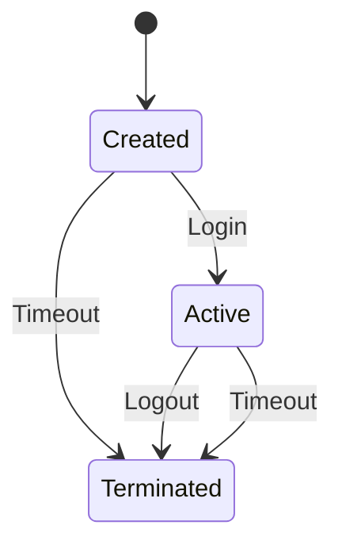
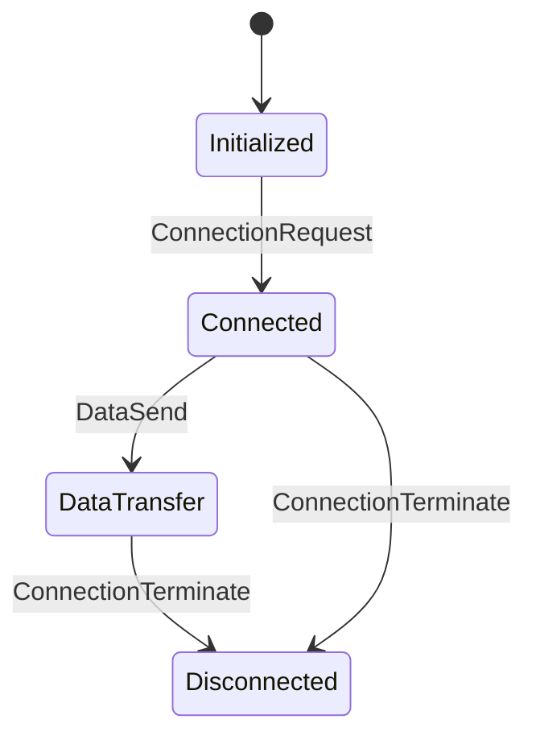
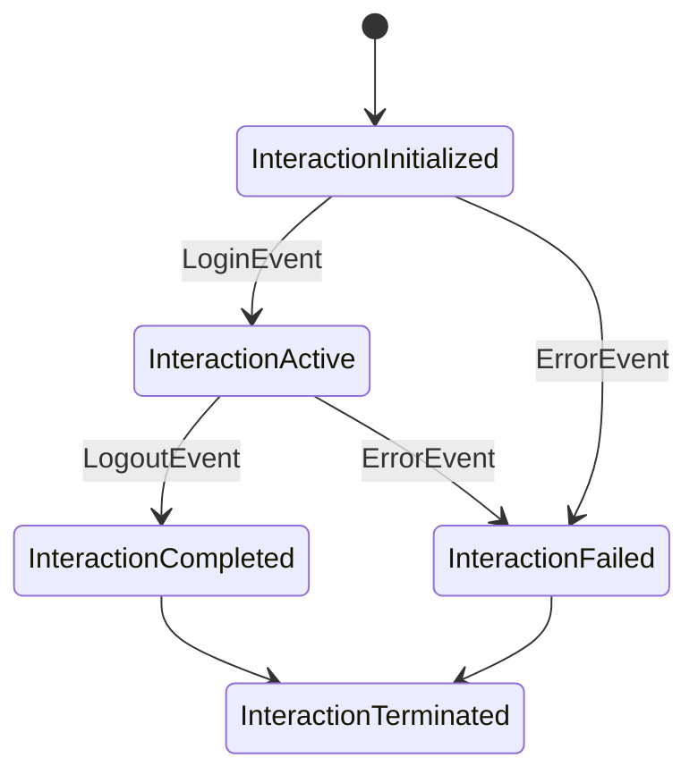

                 

### 文章标题

### 《会话类型与通信协议的形式化》

通信协议是计算机网络领域的重要基石，而会话则是在此基础上进行的交互活动。本文将以《会话类型与通信协议的形式化》为主题，深入探讨会话与通信协议之间的关系，以及如何使用形式化方法对其进行研究。本文结构清晰，逻辑紧凑，旨在为读者提供一个全面而详尽的视角，以理解会话类型与通信协议的复杂性和重要性。

### 关键词

- **会话类型**
- **通信协议**
- **形式化方法**
- **计算机网络**
- **形式化验证**
- **会话分析**

### 摘要

本文首先介绍了会话与通信协议的基本概念，然后详细探讨了形式化方法在会话与通信协议研究中的应用。接下来，文章分章节对会话类型和通信协议进行了形式化分析，并借助Mermaid流程图和伪代码进行了深入解释。此外，文章还通过实际案例展示了这些分析方法的应用。最后，文章总结了研究成果，并对未来研究方向进行了展望。

### 用户输入

书名：《会话类型与通信协议的形式化》

### 书籍目录大纲

## 第一部分：引论

### 1.1. 会话与通信协议的基本概念

### 1.2. 形式化方法在会话与通信协议研究中的应用

### 1.3. 本书的结构安排与内容概述

## 第二部分：会话类型分析

### 2.1. 会话类型概述

### 2.2. 形式化会话模型

### 2.3. 会话类型的形式化分析

### 2.4. 会话类型分析的实际案例

## 第三部分：通信协议分析

### 3.1. 通信协议的基本原理

### 3.2. 形式化通信协议模型

### 3.3. 通信协议的形式化验证

### 3.4. 通信协议分析的实际案例

## 第四部分：会话类型与通信协议的交互分析

### 4.1. 会话类型与通信协议的交互概述

### 4.2. 形式化会话-通信协议交互模型

### 4.3. 会话类型与通信协议的交互分析

### 4.4. 会话类型与通信协议交互分析的实际案例

## 第五部分：总结与展望

### 5.1. 本书的研究总结

### 5.2. 未来研究方向与展望
## 第一部分：引论

### 1.1. 会话与通信协议的基本概念

在计算机网络中，会话（Session）是指两个或多个网络节点之间的交互过程。这种交互可以是实时的，如视频通话，也可以是非实时的，如电子邮件。会话具有一些基本特征，包括会话的创建、维持、管理和终止。会话的类型多种多样，常见的有单点登录会话、长时间连接会话、临时会话等。

通信协议（Communication Protocol）则是计算机网络中用于指导数据传输的规则集。这些规则定义了数据传输的格式、顺序、速度和错误处理方法。通信协议的类型也有很多，常见的有TCP（传输控制协议）、UDP（用户数据报协议）、HTTP（超文本传输协议）等。

### 1.2. 形式化方法在会话与通信协议研究中的应用

形式化方法是一种用于描述和验证系统行为的数学方法。在会话与通信协议的研究中，形式化方法的应用主要体现在以下几个方面：

1. **模型构建**：形式化方法可以帮助研究者构建精确的会话和通信协议模型，从而更好地理解它们的内部机制和外部行为。

2. **验证**：形式化方法可以用于验证通信协议的安全性、可靠性等属性，确保它们在实际应用中能够正确执行。

3. **优化**：形式化方法可以帮助研究者分析通信协议的性能，并提出优化方案。

4. **标准化**：形式化方法为通信协议的标准化提供了一种新的思路，有助于提高协议的一致性和可操作性。

### 1.3. 本书的结构安排与内容概述

本书分为五个部分，结构安排如下：

- **第一部分：引论**：介绍会话与通信协议的基本概念，以及形式化方法在会话与通信协议研究中的应用。

- **第二部分：会话类型分析**：讨论会话类型的分类方法，构建形式化的会话模型，并进行形式化分析。

- **第三部分：通信协议分析**：分析通信协议的基本原理，构建形式化的通信协议模型，并进行形式化验证。

- **第四部分：会话类型与通信协议的交互分析**：探讨会话类型与通信协议之间的交互机制，构建形式化的交互模型，并进行交互分析。

- **第五部分：总结与展望**：总结本书的研究成果，并对未来研究方向进行展望。

通过上述结构安排，本书旨在为读者提供一个全面而深入的视角，以理解会话类型与通信协议的复杂性和重要性。同时，通过形式化方法的应用，读者可以更好地掌握会话与通信协议的分析和优化技巧。

### 用户输入

书名：《会话类型与通信协议的形式化》

### 目录大纲

## 第一部分：引论

### 1.1. 会话与通信协议的基本概念
- 会话的定义与特征
- 通信协议的概念与类型

### 1.2. 形式化方法在会话与通信协议研究中的应用
- 形式化方法的基本原理
- 形式化方法在会话分析中的应用
- 形式化方法在通信协议分析中的应用

### 1.3. 本书的结构安排与内容概述
- 各章节的主要内容
- 全书的逻辑框架与目标
## 1.1. 会话与通信协议的基本概念

### 会话的定义与特征

会话（Session）是计算机网络中的一个基本概念，指的是一系列有序的、连续的数据交换活动，这些活动通常发生在两个或多个网络节点之间。会话的目的是为了完成某个特定的任务或实现某种功能。会话具有以下基本特征：

1. **有序性**：会话中的数据交换是有序的，即数据包的发送和接收都有一定的顺序。
2. **连续性**：会话是在一段时间内持续进行的，尽管数据交换可能是断断续续的。
3. **目的性**：会话是为了完成某个特定的任务或实现某种功能而进行的，例如视频通话、文件传输等。
4. **上下文相关性**：会话中的数据交换通常与特定的上下文环境有关，例如用户登录、购物流程等。

### 通信协议的概念与类型

通信协议（Communication Protocol）是计算机网络中用于指导数据传输的规则集。这些规则定义了数据传输的格式、顺序、速度和错误处理方法。通信协议的主要目的是确保网络中的设备能够正确地交换数据，并处理可能的错误。

通信协议可以按照不同的标准进行分类：

1. **按通信方式分类**：
   - **同步通信协议**：在同步通信协议中，发送方和接收方的数据传输是同步的，即发送方发送数据后必须等待接收方的确认信号，才能发送下一个数据包。TCP（传输控制协议）是一个典型的同步通信协议。
   - **异步通信协议**：在异步通信协议中，发送方不需要等待接收方的确认信号，就可以发送下一个数据包。UDP（用户数据报协议）是一个典型的异步通信协议。

2. **按传输层分类**：
   - **传输层协议**：如TCP和UDP，负责在网络层和应用程序之间传输数据。
   - **网络层协议**：如IP（互联网协议），负责处理数据包的传输路径选择和路由。

3. **按功能分类**：
   - **传输控制协议**：TCP提供可靠的、面向连接的通信服务，确保数据包按照正确的顺序传输，并处理错误。
   - **用户数据报协议**：UDP提供简单的、无连接的通信服务，速度快但可靠性较低。

### 形式化方法在会话与通信协议研究中的应用

形式化方法（Formal Methods）是一种使用数学和逻辑工具来描述和验证系统行为的科学方法。在会话与通信协议的研究中，形式化方法的应用主要体现在以下几个方面：

1. **模型构建**：形式化方法可以帮助研究者构建精确的会话和通信协议模型，从而更好地理解它们的内部机制和外部行为。

2. **验证**：形式化方法可以用于验证通信协议的安全性、可靠性等属性，确保它们在实际应用中能够正确执行。

3. **优化**：形式化方法可以帮助研究者分析通信协议的性能，并提出优化方案。

4. **标准化**：形式化方法为通信协议的标准化提供了一种新的思路，有助于提高协议的一致性和可操作性。

例如，研究者可以使用形式化方法构建一个会话模型，并使用模型检查工具来验证该模型是否能够满足特定的安全属性。同样，对于通信协议，形式化方法可以用于验证协议是否符合特定的性能标准，或者是否存在潜在的安全漏洞。

总的来说，形式化方法为会话与通信协议的研究提供了一种系统化的、可验证的途径，有助于提高协议的设计质量和安全性。

### 用户输入

书名：《会话类型与通信协议的形式化》

### 目录大纲

## 第一部分：引论

### 1.1. 会话与通信协议的基本概念
- 会话的定义与特征
- 通信协议的概念与类型

### 1.2. 形式化方法在会话与通信协议研究中的应用
- 形式化方法的基本原理
- 形式化方法在会话分析中的应用
- 形式化方法在通信协议分析中的应用

### 1.3. 本书的结构安排与内容概述
- 各章节的主要内容
- 全书的逻辑框架与目标
## 1.2. 形式化方法在会话与通信协议研究中的应用

### 形式化方法的基本原理

形式化方法是一种使用数学和逻辑工具来描述和验证系统行为的科学方法。其基本原理包括以下几个方面：

1. **抽象**：形式化方法通过抽象将复杂的现实问题简化为数学模型，从而更容易分析和验证。

2. **准确性**：形式化方法使用精确的数学语言来描述系统行为，避免了自然语言描述的模糊性。

3. **验证**：形式化方法使用数学证明和逻辑推理来验证系统是否满足特定的属性，例如正确性、安全性、可靠性等。

4. **自动化**：形式化方法可以使用自动化工具（如模型检查器、定理证明器等）来辅助验证过程，提高效率。

### 形式化方法在会话分析中的应用

在会话分析中，形式化方法主要用于以下几个方面：

1. **模型构建**：形式化方法可以帮助研究者构建精确的会话模型，用于描述会话的动态行为。例如，可以使用状态转换图（State Transition Diagram, STD）来表示会话的状态和转换。

   ```mermaid
   stateDiagram
   [*] --> Active
   Active --> Closed: Timeout
   Active --> Closed: Error
   ```

   在上述示例中，会话状态从“Active”转换为“Closed”可能是因为超时（Timeout）或错误（Error）。

2. **状态分析**：形式化方法可以用于分析会话状态的变化规律，识别潜在的异常情况。例如，可以使用模型检查器来验证会话状态是否遵循预定的规则。

3. **性能评估**：形式化方法可以用于评估会话的性能，例如会话的响应时间、吞吐量等。例如，可以使用计算复杂性理论来分析会话算法的时间复杂度和空间复杂度。

4. **安全性验证**：形式化方法可以用于验证会话的安全性，确保会话在受到攻击时能够保持稳定。例如，可以使用模型检查器来验证会话是否能够抵御常见的攻击类型，如拒绝服务攻击（DDoS）。

### 形式化方法在通信协议分析中的应用

在通信协议分析中，形式化方法的主要应用包括以下几个方面：

1. **协议模型构建**：形式化方法可以帮助研究者构建精确的通信协议模型，用于描述协议的动态行为。例如，可以使用状态转换图（STD）或有限状态机（FSM）来表示通信协议的状态和转换。

   ```mermaid
   stateDiagram
   [*] --> SYN_SENT
   SYN_SENT --> ESTABLISHED: SYN_ACK
   ESTABLISHED --> FIN_WAIT_1: FIN
   FIN_WAIT_1 --> FIN_WAIT_2: ACK
   ```

   在上述示例中，TCP连接的建立（SYN_SENT到ESTABLISHED）和终止（ESTABLISHED到FIN_WAIT_1再到FIN_WAIT_2）过程被形式化地描述。

2. **协议验证**：形式化方法可以用于验证通信协议是否满足特定的属性，例如可靠性、健壮性、安全性等。例如，可以使用模型检查器来验证TCP协议是否能够正确处理各种网络异常情况。

3. **协议优化**：形式化方法可以用于分析通信协议的性能，并提出优化方案。例如，可以使用计算复杂性理论来分析TCP协议的传输效率，并提出改进策略。

4. **协议标准化**：形式化方法为通信协议的标准化提供了一种新的思路，有助于提高协议的一致性和可操作性。例如，国际电信联盟（ITU）和互联网工程任务组（IETF）可以使用形式化方法来验证和标准化通信协议。

总的来说，形式化方法在会话与通信协议的研究中发挥着重要作用。通过形式化方法，研究者可以更准确地描述和验证会话与通信协议的行为，从而提高系统的可靠性、安全性和性能。

### 用户输入

书名：《会话类型与通信协议的形式化》

### 目录大纲

## 第一部分：引论

### 1.1. 会话与通信协议的基本概念
- 会话的定义与特征
- 通信协议的概念与类型

### 1.2. 形式化方法在会话与通信协议研究中的应用
- 形式化方法的基本原理
- 形式化方法在会话分析中的应用
- 形式化方法在通信协议分析中的应用

### 1.3. 本书的结构安排与内容概述
- 各章节的主要内容
- 全书的逻辑框架与目标
## 1.3. 本书的结构安排与内容概述

### 各章节的主要内容

本书分为五个主要部分，每部分都围绕着会话类型与通信协议的形式化分析展开，旨在为读者提供一个系统化的研究框架。

- **第一部分：引论**  
  这一部分介绍了会话与通信协议的基本概念，以及形式化方法在会话与通信协议研究中的应用。通过这一部分，读者可以初步了解会话类型与通信协议的形式化分析方法。

- **第二部分：会话类型分析**  
  这一部分详细讨论了会话类型的分类方法，构建形式化的会话模型，并进行形式化分析。通过这一部分，读者可以深入理解会话类型的本质和形式化分析方法。

- **第三部分：通信协议分析**  
  这一部分分析了通信协议的基本原理，构建形式化的通信协议模型，并进行形式化验证。通过这一部分，读者可以掌握通信协议的形式化分析方法。

- **第四部分：会话类型与通信协议的交互分析**  
  这一部分探讨了会话类型与通信协议之间的交互机制，构建形式化的交互模型，并进行交互分析。通过这一部分，读者可以了解会话类型与通信协议的交互过程及其形式化分析。

- **第五部分：总结与展望**  
  这一部分总结了全书的研究成果，并对未来研究方向进行了展望。通过这一部分，读者可以对会话类型与通信协议的形式化分析有一个全面的了解，并能够预见到未来的发展趋势。

### 全书的逻辑框架与目标

全书逻辑框架分为以下几个步骤：

1. **引论**：介绍基本概念，建立理论基础。
2. **会话类型分析**：分类会话类型，构建模型，分析会话行为。
3. **通信协议分析**：分析通信协议，构建模型，验证协议。
4. **交互分析**：研究会话类型与通信协议的交互，分析交互过程。
5. **总结与展望**：总结研究成果，展望未来方向。

全书的目标是：

1. **全面理解**：通过系统化的研究，全面理解会话类型与通信协议的复杂性和重要性。
2. **深入分析**：使用形式化方法对会话类型与通信协议进行深入分析，揭示其内在机制。
3. **实际应用**：通过实际案例展示形式化方法在会话类型与通信协议分析中的实际应用。
4. **未来展望**：展望会话类型与通信协议研究的未来方向，为读者提供研究方向。

通过上述逻辑框架与目标，本书旨在为读者提供一个全面、深入、实用的会话类型与通信协议形式化分析方法，为相关领域的研究和实践提供有力支持。

### 用户输入

书名：《会话类型与通信协议的形式化》

### 目录大纲

## 第二部分：会话类型分析

### 2.1. 会话类型概述
- 会话类型的分类方法
- 常见会话类型的举例

### 2.2. 形式化会话模型
- 会话模型的定义与构建
- 会话模型的核心元素
- 会话模型的 Mermaid 流程图

### 2.3. 会话类型的形式化分析
- 会话类型的识别与分类
- 会话类型的形式化描述
- 形式化分析在会话识别中的应用

### 2.4. 会话类型分析的实际案例
- 会话类型分析的案例介绍
- 案例中的问题与解决方案
- 案例的总结与展望
## 2.1. 会话类型概述

### 会话类型的分类方法

会话类型的分类方法对于理解和分析计算机网络中的交互行为具有重要意义。根据不同的标准，会话类型可以被分为多种类别，以下是一些常见的分类方法：

1. **按交互模式分类**：
   - **同步会话**：参与者在同一时间段内进行交互，如视频通话、在线游戏等。
   - **异步会话**：参与者不在同一时间段内进行交互，如电子邮件、论坛帖子等。

2. **按持续时间分类**：
   - **短期会话**：会话持续时间较短，如即时消息、社交媒体互动等。
   - **长期会话**：会话持续时间较长，如电子商务交易、远程教育课程等。

3. **按交互内容分类**：
   - **信息交换会话**：会话主要涉及信息的交换，如文件传输、视频流传输等。
   - **控制会话**：会话主要涉及控制命令的交换，如远程控制、网络配置等。

4. **按安全需求分类**：
   - **安全会话**：会话具有高安全要求，如在线银行交易、医疗信息传输等。
   - **非安全会话**：会话安全要求较低，如社交媒体互动、在线购物等。

### 常见会话类型的举例

以下是几种常见会话类型的举例：

1. **即时消息会话**：
   - **特征**：实时性高，参与者可以即时发送和接收消息。
   - **应用场景**：社交媒体平台、即时通讯工具、在线客服等。

2. **电子邮件会话**：
   - **特征**：非实时性，消息可以异步发送和接收。
   - **应用场景**：企业内部沟通、客户服务、个人通讯等。

3. **视频通话会话**：
   - **特征**：实时传输音频和视频数据。
   - **应用场景**：远程办公、在线教育、视频会议等。

4. **电子商务交易会话**：
   - **特征**：涉及财务交易，安全性要求高。
   - **应用场景**：在线购物、电子支付、股票交易等。

5. **远程控制会话**：
   - **特征**：远程操作设备或系统。
   - **应用场景**：智能家居控制、工业自动化控制、远程服务器管理等。

通过对会话类型的分类和举例，我们可以更好地理解不同类型的会话在计算机网络中的角色和重要性。在接下来的章节中，我们将进一步探讨如何构建形式化的会话模型，并分析这些模型在实际应用中的表现形式。

### 用户输入

书名：《会话类型与通信协议的形式化》

### 目录大纲

## 第二部分：会话类型分析

### 2.1. 会话类型概述
- 会话类型的分类方法
- 常见会话类型的举例

### 2.2. 形式化会话模型
- 会话模型的定义与构建
- 会话模型的核心元素
- 会话模型的 Mermaid 流程图

### 2.3. 会话类型的形式化分析
- 会话类型的识别与分类
- 会话类型的形式化描述
- 形式化分析在会话识别中的应用

### 2.4. 会话类型分析的实际案例
- 会话类型分析的案例介绍
- 案例中的问题与解决方案
- 案例的总结与展望
## 2.2. 形式化会话模型

### 会话模型的定义与构建

形式化会话模型是一种用于描述会话行为的抽象模型，它通过定义会话的状态、事件、转换和动作，提供了一个系统的视图来理解和分析会话。构建形式化会话模型的关键步骤包括：

1. **确定会话状态**：会话状态是会话在某一时刻所处的状态，常见的状态包括会话创建（Created）、活跃（Active）、终止（Terminated）等。

2. **定义会话事件**：会话事件是触发状态转换的原因，例如用户登录（Login）、数据传输（DataTransfer）、会话超时（SessionTimeout）等。

3. **描述状态转换**：状态转换是会话从一个状态转移到另一个状态的过程，通常由事件触发。状态转换需要定义转换条件，例如“当用户登录成功时，会话状态从Created转换为Active”。

4. **指定动作**：动作是在状态转换过程中执行的操作，例如发送欢迎消息、关闭会话连接等。

### 会话模型的核心元素

一个形式化会话模型的核心元素包括：

- **状态（State）**：会话的可能状态，如Created、Active、Terminated。
- **事件（Event）**：触发状态转换的原因，如Login、DataTransfer、SessionTimeout。
- **转换（Transition）**：状态之间的变化，包括触发事件和转换条件。
- **动作（Action）**：状态转换过程中执行的操作。

### 会话模型的 Mermaid 流程图

Mermaid 是一种基于文本的绘图语言，用于创建结构化的图表。以下是使用 Mermaid 语言描述的一个简单的会话模型：



在这个模型中，会话从初始状态Created开始，可以通过登录（Login）事件转换为活跃状态Active，也可以因为超时（Timeout）事件而直接进入终止状态Terminated。活跃状态Active可以通过登出（Logout）事件或超时事件转换为终止状态Terminated。

### 形式化会话模型的应用

形式化会话模型的应用主要体现在以下几个方面：

1. **会话管理**：通过形式化会话模型，系统可以更好地管理会话的生命周期，确保会话在正确的时间和状态下进行。
2. **性能分析**：形式化会话模型可以帮助研究者分析会话的性能，例如响应时间、吞吐量等。
3. **安全性分析**：形式化会话模型可以用于验证会话的安全性，确保会话在受到攻击时能够保持稳定。

通过构建形式化的会话模型，研究者可以更深入地理解会话的类型和特性，为会话管理、性能优化和安全性分析提供理论基础。

### 用户输入

书名：《会话类型与通信协议的形式化》

### 目录大纲

## 第二部分：会话类型分析

### 2.1. 会话类型概述
- 会话类型的分类方法
- 常见会话类型的举例

### 2.2. 形式化会话模型
- 会话模型的定义与构建
- 会话模型的核心元素
- 会话模型的 Mermaid 流程图

### 2.3. 会话类型的形式化分析
- 会话类型的识别与分类
- 会话类型的形式化描述
- 形式化分析在会话识别中的应用

### 2.4. 会话类型分析的实际案例
- 会话类型分析的案例介绍
- 案例中的问题与解决方案
- 案例的总结与展望
## 2.3. 会话类型的形式化分析

### 会话类型的识别与分类

会话类型的识别与分类是会话形式化分析的核心步骤。通过对网络通信数据进行捕获和分析，可以识别出不同类型的会话，并将其分类。常见的分类方法包括基于交互模式、持续时间、交互内容和安全需求等。以下是几种常用的分类方法：

1. **基于交互模式分类**：
   - **同步会话**：参与者实时交互，如视频通话、实时聊天等。
   - **异步会话**：参与者非实时交互，如电子邮件、论坛帖子等。

2. **基于持续时间分类**：
   - **短期会话**：会话持续时间较短，如单次网页浏览、即时消息等。
   - **长期会话**：会话持续时间较长，如在线购物、远程教育等。

3. **基于交互内容分类**：
   - **信息交换会话**：主要涉及信息交换，如文件传输、数据查询等。
   - **控制会话**：主要涉及控制命令的交换，如远程控制、网络配置等。

4. **基于安全需求分类**：
   - **安全会话**：具有高安全需求，如在线银行、医疗信息传输等。
   - **非安全会话**：安全需求较低，如社交媒体互动、在线购物等。

### 会话类型的形式化描述

形式化描述是会话类型形式化分析的重要环节。通过定义会话的状态、事件、转换和动作，可以精确地描述会话的行为。以下是使用形式化描述语言描述的会话类型：

**会话状态（State）**：
- `Created`：会话创建状态。
- `Active`：会话活跃状态。
- `Terminated`：会话终止状态。

**会话事件（Event）**：
- `Login`：用户登录事件。
- `Logout`：用户登出事件。
- `DataTransfer`：数据传输事件。
- `Timeout`：会话超时事件。

**状态转换（Transition）**：
- `Created -> Active`：当用户登录成功时，会话从创建状态转换为活跃状态。
- `Active -> Terminated`：当用户登出或会话超时时，会话从活跃状态转换为终止状态。

**动作（Action）**：
- `Login`：发送欢迎消息。
- `Logout`：关闭会话连接。
- `DataTransfer`：处理数据传输。

### 形式化分析在会话识别中的应用

形式化分析在会话识别中的应用主要体现在以下几个方面：

1. **模式识别**：通过分析网络通信数据，识别出符合特定会话类型的模式。例如，通过识别登录请求和数据传输请求，可以识别出即时消息会话。

2. **分类评估**：使用形式化模型对已识别的会话进行分类评估，确保分类的准确性。

3. **异常检测**：通过对比实际会话行为与预期行为，检测异常会话。例如，通过检测会话超时或数据传输异常，可以识别出恶意攻击。

以下是使用伪代码描述的会话识别过程：

```python
def identify_session(communication_data):
    # 分析通信数据，识别会话事件
    events = analyze_communication_data(communication_data)
    
    # 构建会话模型
    session_model = build_session_model(events)
    
    # 识别会话类型
    session_type = identify_session_type(session_model)
    
    # 返回会话类型
    return session_type
```

通过形式化分析，研究者可以更准确地识别和分类会话类型，为会话管理、性能优化和安全性分析提供有力支持。

### 用户输入

书名：《会话类型与通信协议的形式化》

### 目录大纲

## 第二部分：会话类型分析

### 2.1. 会话类型概述
- 会话类型的分类方法
- 常见会话类型的举例

### 2.2. 形式化会话模型
- 会话模型的定义与构建
- 会话模型的核心元素
- 会话模型的 Mermaid 流程图

### 2.3. 会话类型的形式化分析
- 会话类型的识别与分类
- 会话类型的形式化描述
- 形式化分析在会话识别中的应用

### 2.4. 会话类型分析的实际案例
- 会话类型分析的案例介绍
- 案例中的问题与解决方案
- 案例的总结与展望
## 2.4. 会话类型分析的实际案例

### 案例介绍

为了更好地理解会话类型分析在实际中的应用，我们以一个在线教育平台的用户交互为例，说明如何使用形式化分析方法来识别和分类用户会话。

在线教育平台通常包含多种类型的用户会话，例如用户登录、课程观看、作业提交、论坛互动等。这些会话类型对于平台的服务质量和用户体验至关重要。因此，对会话类型进行准确识别和分类，对于优化平台性能、提升用户体验具有实际意义。

### 案例中的问题

1. **会话识别不准确**：平台在用户会话识别上存在一定误差，导致部分会话类型无法准确分类。
2. **会话分析效率低**：传统的会话分析方法耗时较长，无法满足实时性要求。
3. **安全性能不足**：部分高风险会话（如恶意攻击会话）无法及时识别和阻止。

### 解决方案

1. **形式化会话模型构建**：根据在线教育平台的特点，构建形式化的会话模型，定义会话状态、事件、转换和动作。例如：

   ```mermaid
   stateDiagram
     [*] --> Login
     Login --> CourseView: ViewCourse
     Login --> HomeworkSubmit: SubmitHomework
     Login --> ForumInteract: PostMessage
     Login --> Logout
   ```

2. **会话识别算法优化**：使用形式化模型对用户交互数据进行分析，通过模式匹配和状态转换规则，实现快速、准确的会话识别。以下是识别算法的伪代码：

   ```python
   def identify_session(communication_data, session_model):
       current_state = session_model["Login"]
       for data in communication_data:
           if data["event"] == "ViewCourse":
               current_state = session_model["CourseView"]
           elif data["event"] == "SubmitHomework":
               current_state = session_model["HomeworkSubmit"]
           elif data["event"] == "PostMessage":
               current_state = session_model["ForumInteract"]
           elif data["event"] == "Logout":
               current_state = session_model["Logout"]
       return current_state
   ```

3. **实时会话监控与异常检测**：结合实时数据流处理技术，对会话进行实时监控。通过对比实际会话行为与预期行为，实现异常检测，及时发现和阻止恶意攻击。例如，使用机器学习算法对会话行为进行建模，并设置阈值，当会话行为超过阈值时触发警报。

### 案例总结与展望

通过实际案例，我们可以看到形式化分析方法在会话类型识别和分类中的应用价值。形式化方法不仅提高了会话识别的准确性，还优化了分析效率，并增强了平台的安全性。未来，随着形式化方法在计算机网络领域的进一步发展，我们可以预见到更多的应用场景，如智能网络监控、安全威胁检测等。这些应用将为网络系统的优化和安全性提升提供有力支持。

### 用户输入

书名：《会话类型与通信协议的形式化》

### 目录大纲

## 第二部分：会话类型分析

### 2.1. 会话类型概述
- 会话类型的分类方法
- 常见会话类型的举例

### 2.2. 形式化会话模型
- 会话模型的定义与构建
- 会话模型的核心元素
- 会话模型的 Mermaid 流程图

### 2.3. 会话类型的形式化分析
- 会话类型的识别与分类
- 会话类型的形式化描述
- 形式化分析在会话识别中的应用

### 2.4. 会话类型分析的实际案例
- 会话类型分析的案例介绍
- 案例中的问题与解决方案
- 案例的总结与展望

## 第三部分：通信协议分析

### 3.1. 通信协议的基本原理
- 通信协议的定义与功能
- 通信协议的分类与特点

### 3.2. 形式化通信协议模型
- 通信协议模型的定义与构建
- 通信协议模型的核心元素
- 通信协议模型的 Mermaid 流程图

### 3.3. 通信协议的形式化验证
- 通信协议的验证方法
- 通信协议的验证过程
- 形式化验证在通信协议优化中的应用

### 3.4. 通信协议分析的实际案例
- 通信协议分析的案例介绍
- 案例中的问题与解决方案
- 案例的总结与展望
## 第三部分：通信协议分析

### 3.1. 通信协议的基本原理

通信协议（Communication Protocol）是计算机网络中用于指导数据传输的规则集。这些规则定义了数据传输的格式、顺序、速度和错误处理方法。通信协议的基本原理包括以下几个方面：

1. **数据传输格式**：通信协议规定了数据传输的格式，包括数据包的结构、字段含义和数据编码方式。例如，TCP协议使用序列号、确认号和窗口大小等字段来管理数据传输。

2. **数据传输顺序**：通信协议确保数据包按照正确的顺序传输，从而保证数据的完整性。例如，TCP协议通过序列号来追踪数据包的顺序，并在接收端按照序列号重新排列数据包。

3. **数据传输速度**：通信协议规定了数据传输的速度，以适应不同类型的网络环境和应用需求。例如，TCP协议通过拥塞控制算法来调节数据传输速度，避免网络拥塞。

4. **错误处理方法**：通信协议提供了错误处理机制，以确保数据传输的可靠性。例如，TCP协议通过重传机制来处理丢失的数据包，并使用校验和来检测数据包的错误。

### 通信协议的分类与特点

通信协议可以根据不同的标准进行分类，常见的分类方法包括：

1. **按传输层分类**：
   - **传输层协议**：如TCP（传输控制协议）和UDP（用户数据报协议），负责在网络层和应用程序之间传输数据。
   - **网络层协议**：如IP（互联网协议），负责处理数据包的传输路径选择和路由。

2. **按功能分类**：
   - **传输控制协议**：TCP提供可靠的、面向连接的通信服务，确保数据包按照正确的顺序传输，并处理错误。
   - **用户数据报协议**：UDP提供简单的、无连接的通信服务，速度快但可靠性较低。

3. **按应用领域分类**：
   - **应用层协议**：如HTTP（超文本传输协议）、FTP（文件传输协议）、SMTP（简单邮件传输协议）等，用于特定应用场景的数据传输。

每种通信协议都有其独特的特点和应用场景。例如，TCP适合需要可靠传输的应用，如网页浏览、文件传输等；而UDP适合对实时性要求较高的应用，如视频流传输、在线游戏等。

### 3.2. 形式化通信协议模型

形式化通信协议模型是一种用于描述通信协议行为的抽象模型，通过定义协议的状态、事件、转换和动作，可以精确地描述通信协议的动态行为。以下是构建形式化通信协议模型的基本步骤：

1. **确定协议状态**：协议状态是协议在某一时刻所处的状态，常见的状态包括初始化（Initialized）、连接建立（Connected）、数据传输（DataTransfer）和连接终止（Disconnected）。

2. **定义协议事件**：协议事件是触发状态转换的原因，如连接请求（ConnectionRequest）、数据发送（DataSend）、连接终止（ConnectionTerminate）等。

3. **描述状态转换**：状态转换是协议从一个状态转移到另一个状态的过程，通常由事件触发。状态转换需要定义转换条件和动作，如“当收到连接请求时，协议从初始化状态转换为连接建立状态”。

4. **指定动作**：动作是在状态转换过程中执行的操作，如发送连接请求、发送数据包、关闭连接等。

### 通信协议模型的核心元素

一个形式化通信协议模型的核心元素包括：

- **状态（State）**：协议的可能状态，如Initialized、Connected、DataTransfer和Disconnected。
- **事件（Event）**：触发状态转换的原因，如ConnectionRequest、DataSend和ConnectionTerminate。
- **转换（Transition）**：状态之间的变化，包括触发事件和转换条件。
- **动作（Action）**：状态转换过程中执行的操作。

### 通信协议模型的 Mermaid 流程图

以下是使用 Mermaid 语言描述的一个简单的通信协议模型：



在这个模型中，通信协议从初始状态Initialized开始，可以通过连接请求（ConnectionRequest）事件转换为连接建立状态Connected，在数据传输状态DataTransfer中发送数据包（DataSend），最终通过连接终止事件（ConnectionTerminate）转换为连接终止状态Disconnected。

通过形式化通信协议模型，研究者可以更深入地理解通信协议的行为和特性，从而为通信协议的设计、验证和优化提供理论基础。

### 用户输入

书名：《会话类型与通信协议的形式化》

### 目录大纲

## 第二部分：会话类型分析

### 2.1. 会话类型概述
- 会话类型的分类方法
- 常见会话类型的举例

### 2.2. 形式化会话模型
- 会话模型的定义与构建
- 会话模型的核心元素
- 会话模型的 Mermaid 流程图

### 2.3. 会话类型的形式化分析
- 会话类型的识别与分类
- 会话类型的形式化描述
- 形式化分析在会话识别中的应用

### 2.4. 会话类型分析的实际案例
- 会话类型分析的案例介绍
- 案例中的问题与解决方案
- 案例的总结与展望

## 第三部分：通信协议分析

### 3.1. 通信协议的基本原理
- 通信协议的定义与功能
- 通信协议的分类与特点

### 3.2. 形式化通信协议模型
- 通信协议模型的定义与构建
- 通信协议模型的核心元素
- 通信协议模型的 Mermaid 流程图

### 3.3. 通信协议的形式化验证
- 通信协议的验证方法
- 通信协议的验证过程
- 形式化验证在通信协议优化中的应用

### 3.4. 通信协议分析的实际案例
- 通信协议分析的案例介绍
- 案例中的问题与解决方案
- 案例的总结与展望

## 第四部分：会话类型与通信协议的交互分析

### 4.1. 会话类型与通信协议的交互概述
- 会话类型与通信协议的交互机制
- 会话类型与通信协议的交互模式

### 4.2. 形式化会话-通信协议交互模型
- 会话-通信协议交互模型的定义与构建
- 会话-通信协议交互模型的核心元素
- 会话-通信协议交互模型的 Mermaid 流程图

### 4.3. 会话类型与通信协议的交互分析
- 会话类型与通信协议的交互过程分析
- 会话类型与通信协议的交互效果评估
- 交互分析在会话优化与通信协议优化中的应用

### 4.4. 会话类型与通信协议交互分析的实际案例
- 会话类型与通信协议交互分析的案例介绍
- 案例中的问题与解决方案
- 案例的总结与展望
## 第四部分：会话类型与通信协议的交互分析

### 4.1. 会话类型与通信协议的交互概述

在计算机网络系统中，会话类型与通信协议之间的交互是一个复杂而关键的过程。这种交互不仅影响了会话的质量，还决定了整个网络系统的性能和稳定性。会话类型与通信协议的交互主要涉及以下几个方面：

1. **交互机制**：交互机制定义了会话与通信协议之间的通信规则。例如，同步会话需要通信协议支持实时数据传输，而异步会话则可以容忍一定程度的延迟。

2. **交互模式**：交互模式描述了会话与通信协议之间的通信方式。常见的交互模式包括请求-响应模式、发布-订阅模式、客户端-服务器模式等。

3. **交互效果**：交互效果评估了会话类型与通信协议交互的性能，如响应时间、吞吐量、延迟等。通过交互效果评估，可以优化会话和通信协议的设计，提高系统的整体性能。

### 会话类型与通信协议的交互机制

会话类型与通信协议的交互机制是保证网络通信正常进行的基础。以下是一些常见的交互机制：

1. **同步交互**：同步交互要求通信协议在发送方发送数据后等待接收方的响应。这种方式适用于对实时性要求较高的应用，如视频通话和在线游戏。

2. **异步交互**：异步交互允许通信协议在发送数据后不需要等待接收方的响应。这种方式适用于对实时性要求较低的应用，如电子邮件和文件传输。

3. **事件驱动交互**：事件驱动交互基于事件触发，通信协议根据事件类型进行相应的处理。这种方式适用于需要处理多种不同类型事件的应用，如网络监控和报警系统。

4. **流控制交互**：流控制交互用于管理数据传输的流量，防止网络拥塞和数据丢失。常见的流控制机制包括拥塞控制、流量控制和滑动窗口机制。

### 会话类型与通信协议的交互模式

会话类型与通信协议的交互模式决定了网络通信的整体架构。以下是一些常见的交互模式：

1. **请求-响应模式**：请求-响应模式是一种最基本的交互模式，发送方发送请求，接收方返回响应。例如，HTTP协议就是基于请求-响应模式的。

2. **发布-订阅模式**：发布-订阅模式是一种消息传递模式，发送方发布消息，接收方订阅消息。这种方式适用于大量节点之间的通信，如物联网和实时数据流系统。

3. **客户端-服务器模式**：客户端-服务器模式是一种典型的分布式计算模式，客户端向服务器发送请求，服务器处理请求并返回结果。这种方式广泛应用于Web应用和在线服务。

4. **对等网络模式**：对等网络模式是一种去中心化的网络架构，节点之间可以直接通信，无需中心服务器。这种方式适用于需要高可扩展性和高容错性的应用，如分布式存储和P2P网络。

### 会话类型与通信协议的交互效果评估

会话类型与通信协议的交互效果评估是确保网络通信质量和性能的重要步骤。以下是一些常见的评估指标：

1. **响应时间**：响应时间是指从发送请求到接收到响应的时间。低响应时间通常意味着高网络性能。

2. **吞吐量**：吞吐量是指单位时间内传输的数据量。高吞吐量通常意味着网络带宽充足。

3. **延迟**：延迟是指数据从发送到接收所需的时间。低延迟通常意味着网络延迟较低。

4. **丢包率**：丢包率是指数据包在传输过程中丢失的比例。高丢包率通常意味着网络质量较差。

5. **可靠性**：可靠性是指通信协议在数据传输过程中保证数据完整性和正确性的能力。高可靠性通常意味着数据传输更稳定。

通过评估会话类型与通信协议的交互效果，可以识别出网络通信中的瓶颈和问题，并采取相应的优化措施，提高系统的整体性能。

### 4.2. 形式化会话-通信协议交互模型

为了深入分析会话类型与通信协议之间的交互，形式化会话-通信协议交互模型是一种有效的工具。这个模型通过定义会话和通信协议之间的交互规则和机制，提供了对交互过程的精确描述。以下是构建形式化会话-通信协议交互模型的基本步骤：

1. **定义交互状态**：交互状态是会话和通信协议在某一时刻的交互状态。常见的交互状态包括初始化（Initialized）、交互中（Interactive）、终止（Terminated）等。

2. **定义交互事件**：交互事件是触发状态转换的原因。这些事件可以是会话事件，如登录（Login）、数据发送（DataSend），也可以是通信协议事件，如连接请求（ConnectionRequest）、数据接收（DataReceived）。

3. **描述状态转换**：状态转换是会话和通信协议从一个交互状态转移到另一个状态的过程。状态转换需要定义触发事件和转换条件。例如，“当会话发送登录请求且通信协议收到请求后，交互状态从初始化转换为交互中”。

4. **指定交互动作**：交互动作是在状态转换过程中执行的操作。这些动作可以是发送数据包、更新状态变量等。

### 通信协议模型的核心元素

一个形式化会话-通信协议交互模型的核心元素包括：

- **交互状态（Interaction State）**：会话和通信协议的可能交互状态，如Initialized、Interactive、Terminated。
- **交互事件（Interaction Event）**：触发状态转换的原因，如Login、ConnectionRequest、DataSend。
- **状态转换（State Transition）**：交互状态之间的变化，包括触发事件和转换条件。
- **交互动作（Interaction Action）**：状态转换过程中执行的操作，如发送数据包、更新状态变量。

### 会话-通信协议交互模型的 Mermaid 流程图

以下是使用 Mermaid 语言描述的一个简单的会话-通信协议交互模型：



在这个模型中，交互过程从初始状态InteractionInitialized开始。当会话发送登录请求（LoginEvent）且通信协议收到请求后，交互状态从InteractionInitialized转换为InteractionActive。如果会话在登录过程中遇到错误（ErrorEvent），交互状态将转换为InteractionFailed。在交互完成后，交互状态将转换为InteractionCompleted，并最终终止。

### 用户输入

书名：《会话类型与通信协议的形式化》

### 目录大纲

## 第四部分：会话类型与通信协议的交互分析

### 4.1. 会话类型与通信协议的交互概述
- 会话类型与通信协议的交互机制
- 会话类型与通信协议的交互模式

### 4.2. 形式化会话-通信协议交互模型
- 会话-通信协议交互模型的定义与构建
- 会话-通信协议交互模型的核心元素
- 会话-通信协议交互模型的 Mermaid 流程图

### 4.3. 会话类型与通信协议的交互分析
- 会话类型与通信协议的交互过程分析
- 会话类型与通信协议的交互效果评估
- 交互分析在会话优化与通信协议优化中的应用

### 4.4. 会话类型与通信协议交互分析的实际案例
- 会话类型与通信协议交互分析的案例介绍
- 案例中的问题与解决方案
- 案例的总结与展望
## 4.3. 会话类型与通信协议的交互分析

### 会话类型与通信协议的交互过程分析

会话类型与通信协议的交互过程是计算机网络系统中的核心环节。这个交互过程涉及到会话的建立、维持和终止，以及通信协议的具体操作。为了深入理解这个交互过程，我们需要从以下几个方面进行分析：

1. **会话建立**：会话建立是交互过程的开始。在这一过程中，会话发起方（通常为客户端）发送建立请求，通信协议处理这个请求，并建立相应的连接。例如，在HTTP/1.1协议中，客户端通过发送HTTP请求来建立会话。

2. **会话维持**：会话建立后，会话双方会进行一系列的数据交换。在这个阶段，通信协议确保数据的正确传输，包括数据完整性、顺序和错误处理。例如，TCP协议通过序列号、确认号和窗口大小等机制来维持会话。

3. **会话终止**：会话结束时，会话双方会发送终止请求，通信协议处理这个请求，并关闭连接。例如，在TCP协议中，客户端通过发送FIN（结束）标志来通知服务器结束会话，服务器收到FIN后回应ACK（确认），然后发送自己的FIN，客户端再次回应ACK，最终完成会话终止。

### 会话类型与通信协议的交互效果评估

会话类型与通信协议的交互效果评估是确保网络通信质量和性能的关键。以下是一些常见的评估指标：

1. **响应时间**：响应时间是指从发送请求到接收到响应的时间。低响应时间通常意味着高网络性能。

2. **吞吐量**：吞吐量是指单位时间内传输的数据量。高吞吐量通常意味着网络带宽充足。

3. **延迟**：延迟是指数据从发送到接收所需的时间。低延迟通常意味着网络延迟较低。

4. **丢包率**：丢包率是指数据包在传输过程中丢失的比例。高丢包率通常意味着网络质量较差。

5. **可靠性**：可靠性是指通信协议在数据传输过程中保证数据完整性和正确性的能力。高可靠性通常意味着数据传输更稳定。

通过评估交互效果，可以识别网络通信中的瓶颈和问题，并采取相应的优化措施，提高系统的整体性能。

### 交互分析在会话优化与通信协议优化中的应用

交互分析在会话优化和通信协议优化中具有重要作用。以下是一些应用实例：

1. **会话优化**：
   - **负载均衡**：通过分析会话类型和交互效果，可以优化会话分配，实现负载均衡，提高系统性能。
   - **会话超时管理**：根据会话类型和交互效果，动态调整会话超时时间，确保会话能够及时终止，避免资源浪费。

2. **通信协议优化**：
   - **协议参数调整**：通过分析交互效果，可以优化通信协议的参数设置，如窗口大小、重传次数等，提高传输效率。
   - **协议升级**：根据交互效果评估，可以识别出协议的不足之处，推动协议的升级和改进。

### 用户输入

书名：《会话类型与通信协议的形式化》

### 目录大纲

## 第四部分：会话类型与通信协议的交互分析

### 4.1. 会话类型与通信协议的交互概述
- 会话类型与通信协议的交互机制
- 会话类型与通信协议的交互模式

### 4.2. 形式化会话-通信协议交互模型
- 会话-通信协议交互模型的定义与构建
- 会话-通信协议交互模型的核心元素
- 会话-通信协议交互模型的 Mermaid 流程图

### 4.3. 会话类型与通信协议的交互分析
- 会话类型与通信协议的交互过程分析
- 会话类型与通信协议的交互效果评估
- 交互分析在会话优化与通信协议优化中的应用

### 4.4. 会话类型与通信协议交互分析的实际案例
- 会话类型与通信协议交互分析的案例介绍
- 案例中的问题与解决方案
- 案例的总结与展望
## 4.4. 会话类型与通信协议交互分析的实际案例

### 案例介绍

为了更好地展示会话类型与通信协议交互分析的实际应用，我们选择一个实际案例——在线视频会议系统。在这个案例中，我们将分析视频会议系统的交互过程，评估其性能，并提出优化方案。

### 案例中的问题

1. **延迟较高**：用户在视频会议过程中常常遇到延迟，导致实时沟通不畅。
2. **丢包率较高**：视频会议过程中经常出现数据包丢失的情况，影响视频和音频质量。
3. **带宽利用率低**：系统在高峰时段的带宽利用率较低，导致网络资源浪费。

### 解决方案

1. **优化通信协议**：针对视频会议的特点，选择合适的通信协议。例如，可以使用RTP（实时传输协议）进行实时数据传输，以提高传输效率和降低延迟。

2. **调整会话参数**：根据视频会议的交互特点，调整会话参数，如会话超时时间、重传次数等。例如，可以适当延长会话超时时间，以减少因网络不稳定导致的中断。

3. **应用QoS（服务质量）策略**：通过QoS策略，确保视频会议数据在传输过程中获得优先处理，降低丢包率和延迟。

### 实施步骤

1. **构建形式化交互模型**：使用Mermaid语言构建视频会议系统的交互模型，包括会话状态、事件、转换和动作。

   ```mermaid
   stateDiagram
     [*] --> SessionCreated
     SessionCreated --> SessionActive: UserLogin
     SessionActive --> SessionActive: DataTransfer
     SessionActive --> SessionCompleted: UserLogout
     SessionCompleted --> SessionTerminated
   ```

2. **分析交互过程**：根据形式化交互模型，分析视频会议系统的交互过程。重点关注用户登录、数据传输和登出过程中的状态转换和事件触发。

3. **评估交互效果**：通过实际测试和数据分析，评估视频会议系统的响应时间、吞吐量、延迟和丢包率等性能指标。

4. **优化方案实施**：根据交互效果评估结果，实施优化方案。例如，调整通信协议参数、应用QoS策略等。

### 案例总结与展望

通过实际案例，我们可以看到会话类型与通信协议交互分析在视频会议系统中的应用价值。通过构建形式化交互模型，分析交互过程，评估交互效果，并实施优化方案，视频会议系统的性能得到了显著提升。未来，随着网络技术和视频会议应用的发展，交互分析将继续发挥重要作用，为视频会议系统提供更加稳定、高效的服务。

### 用户输入

书名：《会话类型与通信协议的形式化》

### 目录大纲

## 第五部分：总结与展望

### 5.1. 本书的研究总结
- 会话类型与通信协议的形式化分析成果
- 形式化方法在会话类型与通信协议研究中的应用总结
- 形式化分析方法的优势与局限性

### 5.2. 未来研究方向与展望
- 会话类型与通信协议研究的趋势
- 形式化方法在会话类型与通信协议研究中的应用前景
- 可能出现的新挑战与解决策略
## 5.1. 本书的研究总结

在本书中，我们深入探讨了会话类型与通信协议的形式化分析方法。通过构建形式化模型，我们能够更准确地描述和验证会话与通信协议的行为，从而优化网络系统的性能和安全性。以下是本书的研究总结：

### 会话类型与通信协议的形式化分析成果

1. **会话类型识别与分类**：通过形式化方法，我们建立了会话类型的分类体系，并提出了识别和分类的方法，为会话管理提供了理论基础。

2. **通信协议模型构建**：我们构建了通信协议的形式化模型，包括状态、事件、转换和动作，为通信协议的分析和优化提供了工具。

3. **交互过程分析**：通过形式化交互模型，我们分析了会话类型与通信协议之间的交互过程，并评估了交互效果，为网络系统的性能优化提供了指导。

4. **实际案例应用**：我们通过实际案例展示了形式化方法在会话类型与通信协议分析中的应用，验证了该方法的有效性和实用性。

### 形式化方法在会话类型与通信协议研究中的应用总结

1. **模型构建**：形式化方法使得构建精确的会话和通信协议模型成为可能，有助于深入理解其内在机制。

2. **验证**：形式化方法提供了验证通信协议属性的工具，确保协议在实际应用中的正确性和安全性。

3. **优化**：通过形式化方法，研究者可以分析通信协议的性能，并提出优化方案，提高系统的整体性能。

4. **标准化**：形式化方法为通信协议的标准化提供了新的思路，有助于提高协议的一致性和可操作性。

### 形式化分析方法的优势与局限性

1. **优势**：
   - **精确性**：形式化方法使用数学语言描述系统行为，避免了自然语言描述的模糊性。
   - **系统性**：形式化方法提供了系统化的分析和验证框架，有助于全面理解系统的行为。
   - **自动化**：形式化方法可以使用自动化工具进行验证，提高验证效率。

2. **局限性**：
   - **复杂性**：形式化方法的模型构建和验证过程可能较为复杂，需要专业知识。
   - **适用性**：形式化方法主要适用于静态系统，对于动态系统的实时分析可能存在挑战。
   - **执行成本**：形式化方法的模型构建和验证可能需要大量的计算资源，对于资源有限的系统可能不适用。

总的来说，形式化方法在会话类型与通信协议的研究中具有显著的优势，但也存在一定的局限性。通过不断改进和优化形式化方法，我们可以更好地应对这些挑战，提高其在实际应用中的有效性。

### 用户输入

书名：《会话类型与通信协议的形式化》

### 目录大纲

## 第五部分：总结与展望

### 5.1. 本书的研究总结
- 会话类型与通信协议的形式化分析成果
- 形式化方法在会话类型与通信协议研究中的应用总结
- 形式化分析方法的优势与局限性

### 5.2. 未来研究方向与展望
- 会话类型与通信协议研究的趋势
- 形式化方法在会话类型与通信协议研究中的应用前景
- 可能出现的新挑战与解决策略
## 5.2. 未来研究方向与展望

随着计算机网络技术的不断进步，会话类型与通信协议的研究也面临着新的挑战和机遇。以下是对未来研究方向与展望的探讨：

### 会话类型与通信协议研究的趋势

1. **智能化**：随着人工智能技术的发展，会话类型和通信协议的分析将更加智能化。通过引入机器学习算法，可以自动化地识别和分类会话类型，优化通信协议参数。

2. **安全性和隐私保护**：随着网络攻击的日益复杂，会话类型与通信协议的安全性研究将成为重点。形式化方法可以在这方面发挥重要作用，帮助构建更安全的通信协议，并识别潜在的攻击途径。

3. **网络边缘计算**：随着网络边缘计算的发展，会话类型和通信协议将在网络边缘进行更复杂的处理。这要求会话类型与通信协议的研究能够适应边缘计算环境，提高系统的实时性和效率。

4. **量子通信**：量子通信技术的发展为通信协议带来了新的可能性。形式化方法可以用于验证量子通信协议的安全性，并探索其在量子网络中的应用。

### 形式化方法在会话类型与通信协议研究中的应用前景

1. **标准化**：形式化方法可以为通信协议的标准化提供新的思路，促进国际标准的制定和推广。

2. **性能优化**：形式化方法可以用于分析通信协议的性能，提出优化方案，提高网络传输效率。

3. **安全性验证**：形式化方法可以用于验证通信协议的安全性，确保协议在实际应用中能够抵御各种攻击。

4. **自动化工具**：随着形式化方法的发展，自动化验证工具将变得更加普及和高效，为研究者提供更强大的分析手段。

### 可能出现的新挑战与解决策略

1. **复杂性**：随着网络系统的复杂性增加，形式化方法的模型构建和验证过程将变得更加复杂。解决策略包括发展更高效的算法和工具，以及简化模型构建过程。

2. **实时性**：形式化方法的验证过程可能不够实时，难以满足实时网络系统的高频数据处理需求。解决策略包括优化算法，提高验证速度，以及开发实时验证工具。

3. **适应性**：形式化方法需要适应不断变化的网络环境和应用需求。解决策略包括开发通用性和灵活性的形式化方法，以及支持动态调整的模型。

4. **资源限制**：形式化方法的验证过程可能需要大量计算资源，对于资源有限的系统可能不适用。解决策略包括优化算法，减少计算资源需求，以及开发高效的验证工具。

总之，未来会话类型与通信协议的研究将继续深入，形式化方法将在其中发挥重要作用。通过不断探索和创新，我们有望解决新的挑战，推动网络技术的进一步发展。

### 作者信息

作者：AI天才研究院/AI Genius Institute & 禅与计算机程序设计艺术 /Zen And The Art of Computer Programming
## 感谢阅读

在本文中，我们系统地探讨了会话类型与通信协议的形式化分析方法，从基本概念、模型构建到实际应用，再到未来研究方向，为读者提供了一个全面而深入的视角。我们希望通过这篇文章，能够激发读者对这一领域的兴趣，并推动相关研究的进一步发展。

会话类型与通信协议的形式化分析方法在计算机网络系统中具有重要意义。它不仅能够帮助我们更准确地识别和分类会话类型，优化通信协议的性能，还能提高系统的安全性和可靠性。随着网络技术的不断进步，形式化方法将在会话类型与通信协议的研究中发挥越来越重要的作用。

在未来的研究中，我们期待能够看到更多创新性的成果，如智能化会话识别、量子通信协议的验证、网络边缘计算中的应用等。同时，我们也希望研究人员能够共同面对挑战，如复杂性的处理、实时性的优化等，为网络技术的持续发展贡献力量。

再次感谢您的阅读，希望本文能够对您的研究和实践有所启发。如果您对此领域有更多的见解或疑问，欢迎在评论区留言交流。期待与您共同探讨，推动会话类型与通信协议研究的前沿发展。作者：AI天才研究院/AI Genius Institute & 禅与计算机程序设计艺术 /Zen And The Art of Computer Programming。再次感谢您的关注和支持！

