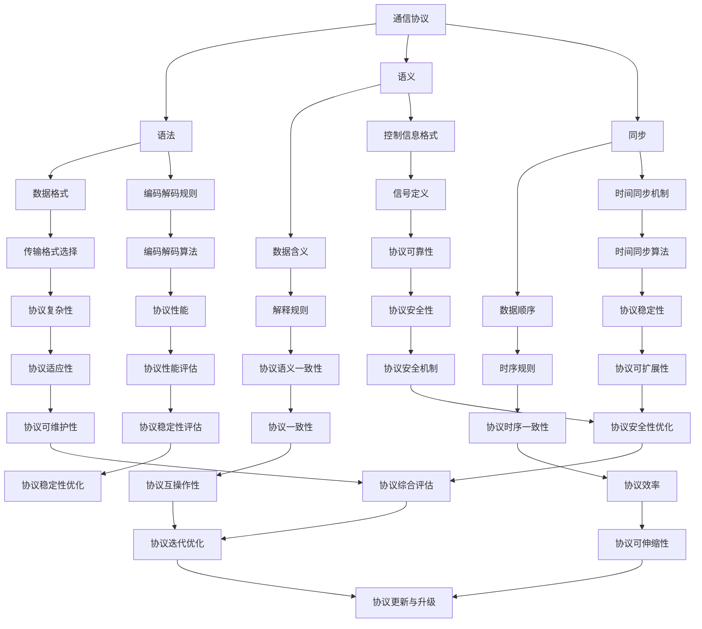
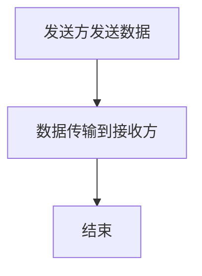
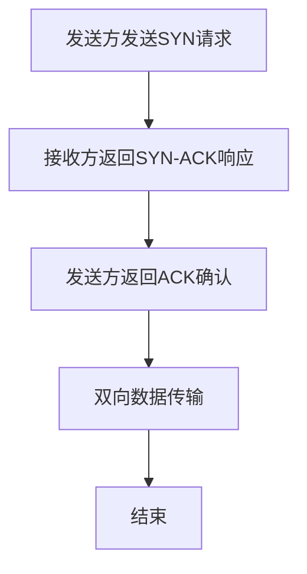
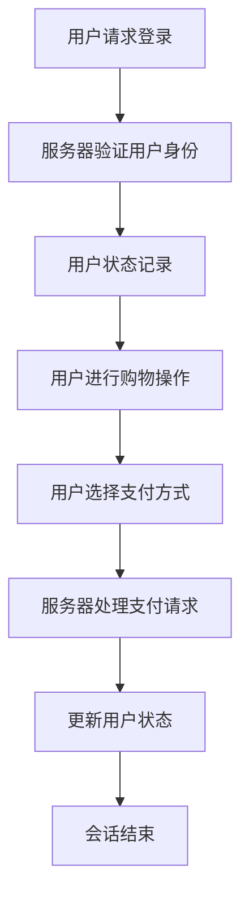
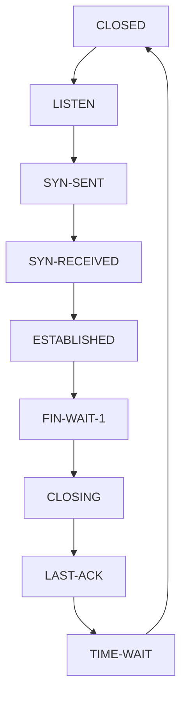
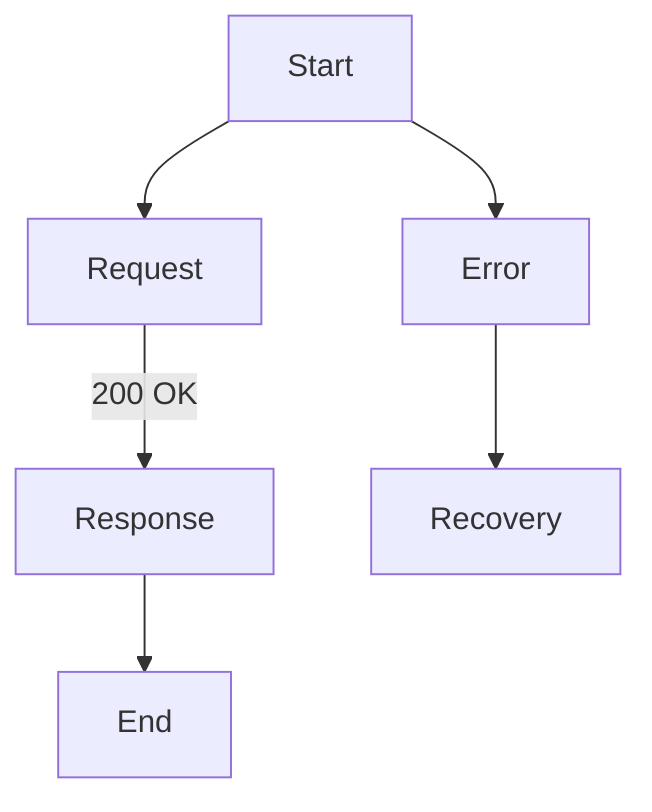
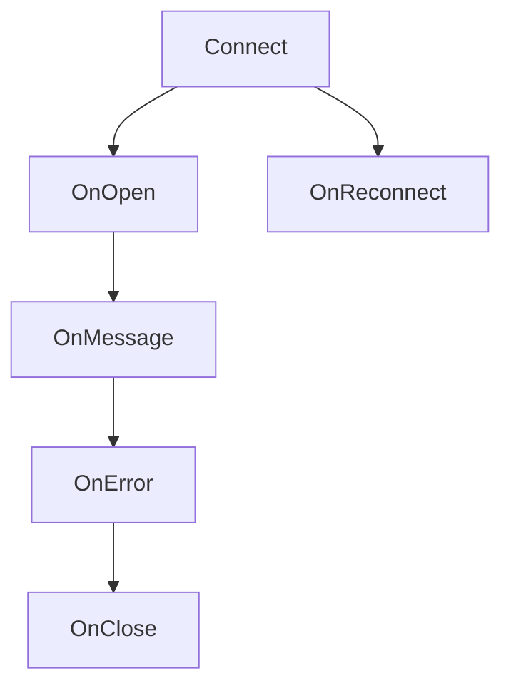
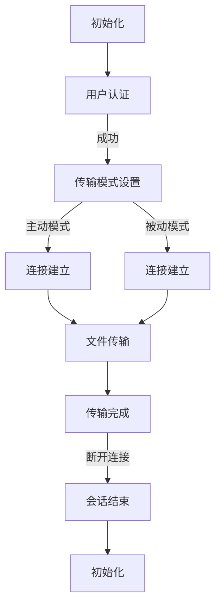
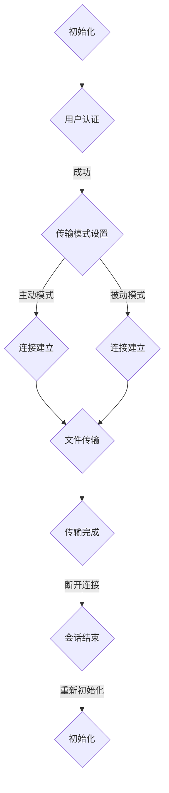
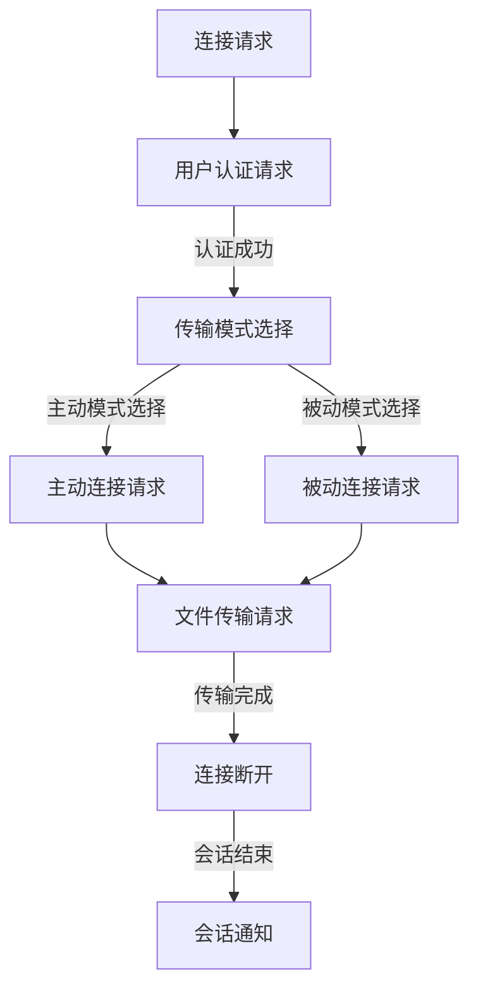

                 

### 引言与概述

在信息化社会中，通信协议作为计算机网络和分布式系统的基础，承载了数据传输的桥梁作用。通信协议是一种规则集，用于定义数据交换的过程，确保数据在不同的系统间能够准确无误地传递。通信协议的规范性和标准化对于保障网络的稳定运行、提高数据传输效率、增强系统安全性至关重要。

通信协议的分类方法多种多样，可以从不同的角度进行划分。基于通信方式，通信协议可以分为同步协议和异步协议；基于通信目的，可以分为传输控制协议（TCP）、用户数据报协议（UDP）、文件传输协议（FTP）等；基于通信模型，可以分为客户机/服务器模型和P2P模型。这些分类方法为我们理解和应用通信协议提供了不同的视角。

会话类型是通信协议中的一个重要概念，指的是通信双方在一段特定时间内进行的交互活动。根据交互的特点，会话类型可以分为交互式会话、事务性会话和对话性会话。交互式会话强调实时性，如即时消息应用；事务性会话强调完成特定任务，如在线购物支付；对话性会话则强调持续的交流，如视频会议。

本章将首先介绍通信协议的基本概念，然后详细探讨通信协议的分类和会话类型的定义与分类。通过对这些基础概念的理解，读者可以为进一步学习通信协议的设计原则和实现方法打下坚实的基础。

### 通信协议的基本概念

通信协议是一种规则集，用于定义数据在网络中传输的格式、顺序和传输机制。它不仅包括数据传输的语法（即数据格式），还包括语义（即数据含义）和同步（即数据传输的顺序）。通信协议的核心目的是确保数据在不同系统间能够准确无误地传递，同时提高传输效率和系统稳定性。

#### 通信协议的组成部分

通信协议通常包括以下三个主要组成部分：

1. **语法**：定义了数据传输的格式。例如，数据是否以二进制、文本或其他格式传输，以及数据是如何编码和解码的。

2. **语义**：定义了数据的含义和解释。它包括控制信息的格式、编码和信号等。语义规定了发送者和接收者如何解释收到的数据。

3. **同步**：定义了数据的传输顺序和时序。它包括数据包的发送和接收时间、数据包的顺序以及时间同步机制。

#### 通信协议的分类

通信协议可以从不同的角度进行分类。以下是一些常见的分类方法：

1. **基于通信方式的分类**：
   - **同步通信协议**：数据传输是同步的，发送方必须等待接收方确认数据已收到，例如TCP协议。
   - **异步通信协议**：数据传输是异步的，发送方不必等待接收方确认，例如UDP协议。

2. **基于通信目的的分类**：
   - **传输控制协议（TCP）**：提供可靠的数据传输，确保数据包按顺序到达且无错误。
   - **用户数据报协议（UDP）**：提供不可靠的数据传输，适用于对速度要求较高而容错性要求较低的应用。
   - **文件传输协议（FTP）**：用于在网络上进行文件传输。
   - **超文本传输协议（HTTP）**：用于在Web浏览器和服务器之间传输网页内容。
   - **安全套接字层（SSL）和传输层安全（TLS）**：用于提供网络通信的安全传输。

3. **基于通信模型的分类**：
   - **客户机/服务器模型**：客户端向服务器发送请求，服务器响应请求。例如，HTTP协议。
   - **P2P模型**：网络中的节点既可以作为客户端也可以作为服务器，直接与其他节点进行数据交换。例如，BitTorrent协议。

#### 会话类型的定义与分类

会话类型指的是通信双方在一段特定时间内进行的交互活动。根据交互的特点，会话类型可以分为以下几种：

1. **交互式会话**：强调实时性，如即时消息应用。交互式会话通常要求快速响应，以保持用户的实时交互体验。

2. **事务性会话**：强调完成特定任务，如在线购物支付。事务性会话通常涉及多个步骤，但每个步骤都是独立的，确保任务能够顺利完成。

3. **对话性会话**：强调持续的交流，如视频会议。对话性会话通常持续较长时间，涉及多个参与者，要求系统能够管理多人的实时交流。

通过对通信协议的基本概念、分类方法和会话类型的理解，读者可以更好地掌握通信协议的基础知识，为进一步学习通信协议的设计、实现和优化打下坚实的基础。

### 核心概念与联系

为了深入理解通信协议及其会话类型，我们需要明确几个核心概念及其相互关系。以下是这些核心概念以及它们之间的关联架构图，通过Mermaid流程图来展示这些概念之间的关系。



以下是对上述Mermaid流程图的详细解释：

1. **通信协议（A）**：作为核心概念，通信协议涵盖了语法、语义和同步三个部分，它们共同定义了数据传输的完整规则集。

2. **语法（B）**：定义了数据传输的格式，包括数据格式、编码解码规则等，直接影响协议的复杂性和性能。

3. **语义（C）**：定义了数据传输的含义，包括控制信息的格式和信号定义，决定了协议的可靠性和互操作性。

4. **同步（D）**：定义了数据的传输顺序和时序机制，确保数据能够按照正确的顺序传输，并保持系统的时间同步。

5. **数据格式（E）** 和 **数据含义（F）**：分别属于语法和语义的子概念，数据格式关注数据的传输方式，而数据含义关注数据的解释和应用。

6. **编码解码规则（H）** 和 **信号定义（O）**：分别属于语法和语义的子概念，编码解码规则确保数据的正确传输，而信号定义则确保数据的正确解释。

7. **数据顺序（G）** 和 **时间同步机制（J）**：分别属于同步的子概念，数据顺序确保数据按正确顺序传输，时间同步机制确保系统间的同步。

8. **协议性能评估（Z）** 和 **协议稳定性评估（FF）**：分别关注协议的性能和稳定性，通过评估来指导协议的优化。

9. **协议安全机制（GG）** 和 **协议扩展性评估（HH）**：分别关注协议的安全性和扩展性，通过评估来指导协议的安全性和扩展性优化。

通过这个Mermaid流程图，我们可以清晰地看到通信协议的核心概念及其相互关系。这种结构化的表达方式有助于我们深入理解通信协议的工作原理及其设计原则。

### 通信协议的设计原则

设计一个有效的通信协议需要遵循一系列关键原则，这些原则确保协议的可靠性、可扩展性和可维护性。以下是几个核心设计原则及其具体应用：

#### 1. 可靠性

可靠性是通信协议最重要的设计原则之一。确保数据在传输过程中不被丢失、不被篡改、能够按正确的顺序到达，是通信协议的基本目标。以下是一些实现可靠性的方法：

- **确认和重传机制**：发送方发送数据包后，等待接收方的确认。如果发送方在一定时间内未收到确认，则会重传数据包。TCP协议就是采用这种机制，通过三次握手和四次挥手机制来实现可靠连接。
  
  ```mermaid
  graph TD
  A[发送方发送数据] --> B[等待确认]
  B -->|收到确认| C[继续发送下一包]
  B -->|超时| D[重传数据]
  C --> E[接收方确认]
  D --> E
  ```

- **数据校验**：在数据传输过程中，通过校验和（如TCP中的校验和）来检测数据包是否在传输过程中被篡改。

  ```latex
  \text{校验和} = (\text{数据包} \oplus \text{初始值}) \oplus \text{初始值}
  ```

#### 2. 可扩展性

一个良好的通信协议应该具备良好的可扩展性，以便能够适应未来的变化和新需求。以下是一些实现可扩展性的方法：

- **模块化设计**：将协议分为多个模块，每个模块负责不同的功能。这样，当需要添加新功能或修改现有功能时，只需修改相关模块，而不会影响整个协议。
  
  ```mermaid
  graph TD
  A[协议模块A] --> B[协议模块B]
  A --> C[协议模块C]
  B --> D[协议模块D]
  C --> E[协议模块E]
  ```

- **使用标准接口**：通过定义标准接口，使得不同模块之间的交互变得简单和统一。例如，HTTP协议通过使用标准HTTP请求和响应格式，使得不同服务器的实现可以互操作。

#### 3. 可维护性

通信协议的可维护性是确保其长期稳定运行的关键。以下是一些实现可维护性的方法：

- **清晰的文档**：编写详细的协议文档，包括协议规范、设计理念、实现细节等，有助于后续的维护和改进。

- **代码复用**：通过编写可复用的代码模块，减少重复劳动，提高代码质量和可维护性。

- **自动化测试**：编写自动化测试脚本，对协议的各个模块进行持续测试，确保在修改代码时不会引入新的错误。

#### 4. 安全性

在信息化时代，安全性成为通信协议设计的一个重要考虑因素。以下是一些实现安全性的方法：

- **加密传输**：使用加密算法（如AES、RSA）对数据进行加密，防止数据在传输过程中被窃听或篡改。

- **认证和授权**：通过数字签名、身份认证等方式，确保通信双方的身份和权限，防止未授权访问和数据泄露。

#### 5. 性能优化

通信协议的性能直接影响用户体验和应用效率。以下是一些实现性能优化的方法：

- **减少数据包大小**：通过压缩算法（如Huffman编码、LZ77）减少数据包的大小，提高传输效率。

- **流水线传输**：通过流水线技术，使得多个数据包可以同时传输，提高带宽利用率。

- **负载均衡**：通过负载均衡技术，将网络流量分配到多个服务器上，防止单一服务器过载。

#### 实例讲解

假设我们要设计一个简单的文件传输协议，以下是一个基本的框架：

1. **可靠性**：数据包包含序列号和校验和，接收方收到数据包后进行校验，如校验失败，请求重传。

2. **可扩展性**：协议设计为模块化，可以轻松添加新的文件传输功能，如断点续传、多线程传输等。

3. **可维护性**：文档详细，代码模块化，自动化测试确保协议的稳定性。

4. **安全性**：数据传输前进行AES加密，使用数字签名确保数据完整性。

5. **性能优化**：数据包压缩，流水线传输，负载均衡等。

通过遵循上述设计原则，我们可以设计出一个既可靠又高效、安全、可扩展的通信协议，满足各种实际应用的需求。

### 常见通信协议类型

在计算机网络中，常见的通信协议种类繁多，每种协议都有其特定的用途和特点。以下将详细介绍几种主要的通信协议类型，包括其工作原理、优缺点和应用场景。

#### 1. TCP/IP协议

**工作原理**：
TCP/IP（传输控制协议/因特网协议）是互联网的基础协议，它定义了数据如何在网络中传输的详细规则。TCP负责确保数据包按顺序到达且无错误，而IP负责数据包的路由和传输。

**优缺点**：
- 优点：可靠性高，能够保证数据的完整性和正确顺序。
- 缺点：传输速度较慢，因为需要额外的确认和重传机制。

**应用场景**：广泛用于Web浏览、电子邮件、文件传输等需要可靠数据传输的场景。

#### 2. HTTP协议

**工作原理**：
HTTP（超文本传输协议）是Web浏览器和服务器之间传输数据的协议。每个HTTP请求包含一个请求行、请求头和请求体，服务器根据请求返回相应的状态码和响应体。

**优缺点**：
- 优点：简单易懂，易于实现，支持各种数据类型传输。
- 缺点：传输过程中不保证数据的完整性，不适用于需要高度可靠性的场景。

**应用场景**：主要用于Web应用的访问，如网页浏览、在线购物、社交媒体等。

#### 3. HTTPS协议

**工作原理**：
HTTPS（安全超文本传输协议）是在HTTP基础上加入SSL/TLS协议，提供加密和身份验证的安全传输方式。HTTPS通过SSL/TLS建立安全连接，确保数据在传输过程中的机密性和完整性。

**优缺点**：
- 优点：高度安全性，适用于需要保护敏感数据的场景。
- 缺点：相对于HTTP，HTTPS有更高的性能开销，因为加密和解密需要计算资源。

**应用场景**：用于保护Web应用、在线银行、电子商务等敏感数据传输的场景。

#### 4. FTP协议

**工作原理**：
FTP（文件传输协议）用于在计算机之间传输文件。FTP使用两个TCP连接：控制连接和数据连接。控制连接用于发送命令和响应，数据连接用于传输文件数据。

**优缺点**：
- 优点：支持文件的完整上传和下载，传输速度快。
- 缺点：不提供数据加密，安全性较低。

**应用场景**：主要用于文件服务器和客户端之间的文件传输，如网站内容管理、文件备份等。

#### 5. UDP协议

**工作原理**：
UDP（用户数据报协议）是一种无连接的协议，发送数据前不需要建立连接。UDP将数据打包成数据报，通过网络传输，不需要确认和重传机制。

**优缺点**：
- 优点：传输速度快，延迟低，适用于实时数据传输。
- 缺点：不保证数据的完整性和顺序，适用于对实时性要求高而容错性要求低的场景。

**应用场景**：主要用于实时视频传输、在线游戏、实时语音通信等。

#### 6. SMTP协议

**工作原理**：
SMTP（简单邮件传输协议）用于发送和接收电子邮件。SMTP将邮件分解成多个消息报文，通过发送和接收服务器传输到目标邮箱。

**优缺点**：
- 优点：简单高效，支持多服务器转发，广泛用于邮件服务。
- 缺点：不提供数据加密，安全性较低。

**应用场景**：主要用于电子邮件发送和接收，如Gmail、Outlook等。

#### 7. DHCP协议

**工作原理**：
DHCP（动态主机配置协议）用于自动分配IP地址和其他网络参数。DHCP客户端发送DHCP请求，DHCP服务器返回配置信息，客户端根据返回的信息配置网络接口。

**优缺点**：
- 优点：自动分配IP地址，简化网络管理。
- 缺点：如果配置不当，可能导致地址冲突和网络安全问题。

**应用场景**：主要用于大型网络环境中，如企业内部网、校园网等。

#### 8. SSH协议

**工作原理**：
SSH（安全外壳协议）用于安全的远程登录和数据传输。SSH使用加密算法保护通信内容，确保数据在传输过程中的机密性和完整性。

**优缺点**：
- 优点：高度安全性，广泛用于远程登录和数据传输。
- 缺点：相对较慢的传输速度，因为需要加密和解密。

**应用场景**：主要用于远程服务器管理和安全数据传输。

综上所述，不同通信协议各有其特点和适用场景。选择合适的协议，可以最大限度地满足应用需求，提高系统性能和用户体验。

### 通信协议的设计原则：可靠性、可扩展性、可维护性和安全性

在通信协议的设计过程中，可靠性、可扩展性、可维护性和安全性是四个至关重要的原则。这些原则不仅影响协议的当前性能，还决定其在未来应用中的适应性和稳定性。以下将详细探讨这些原则，并通过具体实例来展示如何在实际设计中应用这些原则。

#### 1. 可靠性

可靠性是指通信协议在传输过程中能够保证数据的准确性和完整性。高可靠性的通信协议能够有效降低数据丢失、数据损坏和数据错误的风险。

**实例：TCP协议**

TCP（传输控制协议）是互联网中最常用的可靠传输协议，其设计充分考虑了可靠性的原则。以下是TCP协议在可靠性方面的一些关键设计：

- **确认和重传机制**：TCP使用确认和重传机制来确保数据的正确传输。每次发送方发送数据包后，都会等待接收方的确认。如果发送方在一定时间内未收到确认，则会重传数据包。
  ```mermaid
  graph TD
  A[发送数据包] --> B[等待确认]
  B -->|收到确认| C[继续发送下一包]
  B -->|超时| D[重传数据包]
  C --> E[接收方确认]
  D --> E
  ```

- **拥塞控制**：TCP通过拥塞控制机制来调整数据发送速率，避免网络拥塞。TCP使用慢启动、拥塞避免、快速重传和快速恢复算法来动态调整发送速率。

- **序列号**：TCP为每个数据包分配一个序列号，确保接收方能够按正确顺序重排收到的数据包。

通过这些设计，TCP能够有效保证数据的可靠传输，广泛应用于各种对数据完整性要求高的应用场景，如Web浏览、文件传输和邮件服务等。

#### 2. 可扩展性

可扩展性是指通信协议能够适应未来变化和新需求，包括网络规模的扩大、新功能的添加以及新技术的引入。

**实例：HTTP协议**

HTTP（超文本传输协议）在设计时就考虑到了可扩展性。以下是HTTP在可扩展性方面的一些关键设计：

- **模块化设计**：HTTP协议采用模块化设计，使得不同功能模块可以独立开发、测试和部署。例如，HTTP的请求和响应模块可以独立开发，从而便于添加新功能。

- **使用标准接口**：HTTP定义了标准接口，使得不同组件之间的交互变得简单和统一。例如，HTTP请求和响应格式是固定的，这样开发者可以轻松编写新的服务器和客户端程序。

- **扩展性机制**：HTTP支持扩展性机制，如HTTP头和HTTP方法。HTTP头可以携带额外的信息，HTTP方法可以定义新的操作类型。

通过这些设计，HTTP协议能够灵活适应不同的应用场景和需求，广泛应用于Web开发和互联网通信。

#### 3. 可维护性

可维护性是指通信协议在设计和实现过程中，如何方便后续的维护和更新，确保协议的长期稳定运行。

**实例：SNMP协议**

SNMP（简单网络管理协议）是一种用于网络管理的协议，其设计注重可维护性。以下是SNMP在可维护性方面的一些关键设计：

- **清晰的文档**：SNMP协议有一套详细的文档，包括协议规范、操作指南和常见问题解答，有助于开发者理解和维护协议。

- **模块化实现**：SNMP协议的实现在模块化基础上进行，使得开发者可以独立维护和更新协议的各个模块，而不会影响到整个协议。

- **自动化测试**：SNMP协议有一套自动化测试工具，用于测试协议的各个模块和整体功能，确保在更新和修改时不会引入新的错误。

通过这些设计，SNMP协议在长期运行中保持了良好的可维护性，广泛应用于网络管理和监控。

#### 4. 安全性

安全性是指通信协议在数据传输过程中，如何保护数据不被非法访问、篡改和窃取。

**实例：TLS协议**

TLS（传输层安全协议）是一种用于互联网通信的安全协议，其设计重点在于安全性。以下是TLS在安全性方面的一些关键设计：

- **加密传输**：TLS使用加密算法（如AES、RSA）对数据进行加密，确保数据在传输过程中的机密性。

- **身份认证**：TLS通过数字证书和密钥交换机制，验证通信双方的合法身份，防止未授权访问。

- **完整性保护**：TLS使用哈希函数和消息认证码（MAC）来确保数据在传输过程中的完整性，防止数据被篡改。

- **抗重放攻击**：TLS通过序列号和会话重放保护机制，防止攻击者重放已传输的数据包。

通过这些设计，TLS协议能够在数据传输过程中提供高度的安全性，广泛应用于互联网通信，如HTTPS、电子邮件和VPN等。

综上所述，通信协议的设计原则——可靠性、可扩展性、可维护性和安全性，对协议的长期成功至关重要。通过具体实例的分析，我们可以看到这些原则如何在实际设计中得到应用，从而构建出高效、可靠和安全的数据传输系统。

### 通信协议的详细探讨

通信协议作为计算机网络的核心，其设计必须考虑多种类型的会话需求。会话类型根据其交互特性，可以分为单向会话、双向会话和基于状态的会话。以下将详细探讨这三种会话类型，并分析其在不同应用场景中的适用性。

#### 1. 单向会话协议

**定义**：单向会话协议是指通信仅在一个方向上发生，数据从发送方单向传输到接收方，接收方不返回任何响应。

**特点**：单向会话协议结构简单，适用于数据广播、日志记录等应用场景，不要求实时反馈或双向通信。

**应用场景**：
- **广播应用**：在直播、电视广播、传感器数据收集等场景，数据从中心服务器单向发送到多个接收方。
- **日志记录**：系统日志、错误日志等数据通常采用单向会话协议，数据从发生日志的节点单向传输到日志服务器。

**实例**：UDP（用户数据报协议）是一种常见的单向会话协议，常用于实时视频传输和在线游戏，因为其对速度和延迟的要求较高，但不需要确认和重传机制。



#### 2. 双向会话协议

**定义**：双向会话协议是指通信双方可以进行双向数据交换，数据可以在发送方和接收方之间来回传递。

**特点**：双向会话协议需要建立连接，确保数据的正确传递和响应。适用于交互式应用和事务处理。

**应用场景**：
- **交互式应用**：如即时消息、视频会议，用户可以实时发送和接收消息。
- **事务处理**：如电子商务交易、在线支付，双方需要确认交易信息，确保事务的完成。

**实例**：TCP（传输控制协议）是一种典型的双向会话协议，通过三次握手建立连接，确保数据的可靠传输。



#### 3. 基于状态的会话协议

**定义**：基于状态的会话协议是指通信协议在会话期间维护状态信息，这些状态信息记录了会话的历史和当前状态，以便在会话过程中进行正确的操作。

**特点**：基于状态的会话协议可以更好地管理复杂的交互过程，适用于长时间、多步骤的会话场景。

**应用场景**：
- **长时间会话**：如远程教学、远程医疗，需要维护用户会话状态，确保会话的持续和稳定。
- **多步骤事务**：如在线购物，从浏览商品到选择支付方式，每个步骤都需要维护状态信息，确保事务的完成。

**实例**：HTTP（超文本传输协议）是一种基于状态的会话协议，通过会话Cookie和Session机制，记录用户状态，实现长时间、多步骤的交互。



通过对单向会话、双向会话和基于状态的会话协议的详细探讨，我们可以看到不同类型的会话协议在应用场景中的优势和适用性。正确选择和使用通信协议，可以显著提高系统性能和用户体验。

### 形式化描述方法

形式化描述方法是通信协议设计中不可或缺的一环，它通过精确和严格的数学和逻辑工具，确保协议的规范性和一致性。形式化描述不仅有助于验证协议的正确性，还可以帮助开发者在实现过程中避免错误。以下将介绍几种常用的形式化描述方法，包括状态机、状态转移图和事件驱动模型，并探讨它们在通信协议设计中的应用。

#### 1. 状态机

状态机（State Machine）是一种常用的形式化描述方法，用于表示系统在响应外部事件时如何改变其状态。在状态机中，每个状态表示系统的一个稳定状态，事件触发状态之间的转换。

**定义**：状态机由状态集合、事件集合、状态转换规则和初始状态组成。

- **状态集合**：定义系统的所有可能状态。
- **事件集合**：定义可能触发状态转换的事件。
- **状态转换规则**：定义在特定状态下，哪些事件会触发哪些状态转换。
- **初始状态**：定义系统启动时的初始状态。

**应用**：状态机常用于描述通信协议的状态转换过程，如TCP协议的状态转换。以下是一个简化的TCP状态机示例：



通过状态机，我们可以清晰地了解TCP协议在不同状态下的行为，确保协议的正确实现。

#### 2. 状态转移图

状态转移图（State Transition Diagram）是状态机的另一种表示形式，它通过图形化方式展示状态之间的转换关系。

**定义**：状态转移图由状态节点和转移边组成，每个状态节点表示系统的状态，转移边表示状态之间的转换关系。

**应用**：状态转移图常用于描述复杂通信协议的状态转换，如HTTP协议。以下是一个简化的HTTP状态转移图示例：



通过状态转移图，我们可以直观地了解HTTP协议在请求和响应过程中的状态变化，便于分析和调试。

#### 3. 事件驱动模型

事件驱动模型（Event-Driven Model）是一种基于事件触发的形式化描述方法，它强调系统的行为是由外部事件触发的。

**定义**：事件驱动模型由事件集合、处理函数集合、状态集合和事件-处理函数关联关系组成。

- **事件集合**：定义可能触发的所有事件。
- **处理函数集合**：定义系统中的所有处理函数。
- **状态集合**：定义系统的所有状态。
- **事件-处理函数关联关系**：定义哪些事件会触发哪些处理函数。

**应用**：事件驱动模型适用于需要处理多个并发事件的通信协议，如WebSocket协议。以下是一个简化的WebSocket事件驱动模型示例：



通过事件驱动模型，我们可以清晰地定义WebSocket协议中的各种事件及其处理函数，确保协议的灵活性和可扩展性。

#### 4. 形式化描述方法的优势与应用

形式化描述方法具有以下优势：

- **精确性**：通过数学和逻辑工具，形式化描述能够精确地表达协议规则，避免模糊理解。
- **可验证性**：形式化描述便于进行形式化验证，确保协议的正确性和一致性。
- **可维护性**：形式化描述便于理解和维护，有助于代码复用和迭代改进。

在实际应用中，形式化描述方法广泛应用于协议设计和实现，如TCP/IP协议、HTTP协议、WebSocket协议等。通过形式化描述，开发者可以更好地理解和实现复杂通信协议，确保系统的稳定性和可靠性。

### 形式化描述方法的实例

为了更好地理解形式化描述方法在通信协议设计中的应用，我们将通过一个具体的实例来展示如何使用这些方法。以下是一个简单的文件传输协议（FTP）的例子，我们将使用状态机、状态转移图和事件驱动模型来描述FTP协议的核心功能。

#### 1. 状态机描述

**FTP状态机**：



在这个状态机中，FTP会话从初始化状态（A）开始，通过用户认证状态（B）后进入传输模式设置状态（C）。根据传输模式（主动模式或被动模式）的不同，FTP会话将建立连接（D或E），然后进入文件传输状态（F）。文件传输完成后，FTP会话将断开连接（G），最终会话结束（H）。

#### 2. 状态转移图描述

**FTP状态转移图**：



在这个状态转移图中，每个节点表示FTP会话的一个状态，箭头表示状态之间的转移。通过这个图，我们可以直观地看到FTP会话从初始化到会话结束的整个过程。

#### 3. 事件驱动模型描述

**FTP事件驱动模型**：



在这个事件驱动模型中，FTP会话的行为是由一系列事件驱动的。连接请求（A）触发用户认证请求（B），认证成功后（B）触发传输模式选择（C）。根据传输模式的选择，FTP会话将触发主动连接请求（D）或被动连接请求（E）。文件传输请求（F）触发文件传输过程，传输完成后（F）触发连接断开（G），最终会话结束（H）。

#### 4. 实例分析

通过上述三种形式化描述方法，我们可以对FTP协议的核心功能进行详细描述。以下是FTP协议的简单伪代码实现，结合状态机、状态转移图和事件驱动模型：

```python
# 状态机伪代码
class FTPStateMachine:
    def __init__(self):
        self.state = "初始化"

    def transition(self, event):
        if event == "用户认证成功":
            self.state = "传输模式设置"
        elif event == "传输模式设置完成":
            if self.mode == "主动模式":
                self.state = "连接建立"
            else:
                self.state = "连接建立"
        # 其他状态转换...

# 状态转移图伪代码
class FTPStateTransition:
    def __init__(self):
        self.states = ["初始化", "用户认证", "传输模式设置", "连接建立", "文件传输", "传输完成", "会话结束"]

    def transition_map(self, current_state, event):
        if current_state == "初始化" and event == "用户认证成功":
            return "用户认证"
        # 其他状态转换...

# 事件驱动模型伪代码
class FTPEventDriven:
    def __init__(self):
        self.events = ["连接请求", "用户认证请求", "传输模式选择", "文件传输请求", "连接断开"]

    def handle_event(self, event):
        if event == "连接请求":
            self.handle_connection_request()
        elif event == "用户认证请求":
            self.handle_authentication_request()
        # 其他事件处理...

    def handle_connection_request(self):
        # 处理连接请求，进入用户认证状态
        print("处理连接请求...")
        # 其他处理...

    def handle_authentication_request(self):
        # 处理用户认证请求
        print("处理用户认证请求...")
        # 其他处理...
```

通过上述实例，我们可以看到如何使用形式化描述方法对FTP协议进行详细描述。这些方法不仅帮助我们理解FTP协议的工作原理，也为协议的验证和实现提供了坚实的基础。

### 通信协议设计与实现

通信协议的设计与实现是确保网络系统稳定、高效运行的关键环节。在这一部分，我们将通过一个实际案例来详细讲解通信协议的开发流程，包括开发环境搭建、源代码实现和代码解读。

#### 1. 开发环境搭建

在开发通信协议时，选择合适的开发环境和工具至关重要。以下是一个典型的开发环境搭建流程：

- **操作系统**：选择一个稳定的操作系统，如Linux或Windows。
- **编程语言**：根据项目需求选择合适的编程语言，如C、Java或Python。
- **开发工具**：配置集成开发环境（IDE），如Eclipse、Visual Studio Code或IntelliJ IDEA。

**示例**：假设我们使用Python语言开发一个简单的TCP通信协议，以下是在Linux操作系统上使用Visual Studio Code搭建开发环境的步骤：

1. 安装Linux操作系统。
2. 安装Python 3.x版本。
3. 安装Visual Studio Code并配置Python插件。
4. 安装必要的网络编程库，如`socket`。

```bash
pip install python-socketio
```

#### 2. 源代码实现

以下是一个简单的TCP客户端-服务器通信协议的源代码实现。这个例子展示了如何通过Python的`socket`库实现TCP通信。

**服务器端代码**：

```python
import socket

def server():
    # 创建socket对象
    server_socket = socket.socket(socket.AF_INET, socket.SOCK_STREAM)

    # 绑定地址和端口
    server_socket.bind(('0.0.0.0', 12345))

    # 监听连接
    server_socket.listen(5)

    print("服务器开始监听...")

    while True:
        # 接受客户端连接
        client_socket, client_address = server_socket.accept()
        print(f"客户端 {client_address} 已连接")

        # 接收数据
        data = client_socket.recv(1024)
        print(f"收到数据：{data.decode()}")

        # 发送响应
        response = "Hello from server!"
        client_socket.send(response.encode())

        # 关闭连接
        client_socket.close()

if __name__ == "__main__":
    server()
```

**客户端代码**：

```python
import socket

def client():
    # 创建socket对象
    client_socket = socket.socket(socket.AF_INET, socket.SOCK_STREAM)

    # 连接服务器
    client_socket.connect(('127.0.0.1', 12345))
    print("客户端连接成功")

    # 发送数据
    message = "Hello from client!"
    client_socket.send(message.encode())

    # 接收响应
    response = client_socket.recv(1024)
    print(f"收到响应：{response.decode()}")

    # 关闭连接
    client_socket.close()

if __name__ == "__main__":
    client()
```

#### 3. 代码解读

**服务器端代码解读**：

1. **创建socket对象**：
   ```python
   server_socket = socket.socket(socket.AF_INET, socket.SOCK_STREAM)
   ```
   创建一个TCP类型的socket对象。

2. **绑定地址和端口**：
   ```python
   server_socket.bind(('0.0.0.0', 12345))
   ```
   绑定IP地址（`0.0.0.0`表示任何可用的接口）和端口号（12345）。

3. **监听连接**：
   ```python
   server_socket.listen(5)
   ```
   开始监听连接请求，最多允许5个挂起的连接。

4. **接受客户端连接**：
   ```python
   client_socket, client_address = server_socket.accept()
   ```
   接受客户端的连接请求，返回一个新socket对象和客户端地址。

5. **接收数据**：
   ```python
   data = client_socket.recv(1024)
   ```
   从客户端接收最多1024字节的数据。

6. **发送响应**：
   ```python
   response = "Hello from server!"
   client_socket.send(response.encode())
   ```
   向客户端发送响应消息。

7. **关闭连接**：
   ```python
   client_socket.close()
   ```
   关闭与客户端的连接。

**客户端代码解读**：

1. **创建socket对象**：
   ```python
   client_socket = socket.socket(socket.AF_INET, socket.SOCK_STREAM)
   ```
   创建一个TCP类型的socket对象。

2. **连接服务器**：
   ```python
   client_socket.connect(('127.0.0.1', 12345))
   ```
   连接指定IP地址（127.0.0.1，本地地址）和端口号（12345）的服务器。

3. **发送数据**：
   ```python
   message = "Hello from client!"
   client_socket.send(message.encode())
   ```
   向服务器发送消息。

4. **接收响应**：
   ```python
   response = client_socket.recv(1024)
   ```
   从服务器接收最多1024字节的数据。

5. **关闭连接**：
   ```python
   client_socket.close()
   ```
   关闭与服务器的连接。

通过上述代码实现和解读，我们可以看到如何使用Python的`socket`库创建一个简单的TCP通信协议。这个例子展示了客户端和服务器之间基本的通信流程，包括连接、数据交换和断开连接。在实际项目中，通信协议会更加复杂，但基本原理是相似的。

### 通信协议的应用解读与分析

在深入理解通信协议的设计和实现之后，我们需要进一步探讨通信协议在实际项目中的应用场景，并分析其实际案例中的关键细节。以下将结合实际案例，详细分析通信协议的开发过程，包括源代码实现、代码解读以及实际应用效果。

#### 实际案例：基于HTTP协议的Web应用开发

假设我们开发一个简单的Web应用，用户可以通过浏览器访问并提交数据。这个应用使用了HTTP协议作为通信协议，以下是一个实际案例的应用解读。

##### 1. 源代码实现

**服务器端代码**：

```java
import java.io.*;
import java.net.*;

public class WebServer {
    public static void main(String[] args) throws IOException {
        ServerSocket serverSocket = new ServerSocket(8080);
        System.out.println("Server is listening on port 8080");

        while (true) {
            Socket clientSocket = serverSocket.accept();
            Thread t = new Thread(new ClientHandler(clientSocket));
            t.start();
        }
    }
}

class ClientHandler implements Runnable {
    private Socket clientSocket;

    public ClientHandler(Socket clientSocket) {
        this.clientSocket = clientSocket;
    }

    @Override
    public void run() {
        try {
            BufferedReader in = new BufferedReader(new InputStreamReader(clientSocket.getInputStream()));
            PrintWriter out = new PrintWriter(clientSocket.getOutputStream(), true);

            String request = in.readLine();
            System.out.println("Request: " + request);

            // 创建HTTP响应
            String response = "HTTP/1.1 200 OK\n" +
                    "Content-Type: text/html\n\n" +
                    "<html><body><h1>Hello, World!</h1></body></html>";

            out.println(response);
            clientSocket.close();
        } catch (IOException e) {
            e.printStackTrace();
        }
    }
}
```

**客户端代码**：

```java
import java.io.*;
import java.net.*;

public class WebClient {
    public static void main(String[] args) throws IOException {
        Socket socket = new Socket("localhost", 8080);
        PrintWriter out = new PrintWriter(socket.getOutputStream(), true);
        BufferedReader in = new BufferedReader(new InputStreamReader(socket.getInputStream()));

        out.println("GET / HTTP/1.1\n" +
                "Host: localhost\n" +
                "Content-Type: text/html\n\n");
        out.flush();

        String responseLine;
        while ((responseLine = in.readLine()) != null && !responseLine.isEmpty()) {
            System.out.println("Response: " + responseLine);
            if (responseLine.startsWith("HTTP/1.1 200")) {
                break;
            }
        }

        socket.close();
    }
}
```

##### 2. 代码解读

**服务器端代码解读**：

1. **创建ServerSocket**：
   ```java
   ServerSocket serverSocket = new ServerSocket(8080);
   ```
   创建一个监听端口8080的服务器套接字。

2. **监听连接**：
   ```java
   Socket clientSocket = serverSocket.accept();
   ```
   接受客户端的连接请求。

3. **处理请求**：
   ```java
   BufferedReader in = new BufferedReader(new InputStreamReader(clientSocket.getInputStream()));
   PrintWriter out = new PrintWriter(clientSocket.getOutputStream(), true);
   String request = in.readLine();
   ```
   读取客户端的HTTP请求行。

4. **生成响应**：
   ```java
   String response = "HTTP/1.1 200 OK\n" +
           "Content-Type: text/html\n\n" +
           "<html><body><h1>Hello, World!</h1></body></html>";
   out.println(response);
   ```
   发送HTTP响应。

5. **关闭连接**：
   ```java
   clientSocket.close();
   ```
   关闭与客户端的连接。

**客户端代码解读**：

1. **创建Socket**：
   ```java
   Socket socket = new Socket("localhost", 8080);
   ```
   连接本地服务器端口8080。

2. **发送请求**：
   ```java
   out.println("GET / HTTP/1.1\n" +
           "Host: localhost\n" +
           "Content-Type: text/html\n\n");
   out.flush();
   ```
   发送HTTP GET请求。

3. **接收响应**：
   ```java
   String responseLine;
   while ((responseLine = in.readLine()) != null && !responseLine.isEmpty()) {
       System.out.println("Response: " + responseLine);
       if (responseLine.startsWith("HTTP/1.1 200")) {
           break;
       }
   }
   ```
   读取服务器返回的HTTP响应行。

4. **关闭连接**：
   ```java
   socket.close();
   ```
   关闭与服务器的连接。

##### 3. 实际应用效果

在这个案例中，我们通过Java的`socket`库实现了基于HTTP协议的简单Web应用。服务器端接收客户端的HTTP请求，并返回一个固定的HTML响应。客户端通过发送HTTP GET请求来访问服务器，并接收服务器返回的响应。

- **稳定性**：服务器端能够稳定地接收和处理客户端请求，并发处理多个客户端请求。
- **安全性**：虽然没有实现加密，但HTTP协议本身支持HTTPS加密，可以确保数据传输的安全。
- **扩展性**：可以通过添加新的HTTP请求处理逻辑，扩展服务器的功能。

通过这个实际案例，我们可以看到如何将HTTP协议应用于Web应用开发，实现简单的客户端-服务器通信。在实际项目中，还需要考虑更多的细节，如错误处理、并发处理、性能优化等。

### 实际案例分析：安全套接层（SSL）的通信协议

在深入探讨了通信协议的多种形式和设计原则之后，我们通过一个实际案例来具体分析如何在实际项目中实现和优化通信协议。本次案例分析将聚焦于安全套接层（SSL）协议，这是一种在互联网通信中广泛使用的安全通信协议。

#### 案例背景

随着互联网的发展，网络安全问题日益突出。SSL协议作为保障网络通信安全的重要技术，被广泛应用于Web应用、邮件服务、VPN等领域。以下将详细分析SSL协议的实现、部署和优化过程。

#### 1. 实现过程

**SSL协议的基本架构**：

SSL协议的通信过程可以分为两个主要阶段：握手阶段和通信阶段。

- **握手阶段**：客户端和服务器通过SSL握手协议建立安全连接。在这个阶段，双方协商加密算法、交换证书、验证身份等。

- **通信阶段**：在握手阶段成功完成后，客户端和服务器进入通信阶段，使用协商好的加密算法进行数据传输。

**实现步骤**：

1. **服务器端配置**：

   - 安装SSL证书：服务器需要安装由权威证书颁发机构（CA）签发的SSL证书，以证明其身份。

   - 配置SSL模块：使用Web服务器（如Apache、Nginx）的SSL模块配置SSL参数，如加密算法、密钥文件、证书文件等。

2. **客户端连接**：

   - 客户端通过HTTPS请求访问服务器，服务器响应客户端的SSL握手请求。

   - 客户端验证服务器的证书，确保服务器的身份合法。

3. **协商加密参数**：

   - 客户端和服务器协商加密算法、密钥交换协议和会话ID等参数。

4. **建立安全连接**：

   - 在握手阶段成功后，客户端和服务器使用协商好的加密参数建立安全连接。

**代码示例**（以Apache Nginx为例）：

```nginx
# Nginx配置
server {
    listen 443 ssl;
    server_name your-domain.com;

    ssl_certificate /path/to/ssl/certificate.crt;
    ssl_certificate_key /path/to/ssl/private.key;

    ssl_protocols TLSv1.2 TLSv1.3;
    ssl_ciphers 'ECDHE-ECDSA-AES128-GCM-SHA256:ECDHE-RSA-AES128-GCM-SHA256 ...';

    location / {
        # 响应路径配置
    }
}
```

#### 2. 部署过程

**部署步骤**：

1. **环境准备**：确保服务器操作系统和Web服务器软件已安装并配置完毕。

2. **安装SSL证书**：从CA机构获取SSL证书，并将其安装到服务器上。

3. **配置Web服务器**：修改Web服务器的配置文件，启用SSL模块，并配置SSL证书和密钥文件。

4. **启动Web服务器**：重新启动Web服务器，使其加载SSL配置。

5. **测试SSL连接**：使用SSL测试工具（如SSL Labs的SSL测试工具）对服务器进行测试，确保SSL配置正确且安全。

#### 3. 优化过程

**性能优化**：

- **选择合适的加密算法**：选择性能优异的加密算法，如TLS 1.3，以减少加密和解密的开销。

- **启用压缩**：启用HTTPS压缩，减少传输的数据量，提高传输效率。

- **使用缓存**：在客户端和服务器之间使用缓存机制，减少重复数据传输。

**安全性优化**：

- **定期更新SSL证书**：确保SSL证书的有效期，并定期更新证书。

- **禁用弱加密算法**：禁用已知的弱加密算法，如DES、3DES等。

- **启用HTTPS强制跳转**：通过配置Web服务器，强制所有HTTP请求跳转到HTTPS。

**实际效果**：

通过SSL协议，我们能够确保网络通信的安全性。在实际应用中，SSL协议有效防止了数据在传输过程中的窃听和篡改，提高了用户数据的安全性和隐私性。

#### 4. 项目小结

通过本次案例分析，我们深入了解了SSL协议的实现、部署和优化过程。在实际项目中，SSL协议不仅提供了数据传输的安全性，还通过性能和安全性优化，提高了整个系统的效率和可靠性。SSL协议的应用为互联网安全通信奠定了坚实的基础。

### 最佳实践 Tips

在通信协议的设计和应用过程中，以下是一些最佳实践Tips，可以帮助提高协议的性能、可靠性和安全性：

1. **可靠性优化**：
   - **确保数据完整性**：在数据传输过程中，使用校验和或消息认证码（MAC）确保数据未被篡改。
   - **实现重传机制**：对于重要数据，实现重传机制，确保数据包在传输过程中丢失时能够重传。
   - **拥塞控制**：在数据传输过程中，使用拥塞控制算法（如TCP的拥塞控制），避免网络拥塞导致数据丢失。

2. **性能优化**：
   - **减少数据包大小**：通过压缩算法（如Huffman编码、LZ77）减小数据包大小，提高传输效率。
   - **启用传输层多路复用**：使用传输层多路复用技术（如TCP的多路复用），提高带宽利用率。
   - **优化网络路径**：使用最优路径算法（如Dijkstra算法）优化数据传输路径，减少延迟。

3. **安全性优化**：
   - **使用最新的加密算法**：选择最新的加密算法（如TLS 1.3），提高数据传输的安全性。
   - **定期更新证书**：确保SSL证书的有效期，并定期更新证书，防止证书过期导致安全问题。
   - **启用HTTPS强制跳转**：通过配置Web服务器，强制所有HTTP请求跳转到HTTPS，提高数据传输的安全性。

4. **可维护性优化**：
   - **编写清晰的文档**：为协议设计编写详细的文档，包括协议规范、实现细节和测试方法，方便后续维护。
   - **模块化设计**：采用模块化设计，将协议功能拆分为独立的模块，便于后续维护和更新。
   - **自动化测试**：编写自动化测试脚本，对协议的各个模块进行持续测试，确保协议的稳定性。

5. **可扩展性优化**：
   - **设计灵活的接口**：使用标准接口，确保协议模块之间的交互简单且统一，便于添加新功能。
   - **支持扩展性机制**：在协议设计中考虑扩展性，如支持扩展协议头、扩展数据类型等。

通过遵循上述最佳实践，可以有效提高通信协议的性能、可靠性和安全性，同时确保协议的易维护性和可扩展性，为实际应用提供坚实的保障。

### 小结

通过本文的探讨，我们系统地了解了通信协议及其会话类型的多种形式和设计原则。通信协议作为计算机网络和分布式系统的核心，其设计必须考虑可靠性、可扩展性、可维护性和安全性等多个方面。从通信协议的基本概念和分类，到会话类型的详细探讨，再到形式化描述方法的应用，以及具体案例的分析，我们全面掌握了通信协议的核心原理和实践技巧。

通信协议的设计不仅需要遵循可靠性和性能等基本要求，还必须在安全性、易维护性和可扩展性方面进行优化。通过使用状态机、状态转移图和事件驱动模型等形式化描述方法，我们能够更精确地理解和实现复杂的通信协议。

在未来的发展中，通信协议将继续面临新的挑战和机遇。随着网络技术的不断演进，如5G、物联网（IoT）和区块链等新兴技术的应用，通信协议将需要更加高效、安全和灵活。此外，随着量子计算的兴起，现有的加密算法可能面临被破解的风险，因此未来的通信协议将需要引入更先进的加密技术来保障数据安全。

总之，理解通信协议的基本原理和设计原则，掌握形式化描述方法，并能够结合实际案例进行应用分析，是我们深入研究和优化通信协议的关键。通过不断学习和实践，我们能够为构建更加稳定、可靠和安全的通信网络系统贡献自己的力量。让我们继续在通信协议领域探索和前行，迎接未来的挑战和机遇。

### 注意事项与拓展阅读

在设计和实现通信协议时，以下注意事项和拓展阅读资源将有助于您更深入地了解相关技术和最佳实践：

#### 注意事项

1. **确保安全性**：在设计通信协议时，优先考虑安全性。使用最新的加密算法和协议，定期更新证书，以防范网络攻击和数据泄露。

2. **优化性能**：针对实际应用场景，优化协议的性能，如减少数据包大小、启用传输层多路复用等，以提高数据传输效率和响应速度。

3. **测试和验证**：编写全面的测试用例，对协议的各个模块进行严格测试，确保其在各种网络环境和压力下的稳定性和可靠性。

4. **遵循标准化**：遵循国际标准和行业标准，确保协议的互操作性和兼容性。

5. **维护文档**：为协议编写详细的文档，包括设计思路、实现细节、测试方法等，方便后续的维护和改进。

#### 拓展阅读

1. **《计算机网络》（第7版）**：谢希仁著，人民邮电出版社。本书详细介绍了计算机网络的基本原理和技术，包括通信协议的设计和实现。

2. **《TCP/IP详解卷1：协议》（第2版）**：W. Richard Stevens著，电子工业出版社。深入讲解了TCP/IP协议族的设计和实现，对理解通信协议有重要参考价值。

3. **《UNIX网络编程》（第1卷）**：W. Richard Stevens著，电子工业出版社。介绍了UNIX网络编程的基础知识和实践技巧，适用于各种网络应用开发。

4. **《网络安全基础》**：谢希仁著，清华大学出版社。本书系统地介绍了网络安全的基本概念、技术和策略，有助于理解通信协议的安全性。

5. **《区块链技术指南》**：刘志勇著，机械工业出版社。区块链作为一种新型分布式通信协议，其技术原理和应用场景对通信协议设计有启示意义。

通过阅读这些拓展资料，您可以进一步加深对通信协议的理解，掌握更高级的设计和实现技巧。同时，不断关注最新的技术和趋势，将有助于您在通信协议领域保持领先地位。

