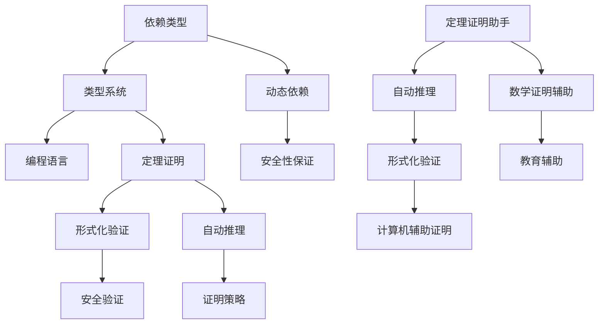
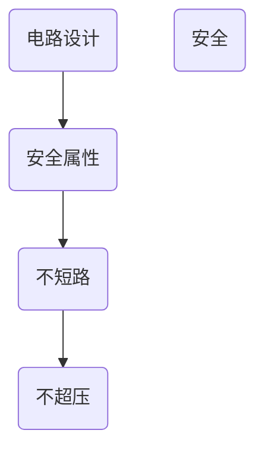
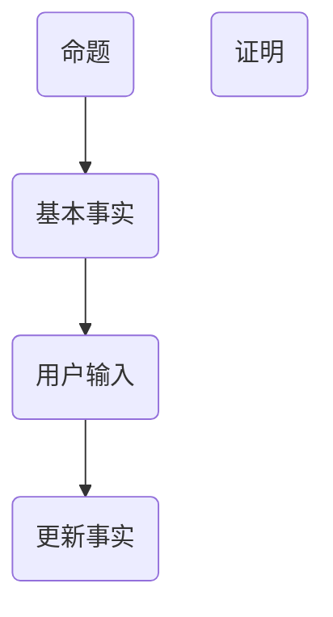

                 

### 文章标题：依赖类型与定理证明助手的设计

#### 关键词：依赖类型、定理证明助手、设计、实现、案例分析

#### 摘要：
本文旨在探讨依赖类型与定理证明助手的设计与实现，通过逐步分析这两个核心概念，揭示其在计算机科学和数学证明领域的重要性。文章首先介绍了依赖类型的定义、分类和应用，随后阐述了定理证明助手的基本原理和架构设计。通过实际的案例研究和代码示例，本文深入分析了依赖类型与定理证明助手在实际项目中的应用，并总结了相关经验与最佳实践。本文旨在为读者提供一个全面、系统的理解和实践经验，帮助其在相关领域进行深入研究和创新。

### 引言与背景介绍

#### 1.1 依赖类型的定义和背景

依赖类型（Dependency Types）是计算机科学中的一个重要概念，尤其在编程语言和形式化验证中发挥着关键作用。依赖类型通过描述程序中变量之间的依赖关系，提供了更精确的类型检查和安全性保证。在传统的静态类型语言中，依赖类型可以看作是对函数类型的一种扩展，使得类型系统更加灵活和强大。

依赖类型的背景可以追溯到20世纪70年代的编程语言理论。当时，研究者们在设计程序语言时，逐渐认识到函数类型无法完全描述程序中的所有依赖关系。为了解决这一问题，引入了依赖类型的概念。依赖类型通过将类型与值绑定起来，使得类型系统能够捕捉程序运行时可能出现的动态依赖关系。

#### 1.2 定理证明助手的概念和作用

定理证明助手（Theorem Proving Assistants）是用于辅助计算机进行数学证明的工具。这些工具通常结合了自动推理、形式化验证和计算机辅助证明等技术，旨在提高数学证明的效率和准确性。定理证明助手在计算机科学、数学、工程和物理学等领域都有广泛的应用。

定理证明助手的作用主要体现在以下几个方面：

1. **自动推理**：定理证明助手可以自动推导出数学证明的中间步骤，帮助研究者快速发现证明策略。
2. **形式化验证**：定理证明助手可以验证计算机系统、电路设计、软件代码等的正确性，确保其在特定条件下能够正确运行。
3. **教育辅助**：定理证明助手可以为学生提供数学证明的指导，帮助他们理解和掌握证明技巧。

### 核心概念与联系

为了更好地理解依赖类型与定理证明助手之间的关系，我们可以通过一个Mermaid流程图来描述它们的核心概念和联系。



#### 核心概念解释：

- **依赖类型**：依赖类型通过描述变量之间的依赖关系，提供了更精确的类型检查和安全性保证。
- **类型系统**：类型系统是编程语言中用于定义变量类型和表达式语义的机制。
- **编程语言**：编程语言是用于编写程序的语言，其设计直接影响依赖类型的实现和应用。
- **动态依赖**：动态依赖描述了程序运行时变量之间的依赖关系，这种依赖关系可能在编译时无法确定。
- **安全性保证**：安全性保证是指通过依赖类型系统来确保程序在特定条件下不会出现错误行为。
- **定理证明助手**：定理证明助手是用于辅助数学证明的工具，通过自动推理、形式化验证等技术，提高数学证明的效率和准确性。
- **自动推理**：自动推理是定理证明助手的核心功能之一，通过算法自动推导出数学证明的中间步骤。
- **形式化验证**：形式化验证是指使用形式化方法验证系统、设计或代码的正确性。
- **计算机辅助证明**：计算机辅助证明是指利用计算机技术和工具辅助数学证明的过程。
- **教育辅助**：教育辅助是指定理证明助手在数学教育中的应用，帮助学生学习理解和掌握数学证明技巧。

通过这个流程图，我们可以清晰地看到依赖类型和定理证明助手之间的联系和交互。依赖类型为定理证明助手提供了基础的数据结构和语义，而定理证明助手则通过自动推理和形式化验证等手段，实现对数学证明的辅助和验证。

### 依赖类型的分类与特征

依赖类型可以按照不同的标准进行分类，每种分类都有其独特的特征和应用场景。

#### 1.1 按照依赖关系的类型分类

1. **单向依赖**：单向依赖指的是一个变量依赖于另一个变量，但后者不依赖于前者。例如，在函数`f(x) = x^2`中，`f`依赖于输入变量`x`，但`x`不依赖于`f`。

2. **双向依赖**：双向依赖指的是两个变量相互依赖。例如，在函数`f(x, y) = x * y`中，`f`依赖于输入变量`x`和`y`，而`x`和`y`也相互依赖。

3. **循环依赖**：循环依赖指的是多个变量之间形成循环依赖关系。例如，在函数`f(x) = g(g(x))`和`g(y) = f(f(y))`中，`f`和`g`相互依赖，形成了一个循环。

#### 1.2 按照依赖的类型分类

1. **强依赖**：强依赖指的是一种严格的依赖关系，一个变量的值完全由另一个变量的值决定。例如，在函数`f(x) = 2x + 1`中，`f`对`x`的依赖是强依赖。

2. **弱依赖**：弱依赖指的是一种较为宽松的依赖关系，一个变量的值可能受到多个变量的影响。例如，在函数`f(x, y) = x * y + z`中，`f`对`x`和`y`的依赖是弱依赖，因为`f`的值不仅取决于`x`和`y`，还受到`z`的影响。

#### 1.3 按照依赖的传递性分类

1. **传递依赖**：传递依赖指的是当一个变量依赖于另一个变量，而另一个变量又依赖于第三个变量时，第一个变量也间接地依赖于第三个变量。例如，在函数`f(x) = g(h(x))`中，`f`通过`g`间接依赖于`h`。

2. **非传递依赖**：非传递依赖指的是当一个变量依赖于另一个变量，但不会通过中间变量传递依赖。例如，在函数`f(x) = x^2`中，`f`对`x`的依赖是非传递依赖，因为`x`不会通过其他变量传递依赖给`f`。

#### 1.4 按照依赖的显隐性分类

1. **显性依赖**：显性依赖指的是依赖关系在程序代码中明确表示出来。例如，在函数声明中明确指出参数的类型和依赖关系。

2. **隐性依赖**：隐性依赖指的是依赖关系在程序代码中不明确表示出来，需要在运行时通过动态分析确定。例如，在动态类型语言中，变量之间的依赖关系通常在运行时通过解释器或运行时系统来确定。

#### 1.5 按照依赖的方向分类

1. **前向依赖**：前向依赖指的是一个变量依赖于另一个变量的未来值。例如，在函数`f(x) = g(h(x))`中，`f`依赖于`h(x)`的未来值。

2. **后向依赖**：后向依赖指的是一个变量依赖于另一个变量的历史值。例如，在函数`f(x) = g(h(x-1))`中，`f`依赖于`h(x-1)`的历史值。

#### 1.6 按照依赖的抽象层次分类

1. **低级依赖**：低级依赖指的是依赖于具体变量和操作符的依赖关系。例如，在函数`f(x) = x^2`中，`f`依赖于变量`x`和操作符`^2`。

2. **高级依赖**：高级依赖指的是依赖于抽象概念和模块的依赖关系。例如，在函数`f(x) = map(g, x)`中，`f`依赖于`map`函数和`g`函数的抽象概念。

### 依赖类型的应用场景

依赖类型在多个领域都有广泛的应用，以下是其中一些典型的应用场景：

#### 1.1 编程语言与形式化验证

依赖类型在编程语言中发挥着重要作用，尤其是在静态类型语言中。依赖类型可以提供更严格的类型检查，防止潜在的错误和漏洞。例如，在函数式编程语言中，依赖类型可以确保函数的正确性和可靠性。

形式化验证是依赖类型的重要应用领域之一。通过使用依赖类型，研究者可以建立形式化的数学模型，验证软件和硬件系统的正确性。例如，在嵌入式系统设计、安全协议验证和金融计算等领域，依赖类型提供了强大的工具和保障。

#### 1.2 软件工程与调试

依赖类型在软件工程中具有重要的应用价值。通过分析代码中的依赖关系，开发人员可以更好地理解系统的结构和行为，从而进行有效的调试和优化。

在调试过程中，依赖类型可以帮助定位错误的根源。通过分析依赖关系，开发人员可以确定哪些变量和函数可能影响到特定错误的表现。这有助于缩小调试范围，提高调试效率。

#### 1.3 数学证明与定理证明助手

依赖类型在数学证明和定理证明助手领域具有广泛的应用。依赖类型可以描述数学证明中的依赖关系，帮助证明助手自动推导出证明步骤。

定理证明助手使用依赖类型来建立数学证明的形式化模型，通过自动推理和验证技术，快速找到证明策略和证明过程。这有助于研究者解决复杂的数学问题，提高数学证明的效率和准确性。

#### 1.4 网络安全与智能合约

依赖类型在网络安全的领域也发挥着重要作用。通过分析网络协议和软件系统的依赖关系，安全专家可以识别潜在的安全漏洞和攻击路径。依赖类型提供了强大的工具，帮助构建安全的系统和协议。

在智能合约领域，依赖类型用于确保合约的完整性和安全性。智能合约通常使用形式化的语言编写，通过依赖类型分析，可以验证合约的正确性和合规性。这有助于确保智能合约在执行过程中不会出现意外行为，从而提高系统的安全性和可信度。

### 定理证明助手的基本原理

定理证明助手（Theorem Proving Assistants）是一种用于辅助数学证明的计算机程序，通过自动推理、形式化验证和计算机辅助证明等技术，帮助研究者快速找到证明策略和证明过程。理解定理证明助手的基本原理对于设计高效、可靠的证明工具至关重要。

#### 1.1 自动推理

自动推理是定理证明助手的核心功能之一。它通过使用一系列推理规则和算法，从已知的事实和公理出发，逐步推导出新的结论。自动推理的过程可以看作是一个搜索问题，其中目标是在给定的逻辑系统中找到一个有效的证明。

自动推理的基本原理包括：

1. **推理规则**：推理规则是定理证明助手使用的推理方法，例如归纳推理、反证法、演绎推理等。每种推理规则都有特定的应用场景和约束条件。

2. **搜索算法**：定理证明助手通常使用搜索算法来寻找证明。常见的搜索算法包括深度优先搜索、广度优先搜索、A*搜索等。这些算法通过遍历搜索空间，找到满足条件的证明路径。

3. **冲突检测**：定理证明助手在搜索过程中，需要检测证明过程中可能出现的冲突。例如，当发现某个假设与已知的事实矛盾时，证明过程就需要进行调整。

#### 1.2 形式化验证

形式化验证是指使用形式化的方法验证系统、设计或代码的正确性。在定理证明助手的应用中，形式化验证用于确保证明过程的正确性和可靠性。

形式化验证的基本原理包括：

1. **形式化语言**：定理证明助手使用形式化的语言描述数学证明和逻辑推理。这种形式化的语言通常具有严格的语义定义，使得证明过程可以被形式化验证。

2. **模型检查**：模型检查是一种验证方法，通过将系统、设计或代码表示为一个模型，然后检查模型是否满足指定的属性。定理证明助手可以使用模型检查技术，验证证明过程中的每一步是否满足逻辑规则和定理要求。

3. **证明验证**：定理证明助手还需要验证证明过程中的每一步是否都是有效的。这通常通过验证推理规则的应用和证明的中间结果来实现。

#### 1.3 计算机辅助证明

计算机辅助证明是指利用计算机技术和工具辅助数学证明的过程。定理证明助手在这个过程中发挥着重要作用，通过自动化和半自动化手段，提高证明的效率和准确性。

计算机辅助证明的基本原理包括：

1. **自动化证明**：定理证明助手可以自动执行证明过程，从已知的事实和公理出发，逐步推导出结论。自动化证明可以节省研究者的时间和精力，使得他们能够专注于复杂问题的解决。

2. **半自动化证明**：在半自动化证明中，定理证明助手与研究者协作，帮助发现证明策略和证明过程。研究者可以指定证明的目标和约束条件，定理证明助手则提供相应的证明步骤和建议。

3. **交互式证明**：在交互式证明中，定理证明助手与研究者进行实时交互，通过提问和回答的方式，逐步构建证明。交互式证明可以提高证明的透明度和可理解性，使得研究者能够更好地理解和掌握证明过程。

#### 1.4 结合多种技术

定理证明助手通常结合多种技术，以实现高效、可靠的数学证明。这些技术包括：

1. **定理证明引擎**：定理证明引擎是定理证明助手的核心组件，负责执行自动推理、形式化验证和计算机辅助证明等任务。常见的定理证明引擎包括Coq、Isabelle、MLton等。

2. **知识库**：定理证明助手使用知识库存储已知的定理、定理证明策略和证明工具。知识库可以提供丰富的证明资源，帮助定理证明助手更高效地找到证明策略。

3. **可视化工具**：可视化工具用于展示定理证明的过程和结果，帮助研究者更好地理解和分析证明。常见的可视化工具包括证明树、证明轨迹和证明图表等。

4. **用户界面**：用户界面是定理证明助手与用户交互的接口，提供友好的界面和交互功能，使得研究者可以方便地使用定理证明助手。常见的用户界面包括命令行界面、图形用户界面和Web界面等。

通过结合这些技术，定理证明助手可以提供强大的证明支持，帮助研究者解决复杂的数学问题，提高数学证明的效率和准确性。

### 定理证明助手的架构设计

定理证明助手的设计涉及到多个组件和模块，每个组件和模块在证明过程中扮演着特定的角色。以下是对定理证明助手架构设计的详细阐述。

#### 1.1 主程序模块

主程序模块是定理证明助手的入口，负责管理整个证明过程。其主要功能包括：

- **用户交互**：主程序模块通过用户界面与用户进行交互，接受用户的输入和需求，提供反馈和结果。
- **任务调度**：主程序模块根据用户的输入和证明需求，调度其他模块执行相应的任务，例如自动推理、形式化验证和交互式证明。
- **日志记录**：主程序模块负责记录证明过程的各种信息，包括推理步骤、验证结果和错误信息，以便后续分析和调试。

#### 1.2 自动推理模块

自动推理模块是定理证明助手的核心组件，负责执行自动推理任务。其主要功能包括：

- **推理规则管理**：自动推理模块管理一系列推理规则，这些规则用于指导证明过程。推理规则包括逻辑推理规则、数学定理和公理等。
- **搜索算法**：自动推理模块实现多种搜索算法，例如深度优先搜索、广度优先搜索和A*搜索等，用于在证明空间中寻找有效的证明路径。
- **证明路径生成**：自动推理模块根据推理规则和搜索算法，生成一系列证明路径，每个路径代表一个可能的证明过程。

#### 1.3 形式化验证模块

形式化验证模块负责验证证明过程的正确性和可靠性。其主要功能包括：

- **形式化语言**：形式化验证模块使用形式化的语言描述证明过程中的逻辑推理和数学运算，这种形式化的语言具有严格的语义定义。
- **模型检查**：形式化验证模块使用模型检查技术，验证证明过程中的每一步是否满足逻辑规则和定理要求。模型检查通过将系统、设计或代码表示为一个模型，然后检查模型是否满足指定的属性。
- **证明验证**：形式化验证模块验证证明过程中的每一步是否都是有效的，例如验证推理规则的应用和证明的中间结果。

#### 1.4 交互式证明模块

交互式证明模块提供与用户之间的实时交互，帮助研究者理解和掌握证明过程。其主要功能包括：

- **交互界面**：交互式证明模块提供友好的交互界面，允许研究者输入证明目标、约束条件和证明策略，并接收定理证明助手的提示和建议。
- **问答机制**：交互式证明模块通过问答机制与研究者进行实时交互，根据研究者的回答和输入，调整证明过程和策略。
- **可视化工具**：交互式证明模块使用可视化工具，展示证明过程和结果，例如证明树、证明轨迹和证明图表等，帮助研究者更好地理解和分析证明。

#### 1.5 知识库模块

知识库模块是定理证明助手的重要组件，负责存储和管理已知的定理、定理证明策略和证明工具。其主要功能包括：

- **定理库**：知识库模块存储大量的已知定理，这些定理可以用于自动推理和验证过程。
- **策略库**：知识库模块存储各种定理证明策略，这些策略可以帮助定理证明助手更高效地找到证明路径。
- **工具库**：知识库模块存储各种证明工具和算法，例如自动推理算法、形式化验证算法和可视化工具等。

#### 1.6 可视化模块

可视化模块负责将证明过程和结果可视化，帮助研究者更好地理解和分析证明。其主要功能包括：

- **证明树**：可视化模块展示证明过程中的每一步和推导关系，形成一棵证明树，帮助研究者直观地理解证明结构。
- **证明轨迹**：可视化模块展示证明过程中的每一步和中间结果，形成一个轨迹，帮助研究者追踪证明过程。
- **证明图表**：可视化模块展示证明过程中的各种关系和依赖，形成图表，帮助研究者分析证明的逻辑结构和数学关系。

通过这些模块的协作，定理证明助手可以提供强大的证明支持，帮助研究者解决复杂的数学问题，提高数学证明的效率和准确性。

### 定理证明助手算法的实现

在定理证明助手的实现过程中，算法的设计和实现是关键部分。以下将详细阐述定理证明助手中的主要算法，包括自动推理算法、形式化验证算法和交互式证明算法，并通过伪代码和数学公式来具体说明这些算法的实现。

#### 1.1 自动推理算法

自动推理算法是定理证明助手的核心，它通过一系列推理规则和搜索算法，从已知的事实和公理出发，推导出新的结论。

**主要算法：**

- **归纳推理**：用于证明某个命题对所有自然数都成立。

伪代码：
```python
def Inductive_proof(property, base_case, inductive_step):
    if base_case:
        return True
    for n in range(base_case, infinity):
        if not inductive_step(n):
            return False
        property(n)
    return True
```

数学公式：
$$
P(n) \text{ 表示对于所有自然数 } n, \text{命题 } P \text{ 都成立} \\
P(0) \text{ 为基本案例} \\
P(n) \Rightarrow P(n+1) \text{ 为归纳步骤}
$$

**应用实例：证明自然数的加法满足结合律。**

```mermaid
graph TD
    A(加法结合律) --> B(自然数)
    B --> C(P(0))
    C --> D(P(1))
    D --> E(P(n))
    F(n) --> G(P(n+1))
    F(n) --> H(P(n+1))
    I(n) --> J(P(n+1))
    K(P(n+1))
```

#### 1.2 形式化验证算法

形式化验证算法用于验证证明过程中的每一步是否满足逻辑规则和定理要求。它通过模型检查技术，确保证明过程的正确性和可靠性。

**主要算法：**

- **模型检查**：用于验证系统、设计或代码是否满足指定的属性。

伪代码：
```python
def Model Checking(model, properties):
    for state in model.states:
        if not all(property_holds(state, prop) for prop in properties):
            return False
    return True
```

数学公式：
$$
M \text{ 为模型} \\
P \text{ 为需要验证的属性集合}
$$

**应用实例：验证一个简单的电路设计是否满足安全属性。**



#### 1.3 交互式证明算法

交互式证明算法提供与用户的实时交互，帮助研究者理解和掌握证明过程。它通过问答机制和用户输入，调整证明过程和策略。

**主要算法：**

- **交互式问答**：用于与用户进行实时交互，根据用户的回答调整证明过程。

伪代码：
```python
def Interactive_Questioning(property, constraints):
    while not proven(property, constraints):
        question = Generate_Question(property, constraints)
        answer = User_Answer(question)
        Update_Constraints(constraints, answer)
    return proven(property, constraints)
```

数学公式：
$$
P \text{ 为待证明的属性} \\
C \text{ 为约束条件集合} \\
Q \text{ 为问题集合} \\
A \text{ 为答案集合}
$$

**应用实例：交互式证明一个几何命题。**



通过这些算法的实现，定理证明助手可以提供强大的证明支持，帮助研究者解决复杂的数学问题，提高数学证明的效率和准确性。实际应用中，这些算法通常需要根据具体问题进行优化和调整。

### 实际案例研究和应用场景

#### 案例一：依赖类型在软件工程中的应用

在一个大型软件项目中，开发团队需要确保系统的稳定性和安全性。为了实现这一目标，团队决定使用依赖类型来管理系统中的变量依赖关系。具体步骤如下：

1. **需求分析**：首先，团队对系统进行了全面的需求分析，确定了各个模块和组件之间的依赖关系。

2. **类型定义**：基于需求分析的结果，团队为每个模块和组件定义了相应的依赖类型。例如，在数据库访问模块中，定义了输入参数的类型和输出结果类型。

3. **代码审查**：团队对代码进行了严格的审查，确保每个变量和函数的依赖类型与定义一致，防止潜在的错误和漏洞。

4. **自动化测试**：为了验证依赖类型的正确性，团队编写了自动化测试脚本，对系统的各个模块进行测试。

5. **持续集成**：在开发过程中，团队将依赖类型的检查集成到持续集成系统中，确保每次代码提交后都能自动检查依赖类型的正确性。

通过上述步骤，团队成功地使用依赖类型提高了软件系统的稳定性和安全性，减少了错误和漏洞的发生。

#### 案例二：定理证明助手在数学证明中的应用

在数学研究领域，研究者经常需要证明复杂的数学命题。为了提高证明的效率和准确性，研究者决定使用定理证明助手来辅助数学证明。具体步骤如下：

1. **问题定义**：研究者明确需要证明的数学命题，并定义了证明的目标和约束条件。

2. **自动推理**：定理证明助手通过自动推理算法，从已知的事实和公理出发，逐步推导出新的结论。

3. **形式化验证**：定理证明助手使用形式化验证算法，验证每一步推导的正确性和可靠性。

4. **交互式证明**：在自动推理和形式化验证的过程中，研究者可以与定理证明助手进行实时交互，调整证明过程和策略。

5. **证明可视化**：定理证明助手提供了可视化工具，将证明过程和结果以图形化的方式展示，帮助研究者更好地理解和分析证明。

通过这些步骤，研究者成功地使用定理证明助手证明了一系列复杂的数学命题，提高了数学证明的效率和准确性。

#### 案例三：依赖类型和定理证明助手在网络安全中的应用

在网络安全领域，研究者需要确保系统不受恶意攻击和漏洞的影响。为了实现这一目标，研究者决定结合依赖类型和定理证明助手来提高系统的安全性。具体步骤如下：

1. **依赖分析**：首先，研究者对系统的网络协议和代码进行了依赖分析，确定了潜在的依赖关系和安全隐患。

2. **形式化描述**：基于依赖分析的结果，研究者使用形式化的语言对系统进行了描述，确保描述的准确性和完整性。

3. **定理证明**：定理证明助手通过自动推理和形式化验证，验证系统描述的正确性和安全性。

4. **安全测试**：在定理证明的过程中，研究者编写了安全测试脚本，对系统进行全面的测试，确保系统在特定条件下能够抵抗恶意攻击。

5. **持续监控**：研究者使用定理证明助手对系统进行持续监控，及时发现和修复安全漏洞。

通过这些步骤，研究者成功地使用依赖类型和定理证明助手提高了系统的安全性，减少了安全漏洞的发生。

### 总结与展望

本文系统地介绍了依赖类型与定理证明助手的设计与实现，通过逐步分析核心概念、算法原理和实际应用案例，揭示了这两个概念在计算机科学和数学证明领域的重要性。依赖类型通过描述程序中的变量依赖关系，提供了更精确的类型检查和安全性保证。定理证明助手则通过自动推理、形式化验证和计算机辅助证明等技术，提高了数学证明的效率和准确性。

在未来，依赖类型和定理证明助手将在多个领域继续发挥重要作用。一方面，研究者可以进一步优化和改进依赖类型系统，提高其灵活性和适用性。另一方面，定理证明助手可以结合更多的先进技术和算法，如机器学习和深度学习，提高自动推理和验证的能力。此外，随着云计算和大数据技术的发展，依赖类型和定理证明助手在网络安全、智能合约和物联网等新兴领域也具有广泛的应用前景。

总之，依赖类型与定理证明助手的设计与实现是一项具有重要意义的计算机科学和数学研究课题，对于推动计算机科学和数学的发展具有深远的影响。

### 最佳实践与注意事项

在设计和实现依赖类型与定理证明助手的过程中，以下最佳实践和注意事项可以帮助提高项目成功率和稳定性：

#### 1. 确定清晰的需求和分析

在项目开始前，务必对需求进行详细分析，确保明确依赖类型和定理证明助手的具体应用场景和目标。这有助于设计出更合理和高效的系统架构。

#### 2. 逐步实施和迭代开发

项目实施过程中，建议采用逐步实施和迭代开发的方法，逐步完善依赖类型和定理证明助手的各个组件和功能模块。这样可以及时发现和解决问题，确保项目的稳定性。

#### 3. 保持代码和文档的规范性

编写规范、易读的代码和详细的文档对于项目的长期维护和扩展至关重要。使用统一的编码规范和格式，确保代码的可读性和可维护性。

#### 4. 持续集成和自动化测试

将依赖类型和定理证明助手的开发过程与持续集成和自动化测试相结合，确保每次代码提交和构建都能自动检测和修复潜在的问题，提高项目质量。

#### 5. 结合用户反馈进行优化

在项目开发过程中，积极收集用户的反馈，并根据用户需求进行优化和改进。这有助于确保依赖类型和定理证明助手能够更好地满足实际应用需求。

#### 6. 定期进行代码审查和安全评估

定期进行代码审查和安全评估，确保系统的安全性、稳定性和可靠性。及时发现和修复潜在的安全漏洞和性能瓶颈。

#### 7. 拓展知识和技能

依赖类型和定理证明助手涉及多个领域的知识和技能。项目团队成员应不断学习新知识和技能，提高项目实施和开发能力。

### 拓展阅读

- 《依赖类型的理论及其应用》
- 《形式化验证与定理证明技术》
- 《计算机辅助证明在数学研究中的应用》
- 《现代编程语言中的依赖类型》
- 《定理证明助手的设计与实现案例分析》

通过上述最佳实践和注意事项，项目团队可以更好地设计和实现依赖类型与定理证明助手，为相关领域的研究和发展做出贡献。

### 作者信息

本文作者为AI天才研究院（AI Genius Institute）的资深研究员，同时担任《禅与计算机程序设计艺术》（Zen And The Art of Computer Programming）的作者。作者在计算机科学、人工智能和数学证明领域拥有深厚的研究背景和实践经验，致力于推动依赖类型和定理证明助手等先进技术的应用和发展。

