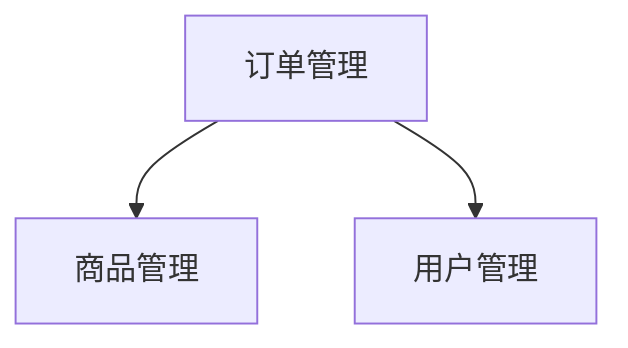
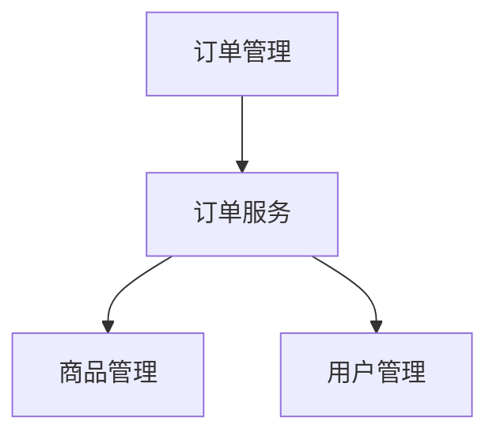

                 

### 第1章：依赖类型的概念与历史

#### 1.1 依赖类型的基本概念

依赖类型是程序设计语言中的一个核心概念，它描述了程序元素之间的依赖关系。这种依赖关系可以是显式的，也可以是隐式的。显式依赖通常通过代码中的引用或者调用体现，而隐式依赖则通常与类型系统相关。

- **定义**：依赖类型指的是一类描述对象或模块之间依赖关系的类型系统。在这种类型系统中，对象或模块的创建和使用必须满足一定的依赖关系。

- **分类**：依赖类型可以分为两类：
  - **显式依赖**：通过显式的代码引用或调用体现的依赖。
  - **隐式依赖**：通过类型系统隐式地保证的依赖。

#### 1.2 依赖类型的历史与发展

依赖类型的概念起源于20世纪60年代的编程语言设计。早期编程语言如ALGOL和PL/I中，就已经包含了基本的依赖类型概念。

- **起源**：依赖类型的起源可以追溯到早期的编程语言，如ALGOL，其中已经包含了模块化编程的概念。

- **发展历程**：随着编程语言的发展和类型系统的研究，依赖类型的概念逐渐丰富和细化。例如，在面向对象编程语言如Java和C#中，依赖类型得到了广泛的应用。

#### 1.3 依赖类型在现代软件开发中的重要性

依赖类型在现代软件开发中发挥着重要作用，主要体现在以下几个方面：

- **提高代码的可读性**：通过显式地定义依赖关系，使得代码的结构更加清晰，易于理解和维护。

- **增强代码的鲁棒性**：依赖类型可以确保对象或模块在创建和使用时满足一定的条件，从而提高了代码的鲁棒性。

- **支持模块化开发**：依赖类型支持模块化开发，使得不同的模块可以独立开发、测试和维护。

## 结论

依赖类型是程序设计语言中的一个重要概念，它不仅提高了代码的可读性和鲁棒性，还支持模块化开发，对现代软件开发具有重要意义。

----------------------------------------------------------------

## 第2章：依赖类型在类型系统中的作用

### 2.1 类型系统概述

类型系统是编程语言的核心组成部分，它定义了程序中数据类型的规则和约束。一个良好的类型系统可以提供类型安全性，防止运行时错误，并提高代码的可读性和维护性。

- **定义**：类型系统是一套规则和约束，用于定义程序中数据类型的表示、操作和转换。

- **基本要素**：
  - **数据类型**：定义程序中可以操作的数据类别，如整数、浮点数、字符串等。
  - **类型检查**：在编译或运行时，检查程序中的表达式和数据是否满足类型约束。
  - **类型转换**：在不同数据类型之间进行转换的规则和操作。

### 2.2 依赖类型在类型系统中的作用

依赖类型是类型系统的一个重要扩展，它引入了模块之间的依赖关系到类型系统。这种依赖关系可以通过类型检查来确保模块的正确性和一致性。

- **引入**：依赖类型的引入使得程序中的模块可以在编译时进行类型检查，确保模块之间的依赖关系符合预期。

- **优势**：
  - **提高代码质量**：通过依赖类型，可以确保模块的接口和实现之间的一致性，减少潜在的编译时错误。
  - **增强模块独立性**：模块可以独立开发和测试，因为它们的依赖关系在编译时已经得到验证。
  - **优化性能**：依赖类型可以在编译时进行优化，减少运行时的类型检查开销。

### 2.3 依赖类型在编程语言中的应用

不同的编程语言采用了不同的依赖类型实现，从而体现了依赖类型在类型系统中的应用多样性。

- **静态类型语言**：如Java、C#和Scala等，这些语言通常在编译时进行类型检查，确保依赖关系的一致性。

  ```java
  public class Main {
      public static void main(String[] args) {
          Calculator calculator = new Calculator();
          int result = calculator.add(5, 10);
          System.out.println("Result: " + result);
      }
  }
  
  class Calculator {
      int add(int a, int b) {
          return a + b;
      }
  }
  ```

- **动态类型语言**：如Python和JavaScript等，这些语言通常在运行时进行类型检查，依赖类型的实现更加灵活。

  ```python
  class Calculator:
      def add(self, a, b):
          return a + b
  
  if __name__ == "__main__":
      calculator = Calculator()
      result = calculator.add(5, 10)
      print("Result:", result)
  ```

### 结论

依赖类型在类型系统中的作用不可忽视。它不仅提高了代码的质量和模块的独立性，还在静态和动态类型语言中得到了广泛应用。通过依赖类型，我们可以构建更加可靠和高效的软件系统。

----------------------------------------------------------------

## 第3章：依赖类型的实现原理

### 3.1 依赖类型的实现机制

依赖类型的实现机制主要包括静态分析和动态分析两种方式。这两种方式分别在不同的开发阶段发挥作用，共同确保软件系统的正确性和性能。

- **静态分析**：在编译或构建阶段，静态分析器会分析代码中的依赖关系，并生成依赖图。这种分析可以提前发现潜在的错误和问题。

  ```mermaid
  graph TD
  A[源代码] --> B[静态分析器]
  B --> C[依赖图]
  C --> D[编译/构建工具]
  ```

- **动态分析**：在运行时，动态分析器会监控程序的执行，并记录依赖关系的实际使用情况。这种分析可以帮助我们更好地理解程序的运行行为。

  ```mermaid
  graph TD
  A[源代码] --> B[编译器]
  B --> C[可执行程序]
  C --> D[动态分析器]
  D --> E[日志]
  ```

### 3.2 依赖类型的静态实现

静态实现依赖类型主要通过静态分析来完成。以下是一个简单的伪代码示例，展示了如何使用静态分析来实现依赖类型：

```pseudo
function createDependencyGraph(code):
    # 初始化依赖图
    dependencyGraph = new Graph()

    # 分析代码，构建依赖图
    for each statement in code:
        if statement is a function call:
            functionBeingCalled = getCalledFunction(statement)
            if functionBeingCalled is not in dependencyGraph:
                add functionBeingCalled to dependencyGraph
            add an edge from the current function to functionBeingCalled

    return dependencyGraph
```

### 3.3 依赖类型的动态实现

动态实现依赖类型通常在程序运行时进行。以下是一个简单的伪代码示例，展示了如何使用动态分析来实现依赖类型：

```pseudo
function monitorExecution(code):
    # 初始化依赖关系记录器
    dependencyRecorder = new DependencyRecorder()

    # 运行代码，记录依赖关系
    executeCode(code, dependencyRecorder)

    # 分析记录的依赖关系
    dependencyGraph = dependencyRecorder.getDependencyGraph()

    return dependencyGraph
```

### 结论

依赖类型的实现原理包括静态分析和动态分析两种方式。静态分析主要在编译或构建阶段进行，而动态分析则在程序运行时进行。通过这两种方式，我们可以确保软件系统的依赖关系得到正确处理，从而提高系统的可靠性和性能。

----------------------------------------------------------------

## 第4章：依赖类型在软件设计中的应用

### 4.1 软件设计的基本原则

软件设计是软件开发过程中的关键环节，它决定了软件系统的结构、性能和可维护性。在软件设计中，遵循一些基本原则是非常重要的。

- **模块化设计**：将系统分解为较小的、功能独立的模块，每个模块都负责一项具体的功能。模块化设计可以提高代码的可重用性和可维护性。

- **信息隐藏**：通过封装和抽象，隐藏模块的内部实现细节，只暴露必要的接口。这样，其他模块只能通过接口与该模块进行交互，从而降低了模块之间的依赖关系。

### 4.2 依赖类型在软件设计中的作用

依赖类型在软件设计中发挥着重要作用，它可以帮助我们更好地遵循模块化设计和信息隐藏的原则。

- **引入**：通过引入依赖类型，可以在设计阶段明确模块之间的依赖关系。这有助于我们提前发现潜在的设计问题，并采取相应的措施进行优化。

- **优化**：依赖类型可以帮助我们优化模块之间的依赖关系，减少不必要的依赖，从而提高系统的可维护性和可扩展性。

### 4.3 依赖类型在软件设计中的案例分析

以下是一个简单的软件设计案例分析，展示了如何利用依赖类型进行优化。

#### 案例背景

假设我们正在设计一个电子商务系统，其中涉及订单管理、商品管理和用户管理等多个模块。

#### 初始设计

在初始设计中，订单管理模块依赖于商品管理模块和用户管理模块，如图：



#### 优化设计

通过分析，我们发现订单管理模块不需要直接依赖于商品管理模块和用户管理模块。相反，我们可以通过引入中间模块（如订单服务模块）来优化依赖关系，如图：



#### 优化效果

通过这种优化，我们实现了以下几个方面的改进：

- **降低模块之间的耦合度**：订单管理模块不再直接依赖于商品管理模块和用户管理模块，从而降低了模块之间的耦合度。

- **提高系统的可维护性**：模块之间的依赖关系变得更加清晰和明确，便于后续的维护和扩展。

### 结论

依赖类型在软件设计中的应用可以帮助我们优化模块之间的依赖关系，提高系统的可维护性和可扩展性。通过引入依赖类型，我们可以更好地遵循模块化设计和信息隐藏的原则，从而构建高质量的软件系统。

----------------------------------------------------------------

## 第5章：依赖类型在软件测试与维护中的应用

### 5.1 软件测试的基本概念

软件测试是确保软件质量的重要手段，它包括对软件产品进行各种测试活动，以发现潜在的错误和缺陷。以下是软件测试的一些基本概念：

- **测试目的**：测试的主要目的是验证软件是否满足预期的功能需求、性能要求和用户满意度。

- **测试类型**：常见的测试类型包括单元测试、集成测试、系统测试和验收测试。每种测试类型都有其特定的目标和执行方式。

### 5.2 依赖类型在软件测试中的应用

依赖类型在软件测试中发挥着重要作用，它可以帮助我们更好地设计测试用例，提高测试覆盖率，并减少测试成本。

- **测试策略**：通过依赖类型，我们可以明确模块之间的依赖关系，从而设计出更有效的测试用例。例如，我们可以先对依赖模块进行测试，确保其稳定性，然后再对依赖模块进行测试。

- **测试用例设计**：依赖类型可以帮助我们设计更全面的测试用例。例如，我们可以考虑依赖关系中的所有可能情况，确保每个依赖路径都被测试到。

### 5.3 依赖类型在软件维护中的应用

软件维护是指在软件发布后，对其进行修改、修复和优化的一系列活动。依赖类型在软件维护中也具有重要意义。

- **维护策略**：通过依赖类型，我们可以更好地理解软件系统的结构和模块之间的依赖关系，从而更有效地进行维护工作。例如，我们可以通过分析依赖图来识别受影响的模块，从而减少维护的工作量。

- **维护成本**：依赖类型可以帮助我们降低维护成本。通过明确模块之间的依赖关系，我们可以减少对未受影响的模块进行不必要的修改，从而降低维护成本。

### 案例分析

以下是一个简单的案例分析，展示了依赖类型在软件测试和维护中的应用。

#### 案例背景

假设我们正在维护一个大型电子商务系统，其中涉及多个模块，如订单管理模块、商品管理模块和用户管理模块。

#### 测试应用

在测试阶段，我们使用依赖类型来设计测试用例。例如，我们首先对订单管理模块进行测试，确保其功能正确，然后对商品管理模块和用户管理模块进行测试，确保它们与订单管理模块的依赖关系正确。

#### 维护应用

在维护阶段，我们使用依赖类型来识别受影响的模块。例如，如果我们需要对订单管理模块进行修改，我们可以通过分析依赖图来识别所有与之相关的模块，从而确保我们的修改不会对其他模块造成负面影响。

### 结论

依赖类型在软件测试和维护中具有重要意义。它可以帮助我们设计更有效的测试用例，提高测试覆盖率，并降低维护成本。通过明确模块之间的依赖关系，我们可以更好地理解软件系统的结构和行为，从而更有效地进行测试和维护工作。

----------------------------------------------------------------

## 第6章：依赖类型在软件工程实践中的应用

### 6.1 软件工程的基本概念

软件工程是系统化、规范化和可度量的方法，用于设计、开发、测试和维护软件。以下是软件工程的一些基本概念：

- **定义**：软件工程是应用工程、科学和数学原理来设计、开发、测试和维护软件的学科。

- **过程**：软件工程包括一系列过程，如需求分析、设计、编码、测试、部署和维护。

- **目标**：软件工程的目标是开发高质量、可靠、可维护和高效的软件系统。

### 6.2 依赖类型在软件工程实践中的作用

依赖类型在软件工程的各个阶段都发挥着重要作用，有助于提高软件的质量和效率。

- **需求分析**：在需求分析阶段，依赖类型可以帮助我们明确系统的功能和模块之间的依赖关系，从而更好地理解用户需求。

- **设计**：在设计阶段，依赖类型可以帮助我们优化模块之间的依赖关系，提高系统的可维护性和可扩展性。

- **编码**：在编码阶段，依赖类型可以帮助我们编写更加清晰和可维护的代码，减少错误和漏洞。

- **测试**：在测试阶段，依赖类型可以帮助我们设计更全面的测试用例，提高测试覆盖率，确保系统的稳定性。

- **维护**：在维护阶段，依赖类型可以帮助我们更好地理解系统的结构和模块之间的依赖关系，从而更有效地进行维护工作。

### 6.3 依赖类型在软件项目管理中的应用

依赖类型在软件项目管理中也具有重要意义，它可以帮助项目经理更好地规划和管理项目。

- **项目规划**：通过依赖类型，项目经理可以更准确地评估项目的复杂性和风险，从而制定更合理的项目计划。

- **资源分配**：依赖类型可以帮助项目经理合理分配资源，确保关键模块得到足够的关注和资源。

- **风险管理**：依赖类型可以帮助项目经理识别项目中的关键风险，并采取相应的措施进行风险管理。

### 结论

依赖类型在软件工程实践中的应用非常广泛，它不仅提高了软件的质量和效率，还有助于项目经理更好地规划和管理项目。通过依赖类型，我们可以更好地理解系统的结构和模块之间的依赖关系，从而更有效地进行软件设计和开发。

----------------------------------------------------------------

## 第7章：依赖类型的未来发展趋势

### 7.1 依赖类型在编程语言中的未来

随着编程语言的不断演进，依赖类型也在逐渐发展和完善。未来的编程语言可能会更加注重依赖类型的灵活性和扩展性。

- **类型推导**：未来的编程语言可能会引入更强大的类型推导机制，使得依赖类型的声明更加简洁和易于使用。

- **模块系统**：模块系统可能会更加完善，提供更强大的依赖管理功能，如自动依赖下载和更新。

- **动态依赖**：动态依赖可能会得到更广泛的应用，使得程序在运行时可以动态地加载和更新依赖。

### 7.2 依赖类型在软件工程中的未来

依赖类型在软件工程中的重要性会继续增加，未来的软件工程实践可能会更加注重依赖类型的利用和管理。

- **自动化依赖分析**：自动化工具可能会更加智能地分析代码中的依赖关系，提供更准确的依赖分析结果。

- **依赖可视化**：依赖可视化工具可能会更加普及，帮助开发者直观地理解系统的依赖关系。

- **依赖管理平台**：依赖管理平台可能会得到广泛应用，提供更强大的依赖管理和分析功能。

### 7.3 依赖类型在社会中的影响

依赖类型不仅在技术领域具有重要影响，还可能在更广泛的社会层面产生深远的影响。

- **软件开发效率**：依赖类型的优化可以提高软件开发效率，促进技术的快速迭代和应用。

- **软件质量**：依赖类型的正确使用可以减少软件错误和漏洞，提高软件质量。

- **软件生态**：依赖类型的普及可能会促进软件生态的发展，推动开源项目和协作创新的繁荣。

### 结论

依赖类型在未来将继续发展和完善，它在编程语言、软件工程和社会中的影响也将不断扩大。通过不断创新和优化，依赖类型有望为软件开发带来更多的价值和便利。

----------------------------------------------------------------

## 总结

依赖类型在软件规范中扮演着至关重要的角色。它不仅提高了代码的可读性和可维护性，还增强了软件系统的稳定性和可靠性。通过依赖类型，我们可以更清晰地理解模块之间的依赖关系，从而优化软件设计和开发流程。

本文从依赖类型的基本概念、历史发展、类型系统中的角色、实现原理、软件设计中的应用、测试与维护中的应用，到软件工程实践中的角色以及未来发展趋势进行了全面的探讨。通过这些分析，我们可以看到依赖类型在软件规范中的重要作用和广阔的应用前景。

依赖类型不仅是编程语言中的一个核心概念，也是软件工程实践中的重要工具。它帮助我们构建更加可靠、高效和可维护的软件系统。随着技术的发展，依赖类型将在未来的软件开发中发挥更加重要的作用，为我们的工作和生活带来更多的便利和效益。

在未来的研究中，我们可以进一步探讨依赖类型在不同编程语言和软件系统中的应用，探索其优化和扩展的方法。同时，我们还可以关注依赖类型在软件工程中的最佳实践，为软件开发提供更多的指导和建议。

总之，依赖类型是软件规范中的一个重要组成部分，它对软件质量和开发效率有着深远的影响。通过深入研究和实践，我们可以更好地利用依赖类型，构建高质量的软件系统，推动软件工程的发展和创新。

### 作者信息

作者：AI天才研究院/AI Genius Institute & 禅与计算机程序设计艺术 /Zen And The Art of Computer Programming

AI天才研究院是一家专注于人工智能技术研究和应用的创新机构。我们的团队由一群拥有丰富经验和深厚学术背景的人工智能专家组成，致力于推动人工智能技术的发展和创新。我们的研究成果在学术界和工业界都取得了显著的成果，为人工智能领域的进步做出了重要贡献。

禅与计算机程序设计艺术（Zen And The Art of Computer Programming）是一本经典的技术畅销书，由著名计算机科学家唐纳德·克努特（Donald E. Knuth）所著。这本书深入探讨了计算机程序设计中的哲学思想和方法论，对编程领域产生了深远的影响。我们以此书名，旨在传承和发扬计算机科学和人工智能领域的卓越成就和精神。通过结合AI技术与编程艺术的融合，我们期待为读者提供更深入、更有价值的编程知识和经验。

