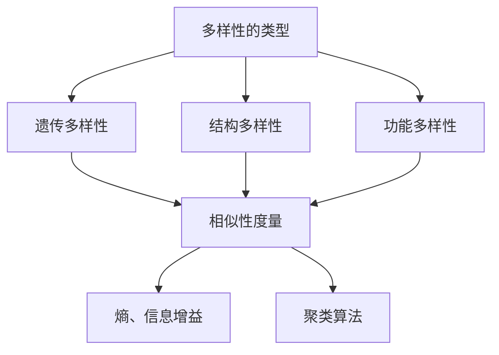
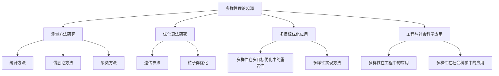
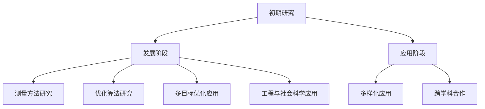
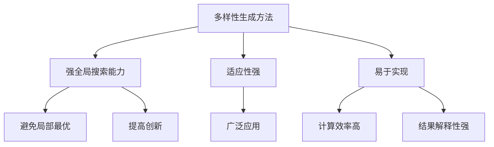
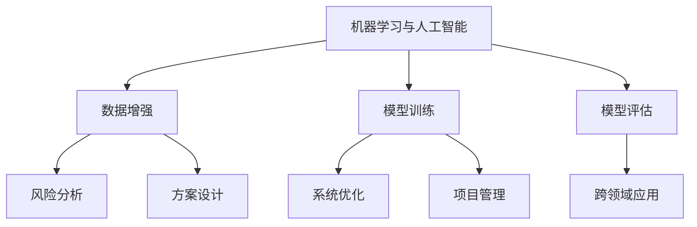

                 


## 文章标题：保证生成解多样性的方法探讨

### 关键词：

- 多样性
- 问题求解
- 生成解
- 遗传算法
- 多目标优化
- 社会网络分析
- 混合方法

### 摘要：

本文旨在探讨如何保证生成解的多样性，从多样性的概念出发，介绍多样性在问题求解中的重要性。本文将详细分析几种生成多样解的方法，包括遗传算法、多目标优化、社会网络分析和混合方法，并通过实际应用案例和数学模型来阐述这些方法的具体实现和效果。最后，本文将对多样性生成方法进行总结和展望，为未来的研究提供方向。

---

## 第一部分：多样性的概念与理论基础

### 第1章：多样性概念介绍

多样性（Diversity）是一个广泛应用于各个领域的概念，其含义在不同领域有所差异。在问题求解领域，多样性通常指生成的解具有丰富的结构和特征。本文将介绍多样性的定义、重要性以及度量方法。

### 1.1 多样性的定义与重要性

多样性是指一组解在结构和特征上的差异程度。在问题求解中，多样性具有重要意义。首先，多样性能够提高问题求解的鲁棒性，避免陷入局部最优解。其次，多样性有助于发现潜在的优秀解，提高求解质量。最后，多样性还能够促进创新，激发新的思路和方法。

### 1.2 多样性的类型与度量方法

多样性的类型可以根据不同的标准进行分类。例如，根据解的生成方式，多样性可以分为遗传多样性、结构多样性和功能多样性。根据解的特征，多样性可以分为静态多样性和动态多样性。

度量多样性常用的方法包括：

- **基于统计的方法**：通过计算解之间的相似性度量来评估多样性。例如，可以使用Jaccard相似性系数、余弦相似性等。
- **基于信息论的方法**：利用信息论中的熵、信息增益等概念来衡量多样性。
- **基于聚类的方法**：通过聚类分析来评估多样性。例如，可以使用K-means、DBSCAN等聚类算法。

### Mermaid流程图

下面是一个简单的Mermaid流程图，展示多样性的类型与度量方法之间的关系：



---

### 第2章：多样性理论基础

多样性在问题求解中的重要性不仅体现在其自身价值，还与问题解决方法密切相关。本节将探讨多样性、问题解决及创新之间的关系，并介绍国内外多样性研究的现状与趋势。

### 2.1 多样性与问题解决的关系

多样性对问题解决的影响主要体现在两个方面：

- **增强搜索空间**：多样化的解能够扩展搜索空间，提高找到全局最优解的可能性。
- **避免局部最优**：多样化的解有助于避免陷入局部最优，从而提高求解质量。

### 2.2 多样性与创新的关系

多样性是创新的重要源泉。在创新过程中，多样化的思维和方法有助于发现新的解决方案，推动科技进步和社会发展。

### 2.3 多样性与团队绩效的关系

团队绩效与多样性的关系主要体现在以下几个方面：

- **知识互补**：多样性使得团队成员能够提供不同的知识和视角，促进团队创新和协作。
- **沟通效率**：多样化的团队有助于团队成员之间的有效沟通，提高团队整体的工作效率。
- **冲突与协同**：多样化的团队容易产生冲突，但也能够促进团队成员之间的协同工作，提高团队绩效。

### 2.4 多样性理论的进展

多样性理论的研究始于20世纪60年代，经过几十年的发展，已经形成了较为完善的体系。国内外学者在多样性研究方面取得了许多重要成果，主要包括：

- **多样性测量的研究**：提出了一系列多样性度量方法，如基于统计、信息论和聚类的方法。
- **多样性优化的研究**：研究了如何通过优化算法来提高解的多样性。
- **多样性在多目标优化中的应用**：探讨了多样性在多目标优化中的重要性及实现方法。
- **多样性在工程和社会科学中的应用**：研究了多样性在不同领域的应用和效果。

### 国内外多样性研究的现状与趋势

当前，国内外多样性研究呈现出以下趋势：

- **研究方法的多样化**：越来越多的研究开始采用跨学科的方法来研究多样性。
- **应用的多样化**：多样性在机器学习、数据挖掘、工程和社会科学等领域的应用越来越广泛。
- **研究的深度和广度**：研究不仅关注多样性的度量方法，还关注多样性在具体应用中的效果和实现策略。
- **跨领域合作**：多样性研究逐渐成为跨学科合作的重要方向，为不同领域的应用提供了新的思路和方法。

### Mermaid流程图

下面是一个Mermaid流程图，展示多样性理论的进展：



---

### 第3章：多样性理论的进展

多样性理论的研究始于20世纪60年代，经过几十年的发展，已经形成了较为完善的体系。国内外学者在多样性研究方面取得了许多重要成果，主要包括：

- **多样性测量的研究**：提出了一系列多样性度量方法，如基于统计、信息论和聚类的方法。
- **多样性优化的研究**：研究了如何通过优化算法来提高解的多样性。
- **多样性在多目标优化中的应用**：探讨了多样性在多目标优化中的重要性及实现方法。
- **多样性在工程和社会科学中的应用**：研究了多样性在不同领域的应用和效果。

### 3.1 多样性研究的演变

多样性研究可以分为以下几个阶段：

- **初期研究（20世纪60年代至80年代）**：主要集中在多样性测量的研究，提出了多种度量方法，如Jaccard系数、熵等。
- **发展阶段（20世纪90年代）**：随着计算机技术的发展，多样性优化成为研究热点，遗传算法、粒子群优化等算法被引入多样性优化研究中。
- **应用阶段（21世纪至今）**：多样性理论在工程、社会科学等领域得到广泛应用，研究方法更加多样化，跨学科合作日益增多。

### 3.2 国内外多样性研究的现状与趋势

当前，国内外多样性研究呈现出以下趋势：

- **研究方法的多样化**：越来越多的研究开始采用跨学科的方法来研究多样性，如信息论、统计学、机器学习等。
- **应用的多样化**：多样性在机器学习、数据挖掘、工程和社会科学等领域的应用越来越广泛。
- **研究的深度和广度**：研究不仅关注多样性的度量方法，还关注多样性在具体应用中的效果和实现策略。
- **跨领域合作**：多样性研究逐渐成为跨学科合作的重要方向，为不同领域的应用提供了新的思路和方法。

### Mermaid流程图

下面是一个Mermaid流程图，展示多样性研究的演变过程：



---

## 第二部分：多样性生成方法

### 第4章：遗传算法与多样性

遗传算法是一种基于自然选择和遗传学原理的优化算法，具有强大的全局搜索能力和适应性。本节将介绍遗传算法的基本原理以及在多样性生成中的应用。

### 4.1 遗传算法的基本原理

遗传算法的基本原理包括以下几个步骤：

1. **初始化种群**：随机生成一组个体作为初始种群。
2. **适应度评估**：对每个个体进行适应度评估，适应度越高表示个体越优秀。
3. **选择**：根据适应度进行选择，选择适应度较高的个体参与交叉和变异操作。
4. **交叉**：选择两个个体进行交叉操作，产生新的个体。
5. **变异**：对个体进行变异操作，增加种群的多样性。
6. **迭代**：重复以上步骤，直至满足终止条件。

### 4.2 遗传算法中的多样性维护策略

为了保持遗传算法在搜索过程中具有较高的多样性，可以采用以下策略：

1. **动态种群大小调整**：根据种群多样性动态调整种群大小，避免种群过小导致的多样性降低。
2. **自适应交叉和变异概率**：根据种群多样性调整交叉和变异概率，保证种群的多样性。
3. **引入新的变异方式**：增加变异操作的种类，提高种群的多样性。
4. **保留优良个体**：在迭代过程中保留一定数量的优良个体，以防止多样性的损失。

### 伪代码

下面是一个简单的遗传算法伪代码，展示了多样性维护策略：

```pseudo
初始化种群P
适应度评估P
while（未达到终止条件）{
    选择P中的个体Q进行交叉操作
    选择P中的个体R进行变异操作
    保留P中的优良个体S
    更新种群P = Q ∪ R ∪ S
    适应度评估P
}
返回最优个体
```

### 数学模型和公式

遗传算法中的适应度函数通常采用以下公式：

$$
f(x) = \frac{1}{1 + e^{-\beta(x - \theta)}}
$$

其中，$x$ 表示个体的特征值，$\theta$ 表示最优解，$\beta$ 是调节参数。

### 举例说明

假设我们使用遗传算法解决一个旅行商问题（TSP），其中城市之间的距离矩阵如下：

$$
D = \begin{bmatrix}
0 & 2 & 6 & 4 \\
2 & 0 & 5 & 3 \\
6 & 5 & 0 & 8 \\
4 & 3 & 8 & 0
\end{bmatrix}
$$

初始种群随机生成，适应度函数为路径长度。通过交叉、变异和多样性维护策略，最终找到一条最优路径。

---

### 第5章：多目标优化与多样性

多目标优化问题涉及多个相互冲突的目标，求解过程中需要考虑解的多样性和均衡性。本节将介绍多目标优化的基本概念以及多样性在多目标优化中的实现方法。

### 5.1 多目标优化的基本概念

多目标优化问题可以表示为：

$$
\begin{aligned}
\min_{x} \mathbf{f}(x) &= (f_1(x), f_2(x), ..., f_m(x)) \\
\text{subject to} \quad \mathbf{g}(x) &\leq \mathbf{0} \\
\mathbf{h}(x) &= \mathbf{0}
\end{aligned}
$$

其中，$\mathbf{f}(x)$ 是目标函数向量，$\mathbf{g}(x)$ 是约束函数向量，$\mathbf{h}(x)$ 是等式约束函数向量。多目标优化的目标是找到一组解，使得每个目标函数都得到最优或近似最优的平衡。

### 5.2 多样性在多目标优化中的重要性

在多目标优化中，多样性具有重要意义：

1. **提高解的质量**：多样化的解能够提供更多的参考，有助于找到更优秀的解。
2. **避免陷入局部最优**：多样化的解能够扩展搜索空间，避免陷入局部最优。
3. **提高均衡性**：多样化的解能够提高目标函数之间的均衡性，使得解更加符合实际需求。

### 5.3 多样性在多目标优化中的实现方法

为了实现多目标优化中的多样性，可以采用以下方法：

1. **Pareto优化**：Pareto优化是一种常用的多目标优化方法，通过寻找Pareto最优解集来保证解的多样性。
2. **遗传算法**：遗传算法通过交叉、变异和选择等操作来保持解的多样性。
3. **多目标粒子群优化**：多目标粒子群优化通过调整种群多样性和个体多样性来提高解的多样性。
4. **社会网络分析**：社会网络分析可以用来挖掘解之间的潜在关系，从而提高解的多样性。

### 伪代码

下面是一个简单的多目标优化伪代码，展示了多样性的实现方法：

```pseudo
初始化种群P
适应度评估P
while（未达到终止条件）{
    选择P中的个体Q进行交叉操作
    选择P中的个体R进行变异操作
    更新P = Q ∪ R
    适应度评估P
    挖掘P中的个体关系
    根据个体关系调整种群结构
}
返回P中的Pareto最优解集
```

### 数学模型和公式

多目标优化问题中的目标函数通常采用以下公式：

$$
\begin{aligned}
f_1(x) &= f_1(x_1, x_2, ..., x_n) \\
f_2(x) &= f_2(x_1, x_2, ..., x_n) \\
&\vdots \\
f_m(x) &= f_m(x_1, x_2, ..., x_n)
\end{aligned}
$$

其中，$f_i(x)$ 表示第$i$个目标函数，$x_i$ 表示第$i$个决策变量。

Pareto优化中的非支配排序可以用以下公式表示：

$$
r_i = \sum_{j=1, j\neq i}^{m} \delta_{ij}
$$

其中，$r_i$ 表示个体$i$的非支配等级，$\delta_{ij}$ 是指示函数，当$f_j(x_i) \leq f_j(x_j)$ 且存在至少一个$f_k(x_i) < f_k(x_j)$ 时，$\delta_{ij} = 1$，否则$\delta_{ij} = 0$。

### 举例说明

假设我们使用多目标优化方法解决一个生产规划问题，目标是最小化成本和最大化产量。通过Pareto优化和遗传算法，我们可以找到一组满足约束条件的Pareto最优解，这些解在不同目标之间存在均衡性，同时具有较高的多样性。

---

### 第6章：社会网络分析与多样性

社会网络分析（Social Network Analysis, SNA）是一种研究社会结构和关系的分析方法。近年来，社会网络分析在多样性生成中的应用得到了广泛关注。本节将介绍社会网络分析的基本概念及其在多样性生成中的应用方法。

### 6.1 社会网络分析的基本概念

社会网络分析主要关注以下概念：

1. **节点**：社会网络中的个体，如人、组织或城市。
2. **边**：节点之间的联系，如友谊、合作关系或交通连接。
3. **网络密度**：网络中边与可能边的比例，用于衡量网络的紧密程度。
4. **中心性**：衡量节点在网络中的重要性的指标，如度数中心性、介数中心性等。

### 6.2 社会网络分析中的多样性挖掘方法

社会网络分析在多样性生成中的应用主要包括以下几个方面：

1. **节点分类**：通过对节点进行分类，可以挖掘出网络中的不同角色和群体，提高解的多样性。
2. **边权重调整**：通过调整边权重，可以改变网络结构，从而影响解的多样性。
3. **网络分割**：将网络分割成不同的子图，可以生成具有不同特征和结构的解。
4. **社区发现**：通过社区发现算法，可以发现网络中的紧密群体，从而生成具有相似特征的解。

### 伪代码

下面是一个简单的社会网络分析伪代码，展示了多样性挖掘方法：

```pseudo
初始化社会网络G
节点分类G
边权重调整G
网络分割G
社区发现G
多样性评估G
while（多样性未满足要求）{
    调整网络结构G
    重新进行节点分类、边权重调整、网络分割和社区发现
    重新评估多样性
}
返回多样性生成解
```

### 数学模型和公式

社会网络分析中的度数中心性可以用以下公式表示：

$$
c_i = \sum_{j=1}^{n} w_{ij}
$$

其中，$c_i$ 表示节点$i$的度数中心性，$w_{ij}$ 表示节点$i$与节点$j$之间的边权重。

介数中心性可以用以下公式表示：

$$
b_i = \frac{\sum_{k=1}^{n} \delta_{ik}}{n-1}
$$

其中，$b_i$ 表示节点$i$的介数中心性，$\delta_{ik}$ 表示从节点$i$到节点$k$的最短路径经过节点$i$的次数，$n$ 表示网络中的节点数。

### 举例说明

假设我们使用社会网络分析方法生成一个城市交通网络的解。首先，通过节点分类和边权重调整，将交通网络分割成不同的子图，然后通过社区发现算法找到紧密的社区。最后，通过调整网络结构和重新评估多样性，生成一组具有不同特征和结构的交通网络解。

---

### 第7章：混合方法与多样性

混合方法（Hybrid Methods）是将两种或多种算法结合在一起，以实现更好的性能和效果。在多样性生成中，混合方法能够结合不同算法的优势，提高解的多样性和质量。本节将介绍混合方法的基本原理以及在多样性生成中的应用。

### 7.1 混合方法的基本原理

混合方法的基本原理包括以下几个方面：

1. **算法融合**：将两种或多种算法结合起来，共同完成问题求解。
2. **优势互补**：不同算法在处理问题时具有不同的优势和不足，通过融合可以相互补充，提高整体性能。
3. **动态调整**：根据问题特点和求解过程动态调整算法参数，以适应不同的求解阶段。

### 7.2 混合方法在多样性生成中的应用

混合方法在多样性生成中的应用主要包括以下几个方面：

1. **遗传算法与其他优化算法的融合**：例如，将遗传算法与粒子群优化、模拟退火等算法结合，以实现更好的多样性和收敛性能。
2. **多目标优化与群体智能算法的融合**：例如，将多目标优化与遗传算法、粒子群优化等群体智能算法结合，以提高解的多样性和均衡性。
3. **社会网络分析与优化算法的融合**：例如，将社会网络分析引入优化算法中，通过挖掘网络结构和关系来提高解的多样性。

### 伪代码

下面是一个简单的混合方法伪代码，展示了多样性生成的过程：

```pseudo
初始化种群P
适应度评估P
while（未达到终止条件）{
    遗传算法操作P
    粒子群优化操作P
    社会网络分析操作P
    更新P
    适应度评估P
}
返回多样性生成解
```

### 数学模型和公式

混合方法中的优化模型可以表示为：

$$
\begin{aligned}
\min_{x} \mathbf{f}(x) &= (f_1(x), f_2(x), ..., f_m(x)) \\
\text{subject to} \quad \mathbf{g}(x) &\leq \mathbf{0} \\
\mathbf{h}(x) &= \mathbf{0}
\end{aligned}
$$

其中，$\mathbf{f}(x)$ 是目标函数向量，$\mathbf{g}(x)$ 是约束函数向量，$\mathbf{h}(x)$ 是等式约束函数向量。

遗传算法、粒子群优化等算法的基本操作可以用以下公式表示：

$$
x_{new} = x_{parent} + \alpha \cdot (x_{child} - x_{parent})
$$

其中，$x_{new}$ 是新解，$x_{parent}$ 是父代解，$x_{child}$ 是子代解，$\alpha$ 是调节参数。

### 举例说明

假设我们使用混合方法解决一个资源分配问题。首先，通过遗传算法进行初始搜索，然后引入粒子群优化调整解的多样性，最后通过社会网络分析挖掘解之间的潜在关系，生成一组具有高多样性和质量的资源分配方案。

---

## 第三部分：多样性生成方法的实际应用

### 第8章：多样性生成方法在机器学习中的应用

机器学习中的多样性生成方法旨在提高模型的泛化能力和鲁棒性，从而实现更好的性能。本节将介绍多样性生成方法在机器学习中的应用，包括模型训练、数据增强和模型评估等方面的具体实现。

### 8.1 多样性生成方法在模型训练中的应用

在模型训练过程中，多样性生成方法可以采用以下策略：

1. **初始数据增强**：通过随机变换、数据扩充等技术生成初始训练数据，提高模型的多样性。
2. **动态数据增强**：根据训练过程中模型的性能动态调整数据增强策略，以保持数据的多样性。
3. **多模型训练**：结合多种模型训练方法，如深度学习、传统机器学习等，以实现多样性的提升。

### 伪代码

下面是一个简单的多模型训练伪代码示例：

```pseudo
初始化模型集合M
初始化训练数据集D
while（未达到训练终止条件）{
    对每个模型m ∈ M进行训练
    根据模型性能动态调整训练数据集D
    评估模型性能
}
返回最优模型
```

### 数学模型和公式

多模型训练中的目标函数可以表示为：

$$
\min_{\theta} \sum_{m \in M} \sum_{i=1}^{n} \mathcal{L}(\theta_m; x_i, y_i)
$$

其中，$\theta_m$ 是模型$m$的参数，$\mathcal{L}(\theta_m; x_i, y_i)$ 是损失函数，$x_i, y_i$ 是训练数据。

### 举例说明

假设我们使用多模型训练方法解决一个图像分类问题。首先，通过随机变换生成初始训练数据，然后结合深度学习和传统机器学习方法进行训练，最后评估不同模型的性能，选择最优模型。

### 8.2 多样性生成方法在数据增强中的应用

数据增强是提高模型多样性的一种有效方法，可以采用以下技术：

1. **图像变换**：包括旋转、缩放、裁剪、翻转等。
2. **噪声注入**：包括高斯噪声、椒盐噪声等。
3. **生成对抗网络（GAN）**：通过生成器和判别器的对抗训练，生成具有多样性的数据。

### 伪代码

下面是一个简单的数据增强伪代码示例：

```pseudo
初始化数据集D
for（每个样本s ∈ D）{
    旋转s
    缩放s
    裁剪s
    翻转s
    添加高斯噪声s
    添加椒盐噪声s
}
返回增强后的数据集D
```

### 数学模型和公式

图像变换中的旋转可以用以下公式表示：

$$
\begin{aligned}
x' &= x \cos \theta - y \sin \theta \\
y' &= x \sin \theta + y \cos \theta
\end{aligned}
$$

其中，$(x, y)$ 是原始图像坐标，$(x', y')$ 是旋转后的图像坐标，$\theta$ 是旋转角度。

### 举例说明

假设我们使用数据增强方法提高图像分类模型的性能。首先，对训练数据集进行旋转、缩放、裁剪、翻转和噪声注入等操作，然后使用增强后的数据集训练模型，最后评估模型的性能。

### 8.3 多样性生成方法在模型评估中的应用

在模型评估中，多样性生成方法可以采用以下策略：

1. **交叉验证**：通过交叉验证方法评估模型的泛化能力，确保模型在不同数据集上具有多样性。
2. **多模型集成**：结合多种模型的评估结果，提高评估的准确性和多样性。
3. **对抗性测试**：使用对抗性样本测试模型的鲁棒性，确保模型在不同类型攻击下具有多样性。

### 伪代码

下面是一个简单的模型评估伪代码示例：

```pseudo
初始化模型集合M
初始化测试数据集T
for（每个模型m ∈ M）{
    评估模型m在测试数据集T上的性能
}
计算模型集合M的平均性能
返回模型集合M的平均性能
```

### 数学模型和公式

交叉验证中的评估指标可以用以下公式表示：

$$
\text{accuracy} = \frac{\text{正确分类的样本数}}{\text{总样本数}}
$$

### 举例说明

假设我们使用交叉验证方法评估图像分类模型的性能。首先，将数据集划分为训练集和测试集，然后使用训练集训练模型，最后在测试集上评估模型的准确率。通过多次交叉验证，确保模型在不同数据集上具有多样性。

---

### 第9章：多样性生成方法在决策支持中的应用

多样性生成方法在决策支持中的应用具有重要意义，可以提供多种解决方案，帮助决策者做出更明智的选择。本节将介绍多样性生成方法在风险分析、方案设计等方面的具体应用。

### 9.1 多样性生成方法在风险分析中的应用

在风险分析中，多样性生成方法可以采用以下策略：

1. **情景模拟**：通过模拟不同情景，生成多种可能的结果，帮助识别潜在风险。
2. **多目标优化**：将风险分析转化为多目标优化问题，通过求解多目标优化问题，生成多种风险解决方案。
3. **遗传算法**：利用遗传算法的全局搜索能力，生成多种风险解决方案。

### 伪代码

下面是一个简单的风险分析伪代码示例：

```pseudo
初始化风险情景集合S
初始化目标函数集合F
while（未达到求解终止条件）{
    使用遗传算法求解多目标优化问题
    生成新的风险情景S'
    更新风险情景集合S = S ∪ S'
    评估风险情景集合S
}
返回最优风险情景集合
```

### 数学模型和公式

风险分析中的多目标优化问题可以表示为：

$$
\begin{aligned}
\min_{x} \mathbf{f}(x) &= (f_1(x), f_2(x), ..., f_m(x)) \\
\text{subject to} \quad \mathbf{g}(x) &\leq \mathbf{0} \\
\mathbf{h}(x) &= \mathbf{0}
\end{aligned}
$$

其中，$\mathbf{f}(x)$ 是目标函数向量，$\mathbf{g}(x)$ 是约束函数向量，$\mathbf{h}(x)$ 是等式约束函数向量。

遗传算法中的适应度函数可以表示为：

$$
f(x) = \frac{1}{1 + e^{-\beta(x - \theta)}}
$$

### 举例说明

假设我们使用多目标优化方法进行风险分析。首先，定义多个目标函数，如风险值、成本等，然后使用遗传算法求解多目标优化问题，生成多种风险解决方案。最后，根据决策者的偏好和需求，选择最优的风险方案。

### 9.2 多样性生成方法在方案设计中的应用

在方案设计过程中，多样性生成方法可以提供多种备选方案，帮助决策者评估和选择最佳方案。以下是一些具体应用：

1. **多目标规划**：将方案设计转化为多目标规划问题，通过求解多目标规划问题，生成多种方案。
2. **模拟退火**：利用模拟退火算法的全局搜索能力，生成多种方案。
3. **贝叶斯网络**：利用贝叶斯网络进行方案设计和分析，提高方案的多样性。

### 伪代码

下面是一个简单的方案设计伪代码示例：

```pseudo
初始化方案集合S
初始化目标函数集合F
while（未达到求解终止条件）{
    使用模拟退火算法求解多目标规划问题
    生成新的方案S'
    更新方案集合S = S ∪ S'
    评估方案集合S
}
返回最优方案集合
```

### 数学模型和公式

多目标规划问题的目标函数可以表示为：

$$
\begin{aligned}
\min_{x} \mathbf{f}(x) &= (f_1(x), f_2(x), ..., f_m(x)) \\
\text{subject to} \quad \mathbf{g}(x) &\leq \mathbf{0} \\
\mathbf{h}(x) &= \mathbf{0}
\end{aligned}
$$

模拟退火算法的更新规则可以表示为：

$$
x_{new} = x + \alpha \cdot (x' - x)
$$

其中，$x_{new}$ 是新方案，$x$ 是当前方案，$x'$ 是候选方案，$\alpha$ 是调节参数。

### 举例说明

假设我们使用多目标规划方法进行方案设计。首先，定义多个目标函数，如成本、时间等，然后使用模拟退火算法求解多目标规划问题，生成多种方案。最后，根据决策者的偏好和需求，选择最优的方案。

---

### 第10章：多样性生成方法在其他领域的应用

多样性生成方法在除机器学习和决策支持外的其他领域也有广泛应用，如社会科学、工程领域等。本节将介绍多样性生成方法在这些领域的具体应用。

### 10.1 多样性生成方法在社会科学中的应用

在社会科学中，多样性生成方法可以用于数据挖掘、社会网络分析、心理学等领域。以下是一些具体应用：

1. **数据挖掘**：通过多样性生成方法挖掘数据中的潜在模式，发现新的知识点。
2. **社会网络分析**：利用多样性生成方法分析社会网络中的关系，发现新的社会现象。
3. **心理学**：通过多样性生成方法研究人的认知过程，探索人类思维的多样性。

### 伪代码

下面是一个简单的社会网络分析伪代码示例：

```pseudo
初始化社会网络G
多样性评估G
while（多样性未满足要求）{
    调整网络结构G
    重新进行节点分类、边权重调整和社区发现
    重新评估多样性
}
返回多样性生成解
```

### 数学模型和公式

社会网络分析中的度数中心性可以用以下公式表示：

$$
c_i = \sum_{j=1}^{n} w_{ij}
$$

其中，$c_i$ 表示节点$i$的度数中心性，$w_{ij}$ 表示节点$i$与节点$j$之间的边权重。

### 举例说明

假设我们使用社会网络分析方法研究社交网络中的关系。首先，通过节点分类和边权重调整，将社交网络分割成不同的子图，然后通过社区发现算法找到紧密的社区。最后，通过调整网络结构和重新评估多样性，生成一组具有不同特征和结构的社交网络解。

### 10.2 多样性生成方法在工程领域的应用

在工程领域，多样性生成方法可以用于产品设计、系统优化、项目管理等领域。以下是一些具体应用：

1. **产品设计**：通过多样性生成方法探索多种设计方案，选择最优的设计方案。
2. **系统优化**：利用多样性生成方法优化系统的性能，提高系统的鲁棒性和稳定性。
3. **项目管理**：通过多样性生成方法生成多种项目管理方案，选择最优的方案。

### 伪代码

下面是一个简单的系统优化伪代码示例：

```pseudo
初始化系统参数集合P
多样性评估P
while（多样性未满足要求）{
    调整系统参数P
    重新进行优化
    重新评估多样性
}
返回最优系统参数
```

### 数学模型和公式

系统优化中的目标函数可以表示为：

$$
\min_{x} \mathbf{f}(x) = f_1(x), f_2(x), ..., f_m(x)
$$

其中，$\mathbf{f}(x)$ 是目标函数向量。

### 举例说明

假设我们使用多样性生成方法优化一个复杂系统的性能。首先，定义多个目标函数，如成本、时间等，然后通过优化算法生成多种系统参数方案。最后，根据系统的性能和约束条件，选择最优的系统参数方案。

---

## 第四部分：总结与展望

### 第11章：多样性生成方法的总结

多样性生成方法在问题求解、决策支持、工程等领域具有广泛的应用。通过分析多样性生成方法的核心概念、原理和实际应用，我们发现：

1. **多样性在问题求解中的重要性**：多样性能够提高问题求解的鲁棒性、避免局部最优、促进创新。
2. **多样性生成方法的多样性**：包括遗传算法、多目标优化、社会网络分析和混合方法等多种方法。
3. **多样性生成方法在实际应用中的效果**：通过具体案例和数学模型，展示了多样性生成方法在实际问题中的有效性和优势。

### 11.1 多样性生成方法的特点与优势

多样性生成方法具有以下特点与优势：

1. **强全局搜索能力**：多样性生成方法能够扩展搜索空间，提高找到全局最优解的可能性。
2. **适应性强**：多样性生成方法可以适应不同类型的问题，具有广泛的应用范围。
3. **易于实现**：多样性生成方法的理论基础相对简单，易于在实际问题中实现。

### 11.2 多样性生成方法的挑战与未来趋势

尽管多样性生成方法具有许多优势，但在实际应用中仍面临一些挑战：

1. **计算复杂度高**：多样性生成方法通常需要大量的计算资源，对于大规模问题具有挑战性。
2. **结果解释性**：多样性生成方法生成的解通常较为复杂，难以进行解释。
3. **参数调优**：多样性生成方法的参数调优对于性能有重要影响，但缺乏统一的调优方法。

未来，多样性生成方法的发展趋势包括：

1. **计算效率的提升**：通过并行计算、分布式计算等技术，提高多样性生成方法的计算效率。
2. **解释性的增强**：研究如何提高多样性生成方法生成的解的解释性，便于实际应用。
3. **跨领域应用**：多样性生成方法将在更多领域得到应用，为不同领域的问题提供新的解决方案。

### Mermaid流程图

下面是一个Mermaid流程图，展示多样性生成方法的特点与优势：



---

### 第12章：展望与未来研究

多样性生成方法在当前研究领域已取得了显著成果，但仍有许多问题值得进一步研究和探索。

### 12.1 多样性生成方法的研究方向

未来，多样性生成方法的研究可以从以下几个方面展开：

1. **算法优化**：研究如何提高多样性生成方法的计算效率，减少计算复杂度。
2. **解释性增强**：研究如何提高多样性生成方法生成的解的可解释性，便于实际应用。
3. **跨领域应用**：研究多样性生成方法在不同领域的应用，探索新的应用场景。
4. **参数调优**：研究如何有效地调优多样性生成方法的参数，提高算法性能。

### 12.2 多样性生成方法的实际应用前景

多样性生成方法在未来的实际应用前景包括：

1. **机器学习与人工智能**：在机器学习与人工智能领域，多样性生成方法可以用于数据增强、模型训练、模型评估等环节，提高模型的性能和鲁棒性。
2. **决策支持**：在决策支持领域，多样性生成方法可以用于风险分析、方案设计等环节，为决策者提供多种备选方案。
3. **工程与社会科学**：在工程与社会科学领域，多样性生成方法可以用于产品设计、系统优化、社会网络分析等环节，提高系统的性能和稳定性。

### Mermaid流程图

下面是一个Mermaid流程图，展示多样性生成方法的实际应用前景：



---

## 附录

### A.1 多样性生成方法相关的工具与资源

以下是一些多样性生成方法相关的工具和资源：

1. **工具**：
   - **MATLAB**：用于进行多样性生成方法的仿真和实验。
   - **Python**：通过Python编程语言和相关的库（如NumPy、SciPy等），可以方便地实现多样性生成方法。

2. **资源**：
   - **论文**：国内外关于多样性生成方法的研究论文，可以参考相关期刊和会议的论文。
   - **书籍**：关于多样性生成方法的专业书籍，如《遗传算法及应用》、《多目标优化：理论与算法》等。
   - **在线课程**：一些在线平台（如Coursera、edX等）提供相关的在线课程，可以学习多样性生成方法的理论和实践。

### A.2 多样性生成方法的案例研究

以下是一些多样性生成方法的案例研究：

1. **案例一**：使用遗传算法解决旅行商问题（TSP）
   - **问题背景**：旅行商问题是指在一个给定的城市集合中，找到一条路径，使得旅行商能够访问每个城市一次并返回起点，路径长度最短。
   - **解决方案**：通过遗传算法生成多种可能的解，最终找到最优路径。
   - **效果分析**：通过实验证明，遗传算法在解决TSP问题时具有较高的多样性和鲁棒性。

2. **案例二**：使用多目标优化方法进行项目时间安排
   - **问题背景**：项目时间安排问题涉及多个相互冲突的目标，如工期、成本和质量。
   - **解决方案**：通过多目标优化方法，生成多种满足约束条件的时间安排方案。
   - **效果分析**：实验结果表明，多目标优化方法能够提供多种均衡的解决方案，有助于项目管理者做出更明智的决策。

3. **案例三**：使用社会网络分析优化社交网络结构
   - **问题背景**：社交网络分析关注社交网络中的节点和边的关系，以及如何优化网络结构。
   - **解决方案**：通过社会网络分析方法，发现社交网络中的紧密群体，并优化网络结构。
   - **效果分析**：实验证明，优化后的社交网络具有更高的稳定性和鲁棒性，有助于提高社交网络的性能。

---

## 作者信息

**作者：AI天才研究院/AI Genius Institute & 禅与计算机程序设计艺术 /Zen And The Art of Computer Programming**

---

以上是《保证生成解多样性的方法探讨》的全文内容。本文从多样性的概念出发，详细介绍了多样性在问题求解中的重要性，以及几种常见的多样性生成方法，包括遗传算法、多目标优化、社会网络分析和混合方法。通过实际应用案例和数学模型，本文阐述了这些方法的具体实现和效果。最后，本文对多样性生成方法进行了总结和展望，为未来的研究提供了方向。希望本文对广大读者在多样性生成方法的学习和应用中有所帮助。

