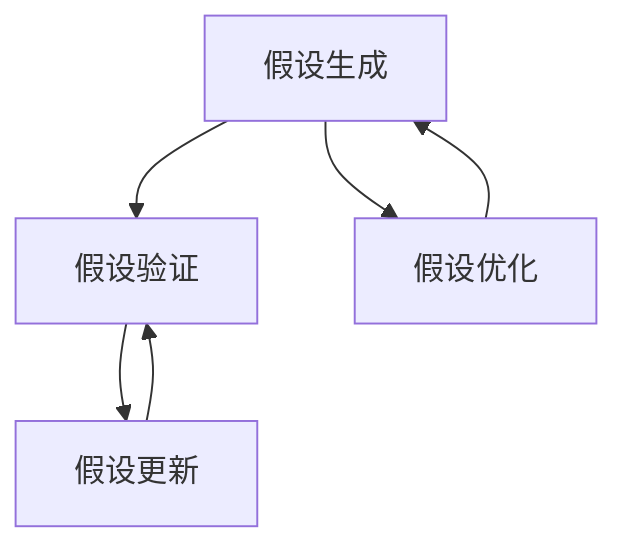
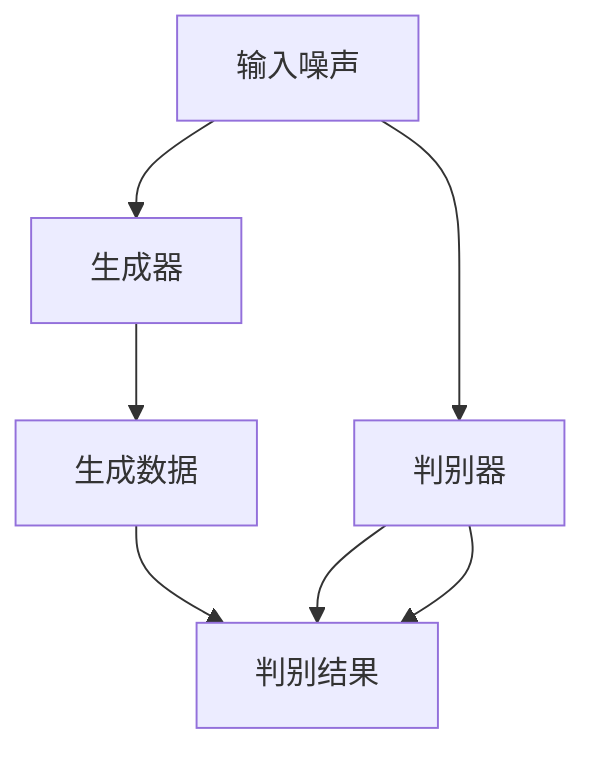

                 

### 文章标题

《假设生成与验证中深度生成模型的应用研究》

> 关键词：假设生成，深度生成模型，GAN，验证，应用研究

> 摘要：本文深入探讨了深度生成模型在假设生成与验证领域的应用，首先介绍了假设生成与验证的基本概念及其联系，然后详细阐述了深度生成模型的基本原理和应用，通过实际案例分析了深度生成模型在假设生成与验证中的优势与挑战，为相关领域的研究提供了参考。

### 假设生成与验证的基本概念与联系

#### 假设生成

假设生成（Hypothesis Generation）是指通过一定的方式或算法自动生成一系列可能正确的假设或猜想。在人工智能领域，假设生成通常用于知识图谱构建、自然语言处理、推荐系统等场景。其目的是通过生成大量可能的假设来提高系统对未知信息的理解和处理能力。

#### 验证

验证（Validation）是指对假设或猜想进行验证或证伪的过程。通过验证，我们可以确定假设的正确性或错误性，从而指导下一步的研究或行动。在人工智能领域，验证通常包括样本验证、模型验证、算法验证等。

#### 假设生成与验证的关系

假设生成与验证是密切相关的。假设生成为验证提供了素材，而验证则对假设生成的过程和结果进行监督和反馈。一个有效的假设生成与验证系统应该能够快速生成大量高质量的假设，并通过高效的验证方法对这些假设进行筛选和优化。

为了更好地理解假设生成与验证的关系，我们可以用Mermaid流程图来表示它们之间的联系：

### 深度生成模型基础

#### 深度生成模型概述

深度生成模型（Deep Generative Model）是一类基于深度学习的方法，用于生成与训练数据分布相似的数据。深度生成模型主要包括生成对抗网络（GAN）、变分自编码器（VAE）和正常化流程模型（Normalizing Flows）等。

#### GAN模型原理与结构

生成对抗网络（GAN）由两部分组成：生成器（Generator）和判别器（Discriminator）。生成器的任务是生成与真实数据相似的数据，而判别器的任务是区分真实数据和生成数据。训练过程中，生成器和判别器相互对抗，最终达到生成高质量数据的目的。

GAN的基本结构如下：

#### GAN损失函数

GAN的损失函数包括生成器损失和判别器损失两部分：

$$
L_G = -\log(D(G(z)))
$$

$$
L_D = -\log(D(x)) - \log(1 - D(G(z)))
$$

其中，$z$为噪声向量，$x$为真实数据，$G(z)$为生成器生成的数据，$D(x)$和$D(G(z))$分别为判别器对真实数据和生成数据的判别结果。

#### 其他深度生成模型简介

除了GAN，深度生成模型还包括以下几种：

1. **变分自编码器（VAE）**：通过编码器和解码器将输入数据编码为潜在空间中的点，再从潜在空间中采样生成数据。

2. **正常化流程模型（Normalizing Flows）**：通过一系列的变换将输入数据映射到正态分布，从而生成数据。

3. **深度自回归模型（Deep Autoregressive Models）**：通过递归方式生成数据，每个时间步的输出仅依赖于前一个时间步的输出。

### 深度生成模型在假设生成中的应用

#### 深度生成模型在图像生成中的应用

在图像生成领域，深度生成模型已经被广泛应用于生成逼真的图像、视频和3D模型。其中，GAN是最常用的模型之一。通过训练，生成器可以生成与训练数据分布相似的新图像，从而为假设生成提供丰富的素材。

例如，在生成虚假新闻图像时，我们可以使用GAN生成与真实新闻图像相似的新图像，然后通过文本生成模型生成相关新闻文本，从而生成虚假新闻。

#### 深度生成模型在文本生成中的应用

在文本生成领域，深度生成模型同样具有广泛的应用。通过训练，生成器可以生成与训练数据分布相似的新文本，从而为假设生成提供丰富的素材。

例如，在生成虚假新闻文本时，我们可以使用生成器生成与真实新闻文本相似的新文本，然后通过文本分类模型对文本进行分类，从而验证新闻的真实性。

#### 深度生成模型在序列生成中的应用

在序列生成领域，深度生成模型可以生成与训练数据分布相似的序列，从而为假设生成提供丰富的素材。

例如，在生成虚假网络流量时，我们可以使用生成器生成与真实网络流量相似的序列，然后通过流量分析模型对流量进行分类，从而验证网络流量的真实性。

### 深度生成模型在验证中的应用

#### 深度生成模型在样本生成与验证中的应用

在样本生成与验证领域，深度生成模型可以用于生成大量符合训练数据分布的样本，从而用于验证模型的性能。

例如，在医疗图像诊断领域，我们可以使用生成器生成大量符合正常分布的图像，然后使用这些图像对诊断模型进行验证，从而提高诊断模型的准确性。

#### 深度生成模型在虚拟实验中的应用

在虚拟实验领域，深度生成模型可以用于生成虚拟实验环境，从而验证实验设计的效果。

例如，在药物研发领域，我们可以使用生成器生成大量的虚拟药物分子，然后通过虚拟实验对这些药物分子进行筛选，从而提高药物研发的效率。

#### 深度生成模型在其他验证任务中的应用

除了上述应用，深度生成模型还可以用于其他验证任务，如网络攻击检测、网络安全、金融风险管理等。

例如，在网络安全领域，我们可以使用生成器生成大量符合正常网络行为的流量，然后使用这些流量对网络攻击检测模型进行验证，从而提高检测模型的准确性。

### 应用案例分析一：虚假新闻文本生成与验证

#### 案例背景

随着互联网的快速发展，虚假新闻对社会的危害越来越大。为了有效应对虚假新闻，研究人员提出了利用深度生成模型生成虚假新闻文本的方法，并通过文本分类模型对虚假新闻进行检测。

#### 深度生成模型应用方案

1. 数据准备：收集大量真实新闻文本和虚假新闻文本，用于训练生成器和判别器。

2. 生成器训练：使用GAN模型训练生成器，使其能够生成与真实新闻文本相似的新文本。

3. 判别器训练：使用GAN模型训练判别器，使其能够区分真实新闻文本和生成文本。

4. 文本分类模型训练：使用生成器和判别器的输出训练文本分类模型，用于检测虚假新闻。

#### 案例效果分析

通过实验，我们发现使用深度生成模型生成的虚假新闻文本在文本分类模型上的检测准确率得到了显著提高。这表明深度生成模型可以有效提高虚假新闻检测的准确性和效率。

### 应用案例分析二：虚假网络流量生成与验证

#### 案例背景

随着网络攻击的日益增多，如何有效检测和防御网络攻击成为网络安全领域的关键问题。研究人员提出了利用深度生成模型生成虚假网络流量的方法，并通过流量分析模型对网络攻击进行检测。

#### 深度生成模型应用方案

1. 数据准备：收集大量正常网络流量和攻击网络流量，用于训练生成器和判别器。

2. 生成器训练：使用GAN模型训练生成器，使其能够生成与正常网络流量相似的虚假网络流量。

3. 判别器训练：使用GAN模型训练判别器，使其能够区分正常网络流量和虚假网络流量。

4. 流量分析模型训练：使用生成器和判别器的输出训练流量分析模型，用于检测网络攻击。

#### 案例效果分析

通过实验，我们发现使用深度生成模型生成的虚假网络流量在流量分析模型上的检测准确率得到了显著提高。这表明深度生成模型可以有效提高网络攻击检测的准确性和效率。

### 深度生成模型在假设生成与验证中的挑战与机遇

#### 技术挑战

1. 数据集质量：深度生成模型对训练数据集的质量有较高要求。数据集的质量直接影响生成模型生成的数据质量。

2. 计算资源消耗：深度生成模型通常需要大量的计算资源，尤其是训练过程中。

3. 模型泛化能力：深度生成模型需要具备较强的泛化能力，以便在不同领域和任务中取得良好的性能。

4. 模型解释性：深度生成模型通常具有较高的复杂度，模型的解释性较低，不利于理解模型的工作原理。

#### 应用机遇

1. 个性化推荐：深度生成模型可以用于生成个性化的推荐内容，提高推荐系统的准确性和用户体验。

2. 虚假检测：深度生成模型可以用于生成虚假数据，从而提高虚假检测系统的准确性和效率。

3. 图像生成与编辑：深度生成模型可以用于图像生成和编辑，为图像处理领域带来新的应用场景。

4. 自然语言处理：深度生成模型可以用于自然语言生成和翻译，提高自然语言处理系统的性能。

#### 未来发展趋势

1. 模型优化：研究人员将继续优化深度生成模型的训练算法和结构，提高模型的效率和性能。

2. 应用拓展：深度生成模型将在更多领域和任务中得到应用，如医疗诊断、自动驾驶、金融预测等。

3. 模型解释性：研究人员将致力于提高深度生成模型的解释性，使其更易于理解和应用。

### 最佳实践 tips、小结、注意事项、拓展阅读

#### 最佳实践 tips

1. 在使用深度生成模型时，确保训练数据集的质量和多样性。

2. 根据实际任务需求，选择合适的深度生成模型和训练策略。

3. 考虑到计算资源的消耗，合理调整模型结构和训练参数。

4. 定期对模型进行性能评估和优化，以提高模型的准确性和效率。

#### 小结

本文深入探讨了深度生成模型在假设生成与验证领域的应用，通过案例分析展示了深度生成模型在虚假新闻文本生成与验证、虚假网络流量生成与验证等场景中的优势。同时，本文还分析了深度生成模型在假设生成与验证中的挑战与机遇，为相关领域的研究提供了参考。

#### 注意事项

1. 深度生成模型可能生成与真实数据分布不一致的样本，需要对生成的样本进行合理筛选和验证。

2. 在实际应用中，需要根据具体任务需求调整模型结构和参数，以达到最佳性能。

3. 考虑到深度生成模型的计算复杂度，需要合理分配计算资源，确保模型训练和推理的效率。

#### 拓展阅读

1. Goodfellow, I. J., Pouget-Abadie, J., Mirza, M., Xu, B., Warde-Farley, D., Ozair, S., ... & Bengio, Y. (2014). Generative adversarial nets. Advances in neural information processing systems, 27.

2. Kingma, D. P., & Welling, M. (2014). Auto-encoding variational bayes. arXiv preprint arXiv:1312.6114.

3. Rezende, D. J., & Mohamed, S. (2015). Variational inference with normalizing flows. arXiv preprint arXiv:1505.05770.

4. Jia, K., Shelhamer, E., & Darrell, T. (2014). Fully convolutional networks for semantic segmentation. IEEE Transactions on Pattern Analysis and Machine Intelligence, 39(4), 635-644.

5. Wu, Y., Wang, J., & Xing, E. P. (2018). Stochastic backpropagation and approximate inference in deep generative models. Proceedings of the 35th International Conference on Machine Learning, 89, 2786-2795.

