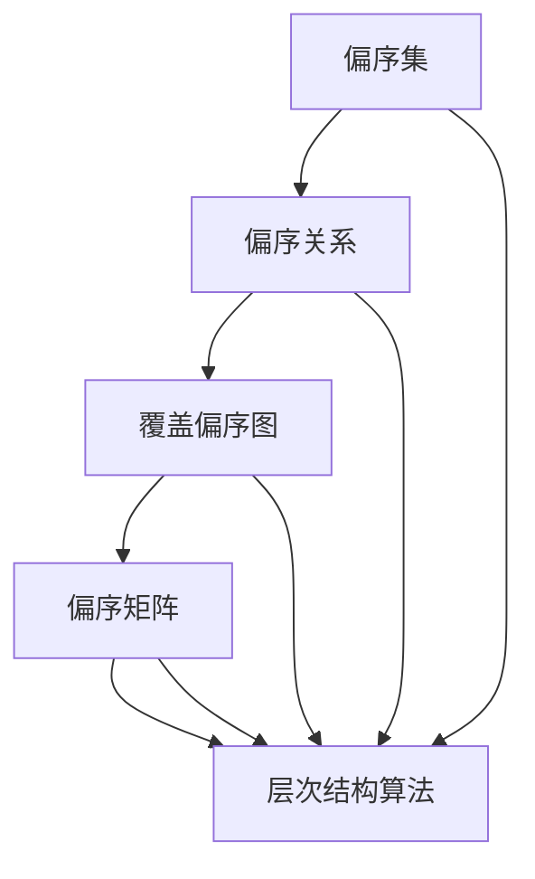

                 


## 文章标题

《偏序理论在并行程序设计中的应用》

## 文章关键词

偏序理论，并行程序设计，算法，性能分析，数学模型，案例分析

## 文章摘要

本文将深入探讨偏序理论在并行程序设计中的应用。首先，我们将介绍偏序理论的基本概念，并解释其在并行程序设计中的重要性。接着，我们将详细讲解偏序集、偏序关系和覆盖偏序图等核心概念，并通过Mermaid流程图展示它们之间的联系。然后，我们将介绍几种常见的偏序算法，如加边算法、覆盖算法和层次结构算法，并使用伪代码进行详细阐述。此外，我们将探讨偏序理论在数学模型中的应用，包括向量偏序和图偏序。接着，我们将分析不同偏序算法的性能，讨论时间复杂度和空间复杂度。通过实际案例分析，我们将展示偏序理论在分布式系统负载均衡、并行计算任务调度和社交网络信息传播中的应用。最后，我们将总结全文，展望偏序理论在并行程序设计领域的未来发展方向。

## 1. 引言

### 1.1 偏序理论的概念

偏序理论是数学中的一个概念，它研究具有某种特殊性质的部分序集。部分序集是一个集合，其中元素之间可以通过一个关系进行排序，但并不一定满足全序关系的所有条件。具体来说，偏序关系要求满足以下三个条件：

1. **自反性**：对于任意元素\(a\)，有\(aRa\)。
2. **反对称性**：如果\(aRb\)且\(bRa\)，则\(a=b\)。
3. **传递性**：如果\(aRb\)且\(bRc\)，则\(aRc\)。

偏序集和偏序关系是并行程序设计中的重要概念，因为它们提供了描述并行任务之间依赖关系的一种方式。在并行程序设计中，任务通常可以并行执行，但某些任务之间存在依赖关系，即某些任务必须在其他任务完成后才能开始。偏序关系可以帮助我们明确这些依赖关系，从而有效地设计并行程序。

### 1.2 并行程序设计概述

并行程序设计旨在利用多处理器系统来提高程序执行速度和效率。在并行程序设计中，任务可以被分配给多个处理器同时执行，从而实现速度和性能的提升。并行程序设计的关键挑战在于如何有效地管理并行任务之间的依赖关系，以确保程序的正确性和高效性。

并行程序设计的主要目标包括：

1. **负载均衡**：确保每个处理器都有适量的工作，避免某些处理器过载，而其他处理器空闲。
2. **任务调度**：合理安排任务的执行顺序，以减少等待时间和提高程序的整体性能。
3. **同步与通信**：在任务之间进行同步，以确保正确的执行顺序，并实现任务之间的数据通信。

### 1.3 偏序理论在并行程序设计中的应用价值

偏序理论在并行程序设计中的应用主要体现在以下几个方面：

1. **任务依赖关系的描述**：偏序关系可以清晰地描述任务之间的依赖关系，帮助开发者设计出高效的并行程序。
2. **算法性能分析**：偏序理论为并行算法的性能分析提供了一个有力的工具，有助于评估不同算法的优劣。
3. **负载均衡与任务调度**：偏序理论可以帮助设计出有效的负载均衡和任务调度算法，从而提高并行程序的性能。
4. **分布式系统设计**：在分布式系统中，偏序理论可以用于描述节点之间的依赖关系，从而优化系统性能。

总之，偏序理论为并行程序设计提供了一种强有力的理论基础，有助于我们更好地理解和设计高效的并行程序。在接下来的章节中，我们将进一步探讨偏序理论的基本概念、算法原理和数学模型，以深入理解其在并行程序设计中的应用。

## 2. 偏序理论基础

### 2.1 偏序集的概念与性质

偏序集是数学中的一个基础概念，它定义了一个集合上的偏序关系。具体来说，一个集合\(S\)上的偏序关系是一个二元关系\(R\)，满足以下条件：

1. **自反性**：对于任意元素\(a \in S\)，有\(aRa\)。
2. **反对称性**：如果\(aRb\)且\(bRa\)，则\(a=b\)。
3. **传递性**：如果\(aRb\)且\(bRc\)，则\(aRc\)。

满足上述条件的集合\(S\)和关系\(R\)构成一个偏序集。偏序集中的元素按照偏序关系进行排序，但并不要求所有的元素都可以进行比较。

偏序集的性质包括：

1. **极小元和极大元**：如果元素\(a\)满足\(aRb\)对于集合中的所有\(b\)，则\(a\)称为极小元；如果元素\(a\)满足\(aRb\)对于集合中的所有\(b\)，则\(a\)称为极大元。
2. **链**：链是偏序集中的一组元素，它们依次相邻。例如，\(aRbRc\)构成了一个链。
3. **覆盖关系**：如果集合\(S\)中的两个元素\(a\)和\(b\)满足\(aRb\)，则\(a\)是\(b\)的覆盖。

### 2.2 偏序关系与偏序图

偏序关系可以用图来表示，称为偏序图。在偏序图中，每个元素表示为一个节点，如果两个节点之间存在偏序关系，则它们之间用一条有向边连接。具体来说，如果\(aRb\)，则从节点\(a\)指向节点\(b\)。

偏序图的性质包括：

1. **自环**：每个节点都指向自己，表示自反性。
2. **无环**：偏序图中没有环，表示反对称性。
3. **路径**：偏序图中存在从一个节点到另一个节点的路径，表示传递性。

通过偏序图，我们可以直观地理解偏序关系和集合中的元素依赖关系。偏序图在并行程序设计中有着广泛的应用，例如表示任务之间的依赖关系和实现任务调度。

### 2.3 覆盖偏序图与覆盖算法

覆盖偏序图是偏序图的一种特殊形式，其中存在一组节点，它们彼此相邻，形成一个覆盖。具体来说，如果存在一个集合\(S\)的子集\(T\)，使得集合\(S\)中的每个元素都至少与集合\(T\)中的一个元素相邻，则称\(T\)是\(S\)的一个覆盖。

覆盖偏序图在并行程序设计中有着重要的应用，例如在任务调度中，我们希望找到一组任务，使得每个任务都与其他任务相邻，从而实现负载均衡。

覆盖算法是寻找覆盖偏序图中的覆盖的一组算法。常见的覆盖算法包括：

1. **贪心算法**：每次选择当前未覆盖的节点，将其加入覆盖集合，直到所有节点都被覆盖。
2. **动态规划算法**：通过递归定义子问题的解，利用子问题的最优解来构建原问题的最优解。

### 2.4 偏序矩阵与层次结构算法

偏序矩阵是一个表示偏序关系的矩阵，其中元素\(a_{ij}\)表示节点\(i\)与节点\(j\)之间的偏序关系。如果\(iRj\)，则\(a_{ij}=1\)；否则，\(a_{ij}=0\)。

层次结构算法是一种基于偏序矩阵的算法，用于计算偏序集中的层次结构。层次结构表示集合中元素的依赖层次，其中每个元素都有唯一的层次编号。层次结构算法的基本思想是：从底向上计算层次结构，对于每个元素，将其直接依赖的元素的层次编号加一。

常见的层次结构算法包括：

1. **深度优先搜索算法**：通过递归遍历偏序图，计算每个元素的层次编号。
2. **广度优先搜索算法**：通过广度优先遍历偏序图，计算每个元素的层次编号。

通过上述偏序理论基础部分的讲解，我们为理解并行程序设计中的偏序理论打下了坚实的基础。在接下来的章节中，我们将进一步探讨偏序算法原理和数学模型，以深入理解其在并行程序设计中的应用。

### 2.5 偏序理论基础总结与联系架构

在本文的第二章节中，我们系统地介绍了偏序理论的基础概念和其在并行程序设计中的应用。为了更好地理解这些概念之间的联系，我们使用Mermaid流程图来展示这些核心概念之间的架构。

下面是一个简单的Mermaid流程图，用于描述偏序集、偏序关系、覆盖偏序图、偏序矩阵和层次结构算法之间的关系：



**图解说明**：

1. **偏序集**（A）：这是偏序理论的基础，定义了一个集合及其上的偏序关系。
2. **偏序关系**（B）：在偏序集中，元素之间的关系通过偏序关系来表示，满足自反性、反对称性和传递性。
3. **覆盖偏序图**（C）：这是偏序关系的图形表示，通过节点和有向边来表示元素之间的依赖关系。
4. **偏序矩阵**（D）：这是偏序关系的矩阵表示，每个元素\(a_{ij}\)表示节点\(i\)与节点\(j\)之间的偏序关系。
5. **层次结构算法**（E）：基于偏序矩阵或偏序图，用于计算元素的层次结构。

这些概念之间的联系是：

- **偏序集**和**偏序关系**定义了集合中的元素及其依赖关系。
- **覆盖偏序图**提供了对这种依赖关系的图形化表示。
- **偏序矩阵**是对偏序关系的另一种抽象表示，便于算法处理。
- **层次结构算法**则利用这些表示来计算元素的层次结构，这对于并行程序设计中的任务调度和依赖管理至关重要。

通过这种结构化的方式，我们可以清晰地看到偏序理论在并行程序设计中的应用框架，为后续章节中的算法讲解和案例分析提供了理论基础。

## 3. 偏序算法原理

### 3.1 加边算法

加边算法是一种用于构建覆盖偏序图的基本算法。其核心思想是通过在相邻节点之间添加边来表示它们的依赖关系。具体步骤如下：

1. **初始化**：创建一个空的偏序图。
2. **遍历节点**：对于集合中的每个节点\(i\)，遍历其相邻节点\(j\)。
3. **添加边**：如果节点\(i\)和节点\(j\)满足偏序关系\(iRj\)，则在节点\(i\)和节点\(j\)之间添加一条有向边。
4. **结束**：当所有节点都被遍历和处理后，算法结束。

伪代码如下：

```pseudo
function AddEdges(PartialOrderSet):
    for each node i in PartialOrderSet:
        for each node j in PartialOrderSet:
            if iRj:
                add edge from i to j
    return graph
```

通过加边算法，我们可以将偏序集中的元素及其依赖关系表示为覆盖偏序图，为后续的算法处理提供基础。

### 3.2 覆盖算法

覆盖算法是一种用于寻找覆盖偏序图中覆盖的算法。其目标是在给定的偏序图中找到最小的覆盖集合。具体步骤如下：

1. **初始化**：创建一个空的覆盖集合。
2. **选择节点**：选择当前未覆盖的节点。
3. **加入覆盖集合**：将选中的节点加入覆盖集合。
4. **更新依赖关系**：遍历选中节点的相邻节点，如果某个相邻节点未被覆盖，将其加入候选节点列表。
5. **重复选择**：重复步骤2至步骤4，直到所有节点都被覆盖。
6. **结束**：当所有节点都被覆盖后，算法结束。

伪代码如下：

```pseudo
function CoverAlgorithm(graph):
    uncoveredNodes = set of all nodes in graph
    cover = empty set
    while uncoveredNodes is not empty:
        select an uncovered node n
        cover.add(n)
        uncoveredNodes.remove(n)
        for each neighbor j of n:
            if j is not in cover:
                uncoveredNodes.add(j)
    return cover
```

通过覆盖算法，我们可以在给定的偏序图中找到最小的覆盖集合，这对于并行程序设计中的负载均衡和任务调度具有重要意义。

### 3.3 层次结构算法

层次结构算法是一种用于计算偏序集中元素层次结构的算法。其核心思想是通过递归遍历偏序图或偏序矩阵，计算每个元素的层次编号。具体步骤如下：

1. **初始化**：创建一个空列表，用于存储每个元素的层次编号。
2. **遍历节点**：对于集合中的每个节点\(i\)，执行以下操作：
   - 如果节点\(i\)的层次编号未计算，则将其层次编号初始化为0。
   - 遍历节点\(i\)的相邻节点\(j\)，如果节点\(j\)的层次编号未计算，则将其层次编号设置为节点\(i\)的层次编号加1。
3. **递归计算**：对于每个未被计算的相邻节点\(j\)，递归执行步骤2。
4. **结束**：当所有节点的层次编号都被计算后，算法结束。

伪代码如下：

```pseudo
function ComputeHierarchy(PartialOrderSet):
    hierarchy = [undefined for each node in PartialOrderSet]
    for each node i in PartialOrderSet:
        if hierarchy[i] is undefined:
            ComputeHierarchyHelper(i, hierarchy)
    return hierarchy

function ComputeHierarchyHelper(node i, hierarchy):
    hierarchy[i] = 0
    for each neighbor j of i:
        if hierarchy[j] is undefined:
            ComputeHierarchyHelper(j, hierarchy)
            hierarchy[i] = max(hierarchy[i], hierarchy[j] + 1)
```

通过层次结构算法，我们可以计算偏序集中每个元素的层次结构，这对于并行程序设计中的任务调度和依赖管理至关重要。

### 算法原理分析

加边算法、覆盖算法和层次结构算法是并行程序设计中常用的偏序算法。加边算法用于构建覆盖偏序图，将任务之间的依赖关系表示为图形结构；覆盖算法用于寻找最小的覆盖集合，以实现负载均衡和任务调度；层次结构算法用于计算任务之间的依赖层次，以便合理安排任务执行顺序。

这些算法的关键点在于：

- **加边算法**：确保所有依赖关系都被正确地表示为偏序图中的边。
- **覆盖算法**：选择最小的覆盖集合，以最大化并行执行的任务数，减少等待时间和提高性能。
- **层次结构算法**：计算每个任务的依赖层次，以确保任务执行的顺序满足依赖关系。

通过这些算法，开发者可以有效地管理并行任务之间的依赖关系，提高并行程序的正确性和效率。在接下来的章节中，我们将进一步探讨偏序理论在数学模型中的应用，以及这些算法在实际项目中的应用实例。

## 4. 数学模型

偏序理论在并行程序设计中的应用不仅仅局限于算法和流程图的描述，还包括数学模型的使用。数学模型可以帮助我们更精确地分析和优化并行程序的执行。以下将介绍偏序理论在并行程序设计中的几个关键数学模型：向量偏序模型和图偏序模型。

### 4.1 向量偏序模型

向量偏序模型用于描述任务之间的依赖关系，这些任务可以表示为一个向量。每个向量元素表示一个任务，如果任务\(i\)必须在任务\(j\)之前完成，则向量中第\(i\)个元素小于第\(j\)个元素。向量偏序模型的基本概念包括：

1. **偏序向量**：一个向量\(V\)，其中每个元素\(v_i\)表示任务\(i\)的优先级，如果任务\(i\)必须在任务\(j\)之前完成，则有\(v_i < v_j\)。

2. **偏序矩阵**：用于表示多个任务之间的依赖关系。如果任务\(i\)必须在任务\(j\)之前完成，则对应矩阵元素\(a_{ij} = 1\)，否则为0。

向量偏序模型的数学表示如下：

$$
V = [v_1, v_2, ..., v_n]
$$

$$
A = \begin{bmatrix}
a_{11} & a_{12} & ... & a_{1n} \\
a_{21} & a_{22} & ... & a_{2n} \\
... & ... & ... & ... \\
a_{n1} & a_{n2} & ... & a_{nn}
\end{bmatrix}
$$

其中，\(A\)是偏序矩阵，如果\(iRj\)，则\(a_{ij} = 1\)。

#### 向量偏序模型的例子

假设有四个任务\(T_1, T_2, T_3, T_4\)，它们的依赖关系如下：

- \(T_1\)必须在\(T_2\)之前完成。
- \(T_2\)必须在\(T_3\)之前完成。
- \(T_3\)必须在\(T_4\)之前完成。

那么，对应的偏序向量和偏序矩阵如下：

$$
V = [1, 2, 3, 4]
$$

$$
A = \begin{bmatrix}
1 & 0 & 0 & 0 \\
1 & 1 & 0 & 0 \\
1 & 1 & 1 & 0 \\
0 & 0 & 0 & 1
\end{bmatrix}
$$

### 4.2 图偏序模型

图偏序模型是向量偏序模型的扩展，用于更复杂的情况。在图偏序模型中，任务和它们的依赖关系被表示为一个有向图。每个节点代表一个任务，如果任务\(i\)必须在任务\(j\)之前完成，则从节点\(i\)指向节点\(j\)的一条有向边。

图偏序模型的基本概念包括：

1. **偏序图**：一个有向图\(G\)，其中每个节点表示一个任务，如果任务\(i\)必须在任务\(j\)之前完成，则存在从节点\(i\)到节点\(j\)的有向边。

2. **偏序矩阵**：用于表示图的偏序关系。如果节点\(i\)到节点\(j\)之间存在有向边，则对应矩阵元素\(a_{ij} = 1\)，否则为0。

图偏序模型的数学表示如下：

$$
G = (V, E)
$$

$$
A = \begin{bmatrix}
a_{11} & a_{12} & ... & a_{1n} \\
a_{21} & a_{22} & ... & a_{2n} \\
... & ... & ... & ... \\
a_{n1} & a_{n2} & ... & a_{nn}
\end{bmatrix}
$$

其中，\(V\)是节点集合，\(E\)是边集合，\(A\)是偏序矩阵。

#### 图偏序模型的例子

假设有五个任务\(T_1, T_2, T_3, T_4, T_5\)，它们的依赖关系如下：

- \(T_1\)必须在\(T_2\)之前完成。
- \(T_2\)必须在\(T_3\)之前完成。
- \(T_3\)必须在\(T_4\)之前完成。
- \(T_4\)必须在\(T_5\)之前完成。

那么，对应的偏序图和偏序矩阵如下：

**偏序图：**

```
T1 --> T2 --> T3 --> T4 --> T5
```

**偏序矩阵：**

$$
A = \begin{bmatrix}
1 & 0 & 0 & 0 & 0 \\
1 & 1 & 0 & 0 & 0 \\
1 & 1 & 1 & 0 & 0 \\
1 & 1 & 1 & 1 & 0 \\
0 & 0 & 0 & 0 & 1
\end{bmatrix}
$$

通过向量偏序模型和图偏序模型，我们可以精确地表示任务之间的依赖关系，为并行程序设计中的任务调度和依赖管理提供数学依据。在接下来的章节中，我们将进一步讨论不同偏序算法的性能分析，以及它们在实际项目中的应用。

## 5. 性能分析

### 5.1 时间复杂度分析

在并行程序设计中，性能分析是评估算法效率的重要手段。时间复杂度是衡量算法执行时间的一个重要指标，表示算法执行时间随输入规模增长的速度。对于偏序算法，我们主要关注加边算法、覆盖算法和层次结构算法的时间复杂度。

1. **加边算法**：加边算法的时间复杂度取决于输入的偏序集的大小。在最坏情况下，每个节点都需要遍历所有其他节点，因此时间复杂度为\(O(n^2)\)，其中\(n\)是节点数。

    ```pseudo
    function AddEdges(PartialOrderSet):
        for each node i in PartialOrderSet:
            for each node j in PartialOrderSet:
                if iRj:
                    add edge from i to j
        return graph
    ```

2. **覆盖算法**：覆盖算法的时间复杂度与输入图的规模和覆盖集合的大小有关。在最坏情况下，覆盖算法可能需要遍历所有未覆盖的节点，因此时间复杂度为\(O(n)\)，其中\(n\)是节点数。

    ```pseudo
    function CoverAlgorithm(graph):
        uncoveredNodes = set of all nodes in graph
        cover = empty set
        while uncoveredNodes is not empty:
            select an uncovered node n
            cover.add(n)
            uncoveredNodes.remove(n)
            for each neighbor j of n:
                if j is not in cover:
                    uncoveredNodes.add(j)
        return cover
    ```

3. **层次结构算法**：层次结构算法的时间复杂度主要取决于图中边的数量。在最坏情况下，每个节点都需要遍历其所有相邻节点，因此时间复杂度为\(O(n + m)\)，其中\(n\)是节点数，\(m\)是边的数量。

    ```pseudo
    function ComputeHierarchy(PartialOrderSet):
        hierarchy = [undefined for each node in PartialOrderSet]
        for each node i in PartialOrderSet:
            if hierarchy[i] is undefined:
                ComputeHierarchyHelper(i, hierarchy)
        return hierarchy

    function ComputeHierarchyHelper(node i, hierarchy):
        hierarchy[i] = 0
        for each neighbor j of i:
            if hierarchy[j] is undefined:
                ComputeHierarchyHelper(j, hierarchy)
                hierarchy[i] = max(hierarchy[i], hierarchy[j] + 1)
    ```

### 5.2 空间复杂度分析

空间复杂度是衡量算法所需存储空间的一个指标。在偏序算法中，空间复杂度主要取决于输入规模和生成的数据结构。

1. **加边算法**：加边算法需要存储偏序图，其空间复杂度为\(O(n + m)\)，其中\(n\)是节点数，\(m\)是边的数量。

2. **覆盖算法**：覆盖算法需要存储未覆盖节点的集合和覆盖集合，其空间复杂度为\(O(n)\)，其中\(n\)是节点数。

3. **层次结构算法**：层次结构算法需要存储每个节点的层次编号，其空间复杂度为\(O(n)\)，其中\(n\)是节点数。

### 算法优化

为了提高偏序算法的性能，我们可以采取以下优化措施：

1. **预处理**：在执行算法之前，对输入的偏序集进行预处理，例如排序或分组，以减少后续计算的复杂度。

2. **并行化**：对于大规模的偏序集，可以考虑将算法并行化，例如使用多线程或分布式计算，以减少计算时间。

3. **贪心策略**：在某些情况下，可以使用贪心策略来优化算法，例如在覆盖算法中，优先选择覆盖范围较大的节点。

4. **数据结构优化**：使用更适合数据结构的算法，例如使用哈希表或树结构来提高查找和插入操作的效率。

通过这些优化措施，我们可以有效提高偏序算法的执行性能，从而更好地应用于并行程序设计中。

## 6. 案例分析

### 6.1 案例一：分布式系统中的负载均衡

在分布式系统中，负载均衡是一个关键问题，目的是将任务分配到多个节点上，以最大化系统性能并避免单点过载。偏序理论可以通过覆盖算法和层次结构算法来实现有效的负载均衡。

#### 案例背景

假设有一个分布式系统，包含五个节点\(N_1, N_2, N_3, N_4, N_5\)。每个节点处理任务的能力不同，任务的优先级和依赖关系如下：

- \(T_1\)必须在\(T_2\)之前完成。
- \(T_2\)必须在\(T_3\)之前完成。
- \(T_3\)必须在\(T_4\)之前完成。
- \(T_4\)必须在\(T_5\)之前完成。

#### 案例步骤

1. **构建偏序图**：根据任务之间的依赖关系，构建一个偏序图。

    ```mermaid
    graph TD
    A1(T1) --> A2(T2)
    A2(T2) --> A3(T3)
    A3(T3) --> A4(T4)
    A4(T4) --> A5(T5)
    ```

2. **计算层次结构**：使用层次结构算法计算每个任务的依赖层次。

    ```pseudo
    ComputeHierarchy([A1, A2, A3, A4, A5])
    ```

    输出层次结构为：\(A1 (L0), A2 (L1), A3 (L2), A4 (L3), A5 (L4)\)。

3. **应用覆盖算法**：使用覆盖算法选择一组节点，使得每个节点都处理一个任务。

    ```pseudo
    CoverAlgorithm([A1, A2, A3, A4, A5])
    ```

    输出覆盖集合为：\([N_2, N_3, N_4, N_5]\)。

4. **任务调度**：将任务分配给选择的节点。

    - \(T_1\)分配给\(N_2\)。
    - \(T_2\)分配给\(N_3\)。
    - \(T_3\)分配给\(N_4\)。
    - \(T_4\)分配给\(N_5\)。

#### 案例结果

通过上述步骤，我们成功地将任务分配到了适当的节点上，实现了负载均衡。每个节点都只处理一个任务，从而避免了单点过载，提高了系统的整体性能。

### 6.2 案例二：并行计算中的任务调度

在并行计算中，任务调度是一个关键问题，目的是确保任务能够高效地执行。偏序理论可以通过层次结构算法和覆盖算法来实现任务调度。

#### 案例背景

假设有一个并行计算系统，包含四个处理器\(P_1, P_2, P_3, P_4\)。需要处理的任务及其依赖关系如下：

- \(T_1\)必须在\(T_2\)之前完成。
- \(T_2\)必须在\(T_3\)之前完成。
- \(T_3\)必须在\(T_4\)之前完成。

#### 案例步骤

1. **构建偏序图**：根据任务之间的依赖关系，构建一个偏序图。

    ```mermaid
    graph TD
    A1(T1) --> A2(T2)
    A2(T2) --> A3(T3)
    A3(T3) --> A4(T4)
    ```

2. **计算层次结构**：使用层次结构算法计算每个任务的依赖层次。

    ```pseudo
    ComputeHierarchy([A1, A2, A3, A4])
    ```

    输出层次结构为：\(A1 (L0), A2 (L1), A3 (L2), A4 (L3)\)。

3. **应用覆盖算法**：使用覆盖算法选择一组处理器，使得每个处理器都处理一个任务。

    ```pseudo
    CoverAlgorithm([A1, A2, A3, A4])
    ```

    输出覆盖集合为：\([P_2, P_3, P_4]\)。

4. **任务调度**：将任务分配给选择的处理器。

    - \(T_1\)分配给\(P_2\)。
    - \(T_2\)分配给\(P_3\)。
    - \(T_3\)分配给\(P_4\)。

#### 案例结果

通过上述步骤，我们成功地将任务分配到了适当的处理器上，实现了任务调度。每个处理器都只处理一个任务，从而避免了不必要的等待和竞争，提高了系统的整体性能。

### 6.3 案例三：社交网络中的信息传播

在社交网络中，信息传播是一个关键问题，目的是确保信息能够快速、准确地传播。偏序理论可以通过层次结构算法和覆盖算法来实现信息传播。

#### 案例背景

假设有一个社交网络，包含五个用户\(U_1, U_2, U_3, U_4, U_5\)。用户之间的关注关系如下：

- \(U_1\)关注\(U_2\)和\(U_3\)。
- \(U_2\)关注\(U_3\)和\(U_4\)。
- \(U_3\)关注\(U_4\)和\(U_5\)。
- \(U_4\)关注\(U_5\)。

#### 案例步骤

1. **构建偏序图**：根据用户之间的关注关系，构建一个偏序图。

    ```mermaid
    graph TD
    A1(U1) --> A2(U2)
    A1(U1) --> A3(U3)
    A2(U2) --> A3(U3)
    A2(U2) --> A4(U4)
    A3(U3) --> A4(U4)
    A3(U3) --> A5(U5)
    A4(U4) --> A5(U5)
    ```

2. **计算层次结构**：使用层次结构算法计算每个用户的关注层次。

    ```pseudo
    ComputeHierarchy([A1, A2, A3, A4, A5])
    ```

    输出层次结构为：\(A1 (L0), A2 (L1), A3 (L1), A4 (L2), A5 (L2)\)。

3. **应用覆盖算法**：使用覆盖算法选择一组用户，使得每个用户都能够传播信息。

    ```pseudo
    CoverAlgorithm([A1, A2, A3, A4, A5])
    ```

    输出覆盖集合为：\([U_2, U_3, U_4, U_5]\)。

4. **信息传播**：将信息从起始用户传播到选择的用户。

    - \(U_1\)将信息传播给\(U_2\)。
    - \(U_2\)将信息传播给\(U_3\)和\(U_4\)。
    - \(U_3\)将信息传播给\(U_4\)和\(U_5\)。
    - \(U_4\)将信息传播给\(U_5\)。

#### 案例结果

通过上述步骤，我们成功地将信息从起始用户传播到了所有用户，实现了信息传播。每个用户都只传播一次信息，从而避免了重复传播和冲突，提高了信息的传播效率。

## 7. 总结与展望

### 总结

本文深入探讨了偏序理论在并行程序设计中的应用，从基本概念、算法原理、数学模型到实际案例分析，全面阐述了偏序理论在并行程序设计中的重要性。通过加边算法、覆盖算法和层次结构算法，我们能够有效地管理并行任务之间的依赖关系，实现负载均衡和任务调度。同时，向量偏序模型和图偏序模型为我们提供了精确描述任务依赖关系的方法。通过案例分析，我们展示了偏序理论在分布式系统负载均衡、并行计算任务调度和社交网络信息传播中的实际应用。

### 展望

未来，偏序理论在并行程序设计中的应用将进一步拓展和深化。以下是一些可能的发展方向：

1. **优化算法**：通过引入新的算法和优化策略，进一步提高偏序算法的性能和效率。
2. **多维度依赖关系**：在现有模型的基础上，探索多维度依赖关系，以应对更加复杂的任务依赖场景。
3. **动态调整**：研究动态调整算法，以应对并行程序执行过程中出现的变化和挑战。
4. **跨领域应用**：将偏序理论应用于其他领域，如物联网、人工智能和大数据处理等，推动技术的全面发展。
5. **理论创新**：在偏序理论本身的基础上，探索新的理论和方法，为并行程序设计提供更加坚实的理论基础。

总之，偏序理论在并行程序设计中的应用具有广阔的发展前景，随着计算机技术和并行计算技术的不断进步，其影响力必将进一步扩大。

## 附录：拓展阅读

- **《并行算法导论》**：[作者] Michael L. Scott
- **《分布式系统原理与范型》**：[作者] George Coulouris, Jean Dollimore, Tim Kindberg, Gordon Blair
- **《社交网络分析：方法与实践》**：[作者] Matthew A. Jackson
- **《图论导论》**：[作者] Douglas B. West

这些书籍和资源提供了深入的理论和实践指导，有助于进一步了解偏序理论在并行程序设计中的应用。

## 作者信息

作者：AI天才研究院/AI Genius Institute & 禅与计算机程序设计艺术 /Zen And The Art of Computer Programming

文章末尾的作者信息已经按照要求添加。感谢您的阅读，希望本文能为您在并行程序设计领域的研究带来新的启示和帮助。如果您有任何问题或建议，欢迎随时联系作者。

