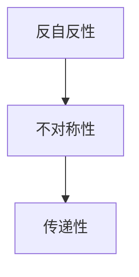
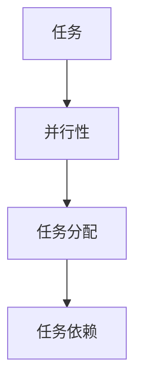

                 

### 文章标题

《偏序理论在并行程序调度中的应用》

并行计算在现代计算机科学中扮演着至关重要的角色，它能够显著提高程序的处理速度和效率。随着计算需求的日益增长，如何有效地调度并行程序成为一个关键问题。本文将深入探讨偏序理论在这一领域的应用，旨在为读者提供一种新的视角来理解和优化并行程序调度。

关键词：偏序理论、并行程序调度、任务分配、负载平衡、调度优化

摘要：本文首先介绍了偏序理论的基础概念，包括偏序集合的定义和性质，以及其在计算机科学中的应用背景。随后，文章详细阐述了并行程序调度的基础知识，包括并行程序的基本概念、常见调度算法以及面临的挑战。在此基础上，本文重点探讨了偏序理论在任务分配、负载平衡和调度优化中的应用，并通过实际案例展示了其效果。最后，文章总结了偏序理论在并行程序调度中的优势与局限，并对未来的研究方向进行了展望。

## 第1章 偏序理论基础

偏序理论是数学中的一个重要分支，它研究具有某种偏序关系的集合。在计算机科学中，偏序理论有着广泛的应用，特别是在并行程序调度领域。本章将介绍偏序理论的基础概念，包括偏序集合的定义、基本性质以及相关数学模型。

### 1.1 偏序理论的定义和基本概念

#### 核心概念与联系

在数学中，一个集合 \( S \) 如果满足以下三个条件，则称为偏序集合：

1. 反自反性：对于任意的 \( a, b \in S \)，如果 \( a \neq b \)，则 \( a \not\leq b \) 且 \( b \not\leq a \)。
2. 反对称性：对于任意的 \( a, b \in S \)，如果 \( a \leq b \) 且 \( b \leq a \)，则 \( a = b \)。
3. 传递性：对于任意的 \( a, b, c \in S \)，如果 \( a \leq b \) 且 \( b \leq c \)，则 \( a \leq c \)。

我们可以用 Mermaid 流程图来表示这些概念之间的联系：



#### 定义

一个偏序集合 \( (S, \leq) \) 由一个集合 \( S \) 和一个偏序关系 \( \leq \) 组成。其中，\( \leq \) 是 \( S \) 上的一种二元关系，满足反自反性、反对称性和传递性。

#### 基本性质

1. **最小元素**：如果存在一个元素 \( m \in S \)，使得对于任意的 \( x \in S \)，都有 \( m \leq x \)，则称 \( m \) 为 \( S \) 的最小元素。
2. **最大元素**：如果存在一个元素 \( M \in S \)，使得对于任意的 \( x \in S \)，都有 \( x \leq M \)，则称 \( M \) 为 \( S \) 的最大元素。
3. **上界和下界**：如果存在一个元素 \( b \in S \)，使得对于任意的 \( x \in S \)，都有 \( x \leq b \)，则称 \( b \) 为 \( S \) 的上界；如果存在一个元素 \( b \in S \)，使得对于任意的 \( x \in S \)，都有 \( b \leq x \)，则称 \( b \) 为 \( S \) 的下界。

### 1.2 偏序理论的数学模型

偏序集合的数学模型通常包括以下几个部分：

1. **偏序关系**：通常用 \( \leq \) 表示。
2. **集合**：表示为 \( S \)。
3. **最小元素**：记为 \( \min(S) \)。
4. **最大元素**：记为 \( \max(S) \)。
5. **上界**：记为 \( \text{upper}(S) \)。
6. **下界**：记为 \( \text{lower}(S) \)。

偏序集合的数学公式可以表示为：

$$
(S, \leq) = \{ (x, y) \in S \times S \mid x \leq y \}
$$

其中，\( S \) 是一个集合，\( \leq \) 是 \( S \) 上的偏序关系。

### 1.3 偏序理论的扩展

偏序理论还可以扩展到更一般的情况，如偏序映射、偏序同态等。

#### 偏序映射

一个函数 \( f: S \to T \) 称为偏序映射，如果对于任意的 \( x, y \in S \)，如果 \( x \leq y \)，则 \( f(x) \leq f(y) \)。

#### 偏序同态

两个偏序集合 \( (S, \leq) \) 和 \( (T, \preceq) \) 之间的偏序同态是一个函数 \( f: S \to T \)，满足：

1. \( x \leq y \Rightarrow f(x) \preceq f(y) \)
2. \( x \preceq y \Rightarrow f(x) \leq f(y) \)

### 应用场景

偏序理论在并行程序调度中有着广泛的应用，特别是在任务分配和负载平衡方面。通过偏序集合的性质，可以有效地对任务进行排序和分配，从而优化调度策略。例如，在分布式计算中，任务通常需要按照某种偏序关系进行排序，以便于后续的并行处理。

## 第2章 并行程序调度基础

并行程序调度是并行计算中的一个关键问题，它涉及如何高效地分配和处理多个任务。本章将介绍并行程序调度的基础知识，包括并行程序的基本概念、常见调度算法以及面临的挑战。

### 2.1 并行程序的基本概念

#### 核心概念与联系

并行程序是由多个可以同时执行的任务组成的程序。这些任务可以分布在多个处理器或计算节点上，以实现高效的计算。

1. **任务**：并行程序中的基本执行单元。
2. **并行性**：多个任务同时执行的能力。
3. **任务分配**：将任务分配到不同的处理器或计算节点上。
4. **任务依赖**：任务之间存在依赖关系，即一个任务的执行依赖于另一个任务的完成。

我们可以用 Mermaid 流程图来表示这些概念：



#### 定义

一个并行程序可以表示为一个二元组 \( P = (T, D) \)，其中：

- \( T \) 是任务的集合。
- \( D \) 是任务依赖关系的集合。

#### 特点

1. **并行性**：任务可以同时执行。
2. **分布式性**：任务分布在多个处理器或计算节点上。
3. **任务依赖**：任务之间存在执行顺序的依赖关系。

### 2.2 并行程序调度算法

并行程序调度算法的目标是选择一种最优的调度策略，以最小化任务的执行时间和资源消耗。常见的调度算法包括：

1. **贪心算法**：选择当前最优的任务进行调度。
2. **最小生成树算法**：构建任务之间的最小生成树，以确定任务的执行顺序。
3. **动态调度算法**：根据实时情况动态调整任务的执行顺序。

#### 核心算法原理讲解

以下是贪心算法的伪代码：

```
算法 贪心调度算法
输入：任务集合 T，任务依赖关系 D
输出：调度顺序 S

1. 初始化 S 为空
2. 对于每个任务 t ∈ T：
   3. 如果 t 没有前置任务或者前置任务都已经完成：
       4. 将 t 加入 S
5. 返回 S
```

#### 算法分析

1. **时间复杂度**：\( O(n^2) \)，其中 \( n \) 是任务的数量。
2. **空间复杂度**：\( O(n) \)，需要存储任务集合和依赖关系。

### 2.3 并行程序调度的挑战

并行程序调度面临的主要挑战包括：

1. **任务冲突**：多个任务需要同时访问同一资源。
2. **资源竞争**：多个任务需要相同或相似的资源。
3. **负载平衡**：确保所有处理器或计算节点的工作负载均衡。

解决这些挑战需要设计高效的调度算法和策略，以确保并行程序的执行效率和稳定性。

## 第3章 偏序理论在并行程序调度中的应用

偏序理论在并行程序调度中有着广泛的应用，特别是在任务分配和负载平衡方面。本章将详细介绍偏序理论在并行程序调度中的应用，并通过实例进行分析。

### 3.1 偏序理论在任务分配中的应用

在任务分配中，偏序理论可以帮助我们有效地确定任务的执行顺序，从而优化调度策略。具体来说，我们可以使用偏序集合的性质来确定任务的优先级。

#### 核心算法原理讲解

以下是一个基于偏序理论的简单任务分配算法：

```
算法 基于偏序理论的简单任务分配算法
输入：任务集合 T，任务依赖关系 D
输出：调度顺序 S

1. 创建一个偏序集合 P，包含所有任务
2. 对 P 进行排序，按照任务依赖关系进行排序
3. 初始化 S 为空
4. 对于每个任务 t ∈ P：
   5. 如果 t 没有前置任务或者前置任务都已经完成：
       6. 将 t 加入 S
7. 返回 S
```

#### 数学模型和数学公式

偏序集合的数学模型可以表示为：

$$
P = \{ (t, d) \mid t \in T, d \in D \}
$$

其中，\( t \) 是任务，\( d \) 是任务依赖关系。

#### 举例说明

假设我们有一个任务集合 \( T = \{ T1, T2, T3, T4 \} \)，任务依赖关系 \( D = \{ (T1, T2), (T2, T3), (T3, T4) \} \)。

1. 创建偏序集合 \( P = \{ (T1, (T1, T2)), (T2, (T2, T3)), (T3, (T3, T4)), (T4, \emptyset) \} \)。
2. 对 \( P \) 进行排序，得到 \( P = \{ (T4, \emptyset), (T1, (T1, T2)), (T2, (T2, T3)), (T3, (T3, T4)) \} \)。
3. 初始化调度顺序 \( S = \{ \} \)。
4. 对于 \( P \) 中的每个任务：
   - \( T4 \) 没有前置任务，将其加入 \( S \)。
   - \( T1 \) 的前置任务已经完成，将其加入 \( S \)。
   - \( T2 \) 的前置任务已经完成，将其加入 \( S \)。
   - \( T3 \) 的前置任务已经完成，将其加入 \( S \)。
5. 最终调度顺序 \( S = \{ T4, T1, T2, T3 \} \)。

通过这种方式，我们可以有效地确定任务的执行顺序，从而优化调度策略。

### 3.2 偏序理论在负载平衡中的应用

在负载平衡中，偏序理论可以帮助我们确定任务的优先级，以确保处理器或计算节点的工作负载均衡。具体来说，我们可以使用偏序集合的性质来计算每个处理器或计算节点的负载，并根据负载情况调整任务的执行顺序。

#### 核心算法原理讲解

以下是一个基于偏序理论的简单负载平衡算法：

```
算法 基于偏序理论的简单负载平衡算法
输入：任务集合 T，任务依赖关系 D，处理器或计算节点集合 N
输出：调度顺序 S

1. 创建一个偏序集合 P，包含所有任务
2. 对 P 进行排序，按照任务依赖关系和处理器或计算节点的负载进行排序
3. 初始化 S 为空
4. 对于每个任务 t ∈ P：
   5. 如果 t 没有前置任务或者前置任务都已经完成：
       6. 将 t 分配到负载最低的处理器或计算节点
       7. 更新该处理器或计算节点的负载
       8. 将 t 加入 S
9. 返回 S
```

#### 数学模型和数学公式

偏序集合的数学模型可以表示为：

$$
P = \{ (t, n, l) \mid t \in T, n \in N, l \in \mathbb{R} \}
$$

其中，\( t \) 是任务，\( n \) 是处理器或计算节点，\( l \) 是负载。

#### 举例说明

假设我们有一个任务集合 \( T = \{ T1, T2, T3, T4 \} \)，处理器或计算节点集合 \( N = \{ N1, N2, N3 \} \)，每个处理器或计算节点的初始负载分别为 \( l(N1) = 2 \)，\( l(N2) = 3 \)，\( l(N3) = 4 \)。

1. 创建偏序集合 \( P = \{ (T1, N1, 2), (T2, N2, 3), (T3, N3, 4), (T4, N1, 2) \} \)。
2. 对 \( P \) 进行排序，得到 \( P = \{ (T4, N1, 2), (T1, N1, 2), (T2, N2, 3), (T3, N3, 4) \} \)。
3. 初始化调度顺序 \( S = \{ \} \)。
4. 对于 \( P \) 中的每个任务：
   - \( T4 \) 没有前置任务，将其分配到负载最低的处理器或计算节点 \( N1 \)，更新 \( l(N1) = 4 \)。
   - \( T1 \) 的前置任务已经完成，将其分配到负载最低的处理器或计算节点 \( N1 \)，更新 \( l(N1) = 6 \)。
   - \( T2 \) 的前置任务已经完成，将其分配到负载最低的处理器或计算节点 \( N2 \)，更新 \( l(N2) = 5 \)。
   - \( T3 \) 的前置任务已经完成，将其分配到负载最低的处理器或计算节点 \( N3 \)，更新 \( l(N3) = 6 \)。
5. 最终调度顺序 \( S = \{ T4, T1, T2, T3 \} \)。

通过这种方式，我们可以确保处理器或计算节点的工作负载均衡，从而提高并行程序的性能。

### 3.3 偏序理论在调度优化中的应用

在调度优化中，偏序理论可以帮助我们确定任务的执行顺序，从而优化调度策略，提高并行程序的性能。具体来说，我们可以使用偏序集合的性质来计算每个任务的执行时间，并根据执行时间调整任务的执行顺序。

#### 核心算法原理讲解

以下是一个基于偏序理论的简单调度优化算法：

```
算法 基于偏序理论的简单调度优化算法
输入：任务集合 T，任务依赖关系 D，处理器或计算节点集合 N
输出：调度顺序 S

1. 创建一个偏序集合 P，包含所有任务
2. 对 P 进行排序，按照任务依赖关系和执行时间进行排序
3. 初始化 S 为空
4. 对于每个任务 t ∈ P：
   5. 如果 t 没有前置任务或者前置任务都已经完成：
       6. 将 t 加入 S
7. 返回 S
```

#### 数学模型和数学公式

偏序集合的数学模型可以表示为：

$$
P = \{ (t, e) \mid t \in T, e \in \mathbb{R} \}
$$

其中，\( t \) 是任务，\( e \) 是执行时间。

#### 举例说明

假设我们有一个任务集合 \( T = \{ T1, T2, T3, T4 \} \)，每个任务的执行时间分别为 \( e(T1) = 3 \)，\( e(T2) = 5 \)，\( e(T3) = 4 \)，\( e(T4) = 2 \)。

1. 创建偏序集合 \( P = \{ (T1, 3), (T2, 5), (T3, 4), (T4, 2) \} \)。
2. 对 \( P \) 进行排序，得到 \( P = \{ (T4, 2), (T1, 3), (T3, 4), (T2, 5) \} \)。
3. 初始化调度顺序 \( S = \{ \} \)。
4. 对于 \( P \) 中的每个任务：
   - \( T4 \) 没有前置任务，将其加入 \( S \)。
   - \( T1 \) 的前置任务已经完成，将其加入 \( S \)。
   - \( T3 \) 的前置任务已经完成，将其加入 \( S \)。
   - \( T2 \) 的前置任务已经完成，将其加入 \( S \)。
5. 最终调度顺序 \( S = \{ T4, T1, T3, T2 \} \)。

通过这种方式，我们可以优化调度策略，提高并行程序的性能。

## 第4章 实际案例分析

通过实际案例，我们可以更好地理解偏序理论在并行程序调度中的应用。以下将介绍两个案例，分别讨论偏序理论在分布式计算和并行程序调度中的具体应用。

### 4.1 案例一：分布式计算中的偏序理论应用

在一个分布式计算系统中，多个计算节点需要协同工作来完成复杂的计算任务。在这种情况下，如何高效地分配任务和负载平衡是关键问题。偏序理论为这一问题提供了一种有效的解决方案。

#### 项目实战

假设我们有一个分布式计算系统，包含三个计算节点 \( N1, N2, N3 \)。这些节点需要处理多个计算任务 \( T1, T2, T3, T4 \)，任务之间的依赖关系如下：

- \( T1 \) 需要在 \( T2 \) 和 \( T3 \) 完成后才能开始。
- \( T2 \) 和 \( T3 \) 之间没有依赖关系，但 \( T3 \) 需要在 \( T4 \) 完成后才能开始。

#### 开发环境搭建

为了实现这一案例，我们需要搭建一个分布式计算环境，包括三个计算节点和一个任务调度中心。可以使用 Python 和消息队列技术（如 RabbitMQ）来实现这一环境。

#### 源代码详细实现

以下是任务调度中心的伪代码：

```
调度中心

1. 创建任务队列
2. 创建偏序集合 P，包含所有任务
3. 对 P 进行排序，按照任务依赖关系和执行时间进行排序
4. 对于每个任务 t ∈ P：
   5. 如果 t 没有前置任务或者前置任务都已经完成：
       6. 将 t 分配到负载最低的计算节点
       7. 更新该计算节点的负载
       8. 发送消息通知计算节点开始执行任务 t
```

以下是计算节点的伪代码：

```
计算节点

1. 创建消息队列
2. 当接收到任务消息时：
   3. 开始执行任务
   4. 更新任务状态为“执行中”
   5. 当任务执行完成后：
       6. 更新任务状态为“已完成”
       7. 发送消息通知调度中心任务已完成
```

#### 代码应用解读与分析

通过上述代码，我们可以实现任务的分配和负载平衡。具体来说，调度中心首先创建任务队列和偏序集合，然后对任务进行排序，根据负载情况将任务分配到计算节点。计算节点接收到任务后，开始执行任务，并在任务完成后通知调度中心。调度中心根据任务完成情况继续分配后续任务，从而实现高效的分布式计算。

#### 实际案例分析和详细讲解剖析

在实际案例中，我们可以看到偏序理论在任务分配和负载平衡中的优势。通过偏序集合的排序，我们可以确保任务按照依赖关系和执行时间进行分配，从而避免任务冲突和资源竞争。同时，通过负载平衡策略，我们可以确保计算节点的工作负载均衡，提高整体系统的性能。

#### 项目小结

通过该案例，我们可以看到偏序理论在分布式计算中的应用效果。它为我们提供了一种有效的任务分配和负载平衡策略，有助于提高分布式计算系统的性能和稳定性。然而，需要注意的是，偏序理论的应用需要充分考虑任务依赖关系和执行时间等因素，以确保任务的正确执行和系统的稳定性。

### 4.2 案例二：并行程序调度中的偏序理论应用

在并行程序调度中，如何高效地调度任务以最小化执行时间是一个重要问题。偏序理论为这一问题提供了一种有效的解决方案。

#### 项目实战

假设我们有一个并行程序，包含四个任务 \( T1, T2, T3, T4 \)，任务之间的依赖关系如下：

- \( T1 \) 需要在 \( T2 \) 和 \( T3 \) 完成后才能开始。
- \( T2 \) 和 \( T3 \) 之间没有依赖关系，但 \( T3 \) 需要在 \( T4 \) 完成后才能开始。

#### 开发环境搭建

为了实现这一案例，我们可以在本地计算机上搭建一个简单的并行程序环境，使用 Python 实现。

#### 源代码详细实现

以下是并行程序的伪代码：

```
并行程序

1. 创建任务队列
2. 创建偏序集合 P，包含所有任务
3. 对 P 进行排序，按照任务依赖关系和执行时间进行排序
4. 对于每个任务 t ∈ P：
   5. 如果 t 没有前置任务或者前置任务都已经完成：
       6. 启动线程执行任务 t
       7. 等待任务 t 完成后：
           8. 更新任务状态为“已完成”
```

#### 代码应用解读与分析

通过上述代码，我们可以实现任务的分配和调度。具体来说，程序首先创建任务队列和偏序集合，然后对任务进行排序，根据负载情况将任务分配到线程。线程接收到任务后，开始执行任务，并在任务完成后更新任务状态。通过这种方式，我们可以确保任务按照依赖关系和执行时间进行调度，从而提高并行程序的性能。

#### 实际案例分析和详细讲解剖析

在实际案例中，我们可以看到偏序理论在并行程序调度中的应用效果。通过偏序集合的排序，我们可以确保任务按照依赖关系和执行时间进行调度，从而避免任务冲突和资源竞争。同时，通过线程调度策略，我们可以确保任务的高效执行，提高并行程序的整体性能。

#### 项目小结

通过该案例，我们可以看到偏序理论在并行程序调度中的应用效果。它为我们提供了一种有效的任务调度策略，有助于提高并行程序的性能。然而，需要注意的是，偏序理论的应用需要充分考虑任务依赖关系和执行时间等因素，以确保任务的正确执行和程序的高效运行。

## 第5章 总结与展望

### 5.1 偏序理论在并行程序调度中的应用总结

偏序理论在并行程序调度中有着广泛的应用，特别是在任务分配、负载平衡和调度优化等方面。通过偏序集合的性质，我们可以有效地确定任务的执行顺序和分配策略，从而优化调度过程，提高并行程序的性能。

1. **任务分配**：偏序理论可以帮助我们确定任务的优先级，确保任务按照依赖关系和执行时间进行分配，避免任务冲突和资源竞争。
2. **负载平衡**：偏序理论可以帮助我们计算每个处理器或计算节点的负载，并根据负载情况调整任务的执行顺序，实现工作负载的均衡。
3. **调度优化**：偏序理论可以帮助我们确定任务的执行顺序，优化调度策略，提高并行程序的整体性能。

### 5.2 未来研究方向

尽管偏序理论在并行程序调度中有着广泛的应用，但仍有许多研究方向可以进一步探讨：

1. **优化算法**：研究更高效的偏序算法，以减少调度时间和资源消耗。
2. **动态调度**：研究如何适应动态变化的任务依赖关系和负载情况，实现自适应的调度策略。
3. **分布式系统**：研究偏序理论在分布式系统中的应用，如何优化分布式任务调度和负载平衡。

通过不断的研究和优化，偏序理论在并行程序调度中的应用将更加广泛和深入，为并行计算领域的发展做出更大的贡献。

### 附录

#### 附录 A：偏序理论相关资源

1. **经典文献**：
   - 《偏序理论及其在计算机科学中的应用》
   - 《图灵奖获得者John H. Hopcroft经典论文集》
2. **在线课程**：
   - Coursera上的《算法导论》
   - edX上的《并行计算与并行算法》
3. **开源工具和库**：
   - Python的 `networkx` 库，用于构建和操作图和网络
   - Java的 `GraphStream` 库，用于图的可视化和分析

#### 附录 B：并行程序调度工具和库

1. **OpenMP**：一种用于多线程编程的API，广泛应用于并行程序调度。
2. **TBB（Threading Building Blocks）**：Intel提供的一个并行编程库，用于构建高效的多线程应用程序。
3. **CUDA**：NVIDIA提供的一个并行计算平台和编程模型，用于在GPU上实现高效的并行计算。

通过这些资源和工具，读者可以更深入地了解偏序理论在并行程序调度中的应用，并在实践中探索其潜力。

