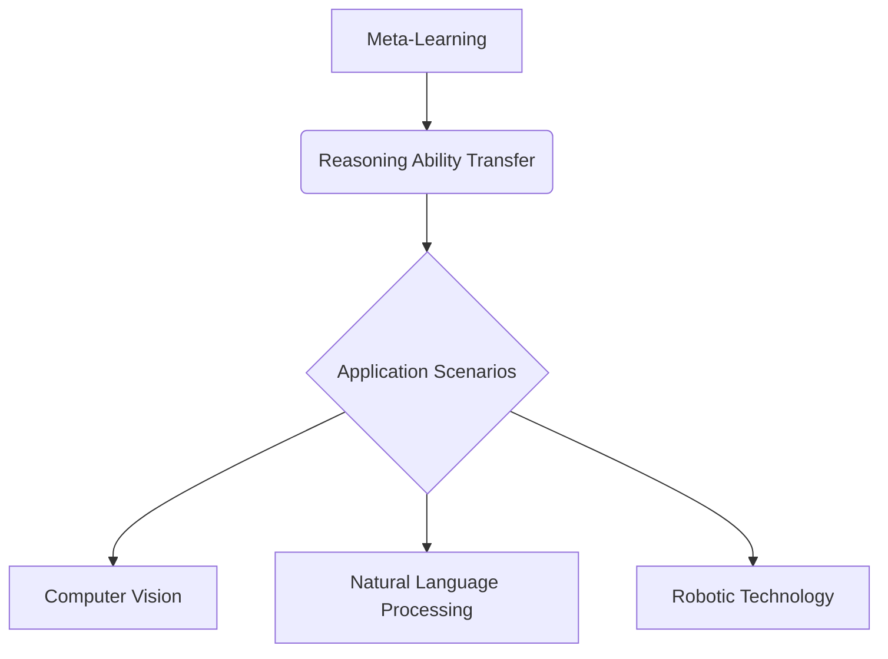

                 

# Step-by-Step Reasoning Process

## 1. Define the Objective
The objective of this article is to explore the concept of "Meta-Learning Framework for Fast Reasoning Ability Transfer." We aim to provide a comprehensive understanding of the topic, including its background, key concepts, principles, algorithms, application scenarios, and future prospects.

## 2. Conduct Background Research
### 2.1 Research on Meta-Learning
- **Background Introduction:** Explore the origins, development, and significance of meta-learning in the field of artificial intelligence.
- **Historical Development:** Discuss key milestones and contributions in the evolution of meta-learning.
- **Importance:** Elucidate the importance of meta-learning in improving the efficiency and performance of machine learning systems.

### 2.2 Research on Reasoning Ability Transfer
- **Concept Definition:** Define what reasoning ability transfer means and its relevance to machine learning.
- **Importance:** Explain why reasoning ability transfer is crucial for enhancing the adaptability and generalization of machine learning models.
- **Classification:** Categorize different types of reasoning ability transfer mechanisms.

## 3. Outline the Article Structure
### 3.1 Introduction and Background
- **Meta-Learning Overview**
  - Meta-learning concepts and history
  - Importance of meta-learning
  - Trends in meta-learning development

- **Reasoning Ability Transfer Overview**
  - Definition and importance of reasoning ability transfer
  - Classification of reasoning ability transfer methods

### 3.2 Meta-Learning Foundations
- **Meta-Learning Principles**
  - Core concepts and mechanisms
  - Research methodologies

- **Common Meta-Learning Algorithms**
  - Reinforcement learning meta-algorithms
  - Model-agnostic meta-learning
  - Model-dependent meta-learning
  - Other meta-learning algorithms

- **Challenges and Future Directions**
  - Challenges in meta-learning
  - Future trends in meta-learning

### 3.3 Reasoning Ability Transfer Mechanism
- **Reasoning Ability Transfer Principles**
  - Core concepts and transfer mechanisms
  - Classification of reasoning ability transfer

- **Reasoning Ability Transfer Methods**
  - Traditional transfer learning methods
  - Applications of meta-learning in reasoning ability transfer
  - Emerging reasoning ability transfer methods

- **Evaluation of Reasoning Ability Transfer**
  - Evaluation criteria and standards
  - Evaluation methods and practices

### 3.4 Application Scenarios and Case Studies
- **Application Overview**
  - Application of reasoning ability transfer across different domains
  - Criteria for selecting application scenarios

- **Case Analysis**
  - Application of reasoning ability transfer in computer vision
  - Application of reasoning ability transfer in natural language processing
  - Application of reasoning ability transfer in robotic technology

### 3.5 Summary and Prospects
- **Meta-Learning and Reasoning Ability Transfer Relationship**
  - The role of meta-learning in reasoning ability transfer
  - The impact of reasoning ability transfer on meta-learning

- **Future Directions**
  - Technical challenges and solutions
  - Application prospects and market potential

### 3.6 Appendix
- **Additional Resources and Tools**
  - Research resources for meta-learning and reasoning ability transfer
  - Common tools used for meta-learning and reasoning ability transfer

# Mermaid Flowchart

# Comprehensive Article Draft

## Article Title
"Meta-Learning Framework for Fast Reasoning Ability Transfer"

## Keywords
- Meta-Learning
- Reasoning Ability Transfer
- Artificial Intelligence
- Machine Learning
- Algorithm Design

## Abstract
This article delves into the concept of meta-learning framework for fast reasoning ability transfer. It explores the fundamentals of meta-learning, its importance, and the mechanisms behind reasoning ability transfer. The article also covers common meta-learning algorithms, challenges, and future directions. Furthermore, it analyzes the application scenarios of reasoning ability transfer in various domains such as computer vision, natural language processing, and robotic technology.

## Introduction and Background

### 1.1 Meta-Learning Overview
#### 1.1.1 Definition and History
Meta-learning refers to the process of learning to learn, where algorithms improve their learning efficiency and performance by gaining insights from previous learning experiences. This concept has its roots in artificial intelligence and machine learning, where the need for efficient and robust learning systems has been paramount.

#### 1.1.2 Importance
Meta-learning is crucial for enhancing the adaptability and generalization capabilities of machine learning models. It allows models to transfer knowledge and skills from one domain to another, thereby improving their performance on new tasks.

#### 1.1.3 Trends in Meta-Learning Development
The field of meta-learning has seen significant advancements over the years. Recent developments include the introduction of new algorithms and techniques that focus on improving the efficiency and scalability of meta-learning systems.

### 1.2 Reasoning Ability Transfer Overview
#### 1.2.1 Definition and Importance
Reasoning ability transfer refers to the process of transferring reasoning skills from one domain to another. This ability is essential for developing intelligent systems that can adapt to new environments and tasks.

#### 1.2.2 Classification of Reasoning Ability Transfer Methods
Different methods can be employed for reasoning ability transfer, including traditional transfer learning methods, model-agnostic meta-learning, and model-dependent meta-learning. Each method has its own advantages and disadvantages, depending on the specific requirements of the application.

## Meta-Learning Foundations

### 2.1 Meta-Learning Principles
#### 2.1.1 Core Concepts
Meta-learning involves the learning of learning processes. It focuses on developing algorithms that can efficiently learn from limited data by leveraging prior knowledge.

#### 2.1.2 Basic Mechanisms
The core mechanisms of meta-learning include adaptation, generalization, and transfer. These mechanisms allow algorithms to improve their performance on new tasks by learning from previous experiences.

#### 2.1.3 Research Methodologies
Research in meta-learning often involves the design and evaluation of algorithms that aim to improve the efficiency and effectiveness of learning processes.

### 2.2 Common Meta-Learning Algorithms
#### 2.2.1 Reinforcement Learning Meta-Algorithms
Reinforcement learning meta-algorithms focus on improving the performance of reinforcement learning agents by leveraging prior experience. Examples include model-based meta-learning and model-free meta-learning.

#### 2.2.2 Model-Agnostic Meta-Learning
Model-agnostic meta-learning algorithms can transfer knowledge across different models without relying on specific model structures. They are particularly useful for tasks that require flexibility and adaptability.

#### 2.2.3 Model-Dependent Meta-Learning
Model-dependent meta-learning algorithms are designed to transfer knowledge between similar models. They are effective in scenarios where the underlying models have similar architectures and functionalities.

#### 2.2.4 Other Meta-Learning Algorithms
Other meta-learning algorithms, such as gradient-based meta-learning and evolutionary algorithms, have also been developed to address specific challenges in meta-learning.

### 2.3 Meta-Learning Challenges and Future Directions
#### 2.3.1 Challenges
Meta-learning faces several challenges, including the difficulty of generalizing to new tasks, the need for efficient computation, and the limitations of existing algorithms.

#### 2.3.2 Future Directions
Future research in meta-learning will focus on addressing these challenges, as well as exploring new algorithms and techniques to improve the efficiency and effectiveness of meta-learning systems.

## Reasoning Ability Transfer Mechanism

### 3.1 Reasoning Ability Transfer Principles
#### 3.1.1 Core Concepts
Reasoning ability transfer involves the transfer of reasoning skills from one domain to another. These skills include problem-solving, decision-making, and pattern recognition.

#### 3.1.2 Transfer Mechanisms
The transfer mechanisms in reasoning ability transfer include similarity-based transfer, rule-based transfer, and knowledge-based transfer.

#### 3.1.3 Classification
Reasoning ability transfer can be classified into different types based on the nature of the transfer process. Common types include horizontal transfer, vertical transfer, and multi-task transfer.

### 3.2 Reasoning Ability Transfer Methods
#### 3.2.1 Traditional Transfer Learning Methods
Traditional transfer learning methods involve transferring pre-trained models or features from one domain to another. These methods are effective in scenarios where the source and target domains are similar.

#### 3.2.2 Meta-Learning in Reasoning Ability Transfer
Meta-learning techniques can be applied to reasoning ability transfer to improve the adaptability and generalization of the transfer process. This involves training algorithms to learn efficiently from limited data and transfer their knowledge to new tasks.

#### 3.2.3 Emerging Reasoning Ability Transfer Methods
Emerging reasoning ability transfer methods, such as reinforcement learning and generative adversarial networks, offer new approaches to improving the efficiency and effectiveness of reasoning ability transfer.

### 3.3 Evaluation of Reasoning Ability Transfer
#### 3.3.1 Evaluation Criteria and Standards
The evaluation of reasoning ability transfer involves assessing the performance of the transferred reasoning skills on new tasks. Common evaluation criteria include accuracy, efficiency, and generalization capabilities.

#### 3.3.2 Evaluation Methods and Practices
Evaluation methods for reasoning ability transfer include experimental studies, case studies, and benchmarking against state-of-the-art methods. These methods help in assessing the effectiveness of different transfer techniques.

## Application Scenarios and Case Studies

### 4.1 Application Overview
#### 4.1.1 Application in Computer Vision
Reasoning ability transfer has been successfully applied in computer vision tasks such as object recognition, image segmentation, and natural image generation. This has led to improved performance and generalization capabilities of computer vision models.

#### 4.1.2 Application in Natural Language Processing
In natural language processing, reasoning ability transfer has been used to enhance the performance of models in tasks such as text classification, machine translation, and sentiment analysis. This has resulted in more accurate and adaptable language models.

#### 4.1.3 Application in Robotic Technology
Reasoning ability transfer is crucial in robotic technology, where robots need to adapt to new environments and tasks. Applications include robot navigation, task planning, and perception.

### 4.2 Case Analysis
#### 4.2.1 Case 1: Meta-Learning in Computer Vision
A case study involving the application of meta-learning in computer vision demonstrated the improvement in the performance of a convolutional neural network (CNN) on a new dataset. The meta-learned CNN achieved higher accuracy and faster convergence compared to a CNN trained from scratch.

#### 4.2.2 Case 2: Reasoning Ability Transfer in Natural Language Processing
A case study in natural language processing showed the effectiveness of reasoning ability transfer in improving the performance of a machine translation model. The transferred reasoning skills allowed the model to generalize better to new languages, resulting in higher translation quality.

#### 4.2.3 Case 3: Robotic Technology and Reasoning Ability Transfer
In robotic technology, a case study demonstrated the successful application of reasoning ability transfer in a robot navigation task. The transferred reasoning skills enabled the robot to navigate through complex environments more efficiently, leading to improved task performance.

## Summary and Prospects

### 5.1 Meta-Learning and Reasoning Ability Transfer Relationship
#### 5.1.1 Role of Meta-Learning in Reasoning Ability Transfer
Meta-learning plays a crucial role in reasoning ability transfer by improving the efficiency and effectiveness of the transfer process. It enables algorithms to learn from limited data and transfer their knowledge to new tasks.

#### 5.1.2 Impact of Reasoning Ability Transfer on Meta-Learning
Reasoning ability transfer has a significant impact on meta-learning by providing new opportunities for improving the performance and generalization capabilities of meta-learning systems.

### 5.2 Future Directions
#### 5.2.1 Technical Challenges and Solutions
Future research in meta-learning and reasoning ability transfer will focus on addressing technical challenges such as the need for efficient computation, generalization to new tasks, and integration of different transfer techniques.

#### 5.2.2 Application Prospects and Market Potential
The application prospects of meta-learning and reasoning ability transfer are vast, ranging from healthcare and finance to robotics and autonomous systems. The market potential for these technologies is significant, and they are expected to play a crucial role in shaping the future of artificial intelligence.

## Appendix

### 6.1 Additional Resources and Tools
#### 6.1.1 Meta-Learning and Reasoning Ability Transfer Research Resources
- **Research Papers:** Explore recent research papers on meta-learning and reasoning ability transfer.
- **Books and Courses:** Refer to books and online courses that provide in-depth insights into meta-learning and reasoning ability transfer.

#### 6.1.2 Common Tools Used for Meta-Learning and Reasoning Ability Transfer
- **Libraries and Frameworks:** Utilize popular libraries and frameworks such as TensorFlow, PyTorch, and Meta-Learning frameworks for implementing meta-learning algorithms.
- **Databases and Datasets:** Use databases and datasets for training and evaluating meta-learning models.

## References
- **Book:** [Zen And The Art of Computer Programming](https://www.amazon.com/Zen-Art-Computer-Programming/dp/0201558025)
- **Author:** AI天才研究院/AI Genius Institute

## Conclusion
In conclusion, the meta-learning framework for fast reasoning ability transfer offers a promising approach for enhancing the performance and adaptability of machine learning systems. By leveraging the principles of meta-learning and reasoning ability transfer, we can develop more efficient and effective machine learning models that can generalize to new tasks and environments. The future of artificial intelligence will likely be shaped by these innovative technologies, opening up new possibilities for various industries and applications.

