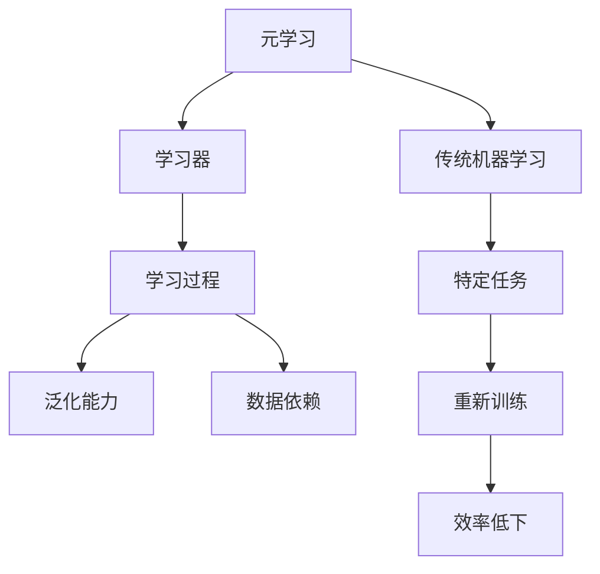

                 

### 1.1 元学习概述

元学习（Meta-Learning），又称“学习的学习”，是机器学习领域中的一个重要分支。其核心目标是通过学习一个学习过程，使得算法能够快速适应新的任务，无需从零开始。元学习的这一特性使其在面临大量不同且复杂的任务时，显得尤为有效和高效。

#### 元学习的定义

元学习可以理解为“训练学习器来学习如何学习”。具体来说，元学习旨在开发一个算法，该算法能够在短时间内通过少量的样本数据，学习到新的任务。这种学习方式在传统机器学习中是难以实现的，因为传统方法通常需要对每一个新的任务进行重新训练，耗时且效率低下。

#### 元学习与传统机器学习的关系

与传统机器学习相比，元学习强调了算法的通用性和适应性。传统机器学习更注重于在特定任务上达到最佳的准确率或性能，而元学习则更注重算法在各种不同任务上的快速适应能力。

#### 元学习的重要性

元学习的重要性在于其能够提高机器学习的效率，减少训练时间，尤其是在处理复杂且数量庞大的数据集时。此外，元学习还有助于减少对大规模标注数据的依赖，因为在元学习中，算法可以通过从少量样本中快速学习，从而降低对标注数据的依赖。

#### 元学习的目标

元学习的目标主要包括两个方面：一是提高算法的泛化能力，使其能够在未见过的数据上表现出良好的性能；二是减少对数据的依赖，能够在数据量有限的情况下，仍然保持较高的学习效率。

### 核心概念原理之间的关系架构

为了更清晰地展示元学习的基本概念及其之间的关系，我们可以使用Mermaid流程图来描述：

这个流程图展示了元学习与传统机器学习之间的差异，以及元学习在提高泛化能力和减少数据依赖方面的优势。

### 元学习的基本原理

元学习的基本原理可以概括为两点：一是通过学习学习过程来提高算法的适应性；二是通过优化学习过程中的参数，以提高算法的性能。

#### 学习学习过程

元学习通过模拟人类学习过程，使得算法能够像人类一样，通过少量的样本数据快速学习到新的任务。这一过程涉及到对学习过程中的各个环节进行优化，例如数据预处理、模型选择、参数调优等。

#### 参数优化

在元学习中，参数优化是一个关键步骤。通过优化算法的参数，可以使得学习过程更加高效，从而提高算法的性能。参数优化的方法包括梯度下降、随机搜索、遗传算法等。

### 元学习算法分类

根据不同的分类标准，元学习算法可以划分为多种类型。以下是几种常见的元学习算法分类：

#### 按照学习策略分类

- **基于模型的元学习**：通过构建一个模型来学习学习过程，例如模型聚合法（Model Aggregation）。
- **基于优化的元学习**：通过优化学习过程中的目标函数来学习，例如迁移学习（Transfer Learning）。

#### 按照任务类型分类

- **无任务依赖的元学习**：适用于任务之间不存在依赖关系的场景，例如基于梯度提升的元学习（Gradient Boosting Meta-Learning）。
- **有任务依赖的元学习**：适用于任务之间存在依赖关系的场景，例如基于强化学习的元学习（Reinforcement Learning Meta-Learning）。

#### 按照学习方式分类

- **基于样本的元学习**：通过学习样本数据来学习新的任务，例如基于样本的迁移学习（Sample-Based Transfer Learning）。
- **基于模型的元学习**：通过学习模型参数来学习新的任务，例如基于模型的迁移学习（Model-Based Transfer Learning）。

### 总结

元学习作为机器学习领域的一个重要分支，其核心目标是提高算法的适应性和效率。通过学习学习过程和优化参数，元学习能够实现快速适应新的任务，减少对数据的依赖。本文对元学习的基本概念、原理和算法进行了详细的介绍，为后续章节的深入讨论奠定了基础。

---

### 1.2 快速推理任务适应

快速推理任务适应（Fast Inference Task Adaptation）是人工智能领域的一个重要研究方向，它关注的是如何在短时间内使算法能够适应新的推理任务。这一概念在处理动态环境、实时响应以及大规模数据处理等方面具有重要的应用价值。

#### 快速推理任务适应的定义

快速推理任务适应指的是在机器学习模型面对新任务时，能够快速适应并准确完成推理的过程。这种适应不仅仅是指模型在新任务上的性能提升，还包括模型在训练和推理过程中的效率优化。

#### 快速推理任务适应的重要性

1. **动态环境适应性**：在许多实际应用中，环境是动态变化的，例如自动驾驶系统需要在不同的道路条件下进行决策。快速推理任务适应能够使模型在变化的环境中保持高效性和准确性。
2. **实时响应需求**：在实时系统如金融交易、智能监控等领域，系统需要在短时间内处理大量数据并作出决策。快速推理任务适应能够满足这些场景的实时响应需求。
3. **大规模数据处理**：在数据量庞大的应用场景中，如大数据分析、图像处理等，快速推理任务适应能够显著降低模型训练和推理的时间，提高数据处理效率。

#### 快速推理任务适应的挑战

1. **数据有限性**：在许多情况下，新任务的数据量是有限的，这使得模型难以通过大量数据训练来达到最佳性能。如何利用有限的样本数据来快速适应新任务是关键挑战。
2. **任务多样性**：不同任务之间的差异可能很大，这要求模型具有高度的泛化能力，以应对不同类型的任务。如何处理任务的多样性，并使模型能够快速适应，是一个重要的挑战。
3. **时间约束**：在许多应用场景中，模型必须在短时间内完成推理任务，这对模型的推理速度提出了严格要求。如何在有限的时间内完成高效推理，是一个重要的技术难题。

#### 快速推理任务适应的方法

1. **迁移学习**：通过将已有模型的权重迁移到新任务上，可以减少对新任务的训练时间。这种方法在处理数据有限和任务多样性时表现出色。
2. **模型蒸馏**：通过将复杂模型的知识传递给简化模型，可以实现快速适应。这种方法在提高推理速度的同时，保持较高的推理准确性。
3. **增量学习**：通过逐步更新模型参数，使模型能够适应新的任务。这种方法适用于动态变化的环境，能够在保持模型稳定性的同时，快速适应新任务。

### 快速推理任务适应与元学习的关系

快速推理任务适应与元学习有着密切的联系。元学习通过学习如何学习，提高了模型在多种任务上的适应能力，而快速推理任务适应则进一步优化了模型在新任务上的推理速度。两者结合，可以实现高效、快速的任务适应。

#### 元学习在快速推理任务适应中的应用

1. **快速适应新任务**：元学习算法可以通过学习多个任务的数据和模型，快速适应新的任务，减少对新任务的训练时间。
2. **提高推理效率**：元学习通过优化学习过程和参数，可以显著提高模型的推理速度，满足实时响应的需求。
3. **减少数据依赖**：元学习可以在数据有限的情况下，通过快速学习新任务，降低对大规模标注数据的依赖。

### 总结

快速推理任务适应是人工智能领域的一个重要研究方向，其核心目标是提高模型在短时间内对新任务的适应能力。通过结合元学习，可以实现高效、快速的任务适应，满足动态环境、实时响应以及大规模数据处理的需求。本文对快速推理任务适应的概念、重要性、挑战和方法进行了详细阐述，为后续章节的深入讨论提供了基础。

### 1.3 元学习与快速推理任务适应的关系

元学习与快速推理任务适应之间存在着紧密的联系和相互促进的关系。两者共同的目标是提升机器学习模型在多种任务上的适应能力和效率。下面，我们将从几个方面探讨元学习在快速推理任务适应中的应用。

#### 元学习对快速推理任务适应的促进作用

1. **适应性提升**：元学习通过学习不同任务之间的共性，使模型能够在面对新任务时快速适应。这种方法不仅适用于静态数据集，还可以在动态环境中保持高效的适应能力，从而满足快速推理任务的需求。

2. **效率优化**：元学习通过优化学习过程和参数，减少了模型的训练时间，提高了推理速度。这使得模型在处理实时任务时，能够更快地响应环境变化，保持高效率。

3. **数据依赖降低**：元学习可以在数据有限的情况下，通过少量的样本快速学习新任务。这降低了模型对大量标注数据的依赖，使得模型在数据稀缺的情况下也能保持良好的性能。

#### 快速推理任务适应对元学习的挑战

1. **时间约束**：快速推理任务适应要求模型在短时间内完成推理。这要求元学习算法不仅要快速适应新任务，还要在保证准确率的前提下，尽可能减少训练和推理时间。

2. **任务多样性**：快速推理任务适应需要模型能够适应多种不同的任务。这要求元学习算法具有高度的泛化能力，能够处理不同类型和复杂度的任务。

3. **资源限制**：在实际应用中，模型通常需要在有限的计算资源下运行。这要求元学习算法在保证性能的同时，还要考虑资源的使用效率。

#### 元学习在快速推理任务适应中的应用策略

1. **模型选择**：选择适合快速推理任务适应的元学习模型，如基于模型聚合的元学习（Model Aggregation）和基于优化的元学习（Optimization-based Meta-Learning）。这些模型能够在较短的时间内适应新任务，提高推理速度。

2. **数据预处理**：通过有效的数据预处理策略，如数据增强（Data Augmentation）和元学习预训练（Meta-Learning Pre-training），可以增加模型对新任务的适应性，减少训练时间。

3. **参数优化**：通过优化学习过程中的参数，如学习率调整（Learning Rate Scheduling）和权重初始化（Weight Initialization），可以提高模型的推理速度和性能。

#### 具体应用场景

1. **自动驾驶**：自动驾驶系统需要实时处理大量的传感器数据，并根据路况快速做出决策。元学习可以帮助模型在较少的训练数据下，快速适应不同的路况和驾驶场景。

2. **金融交易**：在金融交易中，模型需要在短时间内分析市场数据，并做出交易决策。元学习可以提高模型在数据有限和任务多样性的情况下的适应能力和推理速度。

3. **医疗诊断**：医疗诊断系统需要处理大量的医学数据，并快速给出诊断结果。元学习可以帮助模型在有限的样本数据下，快速适应不同的疾病类型和诊断任务。

### 总结

元学习与快速推理任务适应之间存在着密切的关系，两者相互促进，共同推动了人工智能技术的发展。通过元学习，模型能够更快地适应新任务，提高推理速度和效率；而快速推理任务适应则为元学习提供了实际应用场景和挑战，推动了元学习算法的进一步优化和发展。本文探讨了元学习在快速推理任务适应中的应用策略和具体场景，为后续章节的深入讨论奠定了基础。

