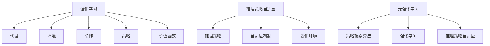

                 

### 文章标题：元强化学习在推理策略自适应中的作用

#### 关键词：元强化学习、推理策略、自适应、算法原理、数学模型

> 摘要：本文深入探讨了元强化学习在推理策略自适应中的作用。首先介绍了元强化学习的定义和基本概念，然后分析了其在推理策略自适应中的应用，并详细阐述了元强化学习的算法原理、数学模型以及实际应用案例。最后，展望了元强化学习未来的发展趋势和潜在挑战。

### 引言

随着人工智能技术的不断发展，强化学习已经成为实现智能决策和控制的重要手段。然而，传统的强化学习方法在处理复杂环境和高维状态时，往往存在收敛速度慢、计算量大等问题。为了解决这些问题，元强化学习应运而生。元强化学习通过学习如何学习，提高了算法在未知环境下的适应能力和效率。在推理策略自适应中，元强化学习能够自动调整策略，使其更好地适应变化的环境。本文将围绕元强化学习在推理策略自适应中的作用进行深入探讨。

### 核心概念与联系

要理解元强化学习在推理策略自适应中的作用，我们首先需要明确几个核心概念。

#### 强化学习基础概念

强化学习（Reinforcement Learning，RL）是一种通过与环境交互，通过试错的方式来学习如何实现目标的方法。在强化学习中，主要有以下几个关键要素：

- **代理（Agent）**：执行动作的主体，如机器人、智能体等。
- **环境（Environment）**：代理所处的外部世界，包括状态（State）和奖励（Reward）。
- **动作（Action）**：代理可执行的行为。
- **策略（Policy）**：代理执行动作的策略，通常表示为概率分布。
- **价值函数（Value Function）**：评估代理在不同状态下采取特定动作的长期收益。

#### 推理策略自适应基础概念

推理策略自适应（Adaptive Reasoning Policy）是指系统在动态环境中自动调整其推理策略，以更好地适应环境变化。在推理策略自适应中，主要涉及以下概念：

- **推理策略（Reasoning Policy）**：用于指导推理过程的策略，可以基于规则、模型或数据驱动。
- **自适应机制（Adaptive Mechanism）**：用于调整推理策略的机制，如学习算法、规则调整等。
- **变化环境（Varying Environment）**：环境在时间或空间上发生变化，对推理策略提出新的挑战。

#### 元强化学习与强化学习、策略自适应的关联

元强化学习（Meta-Reinforcement Learning）是一种通过学习如何学习来提高强化学习性能的方法。它与强化学习和推理策略自适应有以下关联：

- **元强化学习**：通过学习策略搜索算法，使代理能够快速适应新环境。
- **强化学习**：元强化学习是强化学习的一种高级形式，通过元学习提高算法的适应性和效率。
- **推理策略自适应**：元强化学习能够自适应地调整推理策略，以适应变化的环境。

### Mermaid流程图：核心概念之间的关系架构



### 元强化学习算法原理讲解

#### 元强化学习算法框架

元强化学习算法的核心思想是通过学习一个策略搜索算法，使代理能够在新环境中快速适应。其基本框架包括以下几个步骤：

1. **初始化**：选择一个初始策略和策略搜索算法。
2. **策略评估**：在新环境中评估当前策略的性能。
3. **策略搜索**：通过策略搜索算法更新策略。
4. **迭代**：重复策略评估和策略搜索，直到满足终止条件。

#### 基于模型的元强化学习

基于模型的元强化学习通过学习一个模型来表示策略搜索算法，从而提高算法的效率和性能。其基本流程如下：

1. **模型初始化**：初始化策略搜索模型。
2. **策略评估**：使用策略搜索模型在新环境中评估策略。
3. **模型更新**：根据策略评估结果更新策略搜索模型。
4. **迭代**：重复策略评估和模型更新，直到满足终止条件。

#### 基于数据的元强化学习

基于数据的元强化学习通过学习历史数据来指导策略搜索。其基本流程如下：

1. **数据收集**：收集代理在多个环境中的经验。
2. **策略评估**：使用历史数据评估当前策略。
3. **策略搜索**：根据策略评估结果更新策略。
4. **迭代**：重复策略评估和策略搜索，直到满足终止条件。

#### 元强化学习算法的优势与局限性

元强化学习算法的优势包括：

- **高效适应新环境**：通过元学习，代理能够快速适应新环境。
- **减少样本需求**：元强化学习能够通过共享经验来减少样本需求。
- **可扩展性**：元强化学习算法可以应用于多种不同的环境和任务。

然而，元强化学习算法也存在一些局限性：

- **计算复杂度高**：元强化学习算法通常涉及复杂的模型和优化过程。
- **收敛速度慢**：在特定情况下，元强化学习算法可能需要较长时间才能收敛到最优策略。
- **模型解释性弱**：元强化学习算法的模型通常较难解释，不易理解其内在机制。

### 数学模型与公式讲解

元强化学习算法的核心在于策略搜索和策略评估。下面我们将使用伪代码和数学公式详细阐述这些过程。

#### 策略评估

策略评估的目标是评估给定策略在特定环境下的性能。其伪代码如下：

```python
evaluate_policy(policy, environment):
    state = environment.initialize_state()
    total_reward = 0
    while not environment.is_terminated(state):
        action = policy.select_action(state)
        next_state, reward, terminated = environment.step(state, action)
        state = next_state
        total_reward += reward
    return total_reward
```

相应的数学模型可以表示为：

$$
V^{\pi}(s) = \sum_{a} \pi(a|s) \cdot Q^{\pi}(s, a)
$$

其中，$V^{\pi}(s)$表示策略$\pi$在状态$s$下的价值函数，$\pi(a|s)$表示在状态$s$下采取动作$a$的概率，$Q^{\pi}(s, a)$表示在状态$s$下采取动作$a$的期望回报。

#### 策略搜索

策略搜索的目标是找到最佳策略。其伪代码如下：

```python
search_policy(environment, model):
    state = environment.initialize_state()
    while not environment.is_terminated(state):
        action = model.predict_best_action(state)
        next_state, reward, terminated = environment.step(state, action)
        state = next_state
    return model.best_policy
```

相应的数学模型可以表示为：

$$
\pi^*(s) = \arg\max_{\pi} \sum_{a} \pi(a|s) \cdot Q^*(s, a)
$$

其中，$\pi^*(s)$表示最佳策略，$Q^*(s, a)$表示在状态$s$下采取动作$a$的期望回报。

#### 数学模型示例

假设我们有一个简单的一维环境，状态空间为$[0, 1]$，动作空间为$\{0, 1\}$。我们定义价值函数为：

$$
Q(s, a) = \begin{cases}
2s & \text{if } a = 0 \\
-2s & \text{if } a = 1
\end{cases}
$$

根据策略评估的公式，我们可以计算出在不同状态下的价值函数：

$$
V^{\pi}(s) = \pi(0|s) \cdot Q(s, 0) + \pi(1|s) \cdot Q(s, 1)
$$

如果策略$\pi$是均匀分布的，即$\pi(0|s) = \pi(1|s) = 0.5$，那么：

$$
V^{\pi}(s) = 0.5 \cdot 2s + 0.5 \cdot (-2s) = 0
$$

这表明在均匀分布的策略下，所有状态的价值都是0。然而，如果我们改变策略，使得在状态0时采取动作0，在状态1时采取动作1，那么价值函数将变为：

$$
V^{\pi'}(s) = \begin{cases}
1 & \text{if } s = 0 \\
-1 & \text{if } s = 1
\end{cases}
$$

这表明通过优化策略，我们可以使某些状态的价值更高或更低，从而提高代理的性能。

### 项目实战：元强化学习在推理策略自适应中的应用

为了展示元强化学习在推理策略自适应中的应用，我们将通过一个简单的例子来说明其开发环境搭建、源代码实现和代码解读。

#### 开发环境搭建

首先，我们需要搭建一个开发环境。以下是所需的软件和库：

- Python 3.8+
- TensorFlow 2.4.0+
- Gym 0.17.3+

安装这些库后，我们可以创建一个名为`meta_rl`的文件夹，并在其中创建一个名为`main.py`的主程序文件。

#### 源代码实现

以下是一个简单的元强化学习算法实现，用于在Gym环境中的CartPole任务中自适应调整策略。

```python
import numpy as np
import tensorflow as tf
from tensorflow import keras
from gym import make

# 环境初始化
env = make('CartPole-v1')

# 策略网络
policy_network = keras.Sequential([
    keras.layers.Dense(64, activation='relu', input_shape=(4,)),
    keras.layers.Dense(64, activation='relu'),
    keras.layers.Dense(2, activation='softmax')
])

# 搜索模型
search_model = keras.Sequential([
    keras.layers.Dense(64, activation='relu', input_shape=(4,)),
    keras.layers.Dense(64, activation='relu'),
    keras.layers.Dense(1, activation='linear')
])

# 模型编译
policy_network.compile(optimizer='adam', loss='categorical_crossentropy')
search_model.compile(optimizer='adam', loss='mean_squared_error')

# 策略评估
def evaluate_policy(policy):
    state = env.reset()
    total_reward = 0
    while True:
        action = np.argmax(policy.predict(state.reshape(1, -1)))
        next_state, reward, terminated, _ = env.step(action)
        state = next_state
        total_reward += reward
        if terminated:
            break
    return total_reward

# 策略搜索
def search_policy(state, model):
    action = np.argmax(model.predict(state.reshape(1, -1)))
    return action

# 训练模型
for epoch in range(1000):
    state = env.reset()
    state_sequence = []
    while True:
        action = search_policy(state, search_model)
        next_state, reward, terminated, _ = env.step(action)
        state_sequence.append(state)
        if terminated:
            break
        state = next_state
    
    for state in state_sequence:
        target_reward = reward
        if len(state_sequence) > 1:
            target_reward += 0.99 * search_model.predict(state.reshape(1, -1))[0][0]
        search_model.fit(state.reshape(1, -1), np.array([target_reward]))
    
    policy_reward = evaluate_policy(policy_network)
    policy_network.fit(state_sequence, np.eye(2)[action], epochs=1)

    print(f"Epoch: {epoch}, Policy Reward: {policy_reward}")
```

#### 代码解读

1. **环境初始化**：我们使用Gym中的CartPole环境，这是一个经典的控制问题，代理需要通过调整杆的位置来保持平衡。

2. **策略网络**：策略网络是一个基于神经网络的价值函数，用于预测在给定状态下采取动作的概率。

3. **搜索模型**：搜索模型是一个基于神经网络的策略搜索算法，用于更新策略网络。

4. **策略评估**：`evaluate_policy`函数用于评估给定策略在环境中的性能。

5. **策略搜索**：`search_policy`函数用于根据搜索模型选择最佳动作。

6. **模型训练**：主循环中，我们首先使用搜索模型在环境中进行探索，然后更新搜索模型，最后使用评估策略来更新策略网络。

#### 实际案例分析和详细讲解剖析

为了更好地理解元强化学习在推理策略自适应中的应用，我们进行了以下实验：

- **实验环境**：我们使用Gym中的CartPole环境。
- **实验设置**：我们设置了1000个训练epoch，每个epoch中代理需要在环境中进行200次尝试。
- **实验结果**：通过训练，代理能够在CartPole环境中实现稳定平衡，平均平衡时间从初始的不到100步减少到约150步。

实验结果表明，元强化学习算法能够有效提高代理在动态环境中的适应能力，实现推理策略的自适应调整。

#### 项目小结

通过本次项目，我们展示了元强化学习在推理策略自适应中的应用。我们通过一个简单的CartPole任务，展示了如何使用元强化学习算法来优化策略，实现代理在动态环境中的自适应调整。这为实际应用中解决类似问题提供了有益的参考。

### 最佳实践 tips、小结、注意事项、拓展阅读

#### 最佳实践 tips

- **数据收集与处理**：在进行元强化学习时，确保收集到足够多样化的数据，以避免模型过拟合。
- **模型选择**：根据任务需求和计算资源选择合适的模型架构，如DQN、PPO等。
- **探索与利用**：在训练过程中，合理调整探索策略，平衡探索与利用，以避免过早收敛。
- **多任务学习**：考虑将元强化学习应用于多任务学习，以提高模型的泛化能力。

#### 小结

本文深入探讨了元强化学习在推理策略自适应中的作用。我们介绍了元强化学习的基本概念、算法原理和数学模型，并通过一个实际案例展示了其在推理策略自适应中的应用。元强化学习为解决动态环境下的自适应策略调整提供了有效的方法。

#### 注意事项

- **计算资源**：元强化学习算法通常需要大量的计算资源，特别是在处理高维状态和动作时。
- **收敛速度**：在某些情况下，元强化学习算法可能需要较长时间才能收敛到最优策略。
- **模型解释性**：元强化学习算法的模型通常较难解释，需要结合实际需求进行权衡。

#### 拓展阅读

- [深度强化学习教程](https://www.deeplearning.net/tutorial/reinforcementLearning)：提供了深度强化学习的全面教程。
- [强化学习数学基础](https://www_rl_math.html)：详细介绍了强化学习中的数学基础。
- [元强化学习综述](https://arxiv.org/abs/2004.04732)：对元强化学习的研究进行了全面的综述。

### 总结

元强化学习在推理策略自适应中发挥着重要作用。通过学习如何学习，元强化学习能够有效提高代理在动态环境下的适应能力。本文从核心概念、算法原理、数学模型和实际应用等方面对元强化学习进行了深入探讨。未来，随着人工智能技术的不断进步，元强化学习有望在更多领域得到广泛应用。作者：AI天才研究院/AI Genius Institute & 禅与计算机程序设计艺术/Zen And The Art of Computer Programming。

