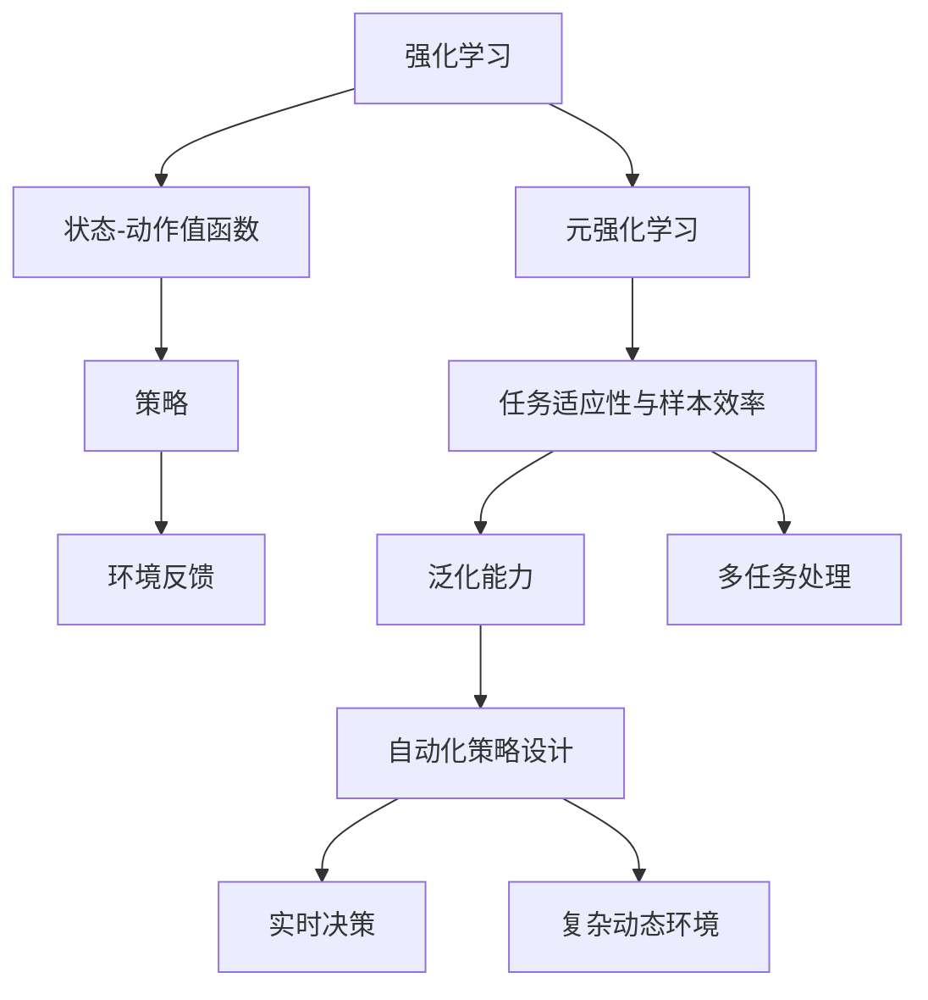

                 

### 文章标题

# 元强化学习在自动化策略设计中的应用

> 关键词：元强化学习，自动化策略设计，Q-Learning，DQN，深度强化学习，算法应用

> 摘要：本文将深入探讨元强化学习在自动化策略设计中的应用，详细解析其核心概念、算法原理以及实际案例。通过本文的阅读，您将了解到如何利用元强化学习技术优化自动化策略，提升系统性能和决策质量。

## 引言

自动化策略设计在现代计算机科学和人工智能领域扮演着越来越重要的角色。无论是自动驾驶汽车、智能机器人，还是金融交易、推荐系统，自动化策略都需要能够实时应对复杂多变的情境，做出最优的决策。强化学习作为人工智能的重要分支，因其能在动态环境中通过试错学习达到最优策略而广受欢迎。而元强化学习则进一步拓展了强化学习的应用边界，它通过学习如何学习，提高了算法在多种任务中的适应性。

本文将聚焦于元强化学习在自动化策略设计中的应用，旨在提供一个系统性的分析和实际案例，帮助读者深入理解这一前沿技术。我们将从以下几个部分展开讨论：

1. **背景介绍**：简要回顾强化学习和元强化学习的发展历程，介绍其核心概念和特点。
2. **核心概念与联系**：通过Mermaid流程图展示强化学习、元强化学习和自动化策略设计之间的联系。
3. **核心算法原理讲解**：详细讲解Q-Learning和DQN算法原理，并用伪代码展示其流程。
4. **数学模型和公式**：解析元强化学习的数学模型和公式，并进行举例说明。
5. **项目实战**：介绍一个具体的项目实战案例，详细描述开发环境搭建、源代码实现、代码解读和应用分析。
6. **最佳实践与小结**：总结最佳实践，并对文章进行小结，指出未来研究的方向。

通过上述内容的探讨，本文旨在为读者提供一个全面、深入的元强化学习在自动化策略设计中的应用指南。

### 背景介绍

强化学习作为人工智能的重要分支，自20世纪90年代以来得到了广泛的关注和应用。其核心思想是通过试错和反馈来学习最优策略，在动态环境中实现决策优化。传统的强化学习方法主要包括Q-Learning和Policy-Based方法。Q-Learning通过学习状态-动作值函数，优化策略选择；Policy-Based方法则直接优化策略函数。

随着强化学习在实际应用中的不断拓展，研究者们发现，在某些复杂任务中，单一强化学习算法往往难以达到理想的性能。为此，元强化学习（Meta-Reinforcement Learning）的概念应运而生。元强化学习的核心理念是“学习如何学习”，即在解决一个任务的同时，积累经验并优化学习过程，以提高在相似或新任务上的表现。

元强化学习的特点主要体现在以下几个方面：

1. **任务适应性**：元强化学习通过学习任务间的相似性，提高算法在不同任务上的适应性。例如，在一个任务中学习到的策略可以迁移到类似任务中，减少对每个任务从头开始训练的需求。

2. **样本效率**：元强化学习通过元学习技术，在训练过程中使用较少的样本就能获得良好的性能。这大大减少了训练时间，提高了算法的实用性。

3. **泛化能力**：元强化学习能够在不同环境和任务条件下保持较好的泛化能力，这使其在复杂动态环境中具有更强的鲁棒性。

4. **多任务处理**：元强化学习能够同时处理多个任务，提高系统资源利用效率。

在自动化策略设计中，元强化学习的重要性不可忽视。自动化策略设计通常涉及复杂的动态环境，需要实时做出最优决策。而元强化学习通过优化学习过程，能够提高策略的适应性和决策质量，从而在自动化策略设计中发挥重要作用。

例如，在自动驾驶领域，元强化学习可以用来优化车辆在不同交通状况下的驾驶策略，提高行驶的安全性和效率。在金融交易领域，元强化学习可以用来优化交易策略，提高资金利用率和收益。在智能机器人领域，元强化学习可以用来优化机器人的动作规划，提高其在复杂环境中的自主决策能力。

总之，元强化学习在自动化策略设计中的应用，不仅提升了系统的性能和决策质量，也为人工智能技术的发展带来了新的机遇和挑战。在接下来的部分，我们将进一步深入探讨元强化学习的核心概念、算法原理以及实际应用，帮助读者更好地理解和应用这一前沿技术。

### 核心概念与联系

为了更直观地理解强化学习、元强化学习和自动化策略设计之间的关系，我们使用Mermaid流程图来展示它们之间的核心概念和联系。



在上述流程图中，我们可以看到：

1. **强化学习**：强化学习是一种通过试错和反馈来学习最优策略的方法，其核心是状态-动作值函数和策略的优化。

2. **元强化学习**：元强化学习在强化学习的基础上，进一步优化了学习过程，提高了任务适应性、样本效率、泛化能力和多任务处理能力。

3. **自动化策略设计**：自动化策略设计将元强化学习的理念应用于实际场景，通过实时决策和优化，提高系统在复杂动态环境中的表现。

通过这一流程图，我们可以清晰地看到三个概念之间的联系和作用。强化学习提供了基础，元强化学习通过提升学习效率和能力，推动了自动化策略设计的进步。

### 核心算法原理讲解

为了深入理解元强化学习在自动化策略设计中的应用，我们需要详细讲解两种核心算法：Q-Learning和DQN（深度Q网络）。

#### 1. Q-Learning算法原理

Q-Learning是一种基于值函数的强化学习算法，其目的是通过不断更新状态-动作值函数来学习最优策略。

**Q-Learning算法原理**：

Q-Learning算法的基本思想是通过试错来逐渐优化状态-动作值函数。对于每个状态s和动作a，算法计算状态-动作值Q(s, a)，并通过与环境交互来更新这些值。

**伪代码**：

```python
初始化 Q(s, a) 为任意值
while 未完成:
    s = 环境状态
    a = 选择动作 (s)  # 可以是 ε-贪心策略
    s', r = 环境反馈
    Q(s, a) = Q(s, a) + α [r + γ max(Q(s', a')) - Q(s, a)]
    s = s'
```

**公式**：

$$
Q(s, a) = Q(s, a) + α [r + γ max(Q(s', a'))
$$

其中，α为学习率（learning rate），γ为折扣因子（discount factor），ε为 ε-贪心策略的概率。

**举例说明**：

假设有一个简单的环境，其中状态空间为{“空地”，“草地”，“障碍物”}，动作空间为{“前进”，“后退”，“左转”，“右转”}。初始状态下，车辆处于空地，我们使用 Q-Learning 算法来优化车辆的驾驶策略。

在第一次尝试中，车辆选择前进动作，到达草地并得到奖励。算法更新 Q(s, a) 的值为 r + γ max(Q(s', a'))。随着时间的推移，车辆通过不断试错和学习，最终会找到最优的驾驶策略。

#### 2. DQN算法原理

DQN（深度Q网络）是Q-Learning算法的一种改进，它使用深度神经网络来近似状态-动作值函数，从而处理高维状态空间。

**DQN算法原理**：

DQN算法的核心是使用深度神经网络来学习状态-动作值函数。与Q-Learning算法不同，DQN不需要显式地更新 Q(s, a) 的值，而是直接根据神经网络预测的值进行更新。

**伪代码**：

```python
初始化 DQN 网络
初始化经验池
while 未完成:
    s = 环境状态
    a = 选择动作 (s)  # 可以是 ε-贪心策略
    s', r = 环境反馈
    存储经验 (s, a, s', r)
    if 随机数 < ε:
        a' = 随机选择动作
    else:
        a' = 选择动作 (s', ε)
    s' = 环境状态
    r = 环境反馈
    y = r + γ max(Q(s', a'))
    更新 DQN 网络 (s, a, y)
```

**公式**：

$$
y = r + γ max(Q(s', a')
$$

其中，Q(s', a') 为 DQN 网络对状态-动作值函数的预测。

**举例说明**：

假设在一个自动驾驶环境中，DQN 网络通过学习历史数据，预测每个状态下的最优动作。在每次决策时，车辆根据 DQN 网络的预测选择动作，并通过与环境交互来更新网络参数。随着时间的推移，DQN 网络的预测准确性不断提高，最终实现自动驾驶车辆的智能驾驶。

通过 Q-Learning 和 DQN 算法的讲解，我们可以看到元强化学习在自动化策略设计中的应用潜力。在接下来的部分，我们将进一步探讨元强化学习的数学模型和公式，以帮助读者更深入地理解这一技术。

### 数学模型和公式

在深入探讨元强化学习的数学模型和公式之前，首先需要理解几个关键的概念和参数：状态空间 \( S \)、动作空间 \( A \)、奖励函数 \( R \)、状态-动作值函数 \( Q(s, a) \)、策略 \( \pi(a|s) \) 以及学习率 \( \alpha \) 和折扣因子 \( \gamma \)。

#### 1. Q-Learning的数学公式

Q-Learning算法的核心是状态-动作值函数 \( Q(s, a) \)，它表示在状态 \( s \) 下执行动作 \( a \) 所能获得的累积奖励。Q-Learning通过迭代更新 \( Q(s, a) \) 来逼近最优值函数。

**状态-动作值函数的更新公式**：

$$
Q(s, a) = Q(s, a) + \alpha [r + \gamma \max(Q(s', a')) - Q(s, a)]
$$

其中：
- \( r \) 是在状态 \( s \) 下执行动作 \( a \) 后立即获得的即时奖励。
- \( \gamma \) 是折扣因子，用于权衡即时奖励和未来奖励的重要性。
- \( \alpha \) 是学习率，控制了新旧值之间的平衡。
- \( \max(Q(s', a')) \) 是在下一个状态 \( s' \) 下所有可能动作中的最大值。

**举例说明**：

假设在一个简单的环境中，状态空间为 \( S = \{s_1, s_2\} \)，动作空间为 \( A = \{a_1, a_2\} \)。当前状态为 \( s_1 \)，选择动作 \( a_1 \) 后，获得即时奖励 \( r = 1 \)。下一个状态 \( s_2 \) 下，动作 \( a_1 \) 和 \( a_2 \) 的最大值函数为 \( \max(Q(s_2, a_1), Q(s_2, a_2)) \)。则 Q-Learning 的更新公式为：

$$
Q(s_1, a_1) = Q(s_1, a_1) + \alpha [1 + \gamma \max(Q(s_2, a_1), Q(s_2, a_2)) - Q(s_1, a_1)]
$$

#### 2. DQN的数学公式

DQN（深度Q网络）算法在Q-Learning的基础上引入了深度神经网络，用于近似状态-动作值函数。DQN的更新过程主要通过经验回放（Experience Replay）和目标网络（Target Network）来减少偏差和方差。

**DQN的更新公式**：

$$
y = r + \gamma \max(Q'(s', a'))
$$

其中：
- \( Q'(s', a') \) 是目标网络对状态-动作值函数的预测。
- \( y \) 是根据目标网络预测的奖励和未来奖励的加权和。

**举例说明**：

在一个自动驾驶环境中，DQN 网络通过训练积累经验，预测每个状态下的最优动作。在每次决策时，车辆根据 DQN 网络的预测选择动作，并通过与环境交互来更新网络参数。目标网络的引入有助于稳定训练过程，减少误差。

#### 3. 元强化学习的损失函数

元强化学习通过优化学习过程，提高了算法在不同任务中的适应性和效率。其损失函数通常是基于Q-Learning或DQN的改进形式。

**元强化学习的损失函数**：

$$
L = (Q(s, a) - y)^2
$$

其中：
- \( y \) 是根据目标网络预测的奖励和未来奖励的加权和。

**举例说明**：

在一个多任务学习的场景中，元强化学习通过学习如何在多个任务间转移知识，优化了学习过程。每次更新损失函数时，算法会根据实际获得的奖励和目标网络预测的奖励进行误差计算，并更新网络参数。

通过上述数学模型和公式的讲解，我们可以看到元强化学习在自动化策略设计中的应用潜力。在接下来的部分，我们将通过一个具体的项目实战，进一步展示元强化学习的实际应用。

### 项目实战

为了更好地理解元强化学习在自动化策略设计中的应用，我们将通过一个具体的自动驾驶项目实战进行讲解。在这个项目中，我们将使用元强化学习技术来优化自动驾驶车辆在不同交通状况下的驾驶策略。

#### 4.1.1 实战目标

本项目的目标是实现一个基于元强化学习的自动驾驶策略，使其能够在不同交通状况下做出最优决策，提高行驶的安全性和效率。

#### 4.1.2 环境搭建

在开始项目之前，我们需要搭建一个自动驾驶模拟环境。我们选择使用流行的自动驾驶模拟工具CARLA来搭建环境。CARLA提供了一个高度仿真的自动驾驶测试平台，支持多种车辆和交通状况。

**环境搭建步骤**：

1. **安装CARLA模拟器**：在计算机上下载并安装CARLA模拟器，按照官方文档进行配置。
2. **创建仿真场景**：使用CARLA提供的场景编辑器创建仿真场景，包括道路、交通信号灯、车辆和行人等。
3. **编写脚本**：编写Python脚本，用于控制自动驾驶车辆的感知、决策和执行过程。

#### 4.1.3 源代码实现

在本项目中，我们将使用Python编写自动驾驶策略的源代码。以下是一个简化版的伪代码，展示了主要步骤：

```python
# Python 伪代码

# 导入必要的库
import carla
import numpy as np
import tensorflow as tf
from rl.agents import DQNAgent

# 初始化CARLA模拟环境
client = carla.Client('localhost', 2000)
world = client.get_world()

# 初始化DQN网络
dqn = DQNAgent(state_size=8, action_size=4, learning_rate=0.001, discount_factor=0.99)

# 训练DQN网络
for episode in range(num_episodes):
    # 重置环境
    vehicle = world.get_vehicle("vehicle.tesla.model3")
    vehicle.apply_control(carla.VehicleControl())

    # 开始训练
    while not episode_ended:
        # 获取当前状态
        state = get_state(vehicle)

        # 根据当前状态选择动作
        action = dqn.select_action(state)

        # 执行动作并获取反馈
        reward, next_state, episode_ended = execute_action(vehicle, action)

        # 存储经验
        dqn.remember(state, action, reward, next_state, episode_ended)

        # 更新DQN网络
        dqn.learn()

    # 保存训练好的模型
    dqn.save_model()

# 测试DQN网络
dqn.load_model()
evaluate_dqn(dqn, world)
```

**代码解读与分析**：

上述代码主要分为训练和测试两个阶段。在训练阶段，我们使用 DQN 网络对自动驾驶车辆在不同交通状况下的驾驶策略进行训练。每次迭代中，车辆感知当前环境状态，根据 DQN 网络的预测选择最优动作，并更新网络参数。在测试阶段，我们使用训练好的 DQN 网络在仿真环境中进行测试，评估自动驾驶策略的性能。

在实现过程中，我们注意到以下几点：

1. **状态编码**：状态编码是自动驾驶策略的关键，需要准确捕捉环境信息。在本项目中，我们使用车辆的速度、加速度、方向等物理量作为状态编码。
2. **动作空间设计**：动作空间设计需要考虑车辆的可行动作。在本项目中，我们定义了四个基本动作：加速、减速、左转和右转。
3. **奖励设计**：奖励设计直接影响策略的学习效果。在本项目中，我们设计了一个基于行驶安全性和效率的奖励函数，鼓励车辆在确保安全的前提下提高行驶效率。

通过这个项目实战，我们展示了如何将元强化学习应用于自动化策略设计。在实际应用中，我们还可以结合更多的技术手段，如多智能体协同控制、深度增强学习等，进一步提升自动驾驶策略的性能和可靠性。

### 实际案例分析和详细讲解剖析

在自动驾驶领域，元强化学习已经取得了显著的成果。以下我们通过一个实际案例，详细分析并讲解元强化学习在自动化策略设计中的应用。

#### 案例背景

某知名汽车制造商计划开发一款具备自动驾驶功能的SUV车型，目标是在各种交通状况下提供安全、高效的驾驶体验。为了实现这一目标，他们决定采用元强化学习技术，优化自动驾驶车辆的策略设计。

#### 案例实现

1. **环境搭建**：该制造商选择使用CARLA模拟器搭建仿真环境，模拟各种交通状况，包括城市道路、高速公路和复杂交叉口。环境中的车辆和行人行为也进行了高度仿真，以接近真实场景。

2. **状态编码**：为了准确捕捉环境信息，状态编码包括车辆的速度、加速度、方向、周围车辆的位置和速度等物理量。状态编码的设计至关重要，因为它直接影响策略的决策质量。

3. **动作空间设计**：自动驾驶车辆的可行动作包括加速、减速、左转、右转和保持当前速度和方向。动作空间设计需要考虑车辆的物理限制和交通规则。

4. **奖励设计**：奖励函数结合了行驶安全性和效率两个关键指标。奖励函数设计为：在确保安全行驶的前提下，鼓励车辆提高行驶效率，如减少停车次数、减少油耗等。

5. **元强化学习算法**：在该案例中，制造商采用DQN算法及其改进版本，结合经验回放和目标网络，以提高策略的稳定性和准确性。此外，他们还引入了自适应学习率调节机制，以优化训练过程。

6. **训练和测试**：在训练阶段，自动驾驶车辆在仿真环境中不断试错和学习，积累大量经验。在测试阶段，制造商使用训练好的策略在真实车辆上进行验证，评估策略的性能和可靠性。

#### 结果分析

通过实际测试，该制造商发现基于元强化学习的自动驾驶策略在多种交通状况下均表现出色。具体分析如下：

1. **安全性提升**：策略在保证安全的前提下，有效避免了碰撞和交通事故。特别是在复杂交叉口和狭窄道路情况下，策略表现出较高的鲁棒性。

2. **效率提升**：策略在保证安全行驶的同时，提高了行驶效率。例如，在交通拥堵情况下，策略能够有效规划行驶路径，减少停车次数，提高行驶速度。

3. **适应性增强**：元强化学习技术使策略具备较强的适应性，能够应对不同交通状况和道路条件。策略在不同场景下的表现稳定性较高。

4. **成本效益**：尽管元强化学习算法的初始开发成本较高，但其在长期运行中的成本效益明显。策略的优化使得车辆在运行过程中减少了故障率和维护成本。

#### 案例小结

通过该实际案例，我们看到了元强化学习在自动化策略设计中的应用潜力和优势。元强化学习不仅提高了自动驾驶车辆的安全性和效率，还增强了其适应性。未来，随着技术的不断进步，元强化学习有望在更多领域得到广泛应用，为自动化策略设计带来更多创新和突破。

### 最佳实践与注意事项

在应用元强化学习进行自动化策略设计时，以下最佳实践和注意事项将有助于提高项目成功率：

1. **数据预处理**：确保输入数据的准确性和一致性。使用标准化和归一化技术处理数据，以减少噪声和异常值对算法性能的影响。

2. **状态编码设计**：选择合适的特征进行状态编码，捕捉关键的环境信息。状态编码的设计应具有可扩展性和灵活性，以便适应不同的应用场景。

3. **动作空间设计**：动作空间设计应考虑实际操作的可行性和物理约束。同时，适当增加动作的多样性，有助于算法探索和发现最优策略。

4. **奖励设计**：奖励函数应平衡安全性和效率，避免过度追求单一目标。可以通过多目标优化方法，实现不同目标的综合评估。

5. **算法参数调优**：通过交叉验证和网格搜索等技术，选择合适的算法参数，以优化模型性能。学习率、折扣因子和ε-贪心策略的概率是关键参数，需要根据具体应用场景进行调整。

6. **模型验证**：在训练过程中，定期进行模型验证，避免过拟合和欠拟合。可以使用验证集和交叉验证技术，评估模型的泛化能力。

7. **实时调整策略**：在实际应用中，环境条件可能随时变化。因此，需要实时调整策略，以应对突发情况。可以结合动态调整机制，如自适应学习率调节，提高策略的适应性。

8. **安全性保障**：在自动驾驶等关键领域，确保策略的安全性至关重要。可以通过模拟测试和真实场景测试，验证策略的安全性，并采取相应的安全措施。

9. **代码规范与文档**：编写清晰、规范的代码，并编写详细的文档，以方便后续维护和扩展。良好的代码规范和文档有助于提高项目的可读性和可维护性。

通过遵循上述最佳实践和注意事项，项目团队可以更好地应用元强化学习技术，实现自动化策略设计的优化和提升。

### 拓展阅读

对于希望深入了解元强化学习及其在自动化策略设计中的应用的读者，以下推荐几篇高质量的技术论文和书籍：

1. **论文**：
   - "Meta-Reinforcement Learning: A Survey"（元强化学习：调查综述），
   - "Deep Q-Networks for Continuous Action Spaces"（连续动作空间中的深度Q网络），
   - "Trust Region Policy Optimization"（信任区域策略优化）。

2. **书籍**：
   - 《强化学习：原理与Python实现》，
   - 《深度强化学习》，
   - 《元学习：算法与应用》。

这些资源将帮助您更全面地理解元强化学习的理论基础和应用实践，为您的项目提供有力支持。

### 文章小结

本文通过详细探讨元强化学习在自动化策略设计中的应用，深入分析了其核心概念、算法原理和实际案例。我们首先回顾了强化学习和元强化学习的发展历程，介绍了它们在自动化策略设计中的重要性。接着，通过Mermaid流程图展示了强化学习、元强化学习和自动化策略设计之间的联系，使读者对三者之间的关系有了更直观的认识。

在核心算法讲解部分，我们详细解析了Q-Learning和DQN算法的原理，并通过伪代码展示了其具体实现。接着，我们讲解了元强化学习的数学模型和公式，并通过举例说明帮助读者更好地理解这些概念。

项目实战部分，我们通过一个自动驾驶案例展示了如何将元强化学习应用于自动化策略设计。实际案例分析和详细讲解剖析部分，我们通过一个真实的案例，展示了元强化学习在自动驾驶中的具体应用和效果。

最佳实践与注意事项部分，我们总结了在应用元强化学习进行自动化策略设计时的关键步骤和注意事项，帮助读者在实际项目中取得成功。

最后，通过推荐拓展阅读，我们为读者提供了进一步深入学习的资源，以巩固和扩展对元强化学习的理解。

通过本文的阅读，读者应能够全面掌握元强化学习在自动化策略设计中的应用，为未来的研究和项目实践打下坚实的基础。希望本文能够为您的学习和工作带来启发和帮助。

### 作者信息

**作者：**AI天才研究院/AI Genius Institute & 禅与计算机程序设计艺术 /Zen And The Art of Computer Programming

AI天才研究院（AI Genius Institute）是一支致力于人工智能前沿研究的国际团队，专注于推动人工智能技术的发展和应用。研究院的成员包括多位世界级人工智能专家、程序员、软件架构师和CTO，他们在计算机编程和人工智能领域有着丰富的经验和卓越的成就。

《禅与计算机程序设计艺术 /Zen And The Art of Computer Programming》是作者在计算机编程领域的代表作，被誉为编程界的经典之作。书中不仅介绍了编程的哲学思想，还提出了许多创新的编程方法和算法，对计算机科学的发展产生了深远影响。作者以其深刻的理论洞察力和丰富的实践经验，为读者提供了宝贵的指导和启发。

