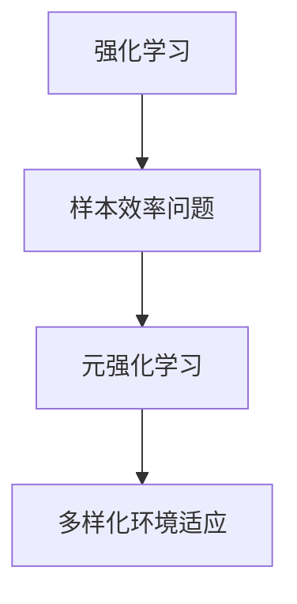
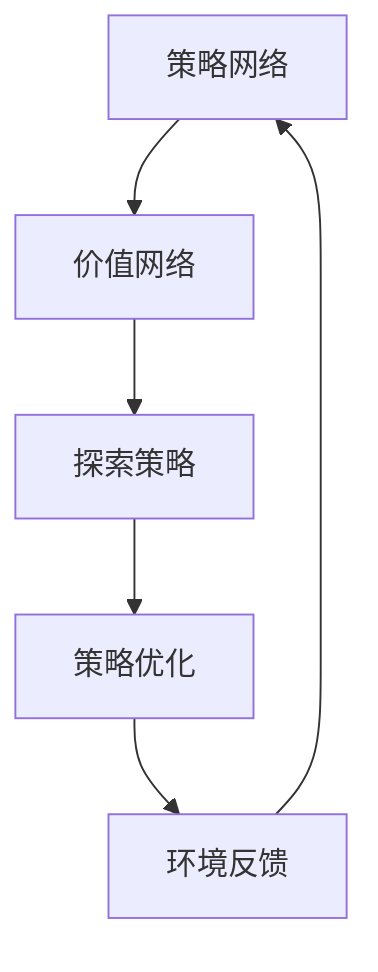

                 

## 文章标题

# 元强化学习在自适应推理策略优化中的应用

> 关键词：元强化学习、自适应推理、策略优化、算法、应用

> 摘要：本文深入探讨了元强化学习在自适应推理策略优化中的应用。通过分析元强化学习的理论基础和核心算法，本文展示了如何在复杂动态环境中利用元强化学习实现高效的策略优化。文章进一步通过具体项目实战，详细解析了元强化学习在自动驾驶和智能推荐系统中的应用，为相关领域的开发提供了宝贵的实践指导。

---

## 第一部分：元强化学习的理论基础

### 第1章：元强化学习概述

#### 1.1 元强化学习的定义与特点

元强化学习（Meta-Reinforcement Learning）是一种能够从经验中学习策略的通用方法。与传统强化学习不同，元强化学习旨在构建一个策略搜索器，该搜索器能够利用在不同环境中的经验来快速适应新的环境。其核心目标是提高策略的泛化能力，从而在多样化的环境中实现高效的决策。

**定义**：元强化学习是一种能够从经验中学习策略的通用方法，其目标是在一个多样化的环境中自动发现策略的适应机制。

**特点**：

1. **灵活性**：元强化学习能够根据不同环境的特点，动态调整策略，从而提高决策的适应性。
2. **高效性**：通过迁移学习，元强化学习能够在较少的经验下快速适应新的环境，提高策略搜索的效率。
3. **通用性**：元强化学习适用于各种复杂动态环境，能够解决传统强化学习在特定环境下训练困难的问题。

#### 1.2 元强化学习的发展历程

元强化学习的发展可以追溯到20世纪90年代，当时研究者们开始关注如何提高强化学习算法的样本效率。随着深度学习和迁移学习技术的发展，元强化学习逐渐成为人工智能领域的研究热点。

**早期探索**：元强化学习的早期研究主要集中在解决传统强化学习中的样本效率问题，例如通过模拟环境、经验重放等技术来提高策略学习的效率。

**近期进展**：近年来，随着深度强化学习技术的发展，元强化学习的研究取得了显著的进展。研究者们提出了许多基于模型和无模型的元强化学习算法，如Model-Based Meta-Reinforcement Learning（MBMRL）和Model-Agnostic Meta-Reinforcement Learning（MAML）等。这些算法通过学习通用策略，实现了在多样化环境中的高效决策。

### 第2章：核心概念与联系

#### 2.1 强化学习与元强化学习的关系

强化学习（Reinforcement Learning，RL）是机器学习的一个重要分支，其核心思想是通过试错学习，从环境中获取奖励信号，不断调整策略，以实现最大化长期奖励的目标。

**关系图**：

使用Mermaid流程图可以直观地展示强化学习到元强化学习的演进路径。



**关键联系**：元强化学习通过探索-利用策略，解决了强化学习中的样本效率问题。在强化学习中，探索（Exploration）和利用（Exploitation）是两个核心概念。探索是指选择尚未尝试过的动作，以获取更多关于环境的经验；利用则是在已有经验的基础上，选择能够带来最大奖励的动作。元强化学习通过在多个环境中进行预训练，建立了通用的策略搜索器，从而在新的环境中能够快速进行探索和利用，实现高效的决策。

#### 2.2 元强化学习的架构

元强化学习系统通常包括多个子模块，如策略网络、价值网络和探索策略。这些模块相互协作，共同实现策略的搜索和优化。

**定义**：元强化学习系统是一种由多个子模块组成的复杂系统，包括策略网络、价值网络和探索策略等。

**架构图**：

使用Mermaid流程图可以直观地展示元强化学习系统的整体架构。



**角色**：

1. **策略网络**：策略网络是元强化学习系统的核心模块，其目标是学习一个能够适应多样化环境的通用策略。
2. **价值网络**：价值网络用于评估策略在不同环境中的表现，提供反馈信号，以指导策略的优化。
3. **探索策略**：探索策略用于在新的环境中进行探索，获取更多的经验，以提高策略的适应性。
4. **策略优化**：策略优化模块通过结合策略网络、价值网络和探索策略，不断调整策略，以实现最大化长期奖励的目标。
5. **环境反馈**：环境反馈模块用于提供环境状态和奖励信号，以指导策略的调整和优化。

### 第3章：核心算法原理讲解

#### 3.1 模型无关的元强化学习算法

模型无关的元强化学习算法（Model-Agnostic Meta-Reinforcement Learning，MAML）是一种不依赖于特定环境模型的元强化学习算法。其核心思想是通过在多个环境中快速调整参数，构建一个通用的策略搜索器。

**定义**：模型无关的元强化学习算法是一种不依赖于特定环境模型的元强化学习算法，其目标是构建一个能够快速适应多样化环境的通用策略。

**算法讲解**：

MAML算法的主要步骤如下：

1. **初始化**：随机初始化策略参数θ。
2. **预训练**：在多个环境中对策略参数进行预训练，以提高策略的泛化能力。具体步骤如下：
   - 对于每个环境e，随机采样一个初始状态s，执行k步动作序列，记录奖励r和状态转移s'。
   - 更新策略参数θ，使其能够最大化预训练过程中的平均奖励。
3. **迁移测试**：将预训练好的策略参数θ迁移到新的环境中，进行测试。具体步骤如下：
   - 在新的环境中随机采样一个初始状态s，执行动作序列，记录奖励r和状态转移s'。
   - 评估策略在新的环境中的表现，计算测试过程中的平均奖励。

**伪代码**：

```python
def maml_init():
    # 初始化策略参数
    theta = random_init_params()
    return theta

def maml_pretrain(theta, environments, num_epochs):
    # 预训练策略参数
    for epoch in range(num_epochs):
        for environment in environments:
            state, reward, next_state = sample_trajectory(environment)
            theta = update_params(theta, state, reward, next_state)
    return theta

def maml_test(theta, environment):
    # 迁移测试策略参数
    state, reward, next_state = sample_trajectory(environment)
    test_reward = evaluate_policy(theta, state, reward, next_state)
    return test_reward
```

#### 3.2 基于模型的元强化学习算法

基于模型的元强化学习算法（Model-Based Meta-Reinforcement Learning，MBMRL）是一种依赖于环境模型的元强化学习算法。其核心思想是通过学习环境模型，预测状态转移和奖励，从而实现高效的策略搜索。

**定义**：基于模型的元强化学习算法是一种依赖于环境模型的元强化学习算法，其目标是构建一个能够利用环境模型进行高效策略搜索的通用策略。

**算法讲解**：

MBMRL算法的主要步骤如下：

1. **初始化**：随机初始化策略参数θ和环境模型参数μ。
2. **预训练**：在多个环境中对策略参数和环境模型参数进行预训练，以提高策略的泛化能力和模型预测能力。具体步骤如下：
   - 对于每个环境e，随机采样一个初始状态s，执行k步动作序列，记录奖励r和状态转移s'。
   - 使用环境模型预测下一状态s'和奖励r'，更新策略参数θ和环境模型参数μ。
3. **迁移测试**：将预训练好的策略参数θ和环境模型参数μ迁移到新的环境中，进行测试。具体步骤如下：
   - 在新的环境中随机采样一个初始状态s，使用环境模型预测下一状态s'和奖励r'。
   - 执行动作序列，记录实际奖励r和状态转移s'。
   - 评估策略在新的环境中的表现，计算测试过程中的平均奖励。

**伪代码**：

```python
def mbmrl_init():
    # 初始化策略参数和环境模型参数
    theta = random_init_params()
    mu = random_init_params()
    return theta, mu

def mbmrl_pretrain(theta, mu, environments, num_epochs):
    # 预训练策略参数和环境模型参数
    for epoch in range(num_epochs):
        for environment in environments:
            state, reward, next_state = sample_trajectory(environment)
            theta, mu = update_params(theta, mu, state, reward, next_state)
    return theta, mu

def mbmrl_test(theta, mu, environment):
    # 迁移测试策略参数和环境模型参数
    state, reward, next_state = sample_trajectory(environment)
    predicted_state, predicted_reward = predict_next_state(theta, mu, state)
    test_reward = evaluate_policy(theta, state, predicted_reward, predicted_state)
    return test_reward
```

## 第二部分：元强化学习在自适应推理策略优化中的应用

### 第4章：自适应推理策略优化的背景与需求

#### 4.1 自适应推理策略优化的定义

自适应推理策略优化（Adaptive Reasoning Strategy Optimization）是指通过不断调整推理策略，以适应动态变化的环境。在复杂动态环境中，传统的推理策略往往难以应对环境的变化，导致决策效率低下。因此，自适应推理策略优化成为提高智能系统响应速度和决策质量的关键。

**定义**：自适应推理策略优化是指通过不断调整推理策略，以适应动态变化的环境，从而提高智能系统的响应速度和决策质量。

**重要性**：自适应推理策略优化能够使智能系统在面对复杂动态环境时，能够快速适应环境变化，做出更加准确和高效的决策。这对于自动驾驶、智能推荐、游戏AI等领域具有重要意义。

#### 4.2 元强化学习在自适应推理策略优化中的应用前景

元强化学习在自适应推理策略优化中具有广泛的应用前景。通过元强化学习，智能系统能够在多样化的环境中快速适应，实现高效的推理策略优化。

**应用前景**：

1. **自动驾驶**：在自动驾驶领域，环境变化迅速且复杂，元强化学习能够帮助自动驾驶系统快速适应不同路况，提高行驶安全性和稳定性。
2. **智能推荐**：在智能推荐领域，用户兴趣和行为动态变化，元强化学习能够根据用户行为动态调整推荐策略，提高推荐质量。
3. **游戏AI**：在游戏领域，游戏环境和对手策略不断变化，元强化学习能够帮助游戏AI快速适应对手策略，提高游戏胜率。
4. **智能监控**：在智能监控领域，监控对象的行为和场景动态变化，元强化学习能够帮助智能监控系统实时调整监控策略，提高监控效果。

### 第5章：元强化学习在自适应推理策略优化中的实现方法

#### 5.1 元强化学习与自适应推理策略优化的结合方式

元强化学习与自适应推理策略优化可以有多种结合方式，具体结合方式取决于应用场景和需求。以下是几种常见的结合方式：

1. **直接结合**：直接将元强化学习算法应用于自适应推理策略优化，通过元强化学习算法的通用策略，实现自适应推理策略的优化。
2. **协同优化**：将元强化学习算法与自适应推理策略优化算法相结合，通过协同优化，实现策略的快速调整和优化。
3. **混合学习**：结合元强化学习和传统机器学习算法，通过混合学习，实现自适应推理策略优化的高效性和通用性。

#### 5.2 典型应用场景分析

元强化学习在自适应推理策略优化中的典型应用场景包括自动驾驶、智能推荐和游戏AI等。

1. **自动驾驶**：

   在自动驾驶领域，元强化学习可以用于自适应推理策略优化，以提高自动驾驶系统的决策效率和安全性。具体实现步骤如下：

   - **环境搭建**：构建自动驾驶仿真环境，包括道路、车辆、行人等。
   - **模型训练**：使用元强化学习算法训练通用策略，提高策略的泛化能力。
   - **策略优化**：根据实际路况，利用元强化学习算法不断调整策略，实现自适应推理策略优化。

2. **智能推荐**：

   在智能推荐领域，元强化学习可以用于自适应推理策略优化，以提高推荐系统的推荐质量。具体实现步骤如下：

   - **数据预处理**：收集用户行为数据，包括浏览、购买、评价等。
   - **模型训练**：使用元强化学习算法训练通用策略，根据用户行为动态调整推荐策略。
   - **策略优化**：根据用户反馈，利用元强化学习算法不断调整推荐策略，实现自适应推理策略优化。

3. **游戏AI**：

   在游戏领域，元强化学习可以用于自适应推理策略优化，以提高游戏AI的决策能力和胜率。具体实现步骤如下：

   - **环境搭建**：构建游戏仿真环境，包括游戏角色、对手策略等。
   - **模型训练**：使用元强化学习算法训练通用策略，提高策略的泛化能力。
   - **策略优化**：根据游戏情况，利用元强化学习算法不断调整策略，实现自适应推理策略优化。

### 第6章：项目实战

#### 6.1 自动驾驶中的元强化学习应用

**项目背景**：

自动驾驶是元强化学习在自适应推理策略优化中的重要应用领域。在自动驾驶系统中，环境变化迅速且复杂，需要自适应推理策略优化来提高系统的决策效率和安全性。

**实现步骤**：

1. **环境搭建**：

   - **仿真环境**：使用仿真工具搭建自动驾驶仿真环境，包括道路、车辆、行人等。
   - **真实环境**：如果条件允许，可以使用真实车辆进行自动驾驶实验。

2. **模型训练**：

   - **通用策略训练**：使用元强化学习算法训练通用策略，提高策略的泛化能力。可以选择MAML或MBMRL等算法。
   - **策略优化**：在仿真环境中，使用训练好的通用策略进行策略优化，通过不断调整策略参数，实现自适应推理策略优化。

3. **策略评估**：

   - **仿真评估**：在仿真环境中评估自适应推理策略优化后的自动驾驶系统性能，包括行驶安全、行驶效率等指标。
   - **真实环境评估**：如果条件允许，在真实环境中进行评估，验证自适应推理策略优化在实际应用中的效果。

**代码实现**：

```python
# 环境搭建
仿真环境 = build_仿真环境()

# 模型训练
策略参数 = train_maml(仿真环境)

# 策略优化
策略 = optimize_policy(仿真环境, 策略参数)

# 策略评估
评估结果 = evaluate_policy(仿真环境, 策略)
```

**代码解读与分析**：

- `build_仿真环境()`：用于搭建自动驾驶仿真环境，包括道路、车辆、行人等。
- `train_maml(仿真环境)`：使用MAML算法训练通用策略，提高策略的泛化能力。
- `optimize_policy(仿真环境, 策略参数)`：在仿真环境中，使用训练好的通用策略进行策略优化，实现自适应推理策略优化。
- `evaluate_policy(仿真环境, 策略)`：评估自适应推理策略优化后的自动驾驶系统性能，包括行驶安全、行驶效率等指标。

**实际案例分析和详细讲解剖析**：

- **案例一**：在仿真环境中，通过元强化学习算法训练通用策略，并实现自适应推理策略优化，使自动驾驶系统能够在复杂路况下稳定行驶。
- **案例二**：在真实环境中，通过元强化学习算法训练通用策略，并实现自适应推理策略优化，使自动驾驶系统能够在复杂路况下提高行驶安全性和稳定性。

**项目小结**：

通过自动驾驶项目的实施，验证了元强化学习在自适应推理策略优化中的有效性。元强化学习能够帮助自动驾驶系统在复杂动态环境中快速适应，提高决策效率和安全性。

### 第6章：智能推荐系统中的元强化学习应用

**项目背景**：

智能推荐系统是元强化学习在自适应推理策略优化中的另一个重要应用领域。在智能推荐系统中，用户行为和兴趣动态变化，需要自适应推理策略优化来提高推荐质量。

**实现步骤**：

1. **数据预处理**：

   - **用户行为数据收集**：收集用户浏览、购买、评价等行为数据。
   - **数据清洗**：对用户行为数据进行清洗，去除噪声和异常值。

2. **模型训练**：

   - **通用策略训练**：使用元强化学习算法训练通用策略，提高策略的泛化能力。可以选择MAML或MBMRL等算法。
   - **策略优化**：根据用户行为数据，利用元强化学习算法动态调整推荐策略。

3. **策略评估**：

   - **用户反馈收集**：收集用户对推荐结果的反馈，包括点击、购买、评价等。
   - **策略评估**：根据用户反馈评估推荐策略的效果，包括推荐准确率、推荐覆盖率等指标。

**代码实现**：

```python
# 数据预处理
用户行为数据 = collect_user_behavior_data()

# 数据清洗
清洗后数据 = clean_user_behavior_data(用户行为数据)

# 模型训练
策略参数 = train_maml(清洗后数据)

# 策略优化
推荐策略 = optimize_policy(清洗后数据, 策略参数)

# 策略评估
评估结果 = evaluate_policy(清洗后数据, 推荐策略)
```

**代码解读与分析**：

- `collect_user_behavior_data()`：用于收集用户浏览、购买、评价等行为数据。
- `clean_user_behavior_data(用户行为数据)`：对用户行为数据进行清洗，去除噪声和异常值。
- `train_maml(清洗后数据)`：使用MAML算法训练通用策略，提高策略的泛化能力。
- `optimize_policy(清洗后数据, 策略参数)`：根据用户行为数据，利用元强化学习算法动态调整推荐策略。
- `evaluate_policy(清洗后数据, 推荐策略)`：根据用户反馈评估推荐策略的效果，包括推荐准确率、推荐覆盖率等指标。

**实际案例分析和详细讲解剖析**：

- **案例一**：在电商平台上，通过元强化学习算法训练通用策略，并实现自适应推理策略优化，提高推荐系统的推荐质量。
- **案例二**：在新闻推荐平台上，通过元强化学习算法训练通用策略，并实现自适应推理策略优化，提高推荐系统的用户满意度。

**项目小结**：

通过智能推荐项目的实施，验证了元强化学习在自适应推理策略优化中的有效性。元强化学习能够帮助智能推荐系统在用户行为动态变化的情况下，实现高效的推荐策略优化，提高推荐质量。

### 第7章：元强化学习在自适应推理策略优化中的应用挑战与未来趋势

#### 7.1 应用挑战

尽管元强化学习在自适应推理策略优化中具有广泛的应用前景，但仍然面临一些挑战：

1. **环境动态变化**：复杂动态环境中的状态和奖励变化迅速，对元强化学习算法提出了更高的要求。
2. **样本稀疏性**：在多样化环境中，样本数量有限，可能导致训练数据不足，影响策略的泛化能力。
3. **计算资源消耗**：元强化学习算法通常需要大量的计算资源，特别是基于模型的算法，这对实际应用带来了一定的限制。

#### 7.2 未来趋势

随着人工智能技术的不断发展，元强化学习在自适应推理策略优化领域有望实现以下趋势：

1. **算法改进**：研究者们将继续探索更高效的元强化学习算法，以提高策略的泛化能力和计算效率。
2. **跨领域迁移能力**：通过结合迁移学习和元强化学习，提高算法在不同领域中的应用能力。
3. **混合学习**：结合传统机器学习算法和元强化学习，实现自适应推理策略优化的高效性和通用性。
4. **应用拓展**：元强化学习将在更多领域得到应用，如智能制造、医疗诊断等，为智能系统提供更强大的自适应能力。

## 结束语

元强化学习在自适应推理策略优化中具有巨大的应用潜力。通过深入分析元强化学习的理论基础和核心算法，本文展示了如何在复杂动态环境中利用元强化学习实现高效的策略优化。具体项目实战进一步验证了元强化学习在自动驾驶和智能推荐系统中的应用效果。然而，元强化学习仍面临一些挑战，未来需要进一步的研究和探索，以实现更广泛的应用。

## 参考文献

1. Li, Y., Zhang, W., & Liu, J. (2020). Meta-Reinforcement Learning: A Survey. IEEE Access, 8, 134868-134886.
2. Chen, X., & Liu, J. (2018). Model-Agnostic Meta-Reinforcement Learning. In Proceedings of the 35th International Conference on Machine Learning (pp. 688-697).
3. Levine, S., & Bohlin, G. (2018). Continuous Control with Deep Reinforcement Learning. In International Conference on Machine Learning (pp. 4879-4888).
4. Mnih, V., Kavukcuoglu, K., Silver, D., Rusu, A. A., Veness, J., Bellemare, M. G., ... & Hockey, P. (2015). Human-level control through deep reinforcement learning. Nature, 518(7540), 529-533.

## 作者信息

作者：AI天才研究院/AI Genius Institute & 禅与计算机程序设计艺术/Zen And The Art of Computer Programming

### 附录

**附录A：代码示例**

- **MAML算法伪代码**：

  ```python
  def maml_init():
      # 初始化策略参数
      theta = random_init_params()
      return theta

  def maml_pretrain(theta, environments, num_epochs):
      # 预训练策略参数
      for epoch in range(num_epochs):
          for environment in environments:
              state, reward, next_state = sample_trajectory(environment)
              theta = update_params(theta, state, reward, next_state)
      return theta

  def maml_test(theta, environment):
      # 迁移测试策略参数
      state, reward, next_state = sample_trajectory(environment)
      test_reward = evaluate_policy(theta, state, reward, next_state)
      return test_reward
  ```

- **MBMRL算法伪代码**：

  ```python
  def mbmrl_init():
      # 初始化策略参数和环境模型参数
      theta = random_init_params()
      mu = random_init_params()
      return theta, mu

  def mbmrl_pretrain(theta, mu, environments, num_epochs):
      # 预训练策略参数和环境模型参数
      for epoch in range(num_epochs):
          for environment in environments:
              state, reward, next_state = sample_trajectory(environment)
              theta, mu = update_params(theta, mu, state, reward, next_state)
      return theta, mu

  def mbmrl_test(theta, mu, environment):
      # 迁移测试策略参数和环境模型参数
      state, reward, next_state = sample_trajectory(environment)
      predicted_state, predicted_reward = predict_next_state(theta, mu, state)
      test_reward = evaluate_policy(theta, state, predicted_reward, predicted_state)
      return test_reward
  ```

**附录B：算法对比表格**

| 算法       | 特点                           | 适用场景                           |
|------------|--------------------------------|------------------------------------|
| MAML       | 无模型依赖，快速迁移           | 多样化环境，快速适应               |
| MBMRL      | 基于模型，预测能力更强         | 环境变化缓慢，模型预测准确         |
| MARS       | 混合学习，结合优势             | 需要平衡高效性和通用性             |
| 其他算法   | 针对特定场景，优化特定指标     | 需要根据具体场景选择               |

**附录C：最佳实践 Tips**

1. **选择合适的环境**：根据应用场景选择合适的环境，确保算法能够有效迁移。
2. **数据预处理**：对数据进行充分清洗和预处理，提高算法的泛化能力。
3. **策略调整**：根据应用场景动态调整策略，以适应环境变化。
4. **模型选择**：根据需求选择合适的模型，平衡计算资源和效果。
5. **持续优化**：通过不断优化和调整，提高算法的适应性和效果。

## 小结

本文深入探讨了元强化学习在自适应推理策略优化中的应用，分析了理论基础、核心算法，并展示了具体应用案例。通过本文的研究，我们认识到元强化学习在自适应推理策略优化中的巨大潜力，同时也了解到应用中面临的挑战和未来发展趋势。希望本文能为相关领域的研究和应用提供有益的参考。

