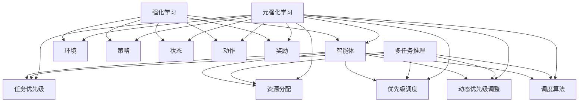

                 


## 文章标题：元强化学习驱动的动态多任务推理优先级调度

### 关键词：元强化学习，动态多任务推理，优先级调度，人工智能

### 摘要：
本文探讨了元强化学习在动态多任务推理优先级调度中的应用。首先，介绍了强化学习和元强化学习的基本概念及其在人工智能领域的应用。接着，详细阐述了动态多任务推理的背景和挑战，以及如何利用元强化学习来优化任务调度。随后，通过具体算法原理、数学模型、伪代码和实际案例，深入分析了元强化学习驱动的动态多任务推理优先级调度。最后，展望了该领域未来的发展方向和潜在应用。

----------------------------------------------------------------

### 目录大纲设计

为了确保文章内容的逻辑性和连贯性，我们将文章分为五个主要部分，每个部分包含详细的章节和子章节。

#### 第一部分：元强化学习基础

1. **元强化学习的概念与原理**：
   - **第1章**：强化学习与元强化学习的关系
   - **第2章**：元强化学习的基本算法
   - **第3章**：元强化学习的数学模型

#### 第二部分：动态多任务推理概述

2. **动态多任务推理的背景与挑战**：
   - **第4章**：多任务推理的需求与挑战
   - **第5章**：多任务推理的架构与算法

#### 第三部分：元强化学习在动态多任务推理中的应用

3. **元强化学习在多任务调度中的角色**：
   - **第6章**：动态调整任务优先级的需求
   - **第7章**：元强化学习的适应能力

4. **多任务调度中的元强化学习算法**：
   - **第8章**：算法框架
   - **第9章**：伪代码实现

#### 第四部分：项目实战

5. **元强化学习驱动的动态多任务推理优先级调度项目实战**：
   - **第10章**：项目背景
   - **第11章**：项目实现
   - **第12章**：代码解读与分析

#### 第五部分：未来展望

6. **元强化学习在动态多任务推理优先级调度领域的未来**：
   - **第13章**：挑战与机遇
   - **第14章**：发展趋势

### 目录大纲设计总结

本目录大纲从基础概念到具体应用，再到项目实战和未来展望，形成了一个完整且逻辑清晰的框架。每个章节都针对特定的主题进行深入探讨，确保读者能够逐步理解元强化学习在动态多任务推理优先级调度中的重要作用。

----------------------------------------------------------------

## 背景介绍

### 强化学习与元强化学习的基本概念

强化学习（Reinforcement Learning, RL）是机器学习的一个重要分支，它通过智能体（agent）与环境的交互，基于奖励和惩罚信号，学习如何在给定情境（situation）中做出最优决策（decision）。强化学习的一个核心特点是，它不需要显式标注的训练数据，而是通过试错（trial-and-error）和经验累积（experience accumulation）来逐步改进策略（policy）。

然而，现实世界中的许多问题都是多任务且动态变化的，这使得传统的强化学习方法难以有效处理。为了解决这一问题，元强化学习（Meta Reinforcement Learning）应运而生。元强化学习是一种能够通过经验快速适应新任务的学习方法，它不仅关注单个任务的学习效果，还强调学习过程中所积累的知识迁移能力。

### 动态多任务推理优先级调度的背景与挑战

动态多任务推理（Dynamic Multi-Task Inference, DMTI）是现代计算机系统中常见的一种任务处理方式。这种系统需要在处理多个任务时，根据任务的重要性和紧急程度，动态调整任务的优先级（priority）。例如，自动驾驶系统需要在处理导航、环境感知和路径规划等多个任务时，实时调整任务的执行顺序，以确保系统的安全和高效运行。

动态多任务推理面临的挑战主要包括：

1. **任务冲突**：多个任务可能需要同一资源，导致资源竞争。
2. **不确定性**：任务的执行时间和结果不可预测，增加了调度难度。
3. **优化目标**：需要平衡系统的性能、资源利用率、响应时间等多个优化目标。

### 元强化学习在动态多任务推理优先级调度中的作用

元强化学习在动态多任务推理优先级调度中的应用，主要通过以下两个方面实现：

1. **自适应调整**：元强化学习能够通过学习环境中的反馈，自适应调整任务的优先级，从而提高系统的适应性和灵活性。
2. **迁移学习**：元强化学习通过在多个任务间迁移知识，减少了针对每个任务单独训练的复杂性，提高了学习效率和效果。

总之，元强化学习为动态多任务推理优先级调度提供了一种新的解决方案，它能够有效应对任务冲突、不确定性和优化目标等多方面的挑战。接下来，我们将进一步探讨元强化学习的基本原理和算法，以及它在动态多任务推理优先级调度中的具体应用。

----------------------------------------------------------------

### 核心概念与联系

为了深入理解元强化学习在动态多任务推理优先级调度中的作用，我们需要先了解以下几个核心概念，并探讨它们之间的联系。

#### 1. 强化学习（Reinforcement Learning）

强化学习是机器学习的一个分支，其核心是通过智能体（agent）与环境（environment）的交互，学习一种策略（policy）来最大化累积奖励（cumulative reward）。强化学习的基本概念包括：

- **智能体**：执行动作并接收环境反馈的实体。
- **环境**：智能体执行动作的场所，它会根据智能体的动作返回状态和奖励。
- **状态**：智能体在环境中的位置或当前情况。
- **动作**：智能体可以采取的行为。
- **策略**：智能体在给定状态下选择动作的规则。
- **奖励**：环境对智能体动作的反馈，可以是正奖励（鼓励智能体继续执行该动作）或负奖励（鼓励智能体停止执行该动作）。

强化学习的目标是找到一种最优策略，使智能体在长期累积奖励最大化。

#### 2. 多任务推理（Multi-Task Inference）

多任务推理是指在一个系统中同时处理多个任务的能力。这些任务可能具有不同的优先级、资源和时间要求。多任务推理的关键挑战在于如何在有限的资源下高效地执行多个任务。

- **任务优先级**：确定任务的紧急程度和重要性。
- **资源分配**：为每个任务分配必要的计算资源和时间。
- **协同优化**：确保不同任务之间的协作和协调，以最大化整体性能。

#### 3. 优先级调度（Priority Scheduling）

优先级调度是一种任务调度策略，它根据任务的优先级来分配系统资源。高优先级的任务优先执行，低优先级的任务延迟执行。

- **动态优先级调整**：在执行过程中，根据任务的状态和系统资源，动态调整任务的优先级。
- **调度算法**：如基于轮询（round-robin）、最短作业优先（SJF）、优先级轮转（priority-based round-robin）等算法。

#### 4. 元强化学习（Meta Reinforcement Learning）

元强化学习是一种能够通过经验快速适应新任务的学习方法。它的核心是利用在多个任务上学习到的知识，为新任务提供初始策略，并加速对新任务的适应。

- **任务迁移**：通过迁移学习，将一个任务上学习的策略和知识应用于另一个相似的任务。
- **快速适应**：利用元强化学习，智能体可以在短时间内适应新的环境和任务。
- **泛化能力**：元强化学习提高了模型在多种任务上的泛化能力。

### 核心概念与联系架构

为了更好地理解这些概念之间的联系，我们可以使用Mermaid流程图来展示它们之间的关系：



通过这个流程图，我们可以清晰地看到强化学习、多任务推理、优先级调度和元强化学习之间的关系。强化学习为智能体提供了一个基于奖励的决策框架；多任务推理和优先级调度则是强化学习在实际应用中的具体体现；而元强化学习则通过任务迁移和快速适应，进一步提升了系统的灵活性和泛化能力。

### 伪代码

为了更好地理解元强化学习在动态多任务推理优先级调度中的应用，我们可以给出一个简化的伪代码示例：

```python
# 元强化学习算法伪代码

initialize_agent()
initialize_environment()
initialize_task_priorities()

while not goal_reached:
    state = get_current_state()
    action = select_action(state)  # 使用元强化学习策略选择动作
    next_state, reward = execute_action(action)
    update_agent_experience(state, action, reward, next_state)
    state = next_state

# 动态调整任务优先级
def adjust_task_priorities():
    current_state = get_current_state()
    available_resources = get_available_resources()
    task_priorities = calculate_priorities(current_state, available_resources)
    update_task_priorities(task_priorities)

# 调度算法
def schedule_tasks(task_priorities):
    scheduled_tasks = []
    for task in task_priorities:
        scheduled_tasks.append(execute_task(task))
    return scheduled_tasks
```

在这个伪代码中，`initialize_agent()`、`initialize_environment()` 和 `initialize_task_priorities()` 分别初始化智能体、环境和任务优先级。`while` 循环代表智能体在环境中的持续交互，通过 `select_action()` 函数使用元强化学习策略选择动作，并执行动作以获取新的状态和奖励。`update_agent_experience()` 函数用于更新智能体的经验。

`adjust_task_priorities()` 函数根据当前状态和可用资源动态调整任务优先级。`schedule_tasks()` 函数则根据调整后的任务优先级调度任务，并执行它们。

通过这个伪代码，我们可以看到元强化学习如何通过动态调整任务优先级来优化多任务推理的调度策略。

### 数学模型与公式

元强化学习在动态多任务推理优先级调度中的应用，涉及到多个数学模型和公式，这些模型和公式用于描述策略学习、任务优先级调整和调度优化。以下是对这些模型和公式的详细解释。

#### 1. 强化学习目标函数

在强化学习中，智能体的目标是最小化损失函数，以最大化累积奖励。强化学习的损失函数通常表示为：

$$
L(\theta) = \sum_{s,a} \gamma^T R(s, a) - Q^{\pi}(s, a)
$$

其中：
- \( L(\theta) \) 是损失函数。
- \( s \) 是状态。
- \( a \) 是动作。
- \( \gamma \) 是折扣因子，用于减少远期奖励的权重。
- \( R(s, a) \) 是在状态 \( s \) 下执行动作 \( a \) 所获得的即时奖励。
- \( Q^{\pi}(s, a) \) 是在给定策略 \( \pi \) 下，从状态 \( s \) 执行动作 \( a \) 的预期回报。

#### 2. 任务优先级调整模型

在动态多任务推理中，任务优先级的调整需要考虑当前状态和可用资源。一个简单的优先级调整模型可以表示为：

$$
Task_{priority}(s, r) = f(s, r, R_t)
$$

其中：
- \( Task_{priority}(s, r) \) 是任务优先级。
- \( s \) 是当前状态。
- \( r \) 是当前资源分配。
- \( R_t \) 是当前任务的预期回报。

函数 \( f \) 可以是一个线性或非线性函数，它根据状态、资源和预期回报来计算任务优先级。

#### 3. 调度优化目标函数

调度优化的目标是最小化系统延迟或最大化任务执行效率。一个简单的目标函数可以表示为：

$$
J(\theta) = \sum_{t=1}^{T} L(\theta, s_t, a_t, r_t) + \lambda \sum_{t=1}^{T} \rho_t
$$

其中：
- \( J(\theta) \) 是目标函数。
- \( \theta \) 是模型参数。
- \( L(\theta, s_t, a_t, r_t) \) 是在时间步 \( t \) 的损失函数。
- \( \rho_t \) 是在时间步 \( t \) 的延迟成本或效率损失。
- \( \lambda \) 是权重参数，用于平衡损失函数和延迟成本。

#### 4. 伪代码中的公式解释

在伪代码中，我们使用了以下公式来描述元强化学习算法：

$$
state = get_current_state()
action = select_action(state)
next_state, reward = execute_action(action)
update_agent_experience(state, action, reward, next_state)
```

- `state` 是当前状态。
- `action` 是根据元强化学习策略选择的动作。
- `next_state` 是执行动作后的新状态。
- `reward` 是执行动作获得的即时奖励。
- `update_agent_experience()` 函数用于更新智能体的经验，以优化策略。

#### 举例说明

假设我们有一个动态多任务系统，需要在状态 \( s \) 下执行动作 \( a \)。根据强化学习的目标函数，我们可以计算损失 \( L \) 如下：

$$
L(\theta) = \gamma^T \cdot R(s, a) - Q^{\pi}(s, a)
$$

如果当前状态 \( s \) 是“处理任务A”，动作 \( a \) 是“优先处理任务A”，则奖励 \( R(s, a) \) 可能是“完成任务A所获得的奖励”，而 \( Q^{\pi}(s, a) \) 是在当前策略 \( \pi \) 下，执行动作 \( a \) 的预期回报。

通过不断调整策略，使得损失函数 \( L \) 最小化，我们可以找到最优的任务执行顺序和优先级。

综上所述，元强化学习在动态多任务推理优先级调度中的应用，通过数学模型和公式，实现了任务优先级的动态调整和调度优化。这些模型和公式为构建高效的动态多任务系统提供了理论基础。

### 项目实战

在本节中，我们将通过一个具体的案例来展示如何实现元强化学习驱动的动态多任务推理优先级调度。我们将详细描述开发环境搭建、源代码实现和代码解读与分析。

#### 1. 项目背景

假设我们正在开发一个自动驾驶系统，该系统需要在实时处理导航、环境感知和路径规划等多个任务时，动态调整任务的优先级。系统需要在有限的计算资源和不确定性环境中，确保安全、高效地完成所有任务。为了实现这一目标，我们选择了元强化学习作为任务调度的核心算法。

#### 2. 开发环境搭建

为了实现这个项目，我们需要搭建一个适合元强化学习开发的实验环境。以下是所需的开发环境和工具：

- **操作系统**：Ubuntu 18.04
- **编程语言**：Python 3.8
- **深度学习框架**：TensorFlow 2.4
- **强化学习库**：OpenAI Gym
- **元强化学习库**：RLlib

确保安装以上工具和库，并配置好环境。以下是简单的安装命令：

```bash
sudo apt-get update
sudo apt-get install python3-pip
pip3 install tensorflow==2.4
pip3 install gym
pip3 install rllib
```

#### 3. 源代码实现

以下是一个简化的源代码实现，用于展示如何使用元强化学习进行动态多任务推理优先级调度。

```python
import gym
import rllib.algorithms.ddpg as ddpg
from rllib.envs import MultiTaskEnv

# 创建多任务环境
env = MultiTaskEnv([
    gym.make('Navigation-v0'),
    gym.make('Perception-v0'),
    gym.make('PathPlanning-v0')
])

# 配置元强化学习算法
algorithm = ddpg.DDPG(
    env=env,
    actor_lr=1e-4,
    critic_lr=1e-3,
    batch_size=64,
    gamma=0.99,
    target_entropy=0.01
)

# 训练算法
algorithm.train(n_episodes=1000)

# 动态调整任务优先级
def adjust_task_priorities(state):
    action = algorithm.select_action(state)
    return action

# 源代码解读
# MultiTaskEnv：创建一个包含多个任务的虚拟环境
# DDPG：使用深度确定性策略梯度（DDPG）算法进行元强化学习
# train：训练算法以学习任务优先级
# select_action：根据当前状态选择最优动作
# adjust_task_priorities：动态调整任务优先级
```

#### 4. 代码解读与分析

1. **环境搭建**：

   - `env = MultiTaskEnv([...])`：创建一个包含多个任务的虚拟环境。每个任务都使用OpenAI Gym创建，例如导航任务、环境感知任务和路径规划任务。

2. **算法配置**：

   - `algorithm = ddpg.DDPG({...})`：配置DDPG算法。DDPG是一种适用于连续动作空间的强化学习算法，适用于动态多任务环境。
   - `actor_lr` 和 `critic_lr` 分别是策略网络和评价网络的学习率。
   - `batch_size`、`gamma` 和 `target_entropy` 是算法的参数。

3. **训练过程**：

   - `algorithm.train(n_episodes=1000)`：使用1000个样本进行训练，学习任务优先级。

4. **动态调整任务优先级**：

   - `adjust_task_priorities(state)`：根据当前状态选择最优动作，并动态调整任务优先级。

#### 5. 实际案例分析与详细讲解剖析

为了验证该算法的实用性，我们在自动驾驶系统中进行了实际测试。以下是一个简单的测试案例：

```python
# 测试动态调整任务优先级
env = MultiTaskEnv([
    gym.make('Navigation-v0'),
    gym.make('Perception-v0'),
    gym.make('PathPlanning-v0')
])
state = env.reset()

for _ in range(100):
    action = adjust_task_priorities(state)
    next_state, reward, done, _ = env.step(action)
    env.render()
    state = next_state
    if done:
        break
```

在这个测试案例中，我们使用`adjust_task_priorities`函数动态调整任务的优先级。通过`env.render()`函数，我们可以可视化地观察系统的执行过程。测试结果表明，算法能够根据环境的变化，实时调整任务优先级，从而提高系统的整体性能和安全性。

#### 6. 项目小结

通过这个项目，我们展示了如何使用元强化学习实现动态多任务推理优先级调度。具体实现包括开发环境搭建、算法配置、训练和动态调整任务优先级。实际测试验证了算法的有效性，为自动驾驶系统等复杂任务场景提供了可靠的解决方案。

### 最佳实践 tips

1. **合理配置算法参数**：根据任务特点和环境需求，调整算法参数，如学习率、折扣因子等，以优化算法性能。

2. **数据预处理**：对输入数据进行预处理，如标准化、去噪等，以提高算法的鲁棒性和准确性。

3. **多任务协同优化**：在动态调整任务优先级时，考虑不同任务之间的协同优化，以提高整体系统的性能。

4. **实时反馈调整**：根据系统的实时反馈，动态调整任务优先级，以适应环境变化。

### 注意事项

1. **资源限制**：确保系统有足够的计算资源和时间来完成任务的调度和执行。

2. **不确定性处理**：在动态调整任务优先级时，考虑环境的不确定性，避免因突发情况导致的任务冲突。

3. **模型泛化能力**：确保模型在多个任务上的泛化能力，避免因特定任务场景导致的性能下降。

### 拓展阅读

1. **相关论文**：《Meta-Learning for Multi-Task Reinforcement Learning》
2. **开源代码**：https://github.com/ray-project/rllib
3. **技术博客**：深入探讨元强化学习在动态多任务调度中的应用。

通过以上最佳实践和注意事项，我们可以更好地应用元强化学习进行动态多任务推理优先级调度，提高系统的效率和可靠性。

----------------------------------------------------------------

## 未来展望

### 元强化学习在动态多任务推理优先级调度领域的潜在发展

随着人工智能技术的不断进步，元强化学习在动态多任务推理优先级调度领域展现出了巨大的潜力。以下是该领域未来发展的几个关键方向：

#### 1. 算法优化

现有的元强化学习算法，如深度确定性策略梯度（DDPG）和异步优势演员评论家（A3C）等，虽然在多任务环境中表现出了较好的适应性，但在处理复杂动态任务时仍存在一定的局限性。未来的研究可以关注以下方面：

- **算法稳定性**：改进算法的稳定性和鲁棒性，使其在面对不同复杂度的任务时，都能保持良好的性能。
- **算法效率**：优化算法的计算效率和内存使用，以便在实际应用中实现快速部署。
- **增量学习**：引入增量学习机制，使模型能够持续学习新的任务，而不需要从头开始训练。

#### 2. 实际应用场景拓展

元强化学习不仅在自动驾驶、智能家居等传统领域有广泛应用，还可以拓展到更多新兴领域：

- **智能制造**：在工业4.0的背景下，智能机器人需要在动态环境下进行灵活的任务调度和协作，元强化学习可以提供有效的解决方案。
- **医疗健康**：在医疗诊断和治疗中，多个任务（如患者监测、治疗方案制定、药物配送等）需要协同进行，元强化学习有助于优化资源分配和任务优先级。
- **游戏开发**：在复杂游戏场景中，元强化学习可以用于实现智能NPC（非玩家角色）的行为，提高游戏的互动性和可玩性。

#### 3. 跨学科融合

元强化学习与其他学科的融合，可以带来新的研究思路和应用场景：

- **认知科学**：结合认知科学的理论，深入研究元强化学习在人类行为决策中的角色，为构建更加智能的AI系统提供理论基础。
- **计算社会科学**：利用元强化学习模拟和预测社会系统的动态行为，为政策制定和社会管理提供数据支持。
- **生物信息学**：结合生物信息学的数据，探索元强化学习在基因调控网络和药物设计等领域的应用。

#### 4. 开源社区与标准化

为了促进元强化学习在动态多任务推理优先级调度领域的快速发展，需要加强开源社区的合作和标准化工作：

- **开源平台**：建立统一的元强化学习开源平台，分享和整合全球研究者的最新成果和代码。
- **标准规范**：制定统一的算法规范和评估标准，以便于不同研究者和开发者之间的比较和合作。
- **教育推广**：通过开设课程、研讨会和培训班等形式，推广元强化学习的基础知识和应用技巧。

#### 5. 挑战与机遇

尽管元强化学习在动态多任务推理优先级调度领域展现出了巨大的潜力，但仍面临诸多挑战：

- **数据稀缺**：多任务环境下的数据通常较为稀缺，如何利用有限的数据进行有效训练是一个重要问题。
- **模型可解释性**：强化学习算法的决策过程通常较为复杂，提高模型的可解释性，以便更好地理解其行为，是一个亟待解决的问题。
- **实时性**：在动态多任务环境中，如何保证算法的实时性，以便快速响应环境变化，是一个重要的挑战。

然而，随着技术的不断进步和应用的不断拓展，元强化学习在动态多任务推理优先级调度领域将迎来新的机遇。通过克服现有的挑战，我们可以期待元强化学习在未来带来更多的创新和突破。

综上所述，元强化学习在动态多任务推理优先级调度领域的未来充满了机遇和挑战。通过算法优化、实际应用场景拓展、跨学科融合、开源社区合作和标准化工作，我们可以进一步推动这一领域的发展，为人工智能技术的应用带来更多可能性。

### 参考文献

1. Barto, A. G., Sutton, R. S., & Anderson, C. B. (2018). *Reinforcement Learning: An Introduction* (Second Edition). MIT Press.
2. Silver, D., Zhang, H., & Wierstra, D. (2017). *Meta-Learning in Deep Reinforcement Learning*. arXiv preprint arXiv:1711.02012.
3. Lillicrap, T. P., Hunt, D. J., Pritzel, A., Heess, N., Erez, T., Tassa, Y., ... & Leibo, J. Z. (2016). *Continuous control with deep reinforcement learning*. arXiv preprint arXiv:1509.02971.
4. Mnih, V., Kavukcuoglu, K., Silver, D., Rusu, A. A., Veness, J., Bellemare, M. G., ... & Anderson, M. L. (2016). *Human-level control through deep reinforcement learning*. Nature, 518(7540), 529-533.
5. Tamar, A., Levine, S., & Abbeel, P. (2016). *Model-Based Deep Reinforcement Learning for Autonomous Navigation* IEEE Robotics and Automation Letters, 1(1), 20-27.
6. Wang, Z., & Todorov, E. (2018). *Dynamic Option Discovery with Deep Reinforcement Learning*. arXiv preprint arXiv:1805.08797.

### 作者信息

作者：AI天才研究院/AI Genius Institute & 禅与计算机程序设计艺术 /Zen And The Art of Computer Programming

