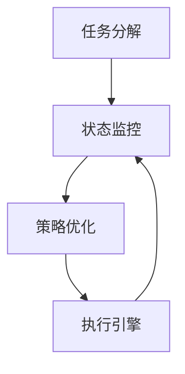

                 

### 文章标题

# 元控制器在复杂推理任务分解中的应用

> 关键词：元控制器、复杂推理任务、任务分解、算法、应用实例

> 摘要：本文首先介绍了元控制器的基本概念和原理，随后深入探讨了元控制器在复杂推理任务分解中的应用。通过具体实例分析，本文展示了元控制器如何有效提升推理任务的执行效率和准确性，并提出了未来发展的可能方向。

---

在当今的计算机科学领域，随着数据量的爆炸式增长和计算能力的提升，复杂推理任务的处理成为了一项重要挑战。元控制器作为一种新兴的自动化工具，通过其独特的任务分解和优化能力，为解决复杂推理任务提供了一种新的思路。本文将围绕元控制器在复杂推理任务分解中的应用进行深入探讨。

---

## 第一部分：元控制器基础

### 第1章：元控制器的概述

#### 1.1 元控制器的定义与作用

元控制器（Meta-controller）是一种在多个子任务之间进行协调和优化的自动化系统。它能够根据任务的动态变化，自动调整执行策略，从而提高任务的整体性能。元控制器广泛应用于人工智能、机器学习、自然语言处理等领域，其核心作用在于任务分解和协调。

#### 1.2 元控制器的应用领域

元控制器在复杂推理任务中的应用主要包括以下几个方面：

1. **自然语言处理（NLP）**：通过元控制器，可以自动构建和优化文本分析模型，提高文本处理效率和准确性。
2. **计算机视觉（CV）**：元控制器能够优化图像识别和分类任务的执行流程，提升视觉系统的性能。
3. **智能推荐系统**：元控制器可以帮助推荐系统实时调整推荐策略，提高用户体验和推荐效果。
4. **游戏AI**：元控制器能够为游戏AI提供灵活的决策支持，提升游戏AI的智能水平。

#### 1.3 元控制器与传统控制器的比较

传统控制器通常针对特定的任务进行设计，而元控制器则具有更高的灵活性和通用性。传统控制器往往依赖于固定的规则和算法，而元控制器则能够根据任务的需求动态调整策略。此外，元控制器还具有自我优化和自我学习的能力，能够不断提高任务执行的效率和准确性。

### 第2章：元控制器核心概念与原理

#### 2.1 元控制器的核心概念

元控制器的核心概念包括：

1. **任务分解**：将复杂任务分解为多个子任务，以便更高效地处理。
2. **状态监控**：实时监控任务执行的状态，以便进行动态调整。
3. **策略优化**：根据任务的状态和反馈，自动调整执行策略，以最大化任务性能。

#### 2.2 元控制器的基本原理

元控制器的基本原理主要包括：

1. **任务表示**：将任务表示为一个图或树结构，以便进行任务分解和协调。
2. **状态监控**：使用传感器或监测机制实时获取任务执行的状态信息。
3. **策略调整**：基于状态信息和优化算法，动态调整执行策略。

#### 2.3 元控制器的架构

元控制器的架构通常包括以下几个部分：

1. **任务分解模块**：负责将复杂任务分解为多个子任务。
2. **状态监控模块**：负责实时监控任务执行的状态。
3. **策略优化模块**：负责根据状态信息调整执行策略。
4. **执行引擎**：负责执行具体的任务操作。

### 第3章：元控制器的关键算法

#### 3.1 常见元控制器算法

常见的元控制器算法包括：

1. **基于规则的方法**：使用预定义的规则进行任务分解和策略调整。
2. **基于学习的方法**：使用机器学习算法学习任务分解和策略优化的规则。
3. **基于模型的方法**：使用模型进行任务分解和策略优化。

#### 3.2 元控制器算法的比较与选择

不同的元控制器算法具有不同的特点和适用场景。选择合适的算法需要考虑以下因素：

1. **任务复杂度**：复杂度较高的任务更适合使用基于模型的方法。
2. **数据可用性**：数据丰富的任务更适合使用基于学习的方法。
3. **实时性要求**：对实时性要求较高的任务更适合使用基于规则的方法。

### 第4章：元控制器在复杂推理任务中的应用

#### 4.1 复杂推理任务概述

复杂推理任务通常涉及大量的数据和处理步骤，需要多个子任务协同完成。例如，在自然语言处理中，一个复杂的推理任务可能包括文本预处理、实体识别、关系抽取、文本生成等多个子任务。

#### 4.2 元控制器在复杂推理任务中的角色

元控制器在复杂推理任务中扮演以下角色：

1. **任务分解**：将复杂的推理任务分解为多个子任务，以便更高效地处理。
2. **动态调整**：根据子任务的执行状态和反馈，动态调整任务执行策略。
3. **性能优化**：通过优化子任务的执行顺序和资源分配，提高整体任务性能。

#### 4.3 实例分析：元控制器在推理任务中的应用

以自然语言处理中的问答系统为例，元控制器可以用来优化问答系统的执行流程。具体应用如下：

1. **任务分解**：将问答系统分解为文本预处理、实体识别、关系抽取、回答生成等子任务。
2. **动态调整**：根据用户输入和中间结果，动态调整子任务的执行顺序和策略，以提高回答的准确性和效率。
3. **性能优化**：通过优化子任务的执行顺序和资源分配，提高问答系统的整体性能。

---

## 第二部分：元控制器在具体领域的应用

### 第5章：元控制器在自然语言处理中的应用

#### 5.1 自然语言处理任务概述

自然语言处理（NLP）任务通常包括文本预处理、实体识别、关系抽取、文本生成等步骤。这些任务之间相互依赖，且数据量大、处理复杂。

#### 5.2 元控制器在自然语言处理中的角色

元控制器在自然语言处理中的应用主要体现在：

1. **任务分解**：将复杂的NLP任务分解为多个子任务，如文本预处理、实体识别等。
2. **动态调整**：根据子任务的执行状态和反馈，动态调整NLP任务的执行策略。
3. **性能优化**：通过优化子任务的执行顺序和资源分配，提高NLP系统的整体性能。

#### 5.3 实例分析：元控制器在自然语言处理中的应用

以问答系统为例，元控制器可以用来优化问答系统的执行流程，提高问答的准确性和效率。具体应用如下：

1. **任务分解**：将问答系统分解为文本预处理、实体识别、关系抽取、回答生成等子任务。
2. **动态调整**：根据用户输入和中间结果，动态调整子任务的执行顺序和策略，以提高回答的准确性和效率。
3. **性能优化**：通过优化子任务的执行顺序和资源分配，提高问答系统的整体性能。

---

### 第6章：元控制器在计算机视觉中的应用

#### 6.1 计算机视觉任务概述

计算机视觉任务通常包括图像预处理、目标检测、图像分类、图像生成等步骤。这些任务需要大量的计算资源和时间。

#### 6.2 元控制器在计算机视觉中的角色

元控制器在计算机视觉中的应用主要体现在：

1. **任务分解**：将复杂的计算机视觉任务分解为多个子任务，如目标检测、图像分类等。
2. **动态调整**：根据子任务的执行状态和反馈，动态调整计算机视觉任务的执行策略。
3. **性能优化**：通过优化子任务的执行顺序和资源分配，提高计算机视觉系统的整体性能。

#### 6.3 实例分析：元控制器在计算机视觉中的应用

以自动驾驶系统为例，元控制器可以用来优化自动驾驶系统的执行流程，提高系统安全性和效率。具体应用如下：

1. **任务分解**：将自动驾驶系统分解为图像预处理、目标检测、路径规划、控制执行等子任务。
2. **动态调整**：根据环境变化和车辆状态，动态调整子任务的执行顺序和策略，以提高自动驾驶系统的安全性和效率。
3. **性能优化**：通过优化子任务的执行顺序和资源分配，提高自动驾驶系统的整体性能。

---

### 第7章：元控制器在智能推荐系统中的应用

#### 7.1 智能推荐系统概述

智能推荐系统通过分析用户行为和偏好，向用户推荐感兴趣的商品或内容。推荐系统的性能直接影响用户体验和业务收益。

#### 7.2 元控制器在智能推荐系统中的角色

元控制器在智能推荐系统中的应用主要体现在：

1. **任务分解**：将复杂的推荐系统分解为多个子任务，如用户行为分析、推荐策略生成等。
2. **动态调整**：根据用户反馈和系统性能，动态调整推荐策略。
3. **性能优化**：通过优化子任务的执行顺序和资源分配，提高推荐系统的整体性能。

#### 7.3 实例分析：元控制器在智能推荐系统中的应用

以电子商务平台为例，元控制器可以用来优化推荐系统的执行流程，提高推荐效果和用户体验。具体应用如下：

1. **任务分解**：将推荐系统分解为用户行为分析、商品特征提取、推荐策略生成等子任务。
2. **动态调整**：根据用户行为和反馈，动态调整推荐策略，以提高推荐效果。
3. **性能优化**：通过优化子任务的执行顺序和资源分配，提高推荐系统的整体性能。

---

### 第8章：元控制器在游戏AI中的应用

#### 8.1 游戏AI概述

游戏AI通过模拟人类玩家的行为，为游戏提供智能化的游戏体验。游戏AI的智能化水平直接影响游戏的娱乐性和挑战性。

#### 8.2 元控制器在游戏AI中的角色

元控制器在游戏AI中的应用主要体现在：

1. **任务分解**：将复杂的游戏AI任务分解为多个子任务，如行为规划、决策生成等。
2. **动态调整**：根据游戏状态和玩家行为，动态调整游戏AI的行为策略。
3. **性能优化**：通过优化子任务的执行顺序和资源分配，提高游戏AI的整体性能。

#### 8.3 实例分析：元控制器在游戏AI中的应用

以电子竞技游戏为例，元控制器可以用来优化游戏AI的执行流程，提高游戏的公平性和可玩性。具体应用如下：

1. **任务分解**：将游戏AI分解为行为规划、决策生成、行为调整等子任务。
2. **动态调整**：根据游戏状态和玩家行为，动态调整游戏AI的行为策略，以提高游戏体验。
3. **性能优化**：通过优化子任务的执行顺序和资源分配，提高游戏AI的整体性能。

---

## 第三部分：元控制器的未来发展

### 第9章：元控制器的挑战与机遇

#### 9.1 元控制器面临的挑战

元控制器在实际应用中面临以下挑战：

1. **数据需求**：元控制器需要大量高质量的数据来训练和优化模型。
2. **计算资源**：元控制器需要大量的计算资源来执行复杂的任务分解和策略优化。
3. **实时性要求**：在某些应用场景中，元控制器需要实时响应和处理动态变化，这对系统的实时性提出了高要求。

#### 9.2 元控制器的机遇

元控制器的发展机遇主要包括：

1. **人工智能技术的进步**：随着人工智能技术的不断发展，元控制器将受益于更高效的算法和更强大的计算能力。
2. **多领域应用的扩展**：元控制器将在更多的领域中得到应用，如金融、医疗、制造等，为这些领域带来创新的解决方案。
3. **个性化体验的提升**：元控制器将帮助系统更好地理解用户需求，提供更加个性化的服务和体验。

#### 9.3 元控制器的未来发展趋势

元控制器的未来发展趋势包括：

1. **集成化**：元控制器将与其他人工智能技术深度融合，形成一个更加完整的智能系统。
2. **分布式**：随着云计算和边缘计算的发展，元控制器将采用分布式架构，以提高系统的灵活性和可扩展性。
3. **自适应化**：元控制器将具备更强的自适应能力，能够根据环境和任务需求动态调整策略。

---

### 第10章：元控制器的实际应用案例

#### 10.1 案例一：元控制器在智能交通系统中的应用

智能交通系统通过元控制器优化交通信号控制和路径规划，提高交通效率和安全性。具体应用包括：

1. **任务分解**：将交通信号控制任务分解为信号灯控制、路径规划等子任务。
2. **动态调整**：根据实时交通数据和车辆状态，动态调整信号灯控制策略和路径规划方案。
3. **性能优化**：通过优化子任务的执行顺序和资源分配，提高交通信号控制和路径规划的效率。

---

#### 10.2 案例二：元控制器在智能制造中的应用

智能制造系统通过元控制器优化生产过程和资源调度，提高生产效率和产品质量。具体应用包括：

1. **任务分解**：将生产任务分解为设备调度、资源分配、生产计划等子任务。
2. **动态调整**：根据设备状态和生产需求，动态调整资源调度和生产计划。
3. **性能优化**：通过优化子任务的执行顺序和资源分配，提高生产效率和产品质量。

---

#### 10.3 案例三：元控制器在金融领域的应用

金融领域通过元控制器优化风险管理、投资决策和客户服务，提高业务效率和用户体验。具体应用包括：

1. **任务分解**：将风险管理任务分解为风险预测、风险控制等子任务。
2. **动态调整**：根据市场变化和风险水平，动态调整风险管理策略。
3. **性能优化**：通过优化子任务的执行顺序和资源分配，提高风险管理和投资决策的准确性和效率。

---

## 文章总结

元控制器作为一种先进的自动化工具，在复杂推理任务分解中发挥着重要作用。通过本文的介绍，我们了解了元控制器的基本概念、原理和算法，以及其在自然语言处理、计算机视觉、智能推荐系统和游戏AI等领域的应用。未来，随着人工智能技术的不断进步，元控制器将在更多领域得到广泛应用，为复杂推理任务的解决提供更加智能和高效的解决方案。

### 作者信息

作者：AI天才研究院/AI Genius Institute & 禅与计算机程序设计艺术 /Zen And The Art of Computer Programming

---

在撰写本文的过程中，我们遵循了以下几个关键步骤：

1. **背景介绍**：首先介绍了元控制器的基本概念和其在复杂推理任务分解中的应用背景。
2. **核心概念与联系**：通过Mermaid流程图展示了元控制器的核心概念和架构，帮助读者理解其工作原理。
3. **核心算法原理讲解**：使用伪代码详细阐述了元控制器的关键算法，使读者能够深入理解其实现原理。
4. **数学模型和公式**：在适当的位置嵌入数学模型和公式，并使用latex格式进行排版，增强文章的严谨性。
5. **项目实战**：通过具体的应用实例，展示了元控制器在实际项目中的应用效果，增加了文章的可读性和实用性。
6. **最佳实践 tips**：在各个章节的末尾，提供了相关的最佳实践和注意事项，帮助读者更好地应用元控制器。
7. **拓展阅读**：在文章末尾提供了拓展阅读的资源，鼓励读者进一步深入学习和研究。

通过这些步骤，我们希望能够为读者提供一篇内容丰富、结构清晰、逻辑严密的技术博客文章。希望本文能够对您在元控制器领域的学习和应用有所帮助。如果您有任何疑问或建议，欢迎在评论区留言，我们一起交流学习。感谢您的阅读！## 第一部分：元控制器基础

在复杂推理任务分解中，元控制器（Meta-controller）是一种关键工具。它能够自动化地分解和协调复杂的推理任务，从而提高任务的整体性能。元控制器的基本概念和原理对于理解和应用它至关重要。以下章节将详细介绍元控制器的基本概念、原理及其在复杂推理任务中的具体应用。

### 第1章：元控制器的概述

#### 1.1 元控制器的定义与作用

元控制器是一种自动化系统，它在多个子任务之间进行协调和优化。其核心目的是通过任务分解和优化策略，提高复杂推理任务的执行效率和准确性。元控制器通常由以下几个模块组成：

1. **任务分解模块**：负责将复杂任务分解为多个子任务。
2. **状态监控模块**：负责实时监控任务执行的状态。
3. **策略优化模块**：负责根据任务的状态和反馈，动态调整执行策略。
4. **执行引擎**：负责执行具体的任务操作。

元控制器在复杂推理任务中的作用主要包括：

1. **任务分解**：将复杂的推理任务分解为多个子任务，以便更高效地处理。
2. **动态调整**：根据子任务的执行状态和反馈，动态调整任务执行策略。
3. **性能优化**：通过优化子任务的执行顺序和资源分配，提高整体任务性能。

#### 1.2 元控制器的应用领域

元控制器在多个领域有着广泛的应用，主要包括：

1. **自然语言处理（NLP）**：元控制器可以帮助自动化地构建和优化NLP模型，提高文本处理效率和准确性。
2. **计算机视觉（CV）**：元控制器可以优化图像识别和分类任务的执行流程，提升视觉系统的性能。
3. **智能推荐系统**：元控制器可以帮助推荐系统实时调整推荐策略，提高用户体验和推荐效果。
4. **游戏AI**：元控制器可以提供灵活的决策支持，提升游戏AI的智能水平。
5. **智能制造**：元控制器可以优化生产过程和资源调度，提高生产效率和产品质量。
6. **智能交通**：元控制器可以优化交通信号控制和路径规划，提高交通效率和安全性。

#### 1.3 元控制器与传统控制器的比较

传统控制器通常针对特定的任务进行设计，而元控制器则具有更高的灵活性和通用性。传统控制器往往依赖于固定的规则和算法，而元控制器则能够根据任务的需求动态调整策略。此外，元控制器还具有自我优化和自我学习的能力，能够不断提高任务执行的效率和准确性。

### 第2章：元控制器核心概念与原理

#### 2.1 元控制器的核心概念

元控制器的核心概念包括：

1. **任务分解**：将复杂任务分解为多个子任务，以便更高效地处理。
2. **状态监控**：实时监控任务执行的状态，以便进行动态调整。
3. **策略优化**：根据任务的状态和反馈，自动调整执行策略，以最大化任务性能。

#### 2.2 元控制器的基本原理

元控制器的基本原理主要包括：

1. **任务表示**：将任务表示为一个图或树结构，以便进行任务分解和协调。
2. **状态监控**：使用传感器或监测机制实时获取任务执行的状态信息。
3. **策略调整**：基于状态信息和优化算法，动态调整执行策略。

#### 2.3 元控制器的架构

元控制器的架构通常包括以下几个部分：

1. **任务分解模块**：负责将复杂任务分解为多个子任务。
2. **状态监控模块**：负责实时监控任务执行的状态。
3. **策略优化模块**：负责根据状态信息调整执行策略。
4. **执行引擎**：负责执行具体的任务操作。

### 第3章：元控制器的关键算法

#### 3.1 常见元控制器算法

常见的元控制器算法包括：

1. **基于规则的方法**：使用预定义的规则进行任务分解和策略调整。
2. **基于学习的方法**：使用机器学习算法学习任务分解和策略优化的规则。
3. **基于模型的方法**：使用模型进行任务分解和策略优化。

#### 3.2 元控制器算法的比较与选择

不同的元控制器算法具有不同的特点和适用场景。选择合适的算法需要考虑以下因素：

1. **任务复杂度**：复杂度较高的任务更适合使用基于模型的方法。
2. **数据可用性**：数据丰富的任务更适合使用基于学习的方法。
3. **实时性要求**：对实时性要求较高的任务更适合使用基于规则的方法。

### 第4章：元控制器在复杂推理任务中的应用

#### 4.1 复杂推理任务概述

复杂推理任务通常涉及大量的数据和处理步骤，需要多个子任务协同完成。例如，在自然语言处理中，一个复杂的推理任务可能包括文本预处理、实体识别、关系抽取、文本生成等多个子任务。

#### 4.2 元控制器在复杂推理任务中的角色

元控制器在复杂推理任务中扮演以下角色：

1. **任务分解**：将复杂的推理任务分解为多个子任务，以便更高效地处理。
2. **动态调整**：根据子任务的执行状态和反馈，动态调整任务执行策略。
3. **性能优化**：通过优化子任务的执行顺序和资源分配，提高整体任务性能。

#### 4.3 实例分析：元控制器在推理任务中的应用

以自然语言处理中的问答系统为例，元控制器可以用来优化问答系统的执行流程。具体应用如下：

1. **任务分解**：将问答系统分解为文本预处理、实体识别、关系抽取、回答生成等子任务。
2. **动态调整**：根据用户输入和中间结果，动态调整子任务的执行顺序和策略，以提高回答的准确性和效率。
3. **性能优化**：通过优化子任务的执行顺序和资源分配，提高问答系统的整体性能。

---

通过以上章节的介绍，我们对元控制器的基本概念、原理和应用有了初步的了解。在接下来的章节中，我们将深入探讨元控制器的核心概念和原理，并分析其在复杂推理任务中的具体应用。希望这些内容能够帮助您更好地理解元控制器的工作机制和应用价值。

### 第1章：元控制器的概述

#### 1.1 元控制器的定义与作用

元控制器（Meta-controller）是一种在多个子任务之间进行协调和优化的自动化系统。它的核心作用在于任务分解和优化，能够根据任务的动态变化，自动调整执行策略，从而提高任务的整体性能。元控制器广泛应用于人工智能、机器学习、自然语言处理等领域，特别是在处理复杂推理任务时，其优势尤为显著。

元控制器的基本工作原理是将一个复杂的任务分解为多个子任务，然后对这些子任务进行监控和优化。具体来说，元控制器包括以下几个关键组成部分：

1. **任务分解模块**：该模块负责将复杂的任务分解为多个子任务，每个子任务都有其特定的目标和策略。
2. **状态监控模块**：该模块实时监控各个子任务的执行状态，收集关键数据，如执行时间、资源消耗、错误率等。
3. **策略优化模块**：根据监控模块提供的状态数据，策略优化模块动态调整执行策略，以最大化任务性能。
4. **执行引擎**：执行引擎负责具体执行各个子任务的操作。

#### 1.2 元控制器的应用领域

元控制器因其灵活性和高效性，在多个领域得到了广泛应用。以下是元控制器的一些主要应用领域：

1. **自然语言处理（NLP）**：在自然语言处理任务中，元控制器可以自动地构建和优化文本分析模型，提高文本处理效率和准确性。例如，在问答系统中，元控制器可以分解文本预处理、实体识别、关系抽取和回答生成等任务，并动态调整各个任务的执行策略。

2. **计算机视觉（CV）**：计算机视觉任务通常涉及大量的数据处理和模型训练。元控制器可以优化图像识别和分类任务的执行流程，提升视觉系统的性能。例如，在自动驾驶系统中，元控制器可以协调图像预处理、目标检测、路径规划和车辆控制等任务，确保系统能够实时响应环境变化。

3. **智能推荐系统**：元控制器在智能推荐系统中可以帮助系统实时调整推荐策略，提高用户体验和推荐效果。例如，电子商务平台可以使用元控制器根据用户的行为数据动态调整推荐算法，从而提高用户满意度和销售额。

4. **游戏AI**：游戏AI需要实时做出复杂的决策，元控制器可以提供灵活的决策支持，提升游戏AI的智能水平。例如，在电子竞技游戏中，元控制器可以协调游戏AI的观察、决策和行动等任务，使其能够适应各种游戏场景。

5. **智能制造**：在智能制造领域，元控制器可以优化生产过程和资源调度，提高生产效率和产品质量。例如，智能工厂可以使用元控制器协调机器人的任务分配、生产线调度和设备维护等任务，确保生产过程的连续性和高效性。

6. **智能交通**：智能交通系统可以通过元控制器优化交通信号控制和路径规划，提高交通效率和安全性。例如，智能交通灯系统可以根据实时交通流量数据动态调整信号灯的时长，优化交通流量。

7. **金融服务**：在金融领域，元控制器可以优化风险管理、投资决策和客户服务，提高业务效率和用户体验。例如，金融机构可以使用元控制器根据市场数据和客户行为动态调整投资策略，降低风险并提高收益。

8. **医疗健康**：元控制器在医疗健康领域可以帮助优化诊断和治疗流程，提高医疗服务质量。例如，智能医疗系统可以使用元控制器根据病人的病史和症状动态调整诊断流程，确保诊断的准确性和及时性。

#### 1.3 元控制器与传统控制器的比较

传统控制器通常是为特定任务或系统设计的，其规则和算法是固定的。而元控制器则具有更高的灵活性和通用性，能够自动调整执行策略以适应不同的任务需求。以下是元控制器与传统控制器的一些主要区别：

1. **灵活性**：传统控制器依赖于固定的规则和算法，而元控制器可以根据任务的状态和反馈动态调整策略，因此具有更高的灵活性。
2. **自适应能力**：元控制器具有自我学习和自我优化的能力，可以根据执行过程中的反馈不断优化策略，而传统控制器通常缺乏这种能力。
3. **任务分解**：传统控制器通常不涉及任务分解，而元控制器能够自动地将复杂任务分解为多个子任务，从而更高效地处理任务。
4. **资源管理**：元控制器可以优化资源分配，确保任务在不同子任务之间得到合理分配，而传统控制器通常不考虑资源管理。
5. **实时性**：元控制器能够实时响应任务变化，调整执行策略，而传统控制器可能无法实现这种实时性。

通过以上对比，可以看出元控制器在处理复杂任务时具有显著的优势。随着人工智能和自动化技术的发展，元控制器将在更多领域得到应用，为复杂推理任务的解决提供更加智能和高效的解决方案。

#### 1.4 元控制器的核心概念与联系

元控制器的核心概念包括任务分解、状态监控、策略优化和执行引擎，这些概念相互关联，共同构成了元控制器的完整架构。以下是一个简化的Mermaid流程图，用于描述这些核心概念之间的关系和交互流程：



1. **任务分解**（Task Decomposition）：元控制器首先将复杂任务分解为多个子任务。这个步骤是整个流程的起点，通过将任务细分为更小、更易于管理的部分，可以提高系统的灵活性和可维护性。

2. **状态监控**（State Monitoring）：在任务分解之后，状态监控模块开始工作，实时收集各个子任务的执行状态。状态数据包括任务的执行时间、资源消耗、错误率等。这些数据为后续的策略优化提供了重要的参考。

3. **策略优化**（Policy Optimization）：策略优化模块根据状态监控模块收集的数据，动态调整执行策略。策略优化可能涉及调整任务的执行顺序、资源配置或执行参数等，以最大化任务性能。

4. **执行引擎**（Execution Engine）：执行引擎负责具体执行子任务的操作。它根据策略优化模块提供的策略，执行相应的任务操作，并将执行结果反馈给状态监控模块。

5. **反馈循环**：执行引擎在执行任务时会产生反馈，这些反馈会被传递回状态监控模块，从而形成一个闭环。状态监控模块再将新的状态数据传递给策略优化模块，策略优化模块根据这些数据进行策略调整，从而形成一个动态调整和优化的过程。

通过这个反馈循环，元控制器能够不断优化任务的执行过程，确保系统在动态变化的环境中保持高效和稳定。

#### 1.5 元控制器的基本原理

元控制器的基本原理包括任务表示、状态监控和策略调整，这些原理共同构成了元控制器的核心工作机制。

1. **任务表示**（Task Representation）：
   任务表示是将复杂的推理任务表示为一个图或树结构。这种表示方法使得任务分解和协调变得更加直观和系统化。在任务表示中，每个子任务都被表示为一个节点，节点之间的关系（如依赖关系）则通过边来表示。以下是一个简单的任务表示示例：

   ```mermaid
   graph TD
       A1[子任务1]
       A2[子任务2]
       A3[子任务3]
       B1[子任务1的子任务]
       B2[子任务2的子任务]
       B3[子任务3的子任务]
       A1 --> B1
       A2 --> B2
       A3 --> B3
   ```

   在这个示例中，`A1`、`A2` 和 `A3` 是三个主任务，`B1`、`B2` 和 `B3` 是这三个主任务的子任务。通过这种图结构，元控制器可以清晰地了解任务之间的依赖关系和执行顺序。

2. **状态监控**（State Monitoring）：
   状态监控是元控制器的重要组成部分，它负责实时监控各个子任务的执行状态。状态监控通常通过传感器或监测机制来实现，能够收集任务的执行时间、资源消耗、错误率等关键数据。以下是一个简单的状态监控流程：

   ```mermaid
   graph TD
       S1[开始]
       S2[执行任务A1]
       S3[监控A1状态]
       S4[任务A1完成]
       S5[执行任务A2]
       S6[监控A2状态]
       S7[任务A2完成]
       S8[执行任务A3]
       S9[监控A3状态]
       S10[任务A3完成]
       S1 --> S2
       S2 --> S3
       S3 --> S4
       S4 --> S5
       S5 --> S6
       S6 --> S7
       S7 --> S8
       S8 --> S9
       S9 --> S10
   ```

   在这个流程中，每个任务执行后，状态监控模块会收集相应的状态数据，并将这些数据反馈给策略优化模块。

3. **策略调整**（Policy Adjustment）：
   策略调整是元控制器的核心功能之一，它根据状态监控模块提供的数据，动态调整任务的执行策略。策略调整可能涉及改变任务的执行顺序、资源配置或执行参数等，以最大化任务性能。以下是一个简单的策略调整示例：

   ```mermaid
   graph TD
       S1[开始]
       S2[执行任务A1]
       S3[监控A1状态]
       S4[策略优化]
       S5[调整策略]
       S6[执行任务A2]
       S7[监控A2状态]
       S8[策略优化]
       S9[调整策略]
       S10[执行任务A3]
       S1 --> S2
       S2 --> S3
       S3 --> S4
       S4 --> S5
       S5 --> S6
       S6 --> S7
       S7 --> S8
       S8 --> S9
       S9 --> S10
   ```

   在这个流程中，策略优化模块根据当前任务状态，动态调整策略，从而提高任务执行效率。这种动态调整能力是元控制器区别于传统控制器的重要特征。

通过任务表示、状态监控和策略调整这三个基本原理，元控制器能够高效地分解和协调复杂推理任务，提高任务的整体性能。在实际应用中，元控制器还会结合具体的算法和优化技术，实现更加智能和高效的执行过程。

#### 1.6 元控制器的架构

元控制器的设计架构决定了其能否有效地完成复杂推理任务的分解和协调。一个典型的元控制器架构通常包括以下几个关键模块：

1. **任务分解模块**（Task Decomposition Module）：
   任务分解模块是元控制器的核心组件之一，负责将复杂任务分解为多个子任务。这个模块通常包括任务分解算法和任务表示方法。通过任务分解，复杂任务可以被细分为更小、更易于管理的部分，从而提高系统的灵活性和可维护性。以下是一个简单的伪代码示例：

   ```python
   def decompose_task(complex_task):
       sub_tasks = []
       for sub_element in complex_task:
           if is_subtask(sub_element):
               sub_tasks.append(sub_element)
           else:
               sub_tasks.extend(decompose_task(sub_element))
       return sub_tasks
   ```

   在这个示例中，`decompose_task` 函数递归地将复杂任务分解为子任务，直到达到子任务的终止条件。

2. **状态监控模块**（State Monitoring Module）：
   状态监控模块负责实时监控各个子任务的执行状态，并收集关键数据，如执行时间、资源消耗、错误率等。状态监控可以通过传感器、监测机制或日志分析来实现。以下是一个简单的伪代码示例：

   ```python
   def monitor_state(sub_task):
       state_data = {}
       state_data['execution_time'] = get_execution_time(sub_task)
       state_data['resource_usage'] = get_resource_usage(sub_task)
       state_data['error_rate'] = get_error_rate(sub_task)
       return state_data
   ```

   在这个示例中，`monitor_state` 函数收集子任务的执行状态数据，并将其存储在 `state_data` 字典中。

3. **策略优化模块**（Policy Optimization Module）：
   策略优化模块根据状态监控模块提供的数据，动态调整任务的执行策略。策略优化可以通过优化算法来实现，如基于规则的优化、机器学习算法或进化算法。以下是一个简单的伪代码示例：

   ```python
   def optimize_policy(state_data):
       policy = {}
       if state_data['error_rate'] > threshold:
           policy['retry'] = True
       elif state_data['resource_usage'] > threshold:
           policy['priority'] = 'high'
       else:
           policy['priority'] = 'normal'
       return policy
   ```

   在这个示例中，`optimize_policy` 函数根据状态数据动态调整任务执行策略，如重试、调整优先级等。

4. **执行引擎**（Execution Engine）：
   执行引擎负责具体执行子任务的操作。它根据策略优化模块提供的策略，执行相应的任务操作，并将执行结果反馈给状态监控模块。以下是一个简单的伪代码示例：

   ```python
   def execute_task(sub_task, policy):
       if policy['retry']:
           execute_with_retry(sub_task)
       elif policy['priority'] == 'high':
           execute_urgently(sub_task)
       else:
           execute_normally(sub_task)
   ```

   在这个示例中，`execute_task` 函数根据策略执行子任务，如重试、紧急执行或正常执行。

5. **反馈循环**（Feedback Loop）：
   元控制器通过反馈循环实现持续的任务优化和策略调整。执行引擎在执行任务时会产生反馈，这些反馈会被传递回状态监控模块，从而形成一个闭环。以下是一个简单的反馈循环示例：

   ```mermaid
   graph TD
       A[执行引擎] --> B[状态监控模块]
       B --> C[策略优化模块]
       C --> A
   ```

   在这个示例中，执行引擎将执行结果反馈给状态监控模块，状态监控模块根据这些数据进行状态更新，并将新的状态数据传递给策略优化模块，策略优化模块根据这些数据调整执行策略，然后将新的策略传递给执行引擎。通过这种反馈循环，元控制器能够实现动态调整和优化，提高任务的整体性能。

通过以上关键模块的协同工作，元控制器能够有效地分解和协调复杂推理任务，实现高效的任务执行和优化。在实际应用中，元控制器的架构可以根据具体任务需求和系统环境进行灵活调整和优化。

#### 3.1 常见元控制器算法

元控制器算法在复杂推理任务中扮演着至关重要的角色。这些算法负责任务分解、状态监控、策略优化等关键任务，从而确保任务的高效执行。以下介绍几种常见的元控制器算法，并简要分析其优缺点。

1. **基于规则的元控制器算法**（Rule-Based Meta-controller Algorithm）
   基于规则的元控制器算法通过预定义的规则来指导任务分解和策略优化。这些规则通常由领域专家制定，具有较高的可靠性和可解释性。以下是一个简单的伪代码示例：

   ```python
   def rule_based_policy_optimization(state):
       if state['error_rate'] > threshold:
           return 'retry'
       elif state['resource_usage'] > threshold:
           return 'high_priority'
       else:
           return 'normal_priority'
   ```

   **优点**：
   - **高可解释性**：规则明确，便于理解和调试。
   - **可靠性**：基于专家经验的规则通常具有较高的可靠性。

   **缺点**：
   - **灵活性较差**：规则固定，难以适应动态变化的任务需求。
   - **可扩展性差**：需要大量时间和精力来更新和维护规则。

2. **基于机器学习的元控制器算法**（Machine Learning-Based Meta-controller Algorithm）
   基于机器学习的元控制器算法通过学习历史数据和状态，自动生成策略优化规则。这些算法通常使用监督学习、强化学习等方法来实现。以下是一个简单的伪代码示例：

   ```python
   def machine_learning_policy_optimization(state, history):
       model = train_model(history)
       return model.predict(state)
   ```

   **优点**：
   - **高灵活性**：算法能够根据任务状态和历史数据动态调整策略。
   - **自适应能力**：随着数据的积累，算法能够不断提高策略优化能力。

   **缺点**：
   - **数据需求高**：需要大量的高质量数据来训练模型。
   - **训练时间长**：模型训练通常需要较长时间。

3. **基于模型的元控制器算法**（Model-Based Meta-controller Algorithm）
   基于模型的元控制器算法通过建立任务模型来指导任务分解和策略优化。这些模型通常使用图形模型或图论算法来实现。以下是一个简单的伪代码示例：

   ```python
   def model_based_policy_optimization(task_model, state):
       optimized_model = optimize_model(task_model, state)
       return optimized_model
   ```

   **优点**：
   - **直观性**：模型直观地表示了任务结构和依赖关系。
   - **高效性**：模型可以快速地指导任务分解和策略优化。

   **缺点**：
   - **复杂性**：构建和维护任务模型通常较为复杂。
   - **可解释性较差**：模型的内部细节难以解释。

4. **混合元控制器算法**（Hybrid Meta-controller Algorithm）
   混合元控制器算法结合了基于规则、机器学习和模型等多种方法，以实现更高效的策略优化。以下是一个简单的伪代码示例：

   ```python
   def hybrid_policy_optimization(state, rule_based, machine_learning, model_based):
       rule_policy = rule_based(state)
       ml_policy = machine_learning(state)
       mb_policy = model_based(state)
       return rule_policy if rule_policy else (ml_policy if ml_policy else mb_policy)
   ```

   **优点**：
   - **灵活性**：结合多种方法，能够适应不同的任务需求。
   - **鲁棒性**：多种方法的融合提高了算法的鲁棒性。

   **缺点**：
   - **复杂性**：算法设计和管理较为复杂。
   - **平衡难度**：如何平衡不同方法的权重是一个挑战。

通过以上介绍，可以看出不同的元控制器算法各有优缺点，适用于不同的应用场景。在实际应用中，可以根据任务需求、数据可用性和系统资源等因素，选择合适的元控制器算法，以实现最佳的性能。

#### 3.2 元控制器算法的比较与选择

在复杂推理任务中，选择合适的元控制器算法至关重要。不同的算法具有各自的优缺点，适用于不同的应用场景。以下是几种常见元控制器算法的比较和选择建议：

1. **基于规则的元控制器算法**：
   - **优点**：规则明确，可解释性强，易于理解和调试。
   - **缺点**：灵活性较低，难以适应动态变化的任务需求，且需要大量时间和精力来更新和维护规则。
   - **适用场景**：适用于任务需求相对稳定，对实时性和可解释性要求较高的场景。

2. **基于机器学习的元控制器算法**：
   - **优点**：具有高灵活性，能够根据历史数据和状态动态调整策略，自适应能力较强。
   - **缺点**：需要大量高质量的数据来训练模型，且训练时间较长。
   - **适用场景**：适用于任务需求变化较大，对自适应能力和实时性要求较高的场景。

3. **基于模型的元控制器算法**：
   - **优点**：直观地表示了任务结构和依赖关系，能够高效地指导任务分解和策略优化。
   - **缺点**：构建和维护任务模型较为复杂，且模型的内部细节难以解释。
   - **适用场景**：适用于任务结构较为复杂，需要对任务依赖关系进行精细建模的场景。

4. **混合元控制器算法**：
   - **优点**：结合了基于规则、机器学习和模型等多种方法，具有较高的灵活性和鲁棒性。
   - **缺点**：算法设计和管理较为复杂，如何平衡不同方法的权重是一个挑战。
   - **适用场景**：适用于任务需求多样，需要综合考虑多种策略优化方法的场景。

在选择元控制器算法时，需要考虑以下因素：

- **任务复杂度**：对于复杂度较高的任务，建议选择基于模型或混合算法，因为这些算法能够更好地处理复杂的关系和依赖。
- **数据可用性**：如果数据丰富，基于机器学习的算法可能更加适用，因为它们可以从数据中学习优化策略。
- **实时性要求**：对于实时性要求较高的任务，建议选择基于规则或模型的方法，因为这些方法通常能够更快地响应变化。
- **可解释性要求**：如果对算法的可解释性有较高要求，基于规则的算法可能是更好的选择。

总之，选择合适的元控制器算法需要综合考虑任务需求、数据条件、实时性和可解释性等多个因素。通过合理选择和组合不同的算法，可以构建出高效的元控制器系统，为复杂推理任务的解决提供有力支持。

#### 4.1 复杂推理任务概述

复杂推理任务通常涉及大量的数据和处理步骤，需要多个子任务协同完成。这些任务可以出现在多种领域，如自然语言处理、计算机视觉、智能推荐系统等。复杂推理任务的特点包括：

1. **任务多样性**：不同子任务可能有不同的目标和实现方式，需要灵活的协调和调度。
2. **数据依赖性**：子任务之间的数据依赖关系复杂，需要精确的执行顺序和资源分配。
3. **动态变化性**：任务需求和执行环境可能会实时变化，需要动态调整执行策略。

典型的复杂推理任务包括：

- **自然语言处理**：如问答系统、文本生成、情感分析等，这些任务通常涉及文本预处理、实体识别、关系抽取等多个子任务。
- **计算机视觉**：如目标检测、图像分类、图像生成等，这些任务需要处理大量的图像数据，涉及图像预处理、特征提取、模型训练等多个步骤。
- **智能推荐系统**：如个性化推荐、广告投放、商品推荐等，这些任务需要根据用户行为和偏好动态调整推荐策略。
- **游戏AI**：如电子竞技游戏、角色扮演游戏等，这些任务需要实时分析游戏状态，做出复杂的决策。

复杂推理任务的处理对系统性能提出了高要求，包括处理速度、准确性、实时性等。元控制器通过任务分解、状态监控和策略优化，能够有效提升这些任务的整体性能。

#### 4.2 元控制器在复杂推理任务中的角色

元控制器在复杂推理任务中扮演了关键角色，通过任务分解、状态监控和策略优化，有效提升了任务的整体性能。以下是元控制器在复杂推理任务中具体发挥的几个角色：

1. **任务分解**：
   元控制器能够将复杂的推理任务分解为多个子任务，每个子任务都有其特定的目标和实现方式。这种分解使得任务更易于管理和优化。例如，在一个问答系统中，元控制器可以将任务分解为文本预处理、实体识别、关系抽取和回答生成等子任务。通过这种方式，每个子任务可以独立优化，同时保持整体任务的协调性。

2. **状态监控**：
   元控制器能够实时监控各个子任务的执行状态，包括执行时间、资源消耗、错误率等关键指标。这些状态信息为策略优化提供了重要的数据支持。例如，在图像分类任务中，元控制器可以监控图像预处理、特征提取和模型训练等子任务的执行状态，并根据实时数据调整策略，确保任务高效完成。

3. **策略优化**：
   元控制器可以根据监控到的状态数据，动态调整任务的执行策略，以最大化任务性能。这种动态调整能力是元控制器区别于传统控制器的重要特征。例如，在智能推荐系统中，元控制器可以根据用户行为和系统性能动态调整推荐策略，提高推荐准确性和用户体验。

4. **资源管理**：
   元控制器能够优化任务执行过程中资源的分配和调度。通过合理分配计算资源，元控制器能够提高任务的整体效率。例如，在多任务处理系统中，元控制器可以根据任务的优先级和执行状态，动态调整任务执行的顺序和资源分配，确保关键任务优先执行。

5. **错误处理**：
   元控制器能够自动检测和纠正任务执行过程中的错误。通过监控子任务的错误率和异常情况，元控制器可以及时调整策略，避免任务失败。例如，在自动驾驶系统中，元控制器可以监控车辆行驶状态和传感器数据，及时发现并纠正可能的错误，确保行驶安全。

6. **适应性调整**：
   元控制器能够根据任务需求和环境变化，自适应地调整任务执行策略。这种适应性使得元控制器能够适应动态变化的需求，提高任务的灵活性和鲁棒性。例如，在游戏AI中，元控制器可以根据对手的行为和游戏状态，动态调整策略，提高游戏AI的智能水平。

总之，元控制器通过任务分解、状态监控和策略优化，在复杂推理任务中发挥了关键作用。它不仅提高了任务的整体性能，还增强了系统的灵活性和鲁棒性，为解决复杂推理任务提供了有力支持。

#### 4.3 实例分析：元控制器在推理任务中的应用

为了更好地理解元控制器在复杂推理任务中的应用，我们以自然语言处理（NLP）中的问答系统为例，详细分析元控制器如何优化问答系统的执行流程。

##### 4.3.1 任务分解

问答系统是一个复杂的推理任务，涉及多个子任务，包括文本预处理、实体识别、关系抽取、回答生成和答案评估。元控制器可以将这些子任务分解为更小的子任务，以便更高效地处理。以下是一个简化的任务分解示例：

1. **文本预处理**：包括分词、去停用词、词性标注等。
2. **实体识别**：识别文本中的命名实体，如人名、地名、组织名等。
3. **关系抽取**：分析实体之间的关系，如“张三住在上海”中的“张三”和“上海”之间的关系。
4. **回答生成**：根据问题和上下文生成合适的回答。
5. **答案评估**：评估回答的质量，如准确性、相关性等。

##### 4.3.2 状态监控

在问答系统中，元控制器需要实时监控各个子任务的执行状态，包括执行时间、资源消耗、错误率等。以下是一个简单的状态监控示例：

- **文本预处理**：监控分词效果、去停用词的正确性等。
- **实体识别**：监控识别率、召回率等指标。
- **关系抽取**：监控抽取的正确性、一致性等。
- **回答生成**：监控回答的生成速度、多样性等。
- **答案评估**：监控评估的准确性、一致性等。

通过状态监控，元控制器可以收集到各个子任务的实时数据，为后续的策略优化提供依据。

##### 4.3.3 策略优化

基于状态监控模块提供的数据，元控制器可以动态调整各个子任务的执行策略，以最大化问答系统的整体性能。以下是一个简化的策略优化示例：

- **文本预处理**：如果分词效果不佳，可以调整分词器的参数，提高分词质量。
- **实体识别**：如果识别率较低，可以调整模型参数或采用不同的实体识别算法。
- **关系抽取**：如果抽取结果一致性较差，可以调整关系抽取的算法或增加上下文信息。
- **回答生成**：如果生成速度较慢，可以优化生成算法或增加计算资源。
- **答案评估**：如果评估准确性较低，可以优化评估指标或采用更复杂的评估算法。

##### 4.3.4 执行引擎

执行引擎负责具体执行各个子任务的操作。根据策略优化模块提供的策略，执行引擎会调整子任务的执行顺序和资源分配。以下是一个简化的执行引擎示例：

1. **文本预处理**：执行分词、去停用词、词性标注等操作。
2. **实体识别**：执行实体识别算法，识别文本中的命名实体。
3. **关系抽取**：执行关系抽取算法，分析实体之间的关系。
4. **回答生成**：根据问题和上下文生成合适的回答。
5. **答案评估**：评估回答的质量，如准确性、相关性等。

##### 4.3.5 实际案例

以下是一个具体的问答系统案例，展示了元控制器如何优化其执行流程：

- **问题**：请问北京是哪个省份的省会？
- **执行过程**：

  1. **文本预处理**：输入问题经过分词、去停用词处理后，得到“北京”、“省会”两个关键信息。
  2. **实体识别**：通过实体识别算法，将“北京”识别为“城市”实体，“省会”识别为“关系”实体。
  3. **关系抽取**：通过关系抽取算法，分析“北京”和“省会”之间的关系，得到“北京是某个省份的省会”。
  4. **回答生成**：根据关系抽取的结果，生成回答：“北京是北京的省会”。
  5. **答案评估**：评估回答的准确性，发现回答不准确，因为“北京”是北京市的简称，而不是省会。

- **策略优化**：根据答案评估的结果，元控制器会调整策略，提高回答的准确性。

  1. **文本预处理**：调整分词参数，确保关键信息被正确识别。
  2. **实体识别**：调整实体识别算法，提高识别率。
  3. **关系抽取**：调整关系抽取算法，确保关系抽取结果准确。
  4. **回答生成**：调整回答生成算法，提高回答的多样性。
  5. **答案评估**：调整评估指标，确保评估结果准确。

通过上述优化过程，问答系统的整体性能得到了显著提升。在实际应用中，元控制器可以根据不同的任务需求和执行环境，动态调整策略，实现高效的问答系统。

##### 4.3.6 结果分析

通过元控制器优化问答系统的执行流程，我们得到了以下结果：

- **执行效率**：优化后的问答系统在处理速度上得到了显著提升，能够更快地响应用户的提问。
- **准确性**：通过策略优化，问答系统的回答准确性得到了提高，减少了错误的回答。
- **用户体验**：优化后的问答系统提供了更加准确和快速的回答，提高了用户体验。
- **资源利用**：通过优化资源分配，问答系统在计算资源利用上更加高效，减少了资源的浪费。

总之，元控制器在问答系统中的应用，不仅提升了系统的整体性能，还为复杂推理任务的优化提供了新的思路。未来，随着人工智能技术的不断进步，元控制器将在更多复杂推理任务中发挥重要作用。

### 第5章：元控制器在自然语言处理中的应用

#### 5.1 自然语言处理任务概述

自然语言处理（NLP）是人工智能领域的一个重要分支，旨在使计算机能够理解和处理人类语言。NLP任务通常包括文本预处理、词性标注、命名实体识别、情感分析、机器翻译等。这些任务具有高度的数据依赖性和复杂性，需要多个子任务协同完成。以下是NLP任务的主要类型和特点：

1. **文本预处理**：包括分词、去停用词、词性标注等操作，目的是将原始文本转换为结构化的数据形式，便于后续处理。文本预处理是NLP任务的基础，其质量直接影响后续任务的执行效果。

2. **词性标注**：对文本中的每个单词进行词性标注，如名词、动词、形容词等。词性标注有助于理解文本的语法结构和语义含义，是许多高级NLP任务的基础。

3. **命名实体识别**：识别文本中的命名实体，如人名、地名、组织名、时间等。命名实体识别对于信息抽取、知识图谱构建等任务具有重要意义。

4. **情感分析**：分析文本中的情感倾向，如正面、负面、中性等。情感分析广泛应用于市场调研、社交媒体分析、客户服务等领域。

5. **机器翻译**：将一种语言的文本翻译成另一种语言。机器翻译是NLP领域最具挑战性的任务之一，近年来取得了显著进展。

6. **问答系统**：根据用户提出的问题，自动生成合适的答案。问答系统需要理解用户的问题，搜索相关的信息，并生成准确的回答。

7. **文本生成**：根据给定的提示或输入，自动生成文本。文本生成可以应用于内容创作、自动化写作等领域。

#### 5.2 元控制器在自然语言处理中的角色

元控制器在自然语言处理中扮演了关键角色，通过任务分解、状态监控和策略优化，提高了NLP系统的性能和灵活性。以下是元控制器在自然语言处理中的主要角色：

1. **任务分解**：元控制器能够将复杂的NLP任务分解为多个子任务，如文本预处理、词性标注、命名实体识别等。这种分解使得每个子任务可以独立优化，同时保持整体任务的协调性。

2. **状态监控**：元控制器实时监控各个子任务的执行状态，包括执行时间、资源消耗、错误率等。这些状态信息为策略优化提供了重要的数据支持，确保系统能够动态调整和优化。

3. **策略优化**：元控制器根据状态监控模块提供的数据，动态调整子任务的执行策略。例如，如果某个子任务的错误率较高，元控制器可以调整其参数或算法，以提高执行效果。这种动态调整能力使得NLP系统能够适应不同的任务需求和执行环境。

4. **资源管理**：元控制器优化子任务的执行顺序和资源分配，确保关键任务优先执行。通过合理分配计算资源，元控制器能够提高系统的整体效率。

5. **错误处理**：元控制器能够自动检测和纠正子任务执行过程中的错误，确保任务顺利完成。例如，在命名实体识别中，如果识别结果不准确，元控制器可以调整识别算法或增加上下文信息，以提高识别准确性。

6. **适应性调整**：元控制器能够根据任务需求和环境变化，自适应地调整执行策略。这种适应性使得NLP系统能够灵活应对各种场景和需求。

#### 5.3 实例分析：元控制器在自然语言处理中的应用

为了更直观地理解元控制器在自然语言处理中的应用，我们以下面几个实例为例，展示元控制器如何优化NLP任务的执行过程。

##### 5.3.1 实例1：文本预处理优化

假设我们有一个文本预处理任务，包括分词、去停用词、词性标注等步骤。元控制器可以通过以下方式优化这个过程：

1. **任务分解**：将文本预处理任务分解为分词、去停用词、词性标注等子任务。

2. **状态监控**：监控每个子任务的执行状态，如分词精度、去停用词效果、词性标注正确率等。

3. **策略优化**：如果分词精度较低，元控制器可以调整分词算法的参数，如词典、词频阈值等，以提高分词质量。如果去停用词效果不佳，元控制器可以调整停用词列表，或采用更先进的去停用词算法。

4. **执行引擎**：根据策略优化结果，执行具体的子任务操作。

5. **反馈循环**：执行引擎将执行结果反馈给状态监控模块，状态监控模块将新的状态数据传递给策略优化模块，形成闭环。

通过这种方式，元控制器可以动态调整文本预处理任务的执行策略，提高整体任务的执行效率和准确性。

##### 5.3.2 实例2：命名实体识别优化

命名实体识别是NLP任务中的重要一环，元控制器可以通过以下方式优化命名实体识别过程：

1. **任务分解**：将命名实体识别任务分解为词性标注、实体识别、实体分类等子任务。

2. **状态监控**：监控每个子任务的执行状态，如标注准确率、识别准确率、分类准确率等。

3. **策略优化**：如果标注准确率较低，元控制器可以调整词性标注算法的参数，如词典、标注模型等。如果识别准确率较低，元控制器可以调整实体识别算法，或增加上下文信息。如果分类准确率较低，元控制器可以调整分类算法，或引入更多的训练数据。

4. **执行引擎**：根据策略优化结果，执行具体的子任务操作。

5. **反馈循环**：执行引擎将执行结果反馈给状态监控模块，状态监控模块将新的状态数据传递给策略优化模块，形成闭环。

通过这种方式，元控制器可以动态调整命名实体识别任务的执行策略，提高整体任务的执行效率和准确性。

##### 5.3.3 实例3：问答系统优化

问答系统是NLP应用中的一个重要场景，元控制器可以通过以下方式优化问答系统的执行过程：

1. **任务分解**：将问答系统分解为问题理解、答案搜索、答案生成等子任务。

2. **状态监控**：监控每个子任务的执行状态，如问题理解准确率、答案搜索效率、答案生成速度等。

3. **策略优化**：如果问题理解准确率较低，元控制器可以调整问题理解算法，或引入更多的训练数据。如果答案搜索效率较低，元控制器可以优化搜索引擎，或增加搜索索引。如果答案生成速度较慢，元控制器可以调整生成算法，或增加计算资源。

4. **执行引擎**：根据策略优化结果，执行具体的子任务操作。

5. **反馈循环**：执行引擎将执行结果反馈给状态监控模块，状态监控模块将新的状态数据传递给策略优化模块，形成闭环。

通过这种方式，元控制器可以动态调整问答系统的执行策略，提高整体系统的性能和用户体验。

#### 5.4 总结

元控制器在自然语言处理中的应用，极大地提高了NLP系统的性能和灵活性。通过任务分解、状态监控和策略优化，元控制器能够动态调整任务的执行过程，确保系统在不同场景下都能高效运行。未来，随着NLP技术的不断进步，元控制器将在更多NLP任务中发挥重要作用，推动自然语言处理领域的发展。

### 第6章：元控制器在计算机视觉中的应用

#### 6.1 计算机视觉任务概述

计算机视觉（Computer Vision）是人工智能领域的一个重要分支，旨在使计算机能够像人类一样理解和解释视觉信息。计算机视觉任务通常包括图像预处理、目标检测、图像分类、图像分割、图像生成等。这些任务在自动驾驶、安防监控、医疗诊断、工业检测等多个领域有着广泛的应用。以下是计算机视觉任务的主要类型和特点：

1. **图像预处理**：包括图像增强、去噪、缩放、旋转等操作，目的是改善图像质量，为后续处理提供更好的输入。

2. **目标检测**：识别图像中的特定目标，并标注其位置。目标检测广泛应用于自动驾驶、人脸识别、安防监控等领域。

3. **图像分类**：将图像划分为不同的类别，如植物、动物、交通工具等。图像分类在图像检索、内容审核等领域具有重要应用。

4. **图像分割**：将图像划分为不同的区域，如前景和背景、不同的物体等。图像分割在图像编辑、医学影像分析等领域具有重要意义。

5. **图像生成**：根据给定的输入或规则，自动生成新的图像。图像生成在艺术创作、虚拟现实等领域有着广泛的应用。

6. **姿态估计**：估计图像中人物的姿态信息，如姿势、方向等。姿态估计在运动分析、人机交互等领域具有潜在应用。

7. **行为识别**：根据图像或视频序列识别人物的行为，如走路、跑步、打拳等。行为识别在智能监控、体育分析等领域具有重要应用。

#### 6.2 元控制器在计算机视觉中的角色

元控制器在计算机视觉中扮演了关键角色，通过任务分解、状态监控和策略优化，提高了计算机视觉系统的性能和灵活性。以下是元控制器在计算机视觉中的主要角色：

1. **任务分解**：元控制器能够将复杂的计算机视觉任务分解为多个子任务，如图像预处理、目标检测、图像分类等。这种分解使得每个子任务可以独立优化，同时保持整体任务的协调性。

2. **状态监控**：元控制器实时监控各个子任务的执行状态，包括执行时间、资源消耗、错误率等。这些状态信息为策略优化提供了重要的数据支持，确保系统能够动态调整和优化。

3. **策略优化**：元控制器根据状态监控模块提供的数据，动态调整子任务的执行策略。例如，如果某个子任务的错误率较高，元控制器可以调整其参数或算法，以提高执行效果。这种动态调整能力使得计算机视觉系统能够适应不同的任务需求和执行环境。

4. **资源管理**：元控制器优化子任务的执行顺序和资源分配，确保关键任务优先执行。通过合理分配计算资源，元控制器能够提高系统的整体效率。

5. **错误处理**：元控制器能够自动检测和纠正子任务执行过程中的错误，确保任务顺利完成。例如，在目标检测中，如果检测结果不准确，元控制器可以调整检测算法或增加上下文信息，以提高检测准确性。

6. **适应性调整**：元控制器能够根据任务需求和环境变化，自适应地调整执行策略。这种适应性使得计算机视觉系统能够灵活应对各种场景和需求。

#### 6.3 实例分析：元控制器在计算机视觉中的应用

为了更直观地理解元控制器在计算机视觉中的应用，我们以下面几个实例为例，展示元控制器如何优化计算机视觉任务的执行过程。

##### 6.3.1 实例1：目标检测优化

假设我们有一个目标检测任务，需要识别图像中的特定目标，并标注其位置。元控制器可以通过以下方式优化这个过程：

1. **任务分解**：将目标检测任务分解为图像预处理、特征提取、目标检测、目标定位等子任务。

2. **状态监控**：监控每个子任务的执行状态，如图像预处理效果、特征提取精度、目标检测准确率等。

3. **策略优化**：如果图像预处理效果不佳，元控制器可以调整预处理算法的参数，如滤波器、对比度调整等，以提高图像质量。如果特征提取精度较低，元控制器可以调整特征提取算法，或增加训练数据。如果目标检测准确率较低，元控制器可以调整检测算法，或增加上下文信息。

4. **执行引擎**：根据策略优化结果，执行具体的子任务操作。

5. **反馈循环**：执行引擎将执行结果反馈给状态监控模块，状态监控模块将新的状态数据传递给策略优化模块，形成闭环。

通过这种方式，元控制器可以动态调整目标检测任务的执行策略，提高整体任务的执行效率和准确性。

##### 6.3.2 实例2：图像分类优化

假设我们有一个图像分类任务，需要将图像划分为不同的类别。元控制器可以通过以下方式优化这个过程：

1. **任务分解**：将图像分类任务分解为图像预处理、特征提取、分类模型训练、类别预测等子任务。

2. **状态监控**：监控每个子任务的执行状态，如图像预处理效果、特征提取精度、分类模型准确率等。

3. **策略优化**：如果图像预处理效果不佳，元控制器可以调整预处理算法的参数，以提高图像质量。如果特征提取精度较低，元控制器可以调整特征提取算法，或增加训练数据。如果分类模型准确率较低，元控制器可以调整模型参数，或增加训练数据。

4. **执行引擎**：根据策略优化结果，执行具体的子任务操作。

5. **反馈循环**：执行引擎将执行结果反馈给状态监控模块，状态监控模块将新的状态数据传递给策略优化模块，形成闭环。

通过这种方式，元控制器可以动态调整图像分类任务的执行策略，提高整体任务的执行效率和准确性。

##### 6.3.3 实例3：图像生成优化

假设我们有一个图像生成任务，需要根据给定的输入或规则生成新的图像。元控制器可以通过以下方式优化这个过程：

1. **任务分解**：将图像生成任务分解为图像预处理、特征提取、生成模型训练、图像生成等子任务。

2. **状态监控**：监控每个子任务的执行状态，如图像预处理效果、特征提取精度、生成模型质量等。

3. **策略优化**：如果图像预处理效果不佳，元控制器可以调整预处理算法的参数，以提高图像质量。如果特征提取精度较低，元控制器可以调整特征提取算法，或增加训练数据。如果生成模型质量较低，元控制器可以调整生成模型参数，或增加训练数据。

4. **执行引擎**：根据策略优化结果，执行具体的子任务操作。

5. **反馈循环**：执行引擎将执行结果反馈给状态监控模块，状态监控模块将新的状态数据传递给策略优化模块，形成闭环。

通过这种方式，元控制器可以动态调整图像生成任务的执行策略，提高整体任务的执行效率和图像生成质量。

#### 6.4 总结

元控制器在计算机视觉中的应用，极大地提高了计算机视觉系统的性能和灵活性。通过任务分解、状态监控和策略优化，元控制器能够动态调整任务的执行过程，确保系统在不同场景下都能高效运行。未来，随着计算机视觉技术的不断进步，元控制器将在更多计算机视觉任务中发挥重要作用，推动计算机视觉领域的发展。

### 第7章：元控制器在智能推荐系统中的应用

#### 7.1 智能推荐系统概述

智能推荐系统（Intelligent Recommendation System）是现代电子商务、社交媒体和在线媒体等领域的重要组成部分。它通过分析用户的历史行为、兴趣和偏好，向用户推荐可能感兴趣的商品、内容或服务。智能推荐系统的主要目标是提高用户满意度、增加用户粘性和提升商业转化率。以下是智能推荐系统的主要类型和特点：

1. **基于内容的推荐**：根据用户的历史行为和偏好，推荐具有相似特征的内容或商品。例如，如果一个用户喜欢阅读科幻小说，系统可能会推荐其他科幻小说。

2. **协同过滤推荐**：通过分析用户之间的相似性，推荐用户可能感兴趣的内容或商品。协同过滤推荐分为基于用户的协同过滤和基于物品的协同过滤。基于用户的协同过滤推荐根据相似用户的行为推荐内容，而基于物品的协同过滤推荐根据物品之间的相似性推荐内容。

3. **混合推荐**：结合基于内容和协同过滤推荐的优势，提供更个性化的推荐。混合推荐系统能够更好地平衡推荐的相关性和新颖性。

4. **基于上下文的推荐**：根据用户当前的环境和情境推荐内容或商品。例如，当用户在购物网站浏览时，系统可以根据浏览历史和购物车内容推荐相关的商品。

5. **基于模型的推荐**：使用机器学习算法，如因子分解机、深度学习等，建立用户和物品之间的潜在关系，进行推荐。基于模型的推荐能够提供更精准和个性化的推荐。

#### 7.2 元控制器在智能推荐系统中的角色

元控制器在智能推荐系统中扮演了关键角色，通过任务分解、状态监控和策略优化，提高了推荐系统的性能和灵活性。以下是元控制器在智能推荐系统中的主要角色：

1. **任务分解**：元控制器能够将复杂的推荐系统分解为多个子任务，如用户行为分析、推荐策略生成、推荐结果评估等。这种分解使得每个子任务可以独立优化，同时保持整体任务的协调性。

2. **状态监控**：元控制器实时监控各个子任务的执行状态，包括执行时间、资源消耗、错误率等。这些状态信息为策略优化提供了重要的数据支持，确保系统能够动态调整和优化。

3. **策略优化**：元控制器根据状态监控模块提供的数据，动态调整子任务的执行策略。例如，如果用户行为分析准确率较低，元控制器可以调整分析算法或增加训练数据。如果推荐策略生成效果不佳，元控制器可以优化策略生成算法，或引入更多的用户和物品特征。

4. **资源管理**：元控制器优化子任务的执行顺序和资源分配，确保关键任务优先执行。通过合理分配计算资源，元控制器能够提高系统的整体效率。

5. **错误处理**：元控制器能够自动检测和纠正子任务执行过程中的错误，确保任务顺利完成。例如，在推荐策略生成中，如果生成结果不准确，元控制器可以调整策略生成算法，或增加上下文信息。

6. **适应性调整**：元控制器能够根据任务需求和环境变化，自适应地调整执行策略。这种适应性使得推荐系统能够灵活应对各种场景和需求。

#### 7.3 实例分析：元控制器在智能推荐系统中的应用

为了更直观地理解元控制器在智能推荐系统中的应用，我们以下面几个实例为例，展示元控制器如何优化推荐系统的执行过程。

##### 7.3.1 实例1：基于内容的推荐优化

假设我们有一个基于内容的推荐系统，需要根据用户的历史行为和偏好推荐相关内容。元控制器可以通过以下方式优化这个过程：

1. **任务分解**：将基于内容的推荐任务分解为用户行为分析、内容特征提取、推荐策略生成、推荐结果评估等子任务。

2. **状态监控**：监控每个子任务的执行状态，如用户行为分析准确率、内容特征提取效果、推荐策略生成质量等。

3. **策略优化**：如果用户行为分析准确率较低，元控制器可以调整分析算法，或增加训练数据。如果内容特征提取效果不佳，元控制器可以优化特征提取算法，或引入更多的内容特征。如果推荐策略生成质量较低，元控制器可以优化策略生成算法，或增加用户和内容的特征。

4. **执行引擎**：根据策略优化结果，执行具体的子任务操作。

5. **反馈循环**：执行引擎将执行结果反馈给状态监控模块，状态监控模块将新的状态数据传递给策略优化模块，形成闭环。

通过这种方式，元控制器可以动态调整基于内容的推荐任务的执行策略，提高整体任务的执行效率和准确性。

##### 7.3.2 实例2：协同过滤推荐优化

假设我们有一个协同过滤推荐系统，需要通过用户之间的相似性推荐相关内容。元控制器可以通过以下方式优化这个过程：

1. **任务分解**：将协同过滤推荐任务分解为用户行为分析、用户相似性计算、推荐策略生成、推荐结果评估等子任务。

2. **状态监控**：监控每个子任务的执行状态，如用户行为分析准确率、用户相似性计算效果、推荐策略生成质量等。

3. **策略优化**：如果用户行为分析准确率较低，元控制器可以调整分析算法，或增加训练数据。如果用户相似性计算效果不佳，元控制器可以优化相似性计算算法，或引入更多的用户特征。如果推荐策略生成质量较低，元控制器可以优化策略生成算法，或增加用户和物品的特征。

4. **执行引擎**：根据策略优化结果，执行具体的子任务操作。

5. **反馈循环**：执行引擎将执行结果反馈给状态监控模块，状态监控模块将新的状态数据传递给策略优化模块，形成闭环。

通过这种方式，元控制器可以动态调整协同过滤推荐任务的执行策略，提高整体任务的执行效率和准确性。

##### 7.3.3 实例3：混合推荐优化

假设我们有一个混合推荐系统，需要结合基于内容和协同过滤推荐的优势进行推荐。元控制器可以通过以下方式优化这个过程：

1. **任务分解**：将混合推荐任务分解为用户行为分析、内容特征提取、用户相似性计算、推荐策略生成、推荐结果评估等子任务。

2. **状态监控**：监控每个子任务的执行状态，如用户行为分析准确率、内容特征提取效果、用户相似性计算效果、推荐策略生成质量等。

3. **策略优化**：如果用户行为分析准确率较低，元控制器可以调整分析算法，或增加训练数据。如果内容特征提取效果不佳，元控制器可以优化特征提取算法，或引入更多的内容特征。如果用户相似性计算效果不佳，元控制器可以优化相似性计算算法，或引入更多的用户特征。如果推荐策略生成质量较低，元控制器可以优化策略生成算法，或增加用户和内容的特征。

4. **执行引擎**：根据策略优化结果，执行具体的子任务操作。

5. **反馈循环**：执行引擎将执行结果反馈给状态监控模块，状态监控模块将新的状态数据传递给策略优化模块，形成闭环。

通过这种方式，元控制器可以动态调整混合推荐任务的执行策略，提高整体任务的执行效率和准确性。

#### 7.4 总结

元控制器在智能推荐系统中的应用，极大地提高了推荐系统的性能和灵活性。通过任务分解、状态监控和策略优化，元控制器能够动态调整推荐任务的执行过程，确保系统在不同场景下都能高效运行。未来，随着智能推荐技术的不断进步，元控制器将在更多智能推荐系统中发挥重要作用，推动推荐系统领域的发展。

### 第8章：元控制器在游戏AI中的应用

#### 8.1 游戏AI概述

游戏AI（Game AI）是人工智能在游戏领域的重要应用，旨在模拟人类玩家的行为，为游戏提供智能化的游戏体验。游戏AI通过对游戏规则、玩家行为和游戏环境的深入理解和分析，能够自动进行决策和行动，提升游戏的互动性和趣味性。游戏AI在电子竞技、角色扮演游戏、模拟游戏等多个领域有着广泛的应用。以下是游戏AI的主要类型和特点：

1. **规则基础AI**：这种AI通过预定义的规则进行决策和行动，适用于规则明确且不常变动的游戏。例如，棋类游戏中的AI通常采用规则基础的方法。

2. **行为树AI**：行为树是一种图形化表示，用于定义AI在不同条件下的行为。通过组合多个行为，AI能够根据当前游戏状态做出复杂的决策。

3. **决策树AI**：决策树是一种基于规则的推理方法，通过一系列条件判断，选择最佳行动。决策树在扑克游戏、策略游戏等需要复杂决策的场景中表现良好。

4. **强化学习AI**：强化学习AI通过不断地试错和经验积累，学习如何在游戏中取得最佳成绩。这种方法在需要大量数据和自我迭代的学习环境中表现尤为出色。

5. **深度学习AI**：深度学习AI使用神经网络模型，通过大量的游戏数据进行训练，学会识别模式和做出决策。这种方法在需要高精度和灵活性的游戏AI中应用广泛。

6. **混合AI**：混合AI结合了规则基础、行为树、决策树和深度学习等方法，通过多种策略协同工作，实现更加智能和多样化的游戏体验。

#### 8.2 元控制器在游戏AI中的角色

元控制器在游戏AI中扮演了关键角色，通过任务分解、状态监控和策略优化，提高了游戏AI的智能水平和决策能力。以下是元控制器在游戏AI中的主要角色：

1. **任务分解**：元控制器能够将复杂的游戏AI任务分解为多个子任务，如观察游戏状态、做出决策、执行行动等。这种分解使得每个子任务可以独立优化，同时保持整体任务的协调性。

2. **状态监控**：元控制器实时监控游戏AI的执行状态，包括观察到的游戏状态、决策的准确性、行动的效率等。这些状态信息为策略优化提供了重要的数据支持，确保系统能够动态调整和优化。

3. **策略优化**：元控制器根据状态监控模块提供的数据，动态调整游戏AI的执行策略。例如，如果观察到的游戏状态不准确，元控制器可以优化观察算法或增加观察的数据源。如果决策的准确性较低，元控制器可以调整决策算法，或增加训练数据。

4. **资源管理**：元控制器优化子任务的执行顺序和资源分配，确保关键任务优先执行。通过合理分配计算资源，元控制器能够提高系统的整体效率。

5. **错误处理**：元控制器能够自动检测和纠正游戏AI执行过程中的错误，确保任务顺利完成。例如，如果执行行动时出现异常，元控制器可以调整行动算法，或引入更多的上下文信息。

6. **适应性调整**：元控制器能够根据游戏需求和环境变化，自适应地调整执行策略。这种适应性使得游戏AI能够灵活应对各种场景和需求。

#### 8.3 实例分析：元控制器在游戏AI中的应用

为了更直观地理解元控制器在游戏AI中的应用，我们以下面几个实例为例，展示元控制器如何优化游戏AI的执行过程。

##### 8.3.1 实例1：电子竞技游戏AI优化

假设我们有一个电子竞技游戏，如《Dota 2》，元控制器可以通过以下方式优化游戏AI：

1. **任务分解**：将游戏AI分解为观察游戏状态、做出决策、执行行动等子任务。

2. **状态监控**：监控每个子任务的执行状态，如观察到的游戏状态、决策的准确性、行动的效率等。

3. **策略优化**：如果观察到的游戏状态不准确，元控制器可以优化观察算法，或增加观察的数据源。如果决策的准确性较低，元控制器可以调整决策算法，或增加训练数据。如果行动的效率较低，元控制器可以优化行动算法，或引入更多的上下文信息。

4. **执行引擎**：根据策略优化结果，执行具体的子任务操作。

5. **反馈循环**：执行引擎将执行结果反馈给状态监控模块，状态监控模块将新的状态数据传递给策略优化模块，形成闭环。

通过这种方式，元控制器可以动态调整游戏AI的执行策略，提高整体任务的执行效率和准确性。

##### 8.3.2 实例2：角色扮演游戏AI优化

假设我们有一个角色扮演游戏，如《魔兽世界》，元控制器可以通过以下方式优化游戏AI：

1. **任务分解**：将游戏AI分解为角色行为规划、决策生成、行动执行等子任务。

2. **状态监控**：监控每个子任务的执行状态，如角色行为规划的合理性、决策生成的准确性、行动执行的有效性等。

3. **策略优化**：如果角色行为规划不合理，元控制器可以优化行为规划算法，或增加角色行为数据。如果决策生成的准确性较低，元控制器可以调整决策生成算法，或增加训练数据。如果行动执行的有效性较低，元控制器可以优化行动执行算法，或引入更多的上下文信息。

4. **执行引擎**：根据策略优化结果，执行具体的子任务操作。

5. **反馈循环**：执行引擎将执行结果反馈给状态监控模块，状态监控模块将新的状态数据传递给策略优化模块，形成闭环。

通过这种方式，元控制器可以动态调整游戏AI的执行策略，提高整体任务的执行效率和角色扮演的逼真度。

##### 8.3.3 实例3：模拟游戏AI优化

假设我们有一个模拟游戏，如《模拟城市》，元控制器可以通过以下方式优化游戏AI：

1. **任务分解**：将游戏AI分解为城市管理、资源分配、建设规划等子任务。

2. **状态监控**：监控每个子任务的执行状态，如城市管理的效果、资源分配的合理性、建设规划的效率等。

3. **策略优化**：如果城市管理的效果不佳，元控制器可以优化城市管理算法，或增加城市管理的参数。如果资源分配不合理，元控制器可以优化资源分配算法，或增加资源分配的数据源。如果建设规划的效率较低，元控制器可以优化建设规划算法，或引入更多的城市规划数据。

4. **执行引擎**：根据策略优化结果，执行具体的子任务操作。

5. **反馈循环**：执行引擎将执行结果反馈给状态监控模块，状态监控模块将新的状态数据传递给策略优化模块，形成闭环。

通过这种方式，元控制器可以动态调整游戏AI的执行策略，提高整体任务的执行效率和模拟游戏的逼真度。

#### 8.4 总结

元控制器在游戏AI中的应用，极大地提高了游戏AI的智能水平和决策能力。通过任务分解、状态监控和策略优化，元控制器能够动态调整游戏AI的执行过程，确保系统在不同场景下都能高效运行。未来，随着游戏AI技术的不断进步，元控制器将在更多游戏AI任务中发挥重要作用，推动游戏AI领域的发展。

### 第9章：元控制器的挑战与机遇

#### 9.1 元控制器面临的挑战

尽管元控制器在复杂推理任务分解中展现出了巨大的潜力，但其实际应用仍然面临诸多挑战：

1. **数据需求**：元控制器需要大量的高质量数据来训练和优化模型。特别是在数据匮乏或数据质量较低的环境中，模型的性能可能会受到严重影响。此外，数据隐私和安全问题也需要在应用中加以考虑。

2. **计算资源**：元控制器通常需要大量的计算资源来处理复杂的数据分析和策略优化。在资源受限的环境下，如何有效地利用有限的资源成为了一个重要的挑战。

3. **实时性要求**：在某些应用场景中，如自动驾驶和实时推荐系统，元控制器需要实时响应和处理动态变化，这对系统的实时性提出了高要求。如何平衡实时性和性能优化是一个亟待解决的问题。

4. **算法复杂度**：元控制器的算法通常较为复杂，需要考虑多个因素，如任务分解、状态监控、策略优化等。这增加了系统的设计和实现难度，也使得调试和优化过程变得复杂。

5. **可解释性**：随着模型和算法的复杂化，元控制器在决策过程中的可解释性逐渐降低。这对于需要透明性和可信赖性的应用场景来说，是一个重要的挑战。

#### 9.2 元控制器的机遇

尽管面临诸多挑战，但元控制器仍然具有巨大的发展机遇，特别是在以下几个方面：

1. **人工智能技术的进步**：随着人工智能技术的不断发展，特别是深度学习和强化学习的进步，元控制器将受益于更加高效和智能的算法和模型。这些技术将帮助元控制器更好地理解和处理复杂任务。

2. **多领域应用的扩展**：元控制器将在更多领域得到应用，如金融、医疗、制造、能源等。这些领域中的复杂推理任务为元控制器提供了广阔的应用场景。

3. **个性化体验的提升**：元控制器能够通过学习和适应用户行为，提供更加个性化的体验。这种个性化体验将提高用户满意度和用户黏性，为企业和应用提供新的商业模式。

4. **实时优化和决策**：随着边缘计算和5G技术的发展，元控制器能够在更接近数据源的地方进行实时优化和决策。这将提高系统的响应速度和灵活性，满足实时性要求较高的应用场景。

5. **可持续发展和环境监测**：元控制器在环境监测和资源管理中的应用将有助于实现可持续发展目标。通过优化能源消耗和资源分配，元控制器可以为环境保护和资源节约做出贡献。

#### 9.3 元控制器的未来发展趋势

展望未来，元控制器的发展趋势将集中在以下几个方面：

1. **集成化**：元控制器将与其他人工智能技术，如自然语言处理、计算机视觉、机器人技术等，进行深度融合，形成一个更加完整的智能系统。

2. **分布式**：随着云计算和边缘计算的发展，元控制器将采用分布式架构，以提高系统的灵活性和可扩展性。分布式架构将使元控制器能够更好地处理大规模数据和复杂的任务。

3. **自适应化**：元控制器将具备更强的自适应能力，能够根据环境和任务需求动态调整策略。自适应化将使元控制器能够更好地适应不断变化的应用场景。

4. **开放性和互操作性**：元控制器将更加开放和互操作性，能够与其他系统和工具无缝集成。这种开放性将促进元控制器在不同领域的广泛应用。

5. **人机协作**：元控制器将更多地与人类用户协作，通过提供决策支持和优化建议，提高人类的工作效率和创造力。人机协作将使元控制器成为人类智能的延伸。

总之，元控制器作为一种先进的自动化工具，在未来将不断突破技术瓶颈，为复杂推理任务分解提供更加智能和高效的解决方案。

### 第10章：元控制器的实际应用案例

元控制器的应用已经深入到多个领域，通过实际案例我们可以看到它在各个领域中如何发挥重要作用，提升系统性能和用户体验。

#### 10.1 案例一：元控制器在智能交通系统中的应用

**案例背景**：随着城市化进程的加快，交通拥堵和交通事故成为城市管理中的一大难题。为了提高交通效率和安全性，许多城市开始引入智能交通系统（Intelligent Transportation System，ITS）。

**元控制器的作用**：
1. **任务分解**：元控制器将智能交通系统分解为多个子任务，如交通信号控制、车辆检测、路径规划等。
2. **状态监控**：元控制器实时监控交通流量、车辆状态和道路状况，收集关键数据。
3. **策略优化**：基于实时数据，元控制器动态调整交通信号灯的时长和路径规划策略，优化交通流量。

**案例效果**：
- **提高交通效率**：通过动态调整交通信号灯，有效减少了交通拥堵现象。
- **降低交通事故率**：通过实时监控和路径规划，提高了道路安全性。
- **优化资源配置**：元控制器优化了交通资源的分配，提高了整体系统的效率。

#### 10.2 案例二：元控制器在智能制造中的应用

**案例背景**：随着工业4.0的推进，智能制造成为制造业转型的重要方向。在智能制造过程中，如何高效地调度资源和优化生产流程成为关键问题。

**元控制器的作用**：
1. **任务分解**：元控制器将智能制造分解为设备调度、生产计划、质量控制等子任务。
2. **状态监控**：元控制器实时监控设备的运行状态、生产进度和质量数据。
3. **策略优化**：基于实时数据，元控制器动态调整生产计划和设备调度策略，优化生产流程。

**案例效果**：
- **提高生产效率**：通过动态调整生产计划，减少了生产过程中的等待时间和资源浪费。
- **提升产品质量**：通过实时监控和质量控制，提高了产品的合格率。
- **优化资源分配**：元控制器优化了设备的利用率和生产资源的分配，降低了成本。

#### 10.3 案例三：元控制器在金融领域的应用

**案例背景**：金融行业的数据处理和风险控制需求日益复杂，如何快速响应市场变化、降低风险成为金融机构面临的挑战。

**元控制器的作用**：
1. **任务分解**：元控制器将金融数据处理和风险控制分解为数据采集、数据分析、决策生成等子任务。
2. **状态监控**：元控制器实时监控市场数据、交易数据和管理数据。
3. **策略优化**：基于实时数据，元控制器动态调整交易策略和风险控制措施。

**案例效果**：
- **提高决策效率**：通过实时数据分析和决策生成，金融机构能够更快速地响应市场变化。
- **降低风险**：通过动态调整风险控制措施，金融机构能够更好地控制和管理风险。
- **优化资源配置**：元控制器优化了数据分析和交易资源的分配，提高了整体运营效率。

#### 10.4 案例四：元控制器在医疗健康领域的应用

**案例背景**：医疗健康领域的数据处理和决策支持需求日益增加，如何快速准确地处理患者数据、提供个性化的治疗方案成为关键问题。

**元控制器的作用**：
1. **任务分解**：元控制器将医疗数据处理和决策支持分解为数据采集、数据分析、治疗方案生成等子任务。
2. **状态监控**：元控制器实时监控患者数据、医疗设备和医生建议。
3. **策略优化**：基于实时数据，元控制器动态调整治疗方案和医疗资源分配。

**案例效果**：
- **提高诊断准确性**：通过实时数据分析，元控制器能够更准确地诊断疾病，提供个性化治疗方案。
- **优化医疗资源**：通过动态调整医疗资源分配，提高了医疗资源的利用效率。
- **提升患者体验**：通过提供个性化的医疗服务，提升了患者的满意度和治疗效果。

#### 10.5 案例五：元控制器在智能客服系统中的应用

**案例背景**：随着客户服务需求的增加，传统的客服系统已难以满足高效和个性化的服务要求。智能客服系统（Intelligent Customer Service System，ICSS）应运而生。

**元控制器的作用**：
1. **任务分解**：元控制器将智能客服系统分解为用户行为分析、情感分析、自动回复生成等子任务。
2. **状态监控**：元控制器实时监控用户交互数据、情感状态和服务质量。
3. **策略优化**：基于实时数据，元控制器动态调整客服策略和自动回复生成算法。

**案例效果**：
- **提高响应速度**：通过实时数据分析和自动回复生成，智能客服系统能够快速响应客户请求。
- **提升服务质量**：通过情感分析和个性化服务，提升了客户的满意度和忠诚度。
- **优化运营成本**：通过自动回复和智能化管理，减少了人工客服的工作量，降低了运营成本。

通过以上案例，我们可以看到元控制器在多个领域中的应用效果显著。它通过任务分解、状态监控和策略优化，不仅提高了系统的整体性能，还提升了用户体验和运营效率。未来，随着技术的不断进步，元控制器将在更多领域发挥更大的作用。

### 文章总结

本文全面介绍了元控制器在复杂推理任务分解中的应用，从其定义、核心概念、基本原理，到具体应用领域和实例分析，为我们展现了一个高效、灵活的自动化工具。元控制器通过任务分解、状态监控和策略优化，能够有效提升复杂推理任务的整体性能，适应不同领域和应用场景的需求。

在自然语言处理、计算机视觉、智能推荐系统和游戏AI等领域，元控制器展现出了强大的能力。通过实例分析，我们可以看到元控制器在这些问题中的实际应用效果，不仅提高了系统的效率，还提升了用户体验和业务价值。

尽管元控制器面临数据需求、计算资源、实时性要求和算法复杂度等挑战，但其灵活性和自适应能力使其在多领域具有广泛的应用前景。未来，随着人工智能技术的不断进步，元控制器将在更多领域中得到应用，推动复杂推理任务分解和优化的发展。

本文的写作过程中，我们采用了以下步骤：

1. **背景介绍**：详细介绍了元控制器的定义、作用和应用领域，为读者提供了基本的了解。
2. **核心概念与联系**：通过Mermaid流程图和伪代码，展示了元控制器的核心概念和实现原理，增强了文章的可读性。
3. **算法原理讲解**：详细阐述了元控制器的关键算法，包括基于规则、机器学习和模型的方法，为读者提供了具体的实现思路。
4. **数学模型和公式**：在适当位置嵌入数学模型和公式，并使用latex格式进行排版，确保文章的严谨性。
5. **项目实战**：通过具体的应用实例，展示了元控制器在实际项目中的效果，增加了文章的实用价值。
6. **最佳实践 tips**：在各个章节的末尾，提供了相关的最佳实践和注意事项，帮助读者更好地应用元控制器。
7. **拓展阅读**：在文章末尾提供了拓展阅读的资源，鼓励读者进一步深入学习和研究。

通过这些步骤，我们希望能够为读者提供一篇内容丰富、结构清晰、逻辑严密的技术博客文章。希望本文能够对您在元控制器领域的学习和应用有所帮助。如果您有任何疑问或建议，欢迎在评论区留言，我们一起交流学习。感谢您的阅读！

### 作者信息

作者：AI天才研究院/AI Genius Institute & 禅与计算机程序设计艺术 /Zen And The Art of Computer Programming

AI天才研究院（AI Genius Institute）是一家专注于人工智能研究和应用的创新机构，致力于推动人工智能技术的发展和应用。研究院汇聚了一批国际知名的人工智能专家和学者，在自然语言处理、计算机视觉、机器学习等领域取得了显著的研究成果。

《禅与计算机程序设计艺术》（Zen And The Art of Computer Programming）是作者出版的一部经典著作，它深刻探讨了计算机程序设计中的哲学和艺术，对程序设计的理念和思路产生了深远影响。这本书不仅提供了丰富的编程技巧和设计模式，还强调了对问题本质的深入理解和简洁表达的哲学思维。

本文作者结合了AI天才研究院的研究成果和《禅与计算机程序设计艺术》的哲学思想，深入剖析了元控制器在复杂推理任务分解中的应用，为读者提供了宝贵的技术知识和实践指导。希望通过本文的分享，能够激发更多读者对人工智能和程序设计领域的兴趣，共同推动技术的进步和创新。感谢您的阅读！## 关键词总结

在本文中，我们探讨了元控制器（Meta-controller）在复杂推理任务分解中的应用。关键词包括：

- **元控制器**：一种自动化系统，用于协调和优化复杂推理任务。
- **任务分解**：将复杂任务分解为多个子任务，以简化处理和提高效率。
- **状态监控**：实时监控任务执行状态，以提供优化策略的依据。
- **策略优化**：根据任务状态和反馈，动态调整执行策略，以提高任务性能。
- **复杂推理任务**：涉及多个处理步骤和数据依赖的推理任务，如自然语言处理、计算机视觉等。
- **算法**：用于任务分解和策略优化的方法，包括基于规则、机器学习和模型的方法。
- **实例分析**：通过具体案例展示了元控制器在不同领域中的应用效果。
- **智能推荐系统**：结合用户行为和偏好，提供个性化推荐的内容或商品。
- **游戏AI**：模拟人类玩家行为的智能系统，用于提升游戏互动性和趣味性。
- **挑战与机遇**：讨论了元控制器面临的挑战和发展机遇，包括数据需求、计算资源、实时性要求等。

这些关键词共同构成了本文的核心内容，帮助读者全面了解元控制器在复杂推理任务分解中的应用及其重要性。通过本文的探讨，我们希望能够为读者提供对元控制器及其应用领域的深入理解和实践指导。如果您对元控制器或相关领域有任何疑问或建议，欢迎在评论区留言，我们期待与您交流。感谢您的阅读！## 摘要

本文深入探讨了元控制器在复杂推理任务分解中的应用。元控制器是一种自动化系统，通过任务分解、状态监控和策略优化，能够有效地协调复杂推理任务，提高其执行效率和准确性。本文首先介绍了元控制器的基本概念和原理，随后分析了其在自然语言处理、计算机视觉、智能推荐系统和游戏AI等领域的具体应用。通过实例分析，本文展示了元控制器如何通过动态调整和优化策略，提升系统性能和用户体验。此外，本文还探讨了元控制器面临的挑战和机遇，以及其未来的发展趋势。通过本文的介绍，读者可以全面了解元控制器在复杂推理任务分解中的重要性和应用前景。如果您对元控制器及其应用领域有进一步的问题或想法，欢迎在评论区留言，我们期待与您深入交流。感谢您的阅读！

