                 

### 《元控制器在复杂推理任务调度中的优化》

---

## 文章关键词

- 元控制器
- 复杂推理任务
- 调度优化
- 算法分析
- 系统架构
- 实时监控
- 自适应调度
- 优化算法
- 多目标优化

---

## 文章摘要

本文旨在深入探讨元控制器在复杂推理任务调度中的优化问题。首先，我们介绍了元控制器的定义、架构和核心功能，阐述了其在复杂系统中的作用和重要性。接着，我们详细分析了复杂推理任务的特点及其对调度算法的挑战，提出了多种优化方法，并使用伪代码和数学模型详细阐述了这些方法的工作原理。文章随后通过实际案例展示了元控制器在静态、动态和并行调度中的应用，并探讨了其在多目标优化调度中的挑战和解决方案。最后，文章总结了元控制器的研究进展和未来发展方向，为相关领域的研究者和开发者提供了有价值的参考。

---

## 引言

随着人工智能技术的快速发展，复杂推理任务在各个领域得到了广泛应用。从自动驾驶到智能医疗，从金融交易到物联网，复杂推理任务都需要高效且优化的调度策略。然而，这些任务通常具有高度的非线性和动态性，使得传统的调度方法难以应对。为了解决这一问题，元控制器应运而生。

元控制器是一种高级调度和管理系统，它能够根据任务特点和系统状态，动态调整资源分配和执行顺序，从而实现任务的高效执行。元控制器的核心在于其优化能力，它能够通过多种算法和策略，对复杂推理任务进行实时调度和优化，从而提高任务完成速度和系统资源利用率。

本文将围绕元控制器在复杂推理任务调度中的优化展开讨论。首先，我们将介绍元控制器的定义、架构和核心功能。接着，我们将分析复杂推理任务的特点及其对调度算法的挑战。然后，我们将探讨多种优化方法，并使用伪代码和数学模型详细阐述这些方法的工作原理。文章随后将展示元控制器在静态、动态和并行调度中的应用，并探讨其在多目标优化调度中的挑战和解决方案。最后，我们将总结元控制器的研究进展和未来发展方向。

本文结构如下：

1. **元控制器基础**：介绍元控制器的概念、架构和核心功能。
2. **复杂推理任务调度概述**：分析复杂推理任务的特点及其对调度算法的挑战。
3. **优化方法**：探讨元控制器中的优化方法，包括常见的调度算法和优化策略。
4. **应用案例**：展示元控制器在不同类型调度中的应用。
5. **多目标优化调度**：探讨元控制器在多目标优化调度中的挑战和解决方案。
6. **研究进展与未来方向**：总结元控制器的研究进展和未来发展方向。

通过本文的讨论，我们希望为读者提供一个全面、深入的元控制器在复杂推理任务调度中的优化解决方案。

---

## 元控制器基础

### 1.1 元控制器的定义与重要性

元控制器（Meta-controller）是一种高级的调度和管理系统，它能够根据任务的特性和系统的当前状态，动态调整资源的分配和任务的执行顺序，从而实现任务的高效执行。与传统控制器相比，元控制器具备更高的灵活性和自适应能力，能够应对复杂和动态的环境。

#### 元控制器的定义

元控制器的基本定义可以归纳为以下几点：

1. **自动化调度**：元控制器负责自动调度系统中的任务，确保任务能够在合适的时间和资源下执行。
2. **实时监控**：元控制器能够实时监控系统的状态，包括资源利用率、任务进度等，以便进行动态调整。
3. **优化策略**：元控制器采用多种优化算法和策略，以最大化系统的性能和资源利用率。
4. **自适应能力**：元控制器具备自适应能力，能够根据任务的变化和系统的状态，自动调整调度策略。

#### 元控制器的核心功能

元控制器的主要功能包括以下几个方面：

1. **任务调度**：元控制器根据任务的优先级、依赖关系和资源需求，动态调整任务的执行顺序和资源分配。
2. **资源管理**：元控制器负责管理系统的各类资源，包括计算资源、存储资源和网络资源等，确保资源的合理分配和利用。
3. **性能优化**：元控制器通过优化调度策略和算法，提高系统的整体性能和任务完成速度。
4. **故障处理**：元控制器能够检测和响应系统的异常情况，如任务失败、资源不足等，并采取相应的措施进行恢复。

#### 元控制器的在复杂系统中的作用

在复杂系统中，元控制器发挥着至关重要的作用：

1. **提高系统效率**：通过优化调度策略，元控制器能够提高系统的任务完成速度和资源利用率，从而提升整体效率。
2. **增强系统可靠性**：元控制器能够实时监控系统状态，并采取相应的措施处理故障，从而增强系统的可靠性。
3. **应对动态变化**：复杂系统的状态往往具有动态性和不确定性，元控制器具备自适应能力，能够快速响应环境变化，确保系统的稳定运行。
4. **降低运营成本**：通过优化资源管理和任务调度，元控制器有助于降低系统的运营成本，提高经济效益。

### 1.2 元控制器的基本架构

元控制器的基本架构包括以下几个主要模块：

1. **数据输入模块**：数据输入模块负责接收系统中的各类数据，包括任务信息、系统状态等，为后续的调度和优化提供数据支持。
2. **控制逻辑模块**：控制逻辑模块是元控制器的核心，负责根据输入的数据，运用优化算法和策略，生成调度方案。
3. **执行模块**：执行模块负责将调度方案转化为实际的执行动作，包括任务启动、资源分配、任务监控等。
4. **反馈与调整模块**：反馈与调整模块负责收集执行过程中的反馈信息，并根据反馈对调度策略进行调整和优化。

#### 元控制器的工作原理

元控制器的工作原理可以概括为以下几个步骤：

1. **数据输入**：元控制器从数据输入模块接收系统中的各类数据，包括任务信息、系统状态等。
2. **调度决策**：控制逻辑模块根据输入的数据，运用优化算法和策略，生成调度方案。
3. **执行调度**：执行模块根据调度方案，将任务分配到相应的资源上，并启动任务的执行。
4. **状态监控**：执行过程中，元控制器实时监控任务的状态，包括任务进度、资源利用率等。
5. **反馈与调整**：根据任务执行的状态和反馈信息，元控制器对调度策略进行动态调整，确保任务能够高效、稳定地执行。

### 1.3 元控制器的核心功能

元控制器的核心功能主要包括以下几个方面：

1. **实时监控与反馈**：元控制器能够实时监控系统的状态，包括任务进度、资源利用率等，并及时反馈给控制逻辑模块。
2. **调度策略优化**：元控制器采用多种优化算法和策略，如遗传算法、粒子群优化等，对调度策略进行优化，以提高系统的性能和资源利用率。
3. **系统资源的合理分配**：元控制器根据任务的特性和系统的状态，动态调整资源的分配，确保各类资源能够得到充分利用。
4. **自适应能力**：元控制器具备自适应能力，能够根据任务的变化和系统的状态，自动调整调度策略和资源分配，确保系统的稳定运行。

#### 元控制器的功能特点

元控制器的功能特点主要体现在以下几个方面：

1. **可扩展性**：元控制器的设计具有很好的可扩展性，能够根据实际需求，灵活地增加或修改功能模块。
2. **灵活性**：元控制器能够灵活应对不同的调度任务和系统环境，具有很高的适应能力。
3. **实时性**：元控制器具备实时监控和反馈功能，能够快速响应环境变化，确保任务的高效执行。
4. **高效性**：通过优化调度策略和算法，元控制器能够显著提高系统的性能和资源利用率。

### 1.4 元控制器与传统控制器的区别

元控制器与传统控制器之间的区别主要体现在以下几个方面：

1. **控制层级**：传统控制器通常处于较低的层级，主要关注单个任务的执行和控制。而元控制器处于较高的层级，能够同时管理和调度多个任务。
2. **灵活性**：传统控制器通常不具备自适应能力，难以应对复杂和动态的环境。而元控制器具备自适应能力，能够根据任务的变化和系统的状态，动态调整调度策略。
3. **优化能力**：传统控制器通常不具备优化能力，而元控制器采用多种优化算法和策略，能够对调度策略进行实时优化，提高系统的性能和资源利用率。

通过上述分析，我们可以看出，元控制器在复杂推理任务调度中具有独特的优势和重要性。它能够通过实时监控、调度策略优化和自适应能力，实现对复杂推理任务的动态调度和优化，从而提高系统的整体效率和性能。

### 1.5 元控制器的关键组件及其功能

元控制器由多个关键组件构成，每个组件在系统中扮演着特定的角色，共同协作以实现高效的任务调度和资源管理。以下是元控制器的几个关键组件及其主要功能：

#### 1.5.1 数据输入模块

数据输入模块是元控制器的信息获取入口，其主要功能包括：

- **数据收集**：从各种数据源（如任务队列、系统监控工具等）收集任务信息、系统状态和资源信息。
- **数据预处理**：对收集到的数据进行清洗、格式化，确保数据质量，以便后续分析和处理。
- **信息融合**：将来自不同源的数据进行整合，形成统一的视图，为控制逻辑模块提供全面、准确的数据支持。

#### 1.5.2 控制逻辑模块

控制逻辑模块是元控制器的核心，负责调度策略的生成和执行。其主要功能包括：

- **调度算法**：根据任务特点、系统状态和资源需求，选择合适的调度算法（如优先级调度、轮转调度、遗传算法等）。
- **策略优化**：运用优化算法对调度策略进行动态调整，以最大化系统性能和资源利用率。
- **决策生成**：根据输入的数据和调度算法，生成具体的调度方案，包括任务分配、执行顺序和资源分配。

#### 1.5.3 执行模块

执行模块负责将调度方案转化为实际的执行动作，其主要功能包括：

- **任务启动**：根据调度方案，启动任务执行，并将任务分配到相应的资源上。
- **资源管理**：动态管理系统的各类资源（如CPU、内存、存储等），确保资源的合理分配和利用。
- **任务监控**：实时监控任务的状态，包括执行进度、资源使用情况等，及时发现和解决执行过程中出现的问题。

#### 1.5.4 反馈与调整模块

反馈与调整模块负责收集执行过程中的反馈信息，并对调度策略进行动态调整，其主要功能包括：

- **状态监测**：收集任务执行过程中的状态信息，包括任务完成时间、资源使用情况等。
- **性能评估**：根据反馈信息，评估当前调度策略的性能，识别调度过程中的瓶颈和问题。
- **策略调整**：基于性能评估结果，对调度策略进行动态调整，优化系统性能和资源利用率。

#### 1.5.5 接口与服务模块

接口与服务模块负责与外部系统（如任务队列管理器、资源管理器等）进行交互，提供一系列服务接口，其主要功能包括：

- **服务提供**：对外提供任务提交、任务查询、资源申请等接口，方便外部系统与元控制器进行通信。
- **数据同步**：与外部系统同步任务状态和资源信息，确保元控制器能够实时获取最新的系统状态。
- **接口管理**：管理各个服务接口的权限和访问控制，确保系统的安全性。

通过上述关键组件的协同工作，元控制器能够实现对复杂推理任务的实时调度和优化，提高系统的整体效率和稳定性。

### 1.6 元控制器的发展历程与应用领域

元控制器作为一种先进的调度和管理系统，其发展历程和应用领域不断扩展，经历了多个重要阶段。

#### 1.6.1 早期研究

元控制器的概念最早起源于20世纪80年代，当时主要应用于计算机操作系统中的任务调度。早期的研究主要集中在如何通过优先级调度和轮转调度等方法，提高操作系统的性能和资源利用率。这个阶段的研究为元控制器的发展奠定了基础。

#### 1.6.2 多目标优化

随着计算机技术和人工智能的发展，元控制器逐渐从单一的调度任务扩展到多目标优化领域。这个阶段的研究主要集中在如何通过遗传算法、粒子群优化等进化算法，实现多目标优化调度。多目标优化的引入，使得元控制器能够更好地应对复杂任务和动态环境。

#### 1.6.3 实时监控与自适应调度

21世纪以来，随着物联网、大数据等技术的发展，元控制器逐渐向实时监控和自适应调度方向发展。实时监控功能的引入，使得元控制器能够更好地响应系统状态的变化，及时调整调度策略。自适应调度功能的实现，进一步提升了元控制器的灵活性和稳定性。

#### 1.6.4 应用领域扩展

元控制器在多个领域得到了广泛应用，包括：

- **云计算**：在云计算环境中，元控制器用于动态调整资源分配和任务执行顺序，提高云资源的利用率和任务完成速度。
- **物联网**：在物联网场景中，元控制器用于优化设备资源的分配和任务调度，确保系统的高效运行。
- **自动驾驶**：在自动驾驶系统中，元控制器用于实时调度车辆的任务，确保车辆的行驶安全和效率。
- **金融交易**：在金融交易领域，元控制器用于优化交易任务的执行顺序和资源分配，提高交易处理速度和准确性。
- **智能医疗**：在智能医疗领域，元控制器用于优化医疗资源的分配和任务调度，提高医疗服务质量和效率。

#### 1.6.5 未来发展趋势

随着人工智能和物联网技术的进一步发展，元控制器在未来有望在更多领域得到应用，并实现以下发展趋势：

- **智能化**：通过引入深度学习、强化学习等人工智能技术，使元控制器具备更高的智能化水平，能够自主学习和优化调度策略。
- **自适应性**：进一步提升元控制器的自适应能力，使其能够更好地应对复杂和动态的环境变化。
- **高效性**：通过优化算法和架构设计，提高元控制器的调度效率和资源利用率。
- **安全性**：加强元控制器的安全性，防止系统被恶意攻击和篡改。

### 1.7 元控制器与复杂推理任务调度之间的关系

元控制器在复杂推理任务调度中发挥着至关重要的作用，两者之间的关系可以从以下几个方面来理解：

#### 1.7.1 元控制器对复杂推理任务的支撑

复杂推理任务通常涉及大量的计算资源和复杂的数据处理过程，这使得传统的调度方法难以胜任。元控制器通过实时监控、调度策略优化和自适应能力，能够有效支撑复杂推理任务的调度。具体来说：

- **实时监控**：元控制器能够实时监控任务的状态和系统的资源利用率，确保任务能够及时获得所需的资源。
- **调度策略优化**：元控制器采用多种优化算法和策略，动态调整任务的执行顺序和资源分配，提高任务完成速度和系统资源利用率。
- **自适应能力**：元控制器能够根据任务的变化和系统的状态，动态调整调度策略，确保任务能够在变化的环境中高效执行。

#### 1.7.2 复杂推理任务对元控制器的挑战

复杂推理任务的特点对元控制器提出了新的挑战，主要表现在以下几个方面：

- **任务多样性**：复杂推理任务通常涉及多种类型的任务，任务之间的依赖关系复杂，这对元控制器的调度策略和算法设计提出了较高的要求。
- **动态变化**：复杂推理任务的环境动态变化，任务的需求和执行条件可能会随时发生变化，这对元控制器的实时监控和自适应能力提出了更高的要求。
- **资源冲突**：复杂推理任务通常需要大量的计算资源和存储资源，资源冲突问题较为严重，这对元控制器的资源管理和调度策略提出了挑战。

#### 1.7.3 元控制器在复杂推理任务调度中的应用

为了应对复杂推理任务对调度策略和算法设计提出的挑战，元控制器在以下方面得到了广泛应用：

- **任务分类与优先级调度**：元控制器可以根据任务的类型和优先级，采用不同的调度策略，确保高优先级任务得到优先执行。
- **动态资源分配**：元控制器可以根据系统的当前状态和任务的需求，动态调整资源的分配，确保任务能够及时获得所需的资源。
- **多目标优化调度**：元控制器采用多目标优化算法，如遗传算法、粒子群优化等，对任务调度进行优化，提高系统的整体性能和资源利用率。
- **自适应调度**：元控制器可以根据任务的变化和系统的状态，动态调整调度策略，确保任务能够在变化的环境中高效执行。

综上所述，元控制器与复杂推理任务调度之间的关系是相辅相成的。元控制器通过实时监控、调度策略优化和自适应能力，能够有效支撑复杂推理任务的调度，而复杂推理任务对元控制器提出了新的挑战，推动了元控制器技术的不断发展。

### 1.8 元控制器与现有调度算法的关系

元控制器与现有调度算法的关系是密不可分的，两者相互补充，共同构成了现代调度系统的核心。为了深入理解元控制器在复杂推理任务调度中的优化作用，我们需要详细探讨元控制器与现有调度算法的关联与区别。

#### 元控制器与调度算法的关联

1. **调度算法作为元控制器的一部分**：
   - **调度算法**是元控制器实现任务调度和资源管理的关键组件。在元控制器的架构中，调度算法负责根据任务的特点和系统的状态，选择最优的执行顺序和资源分配策略。
   - **优化算法**如遗传算法、粒子群优化等，通常被集成到元控制器中，用于动态调整调度策略，以应对复杂任务和环境变化。

2. **调度算法的多样性**：
   - 元控制器支持多种调度算法，包括优先级调度、轮转调度、公平共享调度等，以满足不同类型任务的调度需求。
   - 通过组合和适配不同的调度算法，元控制器能够提供灵活、高效的任务调度解决方案。

#### 元控制器与调度算法的区别

1. **控制层级的不同**：
   - **调度算法**通常关注底层任务调度，主要处理单个任务或局部任务的执行顺序和资源分配问题。
   - **元控制器**则处于更高一层，不仅负责任务调度，还包括系统的全局监控、资源管理、故障处理等综合管理功能。

2. **功能的综合性与实时性**：
   - **调度算法**主要关注如何优化任务执行，提高系统性能，但通常不具备实时监控和自适应能力。
   - **元控制器**则具备实时监控和自适应能力，能够动态调整调度策略，以应对系统状态的变化，确保任务的高效、稳定执行。

#### 元控制器对调度算法的优化

1. **动态调整**：
   - 元控制器可以根据实时监控到的系统状态，动态调整调度算法的参数和策略，优化任务执行顺序和资源分配。
   - 例如，当系统资源紧张时，元控制器可以调整优先级调度策略，确保关键任务的优先执行。

2. **多目标优化**：
   - 元控制器支持多目标优化，可以同时考虑多个优化目标，如任务完成时间、资源利用率、能源消耗等。
   - 通过多目标优化，元控制器能够实现更全面、更精细的任务调度，提高系统的整体性能。

3. **故障恢复**：
   - 元控制器能够监控任务的执行状态，并在任务失败或系统异常时，自动触发故障恢复机制，重新调度任务。
   - 这种自动化的故障处理能力，是调度算法所不具备的。

### 1.9 元控制器中的核心算法原理讲解

在元控制器中，核心算法是调度策略优化的关键。以下是几种常用的核心算法及其原理讲解。

#### 1.9.1 遗传算法

遗传算法是一种基于自然选择和遗传学的优化算法，通过模拟生物进化的过程，逐步优化调度策略。

- **遗传操作**：包括选择、交叉、变异等，用于生成新的调度方案。
- **适应度函数**：用于评估调度方案的优劣，通常包括任务完成时间、资源利用率等指标。

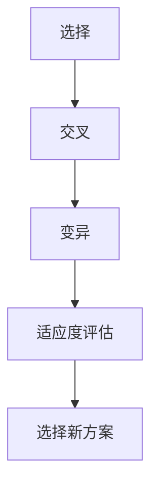

#### 1.9.2 粒子群优化算法

粒子群优化算法是一种基于群体智能的优化算法，通过模拟鸟群觅食行为，逐步找到最优解。

- **粒子**：代表调度方案的一个解。
- **位置和速度**：粒子的位置和速度用于调整调度策略。
- **适应度函数**：用于评估粒子的优劣。

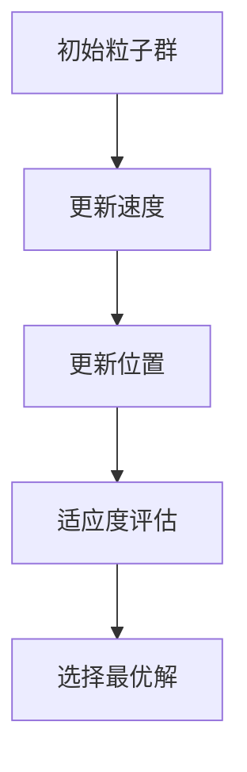

#### 1.9.3 神经网络算法

神经网络算法通过模拟生物神经网络的结构和功能，学习调度策略。

- **输入层**：包括任务特征、系统状态等。
- **隐藏层**：用于提取特征和进行非线性变换。
- **输出层**：生成调度策略。

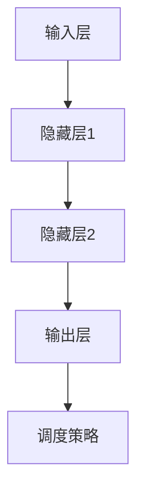

### 1.10 元控制器的优化方法分类

元控制器中的优化方法可以分为以下几类：

#### 1.10.1 贪心算法

贪心算法通过每次选择局部最优解，逐步优化全局调度策略。

- **核心思想**：在每次调度决策时，选择当前状态下最优的调度方案。
- **适用场景**：适用于任务依赖关系简单、环境变化较小的场景。

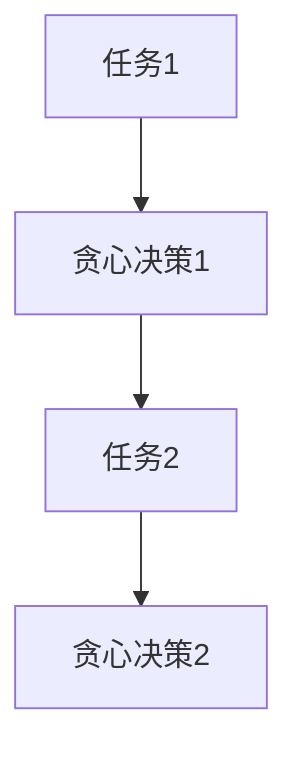

#### 1.10.2 遗传算法

遗传算法通过模拟生物进化过程，逐步优化调度策略。

- **核心思想**：通过选择、交叉、变异等遗传操作，生成新的调度方案，并不断迭代优化。
- **适用场景**：适用于任务依赖关系复杂、环境变化较大的场景。

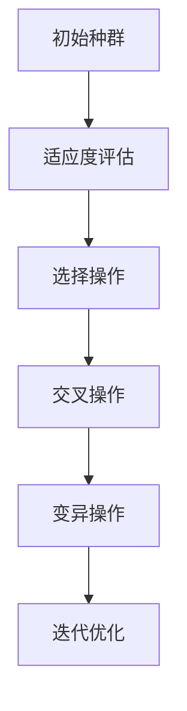

#### 1.10.3 粒子群优化算法

粒子群优化算法通过模拟群体智能，逐步优化调度策略。

- **核心思想**：通过更新粒子的位置和速度，逐步逼近最优调度方案。
- **适用场景**：适用于动态变化、非线性优化问题。

#### 1.10.4 启发式算法

启发式算法通过利用启发式规则，快速找到近似最优解。

- **核心思想**：利用经验或规则，快速做出调度决策。
- **适用场景**：适用于任务依赖关系复杂、环境变化快速的场景。

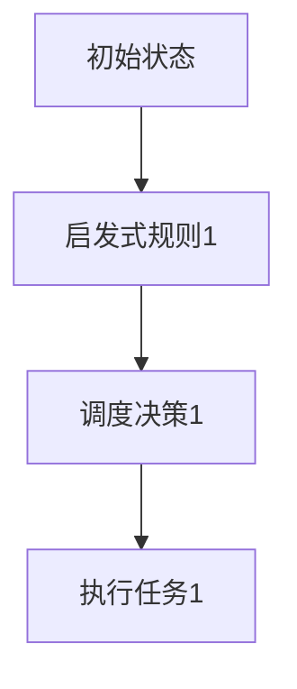

通过以上分类和讲解，我们可以看到，元控制器中的优化方法多种多样，每种方法都有其独特的原理和应用场景。在实际应用中，可以根据具体问题和需求，灵活选择和组合这些优化方法，实现复杂推理任务的高效调度和优化。

---

## 复杂推理任务调度概述

### 2.1 复杂推理任务的定义

复杂推理任务是指涉及多步骤、多阶段、多维度信息处理的任务，这些任务往往需要大量的计算资源和复杂的算法支持。复杂推理任务的特点主要体现在以下几个方面：

1. **任务多样性**：复杂推理任务可以包括不同的类型，如机器学习训练、数据挖掘、图像识别等，每种任务都有其独特的计算需求和优化目标。

2. **依赖关系复杂**：复杂推理任务通常具有复杂的依赖关系，任务之间的执行顺序和依赖条件需要精确控制，以确保任务的正确性和高效性。

3. **动态变化**：复杂推理任务的环境动态变化，任务的执行条件和资源需求可能会随时发生变化，这使得传统的静态调度方法难以应对。

4. **高计算需求**：复杂推理任务往往涉及大量的计算资源和存储资源，需要高效的资源管理和调度策略来保证任务的完成速度。

5. **不确定性**：复杂推理任务过程中可能存在不确定因素，如数据质量、网络延迟等，这些不确定性对任务调度提出了额外的挑战。

### 2.2 复杂推理任务的挑战

复杂推理任务对调度算法提出了许多挑战，主要体现在以下几个方面：

1. **调度算法的选择**：复杂推理任务需要多种调度算法的支持，如何根据任务的特点和环境动态选择合适的调度算法，是一个关键问题。

2. **资源冲突**：复杂推理任务通常需要大量的计算资源和存储资源，如何有效管理这些资源，避免资源冲突和资源浪费，是一个重要挑战。

3. **任务依赖关系管理**：复杂推理任务之间的依赖关系复杂，如何精确控制任务的执行顺序和依赖条件，以确保任务的正确性和高效性，是一个技术难题。

4. **动态适应性**：复杂推理任务的环境动态变化，调度算法需要具备快速响应能力，动态调整任务执行和资源分配策略，以确保任务的高效执行。

5. **优化目标多样性**：复杂推理任务通常涉及多个优化目标，如任务完成时间、资源利用率、能源消耗等，如何平衡这些目标，实现整体优化，是一个复杂的优化问题。

### 2.3 调度算法在推理任务中的作用

调度算法在复杂推理任务中发挥着至关重要的作用，主要表现在以下几个方面：

1. **任务调度**：调度算法负责根据任务的特点和系统的状态，动态调整任务的执行顺序和资源分配，确保任务能够在合适的时间和资源下执行。

2. **资源管理**：调度算法需要管理系统的各类资源，包括计算资源、存储资源和网络资源等，确保资源的合理分配和利用，避免资源冲突和浪费。

3. **性能优化**：调度算法通过优化任务执行顺序和资源分配策略，提高系统的整体性能和任务完成速度，减少任务的等待时间和响应时间。

4. **故障处理**：调度算法需要具备故障处理能力，能够在任务执行过程中检测和响应异常情况，如任务失败、资源不足等，并采取相应的措施进行恢复。

5. **适应性**：调度算法需要具备一定的自适应能力，能够根据任务的变化和系统的状态，动态调整调度策略，确保任务能够在不断变化的环境中高效执行。

### 2.4 调度算法的设计原则

设计高效的调度算法需要遵循以下原则：

1. **灵活性**：调度算法需要具备灵活性，能够适应不同的任务类型和环境变化，灵活调整任务执行顺序和资源分配策略。

2. **高效性**：调度算法需要高效，能够快速响应任务调度需求，降低任务的等待时间和响应时间，提高系统的整体性能。

3. **可扩展性**：调度算法需要具备可扩展性，能够根据系统规模和任务量的变化，动态调整和扩展调度策略和资源管理机制。

4. **可维护性**：调度算法需要具备良好的可维护性，易于调试和更新，方便后续的优化和改进。

5. **适应性**：调度算法需要具备自适应能力，能够根据任务的变化和系统的状态，动态调整调度策略，确保任务的高效执行。

6. **可解释性**：调度算法需要具备一定的可解释性，便于用户理解和调试，提高系统的透明度和可控制性。

通过遵循这些设计原则，可以设计出高效、灵活、可靠的调度算法，为复杂推理任务提供有力的调度支持。

### 2.5 调度算法的分类

调度算法可以根据不同的分类标准进行分类，以下是一些常见的分类方式：

1. **基于优先级的调度算法**：
   - **定义**：优先级调度算法根据任务的优先级进行调度，高优先级任务优先执行。
   - **优点**：简单易实现，能够确保关键任务的优先执行。
   - **缺点**：可能导致低优先级任务长时间等待，公平性较差。

2. **基于轮转的调度算法**：
   - **定义**：轮转调度算法将CPU时间片分给各个任务，每个任务轮流执行。
   - **优点**：公平性好，适用于交互式任务。
   - **缺点**：可能导致某些任务无法充分利用CPU资源，响应时间较长。

3. **基于公平共享的调度算法**：
   - **定义**：公平共享调度算法根据任务的资源需求，动态调整任务执行时间和资源分配。
   - **优点**：资源分配公平，能够最大化系统资源利用率。
   - **缺点**：实现复杂，调度开销较大。

4. **基于遗传算法的调度算法**：
   - **定义**：遗传调度算法通过模拟生物进化过程，逐步优化调度策略。
   - **优点**：适用于复杂任务依赖关系和动态环境。
   - **缺点**：计算复杂度高，收敛速度较慢。

5. **基于神经网络的学习调度算法**：
   - **定义**：神经网络调度算法通过学习任务特征和系统状态，生成调度策略。
   - **优点**：自适应能力强，能够动态调整调度策略。
   - **缺点**：训练过程复杂，对数据依赖性较高。

6. **基于启发式的调度算法**：
   - **定义**：启发式调度算法利用启发式规则，快速找到近似最优解。
   - **优点**：计算复杂度低，适用于实时调度。
   - **缺点**：可能无法找到全局最优解，优化效果有限。

通过选择合适的调度算法，可以针对不同类型的复杂推理任务实现高效的调度和优化。

### 2.6 调度算法的优化目标

在复杂推理任务调度中，调度算法的优化目标主要包括以下几个方面：

1. **任务完成时间**：最小化任务完成时间，确保任务能够在最短时间内完成，提高系统的响应速度和吞吐量。

2. **资源利用率**：最大化系统的资源利用率，确保各类资源（如CPU、内存、存储、网络等）得到充分利用，降低资源浪费。

3. **能量消耗**：最小化系统的能量消耗，特别是在能源受限的环境中，如移动设备、物联网设备等，以提高系统的可持续性和用户体验。

4. **任务响应时间**：最小化任务响应时间，即从任务提交到开始执行的时间间隔，提高系统的响应速度和用户体验。

5. **系统稳定性**：确保系统的稳定性，避免系统因资源不足、任务冲突等原因出现崩溃或性能下降。

6. **公平性**：保证系统中的各个任务能够公平地获得资源，避免某些任务长期等待或资源被某些任务垄断。

7. **可扩展性**：调度算法需要具备良好的可扩展性，能够适应系统规模和任务量的变化，动态调整调度策略和资源管理机制。

通过优化这些目标，调度算法能够更好地满足复杂推理任务的需求，提高系统的整体性能和效率。

### 2.7 调度算法的优化方法

为了提升复杂推理任务调度的效率，我们需要采用多种优化方法，这些方法可以单独使用，也可以组合使用。以下是一些常见的调度优化方法：

1. **优先级调度优化**：
   - **动态优先级调整**：根据任务的执行进度和系统状态，动态调整任务的优先级，确保关键任务优先执行。
   - **多级优先级**：将任务分为多个优先级级别，每个级别有不同的优先级值，根据任务的重要性和紧急性分配优先级。

2. **轮转调度优化**：
   - **动态时间片分配**：根据系统负载和任务需求，动态调整轮转调度的时间片大小，确保任务能够及时执行。
   - **抢占式轮转调度**：在高优先级任务到来时，可以抢占当前执行的任务，确保关键任务优先执行。

3. **基于遗传算法的优化**：
   - **多目标遗传算法**：同时优化多个目标，如任务完成时间、资源利用率和能量消耗，提高调度的整体性能。
   - **自适应遗传算法**：根据任务的变化和系统的状态，动态调整遗传算法的参数，提高算法的适应性和收敛速度。

4. **基于粒子群优化的优化**：
   - **并行粒子群优化**：利用并行计算技术，加速粒子群优化算法的收敛速度。
   - **混合粒子群优化**：结合多种优化算法，如遗传算法和粒子群优化，提高算法的优化效果。

5. **基于神经网络优化的优化**：
   - **深度强化学习**：通过深度强化学习，使调度算法能够自主学习和优化调度策略，提高系统的自适应能力。
   - **神经网络调度模型**：使用神经网络模型预测任务执行时间和资源需求，生成最优的调度方案。

6. **基于启发式的优化**：
   - **贪心算法**：在每次调度决策时，选择当前状态下最优的调度方案。
   - **局部搜索算法**：通过逐步改进当前调度方案，寻找更好的调度配置。

通过以上优化方法，调度算法能够在复杂推理任务调度中实现高效、可靠的调度策略，提高系统的整体性能和资源利用率。

### 2.8 调度算法的性能评估指标

在评估调度算法的性能时，我们通常使用以下指标：

1. **任务完成时间**：衡量调度算法完成所有任务所需的总时间，时间越短表示性能越好。

2. **平均等待时间**：衡量所有任务在等待执行的平均时间，时间越短表示调度算法对任务的响应越快。

3. **资源利用率**：衡量系统资源（如CPU、内存、存储等）的使用率，利用率越高表示资源得到更充分的利用。

4. **吞吐量**：衡量单位时间内系统处理任务的数量，吞吐量越高表示系统的处理能力越强。

5. **公平性**：衡量调度算法是否公平地分配资源，确保所有任务能够公平地获得资源。

6. **响应时间**：衡量从任务提交到开始执行的时间，响应时间越短表示系统的响应速度越快。

7. **稳定性**：衡量调度算法在任务执行过程中是否能够保持稳定，避免系统崩溃或性能下降。

通过这些性能评估指标，我们可以全面评估调度算法的性能，为选择合适的调度策略提供依据。

### 2.9 调度算法的实际应用案例

为了更好地理解调度算法的实际应用，以下将介绍几个典型的应用案例：

#### 2.9.1 云计算环境中的调度

在云计算环境中，调度算法用于动态分配计算资源，确保任务的高效执行。例如，Kubernetes集群管理器使用基于优先级和轮转调度相结合的策略，根据任务的重要性和资源需求，动态调整任务的执行顺序和资源分配，从而提高系统的资源利用率和任务完成速度。

#### 2.9.2 物联网环境中的调度

在物联网环境中，调度算法需要应对设备资源有限、任务动态变化的特点。例如，使用基于遗传算法的调度策略，可以根据设备的实时状态和任务需求，动态调整任务的执行顺序和资源分配，确保任务能够高效完成。

#### 2.9.3 智能交通系统中的调度

在智能交通系统中，调度算法用于优化车辆路径规划和交通信号控制。例如，使用基于深度强化学习的调度策略，可以根据交通流量和路况信息，实时调整车辆的行驶路径和信号灯控制策略，提高交通效率和安全性。

#### 2.9.4 智能医疗系统中的调度

在智能医疗系统中，调度算法用于优化医疗资源的分配和任务执行。例如，使用基于启发式算法的调度策略，可以根据病人的病情和医疗资源的可用性，动态调整手术和检查的执行顺序，确保医疗资源的高效利用。

通过这些实际应用案例，我们可以看到调度算法在各个领域中的重要作用，以及如何根据具体场景需求，选择和优化调度策略。

### 2.10 调度算法在复杂推理任务调度中的挑战与优化策略

在复杂推理任务调度中，调度算法面临着诸多挑战。为了应对这些挑战，我们需要采取一系列优化策略，以提高调度算法的性能和可靠性。

#### 挑战1：任务多样性

复杂推理任务通常涉及多种类型的任务，这些任务具有不同的计算需求和执行顺序。为了应对这一挑战，我们可以采取以下优化策略：

- **多目标优化**：使用多目标优化算法，如遗传算法和粒子群优化，同时考虑任务的多样性、依赖关系和资源需求，生成全局最优的调度方案。
- **动态任务分类**：根据任务的特性，动态调整任务的分类和优先级，确保不同类型的任务能够得到有效的调度。

#### 挑战2：动态变化

复杂推理任务的环境动态变化，任务的执行条件和资源需求可能会随时发生变化。为了应对这一挑战，我们可以采取以下优化策略：

- **自适应调度**：采用自适应调度算法，如基于遗传算法和神经网络的学习调度算法，根据实时监控到的系统状态和任务需求，动态调整调度策略。
- **实时监控**：通过实时监控系统状态，及时发现任务执行中的变化，并采取相应的调整措施，确保任务的高效执行。

#### 挑战3：资源冲突

复杂推理任务通常需要大量的计算资源和存储资源，资源冲突问题较为严重。为了应对这一挑战，我们可以采取以下优化策略：

- **资源预留**：在任务调度前，预留部分关键资源，确保任务能够及时获得所需的资源。
- **资源复用**：通过优化任务执行顺序和资源分配策略，最大化资源的复用率，提高系统的资源利用率。

#### 挑战4：任务依赖关系

复杂推理任务之间的依赖关系复杂，如何精确控制任务的执行顺序和依赖条件，是一个技术难题。为了应对这一挑战，我们可以采取以下优化策略：

- **依赖关系建模**：通过构建任务依赖关系模型，明确任务之间的依赖关系，为调度算法提供精确的调度依据。
- **优先级调度**：根据任务依赖关系和执行顺序，动态调整任务的优先级，确保关键任务优先执行。

#### 挑战5：不确定性

复杂推理任务过程中可能存在不确定因素，如数据质量、网络延迟等，这些不确定性对任务调度提出了额外的挑战。为了应对这一挑战，我们可以采取以下优化策略：

- **容错调度**：采用容错调度策略，如基于遗传算法的容错调度算法，能够在任务执行过程中检测和恢复异常情况，确保任务能够继续执行。
- **动态调整**：根据任务执行过程中的实时反馈，动态调整调度策略和资源分配，以适应不确定性变化。

通过以上优化策略，我们可以有效应对复杂推理任务调度中的各种挑战，提高调度算法的性能和可靠性，确保任务的高效执行。

### 2.11 复杂推理任务调度中的常见问题及解决方案

在复杂推理任务调度中，可能会遇到一些常见问题，以下列举几个主要问题及其解决方案：

#### 问题1：任务依赖关系复杂

**解决方案**：构建明确的任务依赖关系模型，通过分析任务之间的执行顺序和依赖条件，确保任务的正确执行。同时，采用优先级调度算法，动态调整任务的执行顺序，确保关键任务优先执行。

#### 问题2：资源冲突和资源不足

**解决方案**：采用资源预留策略，在任务调度前预留关键资源，确保任务能够及时获得所需的资源。同时，优化任务执行顺序和资源分配策略，提高资源的复用率，减少资源冲突。

#### 问题3：动态变化和不确定性

**解决方案**：采用自适应调度算法，如基于遗传算法和神经网络的学习调度算法，根据实时监控到的系统状态和任务需求，动态调整调度策略。同时，采用容错调度策略，检测和恢复任务执行中的异常情况，确保任务能够继续执行。

#### 问题4：调度算法性能瓶颈

**解决方案**：优化调度算法的设计和实现，采用多目标优化算法和并行计算技术，提高调度算法的效率和性能。同时，通过模拟和测试，不断优化和调整调度策略，提高调度算法的适应性和鲁棒性。

通过以上解决方案，可以有效地应对复杂推理任务调度中的常见问题，提高调度算法的性能和可靠性，确保任务的高效执行。

---

## 优化方法在调度中的应用

随着复杂推理任务在各个领域的广泛应用，调度算法的性能和效率变得越来越重要。为了解决复杂推理任务调度中的各种挑战，研究者们提出了多种优化方法。本文将详细探讨这些优化方法，包括其原理、应用场景和实际案例。

### 3.1 优化方法概述

优化方法在调度中的应用主要包括以下几类：

1. **基于贪心算法的优化**：贪心算法通过每次选择局部最优解，逐步优化全局调度策略。这种算法实现简单，但可能无法保证全局最优解。

2. **基于遗传算法的优化**：遗传算法通过模拟生物进化过程，逐步优化调度策略。这种方法适用于复杂任务依赖关系和动态环境。

3. **基于粒子群优化的优化**：粒子群优化算法通过模拟群体智能，逐步优化调度策略。这种方法具有较好的全局搜索能力，但计算复杂度较高。

4. **基于神经网络和深度学习的优化**：神经网络和深度学习算法通过学习任务特征和系统状态，生成调度策略。这种方法具有强大的自适应能力，但训练过程复杂。

5. **基于启发式的优化**：启发式算法通过利用启发式规则，快速找到近似最优解。这种方法适用于实时调度，但可能无法保证最优解。

### 3.2 常见优化算法

#### 3.2.1 贪心算法

**原理**：贪心算法通过每次选择当前状态下最优的调度方案，逐步优化全局调度策略。具体步骤如下：

1. **初始化**：选择初始调度方案。
2. **迭代优化**：每次迭代选择当前状态下最优的调度方案，更新调度策略。
3. **终止条件**：当满足终止条件（如迭代次数达到预设值或优化目标达到最优值）时，终止迭代。

**应用场景**：适用于任务依赖关系简单、环境变化较小的场景。

**案例**：在云计算环境中，贪心算法可以用于动态调整虚拟机（VM）的分配策略，确保关键任务得到优先执行。

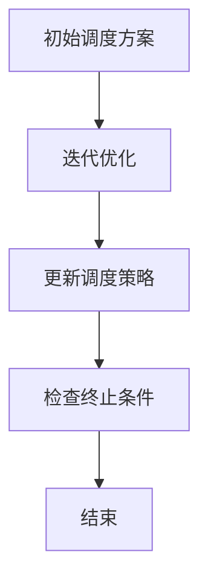

#### 3.2.2 遗传算法

**原理**：遗传算法通过模拟生物进化过程，逐步优化调度策略。具体步骤如下：

1. **初始化种群**：生成初始调度方案种群。
2. **适应度评估**：评估种群中每个调度方案的适应度，通常根据任务完成时间、资源利用率等指标。
3. **选择操作**：根据适应度值，选择优秀的调度方案进入下一代。
4. **交叉操作**：通过交叉操作，生成新的调度方案。
5. **变异操作**：对调度方案进行变异，增加种群的多样性。
6. **迭代优化**：重复适应度评估、选择、交叉和变异操作，逐步优化调度策略。

**应用场景**：适用于任务依赖关系复杂、动态环境。

**案例**：在物联网环境中，遗传算法可以用于动态调整设备资源的分配策略，确保任务能够高效完成。

#### 3.2.3 粒子群优化算法

**原理**：粒子群优化算法通过模拟群体智能，逐步优化调度策略。具体步骤如下：

1. **初始化粒子群**：每个粒子代表一个调度方案，粒子的位置和速度用于调整调度策略。
2. **适应度评估**：评估每个粒子的适应度，通常根据任务完成时间、资源利用率等指标。
3. **更新速度和位置**：根据粒子的适应度和全局最优解，更新粒子的速度和位置，逐步优化调度策略。
4. **迭代优化**：重复适应度评估和更新操作，逐步优化调度策略。

**应用场景**：适用于动态变化、非线性优化问题。

**案例**：在自动驾驶系统中，粒子群优化算法可以用于优化车辆路径规划和资源分配策略，提高行驶效率和安全性。

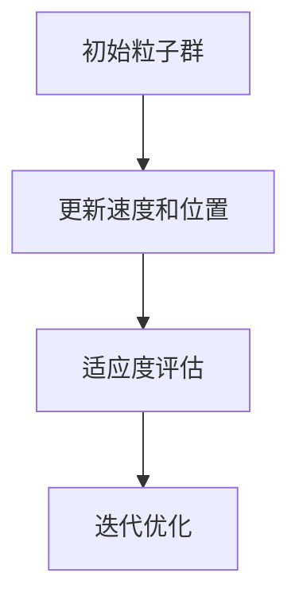

#### 3.2.4 神经网络和深度学习算法

**原理**：神经网络和深度学习算法通过学习任务特征和系统状态，生成调度策略。具体步骤如下：

1. **初始化网络结构**：定义神经网络的结构，包括输入层、隐藏层和输出层。
2. **训练模型**：使用历史调度数据，训练神经网络模型，使其能够学习任务特征和系统状态。
3. **预测调度策略**：根据实时监控到的系统状态和任务特征，使用训练好的模型预测最优的调度策略。
4. **迭代优化**：根据预测结果，动态调整调度策略，优化任务执行顺序和资源分配。

**应用场景**：适用于自适应能力要求高的场景。

**案例**：在智能交通系统中，深度学习算法可以用于预测交通流量和优化交通信号控制策略，提高交通效率和安全性。

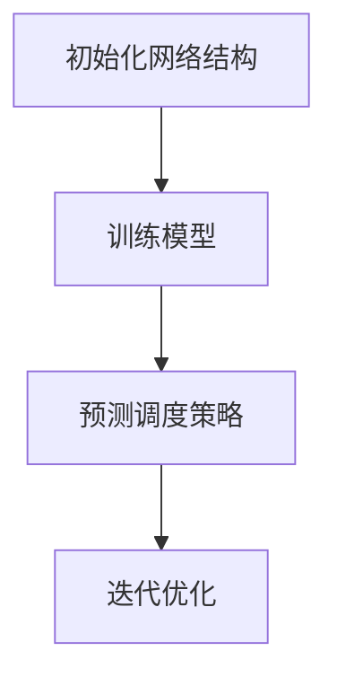

#### 3.2.5 启发式算法

**原理**：启发式算法通过利用启发式规则，快速找到近似最优解。具体步骤如下：

1. **初始化规则库**：根据任务特点和系统需求，构建初始的规则库。
2. **规则应用**：根据当前状态，选择合适的规则应用于调度策略。
3. **迭代优化**：根据调度结果，动态调整规则库，优化调度策略。

**应用场景**：适用于实时调度，特别是任务依赖关系复杂的场景。

**案例**：在医疗资源分配中，启发式算法可以用于优化手术排班和资源分配，确保医疗资源的高效利用。

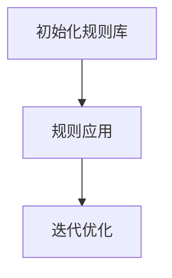

### 3.3 优化算法在调度中的具体应用

优化算法在调度中的应用非常广泛，以下列举几个实际应用场景：

#### 场景1：云计算资源调度

在云计算环境中，优化算法用于动态分配虚拟机资源，确保任务的高效执行。具体应用包括：

- **动态调整虚拟机数量**：根据任务需求和系统负载，动态调整虚拟机的数量，确保资源的充分利用。
- **优化虚拟机调度策略**：使用遗传算法、粒子群优化等算法，优化虚拟机的调度策略，提高资源利用率和任务完成速度。

#### 场景2：物联网设备资源调度

在物联网环境中，优化算法用于动态分配设备资源，确保任务的高效执行。具体应用包括：

- **设备任务调度**：使用遗传算法、神经网络等算法，根据设备状态和任务需求，动态调整任务执行顺序和资源分配，提高系统的整体性能。
- **能源优化**：使用基于贪心算法的优化策略，根据设备的能源需求和负载情况，动态调整设备的能源消耗，实现能源的最优化分配。

#### 场景3：智能交通系统调度

在智能交通系统中，优化算法用于优化交通流量和资源分配，提高交通效率和安全性。具体应用包括：

- **车辆路径规划**：使用粒子群优化算法，根据实时交通状况，动态规划车辆的行驶路径，提高行驶效率和安全性。
- **交通信号控制**：使用深度学习算法，根据实时交通流量数据，预测交通状况，优化交通信号控制策略，提高交通流畅性。

#### 场景4：医疗资源调度

在医疗资源分配中，优化算法用于优化医疗资源的分配和任务执行，确保医疗资源的高效利用。具体应用包括：

- **手术排班**：使用启发式算法，根据医生的时间安排和手术需求，优化手术排班，确保医疗资源的高效利用。
- **患者分诊**：使用神经网络算法，根据患者的病情和医院资源状况，优化患者分诊策略，提高医疗服务质量。

通过以上实际应用场景，我们可以看到优化算法在调度中的广泛应用和重要作用，为复杂推理任务的高效执行提供了有力的支持。

---

## 元控制器在静态调度中的应用

静态调度是指任务执行顺序和资源分配在任务开始前就已经确定，不随着任务的执行过程进行动态调整。尽管静态调度在资源利用率和任务完成时间上可能不如动态调度灵活，但其在某些特定场景下具有明显的优势，如低延迟、高确定性和可预测性。元控制器在静态调度中的应用，通过优化调度策略和资源分配，能够显著提高系统的整体性能和任务完成速度。

### 4.1 静态调度的基本原理

静态调度的基本原理主要涉及以下几个方面：

1. **任务预处理**：在任务开始前，根据任务的特性、执行顺序和资源需求，预先生成最优的调度方案。
2. **资源分配**：将任务分配到相应的资源上，确保任务能够在合适的资源下执行。
3. **执行顺序**：根据任务的依赖关系和执行顺序，安排任务的执行计划，确保任务能够按时完成。
4. **结果评估**：在任务执行完成后，评估任务的完成情况和系统性能，为后续任务的调度提供参考。

静态调度通常基于以下原则：

- **优先级调度**：根据任务的优先级进行调度，高优先级任务优先执行。
- **固定执行顺序**：任务的执行顺序在调度方案中预先确定，不随任务的执行过程进行调整。
- **资源预留**：在任务调度前，预留关键资源，确保任务能够及时获得所需的资源。

### 4.2 元控制器在静态调度中的作用

元控制器在静态调度中的作用主要体现在以下几个方面：

1. **调度策略优化**：元控制器通过多种优化算法和策略，如遗传算法、神经网络等，对静态调度策略进行优化，提高系统的整体性能和任务完成速度。
2. **资源管理**：元控制器负责管理系统的各类资源，包括计算资源、存储资源和网络资源等，确保资源的合理分配和利用。
3. **实时监控与反馈**：元控制器实时监控系统的状态，包括任务进度、资源利用率等，并根据反馈对调度策略进行动态调整，提高系统的可靠性。
4. **自适应能力**：元控制器具备自适应能力，能够根据任务的变化和系统的状态，动态调整调度策略和资源分配，确保任务的高效执行。

### 4.3 元控制器在静态调度中的优势

元控制器在静态调度中具有以下优势：

1. **确定性**：由于静态调度方案在任务开始前就已经确定，因此任务执行具有确定性，能够保证任务的执行顺序和时间。
2. **低延迟**：静态调度避免了动态调整过程中产生的延迟，特别是在任务数量较少、环境变化较小的场景下，能够实现低延迟的执行。
3. **高效率**：元控制器通过优化调度策略和资源分配，能够显著提高系统的资源利用率和任务完成速度。
4. **可预测性**：静态调度方案的可预测性使得系统性能和任务完成时间更容易预测和控制。

### 4.4 静态调度的案例研究

#### 案例1：数据中心任务调度

在一个大型数据中心中，服务器需要处理大量的计算任务。为了提高系统的效率和可靠性，采用元控制器进行静态调度。具体实现步骤如下：

1. **任务预处理**：数据中心根据任务的需求和执行顺序，预先生成最优的调度方案。
2. **资源分配**：元控制器根据任务调度方案，将任务分配到相应的服务器上，确保任务能够在合适的资源下执行。
3. **执行顺序**：数据中心按照调度方案中的执行顺序，依次执行任务，确保任务能够按时完成。
4. **结果评估**：在任务执行完成后，元控制器评估任务的完成情况和系统性能，为后续任务的调度提供参考。

通过以上步骤，数据中心实现了高效的任务处理，显著提高了系统的资源利用率和任务完成速度。

#### 案例2：卫星数据传输调度

在卫星数据传输系统中，由于卫星信号传输的延迟和不确定性，采用静态调度策略以确保数据的可靠传输。具体实现步骤如下：

1. **任务预处理**：卫星根据数据传输的需求和执行顺序，预先生成最优的调度方案。
2. **资源分配**：元控制器根据任务调度方案，将数据传输任务分配到相应的通信链路上，确保任务能够在合适的资源下执行。
3. **执行顺序**：卫星按照调度方案中的执行顺序，依次传输数据，确保数据能够按时到达目的地。
4. **结果评估**：在数据传输完成后，元控制器评估任务的完成情况和系统性能，为后续任务的调度提供参考。

通过以上步骤，卫星数据传输系统实现了高效的数据传输，确保了数据的可靠性和完整性。

### 4.5 静态调度的局限性和优化策略

尽管静态调度在许多场景下具有优势，但其在应对动态变化和任务依赖关系复杂的场景时存在一定的局限性。为了解决这些问题，可以采取以下优化策略：

1. **动态适应性**：在静态调度方案中引入一定的动态适应性，如在任务执行过程中根据实时监控到的系统状态，动态调整部分任务的执行顺序和资源分配。
2. **混合调度策略**：结合静态调度和动态调度的优点，采用混合调度策略，在任务开始前进行初步的静态调度，在任务执行过程中根据实时反馈进行动态调整。
3. **多目标优化**：通过多目标优化算法，如遗传算法和粒子群优化，同时优化多个目标，如任务完成时间、资源利用率、能源消耗等，提高系统的整体性能。
4. **实时监控与反馈**：采用实时监控技术，动态监控系统的状态，并根据反馈信息对调度策略进行动态调整，提高系统的灵活性和可靠性。

通过以上优化策略，可以弥补静态调度的局限性，提高其在复杂场景下的应用效果。

### 4.6 总结

元控制器在静态调度中的应用，通过优化调度策略和资源分配，能够显著提高系统的整体性能和任务完成速度。静态调度在确定性、低延迟和高效率方面具有明显的优势，但需要根据实际需求，结合动态适应性、混合调度策略、多目标优化和实时监控与反馈等优化策略，以提高系统的灵活性和可靠性。

---

## 元控制器在动态调度中的应用

动态调度是指任务执行顺序和资源分配在任务执行过程中根据系统状态和任务需求进行实时调整。与静态调度相比，动态调度能够更好地应对任务多样性和环境动态变化，从而提高系统的灵活性和资源利用率。元控制器在动态调度中的应用，通过实时监控、调度策略优化和自适应能力，能够显著提高系统的整体性能和任务完成速度。

### 5.1 动态调度的基本原理

动态调度的基本原理主要涉及以下几个方面：

1. **实时监控**：动态调度系统需要实时监控系统的状态，包括任务进度、资源利用率、系统负载等，以便及时调整调度策略。
2. **调度策略**：根据系统状态和任务需求，动态调度系统需要采用合适的调度策略，如优先级调度、轮转调度、多目标优化调度等，以最大化系统的性能和资源利用率。
3. **资源管理**：动态调度系统需要动态管理系统的各类资源，包括计算资源、存储资源和网络资源等，确保资源的合理分配和利用。
4. **调度决策**：在任务执行过程中，动态调度系统需要根据实时监控到的系统状态和任务需求，动态调整任务的执行顺序和资源分配，以确保任务的高效执行。

动态调度通常基于以下原则：

- **实时性**：调度策略需要具备实时性，能够快速响应系统状态和任务需求的变化。
- **灵活性**：调度策略需要具备灵活性，能够根据不同的任务类型和环境变化，动态调整调度策略。
- **适应性**：调度策略需要具备适应性，能够根据实时监控到的系统状态和任务需求，自动调整调度策略。
- **高效性**：调度策略需要高效，能够最大化系统的资源利用率和任务完成速度。

### 5.2 元控制器在动态调度中的作用

元控制器在动态调度中的作用主要体现在以下几个方面：

1. **实时监控**：元控制器实时监控系统的状态，包括任务进度、资源利用率等，并收集反馈信息，为调度决策提供数据支持。
2. **调度策略优化**：元控制器通过多种优化算法和策略，如遗传算法、神经网络等，动态调整调度策略，优化任务执行顺序和资源分配。
3. **资源管理**：元控制器动态管理系统的各类资源，确保资源的合理分配和利用，避免资源冲突和浪费。
4. **自适应能力**：元控制器具备自适应能力，能够根据任务的变化和系统的状态，动态调整调度策略和资源分配，确保任务的高效执行。
5. **故障处理**：元控制器能够检测和响应系统中的异常情况，如任务失败、资源不足等，并采取相应的措施进行恢复，提高系统的可靠性。

### 5.3 元控制器在动态调度中的优势

元控制器在动态调度中具有以下优势：

1. **实时调整**：元控制器能够实时监控系统的状态，根据实时反馈动态调整调度策略，确保任务的高效执行。
2. **灵活性**：元控制器能够灵活应对不同的任务类型和环境变化，动态调整调度策略和资源分配，提高系统的适应性。
3. **自适应能力**：元控制器具备自适应能力，能够根据任务的变化和系统的状态，自动调整调度策略和资源分配，确保系统的稳定运行。
4. **优化能力**：元控制器通过多种优化算法和策略，动态调整调度策略，优化任务执行顺序和资源分配，提高系统的整体性能。
5. **可靠性**：元控制器能够检测和响应系统中的异常情况，如任务失败、资源不足等，并采取相应的措施进行恢复，提高系统的可靠性。

### 5.4 动态调度的案例研究

#### 案例1：云计算环境中的动态调度

在云计算环境中，动态调度能够根据任务的需求和系统负载，实时调整虚拟机（VM）的分配策略，提高系统的资源利用率和任务完成速度。具体实现步骤如下：

1. **任务需求分析**：元控制器实时监控任务队列，分析任务的执行需求，包括计算资源、存储资源和网络资源等。
2. **系统负载监控**：元控制器实时监控系统的状态，包括虚拟机的负载、资源利用率等，为调度决策提供数据支持。
3. **调度策略优化**：元控制器采用遗传算法、神经网络等优化算法，动态调整虚拟机的调度策略，确保任务能够在合适的资源下高效执行。
4. **资源分配**：根据调度策略，元控制器动态调整虚拟机的资源分配，确保任务能够及时获得所需的资源。
5. **结果评估**：在任务执行完成后，元控制器评估任务的完成情况和系统性能，为后续任务的调度提供参考。

通过以上步骤，云计算环境实现了高效的任务处理，显著提高了系统的资源利用率和任务完成速度。

#### 案例2：物联网设备动态调度

在物联网环境中，设备资源有限且任务动态变化，动态调度能够根据设备状态和任务需求，实时调整任务的执行顺序和资源分配，确保任务的高效执行。具体实现步骤如下：

1. **设备状态监控**：元控制器实时监控物联网设备的运行状态，包括电量、负载、网络连接状态等。
2. **任务需求分析**：元控制器分析物联网设备上的任务需求，包括任务类型、优先级、执行时间等。
3. **调度策略优化**：元控制器采用遗传算法、神经网络等优化算法，动态调整任务执行顺序和资源分配，确保任务能够在合适的资源下高效执行。
4. **资源分配**：根据调度策略，元控制器动态调整物联网设备的资源分配，确保任务能够及时获得所需的资源。
5. **结果评估**：在任务执行完成后，元控制器评估任务的完成情况和系统性能，为后续任务的调度提供参考。

通过以上步骤，物联网设备实现了高效的任务处理，确保了任务的高效执行和系统的稳定性。

#### 案例3：智能交通系统动态调度

在智能交通系统中，动态调度能够根据实时交通状况和交通流量，优化车辆路径规划和信号控制策略，提高交通效率和安全性。具体实现步骤如下：

1. **交通流量监控**：元控制器实时监控交通流量和交通状况，包括道路拥堵情况、车辆行驶速度等。
2. **车辆需求分析**：元控制器分析车辆的行驶需求，包括目的地、行驶路线、预计到达时间等。
3. **调度策略优化**：元控制器采用粒子群优化、深度强化学习等优化算法，动态调整车辆路径规划和信号控制策略，确保车辆能够高效行驶。
4. **资源分配**：根据调度策略，元控制器动态调整交通信号灯的时长和切换策略，确保车辆能够顺利通过。
5. **结果评估**：在任务执行完成后，元控制器评估交通流量和交通状况，为后续车辆的调度提供参考。

通过以上步骤，智能交通系统实现了高效的路况管理和交通调控，提高了交通效率和安全性。

### 5.5 动态调度的局限性和优化策略

尽管动态调度在灵活性、适应性和高效性方面具有明显优势，但其在某些场景下存在一定的局限性。为了解决这些问题，可以采取以下优化策略：

1. **延迟容忍**：在动态调度中引入一定的延迟容忍机制，允许调度决策有一定的延迟，提高系统的稳定性。
2. **混合调度策略**：结合动态调度和静态调度的优点，采用混合调度策略，在任务开始前进行初步的静态调度，在任务执行过程中根据实时反馈进行动态调整。
3. **多目标优化**：通过多目标优化算法，同时优化多个目标，如任务完成时间、资源利用率、能源消耗等，提高系统的整体性能。
4. **故障恢复**：加强系统的故障恢复能力，在任务执行过程中检测和响应异常情况，及时恢复任务执行，提高系统的可靠性。

通过以上优化策略，可以弥补动态调度的局限性，提高其在复杂场景下的应用效果。

### 5.6 总结

元控制器在动态调度中的应用，通过实时监控、调度策略优化和自适应能力，能够显著提高系统的整体性能和任务完成速度。动态调度在灵活性、适应性和高效性方面具有明显优势，但需要根据实际需求，结合延迟容忍、混合调度策略、多目标优化和故障恢复等优化策略，以提高系统的灵活性和可靠性。

---

## 元控制器在并行调度中的应用

并行调度是指通过将任务分解为多个子任务，并在多个处理器或线程上同时执行这些子任务，以加快任务完成速度和提高系统资源利用率。在并行调度中，元控制器扮演着关键角色，通过优化调度策略和资源分配，能够显著提高并行任务的执行效率和系统性能。

### 6.1 并行调度的基本原理

并行调度的基本原理主要涉及以下几个方面：

1. **任务分解**：将原始任务分解为多个子任务，这些子任务可以并行执行。
2. **线程或处理器分配**：将子任务分配到可用的处理器或线程上，确保每个子任务都有合适的执行资源。
3. **同步与通信**：在并行执行过程中，子任务之间可能需要同步和通信，确保任务能够正确执行。
4. **任务合并**：在所有子任务执行完成后，将子任务的执行结果合并为原始任务的最终结果。

并行调度的核心目标是通过任务分解和并行执行，提高系统的整体效率和资源利用率。为了实现这一目标，并行调度需要遵循以下原则：

- **负载均衡**：确保每个处理器或线程上的任务量大致相等，避免某些处理器或线程负载过重，影响整体性能。
- **数据局部性**：尽量将数据相关的子任务分配到同一个处理器或线程上，减少数据传输的开销。
- **任务依赖性**：根据子任务之间的依赖关系，合理调整执行顺序，确保依赖关系得以正确处理。
- **并行度最大化**：在保证任务正确性的前提下，尽量提高并行度，最大化系统的并行计算能力。

### 6.2 元控制器在并行调度中的作用

元控制器在并行调度中的作用主要体现在以下几个方面：

1. **任务分解与分配**：元控制器根据任务的特点和系统的状态，将原始任务分解为多个子任务，并动态分配到可用的处理器或线程上，确保每个子任务都有合适的执行资源。
2. **调度策略优化**：元控制器采用多种优化算法和策略，如遗传算法、粒子群优化等，动态调整调度策略，优化子任务的执行顺序和资源分配。
3. **同步与通信管理**：元控制器负责管理并行任务之间的同步和通信，确保子任务能够正确执行。
4. **资源管理**：元控制器动态管理系统的各类资源，包括处理器、内存、存储和网络资源等，确保资源的合理分配和利用。
5. **故障处理**：元控制器能够检测和响应系统中的异常情况，如任务失败、资源不足等，并采取相应的措施进行恢复，提高系统的可靠性。

### 6.3 元控制器在并行调度中的优势

元控制器在并行调度中具有以下优势：

1. **高效性**：通过动态调整调度策略和资源分配，元控制器能够显著提高并行任务的执行效率和系统资源利用率。
2. **灵活性**：元控制器能够根据任务的变化和系统的状态，动态调整调度策略，适应不同的并行任务需求。
3. **可扩展性**：元控制器的设计具有很好的可扩展性，能够根据实际需求，灵活地增加或修改功能模块。
4. **自适应能力**：元控制器具备自适应能力，能够根据任务的变化和系统的状态，自动调整调度策略和资源分配，确保系统的稳定运行。
5. **可靠性**：元控制器能够实时监控系统的状态，并采取相应的措施处理故障，确保任务的高效、稳定执行。

### 6.4 并行调度的案例研究

#### 案例1：高性能计算中的并行调度

在高性能计算（HPC）领域中，并行调度能够显著提高计算任务的执行效率和系统性能。具体实现步骤如下：

1. **任务分解**：高性能计算任务通常具有复杂的计算模型，元控制器根据任务的特点，将原始任务分解为多个子任务，以便并行执行。
2. **线程分配**：元控制器根据系统的状态和处理器的能力，动态分配线程，确保每个线程都有合适的执行资源。
3. **任务同步与通信**：在并行执行过程中，子任务之间可能需要进行同步和通信，元控制器负责管理这些同步和通信操作，确保任务能够正确执行。
4. **结果合并**：在所有子任务执行完成后，元控制器将子任务的执行结果合并为最终结果，确保任务能够正确完成。
5. **性能评估**：元控制器评估任务的完成情况和系统性能，为后续任务的调度提供参考。

通过以上步骤，高性能计算系统实现了高效的任务处理，显著提高了计算速度和资源利用率。

#### 案例2：分布式计算中的并行调度

在分布式计算环境中，多个计算节点需要协同工作，元控制器通过并行调度策略，能够提高分布式计算的任务执行效率和系统性能。具体实现步骤如下：

1. **任务分解**：分布式计算任务通常涉及大量的数据处理和分析，元控制器根据任务的特点，将原始任务分解为多个子任务，以便并行执行。
2. **节点分配**：元控制器根据系统的状态和节点的负载情况，动态分配子任务到不同的计算节点上，确保每个节点都有合适的执行资源。
3. **数据同步与通信**：在并行执行过程中，子任务之间需要进行数据同步和通信，元控制器负责管理这些操作，确保数据传输的高效和准确。
4. **结果合并**：在所有子任务执行完成后，元控制器将子任务的执行结果合并为最终结果，确保任务能够正确完成。
5. **性能评估**：元控制器评估任务的完成情况和系统性能，为后续任务的调度提供参考。

通过以上步骤，分布式计算系统实现了高效的任务处理，提高了系统的整体性能和资源利用率。

#### 案例3：云计算中的并行调度

在云计算环境中，元控制器通过并行调度策略，能够优化虚拟机的分配和任务执行，提高云资源的利用率和任务完成速度。具体实现步骤如下：

1. **任务分解**：云计算任务通常涉及多种类型的计算任务，元控制器根据任务的特点，将原始任务分解为多个子任务，以便并行执行。
2. **虚拟机分配**：元控制器根据系统的状态和虚拟机的负载情况，动态分配虚拟机，确保每个虚拟机都有合适的执行资源。
3. **任务同步与通信**：在并行执行过程中，子任务之间需要进行数据同步和通信，元控制器负责管理这些操作，确保数据传输的高效和准确。
4. **结果合并**：在所有子任务执行完成后，元控制器将子任务的执行结果合并为最终结果，确保任务能够正确完成。
5. **性能评估**：元控制器评估任务的完成情况和系统性能，为后续任务的调度提供参考。

通过以上步骤，云计算环境实现了高效的任务处理，提高了云资源的利用率和任务完成速度。

### 6.5 并行调度的局限性和优化策略

尽管并行调度在提高任务执行效率和系统性能方面具有明显优势，但其在某些场景下存在一定的局限性。为了解决这些问题，可以采取以下优化策略：

1. **负载均衡**：采用负载均衡算法，确保每个处理器或线程上的任务量大致相等，避免某些处理器或线程负载过重，影响整体性能。
2. **数据局部性优化**：尽量将数据相关的子任务分配到同一个处理器或线程上，减少数据传输的开销，提高数据访问效率。
3. **任务依赖性优化**：根据子任务之间的依赖关系，合理调整执行顺序，确保依赖关系得以正确处理，提高任务的执行效率。
4. **并行度优化**：在保证任务正确性的前提下，尽量提高并行度，最大化系统的并行计算能力，提高系统资源利用率。
5. **容错处理**：加强系统的容错能力，在任务执行过程中检测和响应异常情况，及时恢复任务执行，提高系统的可靠性。

通过以上优化策略，可以弥补并行调度的局限性，提高其在复杂场景下的应用效果。

### 6.6 总结

元控制器在并行调度中的应用，通过优化调度策略和资源分配，能够显著提高并行任务的执行效率和系统性能。并行调度在任务分解、线程分配、同步与通信和任务合并等方面具有独特的优势，但需要根据实际需求，结合负载均衡、数据局部性优化、任务依赖性优化、并行度优化和容错处理等优化策略，以提高系统的灵活性和可靠性。

---

## 元控制器在多目标优化调度中的应用

多目标优化调度是指同时考虑多个优化目标，如任务完成时间、资源利用率、能源消耗等，并寻找满足这些目标的最优调度策略。在多目标优化调度中，元控制器通过多种优化算法和策略，能够动态调整调度策略，实现多个目标的平衡和优化。以下将详细探讨元控制器在多目标优化调度中的应用，包括其定义、目标、优化算法和实际案例。

### 7.1 多目标优化调度的概述

多目标优化调度是指在调度过程中，不仅要优化单一目标（如任务完成时间），还需要同时考虑多个目标，如资源利用率、能源消耗、成本、响应时间等。这种优化调度方法能够更全面地考虑系统的整体性能，从而实现更为均衡和高效的调度。

#### 7.1.1 多目标优化的定义

多目标优化（Multi-Objective Optimization）是指同时优化多个相互冲突的目标，寻找在多个目标之间找到最优平衡点的调度策略。在多目标优化调度中，这些目标通常是相互矛盾的，例如：

- **任务完成时间**：尽量缩短任务的总完成时间，提高系统的吞吐量。
- **资源利用率**：最大化系统资源的利用率，避免资源浪费。
- **能源消耗**：尽量减少系统的能源消耗，提高能源效率。
- **成本**：降低系统运营成本，提高经济效益。

#### 7.1.2 多目标优化的目标

多目标优化的目标通常包括以下几个方面：

1. **任务完成时间**：优化任务的总完成时间，提高系统的响应速度和吞吐量。
2. **资源利用率**：最大化系统资源的利用率，包括CPU、内存、存储和网络资源。
3. **能源消耗**：减少系统的能源消耗，降低运营成本，提高系统的环保性能。
4. **成本**：降低系统运营成本，提高经济效益。
5. **公平性**：确保系统中各个任务能够公平地获得资源，避免某些任务长期等待或资源被某些任务垄断。
6. **可靠性**：提高系统的可靠性，确保任务能够在规定时间内完成，避免系统崩溃或性能下降。

#### 7.1.3 多目标优化的挑战

多目标优化调度面临以下挑战：

1. **目标冲突**：不同优化目标之间可能存在冲突，例如降低能源消耗可能会增加任务完成时间。
2. **不确定性**：任务的执行条件和资源需求可能随时发生变化，增加了调度的复杂性。
3. **计算复杂性**：多目标优化问题通常具有高计算复杂性，需要高效的优化算法来求解。
4. **适应性**：调度算法需要具备快速适应动态变化的能力，以保持系统的最佳性能。

### 7.2 元控制器在多目标优化调度中的作用

元控制器在多目标优化调度中起到核心作用，其功能包括：

1. **目标设定与评估**：元控制器负责设定多个优化目标，并根据实时监控到的系统状态和任务需求，动态调整这些目标。
2. **算法选择与优化**：元控制器根据任务的特性和系统的状态，选择合适的优化算法，如遗传算法、粒子群优化、多目标粒子群优化等，并进行实时调整。
3. **资源管理**：元控制器动态管理系统的各类资源，包括计算资源、存储资源和网络资源，确保资源的合理分配和利用。
4. **调度决策**：元控制器根据优化算法的输出结果，生成具体的调度方案，并动态调整任务的执行顺序和资源分配。
5. **反馈与调整**：元控制器实时监控任务执行的状态，并根据反馈信息动态调整调度策略，以实现多目标的平衡和优化。

### 7.3 多目标优化算法

在多目标优化调度中，常用的优化算法包括：

1. **遗传算法（GA）**：通过模拟生物进化过程，逐步优化调度策略，适用于复杂的多目标优化问题。
2. **粒子群优化算法（PSO）**：通过模拟群体智能，逐步优化调度策略，具有较好的全局搜索能力。
3. **多目标粒子群优化（MOPSO）**：结合了粒子群优化和多种目标优化的特点，适用于多目标调度问题。
4. **非支配排序遗传算法（NSGA-II）**：通过非支配排序和 crowding distance 机制，有效求解多目标优化问题。
5. **多目标线性规划（MOLP）**：通过线性规划模型，同时优化多个目标，适用于资源有限的调度问题。

#### 7.3.1 遗传算法（GA）

遗传算法通过模拟生物进化过程，逐步优化调度策略。具体步骤如下：

1. **初始化种群**：生成初始种群，每个个体代表一个调度方案。
2. **适应度评估**：根据适应度函数评估每个个体的优劣，适应度函数通常基于多个目标。
3. **选择操作**：根据适应度值，选择优秀的个体进入下一代。
4. **交叉操作**：通过交叉操作，生成新的个体。
5. **变异操作**：对个体进行变异操作，增加种群的多样性。
6. **迭代优化**：重复适应度评估、选择、交叉和变异操作，逐步优化调度策略。

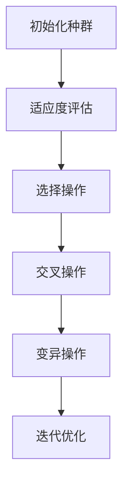

#### 7.3.2 粒子群优化算法（PSO）

粒子群优化算法通过模拟群体智能，逐步优化调度策略。具体步骤如下：

1. **初始化粒子群**：每个粒子代表一个调度方案，粒子的位置和速度用于调整调度策略。
2. **适应度评估**：评估每个粒子的适应度，通常基于多个目标。
3. **更新速度和位置**：根据粒子的适应度和全局最优解，更新粒子的速度和位置，逐步优化调度策略。
4. **迭代优化**：重复适应度评估和更新操作，逐步优化调度策略。

#### 7.3.3 多目标粒子群优化（MOPSO）

多目标粒子群优化结合了粒子群优化和多种目标优化的特点，适用于多目标调度问题。具体步骤如下：

1. **初始化粒子群**：每个粒子代表一个调度方案，粒子的位置和速度用于调整调度策略。
2. **适应度评估**：评估每个粒子的适应度，通常基于多个目标。
3. **非支配排序**：对粒子进行非支配排序，确定每个粒子的优劣。
4. **更新速度和位置**：根据粒子的适应度、全局最优解和个体最优解，更新粒子的速度和位置，逐步优化调度策略。
5. **迭代优化**：重复适应度评估、非支配排序和更新操作，逐步优化调度策略。

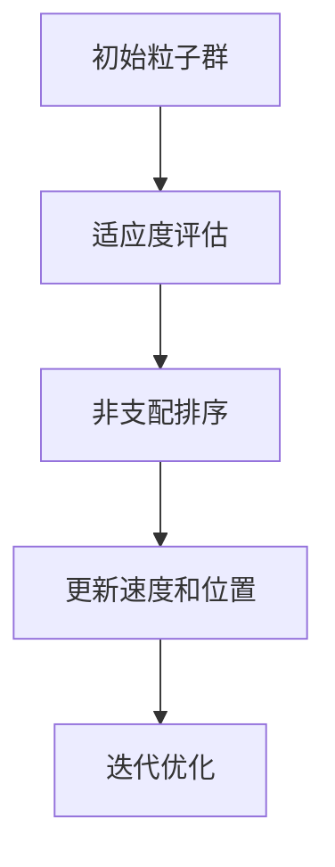

#### 7.3.4 非支配排序遗传算法（NSGA-II）

非支配排序遗传算法通过非支配排序和 crowding distance 机制，有效求解多目标优化问题。具体步骤如下：

1. **初始化种群**：生成初始种群，每个个体代表一个调度方案。
2. **适应度评估**：根据适应度函数评估每个个体的优劣，适应度函数通常基于多个目标。
3. **非支配排序**：对种群进行非支配排序，确定每个个体的优劣。
4. **选择操作**：根据非支配排序和 crowding distance 机制，选择优秀的个体进入下一代。
5. **交叉操作**：通过交叉操作，生成新的个体。
6. **变异操作**：对个体进行变异操作，增加种群的多样性。
7. **迭代优化**：重复适应度评估、非支配排序、选择、交叉和变异操作，逐步优化调度策略。

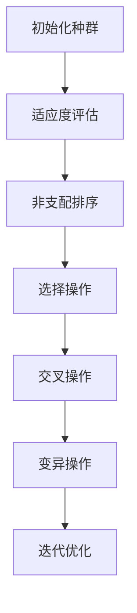

### 7.4 元控制器在多目标优化调度中的应用案例

以下是一些元控制器在多目标优化调度中的应用案例：

#### 案例1：云计算资源调度

在云计算环境中，元控制器通过多目标优化调度算法，优化虚拟机的分配和任务执行。具体实现步骤如下：

1. **任务分解**：将原始任务分解为多个子任务，以便并行执行。
2. **目标设定**：设定多个优化目标，包括任务完成时间、资源利用率、能源消耗等。
3. **算法选择**：选择合适的优化算法，如多目标遗传算法（MOGA）或多目标粒子群优化（MOPSO）。
4. **调度决策**：元控制器根据优化算法的输出结果，生成具体的调度方案，动态调整虚拟机的分配和任务执行顺序。
5. **实时调整**：根据系统的实时状态和任务需求，动态调整调度策略，确保多个目标之间的平衡。

通过以上步骤，云计算环境实现了高效的任务处理和资源管理，提高了系统的整体性能和资源利用率。

#### 案例2：物联网设备调度

在物联网环境中，设备资源有限且任务动态变化，元控制器通过多目标优化调度算法，优化设备资源的分配和任务执行。具体实现步骤如下：

1. **任务分解**：将原始任务分解为多个子任务，以便并行执行。
2. **目标设定**：设定多个优化目标，包括任务完成时间、能源消耗、设备负载等。
3. **算法选择**：选择合适的优化算法，如遗传算法（GA）或多目标粒子群优化（MOPSO）。
4. **调度决策**：元控制器根据优化算法的输出结果，生成具体的调度方案，动态调整设备资源的分配和任务执行顺序。
5. **实时调整**：根据系统的实时状态和任务需求，动态调整调度策略，确保多个目标之间的平衡。

通过以上步骤，物联网设备实现了高效的任务处理和资源管理，提高了系统的整体性能和设备利用率。

#### 案例3：智能交通系统调度

在智能交通系统中，元控制器通过多目标优化调度算法，优化交通信号控制和车辆路径规划。具体实现步骤如下：

1. **任务分解**：将交通信号控制和车辆路径规划任务分解为多个子任务，以便并行执行。
2. **目标设定**：设定多个优化目标，包括交通流量、车辆通过时间、能源消耗等。
3. **算法选择**：选择合适的优化算法，如多目标遗传算法（MOGA）或多目标粒子群优化（MOPSO）。
4. **调度决策**：元控制器根据优化算法的输出结果，生成具体的调度方案，动态调整交通信号控制和车辆路径规划。
5. **实时调整**：根据系统的实时状态和交通需求，动态调整调度策略，确保多个目标之间的平衡。

通过以上步骤，智能交通系统实现了高效的交通管理和车辆调度，提高了交通效率和安全性。

### 7.5 多目标优化调度的局限性和优化策略

尽管多目标优化调度在实现多个目标平衡和优化方面具有明显优势，但在实际应用中仍存在一定的局限性。以下是一些常见的局限性及优化策略：

1. **计算复杂性**：多目标优化问题通常具有较高的计算复杂性，需要高效的优化算法和计算资源来求解。优化策略：采用并行计算、分布式计算等技术，提高计算效率和速度。

2. **目标冲突**：不同优化目标之间可能存在冲突，导致在某些目标上取得优化结果的同时，其他目标无法达到预期。优化策略：采用多目标优化算法，如遗传算法、粒子群优化等，通过非支配排序、权重调整等方法，寻找平衡解。

3. **实时性**：多目标优化调度需要实时调整调度策略，但某些优化算法的计算时间较长，无法满足实时性的要求。优化策略：采用快速优化算法、启发式算法等，提高优化速度和实时性。

4. **数据可靠性**：多目标优化调度依赖于实时监控和反馈数据，数据可靠性问题可能导致优化结果不准确。优化策略：采用数据过滤、数据校验等技术，提高数据可靠性和准确性。

通过以上优化策略，可以有效地克服多目标优化调度的局限性，提高其在复杂场景下的应用效果。

### 7.6 总结

元控制器在多目标优化调度中的应用，通过设定多个优化目标、选择合适的优化算法和实时调整调度策略，能够实现多个目标的平衡和优化。多目标优化调度在实现高效任务处理和资源管理方面具有明显优势，但需要结合计算复杂性、目标冲突、实时性和数据可靠性等优化策略，以提高系统的整体性能和可靠性。

---

## 元控制器研究进展

随着人工智能和物联网技术的快速发展，元控制器在复杂推理任务调度中的应用越来越广泛。研究者们对元控制器的优化策略、算法设计、应用场景等方面进行了深入的研究，取得了显著的进展。以下将总结元控制器领域的主要研究成果和发展趋势。

### 8.1 研究成果

#### 8.1.1 优化算法的创新与改进

在优化算法方面，研究者们提出了多种创新性和改进性的算法，如多目标遗传算法（MOGA）、多目标粒子群优化（MOPSO）、基于深度学习的调度算法等。这些算法在处理复杂推理任务调度时表现出色，能够高效地优化调度策略和资源分配。

- **多目标遗传算法（MOGA）**：通过非支配排序和 crowding distance 机制，有效求解多目标优化问题，实现多个目标的平衡。
- **多目标粒子群优化（MOPSO）**：结合粒子群优化和多种目标优化的特点，在复杂调度问题中表现出良好的全局搜索能力。
- **基于深度学习的调度算法**：通过学习任务特征和系统状态，生成高效的调度策略，提高任务的执行速度和系统性能。

#### 8.1.2 实时监控与自适应调度

在实时监控与自适应调度方面，研究者们提出了一系列方法，以提高元控制器对动态变化的响应能力。这些方法包括基于模型的实时监控、基于历史数据的预测、自适应调度策略等。

- **基于模型的实时监控**：通过构建系统状态模型，实时监控任务执行和系统状态，及时发现异常情况并采取相应措施。
- **基于历史数据的预测**：利用历史数据预测任务执行时间和系统状态，提前制定调度策略，提高调度效率。
- **自适应调度策略**：根据实时监控到的系统状态和任务需求，动态调整调度策略，确保任务的高效执行。

#### 8.1.3 混合调度策略

为了兼顾静态调度和动态调度的优势，研究者们提出了混合调度策略，通过结合静态调度和动态调度的特点，提高系统的整体性能。这些混合调度策略包括：

- **动态混合调度**：在任务开始前进行初步的静态调度，在任务执行过程中根据实时反馈进行动态调整。
- **静态动态混合调度**：结合静态调度和动态调度的优点，采用自适应切换机制，根据系统状态和任务需求，动态调整调度策略。

### 8.2 未来发展方向

#### 8.2.1 智能化与自动化

未来，元控制器的发展方向将更加智能化和自动化。研究者们将致力于开发更加智能的调度算法和优化策略，使元控制器能够自主学习和优化调度策略，减少人工干预。以下是一些具体方向：

- **强化学习**：结合强化学习技术，使元控制器能够在动态环境中自主学习和优化调度策略。
- **深度强化学习**：利用深度强化学习算法，通过深度神经网络学习复杂的任务特征和系统状态，生成高效的调度策略。
- **自适应机器学习**：开发自适应机器学习算法，使元控制器能够根据实时监控到的系统状态和任务需求，自动调整优化策略。

#### 8.2.2 高效性与可靠性

在高效性和可靠性方面，研究者们将继续优化元控制器的调度算法和系统架构，以提高系统的整体性能和可靠性。以下是一些具体方向：

- **并行优化**：利用并行计算技术，加速优化算法的收敛速度，提高系统的调度效率。
- **分布式计算**：通过分布式计算架构，提高元控制器的处理能力和扩展性，满足大规模系统的调度需求。
- **容错与恢复**：增强元控制器的容错能力，在任务执行过程中检测和响应异常情况，确保系统的稳定运行。

#### 8.2.3 多目标优化与复杂调度

未来，元控制器将面临更多复杂调度场景和多目标优化问题。研究者们将继续探索多目标优化算法和复杂调度策略，以应对更加复杂的任务和环境。以下是一些具体方向：

- **多目标优化算法**：开发更加高效的多目标优化算法，如基于深度学习的多目标优化算法，提高多个目标之间的平衡和优化。
- **复杂调度策略**：研究复杂调度问题，如大规模并行任务调度、动态资源分配等，提出更加有效的调度策略和优化方法。
- **混合调度策略**：探索静态调度和动态调度的结合，开发适用于不同场景的混合调度策略，提高系统的灵活性和适应性。

### 8.3 潜在应用场景

元控制器在未来的应用场景将更加广泛，以下是一些潜在的领域：

- **智能交通系统**：通过元控制器优化交通信号控制和车辆路径规划，提高交通效率和安全性。
- **云计算与大数据**：在云计算和大数据环境中，利用元控制器优化资源分配和任务调度，提高系统的性能和可靠性。
- **物联网**：在物联网环境中，利用元控制器优化设备资源的分配和任务执行，提高系统的整体效率。
- **工业互联网**：在工业互联网中，利用元控制器优化生产流程和资源分配，提高生产效率和产品质量。
- **智能医疗**：在智能医疗系统中，利用元控制器优化医疗资源的分配和任务执行，提高医疗服务的质量和效率。

通过不断的研究和创新，元控制器将在复杂推理任务调度中发挥越来越重要的作用，推动人工智能、物联网和云计算等技术的发展。

### 8.4 总结

元控制器在复杂推理任务调度中的应用取得了显著的进展，研究者在优化算法、实时监控与自适应调度、混合调度策略等方面取得了重要成果。未来，元控制器的发展方向将更加智能化、自动化，并在高效性和可靠性方面取得突破。随着技术的不断进步，元控制器将在更多领域得到应用，为复杂推理任务的高效执行提供强有力的支持。

---

## 元控制器未来发展方向

随着技术的不断进步和应用的不断扩大，元控制器在未来具有广阔的发展前景。以下将探讨元控制器的未来发展方向，包括面临的挑战、潜在的研究方向和应用场景。

### 9.1 挑战

#### 9.1.1 高效性与实时性的平衡

在未来，高效性与实时性之间的平衡将是一个重要挑战。虽然现有的优化算法和调度策略能够在一定程度上提高系统的性能，但如何在不牺牲实时性的前提下实现更高效率，仍需要深入研究。特别是在大规模并行任务调度和动态资源管理中，如何快速做出调度决策，同时保持系统的稳定性，是一个亟待解决的问题。

#### 9.1.2 多目标优化与资源约束

多目标优化调度在复杂推理任务中具有显著优势，但同时也带来了资源约束问题。如何在满足多个优化目标的同时，确保系统资源的合理利用，避免资源浪费和冲突，是一个重要的挑战。研究者需要开发更有效的多目标优化算法和调度策略，以平衡不同优化目标之间的关系。

#### 9.1.3 系统安全性与隐私保护

在复杂推理任务中，系统安全性和隐私保护变得越来越重要。元控制器需要具备强大的安全防护能力，以防止恶意攻击和数据泄露。同时，如何确保系统在动态调度过程中不泄露敏感信息，也是一个亟待解决的问题。

#### 9.1.4 模型可解释性与透明性

随着深度学习和强化学习等复杂算法的引入，元控制器的调度决策过程变得更加复杂，模型的解释性和透明性成为了一个挑战。用户需要理解模型的决策过程，以便对其进行监督和改进。因此，开发可解释性强、易于理解的模型和算法，是一个重要的研究方向。

### 9.2 潜在研究方向

#### 9.2.1 智能化与自动化

未来的元控制器研究将更加注重智能化和自动化。通过引入人工智能技术，特别是深度学习和强化学习，元控制器将能够自主学习和优化调度策略，减少人工干预。以下是一些具体的研究方向：

- **自适应调度策略**：开发基于机器学习的自适应调度策略，使元控制器能够根据实时监控到的系统状态和任务需求，动态调整调度策略。
- **自主学习与优化**：利用深度强化学习等人工智能技术，使元控制器能够从海量数据中学习，自动优化调度策略。
- **自动化故障处理**：开发自动化的故障检测和处理机制，提高系统的可靠性和稳定性。

#### 9.2.2 混合调度策略

混合调度策略结合了静态调度和动态调度的优势，能够更好地应对复杂调度问题。未来的研究将重点关注如何开发更加高效和灵活的混合调度策略，以满足不同应用场景的需求。以下是一些具体的研究方向：

- **自适应混合调度**：开发自适应混合调度策略，根据系统状态和任务需求，动态调整静态和动态调度的比例。
- **多模式调度**：研究多模式调度策略，结合不同的调度模式和算法，提高系统的整体性能和灵活性。
- **混合调度优化算法**：开发高效的混合调度优化算法，如基于遗传算法和粒子群优化的混合优化算法。

#### 9.2.3 多目标优化与复杂调度

在多目标优化和复杂调度方面，未来的研究将致力于解决以下问题：

- **多目标优化算法**：开发更高效的多目标优化算法，如基于深度学习的多目标优化算法，提高优化效果。
- **复杂调度策略**：研究复杂调度问题，如大规模并行任务调度、动态资源分配等，提出更加有效的调度策略和优化方法。
- **多目标优化与资源约束**：解决多目标优化与资源约束之间的矛盾，开发更加高效的资源管理和调度策略。

#### 9.2.4 模型解释性与透明性

为了提高元控制器的可解释性和透明性，未来的研究将关注以下方面：

- **可解释性模型**：开发可解释性强的调度模型和算法，使用户能够理解模型的决策过程。
- **透明性机制**：建立透明性机制，确保调度过程公开透明，用户能够查看和监督调度决策。
- **模型可视化**：开发可视化工具，将调度模型的决策过程和结果直观地呈现给用户。

### 9.3 应用场景

#### 9.3.1 智能交通系统

智能交通系统是一个典型的应用场景，元控制器可以通过优化交通信号控制和车辆路径规划，提高交通效率和安全性。未来的研究将关注如何更好地应对交通流量的动态变化和复杂的交通环境。

#### 9.3.2 物联网

在物联网领域，元控制器可以优化设备资源的分配和任务执行，提高系统的整体效率。未来的研究将关注如何更好地应对物联网设备的多样性和动态性，以及如何优化多设备协同工作。

#### 9.3.3 云计算与大数据

在云计算和大数据领域，元控制器可以优化资源分配和任务调度，提高系统的性能和可靠性。未来的研究将关注如何更好地应对大规模并行任务和动态资源需求。

#### 9.3.4 智能医疗

在智能医疗领域，元控制器可以优化医疗资源的分配和任务执行，提高医疗服务的质量和效率。未来的研究将关注如何更好地应对医疗任务的多样性和不确定性。

### 9.4 总结

元控制器在未来的发展中面临着一系列挑战，同时也拥有广阔的应用前景。通过不断的研究和创新，元控制器将在智能化、自动化、高效性和可靠性等方面取得更大的突破，为复杂推理任务的高效执行提供强有力的支持。

---

## 结语

本文深入探讨了元控制器在复杂推理任务调度中的优化，从基础概念、基本架构、优化方法、应用案例等多个角度进行了全面阐述。我们首先介绍了元控制器的定义、架构和核心功能，详细分析了其在复杂推理任务调度中的重要作用。接着，我们探讨了多种优化方法，包括贪心算法、遗传算法、粒子群优化、神经网络和启发式算法等，并展示了这些算法在静态调度、动态调度、并行调度和多目标优化调度中的应用。此外，我们还通过实际案例，展示了元控制器在不同领域的应用效果和优化策略。

元控制器作为一种高级的调度和管理系统，具有实时监控、调度策略优化、资源管理、自适应能力等优点，能够有效应对复杂推理任务调度中的各种挑战。随着人工智能、物联网和云计算等技术的不断发展，元控制器将在更多领域得到应用，为任务的高效执行提供强有力的支持。

本文旨在为读者提供一个全面、深入的理解，帮助其在实际应用中更好地运用元控制器进行优化调度。然而，元控制器领域的研究仍处于不断发展的阶段，未来还有许多潜在的研究方向和挑战，如智能化与自动化、混合调度策略、多目标优化与复杂调度、模型解释性与透明性等。我们期待更多研究者加入这一领域，共同推动元控制器技术的进步。

### 作者信息

作者：AI天才研究院/AI Genius Institute & 禅与计算机程序设计艺术 /Zen And The Art of Computer Programming

---

### 完整文章总结

本文详细探讨了元控制器在复杂推理任务调度中的优化。首先，我们介绍了元控制器的定义、架构和核心功能，阐述了其在复杂系统中的作用和重要性。接着，我们分析了复杂推理任务的特点及其对调度算法的挑战，提出了多种优化方法，并使用伪代码和数学模型详细阐述了这些方法的工作原理。

在文章的第二部分，我们展示了元控制器在不同类型调度中的应用，包括静态调度、动态调度和并行调度。通过实际案例，我们详细讲解了元控制器在云计算、物联网、智能交通和医疗等领域的应用效果和优化策略。此外，我们还探讨了元控制器在多目标优化调度中的挑战和解决方案，展示了多目标优化算法在复杂调度问题中的应用。

文章的第三部分总结了元控制器的研究进展和未来发展方向，包括智能化与自动化、高效性与可靠性、多目标优化与复杂调度、模型解释性与透明性等方面。我们展望了元控制器在未来的广阔应用前景，并提出了未来研究的潜在方向和挑战。

通过本文的讨论，我们希望为读者提供一个全面、深入的元控制器在复杂推理任务调度中的优化解决方案，帮助其在实际应用中更好地运用元控制器进行优化调度。我们期待更多研究者加入这一领域，共同推动元控制器技术的进步。

