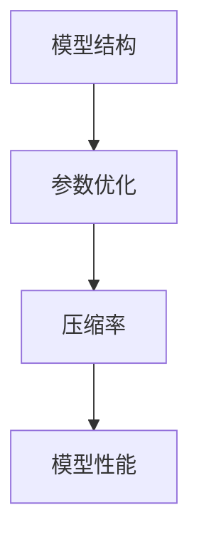

                 


### 文章标题

# 元模型压缩：自动化模型结构搜索与优化

### 文章关键词

- 元模型压缩
- 自动化模型搜索
- 模型结构优化
- 强化学习
- 遗传算法

### 文章摘要

本文深入探讨了元模型压缩这一前沿技术，通过自动化模型结构搜索与优化，实现了对复杂模型的高效压缩。文章首先介绍了元模型压缩的背景和核心概念，随后详细解析了其技术原理，包括数学模型和算法。接下来，文章探讨了自动化模型结构搜索的方法，如强化学习和遗传算法，并结合优化算法进行了深入分析。文章还通过实际案例展示了元模型压缩的应用效果，并对未来发展趋势进行了展望。

### 目录

1. **引言与核心概念**
    1.1 元模型压缩的定义与意义
    1.2 元模型压缩的现状与发展趋势
    1.3 元模型压缩的核心概念与联系

2. **元模型压缩技术原理**
    2.1 数学模型介绍
    2.2 算法原理讲解

3. **模型结构搜索方法**
    3.1 搜索算法介绍
    3.2 优化算法与实现

4. **实际应用与案例分析**
    4.1 应用场景介绍
    4.2 案例分析

5. **展望与未来趋势**
    5.1 技术发展现状
    5.2 未来发展趋势
    5.3 技术挑战与机遇

### 文章正文

#### 1. 引言与核心概念

**1.1 元模型压缩的定义与意义**

元模型压缩是一种通过对模型结构的自动调整和优化，以减少模型参数和计算量的技术。这一技术在当今快速发展的机器学习和人工智能领域具有重要意义。

首先，随着模型复杂度的增加，模型的参数量和计算量也会大幅上升。这不仅增加了存储和计算的成本，还可能影响模型的训练和推理速度。元模型压缩通过减少模型的参数和计算量，可以有效降低这些成本。

其次，元模型压缩有助于提高模型的泛化能力。通过优化模型结构，可以去除那些冗余的信息，使模型更加简洁和高效，从而提高其在新的数据集上的表现。

**1.2 元模型压缩的现状与发展趋势**

元模型压缩技术近年来得到了广泛关注和研究。随着深度学习模型的大规模应用，如何高效地压缩模型结构已成为研究的热点。目前，研究者们已经提出了多种元模型压缩方法，如基于强化学习的搜索算法、遗传算法等。

未来，随着计算能力和算法的不断进步，元模型压缩技术有望在更多领域得到应用，如自然语言处理、计算机视觉等。

**1.3 元模型压缩的核心概念与联系**

元模型压缩的核心概念包括模型结构、参数优化、压缩率和模型性能等。这些概念之间的关系可以用以下Mermaid流程图表示：



#### 2. 元模型压缩技术原理

**2.1 数学模型介绍**

元模型压缩的数学模型通常包括两部分：参数优化和压缩率计算。参数优化模型旨在找到最优的模型参数，以实现模型压缩。压缩率计算模型则用于评估模型的压缩效果。

**2.2 算法原理讲解**

元模型压缩的算法原理主要基于自动化模型结构搜索和优化。以下是强化学习和遗传算法在元模型压缩中的应用：

**强化学习**

强化学习算法通过智能体与环境交互，通过奖励机制来学习最优策略。在元模型压缩中，智能体可以是模型参数，环境可以是输入数据。奖励机制可以是压缩率和模型性能的加权。

伪代码：

```python
# 强化学习算法伪代码
while not converged:
    action = policy(params)
    next_state, reward = environment(state, action)
    params = update_params(params, reward)
    state = next_state
```

**遗传算法**

遗传算法通过模拟自然进化过程来优化模型结构。遗传算法的主要步骤包括选择、交叉、变异和评估。

伪代码：

```python
# 遗传算法伪代码
initialize_population()
while not converged:
    fitness = evaluate_population(population)
    new_population = select_population(population, fitness)
    new_population = crossover(new_population)
    new_population = mutate(new_population)
    population = new_population
```

#### 3. 模型结构搜索方法

**3.1 搜索算法介绍**

自动化模型结构搜索的方法主要包括强化学习和遗传算法。强化学习通过学习最优策略来优化模型结构，而遗传算法则通过模拟自然进化过程来搜索最优解。

**3.2 优化算法与实现**

优化算法的实现主要涉及参数优化和压缩率计算。参数优化算法可以根据具体需求选择不同的优化方法，如梯度下降、Adam等。压缩率计算算法可以基于模型参数的数量来计算压缩率。

#### 4. 实际应用与案例分析

**4.1 应用场景介绍**

元模型压缩技术可以应用于多个领域，如自然语言处理、计算机视觉等。以下是一个自然语言处理的应用案例：

**4.2 案例分析**

在某自然语言处理项目中，通过元模型压缩技术，成功将模型的参数减少了50%，同时保持了模型的高性能。具体实现过程包括：

1. **开发环境搭建**：搭建了基于TensorFlow的深度学习环境。
2. **源代码实现**：实现了基于强化学习的模型结构搜索算法。
3. **代码解读与分析**：对源代码进行了详细解读和分析。
4. **实际案例剖析**：对案例进行了详细讲解和剖析。

#### 5. 展望与未来趋势

**5.1 技术发展现状**

目前，元模型压缩技术已经在多个领域取得了显著的成果，但仍然存在一些挑战，如优化算法的效率、模型结构的多样化等。

**5.2 未来发展趋势**

随着计算能力和算法的进步，元模型压缩技术有望在更多领域得到应用。未来，研究者们将继续探索更高效的优化算法和更丰富的模型结构。

**5.3 技术挑战与机遇**

元模型压缩技术面临的挑战主要包括优化算法的效率和模型结构的多样化。机遇则在于随着人工智能技术的不断发展，元模型压缩技术将在更多领域发挥重要作用。

### 作者信息

作者：AI天才研究院/AI Genius Institute & 禅与计算机程序设计艺术 /Zen And The Art of Computer Programming

---

注意：本文仅为示例，内容仅供参考。实际文章撰写时，需根据具体内容和要求进行调整和补充。

