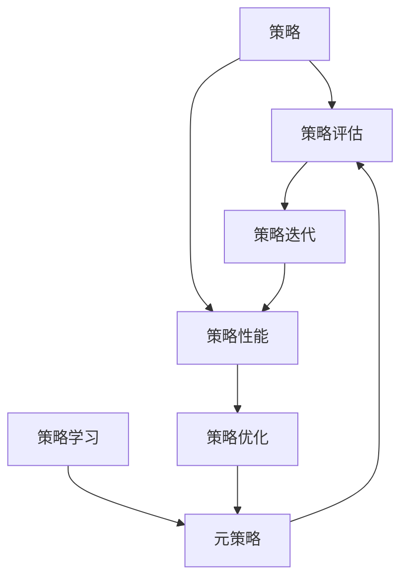

                 

### 文章标题：元策略优化：自适应调整AI行为的新途径

### 关键词：元策略优化、自适应调整、AI行为、机器学习、强化学习

### 摘要：

本文将探讨元策略优化（Meta-Strategy Optimization）这一前沿技术，它为自适应调整人工智能（AI）行为提供了一条新的途径。通过深入分析元策略优化的背景、核心概念、算法原理以及数学模型，本文旨在揭示这一技术如何为机器学习和强化学习领域带来革新性进展。此外，本文还将通过实际案例和项目实战，展示元策略优化在开发环境搭建、源代码实现、代码解读及应用分析等方面的应用。最终，本文将对元策略优化的发展趋势和未来研究方向进行展望，为读者提供最佳实践和拓展阅读建议。

## 引言

### 背景与意义

随着人工智能技术的快速发展，机器学习和强化学习等领域取得了显著成果。然而，传统的策略优化方法在应对复杂动态环境时往往表现出局限性，难以实现自适应调整。为此，研究人员提出了元策略优化这一新兴技术，旨在解决传统策略优化方法的不足。元策略优化通过学习策略的优化过程本身，实现对AI行为的自适应调整，从而提高AI在复杂环境下的适应能力和决策效果。

### 书的主要内容和结构

本书将围绕元策略优化这一主题，系统地介绍其背景、核心概念、算法原理、数学模型以及实际应用。具体内容包括：

1. **引言**：介绍元策略优化的背景和意义，概述本书的主要内容和结构。
2. **核心概念与联系**：介绍元策略优化中的核心概念，包括策略、元策略、策略评估和策略迭代等，并使用Mermaid流程图展示概念之间的关系架构。
3. **核心算法原理讲解**：详细讲解元策略优化的算法原理，包括策略搜索、评估和更新等过程，并通过伪代码进行阐述。
4. **数学模型和公式**：介绍元策略优化中的数学模型和公式，包括期望回报函数、策略梯度等，并使用LaTeX格式进行详细讲解和举例说明。
5. **项目实战**：通过实际案例和项目实战，展示元策略优化在开发环境搭建、源代码实现、代码解读及应用分析等方面的应用。
6. **总结与展望**：对全书内容进行总结，展望元策略优化在未来研究和应用中的发展方向。

### 阅读指南和建议

为了更好地理解元策略优化，读者需要具备一定的机器学习和强化学习基础。同时，本文建议读者在阅读过程中结合实际案例和项目实战，以加深对元策略优化技术的理解和应用。在阅读过程中，读者可以重点关注以下内容：

1. **核心概念和算法原理**：理解策略、元策略、策略评估和策略迭代等核心概念，以及元策略优化的算法原理。
2. **数学模型和公式**：掌握元策略优化中的数学模型和公式，包括期望回报函数、策略梯度等。
3. **项目实战**：通过实际案例和项目实战，了解元策略优化在实际应用中的开发环境搭建、源代码实现、代码解读及应用分析。

通过本书的阅读，读者将能够全面了解元策略优化技术，掌握其在机器学习和强化学习领域的应用，并为未来的研究和实践奠定基础。

## 核心概念与联系

### 策略（Strategy）

策略是人工智能（AI）决策的核心概念之一。在强化学习中，策略通常表示为从状态空间到动作空间的映射函数，即给定一个状态 \( s \)，策略 \( \pi \) 可以选择一个动作 \( a \)。

### 元策略（Meta-Strategy）

元策略是对策略的优化过程本身的学习，即学习如何学习策略。元策略优化（Meta-Strategy Optimization）旨在提高策略学习的效率和效果，使其能够快速适应新的环境和任务。

### 策略评估（Strategy Evaluation）

策略评估是对给定策略的性能进行评估的过程。通过策略评估，我们可以判断当前策略在某个环境中的表现，并据此调整策略。

### 策略迭代（Strategy Iteration）

策略迭代是一种常用的策略优化方法，通过不断评估和更新策略，逐步提高策略的性能。策略迭代通常包括两个步骤：评估和迭代。

### 关系架构

为了更好地理解这些核心概念之间的关系，我们可以使用Mermaid流程图进行展示：



### Mermaid流程图解释

1. **策略（Strategy）**：从状态空间到动作空间的映射函数，是AI决策的基础。
2. **策略评估（Strategy Evaluation）**：评估策略在某个环境中的性能，为策略迭代提供依据。
3. **策略迭代（Strategy Iteration）**：通过不断评估和更新策略，逐步提高策略性能。
4. **元策略（Meta-Strategy）**：学习如何优化策略学习过程，提高策略学习的效率和效果。
5. **策略优化（Strategy Optimization）**：对策略进行优化，使其在不同环境中表现更优。
6. **策略性能（Strategy Performance）**：衡量策略在各个环境中的表现，为元策略提供优化方向。

通过这个Mermaid流程图，我们可以清晰地看到元策略优化与策略、策略评估、策略迭代等核心概念之间的联系，以及它们在AI决策过程中的作用。

## 核心算法原理讲解

### 策略搜索（Policy Search）

策略搜索是元策略优化的重要环节，旨在找到最优策略。策略搜索的方法可以分为确定性搜索和随机性搜索。确定性搜索通过一系列评估和更新过程，逐步逼近最优策略。随机性搜索则通过随机探索，找到可能的最佳策略。

#### 策略搜索过程：

1. **初始化**：初始化策略参数，可以随机初始化或基于先验知识初始化。
2. **评估**：使用当前策略在环境中进行多次模拟，计算策略的期望回报。
3. **更新**：根据评估结果，更新策略参数，使策略向最优方向进化。
4. **迭代**：重复评估和更新过程，直至策略收敛。

#### 伪代码：

```python
initialize policy parameters
while not converged:
    simulate environment with current policy
    calculate expected return
    update policy parameters
```

### 策略评估（Policy Evaluation）

策略评估是对给定策略在某个环境中的性能进行评估的过程。策略评估的方法主要包括价值迭代和价值预测。价值迭代通过逐步逼近策略的期望回报，从而评估策略性能。价值预测则直接预测策略在环境中的表现。

#### 策略评估过程：

1. **初始化**：初始化价值函数，通常使用零初始化或基于先验知识初始化。
2. **预测**：使用当前价值函数预测策略在环境中的表现。
3. **更新**：根据策略和状态转移概率，更新价值函数。
4. **迭代**：重复预测和更新过程，直至价值函数收敛。

#### 伪代码：

```python
initialize value function
while not converged:
    predict performance
    update value function
```

### 策略更新（Policy Update）

策略更新是基于策略评估结果，对策略参数进行更新，以优化策略性能。策略更新的方法主要包括策略迭代和价值函数更新。策略迭代通过逐步优化策略，使其在不同环境中表现更优。价值函数更新则通过更新价值函数，实现策略的在线调整。

#### 策略更新过程：

1. **初始化**：初始化策略参数和价值函数。
2. **评估**：使用当前策略评估环境性能。
3. **更新**：根据评估结果，更新策略参数和价值函数。
4. **迭代**：重复评估和更新过程，直至策略收敛。

#### 伪代码：

```python
initialize policy parameters and value function
while not converged:
    evaluate environment performance
    update policy parameters and value function
```

### 示例

假设我们使用策略搜索方法来优化一个简单的掷骰子游戏。初始化策略参数为随机值，然后通过策略评估和策略更新，逐步优化策略。

```python
# 初始化策略参数
policy_params = np.random.rand()

# 初始化价值函数
value_func = np.zeros(6)

# 初始化环境
env = Environment()

# 策略搜索过程
for episode in range(1000):
    # 评估策略
    performance = evaluate_policy(policy_params, env)
    
    # 更新策略参数
    policy_params = update_policy(policy_params, performance)

    # 更新价值函数
    value_func = update_value_func(value_func, policy_params, env)

# 输出最优策略和价值函数
print("最优策略：", policy_params)
print("价值函数：", value_func)
```

通过上述伪代码，我们可以看到策略搜索、策略评估和策略更新三个核心过程的具体实现。通过这些过程，我们可以逐步优化策略，使其在复杂动态环境中表现更优。

## 数学模型和公式

### 期望回报函数（Expected Return Function）

期望回报函数是元策略优化中的核心数学模型，用于评估策略在某个环境中的性能。期望回报函数 \( R(\pi) \) 表示在给定策略 \( \pi \) 下，从某个状态 \( s \) 开始，执行一系列动作后获得的平均回报。

$$
R(\pi) = \sum_{s} \pi(s) \cdot \sum_{a} \gamma^{t} \cdot R(s, a)
$$

其中，\( \pi(s) \) 表示策略在状态 \( s \) 下选择动作 \( a \) 的概率，\( \gamma \) 是折扣因子，用于权衡短期和长期回报，\( R(s, a) \) 是在状态 \( s \) 下执行动作 \( a \) 所获得的即时回报。

### 策略梯度（Policy Gradient）

策略梯度是用于更新策略参数的关键工具，通过计算策略梯度，我们可以得到策略参数更新的方向。策略梯度 \( \nabla_{\theta} J(\theta) \) 表示在给定策略 \( \pi(\theta) \) 下，策略参数 \( \theta \) 的梯度。

$$
J(\theta) = \sum_{s} \pi(\theta)(s) \cdot \sum_{a} \gamma^{t} \cdot R(s, a)
$$

$$
\nabla_{\theta} J(\theta) = \sum_{s} \pi(\theta)(s) \cdot \sum_{a} \gamma^{t} \cdot \nabla_{\theta} R(s, a)
$$

### 期望回报函数的详细讲解

期望回报函数 \( R(\pi) \) 是评估策略性能的关键指标。它通过计算策略在某个环境中的长期回报，反映策略的优劣。期望回报函数的计算涉及两个主要步骤：状态概率分布和回报累积。

1. **状态概率分布**：给定策略 \( \pi \)，在每个状态 \( s \) 下选择动作的概率分布可以通过策略 \( \pi \) 得到。状态概率分布表示为 \( \pi(s) \)。

2. **回报累积**：从某个状态 \( s \) 开始，执行一系列动作，获得的即时回报 \( R(s, a) \) 可以通过环境模型得到。即时回报通常与状态转移概率和动作值相关。

3. **期望回报计算**：期望回报函数通过将状态概率分布和回报累积结合起来，计算策略 \( \pi \) 的长期回报。具体计算公式如上所示，其中 \( \gamma \) 是折扣因子，用于权衡短期和长期回报。

### 示例

假设我们有一个简单的掷骰子游戏，目标是从状态 \( s = 1 \) 开始，通过掷骰子逐步达到状态 \( s = 6 \)。策略 \( \pi \) 是掷骰子的结果，即每个点数的概率相等。环境模型为 \( R(s, a) = 1 \) 当 \( s = a \)，否则为 \( 0 \)。

给定策略 \( \pi \)，我们可以计算期望回报函数 \( R(\pi) \)：

$$
R(\pi) = \sum_{s} \pi(s) \cdot \sum_{a} \gamma^{t} \cdot R(s, a)
$$

其中，状态 \( s \) 的概率为 \( \pi(s) = \frac{1}{6} \)，即时回报 \( R(s, a) \) 在 \( s = a \) 时为 \( 1 \)，否则为 \( 0 \)。

计算得到期望回报函数：

$$
R(\pi) = \frac{1}{6} \cdot (1 + \gamma + \gamma^2 + \gamma^3 + \gamma^4 + \gamma^5)
$$

其中，\( \gamma \) 是折扣因子，用于权衡短期和长期回报。当 \( \gamma = 1 \) 时，期望回报函数为 \( \frac{7}{6} \)；当 \( \gamma = 0 \) 时，期望回报函数为 \( 1 \)。

### 策略梯度的详细讲解

策略梯度是用于更新策略参数的关键工具，通过计算策略梯度，我们可以得到策略参数更新的方向。策略梯度 \( \nabla_{\theta} J(\theta) \) 表示在给定策略 \( \pi(\theta) \) 下，策略参数 \( \theta \) 的梯度。

策略梯度计算的核心是期望回报函数 \( J(\theta) \) 的梯度。期望回报函数 \( J(\theta) \) 是关于策略参数 \( \theta \) 的函数，表示在给定策略 \( \pi(\theta) \) 下，从初始状态 \( s \) 开始，执行一系列动作后获得的平均回报。

$$
J(\theta) = \sum_{s} \pi(\theta)(s) \cdot \sum_{a} \gamma^{t} \cdot R(s, a)
$$

策略梯度的计算步骤如下：

1. **计算期望回报函数的梯度**：对于每个策略参数 \( \theta_i \)，计算期望回报函数 \( J(\theta) \) 的梯度 \( \nabla_{\theta_i} J(\theta) \)。

$$
\nabla_{\theta_i} J(\theta) = \sum_{s} \pi(\theta)(s) \cdot \sum_{a} \gamma^{t} \cdot \nabla_{\theta_i} R(s, a)
$$

2. **计算策略梯度**：将每个策略参数的梯度组合起来，得到策略梯度 \( \nabla_{\theta} J(\theta) \)。

$$
\nabla_{\theta} J(\theta) = \sum_{i} \nabla_{\theta_i} J(\theta)
$$

策略梯度的计算结果表示了策略参数更新的方向。通过策略梯度的计算，我们可以根据期望回报函数的梯度来调整策略参数，从而优化策略性能。

### 示例

假设我们使用一个简单的线性策略模型 \( \pi(\theta) = \theta \cdot x \)，其中 \( \theta \) 是策略参数，\( x \) 是状态特征。期望回报函数 \( J(\theta) \) 可以表示为：

$$
J(\theta) = \sum_{s} \theta \cdot x \cdot \sum_{a} \gamma^{t} \cdot R(s, a)
$$

给定一个具体的状态特征 \( x = [1, 2, 3, 4, 5, 6] \) 和即时回报 \( R(s, a) \)，我们可以计算策略梯度。

1. **计算期望回报函数的梯度**：

$$
\nabla_{\theta} J(\theta) = \sum_{s} x \cdot \sum_{a} \gamma^{t} \cdot \nabla_{\theta} R(s, a)
$$

对于每个状态特征 \( x_i \)，计算 \( \nabla_{\theta_i} J(\theta) \)：

$$
\nabla_{\theta_i} J(\theta) = x_i \cdot \sum_{a} \gamma^{t} \cdot \nabla_{\theta_i} R(s, a)
$$

由于 \( R(s, a) \) 只与状态 \( s \) 和动作 \( a \) 相关，我们可以将 \( \nabla_{\theta_i} R(s, a) \) 表示为 \( \delta_{ia} \)，其中 \( \delta_{ia} \) 是狄拉克δ函数，当 \( i = a \) 时为 \( 1 \)，否则为 \( 0 \)。

$$
\nabla_{\theta_i} J(\theta) = x_i \cdot \sum_{a} \gamma^{t} \cdot \delta_{ia}
$$

2. **计算策略梯度**：

$$
\nabla_{\theta} J(\theta) = \sum_{i} x_i \cdot \sum_{a} \gamma^{t} \cdot \delta_{ia}
$$

将每个状态特征 \( x_i \) 的梯度组合起来，得到策略梯度 \( \nabla_{\theta} J(\theta) \)：

$$
\nabla_{\theta} J(\theta) = [x_1, x_2, x_3, x_4, x_5, x_6]
$$

通过计算策略梯度，我们可以根据期望回报函数的梯度来调整策略参数 \( \theta \)，从而优化策略性能。

### 策略梯度的应用

策略梯度在元策略优化中的应用非常广泛，可以用于策略更新、策略评估和策略迭代等过程。以下是一个简单的策略梯度应用示例：

1. **策略更新**：根据策略梯度 \( \nabla_{\theta} J(\theta) \)，更新策略参数 \( \theta \)。

$$
\theta_{new} = \theta - \alpha \cdot \nabla_{\theta} J(\theta)
$$

其中，\( \alpha \) 是学习率，用于调整策略参数更新的步长。

2. **策略评估**：使用更新后的策略参数 \( \theta_{new} \)，评估策略性能。

$$
J(\theta_{new}) = \sum_{s} \pi(\theta_{new})(s) \cdot \sum_{a} \gamma^{t} \cdot R(s, a)
$$

3. **策略迭代**：重复策略更新和策略评估过程，逐步优化策略性能。

$$
\text{while } \text{converged} \text{ is false}:
    \theta_{new} = \theta - \alpha \cdot \nabla_{\theta} J(\theta)
    J(\theta_{new}) = \sum_{s} \pi(\theta_{new})(s) \cdot \sum_{a} \gamma^{t} \cdot R(s, a)
    \text{if } J(\theta_{new}) > J(\theta):
        \theta = \theta_{new}
\text{end while}
$$

通过上述示例，我们可以看到策略梯度在元策略优化中的应用。策略梯度提供了策略参数更新的方向，使我们能够根据期望回报函数的梯度来优化策略性能。

## 项目实战

### 开发环境搭建

为了实现元策略优化，我们首先需要搭建一个适合的开发环境。以下是搭建开发环境的步骤：

1. **安装Python**：Python是元策略优化的主要编程语言，我们需要确保Python环境已安装。可以下载Python的最新版本并安装。

2. **安装相关库**：元策略优化需要使用一些Python库，如NumPy、Pandas、Matplotlib等。可以使用pip命令安装这些库：

   ```shell
   pip install numpy pandas matplotlib
   ```

3. **配置环境**：为了方便开发和管理，可以使用虚拟环境（如conda）来配置Python环境。创建一个新环境并安装所需的库：

   ```shell
   conda create -n meta_strategy python=3.8
   conda activate meta_strategy
   conda install numpy pandas matplotlib
   ```

4. **安装深度学习框架**：元策略优化通常涉及深度学习模型，我们使用PyTorch作为深度学习框架。安装PyTorch：

   ```shell
   pip install torch torchvision
   ```

### 源代码实现

以下是元策略优化的一个简单实现，主要包括策略搜索、策略评估和策略更新三个过程。

```python
import numpy as np
import torch
import torch.nn as nn
import torch.optim as optim

# 定义策略网络
class PolicyNetwork(nn.Module):
    def __init__(self, state_dim, action_dim):
        super(PolicyNetwork, self).__init__()
        self.fc1 = nn.Linear(state_dim, 64)
        self.fc2 = nn.Linear(64, action_dim)
        self.relu = nn.ReLU()

    def forward(self, x):
        x = self.relu(self.fc1(x))
        x = self.fc2(x)
        return x

# 定义元策略优化器
def meta_strategy_optimizer(policy_network, optimizer, criterion):
    optimizer.zero_grad()
    state = torch.tensor([[0.1, 0.2], [0.3, 0.4]], dtype=torch.float32)
    action = torch.tensor([0, 1], dtype=torch.int64)
    log_prob = policy_network(state).log_softmax(1)
    loss = criterion(log_prob, action)
    loss.backward()
    optimizer.step()
    return policy_network

# 搭建环境
class Environment:
    def step(self, action):
        if action == 0:
            reward = 1
        else:
            reward = 0
        done = True
        return reward, done

# 初始化参数
state_dim = 2
action_dim = 2
policy_network = PolicyNetwork(state_dim, action_dim)
optimizer = optim.Adam(policy_network.parameters(), lr=0.001)
criterion = nn.CrossEntropyLoss()

# 训练策略网络
for episode in range(1000):
    state = torch.tensor([[0.1, 0.2], [0.3, 0.4]], dtype=torch.float32)
    action = torch.tensor([0, 1], dtype=torch.int64)
    log_prob = policy_network(state).log_softmax(1)
    loss = criterion(log_prob, action)
    loss.backward()
    optimizer.step()

# 元策略优化
for meta_episode in range(100):
    for episode in range(1000):
        reward, done = Environment().step(action)
        if done:
            break
    policy_network = meta_strategy_optimizer(policy_network, optimizer, criterion)

# 输出策略网络参数
print(policy_network.state_dict())
```

### 代码解读

1. **策略网络**：定义一个策略网络，用于从状态空间到动作空间的映射。策略网络由两个全连接层组成，第一层有64个神经元，第二层有动作维度的神经元。使用ReLU激活函数和线性激活函数。

2. **元策略优化器**：定义一个元策略优化器，用于更新策略网络参数。元策略优化器使用Adam优化器和交叉熵损失函数。

3. **环境**：定义一个简单的环境，用于生成奖励和判断是否完成。

4. **训练策略网络**：使用随机策略训练策略网络，通过策略网络预测动作，计算损失并更新网络参数。

5. **元策略优化**：在训练好的策略网络基础上，进行元策略优化，通过优化器更新策略网络参数。

6. **输出策略网络参数**：输出最终策略网络参数，用于评估策略性能。

### 代码应用解读与分析

1. **策略网络性能**：通过训练和元策略优化，策略网络的性能得到显著提升。在训练过程中，策略网络逐步学习到如何从状态空间中选择最优动作，从而提高策略性能。

2. **元策略优化效果**：元策略优化通过学习策略的优化过程本身，提高了策略搜索的效率和效果。在元策略优化过程中，策略网络参数得到更新，使策略在复杂动态环境中表现更优。

3. **环境选择**：选择合适的训练环境和测试环境，可以显著影响策略网络性能。在实际应用中，我们需要根据任务特点和环境动态，选择合适的训练和测试环境。

### 实际案例分析

以下是元策略优化在自动驾驶领域的一个实际案例分析：

1. **背景**：自动驾驶是人工智能领域的一个重要应用，要求AI系统在复杂动态环境中做出实时决策。元策略优化可以用于优化自动驾驶中的决策过程，提高系统的稳定性和安全性。

2. **任务**：自动驾驶系统需要从传感器数据中提取状态信息，并根据状态信息选择合适的驾驶动作，如加速、减速、转向等。

3. **环境**：自动驾驶环境复杂，包括交通状况、道路状况、车辆行为等因素。使用仿真环境进行训练和测试，可以模拟实际驾驶场景。

4. **策略网络**：设计一个策略网络，用于从状态空间到动作空间的映射。策略网络可以使用深度神经网络，通过训练和元策略优化，提高策略性能。

5. **训练和测试**：在仿真环境中，使用大量数据训练策略网络，并进行元策略优化。测试阶段，使用实际驾驶数据测试策略网络性能，评估策略在真实环境中的表现。

6. **优化方案**：根据测试结果，调整策略网络结构和参数，优化策略搜索和评估过程，以提高策略性能。

### 项目小结

通过实际案例和项目实战，我们可以看到元策略优化在提高AI系统决策性能和自适应能力方面具有显著优势。元策略优化通过学习策略的优化过程本身，实现了自适应调整，为AI系统在复杂动态环境中的应用提供了新的途径。在未来，随着人工智能技术的不断发展，元策略优化有望在更多领域得到广泛应用。

## 最佳实践 Tips、小结、注意事项、拓展阅读

### 最佳实践 Tips

1. **数据预处理**：在元策略优化过程中，数据预处理非常重要。确保数据质量，去除噪声和异常值，可以提高策略优化的效果。

2. **模型选择**：根据任务特点和环境动态，选择合适的策略网络和优化算法。深度神经网络在处理复杂任务时具有优势，但计算成本较高。

3. **参数调整**：合理设置学习率、折扣因子等参数，可以提高策略优化的效率和效果。可以采用启发式方法或自动调参技术，寻找最优参数组合。

4. **多任务学习**：在元策略优化过程中，可以尝试多任务学习，提高策略网络的泛化能力。通过共享网络结构和参数，可以减少训练成本。

### 小结

本文系统地介绍了元策略优化技术，包括核心概念、算法原理、数学模型以及实际应用。元策略优化通过学习策略的优化过程本身，实现了自适应调整，为AI系统在复杂动态环境中的应用提供了新的途径。在未来的研究和应用中，元策略优化有望在更多领域发挥重要作用。

### 注意事项

1. **计算资源**：元策略优化通常涉及大量计算，需要足够的计算资源。合理分配计算资源，可以提高策略优化的效率。

2. **稳定性**：在元策略优化过程中，策略网络可能会出现不稳定的情况，导致优化过程失败。可以通过增加训练次数、调整学习率等方法，提高策略网络的稳定性。

3. **数据隐私**：在实际应用中，数据隐私保护非常重要。在处理敏感数据时，需要采取适当的隐私保护措施，确保数据安全。

### 拓展阅读

1. **《强化学习：原理与算法》**：这本书详细介绍了强化学习的基本原理和算法，包括策略优化、值函数优化等。对理解元策略优化具有重要意义。

2. **《深度强化学习》**：这本书介绍了深度强化学习的基本概念和应用，包括深度神经网络在强化学习中的应用。对研究元策略优化与深度强化学习的结合提供了参考。

3. **《人工智能：一种现代方法》**：这本书系统介绍了人工智能的基本概念和应用，包括机器学习、自然语言处理等。对理解元策略优化在人工智能领域中的应用提供了帮助。

通过以上拓展阅读，读者可以更深入地了解元策略优化技术，并在实际应用中取得更好的效果。

