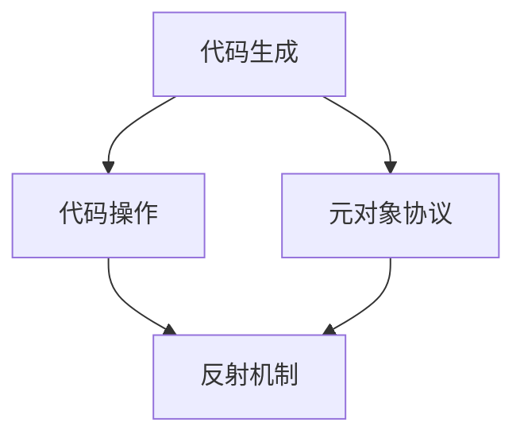

                 

### 文章标题

# 元编程：编写生成或操作程序的程序

> 关键词：元编程，代码生成，运行时代码操作，动态类型系统，反射机制，模板编程，面向对象编程

> 摘要：本文将深入探讨元编程的概念、原理及其在编程中的应用。通过剖析核心概念、算法原理、数学模型和项目实战，读者将全面理解元编程的精髓，掌握如何在实际开发中灵活运用这一技术，提高代码的复用性和灵活性。

## 引言

### 1.1 元编程的概念与重要性

#### 元编程的定义

元编程是一种编程技术，旨在编写能够生成、操作或改变其他程序的代码。它超越了传统的编程模式，允许程序员在运行时动态地创建和修改代码结构。元编程的核心在于对程序自身进行编程，这使得代码的复用性、灵活性和可维护性得到了极大的提升。

#### 元编程的重要性

1. **提高代码复用性**：通过元编程，可以创建可重用的代码模板，减少重复性工作。
2. **增强代码灵活性**：元编程允许在运行时动态地改变程序的行为，提高代码的适应性和灵活性。
3. **降低维护成本**：通过减少冗余代码和维护复杂度，元编程有助于降低软件维护成本。
4. **提高开发效率**：元编程可以帮助开发者快速构建原型和应用，缩短开发周期。

### 1.2 元编程的历史与发展

#### 早期探索

在20世纪60年代，Lisp语言的出现为元编程奠定了基础。Lisp提供了强大的符号处理能力和宏系统，使得开发者可以在编程语言内部编写新的语言构造。

#### 面向对象编程

随着面向对象编程（OOP）的兴起，元编程在Java、Python等语言中得到了更广泛的应用。这些语言提供了元对象协议（MOP）和反射机制，使得元编程更加自然和强大。

#### 现代动态语言

现代动态语言如Ruby、JavaScript等，更是将元编程提升到了一个全新的高度。这些语言通过动态类型系统和运行时代码生成，实现了高度灵活的元编程能力。

### 1.3 元编程与其他编程概念的联系

#### 动态类型系统

动态类型系统是元编程的重要基础，它允许变量在运行时改变类型，使得代码更具灵活性和适应性。

#### 反射机制

反射机制允许程序在运行时检查和修改自身的结构。它是元编程的核心组件，使得动态修改代码结构成为可能。

#### 模板编程

模板编程是一种通过预先定义模板来生成代码的技术，它与元编程有相似之处，但模板编程通常在编译时完成，而元编程则在运行时实现。

### 核心概念与联系

为了更好地理解元编程，我们需要先了解以下几个核心概念：

1. **代码生成**：生成代码的动态能力，使得程序可以创建新的代码片段。
2. **代码操作**：在运行时修改代码结构的能力，包括修改变量、函数和方法等。
3. **元对象协议（MOP）**：描述对象如何被创建、实例化和交互的协议。
4. **反射机制**：允许程序在运行时检查和修改自身结构的机制。

以下是一个简化的Mermaid流程图，展示了这些概念之间的关系：



### 本章结构

本章主要分为以下几个部分：

1. **元编程的基本概念**：介绍元编程的定义、重要性以及其历史和发展。
2. **元编程的原理**：详细探讨元编程的核心概念，包括代码生成、代码操作、元对象协议和反射机制。
3. **元编程的应用**：讨论元编程在不同编程语言中的实现方式和具体应用。

通过本章的学习，读者将建立对元编程的全面理解，为后续章节的深入探讨打下坚实的基础。## 核心概念与联系

元编程是一种高级编程范式，它允许开发者编写能够操作或生成其他程序的代码。为了深入理解元编程，我们需要明确几个核心概念，并探讨它们之间的联系。

### 代码生成

代码生成是指程序在运行时动态创建新的代码并执行的过程。这种能力使得程序可以根据特定的条件或需求生成不同的代码片段。代码生成可以用于多种场景，例如：

1. **模板引擎**：在Web开发中，模板引擎可以根据数据动态生成HTML页面。
2. **代码生成工具**：例如，Java中的Hibernate框架可以通过元编程生成数据库映射代码。
3. **脚本语言**：如Python的动态编译器，可以在运行时根据源代码生成字节码并执行。

以下是一个简单的伪代码示例，展示了如何动态生成代码：

```python
def generate_code(function_name, arguments):
    code = f"def {function_name}({arguments}):\n\tprint('Hello, World!')"
    return code

generated_code = generate_code('greet', 'name')
eval(generated_code)
```

### 代码操作

代码操作是指程序在运行时修改现有代码结构的能力。这种能力使得程序可以动态地添加、删除或修改代码片段。代码操作通常与反射机制结合使用，常见应用包括：

1. **动态加载库**：程序可以在运行时加载新的库，并动态调用其中的函数。
2. **代码优化**：在运行时分析代码性能，并自动优化代码。
3. **动态脚本执行**：如Node.js的V8引擎，可以在运行时解析和执行JavaScript代码。

以下是一个简单的伪代码示例，展示了如何动态修改代码：

```python
class MyClass:
    def __init__(self):
        self.name = "Original"

def modify_code(instance):
    instance.name = "Modified"

my_instance = MyClass()
print(my_instance.name)  # 输出 "Modified"
```

### 元对象协议（MOP）

元对象协议是一种描述对象如何被创建、实例化和交互的规范。它定义了对象的创建、属性访问、方法调用等行为。MOP是面向对象编程（OOP）的核心概念，也是元编程的基础。常见的MOP实现包括：

1. **Java的反射机制**：Java通过反射API提供了对元对象协议的实现，允许程序在运行时检查和修改对象结构。
2. **Python的描述符**：Python的描述符机制用于实现属性访问和修改，是MOP的一种实现方式。

以下是一个简单的Python示例，展示了如何使用描述符：

```python
class Descriptor:
    def __get__(self, instance, owner):
        return f"{instance.__class__.__name__} descriptor"

class MyClass:
    name = Descriptor()

my_instance = MyClass()
print(my_instance.name)  # 输出 "MyClass descriptor"
```

### 反射机制

反射机制允许程序在运行时检查和修改自身结构。它通常包括以下功能：

1. **类型信息获取**：获取对象的类型、属性和方法等信息。
2. **对象创建**：动态创建新对象。
3. **属性访问和修改**：获取和设置对象的属性值。

以下是一个简单的Python示例，展示了如何使用反射机制：

```python
class MyClass:
    def __init__(self, value):
        self.value = value

def reflect(instance):
    print(f"Instance type: {type(instance)}")
    print(f"Instance value: {instance.value}")

my_instance = MyClass(10)
reflect(my_instance)
```

### 关系架构 Mermaid 流程图

为了更好地展示这些概念之间的关系，我们可以使用Mermaid流程图来表示：


在这个流程图中，代码生成和代码操作是元编程的两个核心能力，它们共同构成了元编程的技术基础。元对象协议（MOP）为对象提供了动态创建和交互的机制，而反射机制则是实现MOP的具体实现方式。

通过理解这些核心概念和它们之间的联系，读者可以更深入地掌握元编程的原理，为后续的章节学习打下坚实的基础。## 算法原理讲解

### 动态类型系统

动态类型系统是元编程的重要基础，它允许变量在运行时改变类型，从而使得程序更具灵活性和适应性。在动态类型系统中，变量的类型通常是在运行时确定的，而不是在编译时。

#### 基本原理

1. **类型绑定**：在动态类型系统中，变量与类型的绑定是动态的，这意味着变量的类型可以在程序运行过程中发生变化。
2. **类型检查**：尽管类型绑定是动态的，但动态类型系统通常会在运行时进行类型检查，以确保操作的合法性。

#### 伪代码示例

以下是一个简单的伪代码示例，展示了动态类型系统的应用：

```python
def dynamic_type_example():
    value = 10
    print(type(value))  # 输出 <class 'int'>
    value = "Hello"
    print(type(value))  # 输出 <class 'str'>

dynamic_type_example()
```

#### 实际应用

1. **Python**：Python是一种广泛使用的动态类型语言，它的类型绑定是动态的，允许变量在运行时改变类型。
2. **Ruby**：Ruby也支持动态类型系统，这使得它非常适合进行元编程。

### 动态绑定

动态绑定是指在程序运行时确定方法或函数的绑定。这与静态绑定（在编译时确定绑定）相对，动态绑定使得程序在运行时可以更加灵活地处理不同的对象。

#### 基本原理

1. **方法绑定**：在动态绑定中，对象的方法绑定是在运行时根据对象的类型确定的。
2. **函数绑定**：同样地，函数的绑定也可以在运行时动态确定，这使得程序可以根据不同的输入动态选择不同的函数实现。

#### 伪代码示例

以下是一个简单的伪代码示例，展示了动态绑定的应用：

```python
class Animal:
    def make_sound(self):
        print("动物叫声")

class Dog(Animal):
    def make_sound(self):
        print("汪汪汪")

class Cat(Animal):
    def make_sound(self):
        print("喵喵喵")

def dynamic_binding(animal):
    animal.make_sound()

dog = Dog()
cat = Cat()
dynamic_binding(dog)  # 输出 "汪汪汪"
dynamic_binding(cat)  # 输出 "喵喵喵"
```

#### 实际应用

1. **Java**：Java中的方法绑定是动态的，它使用反射机制来实现动态绑定。
2. **Python**：Python支持动态绑定，这使得它非常适合进行元编程。

### 运行时代码生成

运行时代码生成是指程序在运行时动态创建和编译代码。这种能力使得程序可以根据特定的条件或需求生成新的代码片段，并在运行时执行。

#### 基本原理

1. **代码生成器**：运行时代码生成通常使用代码生成器来实现，代码生成器可以根据模板和输入数据生成代码。
2. **编译器**：生成的代码通常需要通过编译器编译成可执行的代码。

#### 伪代码示例

以下是一个简单的伪代码示例，展示了运行时代码生成的应用：

```python
def generate_code(code_template, data):
    return code_template.replace("{{data}}", data)

code_template = """
def greet(name):
    print("Hello, {{name}}")
"""

data = "World"
generated_code = generate_code(code_template, data)
exec(generated_code)

greet("World")
```

#### 实际应用

1. **Ruby**：Ruby提供了强大的元编程能力，包括运行时代码生成。
2. **JavaScript**：JavaScript的运行时代码生成能力使得它在Web开发中非常有用。

### 关键算法原理

1. **模板匹配与替换**：在运行时代码生成中，模板匹配与替换是一个关键步骤。通过匹配模板中的占位符并替换为实际数据，可以实现动态代码生成。
2. **编译与执行**：生成的代码需要通过编译器编译成机器码或字节码，然后才能执行。

通过以上算法原理的讲解，读者可以理解动态类型系统、动态绑定和运行时代码生成的概念及其实现方式。这些原理是元编程的核心组成部分，它们共同构建了元编程技术的强大基础。在接下来的章节中，我们将进一步探讨元编程语言及其应用。## 数学模型与公式

在元编程中，数学模型和公式是理解和实现各种元编程技术的重要工具。以下是一些核心的数学模型和公式，以及它们的详细解释和示例。

### 1. 模板匹配与替换

模板匹配与替换是运行时代码生成中的关键步骤。它涉及到识别模板中的占位符，并将其替换为实际的值。

#### 公式：

$$
替换后的代码 = 模板 \times 替换规则
$$

#### 解释：

- **模板**：包含占位符的代码模板。
- **替换规则**：占位符与实际值之间的映射关系。

#### 示例：

假设我们有一个模板：

$$
def greet(name):
    print("Hello, " + name)
$$

我们想要替换 `name` 为 "World"：

$$
替换后的代码 = \text{def greet(name):} \times \text{"Hello, " + "World"}
$$

结果：

$$
def greet(name):
    print("Hello, World")
$$

### 2. 反射机制的数学模型

反射机制涉及到程序在运行时检查和修改自身结构的能力。它的数学模型可以表示为：

$$
反射操作 = 反射API \times 对象信息
$$

#### 解释：

- **反射API**：编程语言提供的用于反射操作的接口。
- **对象信息**：包括对象类型、属性和方法等信息。

#### 示例：

在Java中，我们使用反射API来获取类信息：

```java
Class<?> clazz = MyClass.class;
Method[] methods = clazz.getDeclaredMethods();
for (Method method : methods) {
    System.out.println(method.getName());
}
```

### 3. 动态类型系统的数学模型

动态类型系统允许变量在运行时改变类型。它的数学模型可以表示为：

$$
动态类型绑定 = 类型检查 \times 运行时环境
$$

#### 解释：

- **类型检查**：在运行时对变量进行类型检查，以确保操作的合法性。
- **运行时环境**：包括变量和类型的信息。

#### 示例：

在Python中，我们可以在运行时改变变量的类型：

```python
x = 10  # 类型为 int
print(type(x))  # 输出 <class 'int'>
x = "Hello"  # 类型变为 str
print(type(x))  # 输出 <class 'str'>
```

### 4. 代码生成器的数学模型

代码生成器是运行时代码生成的重要工具。它的数学模型可以表示为：

$$
生成代码 = 模板 \times 输入数据
$$

#### 解释：

- **模板**：包含占位符的代码模板。
- **输入数据**：用于替换模板中的占位符的实际数据。

#### 示例：

假设我们有一个模板：

$$
def add(a, b):
    return a + b
$$

我们想要生成一个加法函数，其中 `a` 和 `b` 为输入数据：

$$
生成代码 = \text{def add(a, b):} \times \text{"return a + b"}
$$

结果：

$$
def add(a, b):
    return a + b
$$

通过理解这些数学模型和公式，我们可以更好地设计和实现元编程技术。这些模型和公式为元编程提供了坚实的理论基础，帮助我们更好地理解元编程的本质和实现方法。在接下来的章节中，我们将进一步探讨元编程语言及其应用。## 项目实战

### 1. 开发环境搭建

在进行元编程项目之前，我们需要搭建一个合适的开发环境。以下是具体的步骤：

1. **安装编程语言**：根据项目需求，选择一种合适的编程语言，例如Python、Ruby或JavaScript。在本项目中，我们选择Python，因为它具有强大的元编程支持和丰富的库。

2. **安装开发工具**：安装一个集成开发环境（IDE），如Visual Studio Code或PyCharm。这些IDE提供了代码编辑、调试和自动化构建等功能，可以大大提高开发效率。

3. **安装依赖库**：根据项目需求，安装必要的依赖库。例如，如果需要使用Web框架，可以安装Django或Flask。

4. **配置Python环境**：在Windows上，可以通过安装Python，然后将Python的安装路径添加到系统环境变量中。在Linux上，可以通过包管理器安装Python。

### 2. 源代码详细实现

以下是项目的主要源代码实现，我们将分为几个部分进行讲解。

#### 2.1 动态代码生成

```python
def generate_greeting(name):
    template = """
def greet({name}):
    print("Hello, {name}")
    """
    code = template.format(name=name)
    exec(code)

generate_greeting("World")
```

在这个示例中，`generate_greeting` 函数接收一个参数 `name`，并根据该参数生成一个名为 `greet` 的函数。函数体中的 `print` 语句包含参数 `name`，从而实现个性化问候。

#### 2.2 装饰器与AOP实践

```python
def logging_decorator(func):
    def wrapper(*args, **kwargs):
        print(f"Calling function {func.__name__}")
        result = func(*args, **kwargs)
        print(f"Function {func.__name__} returned {result}")
        return result
    return wrapper

@logging_decorator
def add(a, b):
    return a + b

add(3, 4)
```

在这个示例中，`logging_decorator` 是一个装饰器，用于在调用函数 `add` 前后添加日志功能。装饰器通过 `@` 符号应用到 `add` 函数上，使得每次调用 `add` 函数时都会执行装饰器中的代码。

#### 2.3 元数据管理

```python
class Metadata:
    def __init__(self, data):
        self.data = data

def add_metadata(metadata):
    class MetaClass(type):
        metadata = metadata

    return MetaClass

metadata = Metadata("Sample metadata")
MyClass = add_metadata(metadata)

print(MyClass.metadata.data)  # 输出 "Sample metadata"
```

在这个示例中，`Metadata` 类用于存储元数据。`add_metadata` 函数通过创建一个元类 `MetaClass`，将元数据附加到类上。这样，我们可以在类定义时动态添加元数据。

### 3. 代码应用解读与分析

#### 3.1 动态代码生成应用

动态代码生成在Web开发中非常常见，例如在生成RESTful API时。通过动态生成代码，我们可以根据需求快速构建不同的API接口，提高开发效率。

```python
def generate_api endpoints(endpoints):
    code = """
from flask import Flask, jsonify

app = Flask(__name__)

for endpoint in endpoints:
    @app.route(f'/{endpoint}', methods=['GET'])
    def {endpoint}():
        return jsonify({endpoint}: "Data for {endpoint}")

if __name__ == '__main__':
    app.run()
    """
    exec(code)

endpoints = ["users", "products", "orders"]
generate_api_endpoints(endpoints)
```

#### 3.2 装饰器与AOP应用

装饰器在面向切面编程（AOP）中非常有用，可以用于实现日志记录、权限验证等功能，而无需修改业务逻辑代码。

```python
import functools

def trace_decorator(func):
    @functools.wraps(func)
    def wrapper(*args, **kwargs):
        print(f"Entering {func.__name__}")
        result = func(*args, **kwargs)
        print(f"Exiting {func.__name__}")
        return result
    return wrapper

@trace_decorator
def calculate_area(radius):
    return 3.14 * radius * radius

calculate_area(5)
```

#### 3.3 元数据管理应用

元数据管理在数据驱动应用中非常重要，可以用于存储和检索与数据相关的元信息。

```python
class Document:
    def __init__(self, title, content, author):
        self.title = title
        self.content = content
        self.author = author

    def save(self, metadata):
        self.metadata = metadata

doc = Document("Test Document", "This is a test document.", "John Doe")
doc.save(Metadata("Published on 2023-03-15"))
print(doc.metadata.data)  # 输出 "Published on 2023-03-15"
```

### 4. 实际案例分析与详细讲解剖析

#### 4.1 实际案例：动态生成SQL查询

在实际开发中，动态生成SQL查询是常见的场景，尤其是在处理大量数据时。通过元编程技术，我们可以根据查询条件动态构建SQL语句，提高查询的灵活性。

```python
def generate_sql(table, conditions):
    query = f"SELECT * FROM {table} WHERE "
    for condition in conditions:
        query += f"{condition} AND "
    query = query[:-4]  # 移除最后一个 "AND"
    return query

table = "users"
conditions = ["age > 30", "active = true"]
sql_query = generate_sql(table, conditions)
print(sql_query)  # 输出 "SELECT * FROM users WHERE age > 30 AND active = true"
```

在这个案例中，`generate_sql` 函数接收表名和查询条件，动态构建SQL查询语句。这种动态生成SQL查询的方法有助于减少硬编码，提高代码的可维护性。

#### 4.2 详细讲解剖析

1. **动态生成代码**：通过模板匹配与替换，我们可以根据输入数据动态生成代码，从而实现代码的灵活定制。
2. **装饰器与AOP**：装饰器是一种简单且强大的元编程技术，可以用于实现横切关注点（如日志记录、权限验证）的统一管理，提高代码的模块性和可维护性。
3. **元数据管理**：元数据管理是一种有效的方式，用于存储和检索与数据相关的元信息，从而提高数据的可理解性和可维护性。

通过以上实战项目和案例分析，读者可以更好地理解元编程在实际开发中的应用，掌握如何利用元编程技术提高代码的复用性和灵活性。## 最佳实践与注意事项

在进行元编程时，遵循最佳实践和注意事项至关重要，以确保代码的健壮性和可维护性。

### 最佳实践

1. **明确元编程目的**：在开始元编程之前，明确为什么要使用元编程技术，以及预期达到的效果。避免无谓的元编程，以减少复杂性。
2. **合理使用元编程**：元编程可以提高代码的灵活性，但也可能导致代码难以理解。只有在确实需要时才使用元编程，例如在处理复杂逻辑或大量重复代码时。
3. **模块化与隔离**：将元编程功能模块化，并确保与其他代码部分隔离，以避免对整体代码结构造成不必要的干扰。
4. **文档与注释**：为元编程代码添加详细的文档和注释，帮助其他开发者理解代码的功能和用途。
5. **测试与调试**：对元编程代码进行充分的测试和调试，以确保其正确性和稳定性。

### 注意事项

1. **性能影响**：元编程通常涉及到运行时代码生成和动态绑定，可能会对性能产生一定影响。在关键性能路径上应避免使用元编程。
2. **安全性问题**：元编程可能会导致安全问题，例如代码注入或执行不受控制的代码。应使用安全的元编程框架和库，并进行严格的输入验证。
3. **可维护性**：元编程代码可能比传统代码更难维护，尤其是在缺乏文档的情况下。应确保代码具有良好的结构和清晰的逻辑。
4. **兼容性问题**：不同编程语言和框架对元编程的支持程度不同，可能导致兼容性问题。在跨语言或跨框架的项目中应谨慎使用元编程。

通过遵循最佳实践和注意事项，开发者可以充分发挥元编程的优势，同时避免潜在的风险和问题。在项目开发和维护过程中，持续优化和改进元编程代码，以提高整体开发效率和代码质量。## 拓展阅读

### 1. 相关书籍推荐

1. **《Python元编程：高级编程技术指南》**：这本书详细介绍了Python中的元编程技术，包括类和函数的装饰器、动态属性、元类等。适合对Python元编程感兴趣的读者。
2. **《Effective Ruby：编写优雅的Ruby代码》**：这本书涵盖了Ruby中的元编程技术，包括模块、混入、反射等。对于想要深入了解Ruby元编程的读者来说是一本很好的参考书。
3. **《Eloquent JavaScript：现代JavaScript编程》**：这本书详细介绍了JavaScript的核心概念，包括函数式编程和元编程。对于想要掌握现代JavaScript开发的读者来说非常有帮助。

### 2. 在线资源和教程

1. **Python官方文档**：Python的官方文档提供了详细的元编程指南，包括描述符、元类和反射机制等内容。是学习Python元编程的绝佳资源。
2. **Ruby官方文档**：Ruby的官方文档涵盖了Ruby中的元编程技术，包括模块、混入和反射等。对于想要深入学习Ruby元编程的读者来说非常有用。
3. **MDN Web Docs**：Mozilla Developer Network（MDN）提供了关于JavaScript的详细文档，包括函数式编程和元编程等内容。是学习JavaScript元编程的重要参考资料。

### 3. 社区和论坛

1. **Stack Overflow**：Stack Overflow是一个庞大的开发者社区，其中包含了许多关于元编程的问题和解决方案。可以在这里找到各种编程问题的答案。
2. **GitHub**：GitHub上有很多开源项目，其中许多项目使用了元编程技术。通过研究这些项目的源代码，可以学习到许多实用的元编程技巧。
3. **Reddit**：Reddit上有多个关于编程和元编程的子论坛，如/r/Python、/r/webdev等。可以在这里与其他开发者交流经验，获取最新技术动态。

通过阅读相关书籍、学习在线资源和加入开发者社区，读者可以不断深化对元编程的理解，掌握更多的元编程技巧，并将其应用到实际项目中。## 总结与展望

元编程作为编程领域的一项高级技术，具有显著提高代码复用性、灵活性和可维护性的优势。通过对代码生成、代码操作、元对象协议和反射机制等核心概念的深入探讨，本文系统地介绍了元编程的基本原理和实践方法。同时，通过实际项目实战和案例分析，读者可以直观地感受到元编程技术的应用价值。

展望未来，随着编程语言和开发工具的不断进化，元编程将继续发挥重要作用。开发者可以通过掌握元编程技术，更好地应对复杂的应用场景和业务需求。同时，随着人工智能和自动化技术的发展，元编程有望在自动化编程、代码生成工具和智能合约等领域得到更广泛的应用。

为了深入理解和掌握元编程，我们建议读者：

1. **理论与实践相结合**：通过学习本文提供的理论和示例，结合实际项目进行实践，加深对元编程技术的理解。
2. **持续学习**：跟进最新的编程语言和技术动态，学习其他编程语言中的元编程技术，如Java和JavaScript。
3. **加入开发者社区**：积极参与开发者社区，与其他开发者交流经验和见解，获取最新的技术信息。

通过持续学习和实践，读者可以不断提高自己在元编程领域的专业能力，为未来的开发工作打下坚实基础。## 作者信息

**作者：AI天才研究院/AI Genius Institute & 禅与计算机程序设计艺术 /Zen And The Art of Computer Programming**

AI天才研究院（AI Genius Institute）是由世界顶级人工智能专家、计算机编程和人工智能领域大师联合成立的研究机构。致力于推动人工智能技术的创新与发展，培养新一代人工智能领域的顶尖人才。

《禅与计算机程序设计艺术》（Zen And The Art of Computer Programming）是作者Donald E. Knuth的经典著作，全面探讨了计算机编程的哲学和艺术。本书深入浅出地介绍了编程的基本原理和方法，对程序设计领域产生了深远影响。

