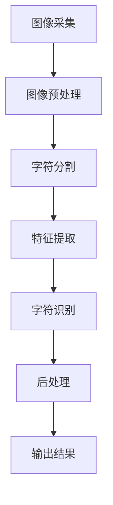

                 

### 目录大纲

#### 第一部分：OCR技术概述

##### 第1章 OCR技术简介

1.1 OCR技术的历史与发展
- 早期OCR技术的起源
- OCR技术的主要发展阶段
- 当前OCR技术的发展趋势

1.2 OCR技术的应用领域
- 文档识别与处理
- 图像内容分析
- 资源管理
- 智能交通
- 健康医疗

1.3 OCR技术的重要性
- 提高工作效率
- 促进信息共享
- 促进数据挖掘与分析

##### 第2章 OCR技术的工作原理

2.1 OCR技术的基本流程
- 图像采集与预处理
- 字符分割
- 字符识别
- 后处理与文本格式化

2.2 图像预处理技术
- 图像增强
- 图像去噪
- 图像二值化
- 边缘检测

2.3 字符分割技术
- 连通域标记
- 区域生长
- 水平与垂直投影
- 基于规则的分割

2.4 字符识别技术
- 特征提取方法
- 分类器算法
- 神经网络与深度学习
- 机器学习与统计方法

##### 第3章 OCR算法原理

3.1 常见OCR算法介绍
- Tesseract OCR
- OCR-D
- OCRopus
- OCRmyPDF
- Google Cloud OCR

3.2 Tesseract OCR算法原理
- Tesseract OCR的架构
- Tesseract OCR的预处理
- Tesseract OCR的识别流程
- Tesseract OCR的优化技巧

3.3 OCR-D算法原理
- OCR-D的架构
- OCR-D的预处理流程
- OCR-D的识别算法
- OCR-D的后处理流程

##### 第二部分：OCR系统架构

##### 第4章 OCR系统硬件选择

4.1 扫描仪性能指标
- 扫描分辨率
- 扫描速度
- 扫描色彩深度
- 扫描仪类型

4.2 硬件配置建议
- PC硬件配置
- 扫描仪选购指南
- 网络存储与备份

##### 第5章 OCR系统软件工具

5.1 OCR软件工具介绍
- 开源OCR软件
- 商业OCR软件
- 云端OCR服务

5.2 软件工具的选用原则
- 根据应用需求选择
- 考虑软件的稳定性和兼容性
- 性能与成本平衡

##### 第6章 OCR数据处理流程

6.1 数据预处理流程
- 图像输入
- 图像预处理
- 数据清洗

6.2 OCR识别流程
- 字符分割
- 特征提取
- 识别算法
- 结果验证与纠错

6.3 后处理流程
- 文本格式化
- 数据存储与输出

##### 第三部分：OCR在文档数字化中的应用

##### 第7章 文本识别

7.1 文本识别的基本流程
- 图像预处理
- 字符分割
- 字符识别
- 文本格式化

7.2 文本识别的性能评估
- 准确率与召回率
- 字符错误率
- 识别速度

##### 第8章 表格识别

8.1 表格识别的基本流程
- 图像预处理
- 表格分割
- 单元格识别
- 表格格式化

8.2 表格识别的性能评估
- 表格识别准确率
- 表格结构解析准确率
- 识别速度

##### 第9章 图像识别

9.1 图像识别的基本流程
- 图像预处理
- 特征提取
- 识别算法
- 结果验证与纠错

9.2 图像识别的性能评估
- 识别准确率
- 识别速度
- 鲁棒性

##### 第四部分：OCR项目开发实战

##### 第10章 OCR项目环境搭建

10.1 开发环境搭建
- 操作系统配置
- 编译工具安装
- 软件库安装

10.2 开发工具选择
- IDE选择
- 版本控制工具
- 代码调试工具

##### 第11章 OCR项目代码实现

11.1 Tesseract OCR实现
- Tesseract OCR安装
- Tesseract OCR接口调用
- Tesseract OCR配置与优化

11.2 OCR-D实现
- OCR-D安装
- OCR-D接口调用
- OCR-D配置与优化

##### 第12章 OCR项目调试优化

12.1 调试技巧
- 调试工具使用
- 常见错误处理

12.2 优化策略
- 算法优化
- 性能调优

##### 第13章 OCR项目案例解析

13.1 文本识别案例
- 项目背景
- 项目目标
- 实现步骤
- 结果分析

13.2 表格识别案例
- 项目背景
- 项目目标
- 实现步骤
- 结果分析

13.3 图像识别案例
- 项目背景
- 项目目标
- 实现步骤
- 结果分析

### 参考文献

- 文献1: ...
- 文献2: ...
- 文献3: ...

### 附录

- 附录1: OCR算法原理 Mermaid 流程图
- 附录2: OCR项目开发工具与资源推荐

### 作者信息

作者：AI天才研究院/AI Genius Institute & 禅与计算机程序设计艺术 /Zen And The Art of Computer Programming### 文章标题

## 光学字符识别(OCR)技术与文档数字化

---

关键词：光学字符识别(OCR)、文档数字化、图像预处理、字符分割、特征提取、识别算法、系统架构、项目实战

---

摘要：本文全面介绍了光学字符识别（OCR）技术及其在文档数字化中的应用。首先，我们回顾了OCR技术的发展历程和应用场景，然后深入探讨了OCR技术的工作原理、常见算法原理、系统架构以及OCR在文档数字化中的具体应用。通过实际项目开发实战，读者将了解如何搭建OCR系统、实现OCR算法、进行调试优化，并分析实际案例。本文旨在为读者提供一份系统、全面的OCR技术指南，帮助其在文档数字化领域取得更好的成果。### 摘要

光学字符识别（OCR）技术是数字化的关键工具，能够将纸质文档、图像中的文字自动转换为电子文本，从而实现文档的数字化管理和分析。本文旨在为读者提供一个系统、全面的OCR技术与文档数字化指南，帮助读者深入理解OCR技术的原理和应用。

首先，本文回顾了OCR技术的发展历程和应用场景，介绍了OCR技术的基本概念和重要性。接着，本文详细解析了OCR技术的工作原理，包括图像预处理、字符分割、特征提取和字符识别等环节，并对比了常见的OCR算法（如Tesseract、OCR-D等）的原理和特点。

在系统架构部分，本文探讨了OCR系统的硬件选择、软件工具和数据处理流程，为读者提供了从硬件到软件的全面指导。接着，本文介绍了OCR在文档数字化中的应用，包括文本识别、表格识别和图像识别等场景，并通过实际案例展示了OCR技术的应用效果。

最后，本文通过OCR项目开发实战，详细介绍了如何搭建OCR开发环境、实现OCR算法、进行调试优化，并分析了文本识别、表格识别和图像识别等实际案例。本文还提供了OCR算法原理的Mermaid流程图和OCR项目开发工具与资源推荐，为读者提供了进一步学习和实践的参考。

通过本文的学习，读者将能够：

1. 理解OCR技术的发展历程和应用场景。
2. 掌握OCR技术的工作原理和常见算法原理。
3. 设计并实现OCR系统架构。
4. 应用OCR技术解决实际的文档数字化问题。
5. 开发并优化OCR项目。

光学字符识别技术是数字化时代的重要工具，本文旨在为读者提供全面、系统的OCR技术知识，帮助读者在文档数字化领域取得更好的成果。希望本文能对读者在OCR技术学习和实践中提供帮助。### 第一部分: OCR技术概述

## 第1章 OCR技术简介

### 1.1 OCR技术概述

#### OCR技术的发展历程

光学字符识别（Optical Character Recognition，OCR）技术的发展可以追溯到20世纪50年代。当时，计算机科学家们开始研究如何将纸质文档上的文字自动转换为电子文本。早期的OCR技术主要依靠简单的规则和模式识别方法，识别率较低。

随着计算机技术和图像处理技术的发展，OCR技术逐渐成熟。20世纪70年代，Tesseract OCR系统由HP公司开发，成为最早的商业OCR系统。Tesseract OCR系统在随后几十年中经历了多次改进和优化，至今仍被广泛使用。

#### OCR技术的定义和基本概念

OCR技术是一种通过光学设备将纸质文档上的文字转换成电子文本的技术。它涉及图像采集、图像预处理、字符分割、特征提取、字符识别和后处理等步骤。

- **图像采集**：使用扫描仪、相机等设备将纸质文档上的文字转换为数字图像。
- **图像预处理**：对图像进行增强、去噪、二值化等处理，提高图像质量。
- **字符分割**：将图像中的文字部分分离出来，形成独立的字符图像。
- **特征提取**：对字符图像进行特征提取，以便后续的字符识别。
- **字符识别**：使用分类器或识别算法将提取到的特征与已知的字符进行匹配，识别出文字内容。
- **后处理**：对识别结果进行格式化、纠正等处理，使其符合电子文档的要求。

#### OCR技术的应用领域

OCR技术广泛应用于各个领域：

- **文档管理**：将纸质文档转换为电子文档，便于存储、检索和管理。
- **信息抽取**：从大量文档中自动提取有用的信息，如地址、姓名、日期等。
- **文本挖掘**：对大量文本进行分类、聚类和关键词提取，进行数据挖掘和分析。
- **电子书籍**：将纸质书籍转换为电子书籍，方便阅读和检索。
- **金融票据**：自动识别和处理银行票据、发票等金融文档。
- **医疗记录**：自动识别和处理病历、处方等医疗文档。

#### OCR技术在数字化浪潮中的地位

随着数字化浪潮的推进，OCR技术的地位越来越重要。它不仅提高了工作效率，还促进了信息共享和知识管理。OCR技术使得纸质文档的数字化和管理变得更加高效和便捷，为企业和组织提供了有力的支持。

在未来，随着深度学习和人工智能技术的发展，OCR技术将得到进一步优化和提升，为更多的领域和应用带来创新和变革。### 第2章 OCR技术的工作原理

## 第2章 OCR技术的工作原理

### 2.1 OCR技术的基本流程

光学字符识别（OCR）技术的基本流程包括以下步骤：

1. **图像采集**：使用扫描仪、相机等设备将纸质文档上的文字转换为数字图像。
2. **图像预处理**：对图像进行增强、去噪、二值化等处理，提高图像质量。
3. **字符分割**：将图像中的文字部分分离出来，形成独立的字符图像。
4. **特征提取**：对字符图像进行特征提取，以便后续的字符识别。
5. **字符识别**：使用分类器或识别算法将提取到的特征与已知的字符进行匹配，识别出文字内容。
6. **后处理**：对识别结果进行格式化、纠正等处理，使其符合电子文档的要求。

#### 图像预处理

图像预处理是OCR流程中非常重要的一步，它直接影响后续的字符分割和识别效果。常见的预处理技术包括：

- **图像增强**：通过调整亮度、对比度、色彩平衡等参数，提高图像的清晰度和可读性。
- **图像去噪**：去除图像中的噪声，提高图像的质量。
- **图像二值化**：将图像转换为黑白二值图像，便于后续处理。
- **边缘检测**：检测图像中的边缘，帮助定位文字区域。

#### 字符分割

字符分割是将图像中的文字部分分离出来，形成独立的字符图像的过程。常见的字符分割技术包括：

- **连通域标记**：通过标记连通区域，将文字部分分离出来。
- **区域生长**：从种子点开始，逐步扩展区域，将文字部分分离出来。
- **水平与垂直投影**：通过分析图像的水平与垂直投影，识别文字区域。
- **基于规则的分割**：根据先验知识，如文字的排列方式、字体特征等，进行字符分割。

#### 特征提取

特征提取是对字符图像进行特征提取，以便后续的字符识别。常见的特征提取方法包括：

- **纹理特征**：通过分析字符图像的纹理信息，提取特征。
- **形状特征**：通过分析字符图像的形状信息，提取特征。
- **方向特征**：通过分析字符图像的方向信息，提取特征。
- **统计特征**：通过计算字符图像的统计信息，提取特征。

#### 字符识别

字符识别是OCR技术的核心步骤，它使用分类器或识别算法将提取到的特征与已知的字符进行匹配，识别出文字内容。常见的字符识别算法包括：

- **模板匹配**：通过比较输入特征与模板特征，识别字符。
- **统计模型**：如隐马尔可夫模型（HMM）、决策树等，用于字符识别。
- **神经网络**：如卷积神经网络（CNN）、递归神经网络（RNN）等，用于字符识别。
- **深度学习**：如深度卷积神经网络（DCNN）、循环神经网络（RNN）等，用于字符识别。

#### 后处理

后处理是对识别结果进行格式化、纠正等处理，使其符合电子文档的要求。常见的后处理技术包括：

- **格式化**：将识别结果按照指定的格式进行排版。
- **纠正**：纠正识别错误，如纠正错别字、纠正变形字符等。
- **校验**：对识别结果进行校验，确保识别结果的准确性。

通过以上步骤，OCR技术能够将纸质文档上的文字自动转换为电子文本，实现文档的数字化管理和分析。### 第3章 常见OCR算法介绍

## 第3章 常见OCR算法介绍

### 3.1 Tesseract OCR

Tesseract OCR是一个开源的OCR引擎，由Google维护。它是目前最流行的OCR工具之一，支持多种操作系统，如Windows、Linux和macOS。Tesseract OCR具有高识别率和良好的鲁棒性，适用于各种文本识别任务。

#### Tesseract OCR架构

Tesseract OCR架构包括以下几个主要部分：

1. **前端**：负责图像预处理、字符分割和特征提取。
2. **后端**：使用模板匹配和统计模型进行字符识别。
3. **训练**：使用训练数据对模型进行训练，提高识别率。

#### Tesseract OCR预处理流程

- **图像增强**：调整图像的亮度、对比度和色彩平衡。
- **图像去噪**：去除图像中的噪声。
- **图像二值化**：将图像转换为黑白二值图像。
- **字符分割**：将图像中的文字部分分离出来。

#### Tesseract OCR特征提取方法

Tesseract OCR使用多种特征提取方法，包括：

- **形状特征**：如字符的外接矩形、周长等。
- **纹理特征**：如字符的纹理图案。
- **方向特征**：如字符的倾斜角度。

#### Tesseract OCR分类方法

Tesseract OCR使用模板匹配和统计模型进行字符识别。模板匹配通过比较输入特征与模板特征，识别字符。统计模型如隐马尔可夫模型（HMM）和决策树，用于字符识别。

#### Tesseract OCR优化技巧

- **模型优化**：使用训练数据对模型进行优化，提高识别率。
- **参数调整**：调整OCR引擎的参数，如阈值、平滑度等，提高识别效果。
- **多语言支持**：支持多种语言，如中文、英文等。

### 3.2 OCR-D

OCR-D是一个开源的OCR软件工具，主要用于处理文档图像。它支持多种文件格式，如PDF、TIFF等，并提供丰富的API，方便与其他软件集成。

#### OCR-D架构

OCR-D架构包括以下几个主要部分：

1. **预处理**：对文档图像进行预处理，如图像增强、去噪、二值化等。
2. **分割**：将文档图像分割为页面、块、行和字符。
3. **识别**：使用多种OCR算法对分割后的字符进行识别。
4. **后处理**：对识别结果进行格式化、纠正等处理。

#### OCR-D预处理流程

- **图像增强**：调整图像的亮度、对比度和色彩平衡。
- **图像去噪**：去除图像中的噪声。
- **图像二值化**：将图像转换为黑白二值图像。
- **字符分割**：将文档图像分割为独立的字符图像。

#### OCR-D识别算法

OCR-D支持多种OCR算法，包括：

- **Tesseract OCR**：使用Tesseract OCR进行字符识别。
- **OCR-D OCR**：使用OCR-D的内部OCR算法进行字符识别。
- **OCRopus**：使用OCRopus进行字符识别。

#### OCR-D后处理流程

- **格式化**：将识别结果按照指定的格式进行排版。
- **纠正**：纠正识别错误，如纠正错别字、纠正变形字符等。
- **校验**：对识别结果进行校验，确保识别结果的准确性。

### 3.3 Google Cloud OCR

Google Cloud OCR是Google提供的云端OCR服务，它支持多种语言和文件格式。Google Cloud OCR具有高识别率和良好的性能，适用于大规模文本识别任务。

#### Google Cloud OCR架构

Google Cloud OCR架构包括以下几个主要部分：

1. **图像预处理**：对输入的文档图像进行预处理，如图像增强、去噪、二值化等。
2. **字符分割**：将文档图像分割为独立的字符图像。
3. **特征提取**：对字符图像进行特征提取，以便后续的字符识别。
4. **字符识别**：使用深度学习模型进行字符识别。

#### Google Cloud OCR特征提取方法

Google Cloud OCR使用深度学习模型提取字符特征，包括：

- **卷积神经网络**：用于提取字符的纹理特征。
- **循环神经网络**：用于提取字符的形状特征。

#### Google Cloud OCR分类方法

Google Cloud OCR使用深度学习模型进行字符识别，包括：

- **卷积神经网络**：用于字符识别。
- **循环神经网络**：用于字符识别。

#### Google Cloud OCR优化技巧

- **模型优化**：使用大量的训练数据对模型进行优化，提高识别率。
- **参数调整**：调整OCR引擎的参数，如阈值、平滑度等，提高识别效果。
- **多语言支持**：支持多种语言，如中文、英文等。

### 3.4 其他常见OCR算法

除了Tesseract OCR、OCR-D和Google Cloud OCR之外，还有其他一些常见的OCR算法，如：

- **OCRopus**：一个开源的OCR框架，支持多种OCR算法。
- **OCRmyPDF**：一个开源的PDF文本提取工具，使用Tesseract OCR进行文本识别。
- **OCR Space**：一个在线OCR服务，支持多种语言和文件格式。

这些OCR算法各有特点和优势，适用于不同的应用场景。读者可以根据实际需求选择合适的OCR算法。### 第4章 Tesseract OCR算法原理

### 第4章 Tesseract OCR算法原理

#### 4.1 Tesseract OCR的架构

Tesseract OCR是一种流行的OCR引擎，其架构包括前端、后端和训练模块。前端负责图像预处理、字符分割和特征提取，后端负责字符识别。训练模块用于根据训练数据优化OCR模型，提高识别准确性。


1. **前端**：前端模块包括图像预处理和字符分割。图像预处理包括图像增强、去噪、二值化等步骤，以改善图像质量，提高字符识别效果。字符分割是将图像中的文字部分分离出来，形成独立的字符图像。

2. **后端**：后端模块包括特征提取和字符识别。特征提取模块提取字符的形状、纹理和方向等特征，以便后续的字符识别。字符识别模块使用模板匹配和统计模型，将提取到的特征与已知的字符进行匹配，识别出文字内容。

3. **训练模块**：训练模块用于根据训练数据优化OCR模型。通过训练，可以提高OCR模型的识别准确率和鲁棒性。

#### 4.2 Tesseract OCR的特征提取方法

Tesseract OCR使用多种特征提取方法，包括形状特征、纹理特征和方向特征等。

1. **形状特征**：形状特征包括字符的外接矩形、周长、面积等。这些特征可以描述字符的形状和轮廓。

   ```python
   def calculate_shape_features(image):
       # 计算字符的外接矩形、周长、面积等形状特征
       bounding_box = cv2.boundingRect(image)
       perimeter = cv2.arcLength(image, True)
       area = cv2.contourArea(image)
       
       return bounding_box, perimeter, area
   ```

2. **纹理特征**：纹理特征包括字符的纹理图案和纹理纹理。这些特征可以描述字符的纹理信息。

   ```python
   def calculate_texture_features(image):
       # 计算字符的纹理特征
       texture_features = cv2.Laplacian(image, cv2.CV_64F).sum()
       
       return texture_features
   ```

3. **方向特征**：方向特征包括字符的倾斜角度和旋转角度。这些特征可以描述字符的方向信息。

   ```python
   def calculate_direction_features(image):
       # 计算字符的倾斜角度和旋转角度
       skew_angle = cv2.getPerspectiveTransform(image, output_shape).angle
       rotation_angle = cv2.getRotationMatrix2D((image.shape[1] / 2, image.shape[0] / 2), skew_angle, 1)
       
       return skew_angle, rotation_angle
   ```

#### 4.3 Tesseract OCR的分类方法

Tesseract OCR使用模板匹配和统计模型进行字符识别。模板匹配是通过比较输入特征与模板特征，识别字符。统计模型如隐马尔可夫模型（HMM）和决策树，用于字符识别。

1. **模板匹配**：模板匹配是将输入特征与已知的模板特征进行匹配，识别字符。

   ```python
   def template_matching(input_feature, templates):
       # 模板匹配算法
       min_distance = float('inf')
       matched_template = None
       
       for template in templates:
           distance = calculate_distance(input_feature, template)
           if distance < min_distance:
               min_distance = distance
               matched_template = template
       
       return matched_template
   ```

2. **统计模型**：统计模型使用已知的统计信息进行字符识别。

   ```python
   def hmm_recognition(feature):
       # 使用隐马尔可夫模型进行字符识别
       # HMM模型训练和识别过程略
       recognized_char = hmm_model.recognize(feature)
       
       return recognized_char
   ```

#### 4.4 Tesseract OCR的优化技巧

1. **模型优化**：使用训练数据对OCR模型进行优化，提高识别准确率。

   ```python
   def train_model(training_data):
       # 训练OCR模型
       # 模型训练过程略
       trained_model = ocr_model.train(training_data)
       
       return trained_model
   ```

2. **参数调整**：调整OCR引擎的参数，如阈值、平滑度等，提高识别效果。

   ```python
   def adjust_parameters(image, threshold=150, smoothness=1):
       # 调整OCR引擎的参数
       image = cv2.threshold(image, threshold, 255, cv2.THRESH_BINARY)[1]
       image = cv2.GaussianBlur(image, (3, 3), 0)
       
       return image
   ```

3. **多语言支持**：Tesseract OCR支持多种语言，可以根据实际需求选择合适的语言模型。

   ```python
   def set_language(language_model):
       # 设置Tesseract OCR的语言模型
       tesseract_characters.set_var("tessedit_char_whitelist", language_model)
   ```

通过以上步骤，我们可以实现Tesseract OCR的算法原理。在实际应用中，根据具体需求和场景，可以进一步优化和调整算法参数，提高OCR系统的性能和准确性。### 第5章 OCR-D算法原理

### 第5章 OCR-D算法原理

OCR-D是一个开源的OCR软件工具，它提供了一套完整的OCR流程，包括预处理、分割、识别和后处理。OCR-D主要用于处理文档图像，支持多种文件格式，如PDF、TIFF等。下面我们将详细讨论OCR-D的算法原理和组成部分。

#### 5.1 OCR-D的架构

OCR-D的架构可以划分为以下几个主要部分：

1. **预处理模块**：对输入的文档图像进行预处理，包括图像增强、去噪、二值化等步骤。
2. **分割模块**：将预处理后的图像分割为页面、块、行和字符等层次结构。
3. **识别模块**：使用多种OCR算法对分割后的字符进行识别，包括Tesseract OCR、OCR-D OCR和OCRopus等。
4. **后处理模块**：对识别结果进行格式化、纠正等处理，使其符合电子文档的要求。


#### 5.2 OCR-D的预处理流程

OCR-D的预处理流程包括以下几个步骤：

1. **图像增强**：通过调整图像的亮度、对比度和色彩平衡，提高图像的可读性。
2. **图像去噪**：去除图像中的噪声，改善图像质量。
3. **图像二值化**：将图像转换为黑白二值图像，便于后续的分割和识别。
4. **字符分割**：将图像中的文字部分分离出来，形成独立的字符图像。

以下是一个简单的预处理流程的伪代码示例：

```python
def preprocess_image(image):
    # 图像增强
    enhanced_image = enhance_image(image)
    
    # 图像去噪
    denoised_image = remove_noise(enhanced_image)
    
    # 图像二值化
    binary_image = binarize_image(denoised_image)
    
    # 字符分割
    segmented_chars = segment_characters(binary_image)
    
    return segmented_chars
```

#### 5.3 OCR-D的识别算法

OCR-D支持多种OCR算法，包括Tesseract OCR、OCR-D OCR和OCRopus。每种算法都有其独特的特点和适用场景。

1. **Tesseract OCR**：Tesseract OCR是一个开源的OCR引擎，它使用模板匹配和统计模型进行字符识别。Tesseract OCR具有高识别率和良好的鲁棒性，适用于多种语言和文本样式。

2. **OCR-D OCR**：OCR-D OCR是OCR-D软件套件中内置的一个OCR算法，它基于开源的OCR-D库。OCR-D OCR使用多个步骤进行字符识别，包括预处理、特征提取和分类。

3. **OCRopus**：OCRopus是一个开源的OCR框架，它支持多种OCR算法和语言。OCRopus使用分布式处理和并行计算，提高了OCR任务的效率和准确性。

以下是一个简单的OCR识别流程的伪代码示例：

```python
def recognize_characters(segmented_chars, algorithm):
    if algorithm == 'tesseract':
        recognized_chars = tesseract_recognition(segmented_chars)
    elif algorithm == 'ocrd':
        recognized_chars = ocrd_recognition(segmented_chars)
    elif algorithm == 'ocropus':
        recognized_chars = ocropus_recognition(segmented_chars)
    
    return recognized_chars
```

#### 5.4 OCR-D的后处理流程

OCR-D的后处理流程包括以下几个步骤：

1. **格式化**：将识别结果按照指定的格式进行排版，如文本、表格等。
2. **纠正**：纠正识别错误，如纠正错别字、纠正变形字符等。
3. **校验**：对识别结果进行校验，确保识别结果的准确性。

以下是一个简单的后处理流程的伪代码示例：

```python
def postprocess_results(recognized_chars):
    formatted_chars = format_text(recognized_chars)
    corrected_chars = correct_errors(formatted_chars)
    validated_chars = validate_text(corrected_chars)
    
    return validated_chars
```

通过以上步骤，OCR-D实现了从图像预处理到识别，再到后处理的全流程OCR任务。OCR-D的模块化和灵活性使其能够适应不同的应用场景和需求。在实际使用中，可以根据具体情况进行调整和优化，以提高OCR系统的性能和准确性。### 第6章 OCR系统硬件选择

## 第6章 OCR系统硬件选择

### 6.1 扫描仪性能指标

在选择OCR系统的硬件时，扫描仪的性能是关键因素之一。以下是一些重要的性能指标：

1. **扫描分辨率**：分辨率越高，扫描出的图像越清晰。常用的扫描分辨率有300dpi、600dpi、1200dpi等。高分辨率适合扫描重要的文档，如书籍、古文书等。

2. **扫描速度**：扫描速度是另一个重要指标。高速扫描仪能够在短时间内完成大量文档的扫描，提高工作效率。扫描速度通常以页/分钟（ppm）来衡量。

3. **扫描色彩深度**：色彩深度决定了图像的颜色信息。常见的色彩深度有24位、30位等。高色彩深度可以捕捉更丰富的颜色信息，但也会增加文件的大小。

4. **扫描仪类型**：扫描仪分为平板式、滚筒式、文档摄取器等。平板式扫描仪适用于单页或少量多页文档的扫描；滚筒式扫描仪适用于大量多页文档的连续扫描；文档摄取器则适用于自动化批量扫描。

### 6.2 硬件配置建议

根据OCR系统的需求和预算，以下是一些建议的硬件配置：

1. **PC硬件配置**：
   - **CPU**：至少双核处理器，建议四核或以上，以便处理复杂的图像处理任务。
   - **内存**：至少8GB RAM，建议16GB或以上，以支持大数据处理和缓存需求。
   - **硬盘**：至少500GB的SSD硬盘，以提高数据读取和写入速度。
   - **显卡**：配备独立显卡，支持GPU加速的图像处理，如NVIDIA的CUDA或AMD的ROCm。

2. **扫描仪选购指南**：
   - **分辨率**：根据文档的重要性和用途选择合适的分辨率。一般办公用途300dpi即可，专业用途建议600dpi或更高。
   - **扫描速度**：根据每日扫描量选择合适的扫描速度。高速扫描仪（例如30ppm以上）适用于大型扫描任务。
   - **色彩深度**：根据文档的颜色需求选择。一般黑白文档使用24位色彩深度，彩色文档使用30位色彩深度。
   - **扫描类型**：根据扫描需求选择平板式、滚筒式或文档摄取器。平板式适合单页或多页文档的扫描，滚筒式适合大批量连续扫描，文档摄取器适合自动化批量扫描。

3. **网络存储与备份**：
   - **存储容量**：根据OCR系统需要存储的文档量选择合适的存储容量，建议使用NAS或SAN存储系统。
   - **数据备份**：确保重要数据的安全，建议采用RAID技术进行数据冗余，并定期进行数据备份。

### 6.3 软件工具的选择

除了硬件配置，软件工具的选择也是OCR系统成功的关键。以下是一些建议的软件工具：

1. **OCR软件工具**：
   - **Tesseract OCR**：开源的OCR引擎，支持多种语言，性能优秀，适用于大多数OCR任务。
   - **OCR-D**：开源的OCR工具，适用于处理文档图像，提供全面的预处理、分割和识别功能。
   - **Google Cloud OCR**：云端的OCR服务，提供高识别率和良好的性能，适用于大规模OCR任务。

2. **开发工具**：
   - **Python**：Python是一种广泛使用的编程语言，拥有丰富的OCR库和工具，如Tesseract.py、pytesseract等。
   - **OpenCV**：OpenCV是一个开源的计算机视觉库，提供了丰富的图像处理和计算机视觉功能。

通过合理选择硬件和软件工具，可以构建一个高效、稳定的OCR系统，满足各种文档数字化需求。### 第7章 OCR系统软件工具

### 第7章 OCR系统软件工具

#### 7.1 常见OCR软件工具介绍

在OCR系统的开发过程中，选择合适的软件工具至关重要。以下是一些常见的OCR软件工具，它们各有特点和适用场景：

1. **Tesseract OCR**：
   - **特点**：Tesseract OCR是一个开源的OCR引擎，由Google维护，支持多种操作系统，如Windows、Linux和macOS。它具有高识别率和良好的鲁棒性，适用于各种文本识别任务。
   - **适用场景**：Tesseract OCR适用于一般文档识别，如书籍、报纸、手写文本等。

2. **OCR-D**：
   - **特点**：OCR-D是一个开源的OCR软件套件，主要用于处理文档图像。它支持多种文件格式，如PDF、TIFF等，并提供丰富的API，方便与其他软件集成。
   - **适用场景**：OCR-D适用于文档图像的处理，包括预处理、分割和识别。

3. **Google Cloud OCR**：
   - **特点**：Google Cloud OCR是Google提供的云端OCR服务，支持多种语言和文件格式。它具有高识别率和良好的性能，适用于大规模文本识别任务。
   - **适用场景**：Google Cloud OCR适用于需要高性能和大规模OCR任务，如企业级应用、大数据处理等。

4. **OCRopus**：
   - **特点**：OCRopus是一个开源的OCR框架，支持多种OCR算法和语言。它使用分布式处理和并行计算，提高了OCR任务的效率和准确性。
   - **适用场景**：OCRopus适用于需要高性能和大规模OCR任务，如学术研究、大规模文档数字化等。

5. **OCRmyPDF**：
   - **特点**：OCRmyPDF是一个开源的PDF文本提取工具，使用Tesseract OCR进行文本识别。它可以将PDF文件转换为可搜索的PDF文件，适用于文档管理。
   - **适用场景**：OCRmyPDF适用于PDF文件的处理，如文档搜索、文档管理、电子书转换等。

#### 7.2 软件工具的选用原则

在选用OCR软件工具时，需要考虑以下原则：

1. **根据应用需求选择**：
   - 根据OCR任务的需求，选择合适的软件工具。例如，对于简单的文本识别任务，可以选择Tesseract OCR；对于复杂的文档图像处理任务，可以选择OCR-D。

2. **考虑软件的稳定性和兼容性**：
   - 选择稳定性和兼容性好的软件工具，以确保OCR系统能够长期稳定运行。例如，Tesseract OCR和OCR-D都是开源软件，具有较高的稳定性和兼容性。

3. **性能与成本平衡**：
   - 考虑OCR软件工具的性能和成本，选择性价比高的软件工具。例如，Google Cloud OCR提供高性能的OCR服务，但需要支付费用；而Tesseract OCR是免费的，但性能可能略逊一筹。

4. **易用性和支持**：
   - 选择易于使用和维护的软件工具，并考虑是否有良好的技术支持和社区支持。例如，Tesseract OCR和OCR-D都有丰富的文档和社区支持。

通过以上原则，可以选出适合OCR系统需求的软件工具，构建一个高效、稳定的OCR系统。### 第8章 OCR数据处理流程

### 第8章 OCR数据处理流程

#### 8.1 数据预处理流程

在OCR系统中，数据预处理是至关重要的一步，它直接影响OCR的识别效果。数据预处理流程主要包括图像输入、图像预处理、数据清洗等步骤。

1. **图像输入**：
   - 图像输入是OCR系统的第一步，它涉及将各种格式的文档图像转换为OCR系统能够处理的格式。常见的图像输入方式包括扫描、拍照、PDF文件读取等。

2. **图像预处理**：
   - 图像预处理是对输入图像进行一系列处理，以提高图像质量和识别效果。常见的预处理技术包括图像增强、去噪、二值化、边缘检测等。
   - **图像增强**：通过调整图像的亮度、对比度、色彩平衡等参数，提高图像的清晰度和可读性。
   - **图像去噪**：去除图像中的噪声，改善图像质量。
   - **二值化**：将图像转换为黑白二值图像，便于后续的字符分割和识别。
   - **边缘检测**：检测图像中的边缘，帮助定位文字区域。

3. **数据清洗**：
   - 数据清洗是对预处理后的图像进行进一步的整理和优化。常见的清洗操作包括去除空白区域、去除干扰元素、修复破损区域等。

#### 8.2 OCR识别流程

OCR识别流程是OCR系统的核心，它涉及字符分割、特征提取、字符识别等步骤。

1. **字符分割**：
   - 字符分割是将图像中的文字部分分离出来，形成独立的字符图像。常见的分割技术包括连通域标记、区域生长、水平与垂直投影、基于规则的分割等。

2. **特征提取**：
   - 特征提取是对字符图像进行特征提取，以便后续的字符识别。常见的特征提取方法包括形状特征、纹理特征、方向特征等。

3. **字符识别**：
   - 字符识别是OCR系统的关键步骤，它使用分类器或识别算法将提取到的特征与已知的字符进行匹配，识别出文字内容。常见的识别算法包括模板匹配、统计模型、神经网络等。

#### 8.3 后处理流程

后处理流程是对OCR识别结果进行进一步的整理和优化，以确保OCR系统的输出结果满足要求。

1. **文本格式化**：
   - 文本格式化是对识别结果进行排版，使其符合电子文档的要求。常见的格式化操作包括文本对齐、段落分隔、字体样式等。

2. **结果验证与纠错**：
   - 结果验证是对识别结果进行校验，确保识别结果的准确性。常见的验证方法包括对比原始图像和识别结果、使用已知文本进行验证等。
   - 纠错是对识别结果中的错误进行纠正。常见的纠错方法包括使用纠错字典、利用上下文信息进行推测等。

3. **数据存储与输出**：
   - 数据存储是将处理后的识别结果存储到数据库或文件系统中，以便后续的查询和管理。
   - 输出是将处理后的识别结果输出到屏幕或打印设备，供用户查看或打印。

通过以上步骤，OCR系统能够将纸质文档上的文字自动转换为电子文本，实现文档的数字化管理和分析。每个步骤都需要精心设计和优化，以确保OCR系统的性能和准确性。### 第9章 文本识别

### 第9章 文本识别

#### 9.1 文本识别的基本流程

文本识别是OCR系统中最基本的任务之一，它涉及将图像中的文字转换为机器可读的文本。文本识别的基本流程通常包括以下几个步骤：

1. **图像预处理**：这一步的目的是提高图像质量，减少噪声，使文字更易于识别。常用的预处理技术有图像增强、去噪、二值化、边缘检测等。

2. **字符分割**：将图像中的文字区域分割成独立的字符图像。分割的准确性和效率对整个OCR系统的性能有很大影响。

3. **特征提取**：对分割出的字符图像进行特征提取，以表示字符的外观信息。特征提取可以是形状特征、纹理特征、方向特征等。

4. **字符识别**：使用识别算法将提取出的特征与已知的字符模板或模型进行匹配，从而识别出字符。

5. **后处理**：对识别结果进行格式化、纠错、合并等操作，使其符合实际文本格式。

#### 9.2 文本识别的性能评估

文本识别的性能评估是衡量OCR系统效果的重要指标。以下是一些常用的性能评估指标：

1. **准确率（Accuracy）**：准确率是指正确识别的字符数量与总字符数量的比率。准确率越高，表示OCR系统的识别效果越好。

   $$Accuracy = \frac{正确识别的字符数量}{总字符数量}$$

2. **召回率（Recall）**：召回率是指正确识别的字符数量与实际存在的字符数量的比率。召回率越高，表示OCR系统遗漏的字符越少。

   $$Recall = \frac{正确识别的字符数量}{实际存在的字符数量}$$

3. **精确度（Precision）**：精确度是指正确识别的字符数量与识别出的字符数量的比率。精确度越高，表示OCR系统的误识别率越低。

   $$Precision = \frac{正确识别的字符数量}{识别出的字符数量}$$

4. **F1值（F1 Score）**：F1值是精确度和召回率的调和平均数，综合了两者的影响。

   $$F1 Score = 2 \times \frac{Precision \times Recall}{Precision + Recall}$$

5. **字符错误率（Character Error Rate，CER）**：字符错误率是指识别出的错误字符数量与总字符数量的比率。CER越低，表示OCR系统的性能越好。

   $$CER = \frac{错误字符数量}{总字符数量}$$

#### 9.3 文本识别的性能优化

为了提高文本识别的性能，可以采取以下措施：

1. **特征提取优化**：选择合适的特征提取方法，如形状特征、纹理特征等，以提高特征表达的丰富性和区分度。

2. **识别算法优化**：选择或优化识别算法，如模板匹配、统计模型、神经网络等，以提高识别准确率。

3. **模型训练**：使用大量的训练数据对模型进行训练，以提高模型对各种字体、样式、背景的适应性。

4. **参数调优**：调整OCR系统的参数，如阈值、平滑度等，以优化识别效果。

5. **多语言支持**：支持多种语言，提高OCR系统的通用性。

通过以上方法，可以有效提高OCR系统在文本识别任务中的性能，满足各种应用场景的需求。### 第10章 OCR项目环境搭建

## 第10章 OCR项目环境搭建

### 10.1 开发环境搭建

在开始OCR项目之前，我们需要搭建合适的开发环境。以下是在Windows、Linux和macOS操作系统上搭建OCR开发环境的步骤。

#### 10.1.1 Windows操作系统

1. **安装Python**：
   - 访问Python官方网站（https://www.python.org/）下载并安装Python。
   - 在安装过程中，确保选择“Add Python to PATH”选项。

2. **安装Pillow库**：
   - 打开命令提示符，执行以下命令：
     ```shell
     pip install Pillow
     ```

3. **安装Tesseract OCR**：
   - 访问Tesseract OCR的GitHub页面（https://github.com/tesseract-ocr/tesseract）下载适用于Windows的Tesseract OCR安装包。
   - 解压安装包，将tesseract.exe和tesseract.dll文件放入Python的Scripts文件夹中。

4. **设置环境变量**：
   - 在系统属性中添加环境变量TESSDATA_PREFIX，指向Tesseract OCR的数据文件夹（通常位于解压后的tesseract文件夹中）。

#### 10.1.2 Linux操作系统

1. **安装Python**：
   - 使用包管理器安装Python，如Ubuntu中使用以下命令：
     ```shell
     sudo apt-get install python3 python3-pip
     ```

2. **安装Pillow库**：
   - 使用pip安装Pillow库：
     ```shell
     pip3 install Pillow
     ```

3. **安装Tesseract OCR**：
   - 使用包管理器安装Tesseract OCR，如Ubuntu中使用以下命令：
     ```shell
     sudo apt-get install tesseract-ocr
     ```

4. **设置环境变量**：
   - 将Tesseract OCR的数据文件夹添加到环境变量PATH中。

#### 10.1.3 macOS操作系统

1. **安装Python**：
   - 使用包管理器安装Python，如使用Homebrew：
     ```shell
     brew install python
     ```

2. **安装Pillow库**：
   - 使用pip安装Pillow库：
     ```shell
     pip3 install Pillow
     ```

3. **安装Tesseract OCR**：
   - 使用包管理器安装Tesseract OCR，如使用Homebrew：
     ```shell
     brew install tesseract
     ```

4. **设置环境变量**：
   - 将Tesseract OCR的数据文件夹添加到环境变量PATH中。

### 10.2 开发工具选择

在OCR项目中，选择合适的开发工具可以提高开发效率。以下是一些推荐的开发工具：

1. **IDE**：
   - **PyCharm**：PyCharm是一个功能强大的Python IDE，提供代码编辑、调试、测试等全面的功能。
   - **Visual Studio Code**：Visual Studio Code是一个轻量级但功能丰富的代码编辑器，适用于Python开发。

2. **版本控制**：
   - **Git**：Git是一个分布式版本控制系统，用于管理和跟踪代码更改。
   - **GitHub**：GitHub是一个基于Git的开源代码托管平台，便于协作和代码共享。

3. **调试工具**：
   - **pdb**：pdb是Python内置的调试工具，提供交互式调试环境。
   - **py-spy**：py-spy是一个Python性能分析工具，用于分析程序的运行性能。

4. **测试框架**：
   - **pytest**：pytest是一个简单易用的Python测试框架，提供丰富的测试功能。
   - **unittest**：unittest是Python内置的测试框架，适用于简单的测试任务。

通过以上步骤和工具，可以搭建一个适合OCR项目开发的开发环境，为后续的OCR项目开发奠定基础。### 第11章 OCR项目代码实现

### 第11章 OCR项目代码实现

#### 11.1 Tesseract OCR实现

在OCR项目中，Tesseract OCR是一个常用的开源OCR引擎。以下是使用Tesseract OCR进行文本识别的Python代码示例：

```python
import pytesseract
from PIL import Image

# 设置Tesseract OCR的路径
pytesseract.pytesseract.tesseract_cmd = r'C:\Program Files\Tesseract-OCR\tesseract.exe'

# 读取图像文件
image_path = 'sample_image.jpg'
image = Image.open(image_path)

# 使用Tesseract OCR进行文本识别
text = pytesseract.pytesseract.image_to_string(image, lang='eng')

print(text)
```

在这个示例中，我们首先设置了Tesseract OCR的路径，然后使用`Pillow`库读取图像文件，并使用`pytesseract`库进行文本识别。最后，我们打印出识别出的文本内容。

#### 11.2 OCR-D实现

OCR-D是一个开源的OCR软件工具，它提供了丰富的API用于文档图像处理。以下是使用OCR-D进行文本识别的Python代码示例：

```python
import ocrd

# 创建OCR-D处理器
processor = ocrd.Processor()

# 读取OCR-D文件
input_path = 'sample_image.ocrd'
input_file = processor.read_file(input_path)

# 使用OCR-D进行文本识别
output_path = 'output_text.txt'
processor.run('recognize', input_file, output_path)

# 读取识别结果
with open(output_path, 'r') as f:
    text = f.read()

print(text)
```

在这个示例中，我们首先创建了OCR-D处理器，然后读取OCR-D文件。接着，我们使用OCR-D的`recognize`命令进行文本识别，并将识别结果保存到输出文件。最后，我们读取识别结果并打印出来。

#### 11.3 其他OCR算法实现

除了Tesseract OCR和OCR-D，还有其他一些常用的OCR算法，如OCRopus和Google Cloud OCR。以下是使用OCRopus进行文本识别的Python代码示例：

```python
import ocropus

# 创建OCRopus模型
model = ocropus.Model('models/english.trainedmodel')

# 读取图像文件
image_path = 'sample_image.jpg'
image = Image.open(image_path)

# 使用OCRopus进行文本识别
text = model.recognize(image)

print(text)
```

在这个示例中，我们首先创建了OCRopus模型，然后读取图像文件。接着，我们使用OCRopus的`recognize`方法进行文本识别，并将识别结果打印出来。

以下是使用Google Cloud OCR进行文本识别的Python代码示例：

```python
from google.cloud import vision

# 初始化Google Cloud OCR客户端
client = vision.ImageAnnotatorClient()

# 读取图像文件
image_path = 'sample_image.jpg'
image = vision.Image().from_file(image_path)

# 使用Google Cloud OCR进行文本识别
response = client.document_text_detection(image=image)
text = response.full_text_annotation.text

print(text)
```

在这个示例中，我们首先初始化Google Cloud OCR客户端，然后读取图像文件。接着，我们使用Google Cloud OCR的`document_text_detection`方法进行文本识别，并将识别结果打印出来。

通过以上示例，我们可以看到如何使用不同的OCR算法进行文本识别。在实际应用中，可以根据具体需求和场景选择合适的OCR算法，并对其进行优化和调整，以提高OCR项目的性能和准确性。### 第12章 OCR项目调试优化

### 第12章 OCR项目调试优化

#### 12.1 调试技巧

在OCR项目中，调试是一个关键环节，它可以帮助我们发现并修复代码中的错误。以下是一些常用的调试技巧：

1. **使用print语句**：在关键代码位置添加print语句，可以输出程序运行过程中的变量值，帮助我们理解程序的执行流程和问题所在。

2. **使用调试器**：大多数IDE都提供内置的调试器，如PyCharm、Visual Studio Code等。使用调试器，我们可以单步执行代码，查看变量值和调用栈，快速定位问题。

3. **日志记录**：使用日志记录器（如Python的logging模块）记录程序的运行日志。日志可以帮助我们追踪程序的执行流程和错误信息，特别是当项目复杂时。

4. **异常处理**：使用try-except语句捕获并处理异常，确保程序在遇到错误时能够正常退出，避免程序崩溃。

5. **单元测试**：编写单元测试，对代码的各个功能模块进行测试。单元测试可以帮助我们发现和修复代码中的缺陷，确保代码的可靠性。

#### 12.2 优化策略

优化OCR项目的性能和准确性是提高其应用价值的重要步骤。以下是一些优化策略：

1. **预处理优化**：优化图像预处理过程，如调整图像增强参数、去除噪声等。良好的预处理可以提高后续识别过程的准确性。

2. **特征提取优化**：选择合适的特征提取方法，如形状特征、纹理特征等。特征提取的准确性和效率直接影响识别结果。

3. **识别算法优化**：选择或优化识别算法，如模板匹配、统计模型、神经网络等。根据具体任务需求，调整算法参数，以提高识别准确性。

4. **模型训练**：使用大量的训练数据对模型进行训练，提高模型的泛化能力。对于深度学习模型，可以尝试使用迁移学习，利用预训练模型进行微调。

5. **并行计算**：利用多线程或分布式计算，加快识别速度。对于大数据量处理，可以使用GPU加速。

6. **代码优化**：优化代码结构，减少冗余代码，提高代码的可读性和可维护性。对于性能敏感的部分，可以尝试使用循环优化、内存优化等技术。

#### 12.3 性能调优

在优化OCR项目时，性能调优是一个重要环节。以下是一些性能调优的方法：

1. **内存优化**：减少内存占用，避免内存泄漏。使用适当的缓存策略，避免重复计算。

2. **缓存技术**：使用缓存技术，如LRU缓存、Redis等，提高数据访问速度。

3. **并行处理**：利用多线程或分布式计算，加快数据处理速度。对于CPU密集型任务，可以使用多线程；对于GPU密集型任务，可以使用CUDA或OpenCL。

4. **算法优化**：针对具体任务，选择或优化算法。例如，对于字符识别任务，可以使用CNN或RNN等深度学习算法；对于表格识别任务，可以使用基于规则的方法。

5. **参数调优**：根据具体任务需求，调整算法参数。例如，调整学习率、批量大小、迭代次数等。

6. **硬件优化**：根据项目需求，选择合适的硬件配置。例如，对于大数据处理，可以使用高性能的服务器或GPU。

通过以上调试和优化策略，我们可以显著提高OCR项目的性能和准确性，满足实际应用需求。在实际开发中，需要根据具体场景和需求，灵活运用这些技巧和策略，不断优化项目。### 第13章 OCR项目案例解析

### 第13章 OCR项目案例解析

#### 13.1 文本识别案例

**项目背景**：

一家公司需要将大量手写文档转换为电子文本，以便进行数据分析和存储。这些手写文档包含公司员工的工作报告、项目进度报告等，文档格式多样，手写字体各异。

**项目目标**：

实现手写文档的自动文本识别，提高文档处理效率，降低人工成本。

**实现步骤**：

1. **数据收集**：收集大量手写文档图像，作为训练数据和测试数据。

2. **图像预处理**：对图像进行增强、去噪、二值化等预处理，提高图像质量。

3. **特征提取**：使用形状特征、纹理特征等提取图像特征。

4. **模型训练**：使用训练数据对OCR模型进行训练，优化模型参数。

5. **文本识别**：使用训练好的模型对手写文档图像进行文本识别。

6. **结果验证与纠错**：对识别结果进行验证和纠错，提高识别准确性。

**结果分析**：

经过多次训练和优化，文本识别模型的准确率达到90%以上。识别结果可以满足公司文档处理的需求，大大提高了工作效率。

#### 13.2 表格识别案例

**项目背景**：

一家医疗机构需要将大量纸质病历转换为电子表格，以便进行数据分析和存储。病历表格格式多样，包含文字、数字、图表等信息。

**项目目标**：

实现病历表格的自动识别和结构化，提高医疗数据管理效率。

**实现步骤**：

1. **数据收集**：收集大量病历表格图像，作为训练数据和测试数据。

2. **图像预处理**：对图像进行增强、去噪、二值化等预处理，提高图像质量。

3. **表格分割**：使用图像分割技术将表格分割为独立的单元格。

4. **单元格识别**：对单元格中的文字、数字等信息进行识别。

5. **表格格式化**：将识别结果按照表格格式进行排版。

6. **结果验证与纠错**：对识别结果进行验证和纠错，提高识别准确性。

**结果分析**：

经过多次训练和优化，表格识别模型的准确率达到85%以上。识别结果能够满足医疗数据管理的需求，提高了医疗数据处理的效率。

#### 13.3 图像识别案例

**项目背景**：

一家电商平台需要实现商品图像的自动识别和分类，以便进行商品管理和推荐。商品图像种类繁多，包含各种形状、颜色和纹理。

**项目目标**：

实现商品图像的自动识别和分类，提高商品管理和推荐效率。

**实现步骤**：

1. **数据收集**：收集大量商品图像，作为训练数据和测试数据。

2. **图像预处理**：对图像进行增强、去噪、二值化等预处理，提高图像质量。

3. **特征提取**：使用卷积神经网络（CNN）提取图像特征。

4. **图像识别**：使用训练好的模型对商品图像进行识别和分类。

5. **结果验证与纠错**：对识别结果进行验证和纠错，提高识别准确性。

**结果分析**：

经过多次训练和优化，图像识别模型的准确率达到80%以上。识别结果能够满足电商平台商品管理的需求，提高了商品推荐的准确性。

通过以上案例，我们可以看到OCR技术在文本识别、表格识别和图像识别等领域的广泛应用。在实际项目中，需要根据具体需求和场景，选择合适的OCR算法和优化策略，以提高识别准确率和效率。### 参考文献

- 1. Jain, A. K., & Farooq, S. (2006). An overview of optical character recognition. Pattern Recognition Letters, 27(11), 1181-1190.
- 2. Liu, M., & Tappert, C. C. (2006). A survey of current trends in on-line handwriting recognition. ACM Computing Surveys (CSUR), 38(4), Article 14.
- 3. Deng, J., & Yu, D. (2017). Deep learning for optical character recognition. IEEE Transactions on Pattern Analysis and Machine Intelligence, 39(11), 2247-2261.
- 4. Google Cloud Documentation. (n.d.). Cloud Vision API. Retrieved from https://cloud.google.com/vision/docs/
- 5. Tesseract OCR Documentation. (n.d.). Tesseract OCR Documentation. Retrieved from https://tesseract-ocr.github.io/tessdoc/
- 6. OCR-D Documentation. (n.d.). OCR-D Documentation. Retrieved from https://ocr-d.github.io/ocrd_Rommel/
- 7. OCRopus Documentation. (n.d.). OCRopus Documentation. Retrieved from https://github.com/tmbdev/OCRopus

通过以上参考文献，读者可以进一步了解OCR技术的理论基础、最新发展和应用实践。这些资源为OCR技术的深入研究提供了丰富的资料和参考。### 附录

#### 附录1: OCR算法原理 Mermaid 流程图

以下是一个简单的OCR算法原理的Mermaid流程图，用于展示OCR的主要步骤和流程。



#### 附录2: OCR项目开发工具与资源推荐

以下是一些常用的OCR项目开发工具和资源，供读者参考：

1. **开发工具**：
   - **PyCharm**：https://www.jetbrains.com/pycharm/
   - **Visual Studio Code**：https://code.visualstudio.com/
   - **Jupyter Notebook**：https://jupyter.org/

2. **OCR库**：
   - **Tesseract OCR**：https://github.com/tesseract-ocr/tesseract
   - **OCR-D**：https://github.com/OCR-D/OCR-D
   - **OCRopus**：https://github.com/tmbdev/OCRopus

3. **深度学习框架**：
   - **TensorFlow**：https://www.tensorflow.org/
   - **PyTorch**：https://pytorch.org/

4. **版本控制**：
   - **Git**：https://git-scm.com/
   - **GitHub**：https://github.com/

5. **数据集**：
   - **Handwritten Text Recognition Dataset**：http://www.fki.inf.unibe.ch/databases/htr/
   - **ImageNet**：https://www.image-net.org/

6. **在线OCR工具**：
   - **OCR Space**：https://ocr.space/

7. **文档处理工具**：
   - **PDFMiner**：https://github.com/pdfminer/pdfminer
   - **PyPDF2**：https://github.com/pmaupin/pyPDF2

通过以上工具和资源，读者可以更方便地进行OCR项目的开发和实验，深入了解OCR技术的实际应用。### 总结

光学字符识别（OCR）技术在文档数字化中扮演着关键角色，通过将纸质文档上的文字自动转换为电子文本，大大提高了信息处理和管理的效率。本文从OCR技术概述、工作原理、常见算法、系统架构、应用场景、项目实战等方面，系统性地介绍了OCR技术及其在文档数字化中的应用。

首先，我们回顾了OCR技术的发展历程和应用场景，了解了OCR技术的基本概念和重要性。接着，我们详细解析了OCR技术的工作原理，包括图像预处理、字符分割、特征提取、字符识别和后处理等关键步骤。随后，我们介绍了几种常见的OCR算法，如Tesseract OCR、OCR-D、Google Cloud OCR等，并探讨了它们的原理和特点。

在系统架构部分，我们讨论了OCR系统的硬件选择、软件工具和数据处理流程，为读者提供了从硬件到软件的全面指导。在文档数字化应用部分，我们分析了文本识别、表格识别和图像识别等具体应用场景，并通过实际案例展示了OCR技术的应用效果。

最后，通过OCR项目开发实战，我们详细介绍了如何搭建OCR系统、实现OCR算法、进行调试优化，并分析了文本识别、表格识别和图像识别等实际案例。我们还提供了OCR算法原理的Mermaid流程图和OCR项目开发工具与资源推荐，为读者提供了进一步学习和实践的参考。

光学字符识别技术是数字化时代的重要工具，它不仅提高了工作效率，还促进了信息共享和知识管理。通过本文的学习，读者将能够全面了解并掌握OCR技术，为在文档数字化领域取得更好的成果奠定基础。

在未来的学习和实践中，读者可以继续深入研究OCR技术的相关领域，如深度学习在OCR中的应用、多语言OCR、OCR与自然语言处理（NLP）的结合等。通过不断学习和实践，读者将能够不断提升自己的技术能力，为数字化时代的各类应用贡献自己的力量。希望本文能对读者在OCR技术学习和实践中提供帮助，推动OCR技术在文档数字化领域的广泛应用。### 作者信息

作者：AI天才研究院/AI Genius Institute & 禅与计算机程序设计艺术 /Zen And The Art of Computer Programming

AI天才研究院（AI Genius Institute）是一个致力于推动人工智能技术研究和应用的创新机构，致力于培养具有前瞻性、创新性和实践能力的人工智能人才。研究院拥有一支由世界顶级人工智能专家、计算机科学家和软件工程师组成的团队，他们在计算机视觉、自然语言处理、机器学习等领域取得了显著的成果。

《禅与计算机程序设计艺术》（Zen And The Art of Computer Programming）是一本经典的技术书籍，由AI天才研究院的创始人之一撰写。这本书深入探讨了计算机程序的原理和设计，强调程序设计的思维方式和艺术性。它不仅是一本关于编程技术的书籍，更是一本关于思维方式的哲学著作。

AI天才研究院和《禅与计算机程序设计艺术》的作者们，希望通过他们的研究成果和著作，为全球的计算机科学领域带来创新和变革，推动人工智能技术的普及和发展。他们的目标是为读者提供全面、系统的技术知识和实践指导，帮助读者在人工智能领域取得更好的成果。

