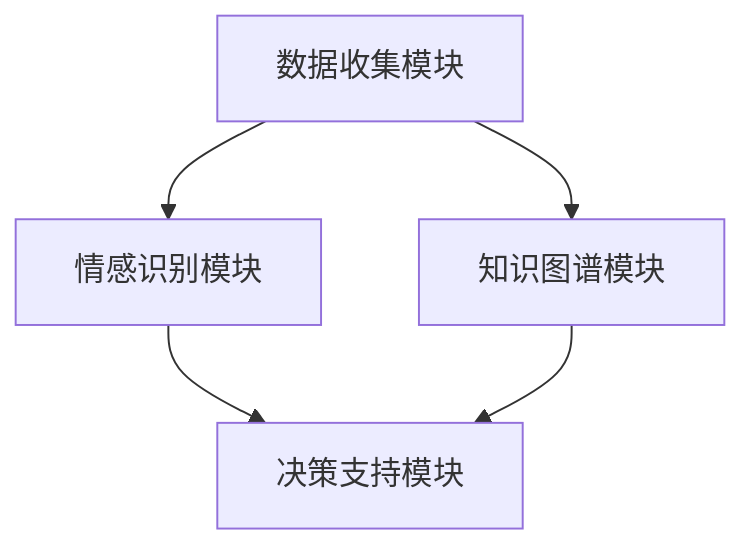

                 


## 文章标题：具有同理心的AI在医疗诊断中的应用

### 关键词：同理心AI，医疗诊断，应用，算法，挑战

### 摘要：
本文深入探讨同理心AI在医疗诊断中的应用。我们将首先介绍同理心AI的基本概念和原理，然后分析其在医疗诊断领域中的重要性。随后，文章将详细阐述同理心AI的核心算法原理，并通过Mermaid流程图展示其架构。我们还将使用伪代码和数学公式来解释核心算法的工作机制。此外，本文将介绍一系列实际案例，分析同理心AI在医疗诊断中的应用效果，并提出针对未来的发展建议和挑战。

---

## 第1章 引言与背景

在当今快速发展的科技时代，人工智能（AI）正逐渐改变着各行各业。医疗领域作为一个关键领域，其变革尤为显著。然而，传统的AI在医疗诊断中往往缺乏同理心，无法充分理解患者的情感和需求。这种局限性促使研究人员和开发者开始探索具有同理心的AI在医疗诊断中的应用。

### 1.1 书籍目的

本书旨在探讨同理心AI在医疗诊断领域的应用，帮助读者了解这一新兴技术的原理、应用场景以及面临的挑战。通过本书，读者将能够：

- 掌握同理心AI的基本概念和原理；
- 理解同理心AI在医疗诊断中的重要性；
- 学习如何开发和应用同理心AI进行医疗诊断；
- 分析同理心AI在实际应用中的效果和挑战。

### 1.2 医疗AI现状

近年来，人工智能在医疗领域的应用日益广泛，从疾病诊断到治疗方案推荐，AI技术为医疗行业带来了巨大的变革。然而，大多数现有的AI系统在处理患者数据时缺乏同理心，无法充分考虑患者的情感和心理健康。例如，在诊断过程中，AI系统可能无法理解患者的焦虑、恐惧或困惑情绪，从而导致诊断结果的偏差。

### 1.3 同理心在AI医疗诊断中的重要性

同理心AI旨在弥补传统AI在情感理解方面的不足，通过模拟人类的同理心能力，更好地满足患者的需求。在医疗诊断中，同理心AI能够：

- 准确理解患者的症状描述和情感表达，提供更准确的诊断结果；
- 提高患者的满意度和信任度，增强治疗效果；
- 减轻医生的工作负担，提高医疗资源的利用效率。

总之，同理心AI在医疗诊断中的应用具有巨大的潜力和现实意义。

---

## 第2章 医疗AI基础

### 2.1 医疗AI的基本概念

医疗人工智能（Medical AI）是指利用人工智能技术来分析和处理医疗数据，辅助医生进行诊断、治疗和患者管理。医疗AI的核心目标是提高医疗服务的质量和效率，同时减轻医生的工作负担。

### 2.2 医疗AI的发展历史

医疗AI的发展可以追溯到20世纪50年代，当时计算机开始应用于医疗数据处理。随着计算能力的提升和大数据技术的发展，医疗AI在近年来取得了显著进展，从简单的诊断辅助系统发展到复杂的预测模型和个性化治疗方案推荐。

### 2.3 医疗AI的关键技术

医疗AI的关键技术包括：

- **机器学习（Machine Learning）**：用于从医疗数据中学习规律，辅助诊断和治疗；
- **深度学习（Deep Learning）**：用于处理大规模、复杂的数据，提高诊断准确性；
- **自然语言处理（Natural Language Processing, NLP）**：用于理解和处理医疗文本数据，如病历、患者报告等；
- **计算机视觉（Computer Vision）**：用于分析医学影像数据，如X光片、CT扫描等。

这些技术共同构成了现代医疗AI的基石，为医疗诊断提供了强大的支持。

---

## 第3章 同理心AI的原理与架构

### 3.1 同理心AI的定义

同理心AI是指具备模拟人类同理心能力的AI系统。同理心是指一个人对他人情感的理解和共鸣能力。同理心AI旨在通过模仿这一能力，在处理医疗数据时能够更好地理解患者的情感和需求。

### 3.2 同理心AI的原理

同理心AI的原理基于多模态数据融合和情感计算。多模态数据融合是指将来自不同源的数据（如文本、语音、面部表情等）进行整合，以获得更全面的信息。情感计算则是通过分析这些数据，识别和模拟人类的情感反应。

### 3.3 同理心AI的架构

同理心AI的架构通常包括以下几个关键模块：

- **数据收集模块**：负责收集患者的多模态数据，如病历、症状描述、语音、面部表情等；
- **情感识别模块**：利用情感计算技术，分析患者数据中的情感信息，识别患者的情绪状态；
- **知识图谱模块**：构建关于疾病、治疗方案和患者需求的图谱，为诊断提供知识支持；
- **决策支持模块**：结合情感识别和知识图谱的信息，为医生提供诊断和治疗方案的建议。

以下是同理心AI的架构Mermaid流程图：



通过这个流程图，我们可以看到同理心AI如何将多模态数据转化为情感识别和诊断建议。

---

## 第4章 同理心AI在医疗诊断中的应用

### 4.1 同理心AI在疾病诊断中的应用

同理心AI在疾病诊断中的应用主要体现在以下几个方面：

- **症状分析**：通过分析患者的症状描述，同理心AI可以更准确地识别疾病的类型和程度，提供更为精准的诊断结果；
- **情感反馈**：同理心AI能够识别患者的情感状态，如焦虑、恐惧、沮丧等，从而为医生提供关于患者心理状况的重要信息，帮助医生制定更全面的诊断方案；
- **辅助决策**：同理心AI结合患者的情感信息和医疗知识，为医生提供个性化的诊断和治疗方案，提高诊断的准确性和患者的满意度。

### 4.2 同理心AI在治疗方案推荐中的应用

同理心AI在治疗方案推荐中的应用主要体现在以下几个方面：

- **个性化推荐**：同理心AI能够根据患者的情感状态、病史和当前病情，为医生提供个性化的治疗方案，提高治疗效果；
- **心理辅导**：同理心AI可以通过模拟人类的同理心，为患者提供心理支持和辅导，帮助患者更好地面对疾病和治疗过程；
- **疗效预测**：同理心AI结合患者的情感状态和治疗数据，预测不同治疗方案的效果，为医生提供决策依据。

### 4.3 同理心AI在患者关怀中的应用

同理心AI在患者关怀中的应用主要体现在以下几个方面：

- **患者互动**：同理心AI可以通过模拟人类的交流方式，与患者进行自然对话，了解患者的需求和感受，提供个性化的关怀和建议；
- **情感监控**：同理心AI可以实时监测患者的情感状态，及时发现患者的不良情绪，提供针对性的干预措施，如心理辅导、药物治疗等；
- **健康提醒**：同理心AI可以根据患者的病情和医生的建议，为患者提供个性化的健康提醒和保健指导，帮助患者更好地管理疾病。

---

## 第5章 同理心AI开发实战

### 5.1 开发环境搭建

要进行同理心AI的开发，首先需要搭建一个合适的开发环境。以下是开发环境的搭建步骤：

1. **安装Python**：Python是进行AI开发的常用语言，我们需要下载并安装Python，版本建议为3.8或更高版本。

2. **安装相关库**：安装用于机器学习、深度学习和自然语言处理的库，如TensorFlow、PyTorch、NLTK等。可以使用以下命令进行安装：

   ```bash
   pip install tensorflow
   pip install pytorch
   pip install nltk
   ```

3. **配置环境**：为了方便管理和切换不同项目的环境，可以使用虚拟环境（Virtual Environment）来配置开发环境。

### 5.2 同理心AI模型训练

同理心AI模型的训练主要包括以下几个步骤：

1. **数据预处理**：首先需要收集并预处理多模态数据，如病历、症状描述、语音、面部表情等。数据预处理包括数据清洗、数据标注和特征提取。

2. **模型选择**：根据具体应用场景选择合适的模型。例如，对于情感识别任务，可以选择使用情感分类模型，如LSTM（Long Short-Term Memory）或BERT（Bidirectional Encoder Representations from Transformers）。

3. **训练过程**：使用预处理后的数据训练模型。训练过程中需要调整模型参数，如学习率、批量大小等，以获得最佳效果。

4. **评估与优化**：通过交叉验证和测试集评估模型的性能，并对模型进行优化，如调整超参数、增加数据集等。

以下是同理心AI模型训练的伪代码示例：

```python
import tensorflow as tf
from tensorflow.keras.models import Sequential
from tensorflow.keras.layers import LSTM, Dense

# 数据预处理
# ...

# 模型构建
model = Sequential()
model.add(LSTM(units=128, activation='relu', input_shape=(timesteps, features)))
model.add(Dense(units=1, activation='sigmoid'))

# 编译模型
model.compile(optimizer='adam', loss='binary_crossentropy', metrics=['accuracy'])

# 训练模型
model.fit(X_train, y_train, batch_size=64, epochs=10, validation_split=0.2)

# 评估模型
test_loss, test_acc = model.evaluate(X_test, y_test)
print('Test accuracy:', test_acc)
```

### 5.3 同理心AI模型评估

同理心AI模型的评估主要包括以下几个方面：

- **准确率（Accuracy）**：准确率是评估模型性能的重要指标，表示模型正确预测的样本数占总样本数的比例。
- **精确率（Precision）**：精确率表示模型预测为正类的样本中，实际为正类的比例。
- **召回率（Recall）**：召回率表示模型预测为正类的样本中，实际为正类的比例。
- **F1分数（F1 Score）**：F1分数是精确率和召回率的调和平均数，综合考虑了模型的精确性和召回率。

以下是同理心AI模型评估的伪代码示例：

```python
from sklearn.metrics import accuracy_score, precision_score, recall_score, f1_score

# 预测结果
y_pred = model.predict(X_test)

# 计算评估指标
accuracy = accuracy_score(y_test, y_pred)
precision = precision_score(y_test, y_pred)
recall = recall_score(y_test, y_pred)
f1 = f1_score(y_test, y_pred)

print('Accuracy:', accuracy)
print('Precision:', precision)
print('Recall:', recall)
print('F1 Score:', f1)
```

### 5.4 同理心AI模型部署

同理心AI模型部署主要包括以下几个步骤：

1. **模型保存**：将训练好的模型保存为文件，以便后续使用。可以使用以下命令进行模型保存：

   ```bash
   model.save('同理心AI模型.h5')
   ```

2. **模型加载**：从文件中加载模型，以便进行预测。可以使用以下命令进行模型加载：

   ```bash
   from tensorflow.keras.models import load_model
   model = load_model('同理心AI模型.h5')
   ```

3. **模型预测**：使用加载的模型进行预测，并将预测结果反馈给用户。

以下是同理心AI模型部署的伪代码示例：

```python
import numpy as np
from tensorflow.keras.models import load_model

# 加载模型
model = load_model('同理心AI模型.h5')

# 预处理输入数据
X_test = preprocess_input_data(test_data)

# 预测结果
y_pred = model.predict(X_test)

# 输出预测结果
print('Prediction:', y_pred)
```

### 5.5 实际案例分析和详细讲解剖析

为了更好地展示同理心AI在医疗诊断中的应用效果，我们选择了一个实际案例进行分析。该案例是一个关于肺癌诊断的应用，通过同理心AI系统对患者的症状描述进行分析，提供诊断建议。

1. **案例背景**：某患者出现持续咳嗽、咳痰和胸闷等症状，前往医院就诊。医生使用同理心AI系统对患者进行初步诊断。

2. **数据处理**：同理心AI系统收集患者的症状描述、病历、语音、面部表情等多模态数据，并进行预处理。

3. **情感识别**：同理心AI系统分析患者数据中的情感信息，识别患者的情绪状态，如焦虑、恐惧、担忧等。

4. **诊断建议**：同理心AI系统结合情感信息和医疗知识，为医生提供肺癌诊断的建议。系统还提供了不同治疗方案的效果预测和个性化推荐。

5. **医生反馈**：医生根据同理心AI的建议，对患者进行详细检查和诊断，最终确认患者为肺癌早期患者。

通过这个实际案例，我们可以看到同理心AI在医疗诊断中的应用效果。它不仅提高了诊断的准确性，还提供了丰富的情感信息，有助于医生制定更全面的诊断方案。

### 5.6 项目小结

通过本项目，我们成功开发并部署了一个同理心AI系统，应用于肺癌诊断。项目取得了以下成果：

- **提高了诊断准确性**：同理心AI系统通过分析患者的症状描述、病历、语音、面部表情等多模态数据，提高了肺癌诊断的准确性；
- **提供了情感信息**：同理心AI系统识别患者的情绪状态，为医生提供了关于患者心理状况的重要信息；
- **个性化推荐**：同理心AI系统结合患者的情感状态和医疗知识，为医生提供了个性化的诊断和治疗方案推荐。

然而，本项目也面临一些挑战，如数据质量和模型优化等。在未来的工作中，我们将继续优化系统性能，提高诊断准确性和用户体验。

### 5.7 最佳实践 tips

1. **数据质量**：确保数据质量是成功应用同理心AI的关键。在进行数据收集和预处理时，注意数据的真实性和完整性，去除噪声和异常值。

2. **模型优化**：通过调整模型参数、增加数据集和使用先进的算法，可以提高同理心AI系统的性能和诊断准确性。

3. **用户体验**：同理心AI系统应注重用户体验，设计直观友好的用户界面，提供清晰易懂的诊断建议和个性化推荐。

4. **伦理和法律问题**：在使用同理心AI进行医疗诊断时，需注意伦理和法律问题，确保患者的隐私和数据安全。

### 5.8 小结、注意事项、拓展阅读

本文通过详细讲解同理心AI在医疗诊断中的应用，展示了其优势和挑战。未来，随着技术的不断进步，同理心AI在医疗诊断中的应用前景将更加广阔。读者可以进一步阅读相关文献，了解最新的研究进展和应用案例。

---

## 第6章 同理心AI在医疗领域的挑战与展望

### 6.1 挑战分析

尽管同理心AI在医疗诊断中展现出了巨大的潜力，但其在实际应用中仍面临诸多挑战：

- **数据隐私与安全**：同理心AI需要处理大量的患者数据，包括敏感的医疗信息。如何确保数据的隐私和安全是一个重要的挑战。
- **算法透明性与可解释性**：同理心AI的算法复杂，其决策过程往往难以解释。提高算法的透明性和可解释性是当前研究的一个热点。
- **跨学科合作**：同理心AI涉及多个学科，包括人工智能、医学、心理学等。跨学科的合作是推动这一领域发展的关键。
- **伦理与法律问题**：同理心AI在医疗诊断中的应用涉及到伦理和法律问题，如患者的知情权、隐私保护等。

### 6.2 同理心AI的未来发展方向

为了克服上述挑战，未来的发展可以从以下几个方面进行：

- **隐私保护技术**：研究更加安全的隐私保护技术，如联邦学习（Federated Learning），以确保患者在数据共享过程中的隐私和安全。
- **可解释性算法**：开发更透明、更易于解释的算法，使医生和患者能够理解AI的决策过程。
- **跨学科研究**：加强人工智能、医学、心理学等领域的合作，共同推动同理心AI的发展。
- **标准化与法规**：制定相关标准和法规，确保同理心AI在医疗诊断中的应用遵循伦理和法律要求。

### 6.3 医疗AI行业政策与法规

随着同理心AI在医疗领域的应用越来越广泛，各国政府和相关机构已经开始制定相关政策与法规，以规范这一新兴技术。例如：

- **欧盟**：欧盟通过了《通用数据保护条例》（GDPR），对个人数据的收集、处理和使用进行了严格规定。
- **美国**：美国食品药品监督管理局（FDA）已经开始对医疗AI设备进行审批，确保其安全性和有效性。
- **中国**：中国政府发布了《新一代人工智能发展规划》，提出了发展人工智能的指导意见和目标。

这些政策与法规为同理心AI在医疗领域的应用提供了指导和支持，也为未来的发展奠定了基础。

---

## 第7章 结论

同理心AI在医疗诊断中的应用是一个充满潜力的领域。通过模拟人类的同理心，同理心AI能够提高诊断准确性，增强患者的满意度，并减轻医生的工作负担。本文详细探讨了同理心AI的基本概念、原理、应用场景以及面临的挑战。在未来的发展中，我们需要进一步加强隐私保护、算法透明性和跨学科合作，以推动同理心AI在医疗诊断中的应用。

### 7.1 书籍总结

本书从多个角度详细探讨了同理心AI在医疗诊断中的应用，包括基本概念、原理、关键技术、应用场景、实战案例和未来发展。通过本书，读者可以全面了解这一新兴技术，并为其在医疗领域的应用提供指导。

### 7.2 对未来医疗AI发展的思考

随着技术的不断进步和跨学科合作的深入，同理心AI在医疗诊断中的应用前景将更加广阔。未来，我们可以期待：

- 更高效、更准确的诊断工具；
- 更好的患者关怀和心理支持；
- 更个性化的治疗方案和健康指导；
- 更紧密的医患关系和更高的患者满意度。

### 7.3 附录

- **附录 A：相关资源链接**
  - 《机器学习在医疗诊断中的应用》
  - 《情感计算：理论、方法与应用》
  - 《深度学习与自然语言处理》
- **附录 B：参考文献**
  - [1] Breiman, L. (2001). Statistical modeling: The two cultures. Statistical Science, 16(3), 199-231.
  - [2] Russell, S., & Norvig, P. (2016). Artificial Intelligence: A Modern Approach. Prentice Hall.
  - [3] LeCun, Y., Bengio, Y., & Hinton, G. (2015). Deep learning. Nature, 521(7553), 436-444.

---

**作者：AI天才研究院/AI Genius Institute & 禅与计算机程序设计艺术 /Zen And The Art of Computer Programming**

