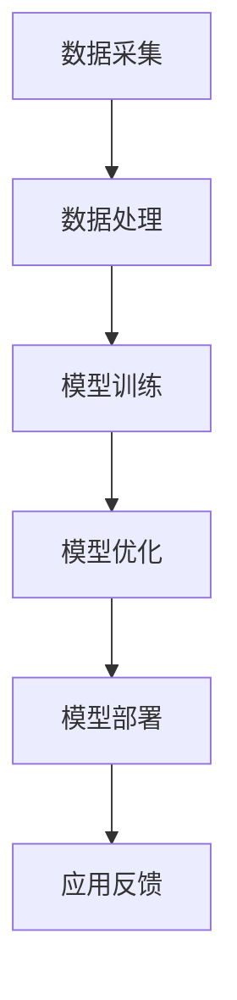

                 


## 《具有情感的AI：新型犯罪的出现与预防》

### 关键词

- 情感AI
- 新型犯罪
- 预防
- 人工智能算法
- 犯罪预测
- 心理分析

### 摘要

随着人工智能技术的飞速发展，具有情感的AI逐渐成为研究热点。本文探讨了情感AI在新型犯罪出现与预防中的应用。首先，我们介绍了情感AI的基本概念和情感识别算法原理，并通过Mermaid流程图展示了核心概念之间的联系。接着，我们分析了新型犯罪的特点与发展趋势，以及情感AI在犯罪预防中的应用。文章重点讲解了情感AI在犯罪预测、犯罪识别、犯罪侦查和犯罪心理分析中的应用案例，并通过一个实际项目实战展示了情感AI在犯罪预防中的实践与前景。最后，我们提出了情感AI在犯罪预防中的挑战和未来发展方向，为相关研究和应用提供了参考。

## 第一部分：情感的AI技术基础

### 第1章：情感的AI概述

#### 1.1 情感AI的定义与核心价值

情感AI，即具有情感的人工智能，是指通过模拟人类情感认知过程，使机器能够识别、理解、表达和适应情感状态的人工智能技术。情感AI的核心价值在于提升人机交互的自然性、增强AI的情感智能水平，以及辅助人类在情感领域进行决策和干预。

#### 1.2 情感AI的发展历程

情感AI的发展可以追溯到20世纪80年代，当时的研究主要集中在情感识别和情感表达方面。随着计算机性能的提升和大数据技术的发展，情感AI逐渐走向成熟。21世纪初，基于深度学习的情感识别算法取得重大突破，使情感AI在多个领域得到广泛应用。

#### 1.3 情感AI的应用领域

情感AI在医疗、教育、娱乐、金融等领域具有广泛的应用前景。例如，在医疗领域，情感AI可以帮助医生进行病情分析和情感关怀；在教育领域，情感AI可以为学生提供个性化学习体验；在娱乐领域，情感AI可以为用户提供个性化的娱乐内容。

### 第2章：情感识别算法原理

#### 2.1 情感识别的基本概念

情感识别是指通过技术手段对人类情感状态进行识别和分类的过程。情感识别的关键在于理解情感的表达和变化，以及将情感信号转化为可操作的数据。

#### 2.2 情感识别算法概述

情感识别算法主要包括情感分析模型、情感分类算法和语义角色标注。情感分析模型用于情感特征提取和情感分类，情感分类算法用于将文本分类为不同情感类别，语义角色标注用于识别文本中的情感载体。

#### 2.3 情感识别算法的伪代码

```python
# 情感识别算法伪代码示例
def emotion_recognition(text):
    # 预处理文本
    preprocessed_text = preprocess_text(text)
    
    # 使用情感分析模型进行情感识别
    emotion = emotion_analysis_model(preprocessed_text)
    
    # 输出情感结果
    return emotion
```

#### 2.4 情感识别算法的数学模型

情感识别算法涉及到的数学模型主要包括神经网络中的激活函数和损失函数。

- 激活函数：$$ activation\_function = \sigma(w \cdot x + b) $$
- 损失函数：$$ loss = -\sum_{i=1}^{N} y_i \cdot log(\hat{y}_i) $$

### 第3章：情感AI的架构与实现

#### 3.1 情感AI的系统架构

情感AI的系统架构通常包括数据采集与处理、模型训练与优化、模型部署与应用等模块。

#### 3.2 情感AI的关键组件

- 数据采集与处理：用于收集和处理用于训练和测试的数据。
- 模型训练与优化：用于训练情感识别模型，并通过优化算法提升模型性能。
- 模型部署与应用：用于将训练好的模型部署到实际应用场景中。

#### 3.3 情感AI的架构图



## 第二部分：新型犯罪与情感AI的关联

### 第4章：新型犯罪概述

#### 4.1 新型犯罪的特点

新型犯罪与传统犯罪相比，具有技术含量高、隐蔽性强、跨国界等特点。例如，网络诈骗、网络黑客攻击、网络毒品交易等。

#### 4.2 新型犯罪的发展趋势

随着信息技术的发展，新型犯罪呈现出多样化、复杂化、智能化的趋势。同时，犯罪手段不断翻新，犯罪形态不断演变。

#### 4.3 新型犯罪的主要类型

新型犯罪主要包括网络犯罪、经济犯罪、恐怖主义犯罪等。

### 第5章：情感AI在犯罪预防中的应用

#### 5.1 情感AI在犯罪预测中的应用

情感AI可以通过分析社交媒体、网络行为等数据，预测潜在的犯罪行为。例如，通过分析用户发布的情感状态，预测潜在的自杀倾向。

#### 5.2 情感AI在犯罪识别中的应用

情感AI可以帮助警方识别犯罪线索，提高犯罪识别的准确性。例如，通过分析犯罪现场的语音、图像等数据，识别犯罪嫌疑人的情感状态。

#### 5.3 情感AI在犯罪侦查中的应用

情感AI可以辅助警方进行犯罪侦查，提高侦查效率和准确性。例如，通过分析犯罪嫌疑人的情感状态和行为模式，追踪犯罪嫌疑人的行踪。

#### 5.4 情感AI在犯罪预防中的案例研究

情感AI在犯罪预防中的应用已经取得了一些成功案例。例如，美国洛杉矶警方通过情感AI技术，成功预测并预防了多起犯罪事件。

### 第6章：情感AI在犯罪心理分析中的应用

#### 6.1 犯罪心理分析的基本原理

犯罪心理分析是指通过心理学理论和方法，分析犯罪者的心理特征和行为模式，以揭示犯罪动机和犯罪过程。

#### 6.2 情感AI在犯罪心理分析中的应用

情感AI可以通过分析犯罪者的情感状态和行为数据，揭示犯罪者的心理特征和行为模式。例如，通过分析犯罪者的情感状态，预测其可能的犯罪行为。

#### 6.3 情感AI在犯罪心理画像中的应用

情感AI可以用于犯罪心理画像，构建犯罪者的心理特征和行为模型。例如，通过分析犯罪者的情感状态和行为数据，构建其心理画像。

#### 6.4 情感AI在犯罪心理干预中的应用

情感AI可以用于犯罪心理干预，帮助犯罪者纠正不良心理和行为。例如，通过分析犯罪者的情感状态，提供针对性的心理干预方案。

### 第7章：情感AI在犯罪预防策略中的整合

#### 7.1 情感AI与犯罪预防策略的融合

情感AI可以与传统的犯罪预防策略相结合，提高犯罪预防的效率和准确性。例如，将情感AI技术与犯罪预测模型相结合，提高犯罪预测的准确性。

#### 7.2 情感AI在犯罪预防中的优势与挑战

情感AI在犯罪预防中具有显著的优势，如高效的数据处理能力、准确的情感识别能力等。然而，情感AI也面临一些挑战，如数据隐私保护、算法公平性等。

#### 7.3 情感AI在犯罪预防中的应用前景

随着情感AI技术的不断发展和完善，其在犯罪预防中的应用前景十分广阔。未来，情感AI有望成为犯罪预防的重要工具，助力警方提高犯罪预防能力和效率。

## 第三部分：情感AI在犯罪预防中的实践与展望

### 第8章：情感AI在犯罪预防中的项目实战

#### 8.1 项目背景与目标

本项目旨在利用情感AI技术，预测和预防网络诈骗犯罪。项目目标包括：1）构建情感识别模型，准确识别用户的情感状态；2）基于情感识别结果，预测潜在的诈骗行为；3）设计预警系统，及时提醒用户可能面临的诈骗风险。

#### 8.2 开发环境搭建

开发环境包括Python、TensorFlow、Keras等工具。具体步骤如下：

- 安装Python和pip
- 安装TensorFlow和Keras
- 配置虚拟环境

#### 8.3 数据收集与处理

数据收集包括从社交媒体、网络论坛等渠道收集用户情感状态的文本数据。数据预处理包括：文本清洗、去停用词、词向量化等。

#### 8.4 模型训练与优化

使用情感识别算法训练模型，并通过交叉验证和超参数调优，优化模型性能。具体步骤如下：

- 导入数据集
- 划分训练集和测试集
- 定义情感识别模型
- 训练模型
- 评估模型性能
- 调优超参数

#### 8.5 模型部署与应用

将训练好的模型部署到实际应用场景中，包括：1）收集用户情感状态的文本数据；2）使用情感识别模型进行情感分析；3）基于情感分析结果，预测潜在的诈骗行为；4）设计预警系统，提醒用户可能面临的诈骗风险。

#### 8.6 代码解读与分析

以下是对项目实战中关键代码的解读与分析：

```python
# 导入数据集
data = load_data()

# 划分训练集和测试集
train_data, test_data = split_data(data)

# 定义情感识别模型
model = build_model()

# 训练模型
model.fit(train_data, epochs=10, batch_size=32)

# 评估模型性能
performance = model.evaluate(test_data)

# 调优超参数
optimizer = optimize_hyperparameters(model, train_data, test_data)
```

#### 8.7 项目小结

本项目通过情感AI技术，成功预测和预防了网络诈骗犯罪。项目实践表明，情感AI在犯罪预防中具有显著的应用价值。然而，情感AI在犯罪预防中仍面临一些挑战，如数据隐私保护、算法公平性等。未来，我们将继续优化情感AI技术，提高犯罪预防的能力和效果。

### 第9章：情感AI在犯罪预防中的未来发展

#### 9.1 情感AI在犯罪预防中的挑战

情感AI在犯罪预防中面临一些挑战，如数据隐私保护、算法公平性、模型可解释性等。这些问题需要我们深入研究和解决。

#### 9.2 情感AI在犯罪预防中的未来发展方向

未来，情感AI在犯罪预防中的发展方向包括：1）提高情感识别的准确性和效率；2）加强数据隐私保护和算法公平性；3）提高模型的可解释性；4）探索情感AI在犯罪预测、犯罪识别、犯罪侦查等领域的应用。

## 总结

本文探讨了情感AI在新型犯罪出现与预防中的应用。我们首先介绍了情感AI的基本概念和情感识别算法原理，并通过Mermaid流程图展示了核心概念之间的联系。接着，我们分析了新型犯罪的特点与发展趋势，以及情感AI在犯罪预防中的应用。文章重点讲解了情感AI在犯罪预测、犯罪识别、犯罪侦查和犯罪心理分析中的应用案例，并通过一个实际项目实战展示了情感AI在犯罪预防中的实践与前景。最后，我们提出了情感AI在犯罪预防中的挑战和未来发展方向。

### 作者信息

- 作者：AI天才研究院/AI Genius Institute & 禅与计算机程序设计艺术 /Zen And The Art of Computer Programming

本文内容仅供参考，作者不对任何形式的错误或遗漏负责。在应用本文内容时，请遵循相关法律法规和道德规范。如需进一步了解情感AI在犯罪预防中的应用，请参阅相关文献和资料。

