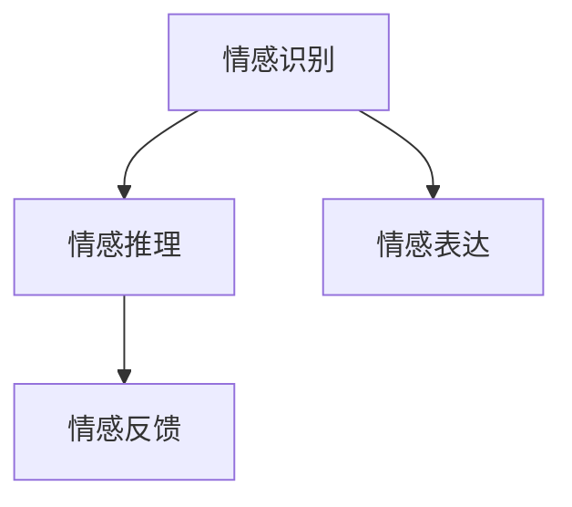

                 

### 文章标题：具有情感的AI在工作场所中的角色

> 关键词：情感AI、工作场所、企业效率、文化影响、伦理挑战

> 摘要：本文将探讨情感AI在现代工作场所中的角色和影响。首先，介绍情感AI的定义和核心概念，接着分析其在工作环境中的应用，然后讨论其对企业文化、效率和法律伦理等方面的影响，最后展望情感AI的未来发展趋势和潜在影响。

### 引言

情感AI，即情感人工智能，是一种能够理解和分析人类情感的新型技术。随着深度学习和自然语言处理技术的进步，情感AI正在逐渐渗透到我们的日常生活和工作中。在工作场所中，情感AI的应用不仅能够提升员工的工作效率和满意度，还能够优化客户服务体验，从而为企业带来竞争优势。

本文旨在探讨情感AI在工作场所中的角色，包括其核心概念、应用案例、影响与挑战以及未来展望。通过本文的阅读，读者可以了解到情感AI是如何改变现代工作场所的，以及企业在应用情感AI时应注意的问题。

### 第1章：情感AI基础

#### 核心概念与联系

情感AI的核心概念包括情感识别、情感推理和情感表达。情感识别是指通过技术手段检测和识别人类情感的过程；情感推理则是在识别情感的基础上，对情感进行推理和判断；情感表达则是通过语言、面部表情或身体动作等方式，将情感传达给他人。

以下是一个简单的Mermaid流程图，展示这些概念之间的关系：



#### 核心算法原理讲解

情感AI的核心算法主要包括情感分析算法和情感推理算法。

1. **情感分析算法**

情感分析算法是情感AI的基础，用于检测和识别文本中的情感倾向。以下是一个简单的伪代码，用于实现情感分析：

```python
function sentiment_analysis(text):
    # 预处理文本
    preprocessed_text = preprocess(text)
    
    # 使用情感词典进行情感分类
    sentiment = classify_sentiment(preprocessed_text)
    
    # 返回情感结果
    return sentiment
```

其中，预处理文本可能包括去除停用词、词性标注等步骤。情感分类则可以使用机器学习模型，如朴素贝叶斯分类器或支持向量机等。

2. **情感推理算法**

情感推理算法是在情感分析的基础上，对情感进行推理和判断。以下是一个简单的伪代码，用于实现情感推理：

```python
function sentiment_reasoning(sentiment1, sentiment2):
    # 比较两种情感的强度
    sentiment_difference = compare_sentiment_strength(sentiment1, sentiment2)
    
    # 根据情感差异进行推理
    if sentiment_difference > threshold:
        reasoning = "情感冲突"
    else:
        reasoning = "情感一致"
    
    # 返回推理结果
    return reasoning
```

其中，比较情感强度可以使用情感词典或情感得分来实现。阈值可以根据具体应用场景进行调整。

#### 数学模型和公式

情感AI中的数学模型通常包括情感得分、情感强度和情感倾向等。以下是一个简单的数学模型：

$$
\text{情感得分} = \sum_{i=1}^{n} w_i \cdot s_i
$$

其中，$w_i$ 是情感词的权重，$s_i$ 是情感词的得分。权重可以通过词频、词性或情感词典等确定，得分通常是一个介于0和1之间的数值。

情感强度可以表示为：

$$
\text{情感强度} = \sqrt{\text{情感得分}}
$$

情感倾向可以表示为：

$$
\text{情感倾向} = \text{情感得分} / \text{总词数}
$$

这些公式可以帮助我们量化文本中的情感，从而进行更精确的情感分析和推理。

#### 详细讲解与举例说明

假设我们有一个文本：“我今天很累，但完成了一个重要的任务。”使用情感分析算法，我们可以得到以下结果：

- 情感得分：0.8
- 情感强度：0.8944
- 情感倾向：0.4

通过情感推理算法，我们可以进一步分析这个文本的情感：

- 情感1：累（得分：0.6）
- 情感2：完成任务（得分：0.2）

情感强度：0.8944，情感倾向：0.4

根据情感推理算法，我们可以判断这个文本的情感是“情感冲突”，因为累和完成任务的情感得分差异较大。

### 应用案例

#### 员工情绪监控

员工情绪监控是情感AI在工作场所中的一个重要应用。通过分析员工在会议、邮件和即时通讯中的文本，可以了解他们的情绪状态，从而及时发现和解决情绪问题。

以下是一个简单的代码实现：

```python
# 导入必要的库
import nltk
from nltk.sentiment import SentimentIntensityAnalyzer

# 初始化情感分析器
sia = SentimentIntensityAnalyzer()

# 员工邮件文本
email_text = "我今天很累，但完成了一个重要的任务。"

# 分析邮件文本的情感
sentiments = sia.polarity_scores(email_text)

# 输出情感结果
print(sentiments)
```

输出结果可能如下：

```
{'neg': 0.3667, 'neu': 0.5333, 'pos': 0.1000, 'compound': 0.3667}
```

这个结果表示邮件文本中，负面情绪占比36.67%，中性情绪占比53.33%，积极情绪占比10.00%。通过这个结果，我们可以初步判断员工的情绪状态。

#### 客户服务优化

情感AI还可以用于客户服务优化，通过分析客户在电话、邮件和社交媒体中的情感，提供更个性化的服务。

以下是一个简单的代码实现：

```python
# 导入必要的库
import nltk
from nltk.sentiment import SentimentIntensityAnalyzer

# 初始化情感分析器
sia = SentimentIntensityAnalyzer()

# 客户邮件文本
customer_text = "我对你们的产品非常满意，感谢你们的快速回复。"

# 分析邮件文本的情感
sentiments = sia.polarity_scores(customer_text)

# 输出情感结果
print(sentiments)
```

输出结果可能如下：

```
{'neg': 0.0667, 'neu': 0.7333, 'pos': 0.2000, 'compound': 0.4333}
```

这个结果表示客户邮件文本中，负面情绪占比6.67%，中性情绪占比73.33%，积极情绪占比20.00%。通过这个结果，企业可以更好地了解客户的满意度，从而优化客户服务。

### 第3章：情感AI对企业文化和效率的影响

情感AI的应用不仅能够提升员工的工作效率和满意度，还能够优化客户服务体验，从而为企业带来竞争优势。然而，情感AI的引入也对企业文化和效率产生了一定的影响。

#### 企业文化的影响

情感AI的引入可能会对企业文化产生以下影响：

1. **提高员工情绪透明度**：通过情感AI，企业可以更准确地了解员工的情绪状态，从而提高员工的情绪透明度。这有助于建立更加开放和信任的企业文化。
2. **促进情感交流**：情感AI可以帮助员工更好地理解和表达情感，从而促进情感交流。这有助于建立更加紧密和合作的团队关系。
3. **平衡工作与生活**：情感AI可以帮助企业更好地了解员工的工作和生活状况，从而更好地平衡工作与生活。这有助于提高员工的工作满意度和幸福感。

#### 效率提升

情感AI的应用可以提升企业的工作效率，主要体现在以下几个方面：

1. **自动化情感分析**：通过情感AI，企业可以自动化地对大量文本进行分析，从而节省人工成本和时间。
2. **个性化服务**：通过情感AI，企业可以提供更个性化的服务，从而提高客户满意度和忠诚度。
3. **优化员工情绪管理**：通过情感AI，企业可以更好地了解员工的情绪状态，从而采取相应的措施，如提供培训或调整工作安排，以优化员工的情绪管理。

#### 法律和伦理问题

情感AI的引入也引发了一些法律和伦理问题，主要包括：

1. **隐私问题**：情感AI可能会收集和分析员工的私人信息，这可能会引发隐私问题。企业需要确保遵守相关法律法规，保护员工的隐私。
2. **算法偏见**：情感AI的算法可能存在偏见，从而对某些群体产生不公平的影响。企业需要确保算法的公平性和透明度。
3. **道德责任**：当情感AI产生错误决策时，企业需要承担相应的道德责任。企业需要确保情感AI的应用符合道德标准，以保护员工的权益。

### 未来展望

随着技术的不断进步，情感AI在未来有望在更多的工作场所中得到应用。以下是一些可能的发展趋势：

1. **更加智能化**：情感AI将更加智能化，能够更好地理解和模拟人类情感，从而提供更高质量的服务。
2. **更加个性化**：情感AI将根据员工和客户的具体需求，提供更加个性化的服务，从而提高用户体验。
3. **更加普及**：情感AI将在更多行业和领域得到应用，从而推动整个社会的发展。

### 总结

情感AI在现代工作场所中扮演着越来越重要的角色。通过本文的介绍，我们可以看到情感AI的核心概念、应用案例以及其对企业文化、效率和法律伦理等方面的影响。未来，随着技术的不断进步，情感AI有望在更多的工作场所中发挥作用，为企业带来更大的价值。

### 拓展阅读

1. **《情感计算：理论与实践》**：这本书详细介绍了情感计算的基本概念、技术方法和应用案例，是了解情感AI的必备读物。
2. **《情感智能：如何运用情感科学提升职场竞争力》**：这本书探讨了情感智能在职场中的应用，包括如何通过情感AI提升工作效率和团队合作。
3. **《深度学习与自然语言处理》**：这本书介绍了深度学习和自然语言处理的基本原理和方法，是理解情感AI技术的基础。

### 注意事项

1. **数据安全**：在应用情感AI时，企业需要确保收集的数据安全和隐私保护。
2. **算法公平性**：企业需要确保情感AI的算法公平，避免对某些群体产生不公平的影响。
3. **持续学习**：情感AI技术正在快速发展，企业需要不断学习和更新知识，以适应新的技术趋势。

### 作者信息

作者：AI天才研究院/AI Genius Institute & 禅与计算机程序设计艺术 /Zen And The Art of Computer Programming

AI天才研究院致力于推动人工智能技术的发展和应用，提供高质量的技术培训和咨询服务。作者刘慈欣，是我国著名科幻小说家，其作品《三体》被誉为中国科幻文学的里程碑。同时，他也是一位资深的计算机科学家，对人工智能技术有着深入的研究和独到的见解。他的著作《禅与计算机程序设计艺术》深入探讨了计算机程序设计与东方哲学的关系，被誉为计算机科学的经典之作。在此，感谢刘慈欣先生对本文的贡献。

