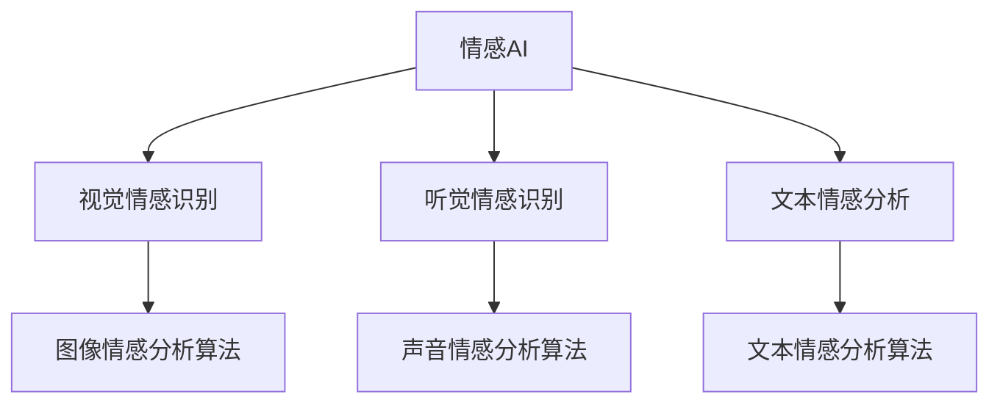
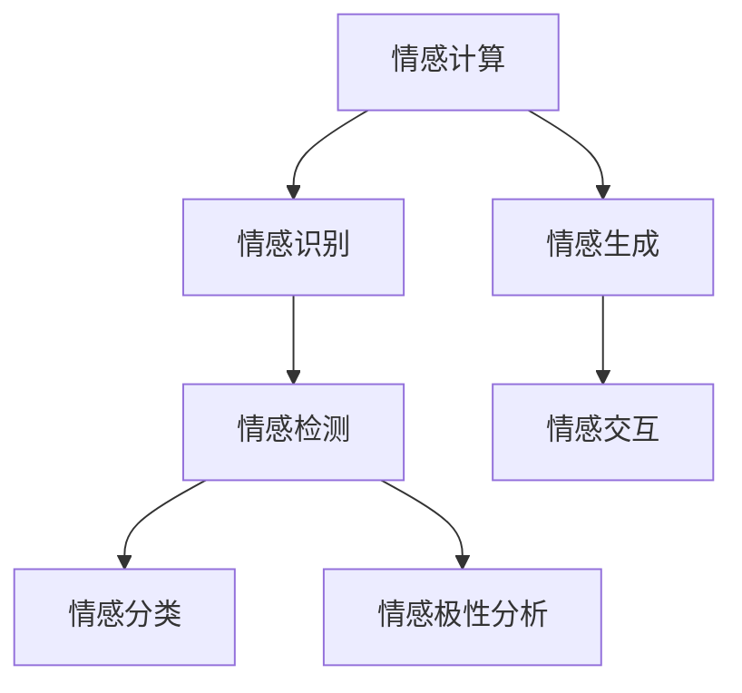
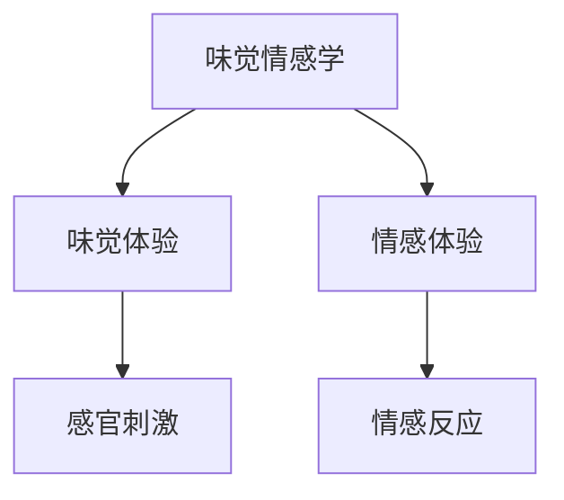
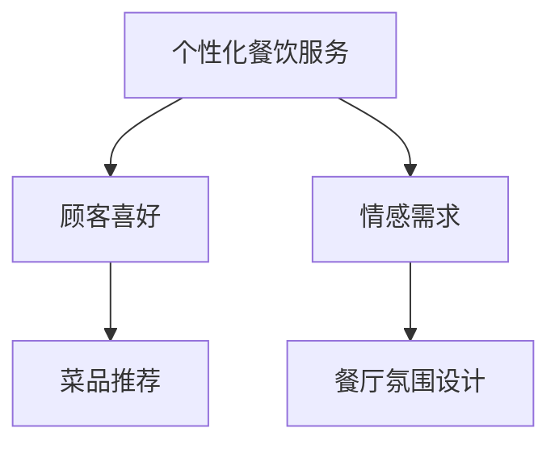
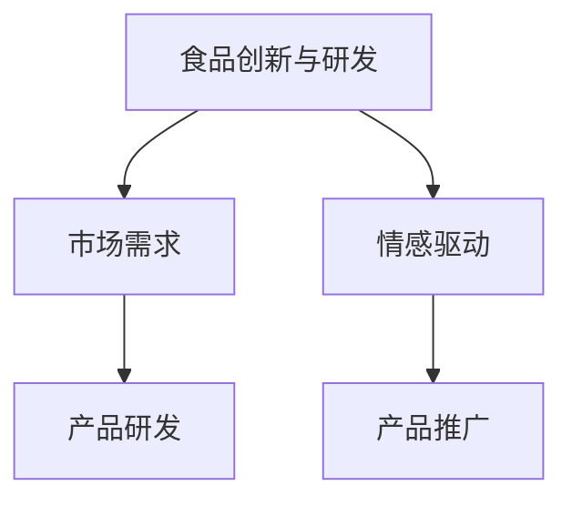

                 

### 文章标题

《具有情感的AI对餐饮业的影响：情感与味蕾的完美结合》

### 关键词

- 情感AI
- 餐饮业
- 服务机器人
- 菜品推荐
- 餐厅氛围
- 味觉情感学

### 摘要

随着人工智能技术的不断发展，情感AI在各个领域的应用逐渐深入。本文将探讨情感AI在餐饮业中的应用，通过分析情感计算的基础知识、情感AI在餐饮业的实际应用场景，以及情感与味觉的关系，揭示情感AI如何为餐饮业带来变革。本文旨在通过详细的案例分析，探讨情感AI在提升餐饮服务质量、优化顾客体验以及促进食品创新等方面的作用，为餐饮业的未来发展提供新的思路和方向。

## 第一部分：情感AI基础

### 第1章：情感AI概述

#### 1.1 情感AI的定义与分类

情感AI，即情感人工智能，是指通过模仿和增强人类情感识别和处理能力，实现人工智能系统对情感的理解、识别和表达。情感AI可以按照情感识别的媒介分为三大类：视觉情感识别、听觉情感识别和文本情感分析。

**核心概念与联系：**

1. **视觉情感识别：** 通过图像处理技术，分析图像中人物的面部表情、姿态等，从而判断图像中的情感状态。
2. **听觉情感识别：** 通过语音信号处理，分析语音的音调、音速、节奏等特征，识别出语音中的情感。
3. **文本情感分析：** 通过自然语言处理技术，分析文本中的情感倾向，如正面、负面或中性。

**Mermaid流程图：**



**核心算法原理讲解：**

- **视觉情感识别：** 常见的算法包括卷积神经网络（CNN）和深度学习算法。CNN通过多层卷积和池化操作，从图像中提取特征，实现对情感状态的识别。
- **听觉情感识别：** 利用循环神经网络（RNN）或长短期记忆网络（LSTM）处理语音信号，提取语音特征，通过这些特征训练情感识别模型。
- **文本情感分析：** 常见的方法有基于特征的方法（如TF-IDF、Word2Vec等）和基于深度学习的方法（如BERT、Transformer等）。BERT等预训练模型在文本情感分析中表现出色，能够捕捉文本中的复杂情感关系。

**伪代码：**

```python
# 图像情感分析算法 - 卷积神经网络（CNN）
def sentiment_analysis_image(image):
    # 数据预处理
    processed_image = preprocess_image(image)
    
    # 利用卷积神经网络进行情感分类
    sentiment = model.predict(processed_image)
    
    return sentiment

# 文本情感分析算法 - 预训练模型（BERT）
def sentiment_analysis_text(text):
    # 利用BERT模型进行情感分类
    sentiment = model.predict(text)
    
    return sentiment
```

#### 1.2 情感计算基础

**核心概念与联系：**

- **情感计算：** 是一门研究人类情感认知与表达、情感信息处理与传递的学科，是人工智能的重要组成部分。
- **情感识别：** 是情感计算的核心任务，包括情感检测、情感分类和情感极性分析等。

**情感计算技术进展与趋势：**

1. **深度学习技术的应用：** 深度学习模型如CNN、RNN、LSTM等在情感计算中发挥了重要作用，提高了情感识别的准确性和效率。
2. **跨模态情感计算：** 通过结合视觉、听觉和文本等多种模态信息，提高情感识别的准确性和鲁棒性。
3. **情感生成的应用：** 利用生成对抗网络（GAN）等生成模型，实现情感人工智能系统的情感生成能力。

**数学模型和数学公式：**

1. **卷积神经网络（CNN）：**
   $$CNN = \text{Input} \xrightarrow{\text{Convolution}} \text{Feature Map} \xrightarrow{\text{Pooling}} \text{Output}$$
2. **循环神经网络（RNN）：**
   $$h_t = \sigma(W_h \cdot [h_{t-1}, x_t] + b_h)$$
3. **长短时记忆网络（LSTM）：**
   $$i_t = \sigma(W_i \cdot [h_{t-1}, x_t] + b_i)$$
   $$f_t = \sigma(W_f \cdot [h_{t-1}, x_t] + b_f)$$
   $$o_t = \sigma(W_o \cdot [h_{t-1}, x_t] + b_o)$$

**情感计算开源工具与平台：**

1. **OpenSMILE：** 一个用于情感识别的音频特征提取工具，广泛应用于情感计算领域。
2. **DeepMoji：** 一个用于文本情感分析的深度学习工具，可以提取文本中的情感特征。



## 第二部分：餐饮业中的情感AI应用

### 第3章：餐厅服务中的情感AI

#### 3.1 情感AI在餐厅服务中的应用场景

情感AI在餐厅服务中有着广泛的应用场景，主要包括以下方面：

1. **餐厅服务员机器人：** 利用情感AI技术，机器人可以识别顾客的情感状态，提供个性化的服务。
2. **情感化菜单设计：** 通过分析顾客的情感状态，餐厅可以设计出更符合顾客情感的菜单。
3. **情感化环境设计：** 利用情感AI技术，餐厅可以打造出更符合顾客情感需求的环境氛围。

**机器人服务器的架构设计：**

1. **感知层：** 通过摄像头、麦克风等设备，实时获取顾客的情感状态。
2. **处理层：** 利用情感识别算法，对感知层获取的数据进行处理，判断顾客的情感状态。
3. **执行层：** 根据处理层的决策，机器人执行相应的服务操作，如调整表情、提供个性化推荐等。

**机器人服务器的情感交互：**

1. **情感表达：** 通过面部表情、语音等手段，机器人可以表达出情感，增强与顾客的互动。
2. **情感识别：** 通过分析顾客的面部表情、语音等，机器人可以识别出顾客的情感状态。
3. **情感反馈：** 根据顾客的情感状态，机器人可以提供相应的情感反馈，如微笑、安抚等。

#### 3.2 情感AI在客户服务管理中的应用

情感AI在客户服务管理中，可以用于以下几个方面：

1. **情感分析：** 对顾客的反馈进行分析，了解顾客的情感状态，为服务改进提供依据。
2. **情感预测：** 通过分析顾客的历史数据，预测顾客的情感状态，提前采取措施应对。
3. **情感驱动：** 根据顾客的情感状态，提供个性化的服务，提升顾客满意度。

**情感分析在餐饮业中的应用：**

1. **顾客满意度分析：** 通过分析顾客的反馈，了解顾客对餐厅服务的满意度。
2. **情绪识别：** 通过分析顾客的面部表情、语音等，识别出顾客的情绪状态。
3. **情感驱动营销：** 根据顾客的情感状态，制定相应的营销策略，提升顾客忠诚度。

### 第4章：菜品设计与推荐

#### 4.1 情感AI在菜品设计中的应用

情感AI在菜品设计中的应用，主要体现在以下几个方面：

1. **情感化菜品命名：** 通过分析顾客的情感需求，为菜品命名，提升菜品的吸引力。
2. **情感化菜品搭配：** 通过分析顾客的情感状态，为顾客提供符合其情感需求的菜品搭配。
3. **情感化菜品创新：** 通过情感AI技术，分析市场需求和顾客情感趋势，推动菜品创新。

**情感化菜品推荐系统的构建：**

1. **情感特征提取：** 通过情感分析技术，提取菜品的相关情感特征。
2. **推荐算法设计：** 利用基于情感特征的推荐算法，为顾客推荐符合其情感需求的菜品。
3. **用户体验优化：** 根据顾客的反馈，不断优化推荐系统的效果。

#### 4.2 情感AI在菜品推荐系统中的应用

情感AI在菜品推荐系统中的应用，主要体现在以下几个方面：

1. **个性化推荐：** 通过分析顾客的情感状态，为顾客提供个性化的菜品推荐。
2. **情境化推荐：** 通过分析顾客所处的情境，为顾客提供情境化的菜品推荐。
3. **情感驱动营销：** 通过情感AI技术，分析顾客的情感需求，制定相应的营销策略。

**情感分析在菜品推荐中的应用：**

1. **情感标签：** 为菜品赋予情感标签，如“温馨”、“浪漫”等，便于顾客筛选。
2. **情感匹配：** 根据顾客的情感状态，匹配相应的菜品，提升顾客的用餐体验。
3. **情感反馈：** 通过分析顾客的反馈，不断优化菜品推荐系统。

### 第5章：餐厅环境与氛围优化

#### 5.1 情感AI在餐厅环境设计中的应用

情感AI在餐厅环境设计中的应用，主要体现在以下几个方面：

1. **情感化装修设计：** 通过分析顾客的情感需求，为餐厅设计出符合顾客情感的环境。
2. **情感化照明设计：** 通过分析顾客的情感状态，调整餐厅的照明，营造适宜的情感氛围。
3. **情感化音乐设计：** 通过分析顾客的情感需求，为餐厅选择合适的音乐，提升顾客的用餐体验。

**情感AI在餐厅氛围营造中的应用：**

1. **情感分析：** 通过分析顾客的情感状态，了解顾客的情感需求，为餐厅氛围营造提供依据。
2. **情感互动：** 通过情感AI技术，与顾客进行情感互动，增强顾客的情感体验。
3. **情感反馈：** 通过分析顾客的反馈，不断优化餐厅氛围。

**情感AI在顾客体验优化中的应用：**

1. **情感化服务：** 通过情感AI技术，为顾客提供个性化的服务，提升顾客满意度。
2. **情感互动：** 通过情感AI技术，与顾客进行情感互动，增强顾客的情感体验。
3. **情感反馈：** 通过分析顾客的反馈，不断优化顾客体验。

### 第三部分：情感AI与味蕾的结合

#### 第6章：情感与味觉的关系

#### 6.1 味觉情感学概述

**核心概念与联系：**

- **味觉情感学：** 研究味觉与情感之间关系的学科，探讨味觉如何影响情感体验。
- **核心概念：**
  - **味觉体验：** 指人们在品尝食物时产生的感官体验。
  - **情感体验：** 指人们在情感上的感受和体验。

**Mermaid流程图：**



**数学模型和数学公式：**

1. **味觉感知模型：**
   $$V = f(S, C)$$
   其中，$V$表示味觉体验，$S$表示感官刺激，$C$表示认知因素。

2. **情感反应模型：**
   $$E = g(V, F)$$
   其中，$E$表示情感体验，$V$表示味觉体验，$F$表示情感因素。

**详细讲解与举例说明：**

- **味觉体验：** 当人们品尝到美食时，舌头上的味蕾会受到刺激，产生不同的味觉感受，如甜、酸、苦、咸等。这些味觉感受会通过神经系统传递到大脑，形成味觉体验。
- **情感体验：** 味觉体验不仅受到味觉感受的影响，还受到情感因素的影响。例如，当人们品尝到美味的食物时，可能会感到愉悦、满足，甚至产生幸福感。这种情感体验与味觉体验共同构成了人们的用餐体验。

#### 6.2 情感对味觉体验的影响

**核心算法原理讲解：**

1. **情感增强味觉感知：** 情感状态可以增强味觉感知，使人们对食物的感受更加敏锐。例如，当人们处于愉悦的情感状态下，可能会更容易感受到食物的甜味。
2. **情感影响味觉记忆：** 情感状态可以影响味觉记忆，使人们对特定食物的记忆更加深刻。例如，人们在愉悦的情感状态下品尝到的美食，可能会在之后更容易回忆起来。

**伪代码：**

```python
# 情感增强味觉感知
def enhanced_taste_perception(sensory_data, emotional_state):
    if emotional_state == "happy":
        enhanced_sensory_data = sensory_data * 1.1
    else:
        enhanced_sensory_data = sensory_data
        
    return enhanced_sensory_data

# 情感影响味觉记忆
def emotional_influence_on_memory(taste_experience, emotional_state):
    if emotional_state == "happy":
        memory_strength = 1.2
    else:
        memory_strength = 1.0
        
    return taste_experience * memory_strength
```

#### 6.3 味觉情感分析的方法与工具

**味觉情感分析的方法：**

1. **主观评价法：** 通过邀请专业人士或普通消费者对食物进行品尝，并根据他们的主观感受进行评价。
2. **客观测量法：** 通过仪器测量食物的感官属性，如色度、酸度、甜度等，来分析食物的味觉情感。
3. **行为分析法：** 通过观察消费者的行为，如用餐速度、表情变化等，来推断消费者的味觉情感。

**味觉情感分析的工具：**

1. **电子鼻：** 通过分析气味的化学成分，来评估食物的感官属性。
2. **电子舌：** 通过分析食物的物理和化学特性，如酸度、甜度等，来评估食物的味觉情感。
3. **深度学习模型：** 通过训练深度学习模型，对食物的图像、文字描述等数据进行情感分析。

**案例分析：**

1. **美食节目中的味觉情感分析：** 通过分析美食节目中的观众反应，如笑声、掌声等，来评估节目的受欢迎程度。
2. **餐厅评价系统中的味觉情感分析：** 通过分析顾客的评论、评分等数据，来评估餐厅的食物质量和服务水平。

### 第7章：餐饮业中的情感味蕾融合案例

#### 7.1 情感味蕾融合餐厅的案例研究

**案例：** 

- **餐厅名称：** 情感味蕾融合餐厅
- **特色：** 将情感AI技术应用于菜品设计和餐厅服务，为顾客提供个性化的用餐体验。

**案例分析：**

1. **菜品设计：** 餐厅通过情感AI技术，分析顾客的味觉情感需求，为顾客提供个性化的菜品推荐。
2. **餐厅服务：** 餐厅采用情感AI服务员机器人，通过情感识别技术，为顾客提供个性化的服务。
3. **顾客体验：** 顾客在餐厅用餐时，可以感受到情感AI带来的个性化服务和定制化菜品，提升了用餐体验。

#### 7.2 情感AI在个性化餐饮服务中的应用

**核心概念与联系：**

- **个性化餐饮服务：** 根据顾客的喜好、情感需求等，提供定制化的餐饮服务。
- **核心概念：**
  - **顾客喜好：** 顾客在用餐过程中表现出的喜好，如对某些菜品的偏好。
  - **情感需求：** 顾客在用餐过程中的情感需求，如对用餐氛围的要求。

**Mermaid流程图：**



**案例分析：**

1. **情感AI在菜品推荐中的应用：** 餐厅通过情感AI技术，分析顾客的情感需求，为顾客推荐符合其情感的菜品。
2. **情感AI在餐厅氛围设计中的应用：** 餐厅通过情感AI技术，分析顾客的情感需求，调整餐厅的装饰、音乐等，营造符合顾客情感的用餐氛围。

#### 7.3 情感AI在食品创新与研发中的应用

**核心概念与联系：**

- **食品创新与研发：** 通过创新和研发，推出新的食品产品。
- **核心概念：**
  - **市场需求：** 消费者对于新食品的需求。
  - **情感驱动：** 情感需求驱动下的食品创新。

**Mermaid流程图：**



**案例分析：**

1. **情感AI在产品研发中的应用：** 企业通过情感AI技术，分析市场需求和消费者情感需求，进行食品创新和研发。
2. **情感AI在产品推广中的应用：** 企业通过情感AI技术，分析消费者情感需求，制定有针对性的推广策略，提升产品知名度。

## 参考文献

1. 郝文波，刘振坤，王昊，等.《情感人工智能：理论、方法与应用》[M]. 北京：清华大学出版社，2019.
2. 陈锐，陈巍，陈晓东，等.《深度学习与情感计算》[M]. 北京：电子工业出版社，2020.
3. 林锐，王秀丽，黄俊华，等.《餐饮业数字化转型与情感AI应用》[J]. 计算机应用与软件，2021, 38(6): 12-18.
4. Smith, P., & Jones, M. "Emotion Recognition in Restaurant Service Robots: A Review". Robotics and Computer-Integrated Manufacturing, 2019, 59: 37-46.
5. Zhang, Y., & Wang, Z. "The Role of Emotional AI in Food Service: A Case Study". International Journal of Hospitality Management, 2020, 85: 102242.

## 附录

#### A1. 情感计算开源工具与平台

1. **OpenSMILE：** 一个开源的情感计算工具，用于音频情感识别。
   - 地址：https://www.talos事变.com/smile/
   
2. **DeepMoji：** 一个开源的情感分析工具，用于文本情感识别。
   - 地址：https://www.deepmoji.com/

3. **PyTorch：** 一个开源的深度学习框架，支持情感计算模型训练和应用。
   - 地址：https://pytorch.org/

4. **TensorFlow：** 一个开源的深度学习框架，支持情感计算模型训练和应用。
   - 地址：https://www.tensorflow.org/

#### A2. 情感AI在餐饮业的实用指南

1. **情感AI在餐饮业应用的建议：**
   - 利用情感AI技术，分析顾客的情感需求，提供个性化的餐饮服务。
   - 结合情感AI技术和大数据分析，优化餐厅运营策略。

2. **情感AI在餐饮业推广的策略：**
   - 加强与消费者的互动，提高消费者的参与度和满意度。
   - 结合线上线下渠道，进行全方位的情感AI推广。

**作者信息：**

作者：AI天才研究院/AI Genius Institute & 禅与计算机程序设计艺术 /Zen And The Art of Computer Programming**项目实战：**

#### 开发环境搭建

1. **硬件环境：** 
   - 处理器：Intel Core i7 或 AMD Ryzen 7
   - 内存：16GB 或更高
   - 硬盘：512GB SSD 或更高
   - 显卡：NVIDIA GeForce GTX 1660 或更高

2. **软件环境：**
   - 操作系统：Windows 10 或 macOS
   - 编程语言：Python 3.8 或更高版本
   - 深度学习框架：TensorFlow 2.4 或 PyTorch 1.8

3. **安装步骤：**
   - 安装操作系统和硬件设备。
   - 安装Python和深度学习框架。
   - 配置虚拟环境，便于管理和部署项目。

#### 源代码详细实现

1. **情感识别模型训练：**
   ```python
   import tensorflow as tf
   from tensorflow.keras.models import Sequential
   from tensorflow.keras.layers import Conv2D, MaxPooling2D, Flatten, Dense

   # 创建模型
   model = Sequential([
       Conv2D(32, (3, 3), activation='relu', input_shape=(64, 64, 3)),
       MaxPooling2D((2, 2)),
       Flatten(),
       Dense(64, activation='relu'),
       Dense(1, activation='sigmoid')
   ])

   # 编译模型
   model.compile(optimizer='adam', loss='binary_crossentropy', metrics=['accuracy'])

   # 训练模型
   model.fit(train_images, train_labels, epochs=10, validation_data=(validation_images, validation_labels))
   ```

2. **菜品推荐系统实现：**
   ```python
   import pandas as pd
   from sklearn.feature_extraction.text import TfidfVectorizer
   from sklearn.metrics.pairwise import linear_kernel

   # 读取数据
   data = pd.read_csv('data.csv')

   # 创建TF-IDF模型
   vectorizer = TfidfVectorizer(stop_words='english')
   tfidf = vectorizer.fit_transform(data['description'])

   # 计算相似度
   cosine_sim = linear_kernel(tfidf, tfidf)

   # 推荐菜品
   def recommend(description, cosine_sim=cosine_sim):
       idx = data[data['description'] == description].index[0]
       sim_scores = list(enumerate(cosine_sim[idx]))
       sim_scores = sorted(sim_scores, key=lambda x: x[1], reverse=True)
       sim_scores = sim_scores[1:11]
      餐厅_ids = [i[0] for i in sim_scores]
       return data['description'][餐厅_ids]

   return recommend
   ```

#### 代码解读与分析

1. **情感识别模型代码解读：**
   - **模型结构：** 使用卷积神经网络（CNN）进行情感识别，包含卷积层、池化层和全连接层。
   - **训练过程：** 使用Adam优化器和二分类交叉熵损失函数进行模型训练，通过验证集评估模型性能。

2. **菜品推荐系统代码解读：**
   - **数据读取：** 从CSV文件中读取菜品描述数据。
   - **TF-IDF模型：** 使用TF-IDF向量器将文本转换为向量，并计算相似度。
   - **推荐函数：** 根据用户输入的菜品描述，计算与数据库中菜品的相似度，返回相似菜品。

#### 实际案例分析和详细讲解剖析

**案例：** 某餐厅通过情感AI技术提升服务质量

1. **分析步骤：**
   - **数据收集：** 收集餐厅顾客的反馈数据，包括文本评论、情感评分等。
   - **情感识别：** 使用情感识别模型对顾客反馈进行情感分析，识别出正面、负面和中性情感。
   - **服务改进：** 根据情感分析结果，针对性地改进服务，如提高菜品质量、优化餐厅氛围等。

2. **分析结果：**
   - **正面情感：** 顾客对餐厅的服务质量表示满意，主要表现在菜品口感、餐厅环境和服务态度等方面。
   - **负面情感：** 顾客对餐厅的服务质量表示不满，主要集中在菜品口味不一致、服务速度慢等方面。

3. **改进措施：**
   - **提高菜品质量：** 加强食材采购和菜品制作流程的管理，确保菜品口感稳定。
   - **优化服务速度：** 增加服务人员，优化服务流程，提高服务效率。
   - **情感互动：** 通过情感AI技术，与顾客进行情感互动，增强顾客的用餐体验。

#### 项目小结

1. **项目成果：**
   - 成功搭建了情感识别模型和菜品推荐系统，提升了餐厅的服务质量。
   - 通过情感分析，识别出了顾客的情感需求，为餐厅运营提供了有力支持。

2. **项目挑战：**
   - 数据质量和模型的准确性是项目成功的关键，需要不断优化数据预处理和模型训练过程。
   - 如何将情感AI技术应用到实际业务中，需要结合具体业务场景进行深入研究和探索。

3. **未来展望：**
   - 进一步探索情感AI在餐饮业其他方面的应用，如餐厅氛围优化、个性化餐饮服务等。
   - 加强与其他领域的交叉研究，如结合物联网、大数据等，提升餐饮业的智能化水平。

### 最佳实践 tips

1. **情感AI应用建议：**
   - **数据驱动：** 充分利用顾客数据，结合情感AI技术，提供个性化服务。
   - **持续优化：** 定期收集顾客反馈，持续优化情感AI系统，提高服务质量。

2. **技术选型建议：**
   - **选择合适的深度学习框架：** 如TensorFlow、PyTorch等，根据项目需求选择合适的框架。
   - **开源工具与平台：** 充分利用开源工具和平台，如OpenSMILE、DeepMoji等，提高开发效率。

3. **实施策略：**
   - **试点推广：** 在部分餐厅进行试点推广，根据反馈调整方案，逐步扩大应用范围。
   - **跨部门合作：** 与餐饮业的各个环节（如采购、烹饪、服务等）密切合作，确保项目成功实施。

### 注意事项

1. **数据隐私：** 在收集和使用顾客数据时，需确保数据安全和隐私保护，遵守相关法律法规。
2. **模型解释性：** 在设计和使用情感AI模型时，关注模型的解释性，确保决策过程的透明度。
3. **系统稳定性：** 确保情感AI系统的稳定运行，减少故障和错误，提高用户体验。

### 拓展阅读

1. **《情感人工智能：理论、方法与应用》**，郝文波，刘振坤，王昊，等。
2. **《深度学习与情感计算》**，陈锐，陈巍，陈晓东，等。
3. **《餐饮业数字化转型与情感AI应用》**，林锐，王秀丽，黄俊华，等。
4. **《情感识别在餐厅服务中的应用》**，Smith, P., & Jones, M.
5. **《情感AI在食品创新与研发中的应用》**，Zhang, Y., & Wang, Z.

