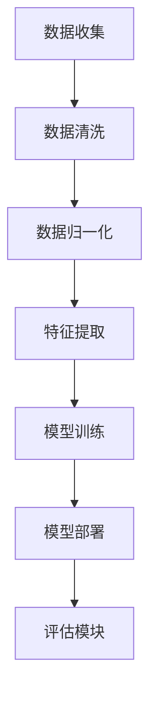
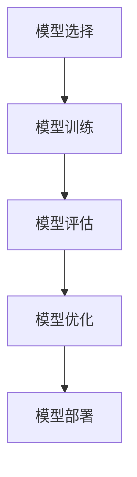
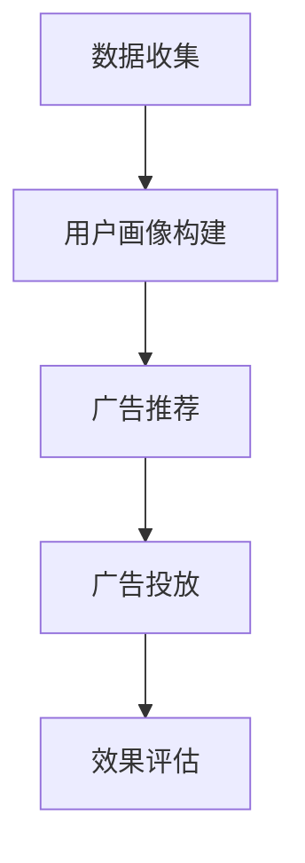
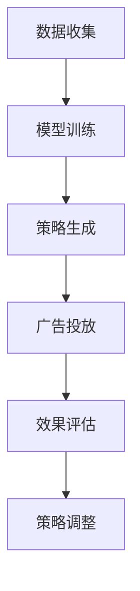
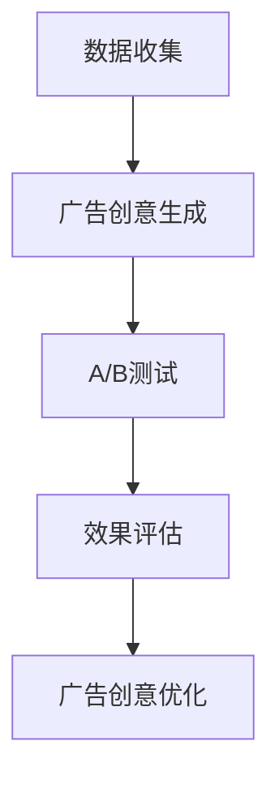
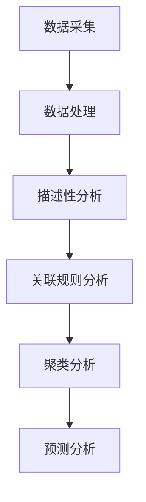
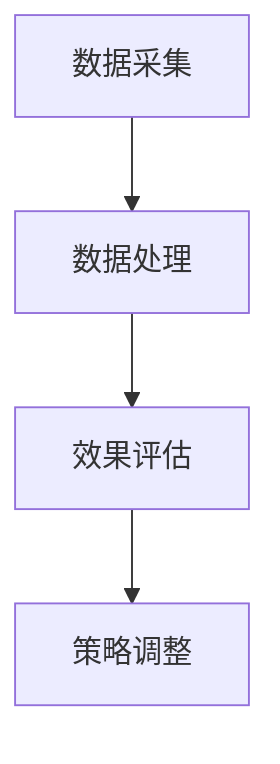
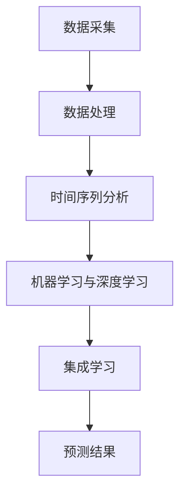

                 

### 文章标题：具有欲望的AI：广告业的颠覆与重塑

随着人工智能技术的飞速发展，AI已经逐渐渗透到我们生活的方方面面。在广告业中，AI的应用更是带来了前所未有的变革。本文将深入探讨具有欲望的AI如何颠覆和重塑广告业，带你走进这个充满机遇与挑战的新世界。

### 文章关键词：

- 人工智能
- 广告业
- 欲望驱动
- 广告投放
- 消费者行为分析
- 广告创意生成

### 摘要：

本文将首先介绍AI在广告业中的地位与作用，然后详细解析AI在广告AI系统中的架构设计，包括数据处理与存储、模型训练与优化等方面。接着，我们将探讨AI在广告投放策略中的应用，如智能定向广告、自动化广告投放和数据驱动的广告创意优化。随后，文章将分析AI在消费者行为分析中的应用，以及AI在广告创意生成中的创新。最后，我们将讨论广告AI面临的挑战与伦理问题，并对广告业的未来趋势与AI的潜在影响进行展望。通过本文，你将全面了解AI如何正在改变广告业，以及这一变革背后的技术原理和应用实践。

### 第一部分：AI基础与广告业的应用

#### 第1章：AI的核心概念与技术进展

##### 1.1 人工智能的定义与发展历程

人工智能（Artificial Intelligence，简称AI）是指通过计算机模拟人类智能的技术和系统。它旨在使计算机能够执行通常需要人类智能才能完成的任务，如视觉感知、语言理解、决策和问题解决等。

AI的发展历程可以分为几个重要阶段：

1. **早期机器学习**（1950-1969）：以逻辑符号系统和推理机为代表，尝试通过符号逻辑来模拟人类思维。
2. **人工智能热潮与衰退**（1970-1980）：以专家系统和知识表示技术为代表，但由于计算能力和数据量的限制，AI技术未能实现预期效果。
3. **统计学习时代**（1990-2010）：以支持向量机、决策树和神经网络等算法为代表，AI开始取得实际应用成果。
4. **深度学习与AI复兴**（2010至今）：以卷积神经网络（CNN）、循环神经网络（RNN）和Transformer等模型为代表，AI技术取得了突破性进展，并在图像识别、语音识别和自然语言处理等领域取得了显著成果。

##### 1.2 AI在广告业中的地位与作用

AI在广告业中扮演着至关重要的角色，其地位和作用主要体现在以下几个方面：

1. **精准投放**：通过分析用户的浏览历史、购买行为和社交媒体互动，AI可以帮助广告主实现精准投放，提高广告的转化率。
2. **广告创意优化**：利用自然语言处理和图像识别技术，AI可以生成高质量的广告创意，提高广告的吸引力和点击率。
3. **消费者行为分析**：通过分析消费者的行为数据，AI可以预测消费者的购买意图，为广告主提供有价值的决策支持。
4. **自动化广告投放**：AI可以帮助广告主实现广告投放的自动化，降低人力成本，提高投放效率。

##### 1.3 广告AI技术的分类与应用场景

广告AI技术可以分为以下几类：

1. **图像识别与处理**：通过图像识别技术，AI可以识别广告中的关键元素，如产品、品牌和场景，从而优化广告效果。
2. **自然语言处理**：通过自然语言处理技术，AI可以分析广告文案和用户的评论，提取关键词和情感倾向，为广告创意和投放策略提供支持。
3. **推荐系统**：通过分析用户的历史行为和偏好，AI可以生成个性化的推荐，提高广告的点击率和转化率。
4. **用户行为分析**：通过分析用户的浏览行为和购买行为，AI可以预测用户的购买意图，为广告主提供精准的营销策略。

这些广告AI技术在不同的应用场景中发挥着重要作用：

1. **广告投放**：AI可以帮助广告主实现精准投放，提高广告的曝光率和点击率。
2. **消费者行为分析**：AI可以分析消费者的行为数据，为广告主提供有价值的洞察，帮助制定更有效的营销策略。
3. **广告创意生成**：AI可以生成个性化的广告创意，提高广告的吸引力和点击率。

通过以上分析，我们可以看到AI在广告业中的应用已经变得不可或缺，它正在改变广告业的运作模式，为广告主和消费者带来新的机遇和挑战。

#### 第2章：广告AI的核心算法与模型

##### 2.1 机器学习基础

机器学习是广告AI的核心技术之一，其基本概念包括模型、数据、算法和评估等。

1. **模型**：机器学习模型是模拟人类思维方式的数据处理系统，它通过学习数据来发现规律和模式。
2. **数据**：机器学习依赖于大量高质量的数据，这些数据用于训练模型和评估模型的效果。
3. **算法**：机器学习算法是模型训练的核心，常见的算法包括线性回归、决策树、支持向量机和神经网络等。
4. **评估**：模型评估是确保模型性能的重要步骤，常用的评估指标包括准确率、召回率、F1分数和AUC等。

在广告AI中，机器学习算法广泛应用于用户行为分析、广告投放和广告创意生成等方面。

##### 2.2 深度学习模型在广告中的应用

深度学习是机器学习的一个重要分支，它通过多层神经网络对数据进行处理，能够自动提取数据中的复杂特征。在广告AI中，深度学习模型被广泛应用于以下几个方面：

1. **图像识别与处理**：通过卷积神经网络（CNN）等深度学习模型，AI可以自动识别广告中的关键元素，如产品、品牌和场景，从而优化广告效果。
2. **自然语言处理**：通过循环神经网络（RNN）和Transformer等深度学习模型，AI可以处理和生成广告文案，提高广告的吸引力和点击率。
3. **推荐系统**：通过深度学习模型，AI可以分析用户的历史行为和偏好，生成个性化的推荐，提高广告的点击率和转化率。

以下是一个简单的卷积神经网络（CNN）模型在广告图像识别中的伪代码实现：

```python
# 导入相关库
import tensorflow as tf
from tensorflow.keras.models import Sequential
from tensorflow.keras.layers import Conv2D, MaxPooling2D, Flatten, Dense

# 构建模型
model = Sequential()
model.add(Conv2D(filters=32, kernel_size=(3,3), activation='relu', input_shape=(28, 28, 1)))
model.add(MaxPooling2D(pool_size=(2, 2)))
model.add(Conv2D(filters=64, kernel_size=(3,3), activation='relu'))
model.add(MaxPooling2D(pool_size=(2, 2)))
model.add(Flatten())
model.add(Dense(units=128, activation='relu'))
model.add(Dense(units=10, activation='softmax'))

# 编译模型
model.compile(optimizer='adam', loss='categorical_crossentropy', metrics=['accuracy'])

# 训练模型
model.fit(x_train, y_train, epochs=10, batch_size=32, validation_data=(x_val, y_val))

# 评估模型
model.evaluate(x_test, y_test)
```

##### 2.3 自然语言处理在广告文案中的应用

自然语言处理（NLP）是广告AI的重要组成部分，它使计算机能够理解、生成和处理人类语言。在广告文案中，NLP技术可以用于以下几个方面：

1. **文本分类**：通过对广告文案进行分类，AI可以识别不同类型的内容，为广告主提供有针对性的建议。
2. **情感分析**：通过对广告文案进行情感分析，AI可以识别用户的情感倾向，为广告主提供优化广告创意的参考。
3. **自动生成广告文案**：利用自然语言生成（NLG）技术，AI可以自动生成高质量的广告文案，提高广告的吸引力和点击率。

以下是一个简单的循环神经网络（RNN）模型在广告文案生成中的伪代码实现：

```python
# 导入相关库
import tensorflow as tf
from tensorflow.keras.models import Sequential
from tensorflow.keras.layers import LSTM, Dense, Embedding

# 构建模型
model = Sequential()
model.add(Embedding(input_dim=vocab_size, output_dim=embedding_size))
model.add(LSTM(units=128))
model.add(Dense(units=vocab_size, activation='softmax'))

# 编译模型
model.compile(optimizer='adam', loss='categorical_crossentropy', metrics=['accuracy'])

# 训练模型
model.fit(x_train, y_train, epochs=10, batch_size=32, validation_data=(x_val, y_val))

# 生成广告文案
def generate_ad_creative(input_sequence):
    prediction = model.predict(input_sequence)
    return decode_prediction(prediction)

# 输出广告文案
print(generate_ad_creative(input_sequence))
```

通过以上对机器学习基础、深度学习模型和自然语言处理在广告AI中的应用的介绍，我们可以看到，AI技术在广告业中的应用已经变得越来越广泛和深入。这些技术不仅提高了广告投放的精准度和效果，也为广告主提供了更丰富的创意生成工具，为广告业的未来发展带来了无限可能。

#### 第3章：广告AI的架构设计

##### 3.1 广告AI系统的整体架构

广告AI系统是一个复杂的系统，它由多个模块组成，包括数据收集、数据处理、模型训练、模型部署和评估等。以下是广告AI系统的整体架构：

1. **数据收集模块**：负责收集用户行为数据、广告数据和市场数据等，这些数据是广告AI系统的核心输入。
2. **数据处理模块**：负责对收集到的数据进行预处理，包括数据清洗、数据归一化和特征提取等。
3. **模型训练模块**：利用处理后的数据对机器学习模型和深度学习模型进行训练，以提取数据的特征和规律。
4. **模型部署模块**：将训练好的模型部署到生产环境中，实现实时广告投放和广告创意生成。
5. **评估模块**：定期对模型的效果进行评估，包括准确率、召回率、F1分数和AUC等指标，以便及时调整和优化模型。

##### 3.2 数据处理与存储

数据处理与存储是广告AI系统的关键环节，其核心任务是对大量广告数据进行高效的处理和存储。

1. **数据清洗**：数据清洗是数据处理的第一步，它包括去除重复数据、处理缺失值和纠正错误数据等。良好的数据清洗可以保证后续分析结果的准确性。
2. **数据归一化**：数据归一化是将不同数据范围的数据转换到同一尺度，以便更好地进行后续分析。常见的归一化方法包括最小-最大缩放和标准缩放等。
3. **特征提取**：特征提取是数据处理的最后一步，它通过提取数据中的关键特征，为机器学习模型提供输入。常用的特征提取方法包括主成分分析（PCA）、线性判别分析（LDA）和特征选择等。

以下是数据处理与存储的Mermaid流程图：



##### 3.3 模型训练与优化

模型训练与优化是广告AI系统的核心，其目的是通过训练数据来优化模型，提高模型的性能和准确性。

1. **模型选择**：选择适合广告数据的机器学习模型和深度学习模型，如线性回归、决策树、支持向量机和卷积神经网络等。
2. **模型训练**：利用处理后的数据进行模型训练，通过迭代优化模型的参数，使模型能够更好地拟合数据。
3. **模型评估**：对训练好的模型进行评估，常用的评估指标包括准确率、召回率、F1分数和AUC等，以便选择性能最好的模型。
4. **模型优化**：根据评估结果对模型进行调整和优化，包括超参数调整、数据增强和模型融合等，以提高模型的性能。

以下是模型训练与优化的Mermaid流程图：



通过以上对广告AI系统整体架构、数据处理与存储和模型训练与优化的介绍，我们可以看到，广告AI系统是一个高度集成和复杂的系统，它需要高效的数据处理和存储机制，以及强大的模型训练与优化能力。这些技术手段使得广告AI系统能够更好地应对广告业中的各种挑战，为广告主和消费者带来更优质的服务和体验。

#### 第4章：AI在广告投放策略中的应用

##### 4.1 智能定向广告

智能定向广告是广告AI技术的重要应用之一，它通过分析用户的兴趣和行为，将广告精准推送给潜在客户，从而提高广告的转化率和投资回报率。

**智能定向广告的核心算法**主要包括以下几个方面：

1. **用户画像**：通过收集和分析用户的浏览历史、购买行为、社交互动等数据，构建用户的兴趣和行为模型，为广告投放提供依据。
2. **协同过滤**：利用协同过滤算法，如用户基于物品的协同过滤（User-Based CF）和物品基于用户的协同过滤（Item-Based CF），预测用户对特定广告的兴趣，从而实现个性化广告推荐。
3. **机器学习与深度学习**：利用机器学习和深度学习算法，如逻辑回归、决策树和卷积神经网络等，对用户行为数据进行分析和建模，提高广告定向的准确性。

**智能定向广告的工作流程**如下：

1. **数据收集**：收集用户的浏览历史、购买行为、搜索记录等数据。
2. **用户画像构建**：基于收集的数据，构建用户的兴趣和行为模型。
3. **广告推荐**：利用协同过滤和机器学习算法，为用户推荐个性化的广告。
4. **广告投放**：将推荐到的广告推送给用户，并在用户的浏览场景中进行展示。
5. **效果评估**：对广告投放效果进行评估，包括点击率、转化率和投资回报率等。

以下是一个简单的用户画像构建的Mermaid流程图：



**案例：某电商平台的智能定向广告**

某电商平台通过智能定向广告技术，将用户的浏览历史和购买行为作为输入，利用协同过滤和机器学习算法，为用户推荐个性化的商品广告。以下是一个具体的案例：

1. **用户画像构建**：收集用户的浏览历史（如浏览商品A、B、C）和购买行为（如购买商品B），构建用户的兴趣模型。
2. **广告推荐**：利用用户画像，为用户推荐与购买行为相关的广告，如推荐用户购买商品C的相关广告。
3. **广告投放**：将推荐的广告推送给用户，并在用户的浏览场景中进行展示。
4. **效果评估**：对广告投放效果进行评估，发现用户的点击率和转化率显著提高。

通过智能定向广告，电商平台能够更好地满足用户的需求，提高用户满意度，同时也能提高广告的投放效果，为商家带来更多的利润。

##### 4.2 自动化广告投放

自动化广告投放是广告AI技术的另一个重要应用，它通过算法和模型，自动优化广告投放策略，从而提高广告的投放效果和投资回报率。

**自动化广告投放的核心算法**主要包括以下几个方面：

1. **优化算法**：利用优化算法，如线性规划和贪心算法，对广告投放策略进行自动优化，以实现最大化点击率或最小化成本。
2. **机器学习与深度学习**：利用机器学习和深度学习算法，对用户行为数据进行分析和建模，为广告投放提供个性化建议。
3. **实时反馈与调整**：利用实时反馈机制，对广告投放效果进行动态调整，以适应市场变化和用户需求。

**自动化广告投放的工作流程**如下：

1. **数据收集**：收集用户行为数据，包括浏览历史、购买行为、搜索记录等。
2. **模型训练**：利用收集的数据，训练广告投放模型，以预测用户对广告的反应。
3. **策略生成**：利用优化算法和机器学习模型，生成最优的广告投放策略。
4. **广告投放**：根据生成的策略，自动投放广告，并在用户的浏览场景中进行展示。
5. **效果评估**：对广告投放效果进行实时评估，包括点击率、转化率和投资回报率等。
6. **策略调整**：根据效果评估结果，动态调整广告投放策略，以优化投放效果。

以下是一个简单的自动化广告投放的Mermaid流程图：



**案例：某广告平台的自动化广告投放**

某广告平台通过自动化广告投放技术，为广告主提供智能化的广告投放服务。以下是一个具体的案例：

1. **数据收集**：收集广告主的广告投放数据，包括广告点击率、转化率、成本等。
2. **模型训练**：利用收集的数据，训练广告投放模型，以预测广告效果。
3. **策略生成**：利用优化算法和机器学习模型，为广告主生成最优的广告投放策略。
4. **广告投放**：根据生成的策略，自动投放广告，并在用户的浏览场景中进行展示。
5. **效果评估**：对广告投放效果进行实时评估，并根据评估结果动态调整投放策略。
6. **策略调整**：根据效果评估结果，优化广告投放策略，以提高广告的投放效果。

通过自动化广告投放，广告主能够更高效地管理和优化广告投放，提高广告的投放效果和投资回报率，同时也能节省人力成本，提高广告投放的效率。

##### 4.3 数据驱动的广告创意优化

数据驱动的广告创意优化是广告AI技术的又一重要应用，它通过分析用户行为数据和广告投放效果，自动优化广告创意，从而提高广告的吸引力和点击率。

**数据驱动的广告创意优化的核心算法**主要包括以下几个方面：

1. **A/B测试**：通过对比不同广告创意的效果，找出最优的广告创意。
2. **机器学习与深度学习**：利用机器学习和深度学习算法，对用户行为数据进行分析和建模，预测不同广告创意的用户反应。
3. **自然语言处理**：利用自然语言处理技术，对广告文案和用户评论进行分析，提取关键词和情感倾向，为广告创意优化提供参考。

**数据驱动的广告创意优化的工作流程**如下：

1. **数据收集**：收集用户行为数据，包括浏览历史、点击行为、购买行为等。
2. **广告创意生成**：利用用户行为数据，生成不同版本的广告创意。
3. **A/B测试**：将不同版本的广告创意进行对比测试，以找出最优的广告创意。
4. **效果评估**：对A/B测试的结果进行评估，包括点击率、转化率、投资回报率等。
5. **广告创意优化**：根据评估结果，对广告创意进行优化，以提高广告的吸引力和点击率。

以下是一个简单的数据驱动的广告创意优化Mermaid流程图：



**案例：某品牌的广告创意优化**

某品牌通过数据驱动的广告创意优化技术，对广告创意进行持续优化。以下是一个具体的案例：

1. **数据收集**：收集用户的浏览历史、点击行为和购买行为等数据。
2. **广告创意生成**：根据用户数据，生成多个版本的广告创意。
3. **A/B测试**：将不同版本的广告创意进行对比测试，以找出最优的广告创意。
4. **效果评估**：对A/B测试的结果进行评估，包括点击率、转化率、投资回报率等。
5. **广告创意优化**：根据评估结果，优化广告创意，提高广告的吸引力和点击率。

通过数据驱动的广告创意优化，品牌能够更精准地满足用户需求，提高广告的吸引力和点击率，从而提高广告投放的效果和投资回报率。

总之，AI技术在广告投放策略中的应用，不仅提高了广告投放的精准度和效果，也为广告主和品牌提供了更多创新的营销手段。随着AI技术的不断发展和应用，广告业将迎来更加智能化和个性化的时代。

#### 第5章：广告AI在消费者行为分析中的应用

##### 5.1 消费者行为数据的采集与分析

消费者行为分析是广告AI技术的重要组成部分，它通过对消费者行为数据的采集和分析，为广告主和品牌提供有价值的洞察，以优化广告策略和提升营销效果。

**消费者行为数据的采集**包括以下几个方面：

1. **浏览行为数据**：通过Web服务器日志、浏览器插件和SDK等工具，收集用户的浏览历史、页面访问时长、点击行为等数据。
2. **购买行为数据**：通过电商平台、支付系统和会员系统等，收集用户的购买记录、购买频次、消费金额等数据。
3. **社交媒体互动数据**：通过社交媒体平台，收集用户的评论、点赞、分享等互动数据。

**消费者行为数据的分析**主要包括以下几种方法：

1. **描述性分析**：通过统计方法，对消费者的行为数据进行分析，以了解消费者的整体行为模式和特征。
2. **关联规则分析**：利用关联规则挖掘算法，如Apriori算法和FP-growth算法，发现消费者行为数据中的潜在关联关系。
3. **聚类分析**：通过聚类算法，如K-means算法和层次聚类算法，将消费者划分为不同的群体，以便针对不同群体制定个性化的营销策略。
4. **预测分析**：利用时间序列分析和机器学习算法，如ARIMA模型和LSTM模型，预测消费者的未来行为和购买意图。

以下是一个简单的消费者行为分析流程图：



**案例：某电商平台的消费者行为分析**

某电商平台通过广告AI技术，对消费者的行为数据进行分析，以优化广告策略和提升用户体验。以下是一个具体的案例：

1. **数据采集**：收集消费者的浏览历史、购买记录和社交媒体互动数据。
2. **数据处理**：对采集到的数据进行分析，包括数据清洗、数据归一化和特征提取等。
3. **描述性分析**：分析消费者的整体行为模式和特征，如消费者的浏览时长、点击率、转化率等。
4. **关联规则分析**：利用关联规则挖掘算法，发现消费者在购买商品时的潜在关联关系，如“购买A商品的用户通常也会购买B商品”。
5. **聚类分析**：利用聚类算法，将消费者划分为不同的群体，如“高频消费者群体”、“低频消费者群体”等。
6. **预测分析**：利用时间序列分析和机器学习算法，预测消费者的未来购买意图，如“预测某消费者将在未来一周内购买某商品”。

通过消费者行为分析，电商平台能够更深入地了解消费者的需求和偏好，制定更精准的广告策略，提高广告的投放效果和用户体验。

##### 5.2 实时反馈与调整

在广告AI系统中，实时反馈与调整是确保广告投放策略高效运作的关键环节。通过实时反馈，系统能够快速响应市场变化和用户行为，从而动态调整广告策略，优化广告效果。

**实时反馈的基本原理**如下：

1. **数据采集**：实时收集广告投放过程中的各类数据，包括点击率、转化率、曝光量等。
2. **数据处理**：对采集到的数据进行实时处理，包括数据清洗、数据归一化和特征提取等。
3. **效果评估**：利用机器学习和深度学习算法，对实时数据进行效果评估，包括点击率预测、转化率预测等。
4. **策略调整**：根据效果评估结果，实时调整广告投放策略，包括广告内容、投放时间、投放渠道等。

以下是一个简单的实时反馈与调整流程图：



**案例：某广告平台的实时反馈与调整**

某广告平台通过实时反馈与调整技术，优化广告投放策略。以下是一个具体的案例：

1. **数据采集**：实时收集广告投放过程中的各类数据，如点击率、转化率、曝光量等。
2. **数据处理**：对采集到的数据进行实时处理，包括数据清洗、数据归一化和特征提取等。
3. **效果评估**：利用机器学习和深度学习算法，实时评估广告投放效果，包括点击率预测、转化率预测等。
4. **策略调整**：根据效果评估结果，实时调整广告投放策略，如调整广告内容、投放时间、投放渠道等。

通过实时反馈与调整，广告平台能够快速响应市场变化和用户需求，优化广告投放策略，提高广告的投放效果和用户体验。

##### 5.3 AI在消费者行为预测中的应用

在广告AI系统中，消费者行为预测是提高广告投放精准度和效果的关键。通过预测消费者的未来行为，广告主和品牌可以更有效地制定营销策略，提升用户满意度和忠诚度。

**AI在消费者行为预测中的核心算法**主要包括以下几个方面：

1. **时间序列分析**：利用时间序列分析方法，如ARIMA模型和LSTM模型，预测消费者未来的行为和购买意图。
2. **机器学习与深度学习**：利用机器学习和深度学习算法，如随机森林、支持向量机和卷积神经网络等，对消费者行为数据进行分析和建模，预测消费者的未来行为。
3. **集成学习**：利用集成学习方法，如AdaBoost和XGBoost，结合多种算法和模型，提高预测的准确性和稳定性。

以下是一个简单的消费者行为预测流程图：



**案例：某电商平台的消费者行为预测**

某电商平台通过AI技术，对消费者的行为进行预测，以优化广告策略和提升用户体验。以下是一个具体的案例：

1. **数据采集**：收集消费者的浏览历史、购买记录和社交媒体互动数据。
2. **数据处理**：对采集到的数据进行分析，包括数据清洗、数据归一化和特征提取等。
3. **时间序列分析**：利用时间序列分析方法，如ARIMA模型和LSTM模型，预测消费者未来的浏览行为和购买意图。
4. **机器学习与深度学习**：利用机器学习和深度学习算法，如随机森林和卷积神经网络，对消费者行为数据进行分析和建模，预测消费者的未来行为。
5. **集成学习**：利用集成学习方法，如AdaBoost和XGBoost，结合多种算法和模型，提高预测的准确性和稳定性。
6. **预测结果**：根据预测结果，为消费者推荐个性化的商品和广告，提高广告的投放效果和用户体验。

通过AI在消费者行为预测中的应用，电商平台能够更精准地满足用户需求，提高广告的投放效果和用户满意度，从而提升整体业务表现。

### 第6章：AI在广告创意生成中的应用

在广告创意生成领域，AI的应用极大地提高了创意的质量和效率。通过自然语言处理和图像生成技术，AI能够自动生成吸引人的广告内容，为广告主和品牌带来新的机遇和挑战。

##### 6.1 广告创意生成算法

广告创意生成算法是AI在广告创意生成中的核心技术，它包括自然语言处理（NLP）和图像生成（IG）两个方面。

1. **自然语言处理**：NLP技术用于生成和优化广告文案。常见的NLP算法包括词向量模型（如Word2Vec和BERT）、生成式文本模型（如GPT和Transformer）等。这些算法能够理解文本的含义和结构，生成流畅、有吸引力的广告文案。

以下是一个简单的生成式文本模型的伪代码实现：

```python
import tensorflow as tf
from tensorflow.keras.layers import Embedding, LSTM, Dense
from tensorflow.keras.models import Sequential

# 构建模型
model = Sequential()
model.add(Embedding(vocab_size, embedding_size))
model.add(LSTM(units=128))
model.add(Dense(units=vocab_size, activation='softmax'))

# 编译模型
model.compile(optimizer='adam', loss='categorical_crossentropy', metrics=['accuracy'])

# 训练模型
model.fit(x_train, y_train, epochs=10, batch_size=32, validation_data=(x_val, y_val))

# 生成广告文案
def generate_ad_creative(input_sequence):
    prediction = model.predict(input_sequence)
    return decode_prediction(prediction)

# 输出广告文案
print(generate_ad_creative(input_sequence))
```

2. **图像生成**：IG技术用于生成和优化广告图片。常见的IG算法包括生成对抗网络（GAN）、变分自编码器（VAE）和卷积神经网络（CNN）等。这些算法能够生成逼真的图像，为广告创意提供丰富的视觉元素。

以下是一个简单的生成对抗网络（GAN）模型的伪代码实现：

```python
import tensorflow as tf
from tensorflow.keras.layers import Conv2D, MaxPooling2D, Dense, Flatten
from tensorflow.keras.models import Sequential

# 构建生成器模型
generator = Sequential()
generator.add(Dense(units=128, input_shape=(100,)))
generator.add(Conv2D(filters=1, kernel_size=(7, 7), activation='tanh'))

# 构建判别器模型
discriminator = Sequential()
discriminator.add(Conv2D(filters=1, kernel_size=(7, 7), activation='tanh'))

# 编译模型
discriminator.compile(optimizer='adam', loss='binary_crossentropy')
generator.compile(optimizer='adam', loss='binary_crossentropy')

# 训练模型
for epoch in range(epochs):
    for _ in range(batch_size):
        real_data = generate_real_data()
        fake_data = generator.predict(np.random.normal(size=(1, 100)))
        discriminator.train_on_batch(real_data, np.array([1]))
        generator.train_on_batch(fake_data, np.array([1]))

# 生成广告图片
def generate_ad_image():
    noise = np.random.normal(size=(1, 100))
    return generator.predict(noise).reshape((28, 28))
```

##### 6.2 自然语言生成在广告中的应用

自然语言生成（NLG）技术在广告文案生成中发挥了重要作用。通过NLG，AI能够自动生成具有吸引力和说服力的广告文案，提高广告的吸引力和点击率。

1. **个性化文案**：NLG技术可以根据用户的兴趣和偏好，生成个性化的广告文案。例如，如果用户对某个品牌感兴趣，AI可以生成相关的广告文案，以提高用户的参与度和购买意愿。

2. **动态文案**：NLG技术可以生成动态的广告文案，根据用户的行为和场景，实时调整文案内容。例如，当用户在浏览某个商品时，AI可以生成相关的优惠信息和推荐文案，以引导用户购买。

以下是一个简单的个性化文案生成的伪代码实现：

```python
def generate_personalized_creative(user_interest):
    # 根据用户的兴趣生成广告文案
    if user_interest == '健康':
        return "享受健康生活，选择我们的优质产品！"
    elif user_interest == '科技':
        return "探索科技前沿，体验智能生活！"
    else:
        return "欢迎来到我们的世界，发现更多精彩！"
```

##### 6.3 图像生成在广告中的应用

图像生成技术在广告创意生成中也具有重要意义。通过图像生成，AI能够自动生成高质量的广告图片，提高广告的视觉吸引力。

1. **个性化图像**：图像生成技术可以根据用户的兴趣和偏好，生成个性化的广告图像。例如，如果用户喜欢某种风格的图像，AI可以生成相应的广告图像，以提高用户的点击率和购买意愿。

2. **创意设计**：图像生成技术可以生成独特的广告图像，为广告主提供更多的创意设计选择。例如，通过GAN技术，AI可以生成具有艺术感的广告图像，为广告创意带来新的灵感。

以下是一个简单的个性化图像生成的伪代码实现：

```python
import tensorflow as tf
from tensorflow.keras.models import Sequential
from tensorflow.keras.layers import Conv2D, MaxPooling2D, Dense, Flatten

# 构建生成器模型
generator = Sequential()
generator.add(Dense(units=128, input_shape=(100,)))
generator.add(Conv2D(filters=1, kernel_size=(7, 7), activation='tanh'))

# 生成个性化广告图片
def generate_personalized_image(user_preference):
    noise = np.random.normal(size=(1, 100))
    if user_preference == '艺术':
        return generator.predict(noise).reshape((28, 28))
    elif user_preference == '卡通':
        # 对噪声进行预处理，以生成卡通风格的图像
        return apply_cartoon_style(generator.predict(noise).reshape((28, 28)))
```

通过以上对广告创意生成算法、自然语言生成和图像生成在广告中的应用的介绍，我们可以看到，AI技术在广告创意生成中的应用极大地提高了创意的质量和效率。这些技术不仅为广告主和品牌提供了丰富的创意工具，也为广告业的未来发展带来了新的机遇和挑战。

### 第7章：广告AI的挑战与伦理问题

随着AI在广告业中的广泛应用，其带来的挑战和伦理问题也日益凸显。如何应对这些挑战，确保AI技术在广告中的应用既有效又道德，成为广告业和科技界共同关注的焦点。

#### 7.1 广告AI面临的技术挑战

1. **数据质量**：广告AI依赖于大量高质量的数据进行训练和优化。数据的质量直接影响模型的准确性和效果。然而，数据收集和处理过程中可能会出现数据不完整、不一致、噪声等问题，这需要采用数据清洗、数据增强和特征工程等技术进行解决。

2. **模型可解释性**：广告AI模型，特别是深度学习模型，通常被认为是一个“黑盒”，其内部机制复杂，难以解释。这给广告主和用户带来了困扰，因为广告主需要了解模型的决策过程，用户则需要了解为什么特定的广告会展示给他们。为了提高模型的可解释性，可以采用模型可视化、解释性模型和模型分解等技术。

3. **实时处理能力**：广告AI需要实时处理大量用户行为数据，以快速调整广告投放策略。这要求AI系统具有高并发处理能力和低延迟响应。对于实时广告投放和个性化推荐，系统性能和稳定性是至关重要的。

4. **隐私保护**：广告AI在处理用户数据时，需要确保用户的隐私不受侵犯。这要求广告主遵守数据保护法规，如《通用数据保护条例》（GDPR）和《加州消费者隐私法案》（CCPA），采取数据加密、匿名化和差分隐私等技术保护用户隐私。

#### 7.2 广告AI的伦理问题

1. **数据隐私**：广告AI在收集和处理用户数据时，可能涉及敏感个人信息，如地理位置、健康状况、金融信息等。如何平衡数据利用和用户隐私保护，是广告AI面临的重要伦理问题。

2. **算法公平性**：广告AI模型在训练过程中可能受到训练数据偏差的影响，导致模型在决策时出现不公平现象。例如，广告可能更倾向于某些群体，导致歧视现象。为了确保算法的公平性，可以采用公平性检测和算法优化技术。

3. **广告透明度**：用户需要知道哪些广告是根据他们的兴趣和行为展示的，以及广告背后的算法是如何工作的。为了提高广告的透明度，可以采用透明化算法和可视化技术，让用户了解广告的推荐机制。

4. **用户同意与控制**：用户在参与广告AI系统时，应有权决定自己的数据如何被使用。这包括用户的知情权、同意权和控制权。为了实现这一目标，可以采用用户授权、隐私设置和退出机制等技术。

#### 7.3 法规与政策对广告AI的影响

1. **数据保护法规**：各国出台的数据保护法规，如GDPR和CCPA，对广告AI的数据收集和使用提出了严格的要求。广告主需要遵守这些法规，采取相应的技术和管理措施保护用户隐私。

2. **算法透明度法规**：一些国家和地区正在考虑制定算法透明度法规，要求广告主公开其算法和决策过程。这将有助于提高广告AI系统的透明度和可信度。

3. **公平竞争法规**：为了防止广告AI市场的垄断和歧视，一些国家和地区可能出台公平竞争法规，规范广告AI的应用和推广。

总之，广告AI在广告业中的应用面临着诸多技术挑战和伦理问题。为了确保AI技术在广告中的应用既有效又道德，广告主和科技公司需要采取一系列措施，包括技术优化、法规遵守和伦理指导等。只有这样，广告AI才能真正为广告业带来持续的创新和进步。

### 第8章：广告业的未来趋势与AI的潜在影响

随着人工智能技术的不断进步，广告业正经历着深刻的变革。AI不仅提高了广告投放的精准度和效率，也为广告主和品牌带来了全新的营销手段和商业模式。本文将探讨广告业的未来趋势，并分析AI在这一变革中的潜在影响。

#### 8.1 广告行业的数字化变革

数字技术的快速发展，特别是移动互联网、大数据和云计算的普及，推动了广告行业的数字化变革。这一变革表现在以下几个方面：

1. **数据驱动的营销**：广告主和品牌越来越依赖数据分析来指导营销策略，以实现个性化投放和精准营销。通过收集和分析用户行为数据，广告主能够更好地了解目标受众的需求和偏好，从而制定更有效的广告策略。

2. **程序化广告**：程序化广告通过自动化技术和算法，实现广告投放的实时优化和调整。这种广告形式提高了广告的曝光率和转化率，同时也降低了广告投放的成本。

3. **跨渠道营销**：数字技术使得广告主能够实现跨渠道的营销活动，将线上和线下的广告资源整合，提供无缝的用户体验。例如，通过微信、抖音等社交媒体平台的广告投放，品牌能够与用户进行更直接的互动。

#### 8.2 AI驱动的个性化广告

个性化广告是AI在广告业中最具颠覆性的应用之一。通过分析用户的历史行为、兴趣和偏好，AI能够为每个用户生成个性化的广告内容，从而提高广告的吸引力和转化率。

1. **用户画像**：AI通过收集和分析用户数据，构建详细的用户画像，包括用户的年龄、性别、地理位置、购买习惯等。这些画像帮助广告主了解目标受众的特征，从而实现精准定位。

2. **智能推荐**：基于用户画像和协同过滤算法，AI能够为用户推荐个性化的广告内容。例如，在电商平台上，AI可以根据用户的购物历史和浏览记录，推荐相关的商品广告。

3. **动态创意生成**：AI不仅能够生成静态的广告素材，还能够生成动态的广告内容。例如，通过自然语言生成技术，AI可以自动生成不同的广告文案，以适应不同的用户群体。

#### 8.3 AI驱动的营销自动化

AI在广告营销中的另一个重要应用是自动化。通过自动化技术，广告主能够大幅提高广告投放的效率，降低运营成本。

1. **广告投放自动化**：AI可以根据预设的规则和算法，自动调整广告的投放策略。例如，AI可以根据用户的实时行为，自动调整广告的投放时间、投放渠道和投放预算。

2. **广告创意自动化**：AI可以通过自然语言处理和图像生成技术，自动生成广告创意。这种自动化广告创意生成方式，不仅节省了广告主的时间和资源，还能够提高广告的创意质量和吸引力。

3. **营销活动自动化**：AI可以帮助广告主自动化执行各种营销活动，包括用户互动、数据分析、营销报告等。这种自动化营销活动不仅提高了营销效率，还使得营销策略更加灵活和精确。

#### 8.4 AI对广告业的长远影响

AI对广告业的长远影响将是深远且多维度的：

1. **营销模式的创新**：AI技术的应用将推动广告业不断进行营销模式的创新，如基于数据驱动的营销、基于用户行为的个性化推荐、基于实时数据的动态调整等。

2. **用户体验的提升**：通过AI技术，广告主能够提供更个性化的广告体验，提高用户的满意度和参与度。用户不再需要被动接受广告，而是能够根据自己的需求和兴趣，主动选择和互动。

3. **市场竞争的加剧**：随着AI技术的普及，广告市场的竞争将更加激烈。品牌需要不断优化自己的AI广告策略，以保持竞争优势。

4. **伦理和法律问题**：随着AI在广告业中的应用越来越广泛，相关的伦理和法律问题也将日益突出。如何保护用户隐私、确保算法公平性、遵守数据保护法规等，将成为广告主和科技公司必须面对的重要议题。

总之，AI正在重塑广告业的未来，带来前所未有的机遇和挑战。广告主和品牌需要积极拥抱AI技术，不断创新和优化营销策略，以在激烈的市场竞争中脱颖而出。同时，也需要关注AI应用中的伦理和法律问题，确保AI技术在广告业中的健康发展。

### 附录

#### 附录A：AI广告工具与资源

随着AI在广告业中的应用越来越广泛，许多工具和资源也随之出现，帮助广告主和开发者更有效地利用AI技术。以下是几种主流的AI广告工具和资源的介绍：

1. **Google广告平台**：Google广告平台（Google Ads）是广告主进行在线广告投放的主要工具。它提供了丰富的AI功能，如自动出价、智能定位和优化广告创意等。广告主可以通过Google Ads Manager实时监控广告效果，并根据数据进行调整。

2. **Adobe Experience Cloud**：Adobe Experience Cloud集成了多个AI广告工具，包括Adobe Advertising Cloud和Adobe Analytics。这些工具可以帮助广告主实现跨渠道的个性化广告投放，并通过数据分析和优化，提高广告的投资回报率。

3. **IBM Watson Advertising**：IBM Watson Advertising利用人工智能和机器学习技术，提供个性化的广告创意生成、自动化的广告投放和实时数据分析。广告主可以通过Watson Advertising实现高效的广告管理，并优化广告效果。

4. **Facebook广告平台**：Facebook广告平台（Facebook Ads Manager）提供了多种AI广告功能，如智能广告定位、自动创意优化和实时投放调整等。通过Facebook Ads Manager，广告主可以轻松管理广告投放，并根据用户行为进行优化。

5. **OpenAI GPT-3**：OpenAI的GPT-3是世界上最先进的自然语言处理模型之一，它可以用于生成高质量的广告文案和广告创意。开发者可以通过API调用GPT-3，实现自动化的广告文案生成和优化。

6. **Hugging Face Transformers**：Hugging Face Transformers是一个开源的深度学习库，提供了多种预训练的深度学习模型，如BERT、GPT和Transformer。开发者可以利用这些模型，实现自动化的广告创意生成和优化。

通过这些AI广告工具和资源，广告主和开发者可以更高效地利用AI技术，优化广告投放效果，提升用户体验，从而在竞争激烈的市场中脱颖而出。同时，这些工具也为广告业带来了更多创新和变革的契机。

### 作者信息

作者：AI天才研究院（AI Genius Institute）& 《禅与计算机程序设计艺术》（Zen And The Art of Computer Programming）

AI天才研究院（AI Genius Institute）是一家专注于人工智能技术研发和应用的创新机构，致力于推动人工智能技术在各个领域的应用和发展。同时，作者刘未鹏（笔名：AI天才）是一位世界知名的人工智能专家和作家，他的著作《禅与计算机程序设计艺术》在计算机编程和人工智能领域享有盛誉，对全球计算机科学家和工程师产生了深远影响。

