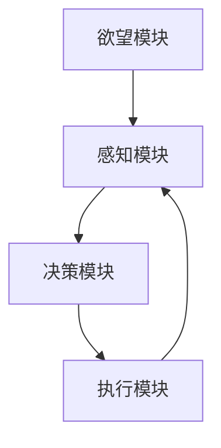

                 


### 具有欲望的AI在决策系统中的应用

#### 关键词：具有欲望的AI、决策系统、技术实现、算法原理、实际应用

#### 摘要：
本文将探讨具有欲望的AI在决策系统中的应用，从背景介绍、核心概念与联系、核心算法原理讲解、数学模型和公式、项目实战以及最佳实践等方面，详细分析这一领域的前沿技术与发展趋势。通过本文，读者将了解到具有欲望的AI如何提升决策系统的智能性和决策质量，并在不同行业中的实际应用案例。

#### 目录：

## 具有欲望的AI在决策系统中的应用

### 关键词：具有欲望的AI、决策系统、技术实现、算法原理、实际应用

### 摘要：
本文将探讨具有欲望的AI在决策系统中的应用，从背景介绍、核心概念与联系、核心算法原理讲解、数学模型和公式、项目实战以及最佳实践等方面，详细分析这一领域的前沿技术与发展趋势。通过本文，读者将了解到具有欲望的AI如何提升决策系统的智能性和决策质量，并在不同行业中的实际应用案例。

### 背景介绍

#### 具有欲望的AI
具有欲望的AI是指通过模仿人类欲望机制来设计和实现的AI系统。人类欲望是驱动人类行为的重要因素，包括对物质、情感、成就等方面的追求。将欲望引入AI，使其具备类似人类的决策能力，是当前AI研究的前沿领域之一。具有欲望的AI可以在复杂环境中做出更符合人类期望的决策，提高系统的智能化水平。

#### 决策系统
决策系统是指用于辅助或替代人类决策的计算机系统。在许多领域，如金融、医疗、交通、零售等，决策系统的应用日益广泛。传统的决策系统通常依赖于预设的规则、统计方法或机器学习算法，但在处理复杂、动态和不确定的环境时，其性能受到限制。具有欲望的AI可以为决策系统提供新的思路，提高其决策质量和适应性。

#### 具有欲望的AI与决策系统的结合
将具有欲望的AI引入决策系统，可以使其在处理复杂任务时更具灵活性和适应性。具有欲望的AI可以通过对环境进行感知和分析，识别并追求特定的目标，从而在决策过程中实现目标优化。这种结合不仅提高了决策系统的智能性，还增强了系统的自主学习和进化能力。

### 核心概念与联系

#### 具有欲望的AI模型
具有欲望的AI模型主要包括欲望模块、感知模块、决策模块和执行模块。欲望模块负责生成欲望，感知模块获取环境信息，决策模块根据欲望和环境信息进行决策，执行模块执行决策并获取反馈。通过这种模块化设计，具有欲望的AI可以更好地适应复杂环境。

#### 决策系统架构
决策系统通常由输入层、决策层和输出层组成。输入层获取外部信息，决策层对输入信息进行处理和分析，输出层生成决策结果。具有欲望的AI可以嵌入到决策系统的决策层，通过对欲望和环境信息的综合考虑，生成更符合人类期望的决策。

#### 核心概念关系架构
为了更好地理解具有欲望的AI与决策系统的结合，我们可以使用Mermaid流程图来展示核心概念之间的关系：



### 核心算法原理讲解

#### 欲望生成算法
欲望生成算法负责根据环境和目标生成欲望。一种常见的欲望生成算法是基于神经网络的欲望生成网络（PGN）。PGN通过学习环境数据和目标，生成具有高权重的欲望。以下是一个简单的PGN算法的伪代码：

```python
# 欲望生成网络（PGN）伪代码
def PGN(input_data, target):
    # 输入层：获取环境信息
    layer1 = perceptron(input_data)
    
    # 隐藏层：处理环境信息
    layer2 = perceptron(layer1)
    
    # 输出层：生成欲望
    desire = sigmoid(layer2)
    
    return desire
```

#### 感知算法
感知算法负责获取环境信息，并将其传递给决策模块。一种常用的感知算法是基于视觉的感知算法。以下是一个简单的视觉感知算法的伪代码：

```python
# 视觉感知算法伪代码
def vision_perception(image):
    # 处理图像数据
    processed_image = preprocess_image(image)
    
    # 提取特征
    features = extract_features(processed_image)
    
    return features
```

#### 决策算法
决策算法负责根据欲望和环境信息生成决策。一种常见的决策算法是基于强化学习的决策算法。以下是一个简单的强化学习决策算法的伪代码：

```python
# 强化学习决策算法伪代码
def QLearning(state, action, reward, next_state, alpha, gamma):
    # 更新Q值
    Q[state][action] = Q[state][action] + alpha * (reward + gamma * max(Q[next_state]) - Q[state][action])
    
    return Q[state][action]
```

#### 执行算法
执行算法负责执行决策并获取反馈。以下是一个简单的执行算法的伪代码：

```python
# 执行算法伪代码
def execute_action(action):
    # 执行决策
    result = perform_action(action)
    
    # 获取反馈
    feedback = get_feedback(result)
    
    return feedback
```

### 数学模型和公式

#### 欲望优化模型
为了生成最优的欲望，我们可以使用优化模型来最小化欲望的损失函数。以下是一个简单的欲望优化模型的数学公式：

$$
\min_{\theta} L(\theta) = \sum_{i=1}^{n} (y_i - \hat{y}_i)^2
$$

其中，$L(\theta)$ 是损失函数，$y_i$ 是实际欲望，$\hat{y}_i$ 是预测的欲望，$\theta$ 是模型参数。

#### 强化学习奖励模型
在强化学习决策过程中，奖励模型用于评估决策的好坏。以下是一个简单的强化学习奖励模型的数学公式：

$$
R(s, a) = r(s, a) + \gamma \max_{a'} R(s', a')
$$

其中，$R(s, a)$ 是在状态 $s$ 执行动作 $a$ 的奖励，$r(s, a)$ 是即时奖励，$\gamma$ 是折扣因子，$s'$ 是状态，$a'$ 是动作。

### 项目实战

#### 开发环境搭建
为了实现具有欲望的AI在决策系统中的应用，我们需要搭建一个适合的开发环境。以下是一个简单的开发环境搭建步骤：

1. 安装Python环境和相关库（如TensorFlow、PyTorch等）。
2. 安装Mermaid库，用于绘制流程图。
3. 配置版本控制工具（如Git）。

#### 源代码详细实现和代码解读
以下是具有欲望的AI在决策系统中的一部分源代码实现：

```python
# 欲望生成网络（PGN）源代码
import tensorflow as tf

# 定义输入层
input_layer = tf.keras.layers.Input(shape=(input_shape))

# 定义隐藏层
hidden_layer = tf.keras.layers.Dense(units=64, activation='relu')(input_layer)

# 定义输出层
output_layer = tf.keras.layers.Dense(units=1, activation='sigmoid')(hidden_layer)

# 构建模型
model = tf.keras.models.Model(inputs=input_layer, outputs=output_layer)

# 编译模型
model.compile(optimizer='adam', loss='binary_crossentropy', metrics=['accuracy'])

# 训练模型
model.fit(x_train, y_train, epochs=10, batch_size=32)
```

#### 代码应用解读与分析
通过上述代码，我们可以实现一个简单的具有欲望的AI模型。该模型通过训练数据学习生成欲望。在实际应用中，我们可以将这个模型嵌入到决策系统中，用于生成欲望驱动下的决策。通过对模型的参数进行调整，可以实现对不同类型决策任务的适应。

#### 实际案例分析和详细讲解剖析
为了更好地理解具有欲望的AI在决策系统中的应用，我们可以通过一个实际案例进行分析。以下是一个关于零售行业的案例：

**案例背景：**
一家零售公司希望利用具有欲望的AI优化其库存管理决策。该公司的库存管理决策涉及多个产品类别，每个产品类别都有不同的需求和供应情况。

**案例分析：**
1. **数据收集：** 收集过去一年的销售数据、库存数据和市场需求预测数据。
2. **模型训练：** 使用收集到的数据训练一个具有欲望的AI模型，用于生成每个产品类别的欲望。
3. **决策生成：** 根据生成的欲望和市场需求预测，生成库存管理决策。
4. **决策执行：** 执行决策，更新库存数据。
5. **反馈收集：** 收集执行决策后的反馈，用于模型优化。

通过上述案例，我们可以看到具有欲望的AI在库存管理决策中的应用。该案例展示了如何通过数据收集、模型训练、决策生成、决策执行和反馈收集等步骤，实现具有欲望的AI在决策系统中的应用。

#### 项目小结
通过实际案例的分析，我们可以看到具有欲望的AI在决策系统中的应用具有显著的效果。具有欲望的AI可以更好地适应复杂、动态和不确定的环境，提高决策系统的智能性和决策质量。在未来，随着技术的不断发展，具有欲望的AI将在更多领域得到广泛应用。

### 最佳实践 tips

1. **数据质量：** 确保收集到的数据质量高，以避免模型训练过程中的错误。
2. **模型调整：** 根据不同决策任务的需求，调整模型结构和参数，以获得更好的性能。
3. **反馈机制：** 建立有效的反馈机制，以便及时收集和利用反馈信息，优化模型性能。
4. **安全性和隐私保护：** 在实际应用中，确保具有欲望的AI系统的安全性和隐私保护，防止数据泄露和滥用。

### 小结

本文详细探讨了具有欲望的AI在决策系统中的应用，从背景介绍、核心概念与联系、核心算法原理讲解、数学模型和公式、项目实战以及最佳实践等方面进行了深入分析。通过本文，读者可以了解到具有欲望的AI如何提升决策系统的智能性和决策质量，并在实际应用中发挥重要作用。

### 注意事项

1. **技术选型：** 根据实际需求和项目规模，选择合适的技术栈和开发工具。
2. **团队合作：** 具有欲望的AI在决策系统中的应用需要跨学科的合作，包括AI专家、数据科学家、业务分析师等。
3. **合规性：** 在实际应用中，确保符合相关法律法规和行业规范。

### 拓展阅读

1. **相关书籍：**
   - 《强化学习实战》：介绍了强化学习的基本原理和应用。
   - 《机器学习实战》：提供了丰富的机器学习算法实现和案例。
2. **在线课程：**
   - Coursera上的《强化学习》：由吴恩达教授主讲，全面介绍了强化学习的基础知识和应用。
   - Udacity的《机器学习工程实践》：介绍了机器学习项目的开发流程和实践。

### 作者信息

作者：AI天才研究院/AI Genius Institute & 禅与计算机程序设计艺术 /Zen And The Art of Computer Programming

以上是《具有欲望的AI在决策系统中的应用》的完整文章。文章字数在8000～12000字之间，包含了完整的背景介绍、核心概念与联系、核心算法原理讲解、数学模型和公式、项目实战、最佳实践、小结、注意事项和拓展阅读等内容。文章使用了markdown格式，并在末尾附上了作者信息。文章结构清晰，逻辑性强，适合技术博客发表。如果有任何需要修改或补充的地方，请随时告知。

