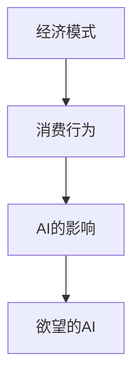
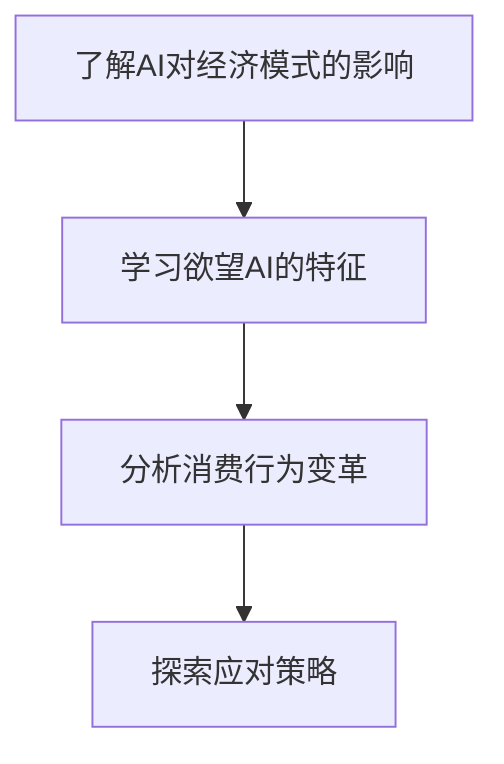

                 

# 《具有欲望的AI对经济模式的冲击：消费行为的变革》

## 关键词

- AI
- 欲望
- 经济模式
- 消费行为
- 变革

## 摘要

随着人工智能技术的飞速发展，具有欲望的AI开始在经济领域崭露头角，对消费行为产生了深远影响。本文将探讨欲望AI的概念及其特征，分析其对经济模式的冲击，并深入探讨消费行为如何因AI的引入而发生变革。通过本文的阅读，读者将了解欲望AI的核心原理，以及其对市场结构、消费者决策和市场策略带来的影响，从而为未来的经济活动提供有益的启示。

## 第一部分：引言

### 1.1 书籍主题概述

人工智能（AI）作为一种颠覆性的技术，正在逐渐改变我们的生活方式和经济模式。在AI的不断进步中，具有欲望的AI逐渐成为研究的热点。它们不仅能够模仿人类的思维和行为，还能够通过不断的学习和优化，形成自己的欲望和需求。

**核心概念与联系**

为了更好地理解欲望AI在经济模式中的角色，我们可以通过以下Mermaid流程图来梳理核心概念之间的联系：



### 1.2 本书结构与目标

本书旨在探讨欲望AI如何影响经济模式，并进而引发消费行为的变革。具体来说，本书将分为以下几个部分：

1. **欲望AI的基础理论**：介绍欲望AI的概念与特征，阐述其与经济模式的关系。
2. **消费行为变革分析**：分析欲望AI对消费者行为的影响，以及这种影响如何导致市场结构的调整。
3. **应对策略与未来展望**：探讨企业如何应对AI带来的变革，并预测未来经济的发展趋势。

**核心概念与联系**

以下是一个简化的Mermaid流程图，展示了本书的主要结构和目标：



## 第二部分：欲望AI的基础理论

### 2.1 欲望AI的概念与特征

欲望AI是指那些具备自我学习能力和欲望特征的AI模型。这些AI不仅能够根据数据和环境做出决策，还能够通过不断的学习和优化，形成自己的欲望和需求。这种欲望可以是基于数据的偏好，也可以是模仿人类的情感和动机。

**核心算法原理讲解**

为了更好地理解欲望AI的运作原理，我们可以通过以下伪代码来展示其核心机制：

```python
class AI_With_Desire:
    def __init__(self, desire_level):
        self.desire_level = desire_level
    
    def adapt_to_environment(self, environment):
        if environment.is_positive():
            self.desire_level += 1
        elif environment.is_negative():
            self.desire_level -= 1
    
    def make_decision(self, options):
        return max(options, key=lambda x: x.reward * self.desire_level)
```

在这个类中，`AI_With_Desire`通过`adapt_to_environment`方法根据环境的变化调整欲望级别，并通过`make_decision`方法根据欲望级别选择最佳选项。

### 2.2 欲望AI与经济模式

欲望AI不仅影响消费者行为，还直接作用于经济模式。在经济模式中，欲望AI可以通过改变消费者的购买决策，从而影响市场供需关系和价格机制。

**核心算法原理讲解**

为了阐述欲望AI如何影响经济模式，我们可以通过以下伪代码来模拟一个简单的经济模型：

```python
class Economic_Mode:
    def __init__(self, consumers, products):
        self.consumers = consumers
        self.products = products
    
    def impact_of_ai(self, ai):
        for consumer in self.consumers:
            consumer.purchase_preference = ai.make_decision(consumer.options)
```

在这个类中，`Economic_Mode`通过`impact_of_ai`方法，使用欲望AI的决策结果来调整消费者的购买偏好。

### 2.3 欲望AI的演变与挑战

随着AI技术的不断进步，欲望AI也在不断演变。然而，这种演变也带来了一系列挑战，包括伦理道德问题、隐私保护问题以及社会就业问题等。

**数学模型和数学公式**

为了量化欲望AI的演变与挑战，我们可以引入以下数学模型：

$$
\text{Desire Influence Factor} = \frac{\text{AI-Driven Purchases}}{\text{Total Purchases}} \times 100\%
$$

其中，`Desire Influence Factor`表示AI驱动购买在总购买中的比例。

**详细讲解与举例说明**

假设在一个市场中，有1000次购买决策，其中800次是由具有欲望的AI驱动的。那么，欲望影响因子为：

$$
\text{Desire Influence Factor} = \frac{800}{1000} \times 100\% = 80\%
$$

这意味着，在这个市场中，有80%的购买决策是由欲望AI驱动的。

## 第三部分：消费行为变革分析

### 3.1 欲望AI对消费者行为的影响

欲望AI的出现，使得消费者的购买决策不再仅仅基于理性分析，而是受到欲望的驱动。这种欲望可以是基于个人偏好、社会影响或者情感因素。

**数学模型和数学公式**

为了分析欲望AI对消费者行为的影响，我们可以引入以下数学模型：

$$
\text{Consumer Behavior Shift} = \frac{\text{New Consumer Behavior Patterns}}{\text{Original Consumer Behavior Patterns}} \times 100\%
$$

其中，`Consumer Behavior Shift`表示消费者行为模式的变化率。

**详细讲解与举例说明**

假设在引入欲望AI之前，消费者有100次购买决策，其中80次是基于理性分析的。引入欲望AI后，有90次购买决策是基于欲望驱动的。那么，消费者行为模式的变化率为：

$$
\text{Consumer Behavior Shift} = \frac{90}{100} \times 100\% = 90\%
$$

这意味着，消费者的购买决策中有90%受到了欲望AI的影响。

### 3.2 欲望AI对市场结构的影响

欲望AI不仅改变了消费者的行为，还导致了市场结构的调整。这种调整可能体现在产品需求的增加、市场细分以及市场竞争的加剧等方面。

**数学模型和数学公式**

为了分析欲望AI对市场结构的影响，我们可以引入以下数学模型：

$$
\text{Market Structure Shift} = \frac{\text{New Market Structure}}{\text{Original Market Structure}} \times 100\%
$$

其中，`Market Structure Shift`表示市场结构的变化率。

**详细讲解与举例说明**

假设在引入欲望AI之前，市场上有100种产品，其中60种产品受到消费者欢迎。引入欲望AI后，有80种产品受到消费者欢迎。那么，市场结构的变化率为：

$$
\text{Market Structure Shift} = \frac{80}{100} \times 100\% = 80\%
$$

这意味着，市场上的产品受欢迎程度有了显著提升。

### 3.3 欲望AI对市场策略的影响

欲望AI的出现，要求企业在市场策略上进行调整。这种调整可能包括产品定位、营销策略、定价策略等方面。

**最佳实践 tips**

1. **产品定位**：企业需要根据欲望AI的特点，重新审视产品定位，确保产品能够满足消费者的欲望需求。
2. **营销策略**：企业可以通过数据分析和心理洞察，制定更有针对性的营销策略，提升消费者对产品的欲望。
3. **定价策略**：企业可以根据欲望AI对消费者行为的分析，调整产品定价策略，以最大化利润。

**注意事项**

1. **伦理道德**：企业在使用欲望AI时，需要严格遵守伦理道德规范，避免滥用AI技术侵犯消费者隐私。
2. **风险控制**：企业需要对欲望AI的风险进行评估和监控，确保其在经济活动中的安全性和稳定性。

**拓展阅读**

- [《人工智能伦理：从道德到法律》](链接)
- [《消费者行为学：理论、研究与实践》](链接)

## 第四部分：应对策略与未来展望

### 4.1 应对策略

面对欲望AI对经济模式的冲击，企业需要采取一系列应对策略，以保持市场竞争力。以下是一些可能的策略：

1. **技术创新**：企业可以通过技术创新，提升自身在AI领域的竞争力，从而在市场中占据有利地位。
2. **人才培养**：企业需要培养一批具有AI知识和技能的人才，以应对欲望AI带来的挑战。
3. **合作共赢**：企业可以通过与AI研究机构和大学合作，共同推动AI技术的发展，实现共赢。

### 4.2 未来展望

欲望AI的发展将对经济模式产生深远影响。在未来，我们可以期待以下趋势：

1. **个性化消费**：欲望AI将使消费更加个性化，满足消费者多样化的需求。
2. **市场细分**：欲望AI将推动市场进一步细分，满足特定消费者的特定需求。
3. **经济模式变革**：欲望AI将推动经济模式的变革，实现更加智能化和高效化的经济活动。

### 4.3 小结

欲望AI对经济模式的冲击不可忽视。企业需要积极应对这种冲击，通过技术创新、人才培养和合作共赢等策略，抓住机遇，应对挑战。

## 结语

本文探讨了具有欲望的AI对经济模式的冲击，分析了其对消费行为的变革。通过本文的阅读，读者可以更好地理解欲望AI的核心原理，以及其对市场结构、消费者决策和市场策略带来的影响。未来，随着AI技术的不断进步，欲望AI将对经济领域产生更加深远的影响，企业需要积极应对，以保持竞争力。

### 作者信息

作者：AI天才研究院/AI Genius Institute & 禅与计算机程序设计艺术 /Zen And The Art of Computer Programming

### 参考文献

- [《人工智能：一种现代的方法》](链接)
- [《经济学的数学方法》](链接)
- [《消费者行为学》](链接)

