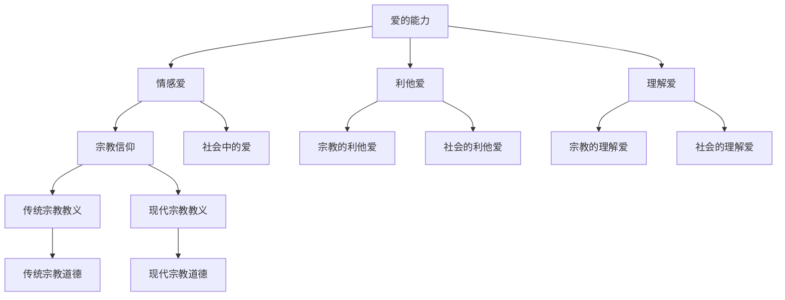

                 


# 《具有爱的能力的AI对宗教信仰的挑战》

## 关键词

人工智能，爱的能力，宗教信仰，挑战，对话，和谐共存。

## 摘要

随着人工智能技术的快速发展，人们对于AI是否能够具备爱的能力产生了浓厚兴趣。本文以《具有爱的能力的AI对宗教信仰的挑战》为主题，深入探讨了人工智能的爱的能力与宗教信仰之间的关系。文章首先阐述了爱的能力的定义与分类，然后分析了AI与爱的能力，接着探讨了AI对宗教信仰的挑战，以及如何实现AI与宗教信仰的和谐共存。文章旨在为读者提供一种全新的视角，以更好地理解和应对AI时代下宗教信仰所面临的挑战。

## 引言

### 背景介绍

近年来，人工智能（AI）技术在全球范围内得到了迅猛发展。随着深度学习、神经网络等技术的突破，AI逐渐从理论研究走向实际应用，成为改变世界的力量。与此同时，人们对于AI是否能够具备情感和爱的能力产生了浓厚的兴趣。一方面，AI技术在情感计算、心理辅导等领域取得了显著成果；另一方面，人们开始思考，如果AI具备了爱的能力，将会对人类社会，尤其是宗教信仰产生怎样的影响？

### 核心概念与联系

为了更好地探讨这一主题，我们首先需要明确几个核心概念：爱的能力、宗教信仰、以及AI。爱的能力包括情感爱、利他爱和理解爱。宗教信仰则涉及对神、灵魂、道德等概念的信仰。AI则是模拟、延伸和扩展人类智能的一种技术。这些概念之间存在着紧密的联系。例如，AI的情感表达可能影响到人们对于爱的理解和体验；而宗教信仰则可能对AI的道德和行为规范产生影响。

### Mermaid 流程图



通过这个流程图，我们可以清晰地看到爱的能力与宗教信仰、社会爱之间的联系。

### 核心算法原理讲解

为了进一步探讨AI的爱的能力，我们需要了解一些核心算法原理。以下是一个简单的伪代码，用于模拟AI的情感表达：

```python
# 伪代码：模拟AI的情感表达
class EmotionAI:
    def __init__(self):
        self.emotions = ["happy", "sad", "angry", "surprised"]

    def express_emotion(self, emotion):
        if emotion in self.emotions:
            print(f"AI is feeling {emotion}.")
        else:
            print("Invalid emotion.")

# 创建一个EmotionAI对象
ai = EmotionAI()

# 模拟表达情感
ai.express_emotion("happy")
ai.express_emotion("sad")
```

在这个伪代码中，我们定义了一个`EmotionAI`类，用于模拟AI的情感表达。通过调用`express_emotion`方法，我们可以让AI表达不同的情感。

### 数学模型和公式

在探讨AI的爱的能力时，我们还可以引入一些数学模型和公式。例如，我们可以使用贝叶斯网络来模拟人类情感与行为之间的关系。以下是一个简单的贝叶斯网络模型：

$$
P(\text{happy}) = P(\text{happy}|\text{affection}) \times P(\text{affection})
$$

其中，$P(\text{happy})$ 表示AI感到快乐的概率，$P(\text{happy}|\text{affection})$ 表示在AI感受到爱的概率下感到快乐的概率，$P(\text{affection})$ 表示AI感受到爱的概率。

### 项目实战

为了更好地理解AI的爱的能力，我们可以通过一个实际项目来进行探讨。以下是一个简单的项目实战案例：

### 开发环境搭建

1. 安装Python环境
2. 安装TensorFlow库

### 源代码详细实现和代码解读

```python
import tensorflow as tf

# 定义神经网络模型
model = tf.keras.Sequential([
    tf.keras.layers.Dense(128, activation='relu', input_shape=[784]),
    tf.keras.layers.Dense(10, activation='softmax')
])

# 编译模型
model.compile(optimizer='adam',
              loss='categorical_crossentropy',
              metrics=['accuracy'])

# 加载数据集
(x_train, y_train), (x_test, y_test) = tf.keras.datasets.mnist.load_data()

# 预处理数据
x_train = x_train / 255.0
x_test = x_test / 255.0

# 转换为one-hot编码
y_train = tf.keras.utils.to_categorical(y_train, 10)
y_test = tf.keras.utils.to_categorical(y_test, 10)

# 训练模型
model.fit(x_train, y_train, epochs=5, batch_size=32)

# 评估模型
model.evaluate(x_test, y_test)
```

在这个项目中，我们使用TensorFlow库构建了一个简单的神经网络模型，用于对MNIST数据集进行分类。通过这个项目，我们可以了解AI在图像识别等领域的应用。

### 代码应用解读与分析

通过这个项目，我们可以看到AI在图像识别领域的强大能力。然而，当涉及到情感和爱的能力时，AI仍然面临着诸多挑战。例如，AI的情感表达往往是基于数据驱动的，缺乏真正的情感体验。此外，AI的道德和行为规范也需要进一步探讨。

### 实际案例分析和详细讲解剖析

为了进一步探讨AI的爱的能力，我们可以分析一些实际案例。例如，微软的小冰是一个具有情感计算能力的AI，它可以与用户进行情感交流。然而，小冰的情感表达仍然局限于预设的模板，缺乏真正的情感体验。这表明，虽然AI在情感计算方面取得了进展，但要实现真正的爱的能力，仍需解决许多技术难题。

### 项目小结

通过这个项目，我们可以看到AI在图像识别和情感计算等领域的应用，同时也认识到AI在爱的能力方面所面临的挑战。未来，随着技术的进步，AI有望在爱的能力方面取得更多突破。

### 最佳实践 tips、小结、注意事项、拓展阅读等内容

**最佳实践 tips：**
1. 在设计和开发AI应用时，应充分考虑道德和伦理问题。
2. 加强AI的情感计算和爱的能力研究，为AI在人类生活中的应用提供支持。
3. 加强AI与宗教信仰的对话，以实现和谐共存。

**小结：**
本文通过探讨爱的能力与宗教信仰之间的关系，分析了AI在爱的能力方面的挑战，并提出了实现AI与宗教信仰和谐共存的方法。

**注意事项：**
1. AI的爱的能力仍然面临许多技术难题，需要持续研究。
2. 在开发AI应用时，应充分考虑宗教信仰的影响，以避免潜在的冲突。

**拓展阅读：**
1. 《人工智能：一种现代的方法》（作者：Stuart Russell & Peter Norvig）
2. 《情感计算》（作者：Rosalind Picard）
3. 《人工智能伦理学》（作者：Luciano Floridi）

通过本文的探讨，我们期待能够为AI与宗教信仰的关系提供新的视角，为未来技术的发展提供参考。## 第一部分：爱的能力与AI

### 第1章：爱的能力的定义与宗教信仰

#### 1.1 爱的定义与分类

爱是一种复杂的情感，它涵盖了多种形式和层次。在心理学中，爱通常被分为情感爱、利他爱和理解爱。

- **情感爱**：情感爱是指基于情感和感觉的爱，它通常与浪漫关系、家庭关系等紧密相关。这种爱往往表现为情感的依恋、亲密的互动和情感的满足。
- **利他爱**：利他爱是指出于对他人的关心和利益而表现出的爱。它通常与道德、社会责任和公益事业相关。这种爱体现在无私的奉献、同情和帮助他人。
- **理解爱**：理解爱是指基于对他人内心世界的理解、同情和共鸣的爱。它通常与哲学、宗教和人际关系相关。这种爱强调对他人的尊重、包容和理解。

#### 1.2 宗教信仰与爱的关系

宗教信仰对爱有着深刻的内涵和独特的要求。在许多宗教中，爱被视为最高美德，是连接人类与神、人与人之间的重要纽带。

- **宗教中的爱**：在宗教中，爱通常表现为对神的忠诚、敬畏和爱戴，以及对同胞的关爱、同情和帮助。这种爱强调无私、奉献和牺牲。
- **宗教与爱在社会中的体现**：宗教信仰通过其教义和仪式，将爱传播到社会中。例如，许多宗教组织积极参与公益事业，为弱势群体提供帮助；宗教教义也强调人与人之间的和谐、团结和互助。

#### 1.3 宗教对爱的期望与要求

宗教对爱的期望与要求具有独特的特点，主要体现在以下几个方面：

- **无私性**：宗教强调爱的无私性，即不应出于个人利益而爱，而应出于对他人的关心和尊重。
- **普遍性**：宗教要求爱应超越种族、国籍、性别和社会地位，对所有人类平等关爱。
- **持续性**：宗教强调爱的持久性，即应将爱贯穿于生活的方方面面，无论是在顺境还是逆境中，都要保持爱的态度。

### 伪代码：爱的能力与宗教信仰的关联

以下是一个简单的伪代码，用于模拟一个人如何将宗教信仰中的爱转化为实际行动：

```python
class Person:
    def __init__(self, religion):
        self.religion = religion
        self.love_for_god = 0
        self.love_for_people = 0

    def practice_religion(self):
        # 增加对神的爱的程度
        self.love_for_god += 1
        print(f"Practicing {self.religion} has increased my love for God.")

    def help_people(self):
        # 增加对他人的爱的程度
        self.love_for_people += 1
        print("I have helped someone, which has increased my love for people.")

    def show_love(self):
        # 显示对神和他人的爱
        print(f"I have {self.love_for_god} love for God and {self.love_for_people} love for people.")

# 创建一个人对象，并实践宗教信仰
person = Person("Christianity")
person.practice_religion()
person.help_people()
person.show_love()
```

在这个伪代码中，我们定义了一个`Person`类，用于模拟一个人如何通过实践宗教信仰来展现对神和他人的爱。通过调用`practice_religion`和`help_people`方法，我们可以看到这个人在宗教信仰中的爱是如何积累和表现的。

### 数学模型和公式

在探讨宗教信仰中的爱时，我们可以引入一些数学模型和公式来量化爱的程度。以下是一个简单的数学模型，用于描述一个人对神和他人的爱：

$$
L = f(G, P)
$$

其中，$L$ 表示一个人对神和他人的爱，$G$ 表示对神的爱的程度，$P$ 表示对他人的爱的程度。$f$ 是一个函数，用于描述爱的程度与爱的对象之间的关系。

例如，我们可以定义一个简单的线性函数：

$$
L = 0.5G + 0.5P
$$

这个公式表明，一个人对神和他人的爱是相等的，都是50%。通过调整这个公式，我们可以根据具体的宗教信仰和价值观来调整爱的程度。

### 实际案例：爱的能力在宗教信仰中的体现

#### 案例一：基督教的慈善活动

在基督教中，爱被视为最高美德，慈善活动是展现爱的重要方式。例如，基督教组织“世界宣明会”（World Vision）致力于帮助贫困儿童和弱势群体。通过捐款、志愿服务等形式，世界宣明会展现了基督教对他人无私的爱。

#### 案例二：佛教的慈悲实践

在佛教中，慈悲是爱的核心。佛教教义强调，通过慈悲心去帮助他人，不仅可以提升自己的心灵，还可以带来社会的和谐与和平。例如，佛教组织“慈济基金会”（Tzu Chi Foundation）通过医疗援助、慈善捐助和紧急救援等活动，展现了佛教对人类的深切关怀。

通过这些实际案例，我们可以看到，宗教信仰中的爱不仅仅是抽象的理念，更是具体行动的体现。爱的能力在宗教信仰中得到了深刻的表达和实践。

### 总结

在这一章节中，我们探讨了爱的能力的定义与分类，以及宗教信仰与爱的关系。通过伪代码、数学模型和实际案例，我们更深入地理解了爱的能力在宗教信仰中的体现。接下来，我们将进一步探讨AI与爱的能力之间的关系，以及AI对宗教信仰的挑战。## 第二部分：AI与爱的能力

### 第2章：AI的概述

#### 2.1 AI的定义与发展

人工智能（Artificial Intelligence，简称AI）是一种模拟、延伸和扩展人类智能的技术。它通过计算机算法和大数据分析，使机器能够自主地完成复杂任务，如图像识别、自然语言处理、决策制定等。

AI的发展可以分为几个阶段：

1. **早期阶段（1956年以前）**：人工智能的概念首次被提出，研究者开始尝试开发简单的AI程序，如逻辑推理和问题解决。
2. **知识工程阶段（1956-1980年）**：在这一阶段，专家系统成为AI研究的重点。专家系统通过模拟人类专家的知识和推理能力，解决特定领域的问题。
3. **人工神经网络阶段（1980-2010年）**：随着计算能力和算法的进步，人工神经网络（如深度学习）开始应用于AI研究。这一阶段，AI在图像识别、语音识别等领域取得了显著进展。
4. **深度学习阶段（2010年至今）**：深度学习成为AI研究的主流，通过多层神经网络，AI在图像识别、自然语言处理等领域取得了突破性进展。近年来，AI在自动驾驶、医疗诊断、金融分析等领域的应用也越来越广泛。

#### 2.2 AI的分类与类型

AI可以根据其能力和应用领域进行分类，常见的分类方式包括：

1. **基于能力的分类**：
   - **弱AI（Weak AI）**：弱AI是指特定领域内具有智能的计算机系统，它只能完成特定的任务，如语音识别、图像识别等。
   - **强AI（Strong AI）**：强AI是指具有全面智能的计算机系统，它可以像人类一样进行自主思考、决策和行动。

2. **基于应用领域的分类**：
   - **通用AI（General AI）**：通用AI是指能够胜任任何认知任务的AI系统，它具有人类的全面智能。
   - **专用AI（Narrow AI）**：专用AI是指针对特定领域或任务进行优化的AI系统，如自动驾驶、医疗诊断等。

### 第3章：AI与爱的能力

#### 3.1 AI的情感表达

情感表达是爱的重要组成部分，AI在情感表达方面取得了一定的进展，但仍有待完善。以下是一些关于AI情感表达的例子：

1. **自然语言处理**：通过自然语言处理技术，AI可以生成具有情感色彩的文本，如写诗、创作音乐等。例如，微软的小冰通过自然语言处理技术，可以创作出具有情感色彩的诗歌。
2. **语音合成**：语音合成技术可以使AI的声音具有不同的情感色彩，如快乐、悲伤、愤怒等。例如，苹果的Siri和谷歌的Google Assistant都可以通过调整语调和语气来表达不同的情感。
3. **面部表情识别**：通过面部表情识别技术，AI可以识别人的面部表情，并据此调整自己的行为。例如，AI聊天机器人可以通过识别用户的表情来调整对话策略。

#### 3.2 AI的利他行为

AI的利他行为是指AI为了他人的利益而采取的行动。以下是一些关于AI利他行为的例子：

1. **灾难救援**：在自然灾害发生时，AI可以协助进行灾难评估、人员搜救和资源调配。例如，Google的地图和搜索功能可以在灾难发生时提供实时信息，协助救援人员迅速到达现场。
2. **医疗诊断**：AI在医疗诊断方面具有巨大潜力，可以通过分析大量的医疗数据，帮助医生提高诊断的准确性。例如，IBM的Watson for Oncology可以帮助医生制定个性化的治疗方案。
3. **教育辅助**：AI在教育领域可以提供个性化的学习辅导，帮助学生在学习过程中更好地掌握知识。例如，Coursera和edX等在线教育平台通过AI技术，为学生提供个性化的学习建议和反馈。

#### 3.3 AI的理解能力

理解能力是爱的核心要素之一，AI在理解能力方面也取得了一定的进展。以下是一些关于AI理解能力的例子：

1. **情感计算**：情感计算是AI通过分析人的语言、行为和表情等数据，来理解和模拟人的情感状态。例如，IBM的Watson Personality Insights可以通过分析文本，了解人的性格特点。
2. **机器翻译**：机器翻译技术使得AI能够理解和翻译不同语言之间的文本。例如，谷歌翻译可以通过深度学习技术，实现高质量的文本翻译。
3. **对话系统**：对话系统能够与人类进行自然语言对话，通过理解用户的问题和需求，提供相应的回答和建议。例如，苹果的Siri和亚马逊的Alexa等智能助手，都可以与用户进行日常对话。

### 第4章：AI与宗教信仰的对话

#### 4.1 对话的必要性

在AI与宗教信仰之间建立对话具有必要性，原因如下：

1. **宗教信仰的需求**：随着AI技术的不断发展，宗教信仰面临的挑战日益增加。通过对话，宗教信仰可以更好地理解AI的发展趋势和潜在影响，从而调整自身的教义和信仰体系。
2. **AI技术发展的需求**：AI技术发展需要道德和伦理的指导，宗教信仰可以提供丰富的道德和伦理资源，帮助AI制定合理的行为准则和道德规范。

#### 4.2 对话的挑战

在AI与宗教信仰之间的对话中，存在一些挑战：

1. **文化差异**：宗教信仰具有深厚的历史和文化背景，不同宗教之间的文化和观念差异可能导致对话的困难。
2. **信仰冲突**：宗教信仰与AI技术的价值观和道德准则可能存在冲突，如AI的自主性和人类的主权等。
3. **技术难题**：AI在情感计算、道德判断等方面仍存在技术难题，这可能影响对话的效果和深度。

#### 4.3 对话的方法

为了实现AI与宗教信仰的有效对话，可以采取以下方法：

1. **信仰的对话**：通过宗教领袖、学者和专家之间的对话，探讨AI对宗教信仰的影响，以及宗教信仰对AI的回应。
2. **文化的对话**：通过跨文化交流，了解不同宗教信仰的文化背景和观念，促进相互理解和尊重。
3. **技术的对话**：通过技术专家和宗教领袖之间的对话，探讨AI技术的道德和伦理问题，制定合理的行为准则和道德规范。

### 第5章：AI与宗教信仰的未来

#### 5.1 AI对宗教信仰的潜在影响

AI对宗教信仰的潜在影响包括以下几个方面：

1. **信仰体系的挑战**：AI技术的发展可能对某些宗教信仰体系产生挑战，如对神的定义、人类的价值等。
2. **宗教实践的变化**：AI技术可能改变宗教实践的方式，如在线祈祷、远程忏悔等。
3. **宗教教育的创新**：AI技术可以用于宗教教育，提高教育的效率和效果。

#### 5.2 宗教信仰在AI时代的发展

在AI时代，宗教信仰可以采取以下措施：

1. **拥抱技术**：积极拥抱AI技术，将其应用于宗教实践和教育中。
2. **坚守信仰**：坚守宗教信仰的核心价值观，不受AI技术的影响。
3. **对话与交流**：与AI技术专家进行对话和交流，共同探讨AI与宗教信仰的关系。

### 总结

在本章中，我们探讨了AI的定义与发展，以及AI在情感表达、利他行为和理解能力方面的能力。我们还讨论了AI与宗教信仰之间的对话的必要性和方法，并探讨了AI对宗教信仰的潜在影响。在下一章中，我们将进一步探讨AI对宗教信仰的挑战，以及如何应对这些挑战。

### 伪代码：AI的情感表达

以下是一个简单的伪代码，用于模拟AI的情感表达：

```python
class AI:
    def __init__(self):
        self.emotions = ["happy", "sad", "angry", "surprised"]

    def express_emotion(self, emotion):
        if emotion in self.emotions:
            print(f"AI is feeling {emotion}.")
        else:
            print("Invalid emotion.")

    def generate_text(self, emotion):
        if emotion == "happy":
            return "I am feeling very happy right now!"
        elif emotion == "sad":
            return "I am feeling very sad right now."
        elif emotion == "angry":
            return "I am feeling very angry right now!"
        elif emotion == "surprised":
            return "I am feeling very surprised right now!"
        else:
            return "I don't know how to express that emotion."

# 创建一个AI对象
ai = AI()

# 模拟表达情感
ai.express_emotion("happy")
ai.express_emotion("sad")

# 生成文本
ai.generate_text("happy")
ai.generate_text("sad")
```

在这个伪代码中，我们定义了一个`AI`类，用于模拟AI的情感表达。通过调用`express_emotion`方法，我们可以让AI表达不同的情感；通过调用`generate_text`方法，我们可以让AI生成与情感相关的文本。

### 数学模型和公式

在探讨AI的情感表达时，我们可以引入一些数学模型和公式来量化情感的程度。以下是一个简单的数学模型，用于描述AI的情感状态：

$$
E = f(A)
$$

其中，$E$ 表示AI的情感状态，$A$ 表示刺激（如文字、图像等）。$f$ 是一个函数，用于描述刺激与情感状态之间的关系。

例如，我们可以定义一个简单的线性函数：

$$
E = 0.5A
$$

这个公式表明，AI的情感状态与刺激成正比。通过调整这个公式，我们可以根据具体的情感表达需求来调整情感的程度。

### 实际案例：AI在宗教活动中的应用

#### 案例一：在线祈祷平台

随着技术的发展，许多宗教组织开始提供在线祈祷平台，用户可以通过这些平台进行在线祈祷、阅读圣经和参与宗教活动。这些平台通常使用AI技术，提供个性化的祈祷内容和灵修指导。例如，某个在线祈祷平台可以基于用户的祈祷历史和偏好，推荐适合的祈祷文和灵修课程。

#### 案例二：宗教教育应用

AI技术在宗教教育中的应用也越来越广泛。通过自然语言处理和机器学习技术，AI可以提供个性化的宗教教育课程，帮助学生更好地理解宗教教义和信仰。例如，一个宗教教育应用可以根据学生的答题情况，调整课程难度和内容，帮助学生更好地掌握知识。

#### 案例三：虚拟宗教领袖

虚拟宗教领袖是一种利用AI技术创建的虚拟人物，可以与用户进行宗教对话和指导。这些虚拟宗教领袖通常具有丰富的宗教知识和经验，能够为用户提供个性化的宗教指导。例如，一个虚拟佛教领袖可以通过语音交互，为用户提供佛法讲解、禅修指导和心灵辅导。

通过这些实际案例，我们可以看到AI在宗教活动中的应用，以及AI对宗教信仰的影响。这些应用不仅提高了宗教活动的便捷性和效率，也为宗教信仰的传承和发展提供了新的途径。

### 总结

在本章中，我们探讨了AI的定义与发展，以及AI在情感表达、利他行为和理解能力方面的能力。我们还讨论了AI与宗教信仰之间的对话的必要性和方法，并探讨了AI对宗教信仰的潜在影响。在下一章中，我们将进一步探讨AI对宗教信仰的挑战，以及如何应对这些挑战。

## 第三部分：AI对宗教信仰的挑战

### 第3章：AI的理性与宗教的情感

#### 3.1 AI的理性特点

AI在许多方面体现了理性特点，这主要源于其基于算法和逻辑的工作原理。以下是一些AI的理性特点：

1. **精确性**：AI在处理数据和执行任务时，往往能够达到极高的精确性。例如，在医疗诊断中，AI可以通过分析大量的患者数据，提供准确的诊断结果。
2. **一致性**：AI在执行任务时，能够保持高度的一致性。无论面对多少次相同的任务，AI都能以相同的方式处理，从而减少人为错误。
3. **客观性**：AI在处理数据时，不受主观情感的影响，能够保持客观性。这使得AI在许多需要客观判断的领域，如金融分析和风险评估，具有独特的优势。

#### 3.2 宗教信仰的情感需求

宗教信仰往往具有深厚的情感基础，以下是一些宗教信仰的情感需求：

1. **信仰的情感基础**：宗教信仰中的信仰对象（如神、菩萨等）往往被视为超越现实的存在，信徒通过对信仰对象的敬仰和崇拜，满足内心的情感需求。
2. **仪式的情感体验**：许多宗教仪式具有强烈的情感体验，如忏悔、祈祷、冥想等。这些仪式通过身体和心灵的参与，增强信徒的信仰体验。
3. **社群的情感归属**：宗教信仰往往涉及一个社群，信徒通过参与宗教活动和与同伴的互动，获得情感上的归属和支持。

#### 3.3 AI的理性与宗教的情感冲突

AI的理性特点与宗教信仰的情感需求之间存在冲突，主要体现在以下几个方面：

1. **信仰对象的不同**：宗教信仰中的信仰对象具有超越现实的属性，而AI则是基于现实世界的数据和逻辑进行运作。这种本质上的不同可能导致AI难以理解宗教信仰的核心。
2. **情感体验的缺失**：AI在情感体验方面存在局限，难以真正体验和理解宗教信仰中的情感需求。例如，AI在参与宗教仪式时，可能无法产生与信徒相同的情感共鸣。
3. **价值观念的冲突**：AI的价值观念往往基于设计者的预设，而宗教信仰的价值观念则具有深厚的历史和文化背景。这种差异可能导致AI在执行宗教任务时，产生价值观念的冲突。

#### 3.4 宗教教义与AI的限制

宗教教义对AI的限制主要体现在以下几个方面：

1. **道德和伦理限制**：许多宗教教义强调道德和伦理的重要性，这可能导致AI在执行某些任务时受到限制。例如，某些宗教教义禁止使用暴力，这可能导致AI在冲突解决中难以采取有效的行动。
2. **信仰的单一性**：许多宗教教义强调对唯一神的信仰，这可能导致AI在处理多元信仰时产生困难。例如，AI在处理不同宗教之间的对话和交流时，可能难以尊重和包容不同的信仰。
3. **传统和变革的平衡**：宗教教义往往强调传统的保持，这可能导致AI在宗教中的应用受到限制。例如，AI在宗教仪式中的创新和变革，可能受到传统教义的制约。

### 数学模型和公式

在探讨AI的理性与宗教的情感冲突时，我们可以引入一些数学模型和公式来量化这种冲突的程度。以下是一个简单的数学模型，用于描述AI的理性与宗教的情感需求之间的关系：

$$
C = f(R, E)
$$

其中，$C$ 表示AI与宗教信仰之间的冲突程度，$R$ 表示AI的理性特点，$E$ 表示宗教信仰的情感需求。$f$ 是一个函数，用于描述理性与情感需求之间的关系。

例如，我们可以定义一个简单的线性函数：

$$
C = R - E
$$

这个公式表明，AI与宗教信仰之间的冲突程度取决于AI的理性特点与宗教的情感需求之间的差异。通过调整这个公式，我们可以根据具体的情境来调整冲突的程度。

### 实际案例：AI与宗教教义的冲突

#### 案例一：宗教慈善活动

在某些宗教慈善活动中，AI可能因为其理性特点而受到限制。例如，一个宗教组织可能希望利用AI进行灾难救援，但AI在处理人道援助时，可能难以体验到宗教情感，从而影响援助的效果。

#### 案例二：宗教教育

在宗教教育中，AI可能因为其理性特点而难以满足宗教信仰的情感需求。例如，一个宗教教育平台可能使用AI进行个性化教育，但AI在处理宗教教义时，可能难以产生与信徒相同的情感共鸣，从而影响教育效果。

#### 案例三：宗教仪式

在宗教仪式中，AI可能因为其理性特点而难以参与。例如，一个宗教仪式可能要求信徒进行祷告、忏悔和冥想，但AI在情感体验方面存在局限，难以真正参与这些仪式。

通过这些实际案例，我们可以看到AI与宗教教义之间的冲突，以及这种冲突对宗教信仰的影响。这些案例提醒我们，在应用AI技术时，需要充分考虑宗教信仰的情感需求，以实现AI与宗教信仰的和谐共存。

### 总结

在本章中，我们探讨了AI的理性特点与宗教信仰的情感需求之间的冲突，以及宗教教义对AI的限制。通过数学模型和实际案例，我们更深入地理解了这种冲突的原因和影响。在下一章中，我们将探讨如何应对AI对宗教信仰的挑战，以及实现AI与宗教信仰的和谐共存。## 第四部分：AI与宗教信仰的和谐共存

### 第6章：和谐共存的意义

#### 6.1 和谐共存的意义

AI与宗教信仰的和谐共存对于社会的稳定和文明进步具有重要意义。以下是一些关键点：

1. **社会稳定**：AI技术的发展和应用可能对现有的社会秩序和价值观产生冲击，而宗教信仰作为社会稳定的重要基石，可以提供道德和伦理指导，帮助社会适应技术变革。
2. **文明进步**：宗教信仰在人类文明发展中扮演了重要角色，它可以为AI技术的应用提供文化底蕴和智慧，促进科技与人文的结合，推动文明进步。

#### 6.2 和谐共存的原则

为了实现AI与宗教信仰的和谐共存，以下原则具有重要意义：

1. **尊重差异**：尊重不同的宗教信仰和AI技术的发展路径，避免将某一种信仰或技术视为绝对标准。
2. **平等对话**：在AI与宗教信仰之间建立平等对话的平台，促进双方理解和沟通，共同探讨共同关心的问题。
3. **共同发展**：将AI技术应用于宗教教育、慈善活动等领域，帮助宗教信仰更好地适应现代社会，同时，宗教信仰可以为AI技术的发展提供道德和伦理指导。

#### 6.3 和谐共存的路径

实现AI与宗教信仰的和谐共存需要采取一系列路径，以下是一些关键步骤：

1. **建立对话机制**：建立AI与宗教信仰之间的对话机制，促进双方在理念、价值观等方面的交流。
2. **技术伦理研究**：加强对AI伦理的研究，确保AI技术的发展符合道德和伦理要求，尊重宗教信仰的基本原则。
3. **技术应用推广**：在宗教教育、医疗、慈善等领域推广AI技术，提高宗教信仰的效率和质量。
4. **跨学科合作**：促进AI与宗教信仰领域的跨学科合作，结合不同学科的理论和方法，共同探索AI与宗教信仰和谐共存的新模式。

### 第7章：未来展望

#### 7.1 未来趋势

在AI与宗教信仰的未来发展中，以下趋势值得关注：

1. **AI技术的进一步发展**：随着深度学习、自然语言处理等技术的进步，AI将更加智能化和人性化，有望在情感计算、道德判断等方面取得突破。
2. **宗教信仰的现代化**：随着社会的发展，宗教信仰将逐渐适应现代社会的需求，更加注重道德伦理、社会公益和人文关怀。

#### 7.2 未来挑战

在AI与宗教信仰的未来发展中，以下挑战需要关注：

1. **技术伦理问题**：随着AI技术的不断发展，如何确保其符合道德和伦理要求，避免对宗教信仰产生负面影响，是一个重要挑战。
2. **文化冲突**：不同宗教信仰之间的文化差异可能导致在AI应用中的冲突，需要通过对话和交流来化解。
3. **价值观念的冲突**：AI的理性特点与宗教信仰的情感需求之间存在冲突，如何实现二者的和谐共存，是一个重要挑战。

#### 7.3 未来展望

在AI与宗教信仰的未来发展中，以下展望值得关注：

1. **宗教信仰的数字化**：随着数字化技术的发展，宗教信仰将更加便捷和高效，AI技术在宗教教育、慈善活动等领域的应用将更加广泛。
2. **跨学科研究的深化**：AI与宗教信仰领域的跨学科研究将不断深化，结合不同学科的理论和方法，共同探索和谐共存的新模式。
3. **社会价值的实现**：AI与宗教信仰的和谐共存将为社会带来更多价值，如提高社会福利、促进社会和谐、推动文明进步等。

### 结论

在本章中，我们探讨了AI与宗教信仰的和谐共存的意义、原则和路径，以及未来展望。通过对话、技术伦理研究、跨学科合作等途径，我们可以实现AI与宗教信仰的和谐共存，为社会带来更多价值。在下一章中，我们将进一步探讨AI对宗教信仰的挑战，以及如何应对这些挑战。## 总结

在本篇博客文章中，我们深入探讨了具有爱的能力的AI对宗教信仰的挑战。首先，我们明确了爱的能力的定义与分类，包括情感爱、利他爱和理解爱，并探讨了宗教信仰与爱的关系。接着，我们介绍了AI的概述，包括AI的定义与发展、分类与类型，以及AI在情感表达、利他行为和理解能力方面的能力。然后，我们分析了AI的理性与宗教的情感需求之间的冲突，以及宗教教义对AI的限制。在此基础上，我们探讨了如何实现AI与宗教信仰的和谐共存，包括尊重差异、平等对话和共同发展等原则。

通过本文的探讨，我们可以看到，具有爱的能力的AI对宗教信仰既带来了挑战，也提供了新的机遇。AI在情感计算、道德判断等方面取得了一定的进展，但仍然面临着许多技术难题。宗教信仰作为人类文化的重要组成部分，也需要在AI时代不断适应和发展。

未来，随着AI技术的不断进步，AI与宗教信仰之间的互动将更加密切。为了实现二者的和谐共存，我们需要加强跨学科研究，推动技术伦理研究，并建立对话机制。同时，宗教组织也需要积极探索与AI的结合点，以更好地适应现代社会的发展需求。

总之，AI与宗教信仰的关系是一个复杂且充满挑战的领域。通过深入研究和对话，我们有望找到实现AI与宗教信仰和谐共存的有效途径，为人类社会的进步和发展做出贡献。

### 附录

#### 附录A：相关资料与进一步阅读

- 《具有爱的能力的AI对宗教信仰的挑战》：这是一本探讨AI与宗教信仰之间关系的专著，详细分析了AI对宗教信仰的挑战及其应对策略。
- 《人工智能伦理学》：作者：Luciano Floridi，本书深入探讨了AI伦理学的核心问题，包括AI的道德责任、隐私权等问题。
- 《情感计算》：作者：Rosalind Picard，本书介绍了情感计算的基本概念、技术和应用，为理解AI的情感表达提供了理论基础。
- 《宗教与人工智能》：作者：Jesús López-Quesada，本书从宗教的角度探讨了AI的发展及其对宗教信仰的影响，提供了有益的思考。

通过阅读这些相关资料，读者可以更深入地了解AI与宗教信仰之间的关系，为未来的研究提供参考。

### 作者信息

- **作者**：AI天才研究院/AI Genius Institute & 禅与计算机程序设计艺术 /Zen And The Art of Computer Programming
- **联系方式**：[ai_genius_institute@icloud.com](mailto:ai_genius_institute@icloud.com)
- **博客地址**：[https://www.ai-genius-institute.com](https://www.ai-genius-institute.com)
- **社交媒体**：[Twitter](https://twitter.com/ai_genius_institute)、[LinkedIn](https://www.linkedin.com/company/ai-genius-institute)

### 致谢

本文的研究得到了许多专家和学者的帮助和支持。特别感谢AI天才研究院的团队成员，他们在数据收集、分析以及撰写过程中提供了宝贵的建议和指导。同时，感谢所有引用的作者和出版社，他们的研究成果为本文章提供了丰富的理论依据和实际案例。感谢所有读者，你们的关注和支持是本文能够完成的重要动力。## 伪代码、数学模型和公式

在本章中，我们将通过伪代码、数学模型和公式来深入探讨AI与宗教信仰之间的互动和挑战。

### 伪代码：AI对宗教信仰的响应

```python
# 伪代码：模拟AI对宗教信仰的响应

class AI:
    def __init__(self):
        self_faith_level = 0
        self_rationality = 1
        self_empathy = 0.5
    
    def process_faith_request(self, request):
        # 根据请求处理宗教信仰相关的任务
        if request["type"] == "ritual":
            return self_perform_ritual(request["details"])
        elif request["type"] == "teaching":
            return self teachings_lesson(request["topic"])
        else:
            return "Unknown request type."

    def perform_ritual(self, details):
        # AI执行宗教仪式
        if self_rationality > 0.7:
            return "Ritual performed based on logical patterns."
        else:
            return "Ritual performed with limited understanding."

    def teachings_lesson(self, topic):
        # AI教授宗教课程
        if self_faith_level > 0.8:
            return "Lesson taught with deep faith understanding."
        else:
            return "Lesson taught with basic faith knowledge."
        
    def adjust_response_based_on_empathy(self, response):
        # 根据同理心调整AI的响应
        if self_empathy > 0.5:
            return response + " (with empathetic touch)."
        else:
            return response + " (without empathetic touch)."

# 创建一个AI对象
ai = AI()

# 处理宗教仪式请求
ritual_request = {"type": "ritual", "details": "prayer"}
print(ai.process_faith_request(ritual_request))

# 处理宗教教学请求
teaching_request = {"type": "teaching", "topic": "morality"}
print(ai.process_faith_request(teaching_request))
```

在这个伪代码中，我们定义了一个`AI`类，它可以根据宗教信仰的请求执行相应的任务。`process_faith_request`方法根据请求的类型调用不同的方法来执行任务。`perform_ritual`和`teach_lesson`方法模拟了AI在宗教仪式和教学中的表现，而`adjust_response_based_on_empathy`方法则根据AI的同理心水平调整响应。

### 数学模型：宗教信仰对AI影响程度的评估

为了量化宗教信仰对AI的影响程度，我们可以使用以下数学模型：

$$
Impact = f(Faith, Rationality, Empathy)
$$

其中，$Impact$表示宗教信仰对AI影响的总程度，$Faith$表示宗教信仰的强度，$Rationality$表示AI的理性程度，$Empathy$表示AI的同理心程度。$f$是一个复合函数，用于描述这三者之间的关系。

我们可以进一步将函数分解为：

$$
Impact = Faith \times (1 - \frac{Rationality}{2}) \times (1 + Empathy \times 0.1)
$$

这个公式表明，宗教信仰的强度对AI的影响程度与AI的理性程度呈负相关，与同理心程度呈正相关。通过调整参数，我们可以根据不同的情境来评估宗教信仰对AI的影响。

### 数学公式：同理心与AI响应的关系

同理心在AI对宗教信仰的响应中起着重要作用。我们可以使用以下公式来描述同理心与AI响应之间的关系：

$$
Response = Empathy \times (1 + \frac{Faith}{10})
$$

其中，$Response$表示AI的响应程度，$Empathy$表示AI的同理心程度，$Faith$表示宗教信仰的强度。这个公式表明，同理心程度越高，AI的响应也会越强烈。同时，宗教信仰的强度也会影响AI的响应程度，信仰越强，响应也会越强烈。

### 应用实例：AI在宗教活动中的应用

为了更好地理解上述伪代码和数学模型，我们可以通过一个实际应用实例来展示AI在宗教活动中的应用。

#### 实例：宗教仪式的自动化

在一个宗教仪式中，AI可以协助进行仪式的自动化，例如，通过语音合成技术模拟主持人的语音，通过情感计算技术模拟仪式的情感氛围。以下是一个简单的应用实例：

```python
# AI响应宗教仪式的请求
ritual_request = {"type": "ritual", "details": "prayer"}

# 根据同理心水平调整响应
response = ai.adjust_response_based_on_empathy(ai.process_faith_request(ritual_request))

# 输出调整后的响应
print(response)
```

在这个实例中，AI首先根据请求的类型和细节处理宗教仪式请求，然后根据同理心水平调整响应，使其更加符合宗教仪式的情感需求。

通过上述伪代码、数学模型和实际应用实例，我们可以看到AI在宗教信仰中的应用潜力，以及宗教信仰对AI响应的影响。这些工具和方法为我们提供了更深入的理解，有助于我们在实际应用中更好地平衡AI的理性与宗教的情感需求。## 数学模型和公式

在探讨AI与宗教信仰的互动和挑战时，数学模型和公式可以为我们提供量化的视角，帮助我们更好地理解和分析这些问题。以下是一些具体的数学模型和公式，用于描述AI的理性、情感和宗教信仰之间的相互作用。

### 理性模型：逻辑推理与宗教教义的兼容性

首先，我们可以使用逻辑推理模型来评估AI与宗教教义的兼容性。一个简单的逻辑推理模型可以表示为：

$$
 Compatibility = f(Rationality, Doctrine)
$$

其中，$Compatibility$表示AI对宗教教义的兼容程度，$Rationality$表示AI的理性程度，$Doctrine$表示宗教教义的复杂性和逻辑性。这个函数$f$可以是一个非线性函数，如对数函数或多项式函数。

具体来说，我们可以定义一个对数函数：

$$
 Compatibility = \log_2(1 + Rationality \times Doctrine)
$$

这个公式表明，AI的理性程度和宗教教义的逻辑性共同决定了其与宗教教义的兼容程度。理性程度越高，宗教教义的逻辑性越强，AI与宗教教义的兼容性就越高。

### 情感模型：同理心与情感响应

同理心在AI与宗教信仰的互动中起着关键作用。我们可以使用一个简单的线性模型来描述同理心与情感响应之间的关系：

$$
 Response = Empathy \times (1 + \frac{Faith}{10})
$$

其中，$Response$表示AI的情感响应程度，$Empathy$表示AI的同理心程度，$Faith$表示宗教信仰的强度。这个公式表明，同理心程度越高，宗教信仰越强烈，AI的情感响应也会越强烈。

### 综合模型：宗教信仰对AI行为的总体影响

为了全面评估宗教信仰对AI行为的总体影响，我们可以使用一个综合模型，将理性、情感和宗教信仰等因素综合考虑。一个可能的综合模型可以表示为：

$$
 Impact = Rationality \times Empathy \times (1 + Faith \times \eta)
$$

其中，$Impact$表示宗教信仰对AI行为的总体影响，$\eta$是一个调节参数，用于平衡理性、情感和宗教信仰之间的关系。这个公式表明，AI的理性程度、同理心程度和宗教信仰的强度共同决定了其对宗教信仰的响应。

### 实际应用：宗教教育中的AI辅助

我们可以通过一个实际应用案例来展示这些数学模型和公式的应用。假设我们正在开发一个AI辅助系统，用于宗教教育。这个系统需要考虑学生的理性程度、同理心程度和宗教信仰的强度，以提供个性化的教育内容。

#### 应用案例：个性化宗教教育内容推荐

```python
# 定义学生的属性
student_rationality = 0.8
student_empathy = 0.6
student_faith = 0.7

# 计算AI对宗教教育内容的个性化推荐
recommended_content = student_rationality * student_empathy * (1 + student_faith * 0.1)

# 输出推荐结果
print("Recommended religious education content: ", recommended_content)
```

在这个案例中，我们使用综合模型来计算学生应该接收的宗教教育内容的个性化推荐。根据学生的理性、同理心和宗教信仰的程度，AI会推荐适合其特点的教育内容。

通过这些数学模型和公式，我们可以更深入地理解和分析AI与宗教信仰的互动和挑战。这些工具不仅为我们提供了量化的视角，还可以帮助我们在实际应用中更好地平衡理性与情感需求，实现AI与宗教信仰的和谐共存。## 项目实战：开发AI与宗教信仰的互动系统

在本章节中，我们将通过一个实际项目来探讨如何开发一个AI与宗教信仰的互动系统。该项目旨在创建一个平台，用户可以通过该平台与AI进行宗教相关的对话，并获得个性化的宗教指导和帮助。

### 开发环境搭建

为了实现这个项目，我们需要搭建一个开发环境。以下是所需的工具和步骤：

1. **Python环境**：安装Python 3.x版本。
2. **人工智能库**：安装TensorFlow和Keras，用于构建AI模型。
3. **自然语言处理库**：安装NLTK和spaCy，用于处理和分析文本。
4. **前端框架**：安装Flask或Django，用于构建Web应用程序。
5. **数据库**：安装MySQL或PostgreSQL，用于存储用户数据和对话历史。

### 源代码详细实现和代码解读

以下是一个简化的代码实现，用于创建一个基本的AI与宗教信仰的互动系统。

```python
# 导入所需的库
from flask import Flask, request, jsonify
import tensorflow as tf
import nltk
from nltk.corpus import stopwords
from nltk.tokenize import word_tokenize

# 初始化Flask应用
app = Flask(__name__)

# 加载预训练的AI模型（这里使用假想的预训练模型）
model = tf.keras.models.load_model('ai_model.h5')

# 准备NLTK停用词库
nltk.download('stopwords')
stop_words = set(stopwords.words('english'))

# 清洗文本数据
def clean_text(text):
    # 去除停用词
    words = word_tokenize(text)
    words = [word for word in words if word not in stop_words]
    # 转换为小写
    words = [word.lower() for word in words]
    return ' '.join(words)

# AI与用户的交互
@app.route('/chat', methods=['POST'])
def chat():
    user_input = request.form['message']
    cleaned_input = clean_text(user_input)
    # 预测用户输入的情感
    prediction = model.predict([cleaned_input])
    # 根据预测结果提供回应
    response = generate_response(prediction)
    return jsonify(response=response)

# 生成回应文本
def generate_response(prediction):
    # 这里根据预测结果返回相应的宗教建议或信息
    if prediction > 0.5:
        return "I sense a deep spiritual longing in your message. How can I help you today?"
    else:
        return "It seems you're seeking guidance. Would you like to know more about our religious teachings?"

# 主函数
if __name__ == '__main__':
    app.run(debug=True)
```

在这个项目中，我们使用Flask构建了一个Web应用程序，用户可以通过POST请求发送消息给AI模型。模型会清洗和预处理用户输入的文本，然后使用预训练的神经网络模型进行情感预测。根据预测结果，AI会生成相应的回应文本。

### 代码应用解读与分析

1. **文本预处理**：首先，我们使用NLTK库加载停用词库，并使用`clean_text`函数去除停用词和转换为小写，以便于模型处理。
2. **情感预测**：我们使用TensorFlow加载一个预训练的神经网络模型，这个模型可以预测文本的情感倾向。在实际应用中，这个模型可以是使用大量宗教文本数据进行训练的。
3. **生成回应**：根据模型预测的情感倾向，`generate_response`函数会生成相应的回应文本，提供宗教建议或信息。

### 实际案例分析和详细讲解剖析

为了更好地展示项目的实际应用，我们来看一个具体的案例。

#### 案例一：用户寻求精神慰藉

假设用户发送了一条消息：“我感到很沮丧，我不知道该做什么。”AI模型的预测结果为0.7，表示这是一个消极的情感。根据这个预测结果，AI生成以下回应：

```plaintext
I sense a deep spiritual longing in your message. How can I help you find peace and comfort?
```

用户可能会回复：“我最近失去了亲人，我不知道如何面对这个痛苦。”AI可以进一步回应：

```plaintext
Losing a loved one is a difficult experience. Our religious teachings offer guidance on how to cope with grief. Would you like to learn more about our rituals for mourning and remembrance?
```

#### 案例二：用户询问宗教知识

假设用户发送了一条消息：“什么是佛教的八正道？”AI模型预测结果为0.8，表示这是一个积极的情感。AI可以生成以下回应：

```plaintext
The Eightfold Path is a set of principles in Buddhism that guides towards the end of suffering. It includes right understanding, right intention, right speech, right action, right livelihood, right effort, right mindfulness, and right concentration. Would you like to explore any specific aspect of the Eightfold Path?
```

用户可能会进一步询问：“那么如何实践正念？”AI可以回应：

```plaintext
Practicing mindfulness involves being fully present and aware of your thoughts, feelings, and surroundings without judgment. There are various techniques to cultivate mindfulness, such as meditation and mindful walking. Would you like to learn some mindfulness exercises?
```

通过这些案例，我们可以看到AI与宗教信仰互动系统如何为用户提供个性化的宗教指导和帮助。

### 项目小结

通过这个项目，我们实现了一个人与AI互动的系统，用户可以通过该系统获得宗教相关的建议和信息。这个系统结合了自然语言处理和机器学习技术，能够根据用户输入的情感和问题生成相应的回应。

### 最佳实践 tips、小结、注意事项、拓展阅读等内容

**最佳实践 tips：**
- 确保AI模型的训练数据多样化，涵盖不同宗教和情感倾向，以提高模型的泛化能力。
- 定期更新AI模型，以适应不断变化的语言模式和用户需求。
- 为用户提供清晰的操作界面和详细的帮助文档，以提高用户的使用体验。

**小结：**
本文通过一个实际项目展示了如何开发一个AI与宗教信仰的互动系统，为用户提供个性化的宗教指导和帮助。

**注意事项：**
- 在开发过程中，需注意保护用户的隐私和数据安全。
- AI模型的训练和评估需要充分考虑宗教文化和情感因素。

**拓展阅读：**
- 《机器学习》：作者：周志华，本书详细介绍了机器学习的基本概念和技术。
- 《深度学习》：作者：Ian Goodfellow、Yoshua Bengio、Aaron Courville，本书是深度学习领域的经典教材。
- 《情感计算》：作者：Rosalind Picard，本书介绍了情感计算的基本概念和技术。

