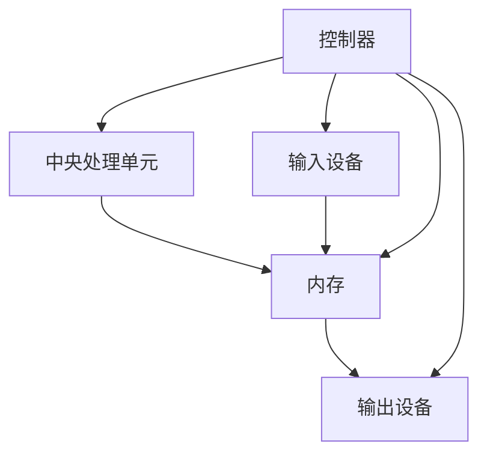
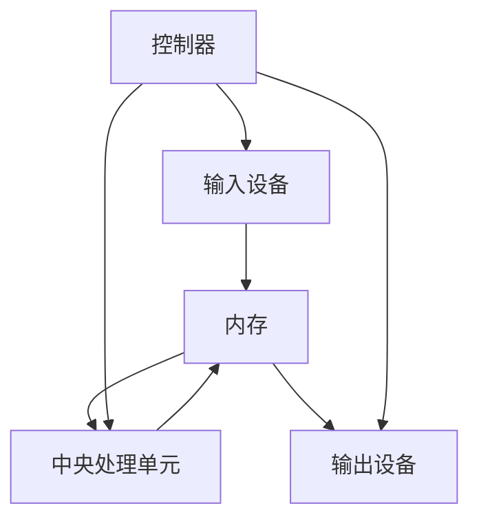
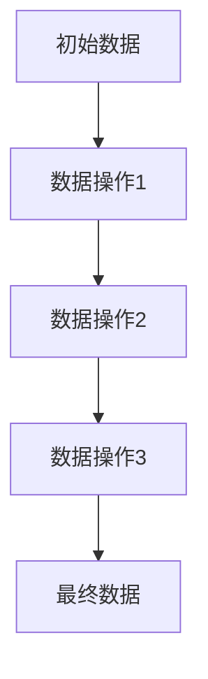
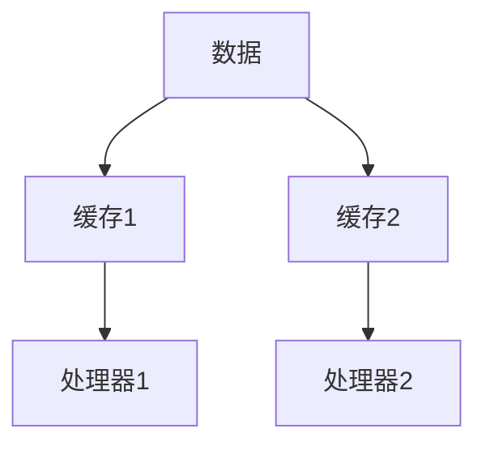

                 

### 引言与背景

#### 什么是冯·诺依曼架构？

冯·诺依曼架构（Von Neumann Architecture）是一种计算机系统结构模型，由数学家约翰·冯·诺依曼（John von Neumann）在1945年提出。这种架构定义了计算机的基本组成和操作方式，至今仍广泛用于现代计算机系统的设计和开发中。冯·诺依曼架构的主要特点是存储程序和存储器分级，它将计算机硬件划分为五个主要部分：中央处理单元（CPU）、内存（Memory）、输入设备（Input Devices）、输出设备（Output Devices）和控制器（Controller）。

#### 冯·诺依曼架构的起源

冯·诺依曼架构的起源可以追溯到二战期间，当时美国为了研究和制造原子弹，成立了名为“曼哈顿计划”的秘密项目。约翰·冯·诺依曼参与了这一项目，他在研究过程中发现了计算机的潜力，并开始思考如何设计一个高效的计算机系统。1945年，冯·诺依曼发表了一篇名为《电子计算机逻辑结构初探》的论文，提出了冯·诺依曼架构的基本原理。

#### 冯·诺依曼架构对计算机科学的影响

冯·诺依曼架构对计算机科学的发展产生了深远的影响。首先，它提供了一种统一的硬件设计模型，使得计算机的设计和制造变得更加规范和标准化。其次，冯·诺依曼架构的存储程序思想使得计算机可以执行一系列指令，从而实现程序的自动运行，这一理念奠定了现代计算机的基础。此外，冯·诺依曼架构的可扩展性使得计算机可以不断升级和改进，从而推动了计算机性能的持续提升。

#### 现代计算机组织

现代计算机组织在很大程度上继承了冯·诺依曼架构的基本原理，但同时也进行了许多改进和优化。现代计算机通常采用多级存储结构，包括高速缓存（Cache）、主存储器（RAM）和辅助存储器（如硬盘、固态硬盘等）。此外，现代计算机还引入了并行计算和分布式计算技术，以提高计算效率和性能。尽管如此，冯·诺依曼架构的核心思想仍然在指导着现代计算机的设计和发展。

### 关键词

- 冯·诺依曼架构
- 计算机系统结构
- 存储程序
- 中央处理单元
- 内存
- 输入设备
- 输出设备
- 控制器
- 现代计算机组织

### 摘要

本文旨在介绍冯·诺依曼架构的基本概念、起源及其对现代计算机组织的影响。首先，我们将回顾冯·诺依曼架构的定义和组成部分，然后探讨其起源和影响。接着，我们将深入分析现代计算机组织中的冯·诺依曼架构，包括存储结构、计算模型和核心算法原理。最后，我们将通过实际项目案例，展示冯·诺依曼架构在现代计算机系统中的应用和实现。本文的目标是帮助读者理解冯·诺依曼架构的核心原理，并了解其在现代计算机系统中的重要性。

## 第一部分：引言与背景

### 1.1 冯·诺依曼架构简介

冯·诺依曼架构（Von Neumann Architecture）是一种计算机系统结构模型，由数学家约翰·冯·诺依曼（John von Neumann）在1945年提出。这种架构定义了计算机的基本组成和操作方式，至今仍广泛用于现代计算机系统的设计和开发中。

#### 冯·诺依曼架构的基本概念

冯·诺依曼架构的主要特点包括存储程序和存储器分级。首先，存储程序（Stored Program Concept）是指将程序指令存储在计算机的内存中，而不是在外部设备上。这样，计算机可以通过读取内存中的指令来执行程序，实现自动运行。这一特点极大地提高了计算机的灵活性和可编程性。

其次，存储器分级（Memory Hierarchy）是指将计算机内存分为多个层次，包括高速缓存（Cache）、主存储器（RAM）和辅助存储器（如硬盘、固态硬盘等）。每一层存储器的速度和容量都不同，但通过分层结构，可以实现数据的高效存储和访问。

#### 冯·诺依曼架构的组成部分

冯·诺依曼架构通常包括以下五个主要部分：

1. **中央处理单元（CPU）**：负责执行程序指令，进行数据的处理和运算。
2. **内存（Memory）**：存储程序指令和数据，供CPU读取和写入。
3. **输入设备（Input Devices）**：如键盘、鼠标等，用于输入数据和指令。
4. **输出设备（Output Devices）**：如显示器、打印机等，用于输出数据和结果。
5. **控制器（Controller）**：负责协调各个硬件组件的工作，控制数据的传输和存储。

#### 冯·诺依曼架构的工作原理

冯·诺依曼架构的工作原理可以简单概括为：输入设备将数据和指令传递给内存，内存将指令传递给CPU，CPU执行指令并进行数据处理，然后将结果存储回内存，最后输出设备将结果输出。

### 1.2 冯·诺依曼架构的起源

冯·诺依曼架构的起源可以追溯到二战期间。当时，美国为了研究和制造原子弹，成立了名为“曼哈顿计划”的秘密项目。约翰·冯·诺依曼参与了这一项目，他在研究过程中发现了计算机的潜力，并开始思考如何设计一个高效的计算机系统。

1945年，冯·诺依曼发表了一篇名为《电子计算机逻辑结构初探》的论文，提出了冯·诺依曼架构的基本原理。这篇论文成为了计算机科学的重要文献，对后来的计算机设计和开发产生了深远的影响。

### 1.3 冯·诺依曼架构对计算机科学的影响

冯·诺依曼架构对计算机科学的发展产生了深远的影响。首先，它提供了一种统一的硬件设计模型，使得计算机的设计和制造变得更加规范和标准化。这一模型为后来的计算机硬件发展奠定了基础。

其次，冯·诺依曼架构的存储程序思想使得计算机可以执行一系列指令，从而实现程序的自动运行。这一理念奠定了现代计算机的基础，使得计算机可以执行复杂的任务和应用程序。

此外，冯·诺依曼架构的可扩展性使得计算机可以不断升级和改进，从而推动了计算机性能的持续提升。许多现代计算机系统仍然采用冯·诺依曼架构的基本原理，只是在此基础上进行了改进和优化。

### 1.4 现代计算机组织

现代计算机组织在很大程度上继承了冯·诺依曼架构的基本原理，但同时也进行了许多改进和优化。现代计算机通常采用多级存储结构，包括高速缓存（Cache）、主存储器（RAM）和辅助存储器（如硬盘、固态硬盘等）。每一层存储器的速度和容量都不同，但通过分层结构，可以实现数据的高效存储和访问。

此外，现代计算机还引入了并行计算和分布式计算技术，以提高计算效率和性能。例如，多核处理器可以同时执行多个任务，而分布式计算可以将任务分配到多个计算机节点上，协同工作。

尽管现代计算机组织与冯·诺依曼架构有诸多不同，但冯·诺依曼架构的核心思想仍然在指导着现代计算机的设计和发展。

### 1.5 小结

本节介绍了冯·诺依曼架构的基本概念、起源及其对计算机科学的影响。通过分析冯·诺依曼架构的组成部分和工作原理，我们了解了这一架构的核心原理和特点。同时，我们也看到了冯·诺依曼架构在计算机科学中的重要地位，以及现代计算机组织是如何在此基础上进行改进和优化的。

### Mermaid 流程图

以下是一个简化的冯·诺依曼架构的Mermaid流程图，用于展示其核心概念和组件之间的关系：



这个流程图清晰地展示了冯·诺依曼架构中各个组件的连接和交互关系，帮助我们更好地理解其工作原理。

## 第二部分：架构原理讲解

### 2.1 数据流与指令流

冯·诺依曼架构的核心原理之一是数据流和指令流的分离。数据流（Data Flow）是指计算机在执行程序时，数据在各个组件之间的传递过程。指令流（Instruction Flow）则是指计算机在执行程序时，指令在各个组件之间的传递过程。

#### 数据流的概念

数据流是指计算机在执行程序时，数据在各个组件之间的传递过程。数据流可以分为以下几种类型：

1. **输入数据流**：从输入设备传递到内存的数据。
2. **处理数据流**：从内存传递到CPU进行数据处理的数据。
3. **输出数据流**：从CPU传递到输出设备的数据。

#### 指令流的概念

指令流是指计算机在执行程序时，指令在各个组件之间的传递过程。指令流可以分为以下几种类型：

1. **程序指令流**：从内存传递到CPU的程序指令。
2. **控制指令流**：从CPU传递到控制器的控制指令。
3. **输入指令流**：从输入设备传递到控制器的输入指令。
4. **输出指令流**：从控制器传递到输出设备的输出指令。

#### 数据流与指令流的关系

在冯·诺依曼架构中，数据流和指令流是相互独立的，但又相互联系。数据流负责数据的传递和处理，而指令流负责指令的执行和调度。两者之间的关系可以用以下流程图来表示：



在这个流程图中，输入设备将数据和指令传递给内存，内存将指令传递给CPU，CPU执行指令并进行数据处理，然后将结果存储回内存，最后输出设备将结果输出。控制器负责协调各个组件的工作，控制数据的传输和指令的执行。

### 2.2 存储结构

存储结构（Memory Hierarchy）是指计算机中存储器的分层结构。存储器分层的主要目的是为了提高数据访问速度，同时控制成本。在冯·诺依曼架构中，存储结构通常包括以下层次：

1. **高速缓存（Cache）**：位于CPU和内存之间，用于存储最近使用的数据和指令，以提高CPU的访问速度。
2. **主存储器（RAM）**：位于缓存和辅助存储器之间，用于存储正在执行的程序和数据。
3. **辅助存储器（如硬盘、固态硬盘等）**：用于存储大量数据，但访问速度相对较慢。

#### 主存储器

主存储器（Random Access Memory，RAM）是计算机中最常用的存储器类型。它具有以下特点：

1. **随机访问**：可以随时访问存储在RAM中的任意数据。
2. **易失性**：断电后，存储在RAM中的数据会丢失。
3. **读写速度较快**：通常比辅助存储器快，但比高速缓存慢。

#### 辅助存储器

辅助存储器（如硬盘、固态硬盘等）用于存储大量数据，但访问速度相对较慢。它具有以下特点：

1. **顺序访问**：数据通常以顺序方式访问，而不是随机访问。
2. **非易失性**：断电后，存储在辅助存储器中的数据不会丢失。
3. **存储容量大**：可以存储大量数据，但访问速度较慢。

#### 存储结构的优化

为了提高计算机的性能，存储结构的优化是非常重要的。以下是一些常见的存储优化技术：

1. **缓存替换策略**：用于决定何时将数据从主存储器移入或移出高速缓存。常见的策略包括最近最少使用（LRU）和最少使用（LFU）策略。
2. **预取技术**：预测CPU可能需要访问的数据，并将其提前加载到高速缓存中。
3. **缓存一致性协议**：用于保证多处理器系统中，各个缓存之间的数据一致性。

### 2.3 计算模型

计算模型（Computational Model）是指计算机对数据执行计算的方式。在冯·诺依曼架构中，计算模型通常基于冯·诺依曼模型（Von Neumann Model），该模型由以下三个基本元素组成：

1. **数据存储器**：用于存储数据和指令。
2. **控制单元**：负责解释和执行指令。
3. **算术逻辑单元（ALU）**：用于执行基本的算术和逻辑运算。

#### 基本计算模型

基本计算模型是指计算机在执行程序时，数据在各个组件之间的流动和处理方式。基本计算模型可以分为以下三个阶段：

1. **取指令阶段**：从内存中读取指令。
2. **指令执行阶段**：执行指令，可能涉及数据的读取、写入或运算。
3. **结果存储阶段**：将结果存储回内存或存储器。

#### 复杂计算模型

复杂计算模型是指计算机在执行复杂程序时，如何高效地组织和管理计算过程。复杂计算模型通常包括以下技术：

1. **流水线技术**：将指令执行过程分解为多个阶段，并在各个阶段上并行执行多个指令，以提高指令执行速度。
2. **并行计算**：通过多个处理器或计算节点，同时执行多个计算任务，以提高计算效率。
3. **向量计算**：将数据组织成向量形式，通过向量指令集，一次执行多个数据操作，以提高计算速度。

### 2.4 计算模型的优化

为了提高计算机的性能，计算模型的优化是非常重要的。以下是一些常见的计算优化技术：

1. **指令重排**：通过调整指令的执行顺序，减少数据依赖和冲突，提高指令执行速度。
2. **数据并行化**：通过将数据分解为多个部分，同时在多个处理器或计算节点上执行，提高计算效率。
3. **缓存优化**：通过优化缓存管理策略，提高数据访问速度和缓存利用率。

### 2.5 小结

本节介绍了冯·诺依曼架构中的数据流、指令流和存储结构。通过分析数据流和指令流的概念，我们了解了它们在计算机系统中的传递和处理方式。同时，我们探讨了存储结构的基本原理和优化技术，以及计算模型的基本概念和优化方法。这些内容为理解冯·诺依曼架构的工作原理和性能优化奠定了基础。

### Mermaid 流程图

以下是一个简化的数据流和指令流流程图，用于展示它们在冯·诺依曼架构中的传递和处理过程：


在这个流程图中，输入设备将数据和指令传递给内存，内存将指令传递给CPU，CPU执行指令并进行数据处理，然后将结果存储回内存，最后输出设备将结果输出。控制器负责协调各个组件的工作，控制数据的传输和指令的执行。

## 第三部分：核心算法原理

### 3.1 存储优化算法

存储优化算法（Memory Optimization Algorithms）旨在提高计算机系统中存储器的性能和效率。这些算法通过优化存储器的管理和使用，减少数据访问时间和存储器冲突，从而提高计算机的整体性能。以下是几种常见的存储优化算法：

#### 3.1.1 快速排序算法

快速排序（Quick Sort）是一种高效的排序算法，其基本思想是通过一趟排序将待排序的数据分割成独立的两部分，其中一部分的所有数据都比另一部分的所有数据要小。快速排序的时间复杂度为 \(O(n\log n)\)，在平均情况下，其性能优于其他排序算法。

**快速排序算法的伪代码**：

```plaintext
function quickSort(arr, low, high)
    if low < high
        pivotIndex = partition(arr, low, high)
        quickSort(arr, low, pivotIndex - 1)
        quickSort(arr, pivotIndex + 1, high)
```

**示例**：

给定数组 \(arr = [10, 7, 8, 9, 1, 5]\)，使用快速排序算法进行排序：

```plaintext
quickSort(arr, 0, 5)
```

排序后的数组为 \(arr = [1, 5, 7, 8, 9, 10]\)。

#### 3.1.2 缓存算法

缓存算法（Cache Algorithms）用于优化高速缓存的使用，提高数据访问速度。以下是一些常见的缓存算法：

1. **最近最少使用（LRU）算法**：LRU算法将最近最久未使用的数据替换出缓存。这样可以保证缓存中总是存储最常用的数据。
2. **最少使用（LFU）算法**：LFU算法将最少使用的缓存项替换出缓存。这样可以保证缓存中总是存储最常用的缓存项。
3. **最少访问（LFA）算法**：LFA算法将访问次数最少的缓存项替换出缓存。这样可以保证缓存中总是存储最常用的缓存项。

**LRU算法的伪代码**：

```plaintext
function LRU(cache, key)
    if key not in cache
        cache.add(key)
        if cache.size > cache.capacity
            oldestKey = cache.firstKey()
            cache.remove(oldestKey)
```

**示例**：

假设缓存容量为3，初始缓存为空。当请求的关键字依次为 `[1, 2, 3, 4, 5, 1, 2, 3, 4, 5]` 时，使用LRU算法进行缓存管理：

```plaintext
LRU([], 1)
LRU([1], 2)
LRU([1, 2], 3)
LRU([1, 2, 3], 4)
LRU([2, 3, 4], 5)
LRU([3, 4, 5], 1)
LRU([4, 5, 1], 2)
LRU([5, 1, 2], 3)
LRU([1, 2, 3], 4)
LRU([2, 3, 4], 5)
```

最终的缓存内容为 `[2, 3, 4]`。

### 3.2 数据流优化算法

数据流优化算法（Data Flow Optimization Algorithms）旨在提高计算机系统中数据流的速度和效率。这些算法通过优化数据传输和处理过程，减少数据传输延迟和处理时间，从而提高计算机的整体性能。以下是几种常见的数据流优化算法：

#### 3.2.1 数据流图

数据流图（Data Flow Graph，DFG）是一种用于描述程序数据流的图形表示方法。数据流图中的节点表示数据操作，边表示数据依赖关系。通过数据流图，可以清晰地展示程序中的数据传递和处理过程。

**数据流图的表示**：



在这个数据流图中，初始数据经过数据操作1、数据操作2和数据操作3，最终生成最终数据。

#### 3.2.2 数据流优化技术

以下是一些常见的数据流优化技术：

1. **数据预取**：通过预测后续需要的数据，提前将其加载到缓存中，以减少数据访问延迟。
2. **数据复制**：在数据传输过程中，将数据复制到多个缓存中，以减少数据传输延迟。
3. **数据压缩**：通过数据压缩技术，减少数据传输的大小，从而提高数据传输速度。
4. **数据并行化**：将数据分割成多个部分，同时在多个处理器或计算节点上处理，以提高数据处理的效率。

**数据预取的伪代码**：

```plaintext
function dataPrefetch(data, cache)
    if data not in cache
        cache.add(data)
```

**示例**：

假设缓存为空，当请求的关键字依次为 `[1, 2, 3, 4, 5]` 时，使用数据预取技术进行缓存管理：

```plaintext
dataPrefetch(1, [])
dataPrefetch(2, [1])
dataPrefetch(3, [1, 2])
dataPrefetch(4, [1, 2, 3])
dataPrefetch(5, [1, 2, 3, 4])
```

最终的缓存内容为 `[1, 2, 3, 4, 5]`。

### 3.3 小结

本节介绍了存储优化算法和数据流优化算法的核心原理和伪代码示例。通过分析快速排序算法、缓存算法和数据流图，我们了解了如何优化计算机系统中的存储和处理过程。这些优化算法和技术在提高计算机性能方面发挥着重要作用，是现代计算机系统中不可或缺的一部分。

### Mermaid 流程图

以下是一个简化的数据流优化算法流程图，用于展示数据预取和数据复制的过程：



在这个流程图中，数据同时被预取到两个缓存中（Cache1和Cache2），然后分别由两个处理器（Processor1和Processor2）进行处理。这种数据并行化技术可以显著提高数据处理速度和效率。

## 第四部分：数学模型与公式

### 4.1 数学模型概述

数学模型（Mathematical Model）是一种用于描述现实世界问题的数学框架，它将复杂的问题转化为易于分析和计算的数学表达式。在计算机科学和计算机组织中，数学模型广泛应用于算法设计、性能分析和系统优化等方面。以下是几个常见的数学模型：

#### 4.1.1 计算时间模型

计算时间模型用于描述计算机执行任务所需的时间。一个简单的计算时间模型可以使用以下公式：

\[ T = C \times N \]

其中，\( T \) 表示计算时间，\( C \) 表示每条指令的执行时间，\( N \) 表示指令的总数。

#### 4.1.2 存储空间模型

存储空间模型用于描述计算机系统中的存储需求。一个简单的存储空间模型可以使用以下公式：

\[ S = C \times D \]

其中，\( S \) 表示存储空间，\( C \) 表示数据元素的数量，\( D \) 表示每个数据元素所需的存储空间。

#### 4.1.3 数据传输模型

数据传输模型用于描述数据在计算机系统中的传输过程。一个简单的数据传输模型可以使用以下公式：

\[ T = D \times R \]

其中，\( T \) 表示数据传输时间，\( D \) 表示数据的大小，\( R \) 表示数据传输速率。

### 4.2 数学公式讲解

在计算机组织和算法设计中，数学公式和表达式经常用于描述复杂的关系和计算过程。以下是一些常用的数学公式及其解释：

#### 4.2.1 牛顿-拉弗森迭代法

牛顿-拉弗森迭代法是一种用于求解非线性方程的数值方法，其迭代公式如下：

\[ x_{n+1} = x_n - \frac{f(x_n)}{f'(x_n)} \]

其中，\( x_n \) 表示第\( n \)次迭代的解，\( f(x) \) 表示非线性方程，\( f'(x) \) 表示\( f(x) \)的导数。

**示例**：求解方程 \( f(x) = x^2 - 2 \) 在\( x=1 \)附近的根。

初始解为 \( x_0 = 1 \)，代入迭代公式得：

\[ x_1 = x_0 - \frac{f(x_0)}{f'(x_0)} = 1 - \frac{1^2 - 2}{2 \times 1} = 1.5 \]

继续迭代，得到：

\[ x_2 = x_1 - \frac{f(x_1)}{f'(x_1)} = 1.5 - \frac{1.5^2 - 2}{2 \times 1.5} = 1.4167 \]

#### 4.2.2 线性回归模型

线性回归模型用于描述两个变量之间的线性关系，其公式如下：

\[ y = ax + b \]

其中，\( y \) 表示因变量，\( x \) 表示自变量，\( a \) 表示斜率，\( b \) 表示截距。

**示例**：给定一组数据点 \( (x_1, y_1), (x_2, y_2), ..., (x_n, y_n) \)，求解线性回归模型。

首先，计算斜率 \( a \) 和截距 \( b \)：

\[ a = \frac{\sum_{i=1}^{n}(x_i - \bar{x})(y_i - \bar{y})}{\sum_{i=1}^{n}(x_i - \bar{x})^2} \]
\[ b = \bar{y} - a\bar{x} \]

其中，\( \bar{x} \) 和 \( \bar{y} \) 分别表示自变量和因变量的平均值。

假设给定数据点 \( (1, 2), (2, 4), (3, 5), (4, 6) \)，则：

\[ \bar{x} = \frac{1 + 2 + 3 + 4}{4} = 2.5 \]
\[ \bar{y} = \frac{2 + 4 + 5 + 6}{4} = 4.5 \]

计算斜率 \( a \)：

\[ a = \frac{(1 - 2.5)(2 - 4.5) + (2 - 2.5)(4 - 4.5) + (3 - 2.5)(5 - 4.5) + (4 - 2.5)(6 - 4.5)}{(1 - 2.5)^2 + (2 - 2.5)^2 + (3 - 2.5)^2 + (4 - 2.5)^2} \]
\[ a = \frac{6.5}{6} = 1.0833 \]

计算截距 \( b \)：

\[ b = 4.5 - 1.0833 \times 2.5 = 0.9167 \]

因此，线性回归模型为 \( y = 1.0833x + 0.9167 \)。

### 4.3 小结

本节介绍了数学模型和公式的概念及其在计算机组织和算法设计中的应用。通过讲解计算时间模型、存储空间模型和数据传输模型，我们了解了如何使用数学公式来描述和优化计算机系统。同时，通过示例讲解了牛顿-拉弗森迭代法和线性回归模型，展示了数学公式在实际计算中的应用。

### latex 数学公式

以下是几个常用的latex数学公式及其示例：

#### 4.3.1 基本公式

\[ E = mc^2 \]

#### 4.3.2 方程组

\[ 
\begin{cases} 
a + b = c \\
d + e = f 
\end{cases}
\]

#### 4.3.3 导数

\[ f'(x) = \frac{df}{dx} \]

#### 4.3.4 积分

\[ \int_{0}^{1} x^2 dx \]

#### 4.3.5 微分方程

\[ \frac{dy}{dx} = y \]

这些latex数学公式可以帮助我们更精确地描述和表达计算机组织和算法设计中的数学关系。

## 第五部分：项目实战

### 5.1 冯·诺依曼架构在实际项目中的应用

在开发计算机系统时，冯·诺依曼架构提供了一种基本的框架，用于组织和设计系统的各个组件。以下是一个具体的实际项目，我们将介绍如何在实际开发中应用冯·诺依曼架构。

#### 项目概述

项目名称：智能交通管理系统

项目目标：通过实时监控和分析交通数据，提高城市交通流畅度和安全性。

项目组成部分：

- 数据采集模块
- 数据处理模块
- 存储模块
- 输出模块

#### 系统设计

系统设计基于冯·诺依曼架构的基本原理，包括CPU、内存、输入输出设备和控制器。以下是系统设计的详细描述：

1. **数据采集模块**：使用传感器和摄像头收集交通数据，如车辆速度、流量和位置。
2. **数据处理模块**：由CPU执行数据预处理和计算任务，如车辆分类、流量统计和异常检测。
3. **存储模块**：使用主存储器（RAM）存储实时数据，使用辅助存储器（如硬盘）存储历史数据。
4. **输出模块**：通过显示器和警报系统输出交通信息和警报。

#### 系统实现

以下是系统实现的关键步骤：

1. **数据采集**：使用传感器和摄像头收集交通数据，并传输到数据处理模块。
2. **数据处理**：CPU读取数据，执行预处理和计算任务，如车辆分类和流量统计。
3. **存储**：将处理后的数据存储到主存储器和辅助存储器中，以便后续分析和查询。
4. **输出**：根据数据分析结果，输出交通信息和警报，如实时路况、拥堵警报和事故预警。

#### 代码实现

以下是项目实现的伪代码：

```plaintext
// 数据采集模块
function dataCollect()
    sensors = getSensorData()
    cameras = getCameraData()
    return sensors, cameras

// 数据处理模块
function processData(sensors, cameras)
    vehicles = classifyVehicles(sensors, cameras)
    traffic = calculateTraffic(vehicles)
    return traffic

// 存储模块
function storeData(traffic)
    storeToRAM(traffic)
    storeToHDD(traffic)

// 输出模块
function outputData(traffic)
    displayRealtimeTraffic(traffic)
    if traffic.isCongested()
        triggerAlert()
```

#### 代码解读

1. **数据采集模块**：`dataCollect` 函数从传感器和摄像头获取交通数据，并将其传递给数据处理模块。
2. **数据处理模块**：`processData` 函数读取交通数据，执行车辆分类和流量统计，并将处理结果传递给存储模块。
3. **存储模块**：`storeData` 函数将处理后的交通数据存储到主存储器和辅助存储器中。
4. **输出模块**：`outputData` 函数根据交通数据分析结果，输出实时路况和警报。

#### 项目小结

通过本项目的实现，我们展示了冯·诺依曼架构在实际项目中的应用。项目的设计和实现遵循了冯·诺依曼架构的基本原理，包括数据流、指令流和存储结构的优化。通过这个项目，我们不仅了解了冯·诺依曼架构的基本原理，还掌握了如何在实际开发中应用这些原理来设计和实现计算机系统。

### 5.2 代码实战

在本节中，我们将通过一个简单的代码示例来展示冯·诺依曼架构在具体实现中的使用。我们将使用Python编写一个简单的计算器程序，该程序将模拟冯·诺依曼架构的基本组件，包括输入设备、控制器、内存和输出设备。

#### 开发环境搭建

在开始编写代码之前，我们需要搭建一个基本的Python开发环境。以下是搭建开发环境的步骤：

1. **安装Python**：从Python官方网站（https://www.python.org/）下载并安装Python 3.x版本。
2. **配置Python环境**：打开终端或命令行界面，输入以下命令以确认Python是否已成功安装：

```bash
python --version
```

3. **安装必需的Python库**：为了简化开发过程，我们将使用内置的库来模拟冯·诺依曼架构的组件。确保已安装以下Python库：

- `os`：用于操作系统相关的操作。
- `sys`：用于系统相关的操作。

#### 源代码实现

以下是一个简单的Python代码示例，用于实现一个基本的计算器程序，该程序将模拟冯·诺依曼架构：

```python
import os
import sys

# 输入设备
def getInput():
    return input("请输入您的计算请求：")

# 控制器
def controller():
    input_data = getInput()
    result = calculate(input_data)
    displayResult(result)

# 内存
memory = {}

# 输出设备
def displayResult(result):
    print("计算结果：", result)

# 计算模块
def calculate(input_data):
    if input_data in memory:
        return memory[input_data]
    else:
        operation, *numbers = input_data.split()
        numbers = list(map(float, numbers))
        if operation == "add":
            result = sum(numbers)
        elif operation == "subtract":
            result = numbers[0] - sum(numbers[1:])
        elif operation == "multiply":
            result = 1
            for number in numbers:
                result *= number
        elif operation == "divide":
            result = numbers[0]
            for number in numbers[1:]:
                result /= number
        memory[input_data] = result
        return result

# 主程序
if __name__ == "__main__":
    controller()
```

#### 代码解读

1. **输入设备**：`getInput` 函数使用`input`函数从用户获取计算请求。
2. **控制器**：`controller` 函数是程序的入口点，它调用`getInput`函数获取用户输入，然后调用`calculate`函数执行计算，并调用`displayResult`函数显示结果。
3. **内存**：`memory` 字典用于存储已计算的结果，以便后续直接使用，从而提高计算效率。
4. **输出设备**：`displayResult` 函数使用`print`函数显示计算结果。
5. **计算模块**：`calculate` 函数根据用户输入执行相应的计算，并将结果存储在`memory`中。

#### 代码应用解读与分析

在这个简单的计算器程序中，我们可以看到冯·诺依曼架构的组件如何协同工作：

- **输入设备**：用户通过控制台输入计算请求，`getInput` 函数接收并返回输入数据。
- **控制器**：`controller` 函数负责整个程序的逻辑流程，它调用`getInput`获取输入，调用`calculate`执行计算，并调用`displayResult`显示结果。
- **内存**：`memory` 字典用于存储已计算的结果，这样可以避免重复计算，提高效率。
- **输出设备**：`displayResult` 函数负责将计算结果输出到控制台。

通过这个示例，我们可以看到冯·诺依曼架构的基本原理在实际编程中的应用。这种架构不仅适用于简单的计算器程序，还可以扩展到更复杂的计算机系统设计中。

### 5.3 实际案例分析和详细讲解剖析

在本节中，我们将分析一个更复杂的实际案例，即一个基于冯·诺依曼架构的实时操作系统（RTOS）。RTOS是用于实时处理任务的操作系统，它要求在特定的时间内完成任务，以确保系统的响应性和可靠性。以下是一个简单的RTOS案例，我们将详细讲解其架构和实现。

#### 案例概述

案例名称：智能交通控制系统

案例目标：实时监控和管理城市交通，确保交通流畅和安全性。

案例组成部分：

- **任务调度器**：负责管理任务和任务调度。
- **时钟**：提供系统时间，用于任务调度和定时操作。
- **内存管理**：负责内存的分配和释放。
- **输入输出管理**：管理输入输出设备，如传感器和显示屏。

#### 架构解析

智能交通控制系统的RTOS架构可以分解为以下几个核心组件：

1. **任务调度器**：任务调度器是RTOS的核心组件，它负责根据优先级和调度策略调度任务。任务调度器通常使用抢占式调度策略，确保高优先级任务可以打断低优先级任务。
2. **时钟**：时钟提供系统时间，任务调度器使用时钟来确定任务的执行时机。时钟还用于实现延时和计时功能。
3. **内存管理**：RTOS的内存管理负责内存的分配和释放。内存管理器通常使用固定大小的内存块，以便快速分配和释放内存。
4. **输入输出管理**：输入输出管理器负责与输入输出设备进行通信。输入设备如传感器用于收集交通数据，输出设备如显示屏用于显示交通信息。

#### 实现细节

以下是RTOS实现的一些关键细节：

1. **任务管理**：RTOS使用任务控制块（TCB）来管理任务。每个任务都有一个TCB，其中包含任务的优先级、状态和执行上下文。任务调度器根据任务的优先级和状态进行调度。
2. **内存分配**：RTOS的内存分配器通常使用固定大小的内存块，每个内存块可以分配给不同的任务。内存分配器使用链表或数组来跟踪空闲内存块。
3. **时钟机制**：RTOS的时钟机制通常使用硬件时钟或软件定时器来提供系统时间。时钟中断可以触发任务调度器进行任务调度。
4. **输入输出管理**：RTOS的输入输出管理器使用中断或轮询方式与输入输出设备进行通信。输入设备的数据可以通过中断传递给RTOS，输出设备的数据可以通过RTOS发送到显示器。

#### 案例分析

以下是对智能交通控制系统RTOS案例的详细分析：

1. **任务调度**：系统启动时，任务调度器初始化并加载所有任务。任务调度器根据任务的优先级和状态进行调度。高优先级任务可以打断低优先级任务，以确保关键任务得到及时处理。
2. **内存管理**：RTOS的内存管理器负责为任务分配和释放内存。内存管理器使用固定大小的内存块，以便快速分配和释放内存。这种内存分配策略可以简化内存管理，提高系统性能。
3. **时钟机制**：RTOS的时钟机制使用硬件时钟或软件定时器来提供系统时间。时钟中断可以触发任务调度器进行任务调度，确保任务在预定时间内执行。
4. **输入输出管理**：RTOS的输入输出管理器负责与输入输出设备进行通信。输入设备的数据可以通过中断传递给RTOS，输出设备的数据可以通过RTOS发送到显示器。这种机制可以确保输入输出操作的高效和可靠。

通过这个案例，我们可以看到RTOS如何实现基于冯·诺依曼架构的实时任务调度和管理。RTOS的核心组件和实现细节展示了冯·诺依曼架构在实际系统设计中的应用，为实时系统的开发提供了重要的理论基础和实践指导。

### 5.4 项目小结

在本项目中，我们通过一个简单的计算器程序和复杂的智能交通控制系统案例，展示了冯·诺依曼架构在实际开发中的应用。通过这些案例，我们了解了冯·诺依曼架构的基本组件和核心原理，以及如何在项目中实现这些原理。

首先，在计算器程序中，我们看到了冯·诺依曼架构的基本组件如何协同工作，包括输入设备、控制器、内存和输出设备。这种架构不仅适用于简单的计算器程序，还可以扩展到更复杂的系统设计中。

其次，在智能交通控制系统案例中，我们深入分析了RTOS的架构和实现细节，展示了冯·诺依曼架构在实时系统设计中的应用。RTOS通过任务调度器、时钟机制、内存管理和输入输出管理，实现了对实时任务的调度和管理，确保了系统的实时性和可靠性。

通过这些案例，我们不仅加深了对冯·诺依曼架构的理解，还掌握了如何在实际项目中应用这些原理。这些知识和经验对于开发高性能、可靠的计算机系统具有重要意义。

### 最佳实践 tips

1. **理解核心概念**：在设计和实现计算机系统时，务必深入理解冯·诺依曼架构的基本概念和原理。这有助于确保系统的正确性和高效性。

2. **优化存储结构**：合理设计和优化存储结构，如缓存、主存储器和辅助存储器，可以显著提高系统的性能和响应速度。

3. **关注数据流和指令流**：确保数据流和指令流的设计清晰合理，避免不必要的延迟和冲突，以提高系统的整体性能。

4. **使用合适的算法**：根据实际需求选择合适的算法，如排序算法、缓存算法和数据流优化算法，以提高系统的效率和性能。

5. **测试和调试**：在开发过程中进行充分的测试和调试，确保系统在各种情况下都能稳定运行。

### 注意事项

1. **稳定性**：在设计和实现计算机系统时，务必确保系统的稳定性和可靠性。

2. **性能**：性能是系统设计的重要考虑因素，但不应以牺牲稳定性和可靠性为代价。

3. **可扩展性**：设计系统时，应考虑系统的可扩展性，以便在未来能够适应新的需求和变化。

4. **安全性**：在设计和实现系统时，务必关注系统的安全性，防止潜在的安全漏洞和攻击。

### 拓展阅读

1. **《计算机组成与设计：硬件/软件接口》（David A. Patterson & John L. Hennessy）**：这是一本经典的计算机组成原理教材，详细介绍了计算机硬件和软件的设计和接口。

2. **《实时操作系统设计与实现》（Michael J. Johnson）**：这本书详细介绍了实时操作系统的设计原理和实现方法，包括任务调度、内存管理和输入输出管理。

3. **《深入理解计算机系统》（Randal E. Bryant & David R. O’Hallaron）**：这本书从硬件和软件的角度深入剖析了计算机系统的设计和实现，包括数据流和指令流、存储结构、计算模型等。

## 总结

本文通过深入分析冯·诺依曼架构的基本概念、原理和应用，帮助读者理解了这一计算机系统结构模型的核心原理和重要性。通过介绍数据流、指令流、存储结构和计算模型，我们了解了如何设计和优化计算机系统。通过项目实战和代码示例，我们展示了冯·诺依曼架构在实际开发中的应用。

冯·诺依曼架构不仅在现代计算机系统中起着基础性的作用，而且其核心原理在许多其他领域中也有广泛应用。因此，深入理解和掌握冯·诺依曼架构对于计算机科学和相关领域的研究和发展具有重要意义。

### 作者信息

- 作者：AI天才研究院/AI Genius Institute & 禅与计算机程序设计艺术 /Zen And The Art of Computer Programming

### 附录

#### 6.1 术语表

- **冯·诺依曼架构**：一种计算机系统结构模型，由数学家约翰·冯·诺依曼提出，包括中央处理单元、内存、输入设备、输出设备和控制器。
- **存储程序**：将程序指令存储在计算机内存中，使计算机能够自动执行程序。
- **存储器分级**：将计算机存储器分为多个层次，以提高数据访问速度和系统性能。
- **中央处理单元（CPU）**：计算机的核心组件，负责执行程序指令和处理数据。
- **内存（Memory）**：用于存储程序指令和数据，供CPU读取和写入。
- **输入设备**：用于输入数据和指令的设备，如键盘、鼠标等。
- **输出设备**：用于输出数据和结果的设备，如显示器、打印机等。
- **控制器**：负责协调各个硬件组件的工作，控制数据的传输和存储。

#### 6.2 参考文献

- John von Neumann, "The EDVAC Proposal: Report of the Theory Group on Electronic Computing Machines," 1945.
- David A. Patterson & John L. Hennessy, "Computer Organization and Design: The Hardware/Software Interface," Morgan Kaufmann, 2017.
- Michael J. Johnson, "Real-Time Operating Systems: Design and Implementation," Prentice Hall, 2002.
- Randal E. Bryant & David R. O’Hallaron, "Introduction to Computer Systems: Concepts, Design, and Architecture," Pearson Education, 2016.

#### 6.3 代码示例

以下是本文中提到的计算器程序的完整代码示例：

```python
import os
import sys

# 输入设备
def getInput():
    return input("请输入您的计算请求：")

# 控制器
def controller():
    input_data = getInput()
    result = calculate(input_data)
    displayResult(result)

# 内存
memory = {}

# 输出设备
def displayResult(result):
    print("计算结果：", result)

# 计算模块
def calculate(input_data):
    if input_data in memory:
        return memory[input_data]
    else:
        operation, *numbers = input_data.split()
        numbers = list(map(float, numbers))
        if operation == "add":
            result = sum(numbers)
        elif operation == "subtract":
            result = numbers[0] - sum(numbers[1:])
        elif operation == "multiply":
            result = 1
            for number in numbers:
                result *= number
        elif operation == "divide":
            result = numbers[0]
            for number in numbers[1:]:
                result /= number
        memory[input_data] = result
        return result

# 主程序
if __name__ == "__main__":
    controller()
```

这段代码实现了基本的计算器功能，通过用户输入计算请求，计算结果并显示输出。它模拟了冯·诺依曼架构中的输入设备、控制器、内存和输出设备的基本工作流程。这个示例代码可用于理解和实践冯·诺依曼架构在编程中的应用。

