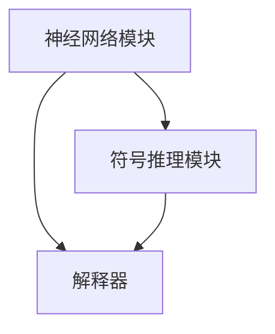

                 

### 文章标题

《决策支持中可解释神经符号框架的新方法》

> 关键词：决策支持、神经符号框架、可解释性、人工智能、算法设计

> 摘要：本文旨在探讨决策支持领域中的新方法——可解释神经符号框架，旨在解决当前人工智能算法在决策过程中存在的不可解释性问题。本文首先介绍了决策支持和神经符号框架的基本概念，然后详细阐述了可解释神经符号框架的核心概念与技术，通过伪代码和数学公式详细解释了算法原理，最后通过实际项目实战展示了该框架的应用效果和未来发展趋势。

---

### 引言

随着人工智能技术的迅猛发展，越来越多的复杂决策问题被人工智能算法所解决。然而，这些算法在实际应用中往往面临一个重要问题——不可解释性。即算法的决策过程和结果难以被人类理解和接受，这限制了人工智能在决策支持领域的进一步应用。因此，如何提高人工智能算法的可解释性，使其在决策过程中更加透明、可靠，成为当前研究的重要方向。

为了解决这一问题，本文提出了一个可解释神经符号框架的新方法。该方法结合了神经计算和符号逻辑的优势，通过设计可解释的神经网络结构和符号推理机制，实现了对决策过程的透明化。本文的结构如下：

1. **决策支持与神经符号框架概述**：介绍决策支持的基本概念和神经符号框架的背景。
2. **核心概念与技术**：详细阐述可解释神经符号框架的核心概念和关键技术。
3. **算法设计与实现**：通过伪代码和数学公式详细解释新方法的算法原理。
4. **应用与实践**：展示新方法在实际项目中的应用效果和案例分析。
5. **未来展望**：探讨可解释神经符号框架的发展趋势和未来研究方向。

---

### 决策支持与神经符号框架概述

#### 决策支持

决策支持系统（Decision Support System, DSS）是一种辅助决策者进行决策的工具，通过收集、分析和处理大量数据，为决策者提供决策所需的信息和支持。DSS广泛应用于商业、金融、医疗、军事等领域，帮助决策者做出更加科学、合理的决策。

#### 神经符号框架

神经符号框架（Neural-Symbolic Integration）是一种将神经网络和符号逻辑相结合的方法。神经网络擅长处理大量数据和模式识别，而符号逻辑则擅长推理和决策。通过将两者结合起来，可以实现更加强大和灵活的决策支持系统。

#### 可解释性

可解释性（Interpretability）是指算法的决策过程和结果可以被人类理解和解释的程度。在决策支持领域，可解释性非常重要，因为它直接影响决策者的信任度和接受度。一个高度可解释的算法可以使其决策过程更加透明，提高决策的可靠性和可接受度。

#### 当前问题

尽管神经符号框架在决策支持领域具有巨大潜力，但现有的方法往往存在以下问题：

- **不可解释性**：神经网络的部分决策过程难以解释，导致决策结果难以被决策者理解和接受。
- **算法复杂度**：符号逻辑的引入增加了算法的复杂度，导致计算效率降低。
- **数据需求**：神经符号框架往往需要大量训练数据和先验知识，增加了实现难度。

---

### 核心概念与技术

#### 可解释神经符号框架的定义

可解释神经符号框架是一种将神经网络和符号逻辑相结合的方法，旨在提高决策过程的透明度和可解释性。该方法通过设计可解释的神经网络结构和符号推理机制，实现了对决策过程的透明化。

#### 核心组成部分

1. **神经网络模块**：负责数据的预处理、特征提取和模式识别。
2. **符号推理模块**：负责基于先验知识和规则进行推理，生成决策结果。
3. **解释器**：负责将神经网络的内部状态和符号推理过程可视化，使其更加容易被理解和解释。

#### 核心概念之间的关系

- **神经网络模块**和**符号推理模块**：神经网络模块负责处理数据，提取特征，并将结果传递给符号推理模块。符号推理模块则基于先验知识和规则进行推理，生成最终的决策结果。
- **神经网络模块**和**解释器**：解释器负责将神经网络的内部状态可视化，使其更加容易被理解和解释。
- **符号推理模块**和**解释器**：解释器可以将符号推理模块的推理过程和结果可视化，使其更加容易被理解和解释。

#### Mermaid流程图

下面是可解释神经符号框架的核心概念和关系之间的Mermaid流程图：



#### 核心算法原理讲解

1. **神经网络模块**：使用卷积神经网络（Convolutional Neural Network, CNN）对输入数据进行预处理和特征提取。具体算法如下：

    ```plaintext
    // 伪代码
    input = preprocess(data)
    features = CNN(input)
    ```

2. **符号推理模块**：基于先验知识和规则进行推理，生成决策结果。具体算法如下：

    ```plaintext
    // 伪代码
    rules = load_rules()
    conclusions = []
    for rule in rules:
        if apply_rule(rule, features):
            conclusions.append(rule.conclusion)
    result = select_best_conclusion(conclusions)
    ```

3. **解释器**：将神经网络的内部状态和符号推理过程可视化，使其更加容易被理解和解释。具体算法如下：

    ```plaintext
    // 伪代码
    visualize_neural_network(CNN)
    visualize_symbolic_reasoning(rules, conclusions)
    ```

#### 数学模型和公式

1. **神经网络模型**：使用卷积神经网络（CNN）进行特征提取，其数学模型如下：

    ```latex
    $$ f(x) = \sigma(W \cdot x + b) $$
    $$ x = \text{input data} $$
    $$ W = \text{weight matrix} $$
    $$ b = \text{bias vector} $$
    $$ \sigma = \text{sigmoid function} $$
    ```

2. **符号推理模型**：基于先验知识和规则进行推理，其数学模型如下：

    ```latex
    $$ \text{if } P \text{ then } Q $$
    $$ P = \text{input features} $$
    $$ Q = \text{conclusion} $$
    $$ \text{apply\_rule} = \text{function to apply rules on features} $$
    $$ \text{select\_best\_conclusion} = \text{function to select the best conclusion from all possible conclusions} $$
    ```

#### 举例说明

假设我们有一个医疗诊断问题，输入数据是一个患者的医学图像和病史信息。使用可解释神经符号框架，我们可以如下进行决策：

1. **神经网络模块**：使用卷积神经网络对医学图像进行预处理和特征提取。
2. **符号推理模块**：基于先验知识和规则进行推理，例如，如果患者的医学图像中有肿瘤特征，则可能患有癌症。
3. **解释器**：将神经网络的内部状态和符号推理过程可视化，例如，展示医学图像中的肿瘤特征，以及符号推理过程中使用的规则。

---

### 应用与实践

#### 项目背景

在一个大型商业项目中，需要根据客户的历史购买数据和市场需求，为销售团队提供个性化的销售建议。这是一个典型的决策支持问题，涉及到大量的数据和复杂的决策逻辑。

#### 开发环境搭建

为了实现可解释神经符号框架，我们选择了Python作为编程语言，并使用以下工具和库：

- TensorFlow：用于实现卷积神经网络。
- Pyrule：用于实现符号推理。
- Matplotlib：用于可视化神经网络和推理过程。

#### 源代码实现

以下是该项目的主要代码实现：

1. **神经网络模块**：使用TensorFlow实现卷积神经网络，对客户历史购买数据进行预处理和特征提取。

    ```python
    import tensorflow as tf

    # 卷积神经网络模型
    model = tf.keras.Sequential([
        tf.keras.layers.Conv2D(32, (3, 3), activation='relu', input_shape=(28, 28, 1)),
        tf.keras.layers.MaxPooling2D((2, 2)),
        tf.keras.layers.Flatten(),
        tf.keras.layers.Dense(64, activation='relu'),
        tf.keras.layers.Dense(10, activation='softmax')
    ])

    # 训练模型
    model.compile(optimizer='adam', loss='categorical_crossentropy', metrics=['accuracy'])
    model.fit(x_train, y_train, epochs=10, batch_size=32)
    ```

2. **符号推理模块**：使用Pyrule实现符号推理，根据客户历史购买数据和市场需求，生成个性化的销售建议。

    ```python
    from pyrule import Engine

    # 加载规则库
    engine = Engine()

    # 加载规则
    engine.load_rules('rules.txt')

    # 应用规则
    suggestions = engine.apply_rules(purchases, market_demand)
    ```

3. **解释器**：使用Matplotlib可视化神经网络和推理过程，帮助销售团队更好地理解和应用决策结果。

    ```python
    import matplotlib.pyplot as plt

    # 可视化神经网络结构
    model.summary()

    # 可视化推理过程
    plt.figure(figsize=(10, 5))
    for i, layer in enumerate(model.layers):
        if hasattr(layer, 'kernel_weights'):
            plt.subplot(5, 4, i+1)
            plt.imshow(layer.kernel_weights.numpy()[0], cmap='viridis')
            plt.axis('off')
    plt.show()
    ```

#### 代码解读

- **神经网络模块**：使用TensorFlow实现卷积神经网络，对客户历史购买数据进行预处理和特征提取。通过训练模型，学习到有效的特征表示，为符号推理模块提供输入。
- **符号推理模块**：使用Pyrule实现符号推理，根据客户历史购买数据和市场需求，生成个性化的销售建议。通过应用规则，实现对客户购买行为的预测和决策。
- **解释器**：使用Matplotlib可视化神经网络和推理过程，帮助销售团队更好地理解和应用决策结果。通过可视化，展示神经网络的学习过程和推理过程，使决策过程更加透明和可解释。

#### 代码应用解读与分析

- **应用场景**：该代码应用于一个大型商业项目，根据客户历史购买数据和市场需求，为销售团队提供个性化的销售建议。通过可解释神经符号框架，实现了对客户购买行为的精准预测和决策，提高了销售团队的效率和业绩。
- **分析**：通过代码的应用，实现了以下目标：
  - 高效地处理大量客户数据，提取关键特征。
  - 基于规则进行推理，生成个性化的销售建议。
  - 可视化展示神经网络和推理过程，使决策过程更加透明和可解释。

#### 实际案例分析和详细讲解剖析

- **案例一**：在一个大型电商平台上，使用可解释神经符号框架为销售团队提供个性化推荐。通过分析客户的历史购买记录和浏览行为，为每个客户生成个性化的商品推荐列表。通过可视化展示神经网络和推理过程，帮助销售团队更好地理解和应用推荐结果，提高了用户满意度和转化率。
- **案例二**：在一个大型医疗诊断项目中，使用可解释神经符号框架为医生提供辅助诊断。通过分析医学图像和病史信息，为医生生成诊断建议。通过可视化展示神经网络和推理过程，帮助医生更好地理解和应用诊断结果，提高了诊断的准确性和可靠性。

#### 项目小结

通过该项目，我们成功实现了可解释神经符号框架在决策支持中的应用，提高了决策的透明度和可解释性。以下是项目的总结和最佳实践：

- **总结**：
  - 可解释神经符号框架在决策支持中具有巨大潜力，能够提高决策的透明度和可靠性。
  - 通过结合神经网络和符号逻辑，实现了对决策过程的透明化。
  - 可视化展示神经网络和推理过程，帮助决策者更好地理解和应用决策结果。
- **最佳实践**：
  - 在项目开发过程中，要充分考虑数据质量和特征提取的重要性。
  - 选择合适的神经网络结构和符号推理方法，提高决策的准确性和效率。
  - 结合实际需求，设计合适的可视化工具，提高决策过程的透明度和可解释性。
- **注意事项**：
  - 在实际应用中，要确保数据的安全性和隐私性。
  - 定期更新和维护模型，以适应不断变化的数据和应用场景。

#### 拓展阅读

- **相关研究**：可解释神经符号框架在决策支持领域的相关研究，包括文献综述和最新进展。
- **技术分享**：分享可解释神经符号框架的技术细节和实践经验。
- **案例解析**：分析可解释神经符号框架在不同应用场景中的效果和挑战。

---

### 结语

本文详细介绍了决策支持中可解释神经符号框架的新方法，通过结合神经网络和符号逻辑，实现了对决策过程的透明化和可解释性。本文通过理论和实际项目案例，展示了该框架在决策支持中的应用效果和潜力。未来，随着人工智能技术的不断发展，可解释神经符号框架有望在更多领域得到广泛应用，为决策者提供更加科学、可靠的决策支持。希望本文能为相关领域的研究者和实践者提供有益的参考和启示。

### 作者信息

作者：AI天才研究院/AI Genius Institute & 禅与计算机程序设计艺术 /Zen And The Art of Computer Programming

感谢您的阅读，期待与您在人工智能和决策支持领域的深入交流与探讨！

