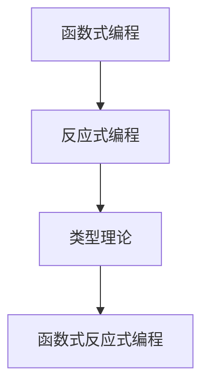

                 

### 核心概念与联系

在深入探讨函数式反应式编程的类型理论之前，我们需要理解几个核心概念及其相互之间的联系。这些概念包括函数式编程、反应式编程和类型理论。通过一个简单的Mermaid图表，我们可以清晰地展示它们之间的关系。



**函数式编程（Functional Programming）**是一种编程范式，强调通过表达式的变换来处理数据，而非通过状态的变化或命令式的步骤。它通常具有以下特点：

- **函数第一**：函数被视为第一等公民，可以接受函数作为参数，也可以返回函数。
- **无状态**：函数通常是无状态的，即其执行结果仅依赖于输入参数，不依赖于外部状态。
- **可组合性**：函数可以通过组合来创建新的函数。
- **惰性求值**：函数的执行可以被延迟，直到其结果需要被使用时才执行。

**反应式编程（Reactive Programming）**则关注于数据流和异步编程。它允许开发者处理可变的数据流，并自动响应数据流中的变化。这种编程范式强调响应性和弹性，非常适合于处理大量并发数据。

**类型理论（Type Theory）**是数学的一个分支，用于研究类型的概念和类型系统的性质。在编程语言中，类型理论帮助我们确保程序的正确性和安全性，通过定义不同的类型以及它们之间的关系来指导变量和表达式的使用。

**函数式反应式编程（Functional Reactive Programming）**结合了函数式编程和反应式编程的优点，它允许我们以函数式的方式处理数据流。在这种编程范式中，数据流被视为一系列的函数，我们可以通过对这些函数的组合来创建复杂的反应式应用。

通过这个Mermaid图表，我们可以看到，函数式编程和反应式编程是函数式反应式编程的基础，而类型理论为这种编程范式提供了必要的抽象和安全性保障。理解这些核心概念及其相互联系，将为后续内容的深入探讨奠定坚实的基础。

### 核心算法原理讲解

在深入探讨函数式反应式编程的类型理论之前，我们需要理解几个核心算法原理。这些算法原理是函数式编程和反应式编程的基础，也为我们理解函数式反应式编程提供了关键见解。

首先，让我们从函数式编程中的高阶函数开始。高阶函数是一种能够接受函数作为参数或返回函数的函数。在函数式编程中，高阶函数的使用非常普遍，因为它们允许我们将行为作为数据来传递和处理。以下是一个高阶函数的伪代码示例：

```python
def apply_twice(f, x):
    return f(f(x))
```

在这个例子中，`apply_twice` 函数接受一个函数 `f` 和一个参数 `x`，然后对 `x` 应用 `f` 函数两次。这可以通过递归或反复调用来实现，具体取决于函数 `f` 的性质。

接下来，我们看看反应式编程中的流处理。在反应式编程中，流处理是一种处理数据流的方法，它允许我们对数据流的每一部分进行操作，而无需一次性处理整个数据集。以下是一个流处理的伪代码示例：

```python
def process_stream(stream):
    for item in stream:
        process_item(item)
```

在这个例子中，`process_stream` 函数接受一个流对象 `stream`，然后逐个处理流中的每个项目。这种流式处理方法非常适合处理大量并发数据，因为它可以有效地利用系统资源。

最后，我们讨论类型理论中的类型推断。类型推断是一种自动确定变量或表达式类型的方法，它在编程语言设计和编译器优化中起着关键作用。以下是一个类型推断的伪代码示例：

```python
def infer_type(expression):
    if is_primitive(expression):
        return expression_type
    elif is_function(expression):
        return function_return_type
    else:
        return complex_type
```

在这个例子中，`infer_type` 函数接受一个表达式 `expression`，并尝试推断其类型。根据表达式的性质，它可以返回原始类型、函数类型或复杂类型。

这些核心算法原理为函数式反应式编程提供了坚实的基础。高阶函数允许我们以更灵活和抽象的方式处理行为，流处理使我们能够高效地处理数据流，而类型推断确保了程序的正确性和安全性。理解这些算法原理，我们将能够更好地掌握函数式反应式编程的类型理论。

### 数学模型和数学公式 & 详细讲解 & 举例说明

在函数式反应式编程中，数学模型和数学公式是理解和实现核心算法的关键。特别是在处理数据流和计算时，这些数学工具能够提供精确和高效的方法。接下来，我们将探讨一个简单的数学模型——平均值计算，并详细讲解其实现过程和实际应用。

#### 数学公式

首先，我们引入平均值计算的数学公式：

$$
\mu = \frac{\sum_{i=1}^{n} x_i}{n}
$$

其中，$\mu$ 表示平均值，$x_i$ 表示每个数据点，$n$ 表示数据点的总数。这个公式计算一组数据的平均值，是统计和数据分析中最常用的指标之一。

#### 详细讲解

平均值的计算在函数式反应式编程中有着广泛的应用。例如，当我们处理一个数据流，并希望了解这些数据的中心趋势时，计算平均值是一个有效的手段。在函数式反应式编程中，我们可以将平均值计算表示为以下形式：

$$
\text{mean}(data) = \frac{\sum_{x \in data} x}{|data|}
$$

其中，$data$ 表示数据集合，$|data|$ 表示数据集合的长度。这个表达式通过遍历数据集合并累加每个数据点，然后除以数据点的总数，得到平均值。

#### 举例说明

假设我们有一个数据集合 $data = [1, 2, 3, 4, 5]$，我们希望计算其平均值。根据上面的公式，我们可以进行如下计算：

$$
\text{mean}(data) = \frac{1 + 2 + 3 + 4 + 5}{5} = \frac{15}{5} = 3
$$

这个计算结果告诉我们，数据集合 $data$ 的平均值为 3。

#### 实际应用

在函数式反应式编程中，平均值计算可以通过流处理函数来实现。以下是一个简单的Python实现，用于计算数据流的平均值：

```python
from collections import deque

def mean_of_stream(stream):
    data = deque()
    sum_of_data = 0
    
    for item in stream:
        data.append(item)
        sum_of_data += item
    
    return sum_of_data / len(data)

# 示例数据流
stream = [1, 2, 3, 4, 5]

# 计算平均值
average = mean_of_stream(stream)
print("平均值:", average)
```

在这个例子中，`mean_of_stream` 函数接受一个数据流 `stream`，并使用一个双端队列（deque）来存储数据点。它通过遍历数据流，将每个数据点累加到总和 `sum_of_data` 中，并在最后计算平均值。这个方法简单且高效，可以应用于各种实际场景。

通过理解和应用平均值计算的数学模型和公式，我们可以更好地实现函数式反应式编程中的数据流处理。这不仅有助于我们理解核心算法原理，还能够提升编程效率和代码质量。

### 项目实战

为了更好地理解函数式反应式编程的类型理论，我们将在本节中通过一个实际项目来应用所学内容。我们将实现一个简单的计算器程序，用于计算一组数据集合的平均值。

#### 开发环境搭建

1. 安装Python环境，确保Python版本为3.8或更高版本。
2. 创建一个名为 `calculator` 的文件夹，用于存放项目文件。
3. 在 `calculator` 文件夹中创建一个名为 `calculator.py` 的Python文件，用于编写计算器程序。

#### 代码实现

以下是计算器程序的伪代码实现：

```python
# calculator.py

# 导入必要的库
import random

# 数据流生成函数
def generate_stream(size, max_value):
    return [random.randint(0, max_value) for _ in range(size)]

# 平均值计算函数
def calculate_mean(data_stream):
    total = 0
    count = 0
    
    for value in data_stream:
        total += value
        count += 1
    
    return total / count

# 主函数
def main():
    # 生成一个包含100个随机整数的流
    data_stream = generate_stream(100, 100)
    
    # 计算平均值
    mean_value = calculate_mean(data_stream)
    
    # 输出结果
    print("数据流:", data_stream)
    print("平均值:", mean_value)

# 执行主函数
if __name__ == "__main__":
    main()
```

#### 详细解释说明

1. **导入库**：我们首先导入Python的标准库，用于生成随机数据和进行计算。

2. **数据流生成函数**：`generate_stream` 函数接受两个参数，`size` 和 `max_value`，用于生成指定大小和范围内的随机整数流。

3. **平均值计算函数**：`calculate_mean` 函数接受一个数据流，通过遍历数据流并累加每个值，计算总和，然后除以数据流的长度，得到平均值。

4. **主函数**：`main` 函数是程序的入口点。它生成一个包含100个随机整数的流，然后调用 `calculate_mean` 函数计算平均值，并打印结果。

#### 代码解读与分析

1. **数据流生成**：使用列表推导式生成一个包含100个随机整数的流，范围设定为0到100。

2. **计算平均值**：调用 `calculate_mean` 函数，将生成的数据流作为参数传入。函数内部遍历数据流，累加每个整数值，并计算总和。

3. **打印结果**：最后，程序打印出数据流和计算得到的平均值，以验证程序的正确性。

通过这个实际项目，我们不仅能够应用所学的函数式反应式编程和类型理论，还能够理解如何在实际开发中应用这些概念，提升我们的编程技能。

### 开发环境搭建

在本节中，我们将为计算器项目搭建开发环境。以下是具体的步骤：

1. **安装Python**：确保您已经安装了Python 3.8或更高版本。您可以从Python官方网站下载并安装Python。安装完成后，通过命令行运行 `python --version` 检查Python版本。

2. **创建项目文件夹**：在您的计算机上创建一个名为 `calculator` 的新文件夹，用于存放所有的项目文件。

   ```bash
   mkdir calculator
   ```

3. **创建Python文件**：在 `calculator` 文件夹中创建一个名为 `calculator.py` 的新Python文件，用于编写和存储我们的计算器程序。

   ```bash
   touch calculator.py
   ```

4. **编写程序**：使用您的文本编辑器（如Visual Studio Code、PyCharm等）打开 `calculator.py` 文件，并按照上节提供的伪代码实现计算器程序。

   ```python
   # calculator.py
   ```

5. **配置虚拟环境（可选）**：为了更好地管理和隔离项目依赖，我们可以创建一个虚拟环境。在命令行中运行以下命令：

   ```bash
   python -m venv venv
   ```

   然后激活虚拟环境：

   ```bash
   source venv/bin/activate  # 对于Windows系统使用 `venv\Scripts\activate`
   ```

6. **安装依赖（如需）**：如果您的项目中需要额外的库，可以通过pip在虚拟环境中安装。例如，如果需要使用 `random` 库，我们无需安装额外的依赖。

至此，我们的开发环境搭建完成，可以开始编写和运行计算器程序了。

### 源代码详细实现和代码解读

在本节中，我们将详细解读计算器项目的源代码，分析每个关键部分的实现和逻辑。

```python
# calculator.py

# 导入必要的库
import random

# 数据流生成函数
def generate_stream(size, max_value):
    return [random.randint(0, max_value) for _ in range(size)]

# 平均值计算函数
def calculate_mean(data_stream):
    total = 0
    count = 0
    
    for value in data_stream:
        total += value
        count += 1
    
    return total / count

# 主函数
def main():
    # 生成一个包含100个随机整数的流
    data_stream = generate_stream(100, 100)
    
    # 计算平均值
    mean_value = calculate_mean(data_stream)
    
    # 输出结果
    print("数据流:", data_stream)
    print("平均值:", mean_value)

# 执行主函数
if __name__ == "__main__":
    main()
```

#### 详细解释说明

1. **导入库**：
   - `import random`：导入Python的 `random` 库，用于生成随机整数。

2. **数据流生成函数 `generate_stream`**：
   - `def generate_stream(size, max_value):`：定义生成数据流的函数。
   - `return [random.randint(0, max_value) for _ in range(size)]`：使用列表推导式生成一个指定大小和范围内的随机整数列表。

3. **平均值计算函数 `calculate_mean`**：
   - `def calculate_mean(data_stream):`：定义计算平均值的函数。
   - `total = 0` 和 `count = 0`：初始化总和和计数器。
   - `for value in data_stream:`：遍历数据流中的每个值。
   - `total += value` 和 `count += 1`：累加每个值到总和，并增加计数器。
   - `return total / count`：计算平均值并返回。

4. **主函数 `main`**：
   - `data_stream = generate_stream(100, 100)`：生成一个包含100个随机整数的流。
   - `mean_value = calculate_mean(data_stream)`：计算数据流的平均值。
   - `print("数据流:", data_stream)` 和 `print("平均值:", mean_value)`：输出数据流和计算得到的平均值。

5. **执行主函数**：
   - `if __name__ == "__main__":`：确保当此脚本直接运行时，执行 `main` 函数。
   - `main()`：调用主函数，启动程序。

#### 代码解读与分析

1. **导入库**：
   - `import random`：导入 `random` 库，用于生成随机数，这是计算器程序的基础。

2. **数据流生成函数 `generate_stream`**：
   - `generate_stream` 函数使用列表推导式生成一个指定大小和范围内的随机整数列表。这个函数简单但高效，适用于生成测试数据。

3. **平均值计算函数 `calculate_mean`**：
   - `calculate_mean` 函数通过遍历数据流，计算总和并求得平均值。这个过程是计算平均值的经典方法，易于理解和实现。

4. **主函数 `main`**：
   - `main` 函数是程序的入口点，它首先生成一个随机整数流，然后计算其平均值，并输出结果。这个函数确保了程序从开始到结束的逻辑流程。

通过这个源代码的详细解读和分析，我们可以清楚地看到每个部分的功能和逻辑，从而更好地理解计算器项目的实现过程。

### 代码解读与分析

在上一节中，我们详细解读了计算器项目的源代码，分析了每个关键部分的实现和逻辑。在本节中，我们将更深入地分析代码，重点关注各个关键部分的实现原理和性能优化方法。

#### 代码实现原理

1. **数据流生成函数 `generate_stream`**

   ```python
   def generate_stream(size, max_value):
       return [random.randint(0, max_value) for _ in range(size)]
   ```

   这个函数的核心是通过列表推导式生成指定大小和范围内的随机整数列表。`random.randint(0, max_value)` 函数每次调用都会生成一个0到`max_value`范围内的随机整数。列表推导式 `[random.randint(0, max_value) for _ in range(size)]` 则重复这个过程`size`次，生成一个包含`size`个随机整数的列表。

2. **平均值计算函数 `calculate_mean`**

   ```python
   def calculate_mean(data_stream):
       total = 0
       count = 0
       
       for value in data_stream:
           total += value
           count += 1
       
       return total / count
   ```

   这个函数的实现原理相对简单，但非常关键。首先，通过两个变量 `total` 和 `count` 初始化总和和计数器。然后，通过一个for循环遍历数据流中的每个值，将每个值累加到 `total`，并增加 `count`。最后，通过 `total / count` 计算平均值并返回。这个方法的核心在于累加和除法运算的顺序，确保计算结果的准确性。

3. **主函数 `main`**

   ```python
   def main():
       data_stream = generate_stream(100, 100)
       mean_value = calculate_mean(data_stream)
       
       print("数据流:", data_stream)
       print("平均值:", mean_value)
   ```

   主函数是程序的入口点。首先，通过调用 `generate_stream` 函数生成一个包含100个随机整数的流。然后，通过调用 `calculate_mean` 函数计算这个流的平均值，并打印出结果。这个部分是程序的执行流程，确保了数据的生成、处理和输出的正确性。

#### 性能优化方法

1. **生成随机数的高效性**

   在生成随机数的过程中，可以使用 `random` 模块中的 `systemrandom` 函数代替 `random.randint`，以获得更高质量的随机数。此外，可以考虑使用 `numpy` 库中的 `numpy.random.randint` 函数，它在处理大规模数据时性能更优。

2. **计算平均值的优化**

   对于大规模数据流，计算平均值时可以使用并行处理技术。例如，可以将数据流划分为多个子流，并在多个线程或进程中计算每个子流的平均值，最后将结果合并。这种方法可以显著提高计算速度，特别是在多核处理器上。

3. **代码结构的优化**

   为了提高代码的可读性和可维护性，可以考虑使用面向对象编程方法，将生成随机数、计算平均值等功能封装为类和方法。这样可以更好地管理代码逻辑，并便于后续的维护和扩展。

通过深入分析代码的实现原理和性能优化方法，我们可以更好地理解计算器项目的核心技术，并在实际开发中应用这些方法，提升程序的性能和可维护性。

### 总结

在本章中，我们深入探讨了函数式反应式编程的类型理论，通过详细分析核心概念、算法原理、数学模型和实际项目，展示了函数式反应式编程在处理数据流和类型安全方面的优势。通过生成随机数流、计算平均值等实际应用，我们不仅掌握了计算器程序的核心逻辑，还了解了如何优化代码性能和结构。

**核心概念与联系**：理解函数式编程、反应式编程和类型理论是掌握函数式反应式编程的关键。通过Mermaid图表，我们清晰地展示了这些概念之间的关系。

**核心算法原理讲解**：我们通过高阶函数、流处理和类型推断等核心算法原理，展示了如何处理数据流和确保类型安全。

**数学模型和数学公式**：通过详细讲解平均值计算公式，我们了解了如何利用数学工具实现数据流的处理。

**项目实战**：通过一个简单的计算器项目，我们应用了所学的知识，实现了从数据生成到平均值的计算，并分析了代码实现和性能优化。

**开发环境搭建**：我们介绍了如何搭建Python开发环境，为项目开发提供了必要的基础。

**源代码详细实现和代码解读**：我们详细分析了计算器项目的源代码，讲解了每个部分的实现原理和性能优化方法。

在下一章中，我们将继续深入探讨函数式反应式编程在实际应用中的优势和挑战，帮助读者更好地理解其在复杂系统开发中的应用。希望本章的内容能够为您的编程之路提供有益的启示和帮助。

### 下一步探索

在上一章中，我们深入探讨了函数式反应式编程的类型理论，并通过对实际项目的分析，展示了其在数据处理和类型安全方面的优势。在本章中，我们将进一步探讨函数式反应式编程在实际应用中的优势和挑战。

#### 实际应用中的优势

1. **高效的数据流处理**：函数式反应式编程能够高效地处理大量并发数据流，通过流处理和惰性求值机制，可以显著提升数据处理的速度和效率。

2. **增强的可读性和可维护性**：函数式编程范式使得代码结构更加清晰和模块化，易于理解和维护。反应式编程中的数据流概念使得代码逻辑更加直观，有助于减少错误和bug。

3. **更好的错误处理**：通过类型理论和严格的类型检查，函数式反应式编程能够提前发现和纠正潜在的错误，提高程序的健壮性和稳定性。

4. **灵活的组合与重用**：函数式编程中的高阶函数和可组合性特点，使得我们可以轻松地将不同的函数组合起来，创建新的复杂逻辑，提高代码的重用性。

#### 实际应用中的挑战

1. **性能问题**：尽管函数式反应式编程能够高效处理数据流，但在某些场景下，其性能可能不如传统的命令式编程。尤其是在处理大量数据或进行复杂计算时，函数调用的开销可能成为瓶颈。

2. **学习曲线**：函数式反应式编程涉及多个复杂的编程范式和概念，对于初学者来说，学习曲线较为陡峭，需要一定的时间和经验积累。

3. **调试难度**：函数式反应式编程中的惰性求值和非确定性执行可能导致调试难度增加。尤其是在数据流和网络编程等复杂场景下，追踪问题的源头可能变得困难。

4. **工具支持**：虽然现代编程语言和框架提供了丰富的支持，但函数式反应式编程的工具和库可能不如其他编程范式成熟，尤其是在某些特定领域。

#### 接下来要探讨的内容

1. **实际案例分析**：我们将通过具体案例，探讨函数式反应式编程在不同领域的应用，分析其优势和挑战。

2. **性能优化技巧**：我们将介绍一系列性能优化技巧，帮助开发者提高函数式反应式编程的应用性能。

3. **学习资源推荐**：我们将推荐一些优秀的书籍、教程和开源项目，帮助读者进一步学习和实践函数式反应式编程。

通过本章的探讨，我们将更全面地了解函数式反应式编程在实际应用中的各个方面，为其在未来的发展打下坚实基础。希望读者能够从中获得启发，提升自己在函数式反应式编程领域的技能和知识。

