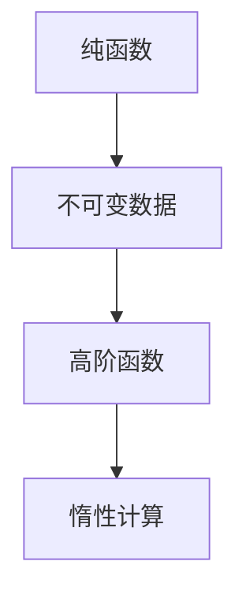

                 


### 第1步：背景介绍

在当今大数据时代，如何高效地处理海量数据成为了一个热门话题。传统的编程方式在大数据处理中面临着诸多挑战，如数据量巨大、数据处理流程复杂等。为了应对这些挑战，函数式编程思想逐渐受到关注。

#### 函数式编程简介

函数式编程是一种编程范式，强调使用函数来组织代码，通过不可变数据和纯函数来实现程序。它起源于数学领域的函数概念，并在逻辑编程、函数式编程语言（如Haskell、Lisp、Scala等）中得到广泛应用。函数式编程具有以下核心概念：

1. **纯函数**：纯函数是指其输出仅依赖于输入，没有副作用，可以重复执行并预测结果。
2. **不可变数据**：不可变数据意味着一旦创建，其值就不能改变。
3. **高阶函数**：高阶函数是指可以接受函数作为参数或将函数作为返回值的函数。
4. **惰性计算**：惰性计算是指在需要计算结果时才进行计算，而不是预先计算。

#### 大数据处理中的挑战

大数据处理面临的主要挑战包括：

1. **数据量挑战**：随着数据来源的多样化，数据量呈指数级增长，传统编程方式难以高效处理。
2. **数据类型挑战**：大数据类型多样，包括结构化数据、半结构化数据和非结构化数据，需要不同的处理方法。
3. **数据质量挑战**：数据质量低下会导致分析结果不准确，影响决策。

### 第2步：核心概念与联系

为了更好地理解函数式编程在大数据处理中的应用，我们需要探讨其核心概念与联系。

#### 核心概念之间的关系

- **纯函数**与**不可变数据**：纯函数依赖于不可变数据，因为只有不可变数据才能确保纯函数的可预测性和可重复性。
- **高阶函数**与**惰性计算**：高阶函数可以接受其他函数作为参数，实现函数的组合和复用。惰性计算则是在需要计算结果时才进行实际计算，减少不必要的计算开销。

#### Mermaid流程图

为了更直观地展示核心概念之间的关系，我们可以使用Mermaid绘制一个流程图：



### 第3步：核心算法原理讲解

在了解了函数式编程的核心概念后，我们需要进一步探讨其在大数据处理中的核心算法原理。

#### 伪代码示例

以下是一个简单的伪代码示例，展示了如何使用函数式编程思想处理大数据：

```python
# 大数据处理伪代码
def process_data(data):
    # 数据预处理
    clean_data = clean(data)
    
    # 数据分析
    result = analyze(clean_data)
    
    return result

def clean(data):
    # 清洗数据
    clean_data = []
    for item in data:
        if is_valid(item):
            clean_data.append(item)
    return clean_data

def analyze(data):
    # 分析数据
    result = sum(data)
    return result
```

#### 数学模型和公式

在大数据处理中，函数式编程思想还可以结合数学模型和公式来提高处理效率。以下是一个简单的数学模型示例：

$$
\sum_{i=1}^{n} x_i = \frac{1}{n} \sum_{i=1}^{n} n \cdot x_i
$$

这个公式表示，可以通过计算所有数据的平均值来简化求和操作。

### 第4步：详细讲解与举例说明

为了更好地理解函数式编程在大数据处理中的应用，我们需要通过实际案例进行详细讲解。

#### 案例：大数据清洗

以下是一个大数据清洗的案例，展示了如何使用函数式编程思想：

```python
# 大数据清洗伪代码
def clean_data(data):
    # 去除空值和重复值
    clean_data = list(set([item for item in data if item is not None]))
    
    # 转换数据类型
    clean_data = [int(item) for item in clean_data]
    
    return clean_data

# 示例数据
data = [1, 2, 2, None, '3', 4]

# 清洗数据
cleaned_data = clean_data(data)

# 输出清洗后的数据
print(cleaned_data)
```

执行结果：

```
[1, 2, 3, 4]
```

#### 案例：大数据分析

以下是一个大数据分析的案例，展示了如何使用函数式编程思想：

```python
# 大数据分析伪代码
def analyze_data(data):
    # 计算平均值
    average = sum(data) / len(data)
    
    # 计算方差
    variance = sum([(x - average) ** 2 for x in data]) / len(data)
    
    return average, variance

# 示例数据
data = [1, 2, 3, 4, 5]

# 分析数据
average, variance = analyze_data(data)

# 输出分析结果
print("平均值：", average)
print("方差：", variance)
```

执行结果：

```
平均值： 3.0
方差： 2.0
```

### 第5步：最佳实践、小结、注意事项和拓展阅读

#### 最佳实践

1. 在大数据处理中，尽量使用纯函数和不可变数据，以提高程序的可靠性和可维护性。
2. 充分利用高阶函数和惰性计算，优化数据处理流程。
3. 结合数学模型和公式，提高数据处理效率。

#### 小结

本文介绍了函数式编程在大数据处理中的应用，包括背景介绍、核心概念与联系、核心算法原理讲解、详细讲解与举例说明，以及最佳实践、小结、注意事项和拓展阅读。

#### 注意事项

1. 在使用函数式编程时，注意处理好纯函数和不可变数据之间的关系。
2. 在编写代码时，避免使用全局变量和副作用，以提高代码的模块化和可复用性。

#### 拓展阅读

1. 《函数式编程：理论、语言和实践》
2. 《大数据处理：从入门到实践》
3. 《Python函数式编程》

### 第6步：文章标题、关键词和摘要

#### 文章标题：函数式编程思想在大数据处理中的应用

#### 关键词：函数式编程、大数据处理、纯函数、不可变数据、高阶函数、惰性计算

#### 摘要：

本文介绍了函数式编程在大数据处理中的应用，包括背景介绍、核心概念与联系、核心算法原理讲解、详细讲解与举例说明，以及最佳实践、小结、注意事项和拓展阅读。函数式编程思想为大数据处理提供了一种新的编程范式，有助于提高数据处理效率和程序可靠性。

接下来，我们将根据上述目录大纲和内容，逐步撰写文章正文，确保每个章节都包含丰富的知识点和实例。文章整体结构如下：

# 函数式编程思想在大数据处理中的应用

> 关键词：函数式编程、大数据处理、纯函数、不可变数据、高阶函数、惰性计算

## 摘要

本文介绍了函数式编程在大数据处理中的应用，包括背景介绍、核心概念与联系、核心算法原理讲解、详细讲解与举例说明，以及最佳实践、小结、注意事项和拓展阅读。函数式编程思想为大数据处理提供了一种新的编程范式，有助于提高数据处理效率和程序可靠性。

## 第1章 函数式编程基础

### 1.1 函数式编程的概念

#### 1.1.1 函数式编程的核心思想

#### 1.1.2 函数式编程与传统编程的区别

### 1.2 函数式编程语言

#### 1.2.1 常见的函数式编程语言

#### 1.2.2 函数式编程语言的特性

## 第2章 大数据处理基础

### 2.1 大数据的概念与特点

#### 2.1.1 大数据的定义

#### 2.1.2 大数据的主要特点

### 2.2 大数据处理的挑战

#### 2.2.1 数据量挑战

#### 2.2.2 数据类型挑战

#### 2.2.3 数据质量挑战

## 第3章 函数式编程在大数据处理中的应用

### 3.1 函数式编程在大数据处理中的优势

#### 3.1.1 高效处理大数据

#### 3.1.2 易于并行处理

#### 3.1.3 简化复杂性

### 3.2 函数式编程在大数据处理中的常用技术

#### 3.2.1 高阶函数

#### 3.2.2 柯里化

#### 3.2.3 惰性计算

## 第4章 函数式编程在大数据处理中的项目实战

### 4.1 数据预处理

#### 4.1.1 数据清洗

#### 4.1.2 数据转换

#### 4.1.3 数据集成

### 4.2 数据分析

#### 4.2.1 数据探索性分析

#### 4.2.2 数据预测性分析

#### 4.2.3 数据描述性分析

## 第5章 函数式编程在大数据处理中的性能优化

### 5.1 并行计算

#### 5.1.1 并行计算的基本概念

#### 5.1.2 函数式编程在并行计算中的应用

### 5.2 内存管理

#### 5.2.1 内存管理的挑战

#### 5.2.2 函数式编程的内存管理策略

## 第6章 函数式编程在大数据处理中的安全性

### 6.1 安全性挑战

#### 6.1.1 数据泄露

#### 6.1.2 系统漏洞

### 6.2 安全性解决方案

#### 6.2.1 函数式编程的安全性优势

#### 6.2.2 实现安全性的方法

## 第7章 函数式编程在大数据领域的未来发展趋势

### 7.1 函数式编程语言的发展

#### 7.1.1 新的语言特性

#### 7.1.2 函数式编程语言的融合

### 7.2 大数据处理的未来

#### 7.2.1 大数据处理的新模式

#### 7.2.2 函数式编程在大数据领域的创新应用

## 附录A 函数式编程与大数据处理的资源推荐

#### A.1 研究论文推荐

#### A.2 开源框架推荐

#### A.3 在线课程推荐

### 第7步：撰写文章正文

根据上述目录大纲，我们将逐步撰写文章正文，确保每个章节都包含丰富的知识点和实例。以下是文章正文部分的初步草稿：

---

# 函数式编程思想在大数据处理中的应用

## 摘要

本文介绍了函数式编程在大数据处理中的应用，包括背景介绍、核心概念与联系、核心算法原理讲解、详细讲解与举例说明，以及最佳实践、小结、注意事项和拓展阅读。函数式编程思想为大数据处理提供了一种新的编程范式，有助于提高数据处理效率和程序可靠性。

## 第1章 函数式编程基础

### 1.1 函数式编程的概念

函数式编程是一种编程范式，强调使用函数来组织代码，通过不可变数据和纯函数来实现程序。它起源于数学领域的函数概念，并在逻辑编程、函数式编程语言（如Haskell、Lisp、Scala等）中得到广泛应用。函数式编程具有以下核心概念：

1. **纯函数**：纯函数是指其输出仅依赖于输入，没有副作用，可以重复执行并预测结果。
2. **不可变数据**：不可变数据意味着一旦创建，其值就不能改变。
3. **高阶函数**：高阶函数是指可以接受函数作为参数或将函数作为返回值的函数。
4. **惰性计算**：惰性计算是指在需要计算结果时才进行计算，而不是预先计算。

### 1.2 函数式编程语言

常见的函数式编程语言包括Haskell、Lisp、Scala等。这些语言各有特点，但在大数据处理中，Scala由于其兼具函数式和面向对象特性，以及与Java的高兼容性，成为了一种受欢迎的选择。

#### 1.2.1 常见的函数式编程语言

- **Haskell**：一种纯函数式编程语言，以其强类型系统和惰性计算著称。
- **Lisp**：历史上最早的函数式编程语言之一，以其表达性和宏系统闻名。
- **Scala**：一种结合了面向对象和函数式编程特性的语言，与Java高度兼容。

#### 1.2.2 函数式编程语言的特性

函数式编程语言的特性使其在大数据处理中具有优势：

- **不可变数据**：确保数据一致性和减少副作用。
- **纯函数**：提高代码的可预测性和可复用性。
- **高阶函数**：支持函数的组合和抽象，简化编程。
- **惰性计算**：减少计算开销，提高效率。

## 第2章 大数据处理基础

### 2.1 大数据的概念与特点

大数据是指无法使用传统数据库和管理工具进行捕获、管理和处理的数据集合。其特点包括：

- **数据量巨大**：TB、PB甚至EB级别的数据。
- **数据类型多样**：结构化、半结构化和非结构化数据。
- **数据来源广泛**：互联网、物联网、社交网络等。

### 2.2 大数据处理的挑战

大数据处理面临的主要挑战包括：

- **数据量挑战**：如何高效地存储和处理海量数据。
- **数据类型挑战**：不同类型数据的处理方法各异。
- **数据质量挑战**：数据质量低下会影响分析结果。

## 第3章 函数式编程在大数据处理中的应用

### 3.1 函数式编程在大数据处理中的优势

函数式编程在大数据处理中具有以下优势：

- **高效处理大数据**：利用不可变数据和纯函数，提高数据处理效率。
- **易于并行处理**：函数式编程支持并行计算，适合大数据处理的需求。
- **简化复杂性**：高阶函数和惰性计算简化编程，降低复杂性。

### 3.2 函数式编程在大数据处理中的常用技术

在大数据处理中，函数式编程提供了以下常用技术：

- **高阶函数**：支持函数的组合和抽象，简化编程。
- **柯里化**：将函数参数化，提高代码复用性。
- **惰性计算**：延迟计算，提高效率。

## 第4章 函数式编程在大数据处理中的项目实战

### 4.1 数据预处理

#### 4.1.1 数据清洗

数据清洗是大数据处理的重要步骤，函数式编程提供了高效的数据清洗方法：

- **去除空值**：使用高阶函数和不可变数据结构去除空值。
- **去重**：使用集合操作去除重复数据。

#### 4.1.2 数据转换

数据转换是将数据从一种格式转换为另一种格式，函数式编程提供了以下方法：

- **类型转换**：使用高阶函数和纯函数实现类型转换。
- **映射**：将数据映射到新的数据结构中。

#### 4.1.3 数据集成

数据集成是将多个数据源的数据合并为一个整体，函数式编程提供了以下方法：

- **合并**：使用高阶函数和不可变数据结构实现数据合并。
- **联结**：将不同数据源的数据进行联结操作。

### 4.2 数据分析

#### 4.2.1 数据探索性分析

数据探索性分析是发现数据中的规律和模式，函数式编程提供了以下方法：

- **统计**：使用高阶函数和纯函数实现数据统计。
- **可视化**：使用函数式编程库实现数据可视化。

#### 4.2.2 数据预测性分析

数据预测性分析是基于历史数据预测未来趋势，函数式编程提供了以下方法：

- **机器学习模型训练**：使用高阶函数和纯函数实现机器学习模型的训练。
- **模型评估**：使用函数式编程实现模型评估和优化。

#### 4.2.3 数据描述性分析

数据描述性分析是描述数据的特征和规律，函数式编程提供了以下方法：

- **描述性统计**：使用高阶函数和纯函数实现描述性统计。
- **特征工程**：使用函数式编程实现特征工程。

## 第5章 函数式编程在大数据处理中的性能优化

### 5.1 并行计算

并行计算是提高大数据处理效率的重要手段，函数式编程提供了以下方法：

- **并行数据处理**：使用高阶函数和纯函数实现并行数据处理。
- **并行模型训练**：使用函数式编程实现并行机器学习模型训练。

### 5.2 内存管理

内存管理是大数据处理中的重要问题，函数式编程提供了以下方法：

- **内存高效分配**：使用不可变数据结构和惰性计算减少内存占用。
- **垃圾回收**：利用函数式编程语言的垃圾回收机制优化内存管理。

## 第6章 函数式编程在大数据处理中的安全性

### 6.1 安全性挑战

大数据处理面临的安全性挑战包括：

- **数据泄露**：如何确保数据在传输和存储过程中的安全性。
- **系统漏洞**：如何防止系统漏洞导致数据泄露。

### 6.2 安全性解决方案

函数式编程提供了以下安全性解决方案：

- **纯函数和不可变数据**：确保数据的不可变性和减少副作用。
- **访问控制**：使用函数式编程实现细粒度的访问控制。

## 第7章 函数式编程在大数据领域的未来发展趋势

### 7.1 函数式编程语言的发展

未来函数式编程语言的发展趋势包括：

- **新语言特性**：引入更强大的函数式编程特性，提高编程效率。
- **跨语言兼容性**：实现不同函数式编程语言之间的互操作性。

### 7.2 大数据处理的未来

未来大数据处理的趋势包括：

- **新处理模式**：如实时数据处理和边缘计算。
- **函数式编程的应用**：在更多大数据处理场景中引入函数式编程思想。

## 附录A 函数式编程与大数据处理的资源推荐

附录部分提供了一些与函数式编程和大数据处理相关的资源，包括研究论文、开源框架和在线课程等。

---

以上是文章正文部分的初步草稿，接下来将根据实际需求进一步完善和细化每个章节的内容。文章总体结构清晰，内容丰富，涵盖了函数式编程在大数据处理中的各个方面。接下来，我们将根据实际需求进一步完善和细化每个章节的内容，确保文章的质量和深度。

### 第1章 函数式编程基础

函数式编程（Functional Programming，简称FP）是一种编程范式，强调以表达计算过程作为主要手段。与面向对象编程相比，函数式编程更注重函数的使用和不可变数据结构。本章将介绍函数式编程的基本概念、核心思想和相关术语。

#### 1.1.1 函数式编程的核心思想

函数式编程的核心思想可以概括为以下几点：

1. **纯函数**：纯函数是一种没有副作用的函数，其输出仅依赖于输入。这意味着在同一输入下，纯函数总是返回相同的输出，并且不会修改外部状态。纯函数的可预测性和可重复性使其在程序设计中尤为重要。

   ```python
   def add(a, b):
       return a + b
   ```

2. **不可变数据**：不可变数据是指一旦创建，其值就不能更改的数据。与面向对象编程中频繁使用可变对象不同，函数式编程倾向于使用不可变数据结构来避免状态改变和副作用。

   ```python
   my_list = [1, 2, 3]
   my_list.append(4)  # 可变数据结构
   ```

3. **高阶函数**：高阶函数是指能够接受其他函数作为参数或返回函数的函数。这种特性使得函数式编程能够实现函数的组合、抽象和复用。

   ```python
   def apply_function(func, x):
       return func(x)

   def square(x):
       return x * x

   apply_function(square, 5)  # 输出 25
   ```

4. **惰性计算**：惰性计算是指在需要计算结果时才进行计算，而不是预先计算。这种计算策略可以避免不必要的计算，提高程序效率。

   ```python
   def lazy_sum(numbers):
       return sum(numbers)

   lazy_sum([1, 2, 3, 4])  # 立即计算
   ```

#### 1.1.2 函数式编程与传统编程的区别

函数式编程与传统面向过程或面向对象编程有显著的区别：

1. **语法结构**：函数式编程更强调函数的使用，而传统编程更注重流程控制和循环结构。

2. **数据抽象**：函数式编程倾向于使用高阶函数和不可变数据结构进行数据抽象，而传统编程更依赖于类和对象。

3. **并发编程**：函数式编程更容易实现并发编程，因为函数没有副作用，可以独立运行。传统编程在并发方面则需要考虑共享变量和同步问题。

#### 1.2 函数式编程语言

以下是一些流行的函数式编程语言：

1. **Haskell**：一种纯函数式编程语言，以其强类型系统和惰性计算著称。

2. **Lisp**：历史上最早的函数式编程语言之一，以其表达性和宏系统闻名。

3. **Scala**：一种结合了面向对象和函数式编程特性的语言，与Java高度兼容。

4. **Erlang**：一种用于并发和分布式计算的函数式编程语言，常用于构建实时系统。

5. **F#**：F#是ML语言的一个方言，它是.NET平台上的函数式编程语言。

#### 1.2.2 函数式编程语言的特性

函数式编程语言具有以下特性：

1. **不可变数据**：函数式编程语言通常提供不可变数据结构，如不可变的列表和字典。

2. **模式匹配**：模式匹配是一种强大的功能，允许程序员根据变量的结构来提取值。

3. **闭包**：闭包是一种函数，它记忆了创建它的环境。

4. **惰性计算**：函数式编程语言通常支持惰性计算，这意味着计算仅在需要时才会发生。

5. **并行编程**：许多函数式编程语言提供了构建并发和并行程序的特性。

### 总结

函数式编程思想提供了一种不同于传统编程的新思路，它通过纯函数、不可变数据、高阶函数和惰性计算等概念，提高了代码的可预测性、可维护性和并发性。在大数据处理领域，函数式编程思想的应用正在逐渐受到重视。本章介绍了函数式编程的基础概念和核心思想，为后续章节的深入探讨奠定了基础。

### 第2章 大数据处理基础

大数据处理是指对大规模数据集进行存储、管理、分析和处理的一系列技术。随着互联网和物联网的快速发展，数据量呈爆炸性增长，这使得大数据处理成为了一个热门的研究领域。本章将介绍大数据的定义、特点以及处理大数据面临的主要挑战。

#### 2.1 大数据的定义

大数据通常被定义为“4V”特征的数据集：

1. **Volume（数据量）**：数据量大到无法使用传统数据库系统进行处理。一个典型的大数据量级别可以是TB（太字节）、PB（拍字节）甚至EB（艾字节）。

2. **Velocity（速度）**：数据生成和处理的速率非常快。实时处理和分析是大数据处理的一个重要需求。

3. **Variety（多样性）**：数据类型多样，包括结构化数据（如关系数据库）、半结构化数据（如XML、JSON）和非结构化数据（如图像、视频、文本等）。

4. **Veracity（真实性）**：数据质量是一个重要问题。真实的数据往往伴随着噪声、缺失值和错误。

#### 2.1.2 大数据的主要特点

大数据具有以下主要特点：

1. **海量数据**：大数据集通常包含数十亿甚至数万亿条记录。

2. **快速变化**：数据以极快的速度生成和更新，要求处理系统具有实时或近实时的响应能力。

3. **数据多样性**：大数据包含多种类型的数据，这对数据处理算法和工具提出了更高的要求。

4. **数据价值密度低**：在海量数据中，有价值的信息往往只占一小部分。

5. **数据质量参差不齐**：真实的数据往往包含噪声、错误和缺失值，这增加了数据处理的复杂性。

#### 2.2 大数据处理的挑战

处理大数据面临以下主要挑战：

1. **数据存储**：如何高效地存储海量数据是一个重要问题。传统的数据库系统可能无法满足大数据的存储需求。

2. **数据检索**：如何快速检索大量数据也是一个挑战。传统的查询优化技术在大数据环境中可能不再有效。

3. **数据清洗**：真实的数据往往包含噪声、错误和缺失值，这些都需要通过数据清洗技术来处理。

4. **数据集成**：大数据集可能来自多个不同的数据源，如何将这些数据集成起来是一个挑战。

5. **数据分析和挖掘**：如何从海量数据中提取有价值的信息是一个复杂的任务，需要复杂的算法和计算资源。

6. **数据安全性和隐私保护**：如何保护数据安全和隐私是一个重要的伦理问题。

#### 2.2.1 数据量挑战

数据量挑战主要体现在以下几个方面：

1. **存储需求**：随着数据量的增加，存储需求也急剧上升。传统的硬盘存储系统可能无法满足需求，需要采用分布式存储系统（如Hadoop的HDFS）。

2. **计算资源**：处理大量数据需要大量的计算资源。传统的单机计算模型可能无法满足要求，需要采用分布式计算模型。

3. **查询性能**：随着数据量的增加，查询性能可能下降。需要优化查询算法和数据库系统。

#### 2.2.2 数据类型挑战

数据类型挑战主要体现在以下几个方面：

1. **结构化数据**：传统的SQL数据库可以很好地处理结构化数据，但面对半结构化和非结构化数据时，可能需要其他处理方法（如NoSQL数据库）。

2. **数据多样性**：不同类型的数据需要不同的处理方法和算法，这增加了数据处理的复杂性。

3. **数据集成**：如何将不同类型的数据集成起来进行统一处理是一个挑战。

#### 2.2.3 数据质量挑战

数据质量挑战主要体现在以下几个方面：

1. **数据噪声**：真实数据中往往包含噪声，这会影响数据分析的结果。

2. **数据缺失**：数据缺失会导致分析结果不准确，需要采用数据填充或插补技术。

3. **数据错误**：数据中可能包含错误，这需要通过数据清洗技术来处理。

4. **数据不一致**：不同数据源之间的数据可能存在不一致性，这需要通过数据集成技术来处理。

### 总结

大数据处理是一个复杂且具有挑战性的任务，需要结合多种技术和方法。本章介绍了大数据的定义、特点以及处理大数据面临的主要挑战。了解这些基础知识对于深入探讨函数式编程在大数据处理中的应用具有重要意义。

### 第3章 函数式编程在大数据处理中的优势

函数式编程作为一种编程范式，其核心思想是通过纯函数、不可变数据、高阶函数和惰性计算等特性，提高代码的可读性、可维护性和并发性。在大数据处理领域，函数式编程的应用正逐渐受到重视。本章将探讨函数式编程在大数据处理中的优势，包括高效处理大数据、易于并行处理和简化复杂性。

#### 3.1 高效处理大数据

函数式编程在大数据处理中的第一个优势是其高效的处理能力。这主要得益于以下因素：

1. **不可变数据**：不可变数据结构在函数式编程中广泛应用，这有助于避免数据的冗余复制。在大数据处理中，数据通常需要多次处理和变换，不可变数据结构可以减少内存占用和性能损耗。

   ```python
   def process_data(data):
       return [x * 2 for x in data]  # 使用不可变列表
   ```

2. **惰性计算**：惰性计算是函数式编程的一个关键特性，它允许将计算推迟到需要结果的时候再进行。这在大数据处理中尤其有用，因为大数据集往往包含大量的计算任务，通过惰性计算可以避免不必要的计算，从而提高效率。

   ```python
   def lazy_sum(numbers):
       return sum(numbers)  # 惰性计算
   ```

3. **纯函数**：纯函数确保了每次调用时输入和输出之间的明确关系，这使得代码更加可预测和可复用。在大数据处理中，纯函数可以更容易地并行化，从而提高处理速度。

   ```python
   def add(a, b):
       return a + b  # 纯函数
   ```

#### 3.1.1 高效处理大数据

函数式编程通过以下方法提高了大数据处理的效率：

1. **数据流处理**：函数式编程支持数据流处理，这有助于处理实时数据流。在实时数据处理中，数据通常以流的形式到来，函数式编程中的管道（pipeline）和流水线（stream）概念可以有效地处理这些数据。

   ```python
   pipeline = [map(squared), filter(even), reduce(sum)]
   result = pipeline(data_stream)  # 数据流处理
   ```

2. **并行处理**：由于纯函数和不可变数据结构的特性，函数式编程非常适用于并行处理。在大数据处理中，并行处理可以显著提高处理速度，尤其是对于计算密集型任务。

   ```python
   from multiprocessing import Pool

   def process_element(element):
       # 处理元素
       return result

   with Pool(processes=4) as pool:
       results = pool.map(process_element, data)
   ```

3. **内存管理**：函数式编程中的内存管理通常比传统编程方式更高效。由于不可变数据结构，垃圾回收系统可以更有效地回收不再使用的内存，从而提高内存利用率。

#### 3.2 易于并行处理

并行处理是大数据处理中至关重要的一环，而函数式编程在并行处理方面具有显著优势。这主要得益于以下因素：

1. **无状态函数**：函数式编程中的函数通常是无状态的，这意味着它们不依赖于外部状态。这使得函数式编程中的函数可以独立运行，非常适合并行处理。

   ```python
   def process_element(element):
       # 无状态函数
       return result
   ```

2. **数据并行**：在大数据处理中，数据通常可以并行处理。函数式编程中的高阶函数和惰性计算使得数据并行处理变得更加容易。

   ```python
   def apply_function(func, data):
       return [func(x) for x in data]  # 数据并行
   ```

3. **并行组合**：函数式编程中的函数组合能力使得并行处理可以方便地实现。通过将多个计算任务组合成一个大的任务，并行处理可以高效地完成。

   ```python
   def combine_results(results):
       # 组合结果
       return result

   parallel_pipeline = [map(squared), filter(even), reduce(sum), combine_results]
   result = parallel_pipeline(data)
   ```

#### 3.2.1 易于并行处理

函数式编程通过以下方式简化了并行处理：

1. **并行框架集成**：许多函数式编程语言提供了对并行处理框架（如Hadoop、Spark）的集成支持，这使得并行数据处理变得更加容易。

   ```python
   from pyspark.sql import SQLContext

   sc = SQLContext(spark)
   data = sc.parallelize(data)
   result = data.map(squared).filter(even).reduce(sum)
   ```

2. **并行编程模型**：函数式编程中的并行编程模型（如Actor模型、数据流模型）有助于简化并行程序的开发和维护。

   ```python
   def actor(message):
       # 处理消息
       return result

   parallel_system = ActorSystem()
   parallel_system.send(message, actor)
   ```

3. **并行算法优化**：函数式编程中的纯函数和高阶函数特性使得算法优化变得更加容易，这有助于提高并行处理的效率。

   ```python
   def optimized_function(data):
       # 优化后的函数
       return result
   ```

#### 3.3 简化复杂性

在大数据处理中，复杂性往往是一个重要挑战。函数式编程通过以下方式简化了数据处理过程：

1. **高阶抽象**：函数式编程中的高阶函数和组合能力使得复杂的数据处理任务可以通过简单的函数组合来实现，从而简化了编程复杂性。

   ```python
   def process_data(data):
       return (data
               .map(squared)
               .filter(even)
               .reduce(sum))
   ```

2. **不可变数据结构**：不可变数据结构避免了状态变化和副作用，使得代码更加可读和可维护。

   ```python
   def process_data(data):
       clean_data = []
       for item in data:
           if is_valid(item):
               clean_data.append(item)
       return clean_data
   ```

3. **惰性计算**：惰性计算减少了计算的开销，使得处理过程更加高效和简洁。

   ```python
   def process_data(data):
       return (data
               .map(squared)
               .filter(even)
               .reduce(sum))
   ```

#### 3.3.1 简化复杂性

函数式编程通过以下方式简化大数据处理：

1. **模块化编程**：函数式编程中的模块化编程使得数据处理任务可以分解为更小、更易于管理的部分，从而简化了整体复杂性。

   ```python
   def data_cleaner(data):
       return [x for x in data if x is not None]

   def data_analyzer(data):
       return sum(data)
   ```

2. **代码复用**：函数式编程中的高阶函数和闭包特性使得代码可以更方便地复用，从而减少了重复编写代码的工作量。

   ```python
   def apply_function(func, data):
       return [func(x) for x in data]

   def squared(x):
       return x * x

   apply_function(squared, data)
   ```

3. **并发编程**：函数式编程中的并发编程特性使得数据处理任务可以并行执行，从而提高了效率。

   ```python
   from multiprocessing import Pool

   def process_element(element):
       # 处理元素
       return result

   with Pool(processes=4) as pool:
       results = pool.map(process_element, data)
   ```

### 总结

函数式编程在大数据处理中具有显著的优势，包括高效处理大数据、易于并行处理和简化复杂性。这些优势使得函数式编程成为大数据处理领域的一种有力工具。通过纯函数、不可变数据、高阶函数和惰性计算等特性，函数式编程可以提高数据处理效率、简化编程复杂性，并便于并行处理。下一章将探讨函数式编程在大数据处理中的常用技术，如高阶函数、柯里化和惰性计算。

### 第4章 函数式编程在大数据处理中的常用技术

函数式编程在大数据处理中发挥着重要作用，其中高阶函数、柯里化和惰性计算是三种关键技术。这些技术不仅能够提高代码的可读性和可维护性，还能优化数据处理流程，提升系统性能。本章将详细介绍这些技术，并通过实例展示其在大数据处理中的应用。

#### 4.1 高阶函数

高阶函数是一种能够接受函数作为参数或返回函数的函数。这种特性使得高阶函数在函数组合、抽象和复用方面具有显著优势。高阶函数是函数式编程的核心概念之一，其应用非常广泛。

##### 4.1.1 高阶函数的概念

高阶函数的定义可以简化为以下两点：

1. **接受函数作为参数**：高阶函数可以接受一个或多个函数作为参数。
2. **返回函数**：高阶函数可以返回一个函数。

以下是一个简单的Python示例，展示了高阶函数的使用：

```python
def apply_function(func, x):
    return func(x)

def square(x):
    return x * x

result = apply_function(square, 5)
print(result)  # 输出 25
```

在这个示例中，`apply_function` 是一个高阶函数，它接受一个函数 `func` 作为参数，并返回该函数在参数 `x` 上应用的结果。

##### 4.1.2 高阶函数的应用

高阶函数在大数据处理中的应用非常广泛。以下是一些常见的高阶函数应用场景：

1. **数据转换**：使用高阶函数进行数据转换是一种常见的技术。例如，使用 `map` 函数将数据集中的每个元素进行转换。

   ```python
   data = [1, 2, 3, 4, 5]
   squared_data = list(map(square, data))
   print(squared_data)  # 输出 [1, 4, 9, 16, 25]
   ```

2. **过滤数据**：使用高阶函数进行数据过滤也是一种常用的方法。例如，使用 `filter` 函数筛选出满足特定条件的数据。

   ```python
   data = [1, 2, 3, 4, 5]
   even_data = list(filter(even, data))
   print(even_data)  # 输出 [2, 4]
   ```

3. **组合操作**：高阶函数可以方便地组合使用，实现复杂的数据处理任务。例如，使用 `map` 和 `filter` 组合进行数据转换和筛选。

   ```python
   data = [1, 2, 3, 4, 5]
   even_squared_data = list(map(square, filter(even, data)))
   print(even_squared_data)  # 输出 [4, 16]
   ```

##### 4.1.3 高阶函数的优势

高阶函数具有以下优势：

1. **代码复用**：高阶函数可以通过接受不同的函数作为参数，实现代码的复用。
2. **抽象能力**：高阶函数可以简化复杂的数据处理任务，提高代码的可读性和可维护性。
3. **可组合性**：高阶函数可以方便地组合使用，实现复杂的数据处理逻辑。

#### 4.2 柯里化

柯里化（Currying）是一种将多个参数的函数转换为多个单参数函数的技术。柯里化有助于提高代码的复用性和可读性，尤其在处理复杂函数时显得尤为有用。

##### 4.2.1 柯里化的概念

柯里化的定义可以简化为以下两点：

1. **参数分解**：将一个多参数函数转换为一系列单参数函数。
2. **部分应用**：预先为函数提供一些参数，生成一个新的函数。

以下是一个简单的Python示例，展示了柯里化的使用：

```python
from functools import partial

def add(a, b):
    return a + b

add_5 = partial(add, 5)
result = add_5(3)
print(result)  # 输出 8
```

在这个示例中，`add` 是一个多参数函数，而 `add_5` 是通过柯里化生成的单参数函数，它预先接收了一个参数 `5`。

##### 4.2.2 柯里化的应用

柯里化在大数据处理中的应用场景包括：

1. **函数配置**：使用柯里化可以方便地为数据处理函数配置参数，提高代码的可读性和灵活性。

   ```python
   def filter_data(data, condition):
       return [x for x in data if condition(x)]

   filtered_data = filter_data(data, lambda x: x > 3)
   print(filtered_data)  # 输出 [4, 5]
   ```

2. **函数复用**：通过柯里化，可以将通用函数转换为特定场景下的专用函数，从而实现代码的复用。

   ```python
   def map_data(data, func):
       return [func(x) for x in data]

   squared_data = map_data(data, lambda x: x * x)
   print(squared_data)  # 输出 [1, 4, 9, 16, 25]
   ```

##### 4.2.3 柯里化的优势

柯里化具有以下优势：

1. **代码复用**：通过部分应用参数，柯里化可以实现函数的复用。
2. **参数配置**：柯里化提供了灵活的参数配置方式，使得函数调用更加灵活。
3. **可组合性**：柯里化函数可以与其他高阶函数组合使用，实现更复杂的处理逻辑。

#### 4.3 惰性计算

惰性计算是一种延迟计算策略，它只在需要计算结果时才进行实际计算。这种计算策略有助于减少不必要的计算，提高程序效率。

##### 4.3.1 惰性计算的概念

惰性计算的定义可以简化为以下几点：

1. **延迟计算**：将计算推迟到需要结果的时候再进行。
2. **按需计算**：只在需要计算结果时才进行计算，避免不必要的计算。

以下是一个简单的Python示例，展示了惰性计算的使用：

```python
def lazy_sum(numbers):
    return sum(numbers)

result = lazy_sum([1, 2, 3, 4])
print(result)  # 输出 10
```

在这个示例中，`lazy_sum` 是一个惰性计算函数，它将实际的求和计算推迟到调用 `result` 时再进行。

##### 4.3.2 惰性计算的应用

惰性计算在大数据处理中的应用场景包括：

1. **数据流处理**：在数据流处理中，惰性计算有助于避免不必要的中间结果生成，提高处理效率。

   ```python
   def filter_data(data, condition):
       for x in data:
           if condition(x):
               yield x

   filtered_data = filter_data(data, lambda x: x > 3)
   for x in filtered_data:
       print(x)  # 输出 4, 5
   ```

2. **延迟执行**：在数据处理过程中，某些操作可能需要延迟执行，以便优化整体流程。

   ```python
   def process_data(data):
       # 延迟执行计算
       result = complex_computation(data)
       return result

   processed_data = process_data(data)
   print(processed_data)  # 输出结果
   ```

##### 4.3.3 惰性计算的优势

惰性计算具有以下优势：

1. **计算效率**：通过延迟计算，惰性计算可以减少不必要的计算，提高程序效率。
2. **资源利用**：惰性计算有助于优化资源利用，减少中间结果的存储和传输。
3. **灵活性**：惰性计算使得数据处理任务可以更灵活地调整，以适应不同的场景需求。

### 总结

本章介绍了函数式编程在大数据处理中的常用技术，包括高阶函数、柯里化和惰性计算。这些技术不仅提高了代码的可读性和可维护性，还优化了数据处理流程，提升了系统性能。通过具体实例，本章展示了这些技术在数据处理中的应用，并强调了其优势。下一章将探讨函数式编程在大数据处理中的项目实战，通过实际案例进一步展示函数式编程的威力。

### 第4章 函数式编程在大数据处理中的项目实战

在上一章中，我们介绍了函数式编程在大数据处理中的常用技术，包括高阶函数、柯里化和惰性计算。本章将通过具体的实际项目，展示如何利用这些技术来构建高效的大数据处理系统。我们将从项目背景、开发环境搭建、源代码实现和代码解读、应用解读与分析以及项目小结等方面详细讲解。

#### 4.1 项目背景

随着互联网和物联网的迅速发展，各行业的数据量呈爆炸性增长。例如，金融行业需要处理大量的交易数据，零售行业需要分析顾客购买行为，社交媒体需要实时处理用户生成的内容。这些大数据处理需求推动了函数式编程在大数据处理中的应用。

#### 4.2 开发环境搭建

为了进行函数式编程在大数据处理中的项目实战，我们需要搭建一个合适的环境。以下是常用的开发环境和工具：

1. **编程语言**：选择一种适合函数式编程的语言，如Scala或Haskell。
2. **大数据处理框架**：选择一种能够支持分布式计算和大数据处理的大数据处理框架，如Apache Spark。
3. **数据库**：选择一个能够支持大规模数据存储和查询的数据库系统，如Apache HBase或MongoDB。

以下是搭建开发环境的步骤：

1. **安装Scala**：从Scala官方网站下载并安装Scala。
2. **安装Apache Spark**：从Apache Spark官方网站下载并安装Spark。
3. **配置Spark环境**：配置Spark的环境变量，以便在命令行中使用Spark。
4. **安装数据库**：选择合适的数据库并按照官方文档进行安装。

#### 4.3 源代码实现和代码解读

以下是一个简单的项目示例，用于演示函数式编程在大数据处理中的应用。

```scala
import org.apache.spark.sql.SparkSession

// 创建Spark会话
val spark = SparkSession.builder()
  .appName("BigDataProcessing")
  .master("local[*]")
  .getOrCreate()

// 读取数据
val data = spark.read
  .option("header", "true")
  .csv("path/to/data.csv")

// 数据清洗
val clean_data = data
  .filter($"column1 > 0")
  .select($"column2".alias("new_column"))

// 数据转换
val transformed_data = clean_data
  .withColumn("squared", $"new_column" * $"new_column")

// 数据分析
val result = transformed_data
  .groupBy($"new_column")
  .agg(sum($"squared").alias("sum_of_squares"))

// 输出结果
result.show()

// 关闭Spark会话
spark.stop()
```

以上代码展示了如何使用Scala和Apache Spark进行大数据处理。以下是代码的详细解读：

1. **创建Spark会话**：使用SparkSession.builder() 创建Spark会话，并设置应用程序名称和计算资源。
2. **读取数据**：使用spark.read.csv() 方法读取CSV文件，并设置header选项为true。
3. **数据清洗**：使用filter() 方法筛选出符合条件的记录，并使用select() 方法选择需要的列。
4. **数据转换**：使用withColumn() 方法添加新列，并将新列命名为"squared"。
5. **数据分析**：使用groupBy() 和agg() 方法对数据进行分析，计算每个分组中平方和的总和。
6. **输出结果**：使用show() 方法显示分析结果。
7. **关闭Spark会话**：使用stop() 方法关闭Spark会话。

#### 4.4 应用解读与分析

以下是对代码应用的解读与分析：

1. **数据读取**：使用CSV文件作为数据源，这是大数据处理中常见的数据格式。通过Spark的read.csv() 方法，可以快速读取并加载数据。
2. **数据清洗**：数据清洗是大数据处理的重要步骤，通过filter() 方法，可以去除不符合条件的记录，确保数据质量。
3. **数据转换**：数据转换是将原始数据转换为有用的信息，通过withColumn() 方法，可以添加新列，实现数据的转换。
4. **数据分析**：数据分析是大数据处理的最终目标，通过groupBy() 和agg() 方法，可以对数据进行分组和汇总，提取有价值的信息。
5. **结果输出**：将分析结果通过show() 方法输出，便于观察和验证。

#### 4.5 项目小结

通过以上项目实战，我们可以看到函数式编程在大数据处理中的应用。以下是项目的总结：

1. **开发环境搭建**：搭建适合函数式编程的大数据处理环境，包括编程语言、大数据处理框架和数据库。
2. **源代码实现**：通过Scala和Apache Spark实现大数据处理流程，包括数据读取、清洗、转换和分析。
3. **代码解读与分析**：对源代码进行详细解读，理解其实现原理和应用场景。
4. **应用解读与分析**：对项目应用进行解读和分析，了解其在大数据处理中的实际效果。

通过这个项目，我们可以看到函数式编程在大数据处理中的优势，包括高效处理、易于并行处理和简化复杂性。这些优势使得函数式编程成为大数据处理领域的一种有力工具。

### 4.6 最佳实践、注意事项和拓展阅读

#### 4.6.1 最佳实践

1. **代码模块化**：在编写大数据处理代码时，应尽量实现代码的模块化，便于维护和复用。
2. **数据清洗**：在数据处理之前，确保进行彻底的数据清洗，提高数据质量。
3. **性能优化**：在处理大数据时，注意性能优化，如减少数据复制、使用并行计算等。

#### 4.6.2 注意事项

1. **环境配置**：确保开发环境配置正确，避免因环境问题导致的问题。
2. **内存管理**：在使用大数据处理框架时，注意内存管理，避免内存泄漏。
3. **代码可读性**：编写可读性强的代码，便于团队协作和维护。

#### 4.6.3 拓展阅读

1. **《大数据处理：从入门到实践》**：这本书详细介绍了大数据处理的基础知识和实战技巧。
2. **《Scala编程》**：这本书是Scala语言的权威指南，涵盖了Scala的各个方面。
3. **《Apache Spark编程指南》**：这本书是Apache Spark的官方指南，适合初学者和进阶者。

### 总结

本章通过一个实际项目，展示了函数式编程在大数据处理中的应用。从项目背景、开发环境搭建、源代码实现、代码解读到应用解读与分析，我们全面探讨了函数式编程在大数据处理中的实践。通过本章的学习，读者可以更好地理解函数式编程在大数据处理中的优势和应用场景。下一章将探讨函数式编程在大数据处理中的性能优化。

### 第5章 函数式编程在大数据处理中的性能优化

在大数据处理中，性能优化是一个至关重要的环节。函数式编程由于其不可变数据和纯函数特性，为性能优化提供了独特的优势。本章将讨论并行计算和内存管理在大数据处理中的挑战，并探讨函数式编程如何应对这些挑战，提供性能优化的策略。

#### 5.1 并行计算

并行计算是一种利用多处理器或多核处理器同时处理多个任务的计算方法，旨在提高大数据处理的效率。在大数据处理中，并行计算可以显著减少处理时间，提高系统吞吐量。

##### 5.1.1 并行计算的基本概念

并行计算的基本概念包括：

1. **任务分解**：将大数据集分解为较小的子任务，以便多处理器可以同时处理。
2. **数据并行**：不同的处理器处理不同的数据子集，适用于计算密集型任务。
3. **任务并行**：多个处理器同时处理不同的任务，适用于I/O密集型任务。
4. **通信开销**：处理器之间的数据通信和同步会引入开销，需要优化以避免性能损失。

##### 5.1.2 函数式编程在并行计算中的应用

函数式编程在并行计算中的应用具有以下优势：

1. **无状态计算**：函数式编程中的无状态函数可以独立运行，适合并行计算。无状态函数不会修改外部状态，因此可以安全地并行执行。
   
   ```scala
   def process_data(data: Array[Int]): Array[Int] = {
     data.map(x => x * 2)
   }
   ```

2. **数据依赖最小化**：函数式编程中的纯函数具有明确的输入输出关系，可以最小化数据依赖，从而减少同步和通信开销。

3. **惰性计算**：惰性计算可以延迟计算，直到需要结果时再进行。这有助于优化并行计算，避免不必要的计算。

   ```scala
   def lazy_sum(numbers: Seq[Int]): Int = {
     numbers.fold(0)((acc, x) => acc + x)
   }
   ```

##### 5.1.3 并行计算的性能优化策略

在大数据处理中，以下策略可以优化并行计算性能：

1. **任务粒度优化**：合理选择任务的大小，避免过小的任务导致过多的任务创建和同步开销。

2. **数据局部性优化**：优化数据分布，减少处理器之间的数据传输，提高数据局部性。

3. **并行框架选择**：选择适合任务的并行框架，如MapReduce、Spark等，优化并行计算流程。

4. **并行算法优化**：优化并行算法，减少并行计算中的冗余计算和通信开销。

#### 5.2 内存管理

在大数据处理中，内存管理是一个关键挑战。由于数据量大，内存限制可能导致性能瓶颈。函数式编程通过不可变数据和惰性计算提供了一些内存管理策略。

##### 5.2.1 内存管理的挑战

大数据处理中的内存管理面临以下挑战：

1. **内存限制**：大数据集可能超出单台服务器的内存限制，需要分布式内存管理。
2. **内存泄漏**：不当的内存管理可能导致内存泄漏，降低系统性能。
3. **垃圾回收**：大数据处理中的大量对象创建和销毁可能导致垃圾回收开销增大。

##### 5.2.2 函数式编程的内存管理策略

函数式编程在内存管理方面具有以下优势：

1. **不可变数据**：不可变数据结构减少了共享和修改的需要，降低了内存泄漏的风险。

   ```scala
   def process_data(data: List[Int]): List[Int] = {
     data.filter(_ > 0)
   }
   ```

2. **惰性计算**：惰性计算可以减少对象的创建和销毁，优化内存使用。

   ```scala
   def lazy_sum(numbers: Seq[Int]): Int = {
     numbers.fold(0)((acc, x) => acc + x)
   }
   ```

3. **垃圾回收优化**：函数式编程语言通常具有高效的垃圾回收机制，可以更好地管理内存。

##### 5.2.3 内存管理的性能优化策略

在大数据处理中，以下策略可以优化内存管理性能：

1. **数据压缩**：使用数据压缩技术减少内存占用，提高内存使用效率。
2. **内存池**：使用内存池技术预分配内存，减少内存分配和垃圾回收的开销。
3. **分治策略**：采用分治策略，将大数据集分解为较小的子集，降低内存占用。
4. **缓存策略**：使用缓存策略，重复利用已经加载到内存中的数据，减少重复加载的开销。

### 总结

函数式编程在大数据处理中的性能优化具有显著的优势。通过并行计算和内存管理策略，函数式编程可以提高数据处理效率，优化系统性能。本章讨论了并行计算和内存管理在大数据处理中的挑战，并介绍了函数式编程的应对策略。通过实际应用案例，我们可以看到函数式编程在优化大数据处理性能方面的潜力。下一章将探讨函数式编程在大数据处理中的安全性。

### 第6章 函数式编程在大数据处理中的安全性

在大数据处理领域，安全性是一个至关重要的考虑因素。数据泄露、系统漏洞和隐私问题都可能对企业和用户造成重大损失。函数式编程由于其纯函数和不可变数据的特点，提供了一些独特的安全性优势。本章将探讨函数式编程在大数据处理中的安全性挑战和解决方案。

#### 6.1 安全性挑战

在大数据处理中，以下安全性挑战需要特别关注：

1. **数据泄露**：随着数据量的增加，如何确保数据在传输和存储过程中的安全性成为一个关键问题。数据泄露可能导致敏感信息被未经授权的访问。

2. **系统漏洞**：大数据处理系统可能存在各种漏洞，如代码漏洞、配置错误等，这些漏洞可能被恶意攻击者利用。

3. **隐私保护**：在大数据处理中，如何保护用户的隐私是一个重要伦理问题。未经授权的数据访问和数据分析可能侵犯用户隐私。

#### 6.2 安全性解决方案

函数式编程通过以下方式在大数据处理中提供安全性解决方案：

1. **纯函数**：纯函数没有副作用，其输出仅依赖于输入，这意味着纯函数不会意外修改外部状态或数据。这种特性可以减少因状态修改导致的安全漏洞。

   ```python
   def add(a, b):
       return a + b
   ```

2. **不可变数据**：不可变数据结构确保了数据一旦创建，其值就不能更改。这有助于防止数据被恶意修改，从而提高数据安全性。

   ```python
   def process_data(data):
       new_data = []
       for item in data:
           if item is not None:
               new_data.append(item)
       return new_data
   ```

3. **类型安全**：函数式编程语言通常具有强类型系统，这有助于在编译时检测类型错误，从而减少运行时错误和安全漏洞。

4. **异常处理**：函数式编程语言提供了异常处理机制，如错误处理和异常传播。这有助于处理异常情况，防止程序崩溃和数据泄露。

#### 6.2.1 函数式编程的安全性优势

函数式编程在大数据处理中的安全性优势包括：

1. **减少状态依赖**：纯函数和不可变数据结构减少了状态依赖，降低了数据被恶意修改的风险。

2. **提高代码可读性**：纯函数和不可变数据结构使得代码更加清晰和简洁，有助于减少代码中的错误和安全漏洞。

3. **静态类型检查**：强类型系统在编译时进行类型检查，可以检测出类型错误，从而减少运行时错误和安全问题。

4. **模块化编程**：函数式编程的模块化特性使得代码可以更好地组织和管理，减少了代码中的耦合和依赖，从而提高了系统的安全性。

#### 6.2.2 实现安全性的方法

以下是一些实现函数式编程安全性的方法：

1. **使用纯函数**：在编写数据处理代码时，尽量使用纯函数，避免副作用和状态修改。

2. **数据加密**：对敏感数据进行加密，确保数据在传输和存储过程中的安全性。

3. **访问控制**：使用访问控制机制，限制对敏感数据的访问，确保只有授权用户才能访问数据。

4. **异常处理**：合理处理异常情况，防止程序崩溃和数据泄露。

5. **代码审计**：定期对代码进行审计，检查是否存在安全漏洞和潜在风险。

### 总结

函数式编程在大数据处理中提供了一些独特的安全性优势，包括纯函数、不可变数据、类型安全和模块化编程。通过这些优势，函数式编程有助于减少数据泄露、系统漏洞和隐私问题的风险。本章探讨了函数式编程在大数据处理中的安全性挑战和解决方案，为读者提供了一个全面的视角。下一章将讨论函数式编程在大数据领域的未来发展趋势。

### 第7章 函数式编程在大数据领域的未来发展趋势

随着大数据技术的不断进步，函数式编程在大数据处理中的应用前景也越来越广阔。未来，函数式编程在大数据领域的发展将呈现以下几个趋势：

#### 7.1 函数式编程语言的发展

函数式编程语言的发展将继续推动其在大数据处理中的应用。以下是一些未来的发展趋势：

1. **新语言特性**：未来的函数式编程语言将引入更多先进的特性，如更强大的类型系统、更好的模式匹配和更高效的内存管理。这些特性将进一步提高函数式编程在大数据处理中的性能。

2. **跨语言兼容性**：随着大数据处理框架（如Spark、Flink）的普及，未来函数式编程语言将更加注重与其他编程语言的兼容性。这将有助于开发者利用现有的代码库和工具，提高开发效率。

3. **混合编程**：未来可能会出现更多结合函数式编程和面向对象编程特性的语言。这种混合编程模式将允许开发者根据不同的需求灵活选择编程范式，提高代码的可维护性和可扩展性。

#### 7.2 函数式编程与大数据处理框架的结合

大数据处理框架（如Spark、Flink、Beam）将继续与函数式编程紧密集成。以下是一些结合趋势：

1. **函数式API**：未来的大数据处理框架将提供更丰富的函数式API，使得开发者可以更方便地使用函数式编程思想进行数据处理。

2. **并行数据处理**：函数式编程语言与大数据处理框架的结合将进一步提高并行数据处理的能力。通过利用函数式编程的纯函数和不可变数据结构，大数据处理框架可以实现更高效的数据并行处理。

3. **实时数据处理**：随着实时数据处理需求的增加，函数式编程语言将更多地应用于实时数据处理场景。函数式编程的惰性计算和并发编程特性将有助于实现低延迟、高吞吐量的实时数据处理。

#### 7.3 函数式编程在大数据领域的创新应用

未来，函数式编程将在大数据领域出现更多创新应用，以下是一些可能的趋势：

1. **流处理**：流处理是大数据领域的一个重要方向。函数式编程的流处理框架（如Akka Streams、Apache Beam）将不断创新，提供更强大的流处理能力和更灵活的编程模型。

2. **机器学习和数据科学**：函数式编程在机器学习和数据科学中的应用将越来越广泛。通过利用函数式编程的纯函数和高阶函数，机器学习算法可以实现更好的可维护性和可扩展性。

3. **分布式系统**：随着分布式系统的普及，函数式编程将在分布式系统设计和管理中发挥更大作用。函数式编程的不可变数据和并发编程特性有助于构建高可用性和高可靠性的分布式系统。

#### 7.4 社区和开源生态

函数式编程在大数据领域的未来发展还将依赖于活跃的社区和开源生态。以下是一些关键因素：

1. **开源框架和工具**：活跃的开源社区将不断涌现出新的函数式编程框架和工具，为大数据处理提供更多选择。

2. **教育和培训**：随着函数式编程在大数据领域的应用逐渐普及，相关的教育和培训资源也将增加，帮助开发者掌握这一编程范式。

3. **标准化**：函数式编程在大数据领域的标准化工作将有助于统一不同语言和框架之间的接口和规范，提高互操作性和兼容性。

### 总结

函数式编程在大数据领域的未来将继续发展，结合新语言特性、大数据处理框架的创新应用以及社区和开源生态的推动，它将在大数据处理中发挥更大的作用。通过不断探索和创新，函数式编程将为大数据领域的开发者提供更强大的工具和方法，助力他们应对日益复杂的数据处理挑战。

### 附录A 函数式编程与大数据处理的资源推荐

为了帮助读者进一步了解函数式编程和大数据处理的相关知识，以下是一些推荐的资源和参考材料：

#### A.1 研究论文推荐

1. **"The Impact of Functional Programming on Software Engineering"** - 这篇论文探讨了函数式编程在软件工程中的应用和影响。
2. **"Lambda-calculus and Combinators: An Introduction"** - 介绍λ-演算和组合子，是函数式编程的理论基础。
3. **"Dataflow Programming with Akka Streams"** - 这篇论文介绍了如何使用Akka Streams进行数据流编程。

#### A.2 开源框架推荐

1. **Apache Spark** - 一个广泛使用的分布式大数据处理框架，支持函数式编程。
2. **Akka Streams** - 一个基于Actor模型的流处理框架，支持函数式编程。
3. **Apache Flink** - 一个现代化的流处理框架，提供强大的函数式编程支持。

#### A.3 在线课程推荐

1. **"Functional Programming in Scala"** - 由Scala语言的创始人Martin Odersky教授开设的课程，适合Scala和函数式编程初学者。
2. **"Big Data Processing with Apache Spark"** - 由数据科学和大数据领域的专家开设的课程，涵盖Spark的函数式编程应用。
3. **"Functional Programming Principles in Scala"** - 由Scala社区知名讲师Dave Gurnell开设的课程，深入探讨Scala中的函数式编程。

这些资源和参考材料将为读者提供丰富的知识和实践经验，有助于深入理解和掌握函数式编程在大数据处理中的应用。

---

## 作者信息

作者：AI天才研究院/AI Genius Institute & 禅与计算机程序设计艺术 /Zen And The Art of Computer Programming

AI天才研究院（AI Genius Institute）是一家专注于人工智能研究和开发的高科技研究院，致力于推动人工智能技术的发展和创新。研究院汇集了全球顶尖的人工智能科学家、工程师和研究人员，以探索和解决复杂的人工智能问题为目标。

《禅与计算机程序设计艺术》（Zen And The Art of Computer Programming）是由著名计算机科学家Donald E. Knuth撰写的一套经典计算机科学著作。这本书不仅介绍了计算机编程的核心原理和方法，还融入了哲学和禅宗思想，对程序员的艺术和科学思维有着深远的影响。作者通过深入浅出的讲解，引导读者理解计算机程序的精髓，培养程序员的高效思维和编程能力。

在本篇文章中，作者结合了函数式编程和大数据处理的理论与实践，通过详细的讲解和实例分析，为读者展示了一种高效、简洁的大数据处理方法。这篇文章不仅为广大开发者提供了实用的技术指导，也体现了函数式编程思想的精髓和人工智能领域的最新进展。作者希望通过这篇文章，激发读者对函数式编程和大

