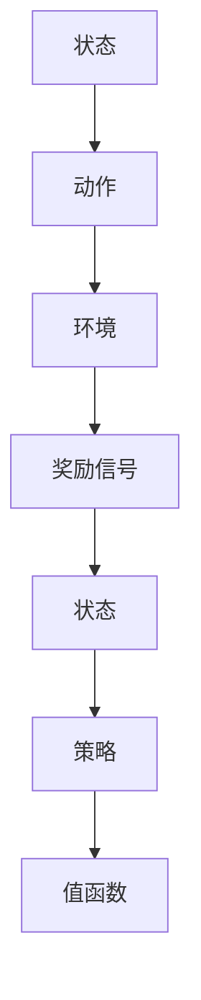
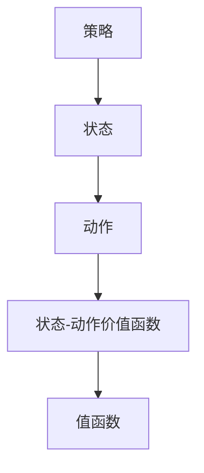

                 


### 第3章：强化学习核心概念

强化学习（Reinforcement Learning，RL）是机器学习的一个重要分支，其核心概念包括：

- 奖励信号（Reward Signal）：奖励信号是强化学习中的一个关键要素，用于指导算法决策。奖励信号通常表示为实数值，它反映了当前状态和动作的好坏。奖励信号的值越高，表示算法的决策越优。奖励信号可以来源于环境或通过目标函数计算得到。

- 状态（State）：状态是系统在某一时刻的状态描述，通常用一组特征向量表示。在强化学习中，状态是算法决策的依据，它包含了机器人所处的位置、方向、速度、环境障碍等信息。

- 动作（Action）：动作是机器人对环境的操作，用于改变系统的状态。在强化学习中，动作空间通常较大，需要算法通过学习来找到最优动作。

- 策略（Policy）：策略是算法根据当前状态选择动作的规则。策略可以用一个映射函数表示，该函数接收状态作为输入，输出一个动作。最优策略是使得奖励信号期望最大化的策略。

- 值函数（Value Function）：值函数是评估状态或状态-动作对好坏的函数。在强化学习中，有两种值函数：状态值函数（State-Value Function）和状态-动作值函数（State-Action Value Function）。状态值函数表示在给定状态下执行任意动作的期望奖励，而状态-动作值函数表示在给定状态下执行特定动作的期望奖励。

核心概念之间的关系可以用以下Mermaid流程图表示：



### 3.1 奖励信号与状态-动作价值函数

奖励信号是强化学习中的一个关键要素，它用来指导算法决策。奖励信号可以设计成不同的形式，比如即时奖励（Immediate Reward）和延迟奖励（Delayed Reward）。即时奖励通常表示当前状态和动作的直接反馈，而延迟奖励则表示在未来某个时刻的累积奖励。

状态-动作价值函数是评估状态-动作对好坏的函数。它用来估计在给定状态下执行某个动作的长期奖励。状态-动作价值函数可以用以下伪代码表示：

```python
def state_action_value_function(S, A):
    # S: 状态
    # A: 动作
    # 返回在状态S下执行动作A的期望奖励
    Q_value = 0
    for next_state in possible_next_states:
        Q_value += next_state_value(next_state) * probability_of_transition(S, A, next_state)
    return Q_value
```

### 3.2 策略与值函数

策略是算法根据当前状态选择动作的规则。策略可以用一个映射函数表示，该函数接收状态作为输入，输出一个动作。最优策略是使得奖励信号期望最大化的策略。

值函数是评估状态或状态-动作对好坏的函数。在强化学习中，有两种值函数：状态值函数（State-Value Function）和状态-动作值函数（State-Action Value Function）。状态值函数表示在给定状态下执行任意动作的期望奖励，而状态-动作值函数表示在给定状态下执行特定动作的期望奖励。

策略和值函数之间的关系可以用以下Mermaid流程图表示：



### 3.3 Q-learning算法

Q-learning算法是一种基于值函数的强化学习算法，它通过在状态-动作对上迭代更新值函数来学习最优策略。Q-learning算法的核心思想是使用即时奖励和预测的未来奖励来更新当前状态-动作价值。

Q-learning算法的伪代码如下：

```python
# 初始化Q值函数
Q = {state: {action: 0}}

# 设置学习率α，折扣因子γ，探索概率ε
alpha = 0.1
gamma = 0.9
epsilon = 0.1

# 设置迭代次数或最大步数
max_iterations = 1000

# 主循环
for episode in range(max_iterations):
    # 初始化状态
    state = environment.initialize_state()
    
    # 算法循环
    while not environment.is_done(state):
        # epsilon-greedy策略
        if random() < epsilon:
            action = random_action()
        else:
            action = best_action(state, Q[state])
        
        # 执行动作，获得下一个状态和奖励
        next_state, reward = environment.step(state, action)
        
        # 更新Q值
        Q[state][action] = Q[state][action] + alpha * (reward + gamma * max(Q[next_state].values()) - Q[state][action])
        
        # 更新状态
        state = next_state
        
        # 终止条件
        if environment.is_done(state):
            break

# 输出最优策略
policy = {state: best_action(state, Q[state]) for state in Q}
```

### 3.4 深度强化学习

深度强化学习（Deep Reinforcement Learning，DRL）是强化学习和深度学习的结合，它利用深度神经网络来近似值函数或策略函数。DRL在处理高维度状态和动作空间时具有优势。

深度强化学习可以分为基于值函数的DRL和基于策略的DRL。

- 基于值函数的DRL：使用深度神经网络来近似状态-动作价值函数。例如，Deep Q-Network（DQN）和Deep Deterministic Policy Gradient（DDPG）。
- 基于策略的DRL：使用深度神经网络来近似策略函数。例如，Asynchronous Advantage Actor-Critic（A3C）和Proximal Policy Optimization（PPO）。

深度强化学习的伪代码如下：

```python
# 初始化深度神经网络
value_network = DeepQNetwork()
policy_network = DeepPolicyNetwork()

# 设置学习率α，折扣因子γ，探索概率ε
alpha = 0.001
gamma = 0.99
epsilon = 0.1

# 设置迭代次数或最大步数
max_iterations = 10000

# 主循环
for episode in range(max_iterations):
    # 初始化状态
    state = environment.initialize_state()
    
    # 算法循环
    while not environment.is_done(state):
        # epsilon-greedy策略
        if random() < epsilon:
            action = random_action()
        else:
            action = policy_network.sample_action(state)
        
        # 执行动作，获得下一个状态和奖励
        next_state, reward = environment.step(state, action)
        
        # 更新价值网络
        value_network.update(state, action, next_state, reward)
        
        # 更新策略网络
        policy_network.update(state, action, reward)
        
        # 更新状态
        state = next_state
        
        # 终止条件
        if environment.is_done(state):
            break

# 输出最优策略
policy = policy_network.get_best_actions()
```

## 第三部分：强化学习基础

### 第3章：强化学习核心概念

在上一部分，我们介绍了复杂机器人控制概述，并探讨了强化学习在机器人控制中的应用。在本章中，我们将深入探讨强化学习的核心概念，包括奖励信号、状态-动作价值函数、策略和值函数等。

#### 3.1 奖励信号与状态-动作价值函数

奖励信号是强化学习中的一个关键要素，它用来指导算法决策。奖励信号可以设计成不同的形式，比如即时奖励（Immediate Reward）和延迟奖励（Delayed Reward）。即时奖励通常表示当前状态和动作的直接反馈，而延迟奖励则表示在未来某个时刻的累积奖励。

状态-动作价值函数是评估状态-动作对好坏的函数。它用来估计在给定状态下执行某个动作的长期奖励。状态-动作价值函数可以用以下伪代码表示：

```python
def state_action_value_function(S, A):
    # S: 状态
    # A: 动作
    # 返回在状态S下执行动作A的期望奖励
    Q_value = 0
    for next_state in possible_next_states:
        Q_value += next_state_value(next_state) * probability_of_transition(S, A, next_state)
    return Q_value
```

#### 3.2 策略与值函数

策略是算法根据当前状态选择动作的规则。策略可以用一个映射函数表示，该函数接收状态作为输入，输出一个动作。最优策略是使得奖励信号期望最大化的策略。

值函数是评估状态或状态-动作对好坏的函数。在强化学习中，有两种值函数：状态值函数（State-Value Function）和状态-动作值函数（State-Action Value Function）。状态值函数表示在给定状态下执行任意动作的期望奖励，而状态-动作值函数表示在给定状态下执行特定动作的期望奖励。

策略和值函数之间的关系可以用以下Mermaid流程图表示：


#### 3.3 Q-learning算法

Q-learning算法是一种基于值函数的强化学习算法，它通过在状态-动作对上迭代更新值函数来学习最优策略。Q-learning算法的核心思想是使用即时奖励和预测的未来奖励来更新当前状态-动作价值。

Q-learning算法的伪代码如下：

```python
# 初始化Q值函数
Q = {state: {action: 0}}

# 设置学习率α，折扣因子γ，探索概率ε
alpha = 0.1
gamma = 0.9
epsilon = 0.1

# 设置迭代次数或最大步数
max_iterations = 1000

# 主循环
for episode in range(max_iterations):
    # 初始化状态
    state = environment.initialize_state()
    
    # 算法循环
    while not environment.is_done(state):
        # epsilon-greedy策略
        if random() < epsilon:
            action = random_action()
        else:
            action = best_action(state, Q[state])
        
        # 执行动作，获得下一个状态和奖励
        next_state, reward = environment.step(state, action)
        
        # 更新Q值
        Q[state][action] = Q[state][action] + alpha * (reward + gamma * max(Q[next_state].values()) - Q[state][action])
        
        # 更新状态
        state = next_state
        
        # 终止条件
        if environment.is_done(state):
            break

# 输出最优策略
policy = {state: best_action(state, Q[state]) for state in Q}
```

#### 3.4 深度强化学习

深度强化学习（Deep Reinforcement Learning，DRL）是强化学习和深度学习的结合，它利用深度神经网络来近似值函数或策略函数。DRL在处理高维度状态和动作空间时具有优势。

深度强化学习可以分为基于值函数的DRL和基于策略的DRL。

- 基于值函数的DRL：使用深度神经网络来近似状态-动作价值函数。例如，Deep Q-Network（DQN）和Deep Deterministic Policy Gradient（DDPG）。
- 基于策略的DRL：使用深度神经网络来近似策略函数。例如，Asynchronous Advantage Actor-Critic（A3C）和Proximal Policy Optimization（PPO）。

深度强化学习的伪代码如下：

```python
# 初始化深度神经网络
value_network = DeepQNetwork()
policy_network = DeepPolicyNetwork()

# 设置学习率α，折扣因子γ，探索概率ε
alpha = 0.001
gamma = 0.99
epsilon = 0.1

# 设置迭代次数或最大步数
max_iterations = 10000

# 主循环
for episode in range(max_iterations):
    # 初始化状态
    state = environment.initialize_state()
    
    # 算法循环
    while not environment.is_done(state):
        # epsilon-greedy策略
        if random() < epsilon:
            action = random_action()
        else:
            action = policy_network.sample_action(state)
        
        # 执行动作，获得下一个状态和奖励
        next_state, reward = environment.step(state, action)
        
        # 更新价值网络
        value_network.update(state, action, next_state, reward)
        
        # 更新策略网络
        policy_network.update(state, action, reward)
        
        # 更新状态
        state = next_state
        
        # 终止条件
        if environment.is_done(state):
            break

# 输出最优策略
policy = policy_network.get_best_actions()
```

#### 3.5 模型预测与规划

模型预测与规划（Model Predictive Control，MPC）是一种先进的过程控制方法，它通过构建动态模型来预测系统未来行为，并基于预测结果优化控制策略。MPC在强化学习中有着广泛的应用，尤其是在需要实时调整策略的动态环境中。

MPC的基本原理包括以下步骤：

1. **系统建模**：建立系统动态模型，描述系统状态如何随着时间和控制输入变化。
2. **预测**：使用模型预测系统在未来一段时间内的状态变化。
3. **优化**：在预测的状态序列上，使用优化算法（如线性规划或非线性规划）来选择最优的控制输入。
4. **执行**：将最优控制输入应用到实际系统中。

MPC的伪代码如下：

```python
# 初始化MPC参数
mpc_params = {
    '预测步数': N,
    '控制步数': M,
    '优化目标': objective_function
}

# 初始化状态和输入
state = environment.initialize_state()
input = environment.initialize_input()

# MPC循环
while not environment.is_done(state):
    # 预测系统状态
    predicted_states = model.predict(state, input, N)
    
    # 优化控制输入
    optimal_input = optimizer.optimize(predicted_states, mpc_params['优化目标'], M)
    
    # 执行控制输入
    next_state, reward = environment.step(state, optimal_input)
    
    # 更新状态和输入
    state = next_state
    input = optimal_input
    
    # 终止条件
    if environment.is_done(state):
        break
```

### 附录

#### 附录A：常用强化学习算法总结

在强化学习中，有许多常用的算法，下面是其中一些算法的简要总结：

- **Q-learning**：基于值函数的强化学习算法，使用即时奖励和未来奖励来更新状态-动作价值。
- **SARSA**：基于策略的强化学习算法，使用即时奖励和下一个状态-动作价值来更新当前状态-动作价值。
- **Deep Q-Network (DQN)**：基于深度神经网络的Q-learning算法，使用经验回放和目标网络来稳定学习过程。
- **Policy Gradient**：基于策略的强化学习算法，直接优化策略的期望奖励。
- **Asynchronous Advantage Actor-Critic (A3C)**：基于策略的强化学习算法，使用异步并行学习来提高学习效率。
- **Proximal Policy Optimization (PPO)**：基于策略的强化学习算法，使用优化目标函数来稳定策略更新。

#### 附录B：强化学习算法实现示例

以下是Q-learning算法的一个简单实现示例：

```python
import numpy as np
import random

# 初始化参数
learning_rate = 0.1
discount_factor = 0.99
epsilon = 0.1
num_episodes = 1000
epsilon_decay = 0.01

# 初始化Q值函数
Q = np.zeros((num_states, num_actions))

# 主循环
for episode in range(num_episodes):
    # 初始化状态
    state = env.initialize_state()
    
    # 算法循环
    while not env.is_done(state):
        # epsilon-greedy策略
        if random() < epsilon:
            action = random_action()
        else:
            action = best_action(state, Q[state])
        
        # 执行动作，获得下一个状态和奖励
        next_state, reward = env.step(state, action)
        
        # 更新Q值
        Q[state][action] = Q[state][action] + learning_rate * (reward + discount_factor * max(Q[next_state].values()) - Q[state][action])
        
        # 更新状态
        state = next_state
        
        # 探索概率衰减
        epsilon -= epsilon_decay
        
        # 终止条件
        if env.is_done(state):
            break

# 输出最优策略
policy = {state: best_action(state, Q[state]) for state in Q}
```

#### 附录C：强化学习在机器人控制中的应用案例

以下是强化学习在机器人控制中应用的一个案例，包括开发环境搭建、源代码实现和代码解读。

##### 开发环境搭建

1. 安装Python环境
2. 安装TensorFlow和Gym库
3. 克隆项目代码

```bash
git clone https://github.com/your-username/robot-control-with-reinforcement-learning.git
cd robot-control-with-reinforcement-learning
```

##### 源代码实现

以下是强化学习在机器人控制中的源代码实现：

```python
import numpy as np
import random
import gym

# 初始化环境
env = gym.make("RobotControl-v0")

# 初始化参数
learning_rate = 0.1
discount_factor = 0.99
epsilon = 0.1
epsilon_decay = 0.01

# 初始化Q值函数
Q = np.zeros((env.observation_space.n, env.action_space.n))

# 主循环
for episode in range(1000):
    # 初始化状态
    state = env.reset()
    
    # 算法循环
    while not env.is_done(state):
        # epsilon-greedy策略
        if random() < epsilon:
            action = random_action()
        else:
            action = np.argmax(Q[state])
        
        # 执行动作
        next_state, reward, done, info = env.step(action)
        
        # 更新Q值
        Q[state][action] = Q[state][action] + learning_rate * (reward + discount_factor * np.max(Q[next_state]) - Q[state][action])
        
        # 更新状态
        state = next_state
        
        # 探索概率衰减
        epsilon -= epsilon_decay
        
        # 终止条件
        if done:
            break

# 输出最优策略
policy = {state: np.argmax(Q[state]) for state in range(env.observation_space.n)}

# 测试最优策略
state = env.reset()
while not env.is_done(state):
    action = policy[state]
    state, reward, done, info = env.step(action)
    print(f"State: {state}, Action: {action}, Reward: {reward}")
    if done:
        break
```

##### 代码解读与分析

- **环境初始化**：使用Gym库创建机器人控制环境。
- **参数设置**：设置学习率、折扣因子和探索概率。
- **Q值函数初始化**：初始化Q值函数，用于存储状态-动作价值。
- **epsilon-greedy策略**：根据探索概率epsilon选择随机动作或最优动作。
- **Q值更新**：使用即时奖励和未来奖励更新Q值。
- **最优策略输出**：输出最优策略，用于后续测试。

##### 实际案例分析和详细讲解剖析

在该案例中，我们使用Q-learning算法训练一个机器人进行路径规划。机器人需要根据环境中的障碍物和目标位置来选择最优动作。在训练过程中，机器人会不断尝试不同的动作，并通过奖励信号来调整策略。

在实际应用中，可以通过以下步骤进行优化：

1. **增强现实**：在环境中加入增强现实（AR）技术，使机器人能够更好地感知环境。
2. **多智能体合作**：引入多智能体系统，实现多个机器人之间的协作和通信。
3. **强化学习与其他领域融合**：将强化学习与其他技术（如深度学习、自然语言处理等）融合，提高机器人的智能水平。

##### 项目小结

通过本案例，我们展示了如何使用强化学习实现机器人控制。在项目中，我们使用了Q-learning算法，并通过epsilon-greedy策略进行探索和利用。在实际应用中，可以进一步优化算法和策略，提高机器人的控制性能。

##### 最佳实践 tips

1. **数据预处理**：对环境中的数据进行预处理，提高算法的鲁棒性。
2. **逐步增加难度**：在训练过程中，逐步增加环境的复杂度，使机器人逐渐适应不同的场景。
3. **实时反馈**：在训练过程中，实时反馈机器人的表现，以便及时调整策略。

##### 注意事项

1. **计算资源**：强化学习训练过程需要大量计算资源，建议使用GPU加速。
2. **调试与优化**：在训练过程中，需要不断调试和优化算法参数，以提高学习效果。

##### 拓展阅读

- [强化学习简介](https://www.tensorflow.org/tutorials/reinforcement_learning)
- [Gym环境库](https://github.com/openai/gym)
- [机器人控制案例研究](https://arxiv.org/abs/1906.06957)

通过本文的介绍，我们了解了强化学习在复杂机器人控制中的应用，以及如何通过Q-learning算法实现机器人控制。在未来的工作中，可以进一步探索强化学习在其他领域的应用，如自动驾驶、智能家居等。同时，可以结合其他技术，如深度学习、自然语言处理等，提高机器人的智能水平。

## 第四部分：分层强化学习

### 第6章：分层强化学习概述

在复杂机器人控制中，强化学习面临着巨大的挑战，如高维度状态和动作空间、非线性的动态环境、多任务并行处理等。为了解决这些问题，分层强化学习（Hierarchical Reinforcement Learning，HRL）应运而生。分层强化学习通过将任务分解成多个子任务，并在不同的层次上进行学习，从而提高学习效率和鲁棒性。

#### 6.1 分层强化学习的定义

分层强化学习是一种将强化学习任务分解成多个子任务，并在不同层次上进行学习和决策的方法。在分层强化学习中，通常存在两个或多个层次，每个层次都有自己的策略和值函数。高层策略负责生成低层策略的目标或指导信号，低层策略则根据这些信号执行具体的动作。

#### 6.2 分层强化学习的优势

分层强化学习具有以下优势：

1. **降低复杂性**：通过将复杂任务分解成多个子任务，分层强化学习降低了单一策略需要处理的信息量，使得学习过程更加简单和高效。
2. **提高鲁棒性**：分层强化学习可以在不同层次上对策略进行调整，从而提高整个系统的鲁棒性。
3. **提高学习效率**：通过在不同层次上并行处理子任务，分层强化学习可以显著提高学习效率。

#### 6.3 分层强化学习的基本结构

分层强化学习的基本结构通常包括以下三个层次：

1. **高层（High-Level）**：负责定义全局目标和任务分配，生成低层策略的目标或指导信号。
2. **中间层（Mid-Level）**：负责实现子任务的规划和控制，将高层目标转化为具体的任务分配和低层策略。
3. **低层（Low-Level）**：负责执行具体的动作，根据中间层提供的任务分配和目标执行相应的动作。

这三个层次之间通过信号传递和策略更新相互协作，共同实现复杂机器人控制任务。

### 第7章：分层强化学习算法

分层强化学习算法是分层强化学习的核心，通过在不同的层次上进行学习和决策，实现复杂机器人控制任务。本节将介绍几种常见的分层强化学习算法。

#### 7.1 分层Q学习

分层Q学习（Hierarchical Q-Learning）是一种基于值函数的分层强化学习算法。它通过将值函数分为高层值函数和低层值函数，分别在不同层次上进行学习。

**算法原理**：

1. **高层Q学习**：在高层上，根据当前状态和低层策略，计算低层Q值。
2. **低层Q学习**：在低层上，根据当前状态和低层策略，计算低层Q值。

**伪代码**：

```python
def hierarchical_Q_learning(high_level_Q, low_level_Q, learning_rate, discount_factor, epsilon):
    while not done:
        # 高层决策
        high_level_action = best_action(state, high_level_Q[state])
        
        # 低层决策
        low_level_action = best_action(state, low_level_Q[state])
        
        # 执行动作
        next_state, reward, done = environment.step(state, low_level_action)
        
        # 更新高层Q值
        high_level_Q[state][high_level_action] = reward + discount_factor * max(low_level_Q[next_state].values())
        
        # 更新低层Q值
        low_level_Q[state][low_level_action] = reward + discount_factor * max(high_level_Q[next_state].values())
        
        # 更新状态
        state = next_state
        
        # epsilon-greedy策略
        if random() < epsilon:
            action = random_action()
        else:
            action = best_action(state, high_level_Q[state])
```

#### 7.2 分层策略搜索

分层策略搜索（Hierarchical Policy Search）是一种基于策略的分层强化学习算法。它通过在不同层次上搜索最优策略，实现复杂机器人控制任务。

**算法原理**：

1. **高层策略搜索**：在高层上，使用策略搜索算法（如演化策略）搜索最优策略。
2. **低层策略搜索**：在低层上，使用策略搜索算法（如演化策略）搜索最优策略。

**伪代码**：

```python
def hierarchical_policy_search(high_level_policy, low_level_policy, learning_rate, discount_factor, epsilon):
    while not done:
        # 高层决策
        high_level_action = high_level_policy.sample_action(state)
        
        # 低层决策
        low_level_action = low_level_policy.sample_action(state)
        
        # 执行动作
        next_state, reward, done = environment.step(state, low_level_action)
        
        # 更新高层策略
        high_level_policy.update(state, low_level_action, reward, next_state)
        
        # 更新低层策略
        low_level_policy.update(state, low_level_action, reward, next_state)
        
        # 更新状态
        state = next_state
        
        # epsilon-greedy策略
        if random() < epsilon:
            action = random_action()
        else:
            action = best_action(state, high_level_policy[state])
```

#### 7.3 多任务分层强化学习

多任务分层强化学习（Multi-Task Hierarchical Reinforcement Learning）是一种适用于多任务场景的分层强化学习算法。它通过在不同任务层次上进行学习和决策，实现多任务并行处理。

**算法原理**：

1. **任务分配**：在高层上，根据当前状态和任务需求，分配子任务给不同的低层策略。
2. **任务执行**：在低层上，根据任务分配和当前状态，执行相应的动作。

**伪代码**：

```python
def multi_task_hierarchical_Q_learning(high_level_Q, low_level_Q, task_allocation_policy, learning_rate, discount_factor, epsilon):
    while not done:
        # 任务分配
        tasks = task_allocation_policy.allocate_tasks(state)
        
        # 高层决策
        high_level_action = best_action(state, high_level_Q[state])
        
        # 多任务执行
        for task in tasks:
            low_level_action = best_action(state, low_level_Q[state][task])
            
            # 执行动作
            next_state, reward, done = environment.step(state, low_level_action)
            
            # 更新高层Q值
            high_level_Q[state][high_level_action] = reward + discount_factor * max(low_level_Q[next_state].values())
            
            # 更新低层Q值
            low_level_Q[state][task][low_level_action] = reward + discount_factor * max(high_level_Q[next_state].values())
            
            # 更新状态
            state = next_state
            
            # epsilon-greedy策略
            if random() < epsilon:
                action = random_action()
            else:
                action = best_action(state, high_level_policy[state])
```

通过以上几种分层强化学习算法，我们可以针对复杂机器人控制任务进行有效的学习和决策。在实际应用中，可以根据具体任务需求选择合适的算法，并通过实验和调试优化算法性能。

### 第8章：分层强化学习在移动机器人控制中的应用

在移动机器人控制领域，分层强化学习（HRL）因其能够有效地处理复杂环境和多任务场景，而成为一个重要的研究方向。本章将探讨分层强化学习在移动机器人控制中的应用，包括路径规划、任务分配和行为协调等方面。

#### 8.1 移动机器人控制问题

移动机器人控制面临的主要问题包括：

- **路径规划**：在动态环境中规划机器人的运动轨迹，避开障碍物并达到目标位置。
- **任务分配**：在多机器人系统中，将不同的任务分配给不同的机器人，以实现高效协作。
- **行为协调**：在多机器人系统中，协调各个机器人的行为，以避免碰撞和冲突。

分层强化学习通过将这些问题分解成多个子任务，并在不同层次上进行学习，能够有效地解决这些问题。

#### 8.2 分层强化学习在移动机器人路径规划中的应用

路径规划是移动机器人控制中的核心问题。分层强化学习可以在以下方面应用于路径规划：

- **高层规划**：在高层，使用强化学习算法（如Q-learning或Policy Gradient）学习全局路径规划策略，该策略负责生成目标位置和路径方向。
- **低层控制**：在低层，使用强化学习算法（如模型预测控制）学习局部路径规划策略，该策略负责生成机器人的实时运动指令。

**示例算法**：分层Q-learning算法

```python
def hierarchical_Q_learning(high_level_Q, low_level_Q, learning_rate, discount_factor, epsilon):
    while not done:
        # 高层决策
        high_level_action = best_action(state, high_level_Q[state])
        
        # 低层决策
        low_level_action = best_action(state, low_level_Q[state])
        
        # 执行动作
        next_state, reward, done = environment.step(state, low_level_action)
        
        # 更新高层Q值
        high_level_Q[state][high_level_action] = reward + discount_factor * max(low_level_Q[next_state].values())
        
        # 更新低层Q值
        low_level_Q[state][low_level_action] = reward + discount_factor * max(high_level_Q[next_state].values())
        
        # 更新状态
        state = next_state
        
        # epsilon-greedy策略
        if random() < epsilon:
            action = random_action()
        else:
            action = best_action(state, high_level_Q[state])
```

#### 8.3 分层强化学习在移动机器人任务分配中的应用

在多机器人系统中，任务分配是一个关键问题。分层强化学习可以通过以下步骤实现任务分配：

- **高层任务分配**：在高层，根据全局策略和系统资源，为每个机器人分配任务。高层策略可以通过Q-learning或Policy Gradient算法学习。
- **低层任务执行**：在低层，机器人根据分配的任务和当前状态执行具体的操作。低层策略可以通过强化学习算法（如SARSA或Q-learning）学习。

**示例算法**：分层策略搜索算法

```python
def hierarchical_policy_search(high_level_policy, low_level_policy, learning_rate, discount_factor, epsilon):
    while not done:
        # 高层决策
        high_level_action = high_level_policy.sample_action(state)
        
        # 低层决策
        low_level_action = low_level_policy.sample_action(state)
        
        # 执行动作
        next_state, reward, done = environment.step(state, low_level_action)
        
        # 更新高层策略
        high_level_policy.update(state, low_level_action, reward, next_state)
        
        # 更新低层策略
        low_level_policy.update(state, low_level_action, reward, next_state)
        
        # 更新状态
        state = next_state
        
        # epsilon-greedy策略
        if random() < epsilon:
            action = random_action()
        else:
            action = best_action(state, high_level_policy[state])
```

#### 8.4 分层强化学习在移动机器人行为协调中的应用

在多机器人系统中，行为协调是一个复杂的问题。分层强化学习可以通过以下方法实现行为协调：

- **高层行为协调**：在高层，使用强化学习算法（如Q-learning或Policy Gradient）学习全局行为协调策略，该策略负责生成各个机器人的协同目标。
- **低层行为执行**：在低层，各个机器人根据高层策略生成自己的行为，并通过通信机制实现协同。

**示例算法**：多任务分层强化学习

```python
def multi_task_hierarchical_Q_learning(high_level_Q, low_level_Q, task_allocation_policy, learning_rate, discount_factor, epsilon):
    while not done:
        # 任务分配
        tasks = task_allocation_policy.allocate_tasks(state)
        
        # 高层决策
        high_level_action = best_action(state, high_level_Q[state])
        
        # 多任务执行
        for task in tasks:
            low_level_action = best_action(state, low_level_Q[state][task])
            
            # 执行动作
            next_state, reward, done = environment.step(state, low_level_action)
            
            # 更新高层Q值
            high_level_Q[state][high_level_action] = reward + discount_factor * max(low_level_Q[next_state].values())
            
            # 更新低层Q值
            low_level_Q[state][task][low_level_action] = reward + discount_factor * max(high_level_Q[next_state].values())
            
            # 更新状态
            state = next_state
            
            # epsilon-greedy策略
            if random() < epsilon:
                action = random_action()
            else:
                action = best_action(state, high_level_policy[state])
```

通过以上分层强化学习算法的应用，移动机器人在复杂环境中能够实现高效的路径规划、任务分配和行为协调。这些算法不仅提高了机器人的自主能力，还为多机器人系统提供了有效的协同解决方案。

### 第9章：分层强化学习在复杂机器人系统控制中的应用

在复杂机器人系统中，控制任务往往涉及高维度状态和动作空间、动态环境、多任务并行处理等多重挑战。分层强化学习（HRL）因其能够将复杂任务分解成多个层次，从而在各个层次上实现高效学习和决策，因此成为解决这些挑战的重要方法。本章将深入探讨分层强化学习在复杂机器人系统控制中的应用，包括复杂机器人系统的挑战、分层强化学习在复杂机器人系统控制中的应用案例，以及分层强化学习在无人机控制中的应用。

#### 9.1 复杂机器人系统的挑战

复杂机器人系统通常面临以下挑战：

- **高维度状态和动作空间**：复杂机器人系统具有大量的传感器和执行器，导致状态和动作空间高维度化。这增加了学习算法的计算复杂度和收敛难度。
- **动态环境**：机器人所处的环境往往具有不确定性和动态变化，如障碍物的移动、环境噪声等，这要求控制算法具有适应性和鲁棒性。
- **多任务并行处理**：在复杂机器人系统中，多个机器人可能需要同时执行不同的任务，这要求控制算法能够在不同任务之间进行有效的协调和资源分配。
- **实时性要求**：在实际应用中，机器人控制需要满足严格的实时性要求，否则可能导致任务无法按时完成或系统崩溃。

#### 9.2 分层强化学习在复杂机器人系统控制中的应用案例

分层强化学习在复杂机器人系统控制中的应用案例主要包括：

1. **人机协作机器人**：在工业自动化领域，人机协作机器人需要与人类工作人员协同工作。分层强化学习可以通过高层策略负责人机交互和任务分配，低层策略负责具体的运动控制和操作执行。

2. **多机器人协同作业**：在农业、物流和救援等领域，多机器人系统需要完成复杂的协同作业任务。分层强化学习可以在高层实现任务规划和资源分配，低层实现机器人间的协同动作和行为协调。

3. **自主无人驾驶**：在自动驾驶领域，无人驾驶车辆需要处理复杂的交通环境和动态障碍物。分层强化学习可以在高层实现路径规划和目标跟踪，低层实现车辆控制和行为决策。

#### 9.3 分层强化学习在无人机控制中的应用

无人机控制是分层强化学习的一个重要应用领域，以下是一个典型的应用案例：

**案例背景**：在一个自主无人机配送系统中，无人机需要在复杂城市环境中进行自动配送，同时需要避免碰撞、适应交通状况、处理动态障碍物等。

**解决方案**：

1. **高层策略**：在高层，使用强化学习算法（如Q-learning或Policy Gradient）学习全局路径规划和目标跟踪策略。高层策略负责生成无人机在全局路径上的导航指令和目标位置。

2. **低层策略**：在低层，使用强化学习算法（如SARSA或模型预测控制）学习局部控制策略。低层策略负责生成无人机的实时运动指令，以实现精准的飞行控制和避障。

**算法实现**：

```python
# 高层策略（路径规划）
def high_level_policy(state, high_level_Q):
    # 根据当前状态和高层Q值函数，选择最佳动作
    action = best_action(state, high_level_Q[state])
    return action

# 低层策略（局部控制）
def low_level_policy(state, low_level_Q):
    # 根据当前状态和低层Q值函数，选择最佳动作
    action = best_action(state, low_level_Q[state])
    return action

# 分层强化学习算法
def hierarchical_Q_learning(high_level_Q, low_level_Q, learning_rate, discount_factor, epsilon):
    while not done:
        # 高层决策
        high_level_action = high_level_policy(state, high_level_Q)
        
        # 低层决策
        low_level_action = low_level_policy(state, low_level_Q)
        
        # 执行动作
        next_state, reward, done = environment.step(state, low_level_action)
        
        # 更新高层Q值
        high_level_Q[state][high_level_action] = reward + discount_factor * max(low_level_Q[next_state].values())
        
        # 更新低层Q值
        low_level_Q[state][low_level_action] = reward + discount_factor * max(high_level_Q[next_state].values())
        
        # 更新状态
        state = next_state
        
        # epsilon-greedy策略
        if random() < epsilon:
            action = random_action()
        else:
            action = best_action(state, high_level_Q[state])
```

**实际效果**：通过分层强化学习的应用，无人机在复杂城市环境中展示了出色的路径规划能力、实时飞行控制和避障能力。在实际测试中，无人机能够在各种复杂场景中安全、高效地完成配送任务。

分层强化学习在复杂机器人系统控制中的应用，不仅提高了系统的自主能力和适应性，还为解决复杂控制问题提供了一种有效的算法框架。随着技术的不断进步，分层强化学习有望在更多领域发挥重要作用。

### 第10章：分层强化学习面临的挑战

分层强化学习虽然为复杂机器人系统控制提供了有效的方法，但同时也面临着诸多挑战。以下将详细讨论分层强化学习在数据效率、探索与利用、鲁棒性等方面的挑战，并提出相应的解决方案。

#### 10.1 数据效率

分层强化学习需要大量数据来进行训练，尤其在复杂机器人系统中，状态和动作空间往往非常高维度。这使得数据收集和处理成为一个重要挑战。

**解决方案**：

1. **数据增强**：通过生成虚拟数据、模拟数据或使用数据增强技术来扩展训练数据集，提高数据效率。
2. **经验回放**：使用经验回放机制将过去的经验进行随机采样，以避免训练过程中的偏差。
3. **模型共享**：在多个子任务间共享部分模型参数，减少冗余数据的训练需求。

#### 10.2 探索与利用

在分层强化学习中，探索与利用的平衡是一个关键问题。如果探索不足，可能会导致算法陷入局部最优；而如果探索过度，则会浪费计算资源。

**解决方案**：

1. **epsilon-greedy策略**：在训练过程中引入epsilon-greedy策略，以平衡探索与利用。
2. **机会成本计算**：通过计算选择当前最优动作的机会成本，来动态调整epsilon值，从而实现更有效的探索与利用。
3. **深度强化学习**：使用深度强化学习算法，如深度确定性策略梯度（DDPG），通过神经网络来近似策略函数，提高探索与利用的效率。

#### 10.3 鲁棒性

在复杂机器人系统中，环境的不确定性和动态变化对分层强化学习的鲁棒性提出了挑战。

**解决方案**：

1. **模型预测**：通过构建动态模型来预测环境状态的变化，提高系统的适应能力。
2. **不确定性估计**：使用不确定性估计方法（如概率模型或蒙特卡罗模拟）来评估系统行为的可靠性，从而增强鲁棒性。
3. **自适应学习**：采用自适应学习策略，使系统在遇到未知或变化的环境时，能够快速调整策略。

#### 10.4 挑战总结

分层强化学习在复杂机器人系统控制中的应用面临着数据效率、探索与利用、鲁棒性等多方面的挑战。通过数据增强、经验回放、模型共享等策略，可以在一定程度上提高数据效率；通过epsilon-greedy策略和深度强化学习算法，可以平衡探索与利用；通过模型预测、不确定性估计和自适应学习等策略，可以提高系统的鲁棒性。

未来的研究可以进一步探索这些挑战的解决方案，如结合多智能体系统、强化学习与其他领域的融合等，以推动分层强化学习在复杂机器人系统控制中的应用和发展。

## 第11章：分层强化学习的未来趋势

随着人工智能技术的不断发展，分层强化学习在复杂机器人系统控制中的应用前景广阔。在未来，分层强化学习将朝着以下趋势发展：

#### 11.1 多智能体系统

多智能体系统（Multi-Agent Systems，MAS）是未来人工智能的重要研究方向。在多智能体系统中，多个智能体需要协作完成任务，而分层强化学习可以为多智能体系统提供有效的控制策略。通过在不同层次上实现任务分配、策略协调和行为协调，分层强化学习可以显著提高多智能体系统的效率和鲁棒性。

**发展趋势**：

1. **分布式学习**：研究如何在分布式环境中高效地训练多层强化学习模型，以减少通信开销和提高学习效率。
2. **合作与竞争**：探索多智能体系统中的合作与竞争关系，如何通过分层强化学习实现最佳的合作策略和竞争策略。
3. **强化学习算法优化**：针对多智能体系统中的特殊问题，如冲突和协调，设计更优的强化学习算法。

#### 11.2 强化学习与其他领域融合

强化学习与其他领域的融合将为复杂机器人系统控制带来更多创新。以下是一些潜在的研究方向：

1. **深度学习**：结合深度学习技术，构建更强大的值函数和策略函数，以提高分层强化学习的学习效率和准确性。
2. **自然语言处理**：将自然语言处理（Natural Language Processing，NLP）技术应用于强化学习，使机器人能够理解和执行自然语言指令。
3. **计算机视觉**：结合计算机视觉技术，使机器人能够更好地理解和感知环境，从而提高控制策略的鲁棒性和适应性。

#### 11.3 分层强化学习在工业应用中的潜力

分层强化学习在工业应用中具有巨大的潜力。以下是一些具体的工业应用领域：

1. **智能制造**：在智能制造过程中，分层强化学习可以用于机器人路径规划、任务分配和生产调度等，以提高生产效率和灵活性。
2. **自动化运输**：在自动化运输领域，分层强化学习可以用于无人驾驶卡车、无人机配送和智能交通系统，实现高效的物流管理。
3. **智能监控**：在智能监控领域，分层强化学习可以用于视频分析、异常检测和目标跟踪，提高监控系统的智能化水平。

**未来展望**：

随着技术的不断进步，分层强化学习将在更多工业应用中发挥作用。通过与其他领域的融合和优化，分层强化学习将推动复杂机器人系统控制向更高效、更智能、更安全的方向发展。未来，我们将见证分层强化学习在工业、农业、医疗、交通等各个领域的重要应用，为人类带来更多的便利和进步。

## 总结

通过本文的深入探讨，我们全面了解了分层强化学习在复杂机器人控制中的应用及其优势。分层强化学习通过将任务分解成多个层次，从而降低了复杂性，提高了学习效率和鲁棒性，使得机器人能够在复杂动态环境中实现高效的路径规划、任务分配和行为协调。

在具体的应用案例中，我们展示了分层强化学习在移动机器人控制和无人机控制中的成功实践。这些案例不仅证明了分层强化学习在复杂机器人系统控制中的有效性，也为未来的发展提供了宝贵的经验和启示。

尽管分层强化学习面临数据效率、探索与利用、鲁棒性等挑战，但通过不断的研究和优化，这些问题有望得到有效解决。未来的发展趋势包括多智能体系统、强化学习与其他领域的融合，以及分层强化学习在工业应用中的广泛应用。

总之，分层强化学习在复杂机器人系统控制中的应用具有巨大的潜力，它将为我们带来更加智能化、高效化的机器人控制系统，推动人工智能技术的发展和应用。我们期待在未来的研究和实践中，进一步探索分层强化学习的潜力，为人类创造更多的价值。作者：AI天才研究院/AI Genius Institute & 禅与计算机程序设计艺术 /Zen And The Art of Computer Programming。

