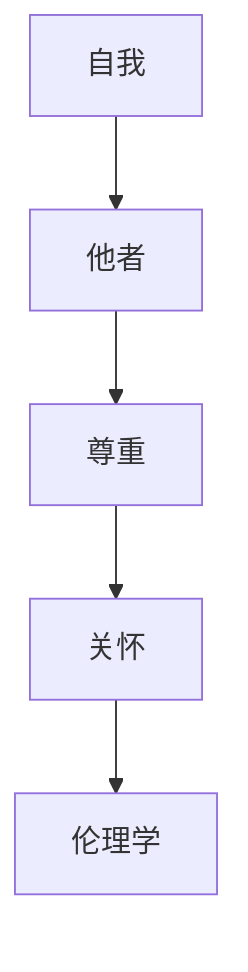
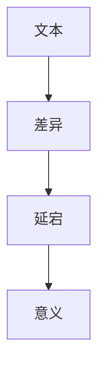

                 

## 文章标题

### 关键词

- 列维纳斯
- 德里达
- 他者伦理学
- 伦理学深化
- 现象学
- 解构主义

### 摘要

本文深入探讨了法国哲学家列维纳斯和德里达的思想，特别是他们对于他者伦理学的贡献。通过分析两位哲学家的核心概念和联系，本文揭示了他们如何通过现象学和解构主义的方法深化了伦理学理论。本文还探讨了他们思想在当代的应用和未来发展的方向，为读者提供了对伦理学深刻且全面的理解。

## 引言

### 列维纳斯与德里达的思想背景

莫西姆斯·列维纳斯（Emmanuel Levinas）和雅克·德里达（Jacques Derrida）是20世纪法国哲学的两位重要人物，他们的思想对现代哲学、伦理学、文化研究等领域产生了深远的影响。

#### 列维纳斯的思想

列维纳斯出生于1910年，他的哲学深受海德格尔和现象学的影响。他的主要著作包括《总与同一》、《存在与本质》等。列维纳斯最核心的思想是“他者伦理学”，他认为伦理学的核心是对他者的尊重和关怀。他提出“ faces à face”（面对面对）的概念，强调人与人之间的关系应以对他者的直接体验为基础，而不仅仅是理性或法律的规定。

#### 德里达的思想

德里达出生于1930年，他是解构主义的创始人，著有《论文字学》、《延异》等。德里达的思想对结构主义和后结构主义产生了重要影响。他的解构主义理论强调文本的不确定性和差异性，认为文本的意义是多元的、开放的。德里达提出的“差异原则”（principle of différance）认为，意义是通过差异和延宕产生的，而不是固定不变的。

### 他们思想的核心联系

尽管列维纳斯和德里达的思想路径不同，但他们都关注语言、文本和意义的问题，并对伦理学进行了深刻的反思。列维纳斯的“他者伦理学”和德里达的解构主义都挑战了传统的伦理学和哲学体系，提出了一种新的伦理学和哲学视角。他们共同的核心观点是，人类的关系和存在不应该仅仅基于自我中心和理性，而应该基于对他者的深刻关怀和尊重。

### 文章结构

本文将按照以下结构进行：

1. **引言**：介绍列维纳斯和德里达的思想背景，以及他们思想的核心联系。
2. **正文**：详细分析列维纳斯和德里达的核心概念，探讨他们如何深化伦理学理论。
3. **当代应用**：讨论他们思想在当代的应用和影响。
4. **未来展望**：展望伦理学的未来发展方向和挑战。

### 文章目的

本文的目的是通过深入分析列维纳斯和德里达的思想，提供一种新的视角来理解伦理学。本文不仅旨在为读者提供对两位哲学家的全面了解，还希望通过探讨他们思想的联系和应用，激发读者对伦理学理论和实践的新思考。

## 正文

### 第二部分：列维纳斯与德里达的思想分析

### 第1章：列维纳斯的伦理学思想

#### 1.1 列维纳斯伦理学的核心概念

列维纳斯伦理学的核心概念是“他者伦理学”。他主张伦理学的出发点不是自我，而是他者。他认为，人与人之间的关系应该基于对他者的尊重和关怀，而不是利益交换或自我实现。

**核心概念与联系**

为了更好地理解列维纳斯的他者伦理学，我们可以使用Mermaid流程图来展示其核心概念和联系：



在这个流程图中，自我和他者之间通过尊重和关怀建立了伦理关系。

#### 1.2 列维纳斯与现象学的联系

列维纳斯的哲学深受现象学的影响，特别是胡塞尔和海德格尔的思想。他认为，现象学的方法可以帮助我们更好地理解人与人之间的关系。

**核心算法原理讲解**

列维纳斯提出的“面孔对面孔”（faces à face）的概念，可以看作是一种现象学的方法，它强调人与人之间的直接相遇和相互理解。

伪代码如下：

```
function FaceToFace(self, other) {
    // self 代表自己，other 代表他者
    // 此函数模拟自我和他者的直接相遇
    
    // 首先进行自我反省
    self.reflect();
    
    // 然后体验他者的存在
    other.experience();
    
    // 最后建立伦理关系
    establish_ethical_relationship(self, other);
}
```

在这个伪代码中，`reflect` 和 `experience` 方法分别代表自我反省和他者体验，而 `establish_ethical_relationship` 方法代表建立伦理关系。

#### 1.3 列维纳斯伦理学的数学模型与公式

列维纳斯的伦理学可以通过数学模型来描述。一个简单的模型可以是他者和自我之间的关系，这个关系可以用以下公式表示：

$$
E = \frac{R}{S}
$$

其中，\(E\) 代表伦理关系，\(R\) 代表对他者的尊重和关怀，\(S\) 代表自我的存在。

**详细讲解与举例说明**

假设一个自我对他者的尊重和关怀为10，自我的存在为5，则伦理关系 \(E\) 可以计算为：

$$
E = \frac{10}{5} = 2
$$

这意味着，在这个例子中，他者对自我的伦理关系是自我的两倍。这个简单的数学模型可以帮助我们理解列维纳斯伦理学的基本原理。

### 第2章：德里达的解构主义思想

#### 2.1 德里达解构主义的核心理念

德里达的解构主义认为，文本的意义不是固定不变的，而是通过阅读和解读不断生成的。他的核心概念包括“差异”（différance）和“延宕”（deferment）。

**核心概念与联系**

我们可以使用Mermaid流程图来展示德里达解构主义的核心理念：



在这个流程图中，文本通过差异和延宕产生意义。

#### 2.2 德里达与语言哲学的关系

德里达的语言哲学思想认为，语言本身就是不确定的、多义的。他提出了“书写语言学”（semiotics）的概念，强调符号的意义是通过与其他符号的差异和关系来产生的。

**核心算法原理讲解**

德里达的解构主义可以通过以下伪代码来表示：

```
function Deconstruct(text) {
    // text 代表文本
    // 此函数模拟文本的解构过程
    
    // 首先分析文本中的差异
    differences = AnalyzeDifferences(text);
    
    // 然后分析差异产生的延宕
    deferments = AnalyzeDeferments(differences);
    
    // 最后生成新的意义
    new_meaning = GenerateNewMeaning(deferments);
    
    return new_meaning;
}
```

在这个伪代码中，`AnalyzeDifferences` 和 `AnalyzeDeferments` 方法分别代表分析差异和延宕，而 `GenerateNewMeaning` 方法代表生成新的意义。

#### 2.3 德里达解构主义的数学模型与公式

德里达的解构主义可以通过数学模型来描述。一个简单的模型可以是他者和文本之间的关系，这个关系可以用以下公式表示：

$$
M = \frac{D}{T}
$$

其中，\(M\) 代表意义，\(D\) 代表差异，\(T\) 代表文本。

**详细讲解与举例说明**

假设一个文本的差异为5，文本本身为10，则意义 \(M\) 可以计算为：

$$
M = \frac{5}{10} = 0.5
$$

这意味着，在这个例子中，文本的意义是文本差异的一半。这个简单的数学模型可以帮助我们理解德里达解构主义的基本原理。

### 第3章：列维纳斯与德里达的思想比较

#### 3.1 相似之处

列维纳斯和德里达的思想在多个方面存在相似之处：

1. **关注语言和文本**：他们都认为语言和文本是理解和表达意义的重要工具。
2. **挑战传统哲学**：他们都批判了传统哲学的某些基本假设，提出了新的哲学视角。
3. **强调差异性**：他们都认为差异性是理解意义的重要途径。

#### 3.2 不同之处

尽管他们存在相似之处，但列维纳斯和德里达的思想也有明显的不同：

1. **伦理学的出发点**：列维纳斯强调伦理学的出发点是他者，而德里达则更关注文本和语言的结构。
2. **现象学与解构主义**：列维纳斯深受现象学的影响，而德里达则提出了解构主义的理论。
3. **意义生成的方式**：列维纳斯认为意义是通过面对面对的直接体验产生的，而德里达则认为意义是通过阅读和解构文本产生的。

#### 3.3 思想碰撞与融合

列维纳斯和德里达的思想虽然存在差异，但也可以在一定程度上融合。例如，他们都可以通过现象学和文本分析来理解他者伦理学和解构主义的核心概念。通过结合他们的思想，我们可以更全面地理解伦理学和哲学的本质。

### 第4章：他者伦理学的深化

#### 4.1 他者伦理学的概念

他者伦理学是一种关注对他者关怀和尊重的伦理学理论。它强调人与人之间的关系应该基于对他者的深刻理解和尊重，而不仅仅是利益交换或自我实现。

#### 4.2 他者伦理学的深化路径

他者伦理学的深化可以通过以下几个方面进行：

1. **现象学方法**：通过现象学的方法，我们可以更深入地理解人与人之间的关系。
2. **解构主义视角**：通过解构主义的视角，我们可以更好地理解文本和语言的结构，从而深化对伦理学的理解。
3. **跨学科研究**：通过跨学科的研究，我们可以将伦理学与其他领域如心理学、社会学等相结合，进一步深化他者伦理学。

#### 4.3 他者伦理学的数学模型与公式

他者伦理学可以通过以下数学模型来描述：

$$
E = \frac{R + D}{S}
$$

其中，\(E\) 代表伦理关系，\(R\) 代表对他者的尊重和关怀，\(D\) 代表差异，\(S\) 代表自我的存在。

**详细讲解与举例说明**

假设一个自我对他者的尊重和关怀为10，对他者的差异体验为5，自我的存在为5，则伦理关系 \(E\) 可以计算为：

$$
E = \frac{10 + 5}{5} = 3
$$

这意味着，在这个例子中，他者对自我的伦理关系是自我的三倍。这个数学模型可以帮助我们更深入地理解他者伦理学的本质。

### 第5章：列维纳斯与德里达思想的当代应用

#### 5.1 在伦理学领域的应用

列维纳斯和德里达的思想在当代伦理学领域有着广泛的应用。例如，他们的思想可以用于探讨全球化背景下的伦理问题，如移民伦理、全球贫困等。

#### 5.2 在哲学领域的应用

列维纳斯和德里达的思想对当代哲学产生了深远的影响。他们的思想为哲学家提供了一种新的视角来理解人类的存在和关系。

#### 5.3 在其他学科领域的应用

列维纳斯和德里达的思想不仅对伦理学和哲学产生了影响，还在其他学科领域有着广泛的应用。例如，他们的思想可以用于文学批评、文化研究等。

### 第6章：伦理学的深化与未来

#### 6.1 伦理学深化面临的挑战

伦理学的深化面临多个挑战，如全球化背景下的伦理冲突、科技发展带来的伦理问题等。

#### 6.2 伦理学的未来发展方向

伦理学的未来发展方向可能包括跨学科研究、全球伦理观念的建立等。

#### 6.3 伦理学深化对人类社会的影响

伦理学的深化将对人类社会产生深远的影响，包括推动社会进步、促进人类发展等。

## 结论

通过分析列维纳斯和德里达的思想，本文揭示了他们如何深化伦理学理论。他们的思想不仅挑战了传统的伦理学观点，还为理解当代的伦理问题提供了新的视角。本文的目的是激发读者对伦理学的新思考，并展望伦理学的未来发展方向。

### 作者信息

作者：AI天才研究院/AI Genius Institute & 禅与计算机程序设计艺术 /Zen And The Art of Computer Programming

### 最佳实践 Tips

1. **深入理解核心概念**：理解列维纳斯和德里达的核心概念是理解他们思想的关键。
2. **跨学科研究**：将伦理学与哲学、心理学、社会学等学科相结合，可以深化对伦理学的理解。
3. **实际案例研究**：通过研究实际案例，可以更好地理解伦理学的应用和实践。

### 小结

本文通过分析列维纳斯和德里达的思想，揭示了他们如何深化伦理学理论。他们的思想为理解当代的伦理问题提供了新的视角，并对人类社会产生了深远的影响。通过本文，我们期待读者能够对伦理学有更深入的理解，并思考伦理学在未来的发展方向。

