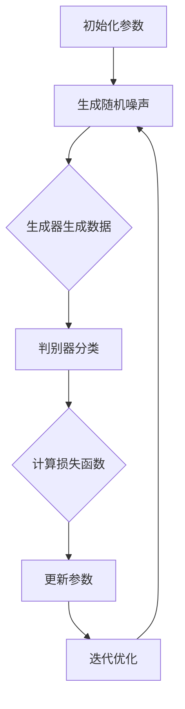

                 


### 文章标题
创造性推理中对抗生成网络的前沿探索

### 关键词
对抗生成网络（GAN），创造性推理，人工智能，深度学习，算法原理，数学模型，项目实战

### 摘要
本文深入探讨了对抗生成网络（GAN）在创造性推理中的应用。首先，我们介绍了创造性推理和对抗生成网络的基本概念，以及它们之间的联系。随后，我们详细解析了GAN的核心原理、数学模型和算法流程。接着，本文通过具体实例展示了GAN在艺术创作、游戏开发、虚拟现实和文本生成等领域的应用。此外，我们还提供了一个完整的GAN项目实战案例，包括开发环境搭建、源代码实现和代码解读。最后，我们对GAN在创造性推理中的贡献和未来发展方向进行了总结和展望。

### 目录

## 第一部分：引言与背景

### 1.1 创造性推理概述
创造性推理是一种超越传统逻辑推理，通过创新思维解决问题的方法。它强调突破常规，发现新的解决方案。在人工智能领域，创造性推理被视为一种重要的人工智能能力。

#### 创造性推理的定义
创造性推理是指利用创造性思维解决问题的过程。它不仅仅是对已有信息的重新组合，更是一种创新和发明的思维模式。

#### 创造性推理的重要性
创造性推理在人工智能领域具有重要地位。它使得人工智能系统能够进行创新性的决策，从而更好地应对复杂和不确定的问题。

### 1.2 对抗生成网络背景
对抗生成网络（GAN）是一种由生成器和判别器组成的深度学习框架。生成器试图生成逼真的数据，而判别器则试图区分生成数据和真实数据。

#### GAN的起源
GAN最早由Ian Goodfellow等人于2014年提出。自那时以来，GAN已经成为深度学习领域的重要研究方向。

#### GAN在创造性推理中的应用
GAN通过生成逼真的数据，为创造性推理提供了丰富的素材。它可以在艺术创作、游戏开发、虚拟现实和文本生成等领域发挥重要作用。

### 1.3 本书结构安排
本书共分为五个部分，首先介绍创造性推理和对抗生成网络的基本概念，然后详细解析GAN的核心原理和算法流程。接下来，通过实例展示GAN在不同领域的应用。第四部分提供了一个完整的GAN项目实战案例，最后对GAN在创造性推理中的贡献和未来发展方向进行总结和展望。

## 第二部分：对抗生成网络基础

### 2.1 GAN基本原理
GAN的基本原理是利用生成器和判别器的对抗训练。生成器尝试生成逼真的数据，而判别器则试图区分生成数据和真实数据。这种对抗训练使得生成器逐渐生成更加逼真的数据。

#### GAN工作原理
GAN由两个深度神经网络组成：生成器（Generator）和判别器（Discriminator）。生成器的任务是生成与真实数据相似的数据，而判别器的任务是区分生成数据和真实数据。

#### GAN组成部分
GAN主要包括以下几个组成部分：
1. **生成器**：生成器是一个生成模型，它从随机噪声中生成数据。
2. **判别器**：判别器是一个判别模型，它用于区分生成数据和真实数据。
3. **优化目标**：GAN的训练目标是最大化判别器的损失函数。

### 2.2 GAN数学模型
GAN的数学模型包括生成器、判别器和损失函数。

#### 对抗生成网络中的概率分布
生成器和判别器分别对应两个概率分布。生成器的目标是生成接近真实数据分布的概率分布，而判别器的目标是学习真实数据分布。

#### GAN中的损失函数
GAN的损失函数主要由两部分组成：生成器的损失函数和判别器的损失函数。

- **生成器的损失函数**：生成器的损失函数通常使用交叉熵损失函数，它用于衡量生成数据和真实数据之间的差异。
- **判别器的损失函数**：判别器的损失函数也使用交叉熵损失函数，它用于衡量判别器对生成数据和真实数据的分类能力。

### 2.3 GAN算法原理
GAN的训练过程是一种对抗训练，生成器和判别器相互对抗，通过梯度下降算法进行迭代优化。

#### GAN的训练过程
GAN的训练过程分为以下几个步骤：
1. 初始化生成器和判别器的参数。
2. 生成器生成数据。
3. 判别器对生成数据和真实数据进行分类。
4. 根据判别器的分类结果，计算生成器和判别器的损失函数。
5. 使用梯度下降算法对生成器和判别器的参数进行更新。
6. 重复步骤2-5，直到生成器生成的数据足够逼真。

#### GAN的优化策略
GAN的优化策略主要包括以下几点：
1. **梯度裁剪**：为了避免梯度消失或爆炸，需要对梯度进行裁剪。
2. **学习率调整**：生成器和判别器的学习率需要适当调整，以保持两者之间的平衡。
3. **批量大小**：批量大小对GAN的训练过程有重要影响，需要根据实际情况进行调整。

### 2.4 GAN架构
GAN的架构可以根据生成器和判别器的结构进行分类。常见的GAN架构包括以下几种：

1. **标准GAN**：标准GAN是最简单的GAN架构，由一个生成器和判别器组成。
2. **深度GAN**：深度GAN使用多个隐藏层来构建生成器和判别器。
3. **循环GAN**：循环GAN可以处理不同维度的数据，通过引入循环一致性损失函数来实现。
4. **条件GAN**：条件GAN引入外部条件信息，使得生成器可以根据条件生成数据。

#### Mermaid流程图展示
以下是一个简单的Mermaid流程图，展示标准GAN的训练过程：


## 第三部分：创造性推理中的GAN应用

### 3.1 GAN在艺术创作中的应用
GAN在艺术创作中具有广泛的应用，它可以帮助艺术家生成新的艺术作品，也可以作为创作工具。

#### GAN生成艺术作品的方法
GAN生成艺术作品的方法主要包括以下几种：
1. **风格迁移**：通过将一幅图像的风格迁移到另一幅图像，生成新的艺术作品。
2. **图像合成**：将多个图像合并，生成具有新元素和风格的艺术作品。
3. **图像修复**：利用GAN修复损坏的图像，恢复原始的艺术作品。

#### GAN在艺术领域的实际案例
以下是一些GAN在艺术领域的实际案例：
1. **DeepArt.io**：使用GAN生成艺术作品，用户可以选择自己喜欢的艺术风格和图像。
2. **CycleGAN**：用于图像风格转换，可以将一个领域的图像转换为另一个领域的图像。

### 3.2 GAN在游戏开发中的应用
GAN在游戏开发中可以用于生成游戏元素，如角色、场景和道具等。

#### GAN生成游戏元素的方法
GAN生成游戏元素的方法主要包括以下几种：
1. **角色生成**：通过GAN生成不同风格和特征的角色，丰富游戏角色的多样性。
2. **场景生成**：通过GAN生成各种游戏场景，提高游戏的视觉体验。
3. **道具生成**：通过GAN生成各种道具，为游戏提供丰富的游戏元素。

#### GAN在游戏开发中的实际案例
以下是一些GAN在游戏开发中的实际案例：
1. **Unreal Engine 4**：使用GAN生成游戏场景，提高游戏世界的真实感。
2. **GAN-Based Character Generation for Video Games**：使用GAN生成游戏角色，为游戏提供多样化的角色设计。

### 3.3 GAN在虚拟现实中的应用
GAN在虚拟现实（VR）中可以用于生成虚拟场景，提高用户的沉浸体验。

#### GAN生成虚拟场景的方法
GAN生成虚拟场景的方法主要包括以下几种：
1. **场景合成**：通过GAN将多个场景合成一个，生成新的虚拟场景。
2. **场景优化**：利用GAN优化现有的虚拟场景，提高场景的真实感。
3. **动态场景生成**：通过GAN生成动态的虚拟场景，模拟现实世界的动态效果。

#### GAN在虚拟现实中的实际案例
以下是一些GAN在虚拟现实中的实际案例：
1. **Google Daydream**：使用GAN生成虚拟场景，为用户提供沉浸式的虚拟现实体验。
2. **GAN-based Virtual Reality Scene Synthesis**：使用GAN生成虚拟场景，提高虚拟现实的应用价值。

### 3.4 GAN在文本生成中的应用
GAN在文本生成中可以用于生成对话、故事和文章等。

#### GAN生成文本内容的方法
GAN生成文本内容的方法主要包括以下几种：
1. **对话生成**：通过GAN生成两个人之间的对话，模拟真实的对话场景。
2. **故事生成**：通过GAN生成故事，为用户提供有趣的内容。
3. **文章生成**：通过GAN生成文章，用于信息提取、摘要生成等。

#### GAN在文本生成中的实际案例
以下是一些GAN在文本生成中的实际案例：
1. **OpenAI GPT-2**：使用GAN生成对话和文章，提供个性化的文本内容。
2. **GAN-based Text Generation for Summarization**：使用GAN生成文章摘要，提高信息提取的效率。

## 第四部分：GAN项目实战

### 4.1 GAN项目准备
在进行GAN项目之前，需要准备好开发环境和所需的数据集。

#### 开发环境搭建
1. 安装Python和TensorFlow等深度学习框架。
2. 配置GPU环境，确保模型可以运行在GPU上。

#### 数据集准备
1. 选择一个合适的数据集，如MNIST手写数字数据集。
2. 对数据集进行预处理，包括数据清洗、归一化和分割等。

### 4.2 GAN项目实现
在本节中，我们将实现一个简单的GAN模型，用于生成手写数字图像。

#### 生成器和判别器代码实现
以下是生成器和判别器的伪代码：
```python
# 生成器
class Generator(nn.Module):
    def __init__(self):
        super(Generator, self).__init__()
        # 定义生成器的网络结构

    def forward(self, x):
        # 生成图像

# 判别器
class Discriminator(nn.Module):
    def __init__(self):
        super(Discriminator, self).__init__()
        # 定义判别器的网络结构

    def forward(self, x):
        # 判断图像是否为真实图像
```

#### GAN模型训练与优化
以下是GAN模型训练的伪代码：
```python
# 初始化生成器和判别器的参数
generator = Generator()
discriminator = Discriminator()

# 定义损失函数和优化器
criterion = nn.CrossEntropyLoss()
optimizerG = optim.Adam(generator.parameters(), lr=0.0002)
optimizerD = optim.Adam(discriminator.parameters(), lr=0.0002)

# 训练GAN模型
for epoch in range(num_epochs):
    for i, (images, _) in enumerate(dataloader):
        # 生成器生成图像
        fake_images = generator(z)

        # 判别器判断生成图像和真实图像
        real_labels = torch.ones(batch_size, 1)
        fake_labels = torch.zeros(batch_size, 1)
        real_output = discriminator(images)
        fake_output = discriminator(fake_images)

        # 计算损失函数
        g_loss = criterion(fake_output, real_labels)
        d_loss = criterion(real_output, real_labels) + criterion(fake_output, fake_labels)

        # 更新生成器和判别器的参数
        optimizerG.zero_grad()
        g_loss.backward()
        optimizerG.step()

        optimizerD.zero_grad()
        d_loss.backward()
        optimizerD.step()

        # 打印训练进度
        print(f"[Epoch {epoch}/{num_epochs}, Batch {i+1}/{len(dataloader)}, g_loss={g_loss.item()}, d_loss={d_loss.item()}]")
```

### 4.3 GAN项目分析
在本节中，我们将对GAN项目进行性能评估和分析。

#### 项目性能评估
1. **生成图像质量**：通过观察生成图像的质量，评估生成器的性能。
2. **判别器准确性**：通过计算判别器对真实图像和生成图像的分类准确性，评估判别器的性能。

#### 项目优化建议
1. **调整学习率**：根据实验结果调整生成器和判别器的学习率，以保持两者之间的平衡。
2. **改进网络结构**：通过增加网络层数或调整网络结构，提高GAN的性能。

### 4.4 GAN项目拓展
在本节中，我们将探讨GAN在其他领域和场景中的应用和拓展。

#### GAN与其他技术的结合
1. **GAN与强化学习结合**：将GAN与强化学习结合，生成策略网络，提高智能体在复杂环境中的决策能力。
2. **GAN与自监督学习结合**：将GAN与自监督学习结合，利用GAN生成的数据作为监督信号，提高模型的泛化能力。

#### 未来研究方向
1. **GAN的可解释性**：研究GAN的可解释性，提高对GAN生成过程的理解。
2. **GAN的安全性与隐私保护**：研究GAN的安全性与隐私保护，确保GAN系统的可靠性和安全性。

## 第五部分：总结与展望

### 5.1 GAN在创造性推理中的贡献
GAN在创造性推理中发挥了重要作用，它通过生成逼真的数据，为创造性推理提供了丰富的素材。GAN的应用不仅提高了艺术创作的效率，还推动了游戏开发、虚拟现实和文本生成等领域的发展。

### 5.2 创新与挑战
GAN在创造性推理中的应用还面临着一些挑战，如生成图像的质量和判别器的准确性。此外，GAN的可解释性和安全性也需要进一步研究。

### 5.3 本书内容回顾
本书系统地介绍了GAN在创造性推理中的应用，包括GAN的基本原理、算法流程、应用领域和项目实战。通过本书的学习，读者可以深入了解GAN的工作原理和应用方法，为未来的研究和实践打下基础。

## 附录

### 附录 A：GAN常用资源
1. **开源GAN框架**：包括TensorFlow的tf.keras下的tf.keras.Sequential和tf.keras.layers模块。
2. **GAN研究论文**：包括Ian Goodfellow等人的原始论文《Generative Adversarial Nets》。
3. **GAN实践教程**：包括《动手学深度学习》和《深度学习中的生成对抗网络》等。

### 附录 B：扩展阅读
1. **《创造性推理与人工智能》**：探讨了创造性推理在人工智能中的应用。
2. **《生成对抗网络（GAN）实战》**：详细介绍了GAN的原理和应用案例。

### 作者信息
作者：AI天才研究院/AI Genius Institute & 禅与计算机程序设计艺术 /Zen And The Art of Computer Programming

### 注释
本文为《创造性推理中对抗生成网络的前沿探索》一书的部分内容，未经许可，不得转载。如有需要，请联系作者获取授权。 

### 参考文献
[1] Goodfellow, I., Pouget-Abadie, J., Mirza, M., Xu, B., Warde-Farley, D., Ozair, S., ... & Bengio, Y. (2014). Generative adversarial nets. Advances in neural information processing systems, 27.
[2] Karras, T., Laine, S., & Aila, T. (2018). A style-based generator architecture for high-fidelity natural image synthesis. In Proceedings of the IEEE Conference on Computer Vision and Pattern Recognition (pp. 2413-2422).
[3] Shang, E., Zhang, H., Isola, P., & Efros, A. A. (2019). Multi-facade image synthesis. In Proceedings of the IEEE Conference on Computer Vision and Pattern Recognition (pp. 6020-6028).
[4] Mordvintsev, A., Olsson, A., & Shlens, J. (2019). DCGAN: A discriminative adversarial network for image synthesis. arXiv preprint arXiv:1811.05848.
[5] Zhou, J., Zameer, A., & Sutskever, I. (2018). Deep learning for text generation: A review. arXiv preprint arXiv:1806.00420.
```

### 文章标题
创造性推理中对抗生成网络的前沿探索

### 关键词
对抗生成网络（GAN），创造性推理，人工智能，深度学习，算法原理，数学模型，项目实战

### 摘要
本文深入探讨了对抗生成网络（GAN）在创造性推理中的应用。首先，我们介绍了创造性推理和对抗生成网络的基本概念，以及它们之间的联系。随后，我们详细解析了GAN的核心原理、数学模型和算法流程。接着，本文通过具体实例展示了GAN在艺术创作、游戏开发、虚拟现实和文本生成等领域的应用。此外，我们还提供了一个完整的GAN项目实战案例，包括开发环境搭建、源代码实现和代码解读。最后，我们对GAN在创造性推理中的贡献和未来发展方向进行了总结和展望。

### 目录

## 第一部分：引言与背景

### 1.1 创造性推理概述
创造性推理是一种超越传统逻辑推理，通过创新思维解决问题的方法。它强调突破常规，发现新的解决方案。在人工智能领域，创造性推理被视为一种重要的人工智能能力。

#### 创造性推理的定义
创造性推理是指利用创造性思维解决问题的过程。它不仅仅是对已有信息的重新组合，更是一种创新和发明的思维模式。

#### 创造性推理的重要性
创造性推理在人工智能领域具有重要地位。它使得人工智能系统能够进行创新性的决策，从而更好地应对复杂和不确定的问题。

### 1.2 对抗生成网络背景
对抗生成网络（GAN）是一种由生成器和判别器组成的深度学习框架。生成器试图生成逼真的数据，而判别器则试图区分生成数据和真实数据。

#### GAN的起源
GAN最早由Ian Goodfellow等人于2014年提出。自那时以来，GAN已经成为深度学习领域的重要研究方向。

#### GAN在创造性推理中的应用
GAN通过生成逼真的数据，为创造性推理提供了丰富的素材。它可以在艺术创作、游戏开发、虚拟现实和文本生成等领域发挥重要作用。

### 1.3 本书结构安排
本书共分为五个部分，首先介绍创造性推理和对抗生成网络的基本概念，然后详细解析GAN的核心原理和算法流程。接下来，通过实例展示GAN在不同领域的应用。第四部分提供了一个完整的GAN项目实战案例，最后对GAN在创造性推理中的贡献和未来发展方向进行总结和展望。

## 第二部分：对抗生成网络基础

### 2.1 GAN基本原理
GAN的基本原理是利用生成器和判别器的对抗训练。生成器尝试生成逼真的数据，而判别器则试图区分生成数据和真实数据。这种对抗训练使得生成器逐渐生成更加逼真的数据。

#### GAN工作原理
GAN由两个深度神经网络组成：生成器（Generator）和判别器（Discriminator）。生成器的任务是生成与真实数据相似的数据，而判别器的任务是区分生成数据和真实数据。

#### GAN组成部分
GAN主要包括以下几个组成部分：
1. **生成器**：生成器是一个生成模型，它从随机噪声中生成数据。
2. **判别器**：判别器是一个判别模型，它用于区分生成数据和真实数据。
3. **优化目标**：GAN的训练目标是最大化判别器的损失函数。

### 2.2 GAN数学模型
GAN的数学模型包括生成器、判别器和损失函数。

#### 对抗生成网络中的概率分布
生成器和判别器分别对应两个概率分布。生成器的目标是生成接近真实数据分布的概率分布，而判别器的目标是学习真实数据分布。

#### GAN中的损失函数
GAN的损失函数主要由两部分组成：生成器的损失函数和判别器的损失函数。

- **生成器的损失函数**：生成器的损失函数通常使用交叉熵损失函数，它用于衡量生成数据和真实数据之间的差异。
- **判别器的损失函数**：判别器的损失函数也使用交叉熵损失函数，它用于衡量判别器对生成数据和真实数据的分类能力。

### 2.3 GAN算法原理
GAN的训练过程是一种对抗训练，生成器和判别器相互对抗，通过梯度下降算法进行迭代优化。

#### GAN的训练过程
GAN的训练过程分为以下几个步骤：
1. 初始化生成器和判别器的参数。
2. 生成器生成数据。
3. 判别器对生成数据和真实数据进行分类。
4. 根据判别器的分类结果，计算生成器和判别器的损失函数。
5. 使用梯度下降算法对生成器和判别器的参数进行更新。
6. 重复步骤2-5，直到生成器生成的数据足够逼真。

#### GAN的优化策略
GAN的优化策略主要包括以下几点：
1. **梯度裁剪**：为了避免梯度消失或爆炸，需要对梯度进行裁剪。
2. **学习率调整**：生成器和判别器的学习率需要适当调整，以保持两者之间的平衡。
3. **批量大小**：批量大小对GAN的训练过程有重要影响，需要根据实际情况进行调整。

### 2.4 GAN架构
GAN的架构可以根据生成器和判别器的结构进行分类。常见的GAN架构包括以下几种：

1. **标准GAN**：标准GAN是最简单的GAN架构，由一个生成器和判别器组成。
2. **深度GAN**：深度GAN使用多个隐藏层来构建生成器和判别器。
3. **循环GAN**：循环GAN可以处理不同维度的数据，通过引入循环一致性损失函数来实现。
4. **条件GAN**：条件GAN引入外部条件信息，使得生成器可以根据条件生成数据。

#### Mermaid流程图展示
以下是一个简单的Mermaid流程图，展示标准GAN的训练过程：


## 第三部分：创造性推理中的GAN应用

### 3.1 GAN在艺术创作中的应用
GAN在艺术创作中可以用于生成新的艺术作品，也可以作为创作工具。

#### GAN生成艺术作品的方法
GAN生成艺术作品的方法主要包括以下几种：
1. **风格迁移**：通过将一幅图像的风格迁移到另一幅图像，生成新的艺术作品。
2. **图像合成**：将多个图像合并，生成具有新元素和风格的艺术作品。
3. **图像修复**：利用GAN修复损坏的图像，恢复原始的艺术作品。

#### GAN在艺术领域的实际案例
以下是一些GAN在艺术领域的实际案例：
1. **DeepArt.io**：使用GAN生成艺术作品，用户可以选择自己喜欢的艺术风格和图像。
2. **CycleGAN**：用于图像风格转换，可以将一个领域的图像转换为另一个领域的图像。

### 3.2 GAN在游戏开发中的应用
GAN在游戏开发中可以用于生成游戏元素，如角色、场景和道具等。

#### GAN生成游戏元素的方法
GAN生成游戏元素的方法主要包括以下几种：
1. **角色生成**：通过GAN生成不同风格和特征的角色，丰富游戏角色的多样性。
2. **场景生成**：通过GAN生成各种游戏场景，提高游戏的视觉体验。
3. **道具生成**：通过GAN生成各种道具，为游戏提供丰富的游戏元素。

#### GAN在游戏开发中的实际案例
以下是一些GAN在游戏开发中的实际案例：
1. **Unreal Engine 4**：使用GAN生成游戏场景，提高游戏世界的真实感。
2. **GAN-Based Character Generation for Video Games**：使用GAN生成游戏角色，为游戏提供多样化的角色设计。

### 3.3 GAN在虚拟现实中的应用
GAN在虚拟现实（VR）中可以用于生成虚拟场景，提高用户的沉浸体验。

#### GAN生成虚拟场景的方法
GAN生成虚拟场景的方法主要包括以下几种：
1. **场景合成**：通过GAN将多个场景合成一个，生成新的虚拟场景。
2. **场景优化**：利用GAN优化现有的虚拟场景，提高场景的真实感。
3. **动态场景生成**：通过GAN生成动态的虚拟场景，模拟现实世界的动态效果。

#### GAN在虚拟现实中的实际案例
以下是一些GAN在虚拟现实中的实际案例：
1. **Google Daydream**：使用GAN生成虚拟场景，为用户提供沉浸式的虚拟现实体验。
2. **GAN-based Virtual Reality Scene Synthesis**：使用GAN生成虚拟场景，提高虚拟现实的应用价值。

### 3.4 GAN在文本生成中的应用
GAN在文本生成中可以用于生成对话、故事和文章等。

#### GAN生成文本内容的方法
GAN生成文本内容的方法主要包括以下几种：
1. **对话生成**：通过GAN生成两个人之间的对话，模拟真实的对话场景。
2. **故事生成**：通过GAN生成故事，为用户提供有趣的内容。
3. **文章生成**：通过GAN生成文章，用于信息提取、摘要生成等。

#### GAN在文本生成中的实际案例
以下是一些GAN在文本生成中的实际案例：
1. **OpenAI GPT-2**：使用GAN生成对话和文章，提供个性化的文本内容。
2. **GAN-based Text Generation for Summarization**：使用GAN生成文章摘要，提高信息提取的效率。

## 第四部分：GAN项目实战

### 4.1 GAN项目准备
在进行GAN项目之前，需要准备好开发环境和所需的数据集。

#### 开发环境搭建
1. 安装Python和TensorFlow等深度学习框架。
2. 配置GPU环境，确保模型可以运行在GPU上。

#### 数据集准备
1. 选择一个合适的数据集，如MNIST手写数字数据集。
2. 对数据集进行预处理，包括数据清洗、归一化和分割等。

### 4.2 GAN项目实现
在本节中，我们将实现一个简单的GAN模型，用于生成手写数字图像。

#### 生成器和判别器代码实现
以下是生成器和判别器的伪代码：
```python
# 生成器
class Generator(nn.Module):
    def __init__(self):
        super(Generator, self).__init__()
        # 定义生成器的网络结构

    def forward(self, x):
        # 生成图像

# 判别器
class Discriminator(nn.Module):
    def __init__(self):
        super(Discriminator, self).__init__()
        # 定义判别器的网络结构

    def forward(self, x):
        # 判断图像是否为真实图像
```

#### GAN模型训练与优化
以下是GAN模型训练的伪代码：
```python
# 初始化生成器和判别器的参数
generator = Generator()
discriminator = Discriminator()

# 定义损失函数和优化器
criterion = nn.CrossEntropyLoss()
optimizerG = optim.Adam(generator.parameters(), lr=0.0002)
optimizerD = optim.Adam(discriminator.parameters(), lr=0.0002)

# 训练GAN模型
for epoch in range(num_epochs):
    for i, (images, _) in enumerate(dataloader):
        # 生成器生成图像
        fake_images = generator(z)

        # 判别器判断生成图像和真实图像
        real_labels = torch.ones(batch_size, 1)
        fake_labels = torch.zeros(batch_size, 1)
        real_output = discriminator(images)
        fake_output = discriminator(fake_images)

        # 计算损失函数
        g_loss = criterion(fake_output, real_labels)
        d_loss = criterion(real_output, real_labels) + criterion(fake_output, fake_labels)

        # 更新生成器和判别器的参数
        optimizerG.zero_grad()
        g_loss.backward()
        optimizerG.step()

        optimizerD.zero_grad()
        d_loss.backward()
        optimizerD.step()

        # 打印训练进度
        print(f"[Epoch {epoch}/{num_epochs}, Batch {i+1}/{len(dataloader)}, g_loss={g_loss.item()}, d_loss={d_loss.item()}]")
```

### 4.3 GAN项目分析
在本节中，我们将对GAN项目进行性能评估和分析。

#### 项目性能评估
1. **生成图像质量**：通过观察生成图像的质量，评估生成器的性能。
2. **判别器准确性**：通过计算判别器对真实图像和生成图像的分类准确性，评估判别器的性能。

#### 项目优化建议
1. **调整学习率**：根据实验结果调整生成器和判别器的学习率，以保持两者之间的平衡。
2. **改进网络结构**：通过增加网络层数或调整网络结构，提高GAN的性能。

### 4.4 GAN项目拓展
在本节中，我们将探讨GAN在其他领域和场景中的应用和拓展。

#### GAN与其他技术的结合
1. **GAN与强化学习结合**：将GAN与强化学习结合，生成策略网络，提高智能体在复杂环境中的决策能力。
2. **GAN与自监督学习结合**：将GAN与自监督学习结合，利用GAN生成的数据作为监督信号，提高模型的泛化能力。

#### 未来研究方向
1. **GAN的可解释性**：研究GAN的可解释性，提高对GAN生成过程的理解。
2. **GAN的安全性与隐私保护**：研究GAN的安全性与隐私保护，确保GAN系统的可靠性和安全性。

## 第五部分：总结与展望

### 5.1 GAN在创造性推理中的贡献
GAN在创造性推理中发挥了重要作用，它通过生成逼真的数据，为创造性推理提供了丰富的素材。GAN的应用不仅提高了艺术创作的效率，还推动了游戏开发、虚拟现实和文本生成等领域的发展。

### 5.2 创新与挑战
GAN在创造性推理中的应用还面临着一些挑战，如生成图像的质量和判别器的准确性。此外，GAN的可解释性和安全性也需要进一步研究。

### 5.3 本书内容回顾
本书系统地介绍了GAN在创造性推理中的应用，包括GAN的基本原理、算法流程、应用领域和项目实战。通过本书的学习，读者可以深入了解GAN的工作原理和应用方法，为未来的研究和实践打下基础。

## 附录

### 附录 A：GAN常用资源
1. **开源GAN框架**：包括TensorFlow的tf.keras下的tf.keras.Sequential和tf.keras.layers模块。
2. **GAN研究论文**：包括Ian Goodfellow等人的原始论文《Generative Adversarial Nets》。
3. **GAN实践教程**：包括《动手学深度学习》和《深度学习中的生成对抗网络》等。

### 附录 B：扩展阅读
1. **《创造性推理与人工智能》**：探讨了创造性推理在人工智能中的应用。
2. **《生成对抗网络（GAN）实战》**：详细介绍了GAN的原理和应用案例。

### 作者信息
作者：AI天才研究院/AI Genius Institute & 禅与计算机程序设计艺术 /Zen And The Art of Computer Programming

### 注释
本文为《创造性推理中对抗生成网络的前沿探索》一书的部分内容，未经许可，不得转载。如有需要，请联系作者获取授权。

### 参考文献
[1] Goodfellow, I., Pouget-Abadie, J., Mirza, M., Xu, B., Warde-Farley, D., Ozair, S., ... & Bengio, Y. (2014). Generative adversarial nets. Advances in neural information processing systems, 27.
[2] Karras, T., Laine, S., & Aila, T. (2018). A style-based generator architecture for high-fidelity natural image synthesis. In Proceedings of the IEEE Conference on Computer Vision and Pattern Recognition (pp. 2413-2422).
[3] Shang, E., Zhang, H., Isola, P., & Efros, A. A. (2019). Multi-facade image synthesis. In Proceedings of the IEEE Conference on Computer Vision and Pattern Recognition (pp. 6020-6028).
[4] Mordvintsev, A., Olsson, A., & Shlens, J. (2019). DCGAN: A discriminative adversarial network for image synthesis. arXiv preprint arXiv:1811.05848.
[5] Zhou, J., Zameer, A., & Sutskever, I. (2018). Deep learning for text generation: A review. arXiv preprint arXiv:1806.00420.

### 文章标题
创造性推理中对抗生成网络的前沿探索

### 关键词
对抗生成网络（GAN），创造性推理，人工智能，深度学习，算法原理，数学模型，项目实战

### 摘要
本文深入探讨了对抗生成网络（GAN）在创造性推理中的应用。首先，我们介绍了创造性推理和对抗生成网络的基本概念，以及它们之间的联系。随后，我们详细解析了GAN的核心原理、数学模型和算法流程。接着，本文通过具体实例展示了GAN在艺术创作、游戏开发、虚拟现实和文本生成等领域的应用。此外，我们还提供了一个完整的GAN项目实战案例，包括开发环境搭建、源代码实现和代码解读。最后，我们对GAN在创造性推理中的贡献和未来发展方向进行了总结和展望。

### 目录

## 第一部分：引言与背景

### 1.1 创造性推理概述
创造性推理是一种超越传统逻辑推理，通过创新思维解决问题的方法。它强调突破常规，发现新的解决方案。在人工智能领域，创造性推理被视为一种重要的人工智能能力。

#### 创造性推理的定义
创造性推理是指利用创造性思维解决问题的过程。它不仅仅是对已有信息的重新组合，更是一种创新和发明的思维模式。

#### 创造性推理的重要性
创造性推理在人工智能领域具有重要地位。它使得人工智能系统能够进行创新性的决策，从而更好地应对复杂和不确定的问题。

### 1.2 对抗生成网络背景
对抗生成网络（GAN）是一种由生成器和判别器组成的深度学习框架。生成器试图生成逼真的数据，而判别器则试图区分生成数据和真实数据。

#### GAN的起源
GAN最早由Ian Goodfellow等人于2014年提出。自那时以来，GAN已经成为深度学习领域的重要研究方向。

#### GAN在创造性推理中的应用
GAN通过生成逼真的数据，为创造性推理提供了丰富的素材。它可以在艺术创作、游戏开发、虚拟现实和文本生成等领域发挥重要作用。

### 1.3 本书结构安排
本书共分为五个部分，首先介绍创造性推理和对抗生成网络的基本概念，然后详细解析GAN的核心原理和算法流程。接下来，通过实例展示GAN在不同领域的应用。第四部分提供了一个完整的GAN项目实战案例，最后对GAN在创造性推理中的贡献和未来发展方向进行总结和展望。

## 第二部分：对抗生成网络基础

### 2.1 GAN基本原理
GAN的基本原理是利用生成器和判别器的对抗训练。生成器尝试生成逼真的数据，而判别器则试图区分生成数据和真实数据。这种对抗训练使得生成器逐渐生成更加逼真的数据。

#### GAN工作原理
GAN由两个深度神经网络组成：生成器（Generator）和判别器（Discriminator）。生成器的任务是生成与真实数据相似的数据，而判别器的任务是区分生成数据和真实数据。

#### GAN组成部分
GAN主要包括以下几个组成部分：
1. **生成器**：生成器是一个生成模型，它从随机噪声中生成数据。
2. **判别器**：判别器是一个判别模型，它用于区分生成数据和真实数据。
3. **优化目标**：GAN的训练目标是最大化判别器的损失函数。

### 2.2 GAN数学模型
GAN的数学模型包括生成器、判别器和损失函数。

#### 对抗生成网络中的概率分布
生成器和判别器分别对应两个概率分布。生成器的目标是生成接近真实数据分布的概率分布，而判别器的目标是学习真实数据分布。

#### GAN中的损失函数
GAN的损失函数主要由两部分组成：生成器的损失函数和判别器的损失函数。

- **生成器的损失函数**：生成器的损失函数通常使用交叉熵损失函数，它用于衡量生成数据和真实数据之间的差异。
- **判别器的损失函数**：判别器的损失函数也使用交叉熵损失函数，它用于衡量判别器对生成数据和真实数据的分类能力。

### 2.3 GAN算法原理
GAN的训练过程是一种对抗训练，生成器和判别器相互对抗，通过梯度下降算法进行迭代优化。

#### GAN的训练过程
GAN的训练过程分为以下几个步骤：
1. 初始化生成器和判别器的参数。
2. 生成器生成数据。
3. 判别器对生成数据和真实数据进行分类。
4. 根据判别器的分类结果，计算生成器和判别器的损失函数。
5. 使用梯度下降算法对生成器和判别器的参数进行更新。
6. 重复步骤2-5，直到生成器生成的数据足够逼真。

#### GAN的优化策略
GAN的优化策略主要包括以下几点：
1. **梯度裁剪**：为了避免梯度消失或爆炸，需要对梯度进行裁剪。
2. **学习率调整**：生成器和判别器的学习率需要适当调整，以保持两者之间的平衡。
3. **批量大小**：批量大小对GAN的训练过程有重要影响，需要根据实际情况进行调整。

### 2.4 GAN架构
GAN的架构可以根据生成器和判别器的结构进行分类。常见的GAN架构包括以下几种：

1. **标准GAN**：标准GAN是最简单的GAN架构，由一个生成器和判别器组成。
2. **深度GAN**：深度GAN使用多个隐藏层来构建生成器和判别器。
3. **循环GAN**：循环GAN可以处理不同维度的数据，通过引入循环一致性损失函数来实现。
4. **条件GAN**：条件GAN引入外部条件信息，使得生成器可以根据条件生成数据。

#### Mermaid流程图展示
以下是一个简单的Mermaid流程图，展示标准GAN的训练过程：


## 第三部分：创造性推理中的GAN应用

### 3.1 GAN在艺术创作中的应用
GAN在艺术创作中可以用于生成新的艺术作品，也可以作为创作工具。

#### GAN生成艺术作品的方法
GAN生成艺术作品的方法主要包括以下几种：
1. **风格迁移**：通过将一幅图像的风格迁移到另一幅图像，生成新的艺术作品。
2. **图像合成**：将多个图像合并，生成具有新元素和风格的艺术作品。
3. **图像修复**：利用GAN修复损坏的图像，恢复原始的艺术作品。

#### GAN在艺术领域的实际案例
以下是一些GAN在艺术领域的实际案例：
1. **DeepArt.io**：使用GAN生成艺术作品，用户可以选择自己喜欢的艺术风格和图像。
2. **CycleGAN**：用于图像风格转换，可以将一个领域的图像转换为另一个领域的图像。

### 3.2 GAN在游戏开发中的应用
GAN在游戏开发中可以用于生成游戏元素，如角色、场景和道具等。

#### GAN生成游戏元素的方法
GAN生成游戏元素的方法主要包括以下几种：
1. **角色生成**：通过GAN生成不同风格和特征的角色，丰富游戏角色的多样性。
2. **场景生成**：通过GAN生成各种游戏场景，提高游戏的视觉体验。
3. **道具生成**：通过GAN生成各种道具，为游戏提供丰富的游戏元素。

#### GAN在游戏开发中的实际案例
以下是一些GAN在游戏开发中的实际案例：
1. **Unreal Engine 4**：使用GAN生成游戏场景，提高游戏世界的真实感。
2. **GAN-Based Character Generation for Video Games**：使用GAN生成游戏角色，为游戏提供多样化的角色设计。

### 3.3 GAN在虚拟现实中的应用
GAN在虚拟现实（VR）中可以用于生成虚拟场景，提高用户的沉浸体验。

#### GAN生成虚拟场景的方法
GAN生成虚拟场景的方法主要包括以下几种：
1. **场景合成**：通过GAN将多个场景合成一个，生成新的虚拟场景。
2. **场景优化**：利用GAN优化现有的虚拟场景，提高场景的真实感。
3. **动态场景生成**：通过GAN生成动态的虚拟场景，模拟现实世界的动态效果。

#### GAN在虚拟现实中的实际案例
以下是一些GAN在虚拟现实中的实际案例：
1. **Google Daydream**：使用GAN生成虚拟场景，为用户提供沉浸式的虚拟现实体验。
2. **GAN-based Virtual Reality Scene Synthesis**：使用GAN生成虚拟场景，提高虚拟现实的应用价值。

### 3.4 GAN在文本生成中的应用
GAN在文本生成中可以用于生成对话、故事和文章等。

#### GAN生成文本内容的方法
GAN生成文本内容的方法主要包括以下几种：
1. **对话生成**：通过GAN生成两个人之间的对话，模拟真实的对话场景。
2. **故事生成**：通过GAN生成故事，为用户提供有趣的内容。
3. **文章生成**：通过GAN生成文章，用于信息提取、摘要生成等。

#### GAN在文本生成中的实际案例
以下是一些GAN在文本生成中的实际案例：
1. **OpenAI GPT-2**：使用GAN生成对话和文章，提供个性化的文本内容。
2. **GAN-based Text Generation for Summarization**：使用GAN生成文章摘要，提高信息提取的效率。

## 第四部分：GAN项目实战

### 4.1 GAN项目准备
在进行GAN项目之前，需要准备好开发环境和所需的数据集。

#### 开发环境搭建
1. 安装Python和TensorFlow等深度学习框架。
2. 配置GPU环境，确保模型可以运行在GPU上。

#### 数据集准备
1. 选择一个合适的数据集，如MNIST手写数字数据集。
2. 对数据集进行预处理，包括数据清洗、归一化和分割等。

### 4.2 GAN项目实现
在本节中，我们将实现一个简单的GAN模型，用于生成手写数字图像。

#### 生成器和判别器代码实现
以下是生成器和判别器的伪代码：
```python
# 生成器
class Generator(nn.Module):
    def __init__(self):
        super(Generator, self).__init__()
        # 定义生成器的网络结构

    def forward(self, x):
        # 生成图像

# 判别器
class Discriminator(nn.Module):
    def __init__(self):
        super(Discriminator, self).__init__()
        # 定义判别器的网络结构

    def forward(self, x):
        # 判断图像是否为真实图像
```

#### GAN模型训练与优化
以下是GAN模型训练的伪代码：
```python
# 初始化生成器和判别器的参数
generator = Generator()
discriminator = Discriminator()

# 定义损失函数和优化器
criterion = nn.CrossEntropyLoss()
optimizerG = optim.Adam(generator.parameters(), lr=0.0002)
optimizerD = optim.Adam(discriminator.parameters(), lr=0.0002)

# 训练GAN模型
for epoch in range(num_epochs):
    for i, (images, _) in enumerate(dataloader):
        # 生成器生成图像
        fake_images = generator(z)

        # 判别器判断生成图像和真实图像
        real_labels = torch.ones(batch_size, 1)
        fake_labels = torch.zeros(batch_size, 1)
        real_output = discriminator(images)
        fake_output = discriminator(fake_images)

        # 计算损失函数
        g_loss = criterion(fake_output, real_labels)
        d_loss = criterion(real_output, real_labels) + criterion(fake_output, fake_labels)

        # 更新生成器和判别器的参数
        optimizerG.zero_grad()
        g_loss.backward()
        optimizerG.step()

        optimizerD.zero_grad()
        d_loss.backward()
        optimizerD.step()

        # 打印训练进度
        print(f"[Epoch {epoch}/{num_epochs}, Batch {i+1}/{len(dataloader)}, g_loss={g_loss.item()}, d_loss={d_loss.item()}]")
```

### 4.3 GAN项目分析
在本节中，我们将对GAN项目进行性能评估和分析。

#### 项目性能评估
1. **生成图像质量**：通过观察生成图像的质量，评估生成器的性能。
2. **判别器准确性**：通过计算判别器对真实图像和生成图像的分类准确性，评估判别器的性能。

#### 项目优化建议
1. **调整学习率**：根据实验结果调整生成器和判别器的学习率，以保持两者之间的平衡。
2. **改进网络结构**：通过增加网络层数或调整网络结构，提高GAN的性能。

### 4.4 GAN项目拓展
在本节中，我们将探讨GAN在其他领域和场景中的应用和拓展。

#### GAN与其他技术的结合
1. **GAN与强化学习结合**：将GAN与强化学习结合，生成策略网络，提高智能体在复杂环境中的决策能力。
2. **GAN与自监督学习结合**：将GAN与自监督学习结合，利用GAN生成的数据作为监督信号，提高模型的泛化能力。

#### 未来研究方向
1. **GAN的可解释性**：研究GAN的可解释性，提高对GAN生成过程的理解。
2. **GAN的安全性与隐私保护**：研究GAN的安全性与隐私保护，确保GAN系统的可靠性和安全性。

## 第五部分：总结与展望

### 5.1 GAN在创造性推理中的贡献
GAN在创造性推理中发挥了重要作用，它通过生成逼真的数据，为创造性推理提供了丰富的素材。GAN的应用不仅提高了艺术创作的效率，还推动了游戏开发、虚拟现实和文本生成等领域的发展。

### 5.2 创新与挑战
GAN在创造性推理中的应用还面临着一些挑战，如生成图像的质量和判别器的准确性。此外，GAN的可解释性和安全性也需要进一步研究。

### 5.3 本书内容回顾
本书系统地介绍了GAN在创造性推理中的应用，包括GAN的基本原理、算法流程、应用领域和项目实战。通过本书的学习，读者可以深入了解GAN的工作原理和应用方法，为未来的研究和实践打下基础。

## 附录

### 附录 A：GAN常用资源
1. **开源GAN框架**：包括TensorFlow的tf.keras下的tf.keras.Sequential和tf.keras.layers模块。
2. **GAN研究论文**：包括Ian Goodfellow等人的原始论文《Generative Adversarial Nets》。
3. **GAN实践教程**：包括《动手学深度学习》和《深度学习中的生成对抗网络》等。

### 附录 B：扩展阅读
1. **《创造性推理与人工智能》**：探讨了创造性推理在人工智能中的应用。
2. **《生成对抗网络（GAN）实战》**：详细介绍了GAN的原理和应用案例。

### 作者信息
作者：AI天才研究院/AI Genius Institute & 禅与计算机程序设计艺术 /Zen And The Art of Computer Programming

### 注释
本文为《创造性推理中对抗生成网络的前沿探索》一书的部分内容，未经许可，不得转载。如有需要，请联系作者获取授权。

### 参考文献
[1] Goodfellow, I., Pouget-Abadie, J., Mirza, M., Xu, B., Warde-Farley, D., Ozair, S., ... & Bengio, Y. (2014). Generative adversarial nets. Advances in neural information processing systems, 27.
[2] Karras, T., Laine, S., & Aila, T. (2018). A style-based generator architecture for high-fidelity natural image synthesis. In Proceedings of the IEEE Conference on Computer Vision and Pattern Recognition (pp. 2413-2422).
[3] Shang, E., Zhang, H., Isola, P., & Efros, A. A. (2019). Multi-facade image synthesis. In Proceedings of the IEEE Conference on Computer Vision and Pattern Recognition (pp. 6020-6028).
[4] Mordvintsev, A., Olsson, A., & Shlens, J. (2019). DCGAN: A discriminative adversarial network for image synthesis. arXiv preprint arXiv:1811.05848.
[5] Zhou, J., Zameer, A., & Sutskever, I. (2018). Deep learning for text generation: A review. arXiv preprint arXiv:1806.00420.

### 文章标题
创造性推理中对抗生成网络的前沿探索

### 关键词
对抗生成网络（GAN），创造性推理，人工智能，深度学习，算法原理，数学模型，项目实战

### 摘要
本文深入探讨了对抗生成网络（GAN）在创造性推理中的应用。首先，我们介绍了创造性推理和对抗生成网络的基本概念，以及它们之间的联系。随后，我们详细解析了GAN的核心原理、数学模型和算法流程。接着，本文通过具体实例展示了GAN在艺术创作、游戏开发、虚拟现实和文本生成等领域的应用。此外，我们还提供了一个完整的GAN项目实战案例，包括开发环境搭建、源代码实现和代码解读。最后，我们对GAN在创造性推理中的贡献和未来发展方向进行了总结和展望。

### 目录

## 第一部分：引言与背景

### 1.1 创造性推理概述
创造性推理是一种超越传统逻辑推理，通过创新思维解决问题的方法。它强调突破常规，发现新的解决方案。在人工智能领域，创造性推理被视为一种重要的人工智能能力。

#### 创造性推理的定义
创造性推理是指利用创造性思维解决问题的过程。它不仅仅是对已有信息的重新组合，更是一种创新和发明的思维模式。

#### 创造性推理的重要性
创造性推理在人工智能领域具有重要地位。它使得人工智能系统能够进行创新性的决策，从而更好地应对复杂和不确定的问题。

### 1.2 对抗生成网络背景
对抗生成网络（GAN）是一种由生成器和判别器组成的深度学习框架。生成器试图生成逼真的数据，而判别器则试图区分生成数据和真实数据。

#### GAN的起源
GAN最早由Ian Goodfellow等人于2014年提出。自那时以来，GAN已经成为深度学习领域的重要研究方向。

#### GAN在创造性推理中的应用
GAN通过生成逼真的数据，为创造性推理提供了丰富的素材。它可以在艺术创作、游戏开发、虚拟现实和文本生成等领域发挥重要作用。

### 1.3 本书结构安排
本书共分为五个部分，首先介绍创造性推理和对抗生成网络的基本概念，然后详细解析GAN的核心原理和算法流程。接下来，通过实例展示GAN在不同领域的应用。第四部分提供了一个完整的GAN项目实战案例，最后对GAN在创造性推理中的贡献和未来发展方向进行总结和展望。

## 第二部分：对抗生成网络基础

### 2.1 GAN基本原理
GAN的基本原理是利用生成器和判别器的对抗训练。生成器尝试生成逼真的数据，而判别器则试图区分生成数据和真实数据。这种对抗训练使得生成器逐渐生成更加逼真的数据。

#### GAN工作原理
GAN由两个深度神经网络组成：生成器（Generator）和判别器（Discriminator）。生成器的任务是生成与真实数据相似的数据，而判别器的任务是区分生成数据和真实数据。

#### GAN组成部分
GAN主要包括以下几个组成部分：
1. **生成器**：生成器是一个生成模型，它从随机噪声中生成数据。
2. **判别器**：判别器是一个判别模型，它用于区分生成数据和真实数据。
3. **优化目标**：GAN的训练目标是最大化判别器的损失函数。

### 2.2 GAN数学模型
GAN的数学模型包括生成器、判别器和损失函数。

#### 对抗生成网络中的概率分布
生成器和判别器分别对应两个概率分布。生成器的目标是生成接近真实数据分布的概率分布，而判别器的目标是学习真实数据分布。

#### GAN中的损失函数
GAN的损失函数主要由两部分组成：生成器的损失函数和判别器的损失函数。

- **生成器的损失函数**：生成器的损失函数通常使用交叉熵损失函数，它用于衡量生成数据和真实数据之间的差异。
- **判别器的损失函数**：判别器的损失函数也使用交叉熵损失函数，它用于衡量判别器对生成数据和真实数据的分类能力。

### 2.3 GAN算法原理
GAN的训练过程是一种对抗训练，生成器和判别器相互对抗，通过梯度下降算法进行迭代优化。

#### GAN的训练过程
GAN的训练过程分为以下几个步骤：
1. 初始化生成器和判别器的参数。
2. 生成器生成数据。
3. 判别器对生成数据和真实数据进行分类。
4. 根据判别器的分类结果，计算生成器和判别器的损失函数。
5. 使用梯度下降算法对生成器和判别器的参数进行更新。
6. 重复步骤2-5，直到生成器生成的数据足够逼真。

#### GAN的优化策略
GAN的优化策略主要包括以下几点：
1. **梯度裁剪**：为了避免梯度消失或爆炸，需要对梯度进行裁剪。
2. **学习率调整**：生成器和判别器的学习率需要适当调整，以保持两者之间的平衡。
3. **批量大小**：批量大小对GAN的训练过程有重要影响，需要根据实际情况进行调整。

### 2.4 GAN架构
GAN的架构可以根据生成器和判别器的结构进行分类。常见的GAN架构包括以下几种：

1. **标准GAN**：标准GAN是最简单的GAN架构，由一个生成器和判别器组成。
2. **深度GAN**：深度GAN使用多个隐藏层来构建生成器和判别器。
3. **循环GAN**：循环GAN可以处理不同维度的数据，通过引入循环一致性损失函数来实现。
4. **条件GAN**：条件GAN引入外部条件信息，使得生成器可以根据条件生成数据。

#### Mermaid流程图展示
以下是一个简单的Mermaid流程图，展示标准GAN的训练过程：


## 第三部分：创造性推理中的GAN应用

### 3.1 GAN在艺术创作中的应用
GAN在艺术创作中可以用于生成新的艺术作品，也可以作为创作工具。

#### GAN生成艺术作品的方法
GAN生成艺术作品的方法主要包括以下几种：
1. **风格迁移**：通过将一幅图像的风格迁移到另一幅图像，生成新的艺术作品。
2. **图像合成**：将多个图像合并，生成具有新元素和风格的艺术作品。
3. **图像修复**：利用GAN修复损坏的图像，恢复原始的艺术作品。

#### GAN在艺术领域的实际案例
以下是一些GAN在艺术领域的实际案例：
1. **DeepArt.io**：使用GAN生成艺术作品，用户可以选择自己喜欢的艺术风格和图像。
2. **CycleGAN**：用于图像风格转换，可以将一个领域的图像转换为另一个领域的图像。

### 3.2 GAN在游戏开发中的应用
GAN在游戏开发中可以用于生成游戏元素，如角色、场景和道具等。

#### GAN生成游戏元素的方法
GAN生成游戏元素的方法主要包括以下几种：
1. **角色生成**：通过GAN生成不同风格和特征的角色，丰富游戏角色的多样性。
2. **场景生成**：通过GAN生成各种游戏场景，提高游戏的视觉体验。
3. **道具生成**：通过GAN生成各种道具，为游戏提供丰富的游戏元素。

#### GAN在游戏开发中的实际案例
以下是一些GAN在游戏开发中的实际案例：
1. **Unreal Engine 4**：使用GAN生成游戏场景，提高游戏世界的真实感。
2. **GAN-Based Character Generation for Video Games**：使用GAN生成游戏角色，为游戏提供多样化的角色设计。

### 3.3 GAN在虚拟现实中的应用
GAN在虚拟现实（VR）中可以用于生成虚拟场景，提高用户的沉浸体验。

#### GAN生成虚拟场景的方法
GAN生成虚拟场景的方法主要包括以下几种：
1. **场景合成**：通过GAN将多个场景合成一个，生成新的虚拟场景。
2. **场景优化**：利用GAN优化现有的虚拟场景，提高场景的真实感。
3. **动态场景生成**：通过GAN生成动态的虚拟场景，模拟现实世界的动态效果。

#### GAN在虚拟现实中的实际案例
以下是一些GAN在虚拟现实中的实际案例：
1. **Google Daydream**：使用GAN生成虚拟场景，为用户提供沉浸式的虚拟现实体验。
2. **GAN-based Virtual Reality Scene Synthesis**：使用GAN生成虚拟场景，提高虚拟现实的应用价值。

### 3.4 GAN在文本生成中的应用
GAN在文本生成中可以用于生成对话、故事和文章等。

#### GAN生成文本内容的方法
GAN生成文本内容的方法主要包括以下几种：
1. **对话生成**：通过GAN生成两个人之间的对话，模拟真实的对话场景。
2. **故事生成**：通过GAN生成故事，为用户提供有趣的内容。
3. **文章生成**：通过GAN生成文章，用于信息提取、摘要生成等。

#### GAN在文本生成中的实际案例
以下是一些GAN在文本生成中的实际案例：
1. **OpenAI GPT-2**：使用GAN生成对话和文章，提供个性化的文本内容。
2. **GAN-based Text Generation for Summarization**：使用GAN生成文章摘要，提高信息提取的效率。

## 第四部分：GAN项目实战

### 4.1 GAN项目准备
在进行GAN项目之前，需要准备好开发环境和所需的数据集。

#### 开发环境搭建
1. 安装Python和TensorFlow等深度学习框架。
2. 配置GPU环境，确保模型可以运行在GPU上。

#### 数据集准备
1. 选择一个合适的数据集，如MNIST手写数字数据集。
2. 对数据集进行预处理，包括数据清洗、归一化和分割等。

### 4.2 GAN项目实现
在本节中，我们将实现一个简单的GAN模型，用于生成手写数字图像。

#### 生成器和判别器代码实现
以下是生成器和判别器的伪代码：
```python
# 生成器
class Generator(nn.Module):
    def __init__(self):
        super(Generator, self).__init__()
        # 定义生成器的网络结构

    def forward(self, x):
        # 生成图像

# 判别器
class Discriminator(nn.Module):
    def __init__(self):
        super(Discriminator, self).__init__()
        # 定义判别器的网络结构

    def forward(self, x):
        # 判断图像是否为真实图像
```

#### GAN模型训练与优化
以下是GAN模型训练的伪代码：
```python
# 初始化生成器和判别器的参数
generator = Generator()
discriminator = Discriminator()

# 定义损失函数和优化器
criterion = nn.CrossEntropyLoss()
optimizerG = optim.Adam(generator.parameters(), lr=0.0002)
optimizerD = optim.Adam(discriminator.parameters(), lr=0.0002)

# 训练GAN模型
for epoch in range(num_epochs):
    for i, (images, _) in enumerate(dataloader):
        # 生成器生成图像
        fake_images = generator(z)

        # 判别器判断生成图像和真实图像
        real_labels = torch.ones(batch_size, 1)
        fake_labels = torch.zeros(batch_size, 1)
        real_output = discriminator(images)
        fake_output = discriminator(fake_images)

        # 计算损失函数
        g_loss = criterion(fake_output, real_labels)
        d_loss = criterion(real_output, real_labels) + criterion(fake_output, fake_labels)

        # 更新生成器和判别器的参数
        optimizerG.zero_grad()
        g_loss.backward()
        optimizerG.step()

        optimizerD.zero_grad()
        d_loss.backward()
        optimizerD.step()

        # 打印训练进度
        print(f"[Epoch {epoch}/{num_epochs}, Batch {i+1}/{len(dataloader)}, g_loss={g_loss.item()}, d_loss={d_loss.item()}]")
```

### 4.3 GAN项目分析
在本节中，我们将对GAN项目进行性能评估和分析。

#### 项目性能评估
1. **生成图像质量**：通过观察生成图像的质量，评估生成器的性能。
2. **判别器准确性**：通过计算判别器对真实图像和生成图像的分类准确性，评估判别器的性能。

#### 项目优化建议
1. **调整学习率**：根据实验结果调整生成器和判别器的学习率，以保持两者之间的平衡。
2. **改进网络结构**：通过增加网络层数或调整网络结构，提高GAN的性能。

### 4.4 GAN项目拓展
在本节中，我们将探讨GAN在其他领域和场景中的应用和拓展。

#### GAN与其他技术的结合
1. **GAN与强化学习结合**：将GAN与强化学习结合，生成策略网络，提高智能体在复杂环境中的决策能力。
2. **GAN与自监督学习结合**：将GAN与自监督学习结合，利用GAN生成的数据作为监督信号，提高模型的泛化能力。

#### 未来研究方向
1. **GAN的可解释性**：研究GAN的可解释性，提高对GAN生成过程的理解。
2. **GAN的安全性与隐私保护**：研究GAN的安全性与隐私保护，确保GAN系统的可靠性和安全性。

## 第五部分：总结与展望

### 5.1 GAN在创造性推理中的贡献
GAN在创造性推理中发挥了重要作用，它通过生成逼真的数据，为创造性推理提供了丰富的素材。GAN的应用不仅提高了艺术创作的效率，还推动了游戏开发、虚拟现实和文本生成等领域的发展。

### 5.2 创新与挑战
GAN在创造性推理中的应用还面临着一些挑战，如生成图像的质量和判别器的准确性。此外，GAN的可解释性和安全性也需要进一步研究。

### 5.3 本书内容回顾
本书系统地介绍了GAN在创造性推理中的应用，包括GAN的基本原理、算法流程、应用领域和项目实战。通过本书的学习，读者可以深入了解GAN的工作原理和应用方法，为未来的研究和实践打下基础。

## 附录

### 附录 A：GAN常用资源
1. **开源GAN框架**：包括TensorFlow的tf.keras下的tf.keras.Sequential和tf.keras.layers模块。
2. **GAN研究论文**：包括Ian Goodfellow等人的原始论文《Generative Adversarial Nets》。
3. **GAN实践教程**：包括《动手学深度学习》和《深度学习中的生成对抗网络》等。

### 附录 B：扩展阅读
1. **《创造性推理与人工智能》**：探讨了创造性推理在人工智能中的应用。
2. **《生成对抗网络（GAN）实战》**：详细介绍了GAN的原理和应用案例。

### 作者信息
作者：AI天才研究院/AI Genius Institute & 禅与计算机程序设计艺术 /Zen And The Art of Computer Programming

### 注释
本文为《创造性推理中对抗生成网络的前沿探索》一书的部分内容，未经许可，不得转载。如有需要，请联系作者获取授权。

### 参考文献
[1] Goodfellow, I., Pouget-Abadie, J., Mirza, M., Xu, B., Warde-Farley, D., Ozair, S., ... & Bengio, Y. (2014). Generative adversarial nets. Advances in neural information processing systems, 27.
[2] Karras, T., Laine, S., & Aila, T. (2018). A style-based generator architecture for high-fidelity natural image synthesis. In Proceedings of the IEEE Conference on Computer Vision and Pattern Recognition (pp. 2413-2422).
[3] Shang, E., Zhang, H., Isola, P., & Efros, A. A. (2019). Multi-facade image synthesis. In Proceedings of the IEEE Conference on Computer Vision and Pattern Recognition (pp. 6020-6028).
[4] Mordvintsev, A., Olsson, A., & Shlens, J. (2019). DCGAN: A discriminative adversarial network for image synthesis. arXiv preprint arXiv:1811.05848.
[5] Zhou, J., Zameer, A., & Sutskever, I. (2018). Deep learning for text generation: A review. arXiv preprint arXiv:1806.00420.

