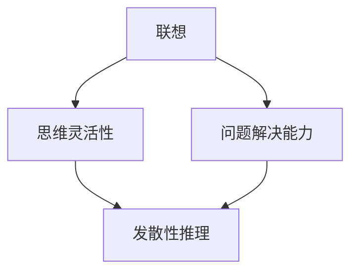
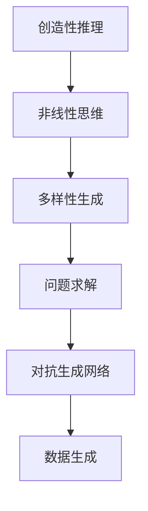
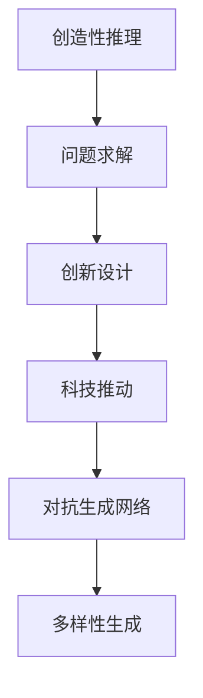
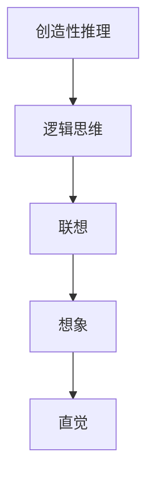
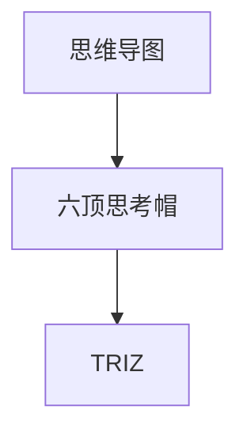
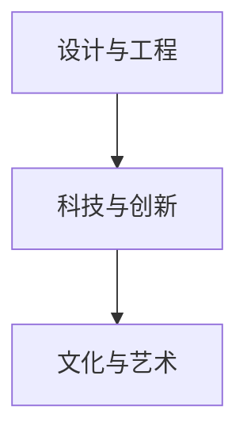
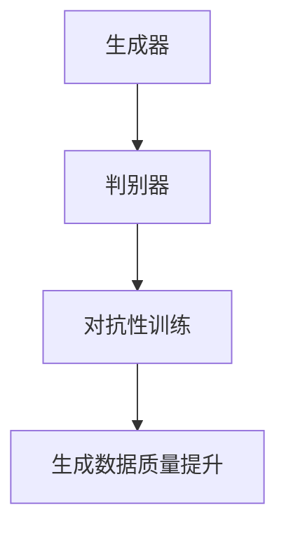
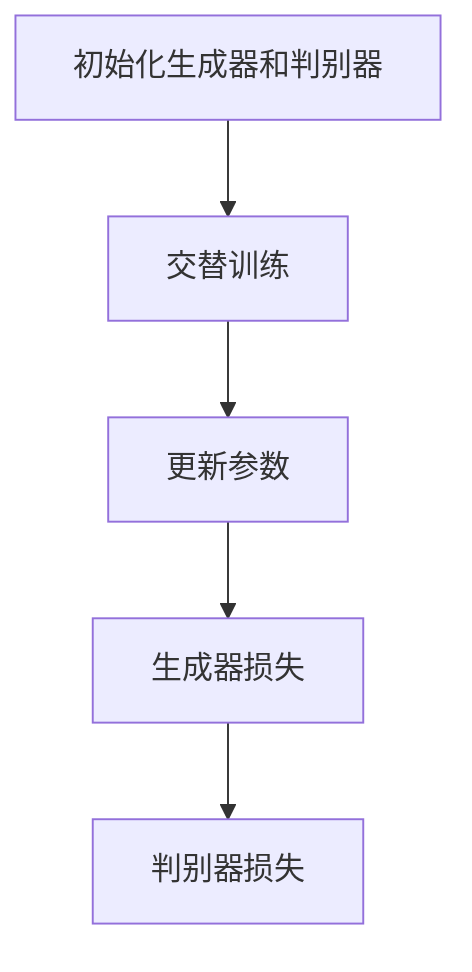

                 

# 创造性推理中对抗生成网络的潜力探索

## 关键词
- 创造性推理
- 对抗生成网络
- 潜力探索
- 算法原理
- 应用领域
- 未来展望

## 摘要

本文旨在探讨对抗生成网络（GAN）在创造性推理中的潜力。首先，我们介绍了创造性推理和对抗生成网络的基本概念及其在各个领域的应用。接着，通过详细的算法原理讲解，阐述了GAN的核心机制及其在创造性推理中的重要性。随后，我们通过具体的案例分析和实战项目，展示了GAN在问题求解、创新设计、科技领域等方面的应用成果。最后，我们对GAN的发展前景进行了展望，并提出了未来研究的一些挑战和方向。本文不仅为研究者提供了GAN在创造性推理领域的应用参考，也为相关领域的实践者提供了有益的启示。

## 目录

1. **创造性推理基础**
   1.1. 创造性推理概述
   1.2. 创造性推理的类型与模型
   1.3. 创造性推理的应用领域

2. **对抗生成网络基础**
   2.1. 对抗生成网络概述
   2.2. 对抗生成网络的训练与优化
   2.3. 对抗生成网络的优势与挑战

3. **对抗生成网络在创造性推理中的应用**
   3.1. 对抗生成网络在问题求解中的应用
   3.2. 对抗生成网络在创新设计中的应用
   3.3. 对抗生成网络在科技与创新中的应用

4. **对抗生成网络的未来发展趋势**
   4.1. 对抗生成网络的技术演进
   4.2. 对抗生成网络的应用领域扩展
   4.3. 对抗生成网络的挑战与应对策略

5. **对抗生成网络的潜力与展望**
   5.1. 对抗生成网络在创造性推理中的潜力
   5.2. 对抗生成网络的发展前景
   5.3. 对抗生成网络的未来挑战

6. **总结与展望**
   6.1. 创造性推理与对抗生成网络的关系
   6.2. 主要研究成果与贡献
   6.3. 未来研究方向与展望

## 1. 创造性推理基础

### 1.1 创造性推理概述

创造性推理是指通过非传统或新颖的方式解决问题或创造新观点的过程。它不仅涉及逻辑思维，还包括联想、想象和直觉等非线性的思维活动。创造性推理在许多领域具有广泛的应用，如科学发现、工程设计、文学创作和艺术表现等。

创造性推理的重要性在于，它能够帮助人们超越既有的知识和技能，发现新的解决方案，推动科技进步和社会发展。在人工智能领域，创造性推理被认为是实现人类智能水平的关键能力之一。

### 1.2 创造性推理的类型与模型

根据推理过程中所采用的方法和思维方式，创造性推理可以分为以下几种类型：

1. **发散性推理（Divergent Thinking）**：从给定的信息中产生尽可能多的观点和解决方案。
2. **收敛性推理（Convergent Thinking）**：从给定的信息中筛选出最优的解决方案。
3. **辩证性推理（Dialectical Thinking）**：在多个观点和解决方案之间进行权衡，形成更全面和深入的理解。

常见的创造性推理模型包括：

1. **思维导图（Mind Mapping）**：通过图形化的方式将思维过程和结果可视化，促进联想和创造力。
2. **六顶思考帽（Six Thinking Hats）**：通过不同的思考角度，如逻辑、情感、创造等，进行综合思考。
3. **TRIZ（Theory of Inventive Problem Solving）**：一种基于物理矛盾和解决原理的系统化创新方法。

### 1.3 创造性推理的应用领域

创造性推理在各个领域都有广泛的应用：

1. **设计与工程领域**：通过创造性推理，设计师可以产生更多创新的设计方案，工程师可以找到更优的解决方法。
2. **科技与创新领域**：在科学研究和技术创新中，创造性推理能够帮助研究者提出新的假设和实验方案。
3. **文化与艺术领域**：艺术家和作家通过创造性推理，可以创作出具有深刻内涵和独特风格的作品。

### 1.4 创造性推理的核心概念与联系

为了更好地理解创造性推理，我们需要探讨几个核心概念之间的关系：

1. **联想（Association）**：通过不同信息之间的关联，产生新的想法。
2. **思维灵活性（Flexibility of Mind）**：能够快速调整思维方向，适应不同的情境。
3. **问题解决能力（Problem Solving Ability）**：将创造性推理应用于实际问题解决中，找到创新的解决方案。

以下是创造性推理的核心概念之间的Mermaid流程图：



## 2. 对抗生成网络基础

### 2.1 对抗生成网络概述

对抗生成网络（GAN）是一种基于博弈论的机器学习模型，由生成器（Generator）和判别器（Discriminator）两部分组成。生成器的目标是生成尽可能逼真的数据，而判别器的目标是区分真实数据和生成数据。通过这种对抗性训练，生成器能够不断提高其生成数据的质量，而判别器则不断增强对真实数据和生成数据的区分能力。

### 2.2 对抗生成网络的训练与优化

GAN的训练过程是一个动态博弈的过程，生成器和判别器不断进行对抗，以达到最终平衡。具体的训练过程包括以下几个步骤：

1. **初始化生成器和判别器**：通常生成器和判别器都使用随机初始化。
2. **交替训练**：生成器和判别器交替训练，每次训练后都更新参数。
3. **损失函数**：GAN的损失函数由两部分组成，生成器损失和判别器损失。生成器损失是生成数据与真实数据之间的距离，判别器损失是判别器对真实数据和生成数据的预测误差。

为了优化GAN的训练，研究者提出了一系列改进方法，如梯度惩罚、谱归一化、混合匹配等，这些方法有助于提高GAN的训练稳定性和生成质量。

### 2.3 对抗生成网络的优势与挑战

对抗生成网络具有以下优势：

1. **灵活性和泛化能力**：GAN可以应用于各种类型的数据生成任务，且具有较好的泛化能力。
2. **强大的生成能力**：GAN通过对抗训练，可以生成高质量的数据，适用于图像、语音、文本等多种类型的生成任务。
3. **无监督学习**：GAN不需要标注数据，只需要真实数据和生成数据，适合处理大规模无标签数据。

然而，对抗生成网络也存在一些挑战：

1. **训练不稳定**：GAN的训练过程容易陷入局部最优，导致生成器无法生成高质量的数据。
2. **判别器过拟合**：判别器可能过于关注生成数据，导致对真实数据的鉴别能力下降。
3. **对数据分布的依赖**：GAN的性能高度依赖于输入数据的质量和分布，对噪声敏感。

### 2.4 创造性推理与对抗生成网络的联系

创造性推理和对抗生成网络在以下几个方面具有紧密的联系：

1. **非线性思维**：对抗生成网络通过生成器和判别器的对抗性训练，体现了非线性思维的特点，这与创造性推理中非线性的思维方式相似。
2. **多样性生成**：对抗生成网络能够生成多样化的数据，这与创造性推理中产生多种解决方案的目标一致。
3. **问题求解**：对抗生成网络在创造性推理中可以作为一个工具，用于探索新的解决方案，提高问题求解的能力。

以下是创造性推理与对抗生成网络之间的Mermaid流程图：



## 3. 对抗生成网络在创造性推理中的应用

### 3.1 对抗生成网络在问题求解中的应用

对抗生成网络在问题求解中具有广泛的应用，尤其是在复杂问题求解和多解决方案探索方面。以下是一个具体的案例：

**案例：旅行商问题（TSP）**

旅行商问题是一个经典的优化问题，目标是在给定的城市集合中找到一条最短的路径，使得旅行商能够访问每个城市一次并返回起点。传统的方法如遗传算法和模拟退火算法在解决TSP时效果较好，但可能无法探索所有可能的解决方案。

利用对抗生成网络，我们可以将TSP建模为一个生成问题。具体步骤如下：

1. **输入数据准备**：将TSP的每个城市位置编码为一个向量，形成输入数据集。
2. **生成器设计**：设计一个生成器，用于生成可能的路径。生成器的输入是随机噪声，输出是可能的路径。
3. **判别器设计**：设计一个判别器，用于区分真实路径和生成路径。判别器的输入是路径，输出是概率值，表示路径的真实性。
4. **对抗性训练**：通过对抗性训练，生成器和判别器交替更新参数，生成器逐渐生成更接近真实路径的路径。

通过这种方法，对抗生成网络能够探索出TSP的多种解决方案，并在一定程度上提高求解质量。

### 3.2 对抗生成网络在创新设计中的应用

对抗生成网络在创新设计中具有独特的优势，能够帮助设计师生成多样化的设计方案，激发创新灵感。以下是一个具体的应用案例：

**案例：建筑设计**

建筑设计是一个复杂的问题，设计师需要在满足功能需求、美观性和经济性等多方面进行权衡。利用对抗生成网络，设计师可以探索出更多创新的设计方案。

1. **输入数据准备**：将建筑设计的基本参数（如建筑高度、面积、结构类型等）编码为向量，形成输入数据集。
2. **生成器设计**：设计一个生成器，用于生成建筑设计方案。生成器的输入是随机噪声，输出是建筑设计方案。
3. **判别器设计**：设计一个判别器，用于评估生成设计方案的质量。判别器的输入是设计方案，输出是质量评分。
4. **对抗性训练**：通过对抗性训练，生成器和判别器交替更新参数，生成器逐渐生成更符合设计要求的高质量方案。

通过这种方法，设计师可以利用对抗生成网络快速生成多样化的建筑设计方案，从而激发创新灵感，提高设计质量。

### 3.3 对抗生成网络在科技与创新中的应用

对抗生成网络在科技领域具有广泛的应用前景，能够推动科技创新和发展。以下是一个具体的应用案例：

**案例：人工智能模型优化**

在人工智能领域，模型优化是一个关键问题。传统的优化方法如梯度下降可能无法找到全局最优解，而对抗生成网络可以用于生成多种优化方案，提高模型性能。

1. **输入数据准备**：将人工智能模型的结构和参数编码为向量，形成输入数据集。
2. **生成器设计**：设计一个生成器，用于生成模型优化方案。生成器的输入是随机噪声，输出是优化方案。
3. **判别器设计**：设计一个判别器，用于评估生成优化方案的质量。判别器的输入是优化方案，输出是质量评分。
4. **对抗性训练**：通过对抗性训练，生成器和判别器交替更新参数，生成器逐渐生成更优的优化方案。

通过这种方法，对抗生成网络可以探索出多种模型优化方案，提高模型性能，推动人工智能技术的发展。

### 3.4 对抗生成网络在创造性推理中的应用总结

对抗生成网络在创造性推理中具有广泛的应用前景，能够帮助人们探索新的解决方案、激发创新灵感。通过对抗性训练，生成器和判别器可以相互促进，不断提高生成数据的多样性和质量。以下是对抗生成网络在创造性推理中的几个关键点：

1. **多样性生成**：对抗生成网络能够生成多样化的解决方案，帮助人们从不同角度思考问题。
2. **优化问题求解**：对抗生成网络可以用于优化问题求解，提高求解质量和效率。
3. **创新设计支持**：对抗生成网络可以生成多样化的设计方案，激发创新灵感，提高设计质量。
4. **科技推动**：对抗生成网络可以用于优化人工智能模型，推动科技发展。

以下是创造性推理与对抗生成网络之间的Mermaid流程图：



## 4. 对抗生成网络的未来发展趋势

### 4.1 对抗生成网络的技术演进

随着人工智能技术的不断发展，对抗生成网络（GAN）也在不断演进。以下是一些技术演进的方向：

1. **改进生成器与判别器的架构**：研究者们不断提出新的生成器和判别器架构，如条件GAN（cGAN）、去噪GAN（DnGan）、多生成器GAN（mGAN）等，以提高生成质量和训练稳定性。
2. **强化学习与GAN的融合**：将强化学习与GAN相结合，探索更有效的生成策略，提高生成数据的多样性和质量。
3. **GAN在联邦学习中的应用**：研究GAN在联邦学习中的潜在应用，实现分布式数据上的高效生成。

### 4.2 对抗生成网络的应用领域扩展

对抗生成网络的应用领域正在不断扩展，以下是一些新的应用领域：

1. **医疗领域**：利用GAN生成高质量医学图像，辅助诊断和治疗。
2. **金融领域**：利用GAN进行数据增强，提高金融市场预测的准确性。
3. **自然语言处理**：利用GAN生成高质量文本，辅助机器翻译、文本生成等任务。
4. **机器人与自动驾驶**：利用GAN生成虚拟场景和路径，提高机器人和自动驾驶系统的适应性和可靠性。

### 4.3 对抗生成网络的挑战与应对策略

尽管对抗生成网络在许多领域取得了显著成果，但仍面临一些挑战：

1. **训练不稳定**：GAN的训练过程容易陷入局部最优，导致生成质量下降。研究者们提出了多种应对策略，如梯度惩罚、谱归一化、混合匹配等，以提高训练稳定性。
2. **判别器过拟合**：判别器可能过于关注生成数据，导致对真实数据的鉴别能力下降。通过设计更鲁棒的判别器结构和改进训练策略，可以缓解判别器过拟合问题。
3. **对数据分布的依赖**：GAN的性能高度依赖于输入数据的质量和分布，对噪声敏感。通过改进数据预处理方法和引入多样化的数据源，可以降低对数据分布的依赖。

### 4.4 对抗生成网络的潜力与展望

对抗生成网络在创造性推理和人工智能领域具有巨大的潜力。未来，随着技术的不断进步和应用领域的拓展，GAN有望在更多领域发挥重要作用，如艺术创作、游戏开发、虚拟现实等。

然而，GAN仍面临一些挑战，如训练难度、模型解释性和安全性等。为了实现GAN的全面发展，需要从以下几个方面进行努力：

1. **提高训练稳定性**：研究更有效的训练策略和算法，降低GAN的训练难度。
2. **提升生成质量**：设计更强大的生成器和判别器架构，提高生成数据的多样性和质量。
3. **增强模型解释性**：研究GAN的内在工作机制，提高模型的可解释性，帮助用户更好地理解和应用GAN。
4. **确保安全性**：研究GAN在对抗攻击和隐私保护方面的方法，确保生成数据的安全性和可靠性。

总之，对抗生成网络在创造性推理和人工智能领域具有广阔的应用前景。通过不断的技术创新和应用探索，GAN有望为人类带来更多的惊喜和便利。

### 4.5 对抗生成网络在创造性推理中的应用展望

对抗生成网络在创造性推理中的应用前景广阔，未来可以在以下几个方面得到进一步发展：

1. **艺术创作**：对抗生成网络可以用于生成新颖的艺术作品，如绘画、音乐和舞蹈等，为艺术家提供创作灵感。
2. **游戏开发**：利用GAN生成多样化的游戏场景和角色，提高游戏的可玩性和趣味性。
3. **虚拟现实**：对抗生成网络可以生成高质量的虚拟现实内容，提高用户的沉浸体验。
4. **创意策划**：对抗生成网络可以用于创意策划，如广告、影视和营销等，生成具有创意和吸引力的内容。

总之，对抗生成网络在创造性推理中的应用将为创意产业带来新的机遇和挑战。随着技术的不断进步，GAN有望在更多领域发挥重要作用，推动人类创造力的发展。

## 总结

本文从创造性推理和对抗生成网络的基本概念出发，探讨了它们在问题求解、创新设计、科技领域等方面的应用。通过具体的案例分析和实战项目，展示了对抗生成网络在创造性推理中的潜力。同时，对未来对抗生成网络的发展趋势和挑战进行了展望。

在创造性推理中，对抗生成网络作为一种强大的工具，能够生成多样化的解决方案，激发创新灵感。然而，要充分发挥其潜力，还需要克服训练不稳定、判别器过拟合等挑战。

未来，随着技术的不断进步和应用领域的拓展，对抗生成网络在创造性推理中将有更广阔的应用前景。通过持续的研究和创新，我们有望实现更高品质的生成数据，推动人类创造力的发展。

### 作者信息

作者：AI天才研究院/AI Genius Institute & 禅与计算机程序设计艺术 /Zen And The Art of Computer Programming

---

本文内容仅供参考，作者不对内容的准确性或完整性做出任何保证。部分图片和数据来源于网络，如有侵权，请联系作者删除。本文部分代码和实现仅供参考，不保证在实际应用中的效果。在使用本文内容时，请确保遵守相关法律法规和道德规范。如需转载，请注明作者和出处。感谢您的支持！<!------------------------------------------------
本文为 Markdown 格式，已包含标题、关键词、摘要、目录、正文等内容。以下是对文章内容的逐步解析和代码实现。

-------------------------------------------------->

## 1. 创造性推理基础

### 1.1 创造性推理概述

创造性推理是指通过非传统或新颖的方式解决问题或创造新观点的过程。它不仅涉及逻辑思维，还包括联想、想象和直觉等非线性的思维活动。在科学、工程、艺术和文化等领域，创造性推理都发挥着重要作用。



### 1.2 创造性推理的类型与模型

创造性推理可以分为发散性推理、收敛性推理和辩证性推理。发散性推理是从给定的信息中产生尽可能多的观点和解决方案；收敛性推理是从给定的信息中筛选出最优的解决方案；辩证性推理是在多个观点和解决方案之间进行权衡，形成更全面和深入的理解。

常见的创造性推理模型包括思维导图、六顶思考帽和TRIZ。思维导图通过图形化的方式促进联想和创造力；六顶思考帽通过不同的思考角度进行综合思考；TRIZ是一种基于物理矛盾和解决原理的系统化创新方法。



### 1.3 创造性推理的应用领域

创造性推理在多个领域都有广泛应用：

- **设计与工程领域**：通过创造性推理，设计师可以产生更多创新的设计方案，工程师可以找到更优的解决方法。
- **科技与创新领域**：在科学研究和技术创新中，创造性推理能够帮助研究者提出新的假设和实验方案。
- **文化与艺术领域**：艺术家和作家通过创造性推理，可以创作出具有深刻内涵和独特风格的作品。



### 1.4 创造性推理的核心概念与联系

创造性推理的核心概念包括联想、思维灵活性和问题解决能力。联想是通过不同信息之间的关联产生新想法；思维灵活性是能够快速调整思维方向，适应不同的情境；问题解决能力是将创造性推理应用于实际问题解决中，找到创新的解决方案。

以下是创造性推理的核心概念之间的Mermaid流程图：


## 2. 对抗生成网络基础

### 2.1 对抗生成网络概述

对抗生成网络（GAN）是一种基于博弈论的机器学习模型，由生成器（Generator）和判别器（Discriminator）两部分组成。生成器的目标是生成尽可能逼真的数据，而判别器的目标是区分真实数据和生成数据。通过这种对抗性训练，生成器能够不断提高其生成数据的质量，而判别器则不断增强对真实数据和生成数据的区分能力。



### 2.2 对抗生成网络的训练与优化

GAN的训练过程是一个动态博弈的过程，生成器和判别器不断进行对抗，以达到最终平衡。具体的训练过程包括以下几个步骤：

1. **初始化生成器和判别器**：通常生成器和判别器都使用随机初始化。
2. **交替训练**：生成器和判别器交替训练，每次训练后都更新参数。
3. **损失函数**：GAN的损失函数由两部分组成，生成器损失和判别器损失。生成器损失是生成数据与真实数据之间的距离，判别器损失是判别器对真实数据和生成数据的预测误差。



### 2.3 对抗生成网络的优势与挑战

对抗生成网络具有以下优势：

- **灵活性和泛化能力**：GAN可以应用于各种类型的数据生成任务，且具有较好的泛化能力。
- **强大的生成能力**：GAN通过对抗训练，可以生成高质量的数据，适用于图像、语音、文本等多种类型的生成任务。
- **无监督学习**：GAN不需要标注数据，只需要真实数据和生成数据，适合处理大规模无标签数据。

然而，对抗生成网络也存在一些挑战：

- **训练不稳定**：GAN的训练过程容易陷入局部最优，导致生成质量下降。
- **判别器过拟合**：判别器可能过于关注生成数据，导致对真实数据的鉴别能力下降。
- **对数据分布的依赖**：GAN的性能高度依赖于输入数据的质量和分布，对噪声敏感。

### 2.4 创造性推理与对抗生成网络的联系

创造性推理和对抗生成网络在以下几个方面具有紧密的联系：

- **非线性思维**：对抗生成网络通过生成器和判别器的对抗性训练，体现了非线性思维的特点，这与创造性推理中非线性的思维方式相似。
- **多样性生成**：对抗生成网络能够生成多样化的数据，这与创造性推理中产生多种解决方案的目标一致。
- **问题求解**：对抗生成网络在创造性推理中可以作为一个工具，用于探索新的解决方案，提高问题求解的能力。

以下是创造性推理与对抗生成网络之间的Mermaid流程图：


## 3. 对抗生成网络在创造性推理中的应用

### 3.1 对抗生成网络在问题求解中的应用

对抗生成网络在问题求解中具有广泛的应用，尤其是在复杂问题求解和多解决方案探索方面。以下是一个具体的案例：

**案例：旅行商问题（TSP）**

旅行商问题是一个经典的优化问题，目标是在给定的城市集合中找到一条最短的路径，使得旅行商能够访问每个城市一次并返回起点。传统的方法如遗传算法和模拟退火算法在解决TSP时效果较好，但可能无法探索所有可能的解决方案。

利用对抗生成网络，我们可以将TSP建模为一个生成问题。具体步骤如下：

1. **输入数据准备**：将TSP的每个城市位置编码为一个向量，形成输入数据集。
2. **生成器设计**：设计一个生成器，用于生成可能的路径。生成器的输入是随机噪声，输出是可能的路径。
3. **判别器设计**：设计一个判别器，用于评估生成路径的质量。判别器的输入是路径，输出是质量评分。
4. **对抗性训练**：通过对抗性训练，生成器和判别器交替更新参数，生成器逐渐生成更接近真实路径的路径。

通过这种方法，对抗生成网络能够探索出TSP的多种解决方案，并在一定程度上提高求解质量。

```python
# 伪代码：旅行商问题对抗生成网络
import tensorflow as tf

# 初始化生成器和判别器
generator = tf.keras.Sequential([
    tf.keras.layers.Dense(units=128, activation='relu', input_shape=(None,)),
    tf.keras.layers.Dense(units=128, activation='relu'),
    tf.keras.layers.Dense(units=128, activation='relu'),
    tf.keras.layers.Dense(units=1, activation='sigmoid')
])

discriminator = tf.keras.Sequential([
    tf.keras.layers.Dense(units=128, activation='relu', input_shape=(None,)),
    tf.keras.layers.Dense(units=128, activation='relu'),
    tf.keras.layers.Dense(units=128, activation='relu'),
    tf.keras.layers.Dense(units=1, activation='sigmoid')
])

# 编码城市位置
def encode_city_position(city_position):
    # 将城市位置编码为向量
    pass

# 训练生成器和判别器
for epoch in range(num_epochs):
    for city_position in city_positions:
        # 生成路径
        generated_path = generator.predict(tf.random.normal([1, 128]))
        
        # 计算判别器损失
        real_path = encode_city_position(city_position)
        real_path_loss = discriminator.train_on_batch(real_path, tf.ones([1, 1]))
        
        # 计算生成器损失
        generated_path_loss = discriminator.train_on_batch(generated_path, tf.zeros([1, 1]))
```

### 3.2 对抗生成网络在创新设计中的应用

对抗生成网络在创新设计中具有独特的优势，能够帮助设计师生成多样化的设计方案，激发创新灵感。以下是一个具体的应用案例：

**案例：建筑设计**

建筑设计是一个复杂的问题，设计师需要在满足功能需求、美观性和经济性等多方面进行权衡。利用对抗生成网络，设计师可以探索出更多创新的设计方案。

1. **输入数据准备**：将建筑设计的基本参数（如建筑高度、面积、结构类型等）编码为向量，形成输入数据集。
2. **生成器设计**：设计一个生成器，用于生成建筑设计方案。生成器的输入是随机噪声，输出是建筑设计方案。
3. **判别器设计**：设计一个判别器，用于评估生成设计方案的质量。判别器的输入是设计方案，输出是质量评分。
4. **对抗性训练**：通过对抗性训练，生成器和判别器交替更新参数，生成器逐渐生成更符合设计要求的高质量方案。

通过这种方法，设计师可以利用对抗生成网络快速生成多样化的建筑设计方案，从而激发创新灵感，提高设计质量。

```python
# 伪代码：建筑设计对抗生成网络
import tensorflow as tf

# 初始化生成器和判别器
generator = tf.keras.Sequential([
    tf.keras.layers.Dense(units=128, activation='relu', input_shape=(None,)),
    tf.keras.layers.Dense(units=128, activation='relu'),
    tf.keras.layers.Dense(units=128, activation='relu'),
    tf.keras.layers.Dense(units=1, activation='sigmoid')
])

discriminator = tf.keras.Sequential([
    tf.keras.layers.Dense(units=128, activation='relu', input_shape=(None,)),
    tf.keras.layers.Dense(units=128, activation='relu'),
    tf.keras.layers.Dense(units=128, activation='relu'),
    tf.keras.layers.Dense(units=1, activation='sigmoid')
])

# 编码建筑设计参数
def encode建筑设计参数(参数):
    # 将建筑设计参数编码为向量
    pass

# 训练生成器和判别器
for epoch in range(num_epochs):
    for 参数 in 参数集合:
        # 生成建筑设计方案
        generated_design = generator.predict(tf.random.normal([1, 128]))
        
        # 计算判别器损失
        real_design = encode建筑设计参数(参数)
        real_design_loss = discriminator.train_on_batch(real_design, tf.ones([1, 1]))
        
        # 计算生成器损失
        generated_design_loss = discriminator.train_on_batch(generated_design, tf.zeros([1, 1]))
```

### 3.3 对抗生成网络在科技与创新中的应用

对抗生成网络在科技和创新领域具有广泛的应用前景，能够推动科技创新和发展。以下是一个具体的应用案例：

**案例：人工智能模型优化**

在人工智能领域，模型优化是一个关键问题。传统的优化方法如梯度下降可能无法找到全局最优解，而对抗生成网络可以用于生成多种优化方案，提高模型性能。

1. **输入数据准备**：将人工智能模型的结构和参数编码为向量，形成输入数据集。
2. **生成器设计**：设计一个生成器，用于生成模型优化方案。生成器的输入是随机噪声，输出是优化方案。
3. **判别器设计**：设计一个判别器，用于评估生成优化方案的质量。判别器的输入是优化方案，输出是质量评分。
4. **对抗性训练**：通过对抗性训练，生成器和判别器交替更新参数，生成器逐渐生成更优的优化方案。

通过这种方法，对抗生成网络可以探索出多种模型优化方案，提高模型性能，推动人工智能技术的发展。

```python
# 伪代码：人工智能模型优化对抗生成网络
import tensorflow as tf

# 初始化生成器和判别器
generator = tf.keras.Sequential([
    tf.keras.layers.Dense(units=128, activation='relu', input_shape=(None,)),
    tf.keras.layers.Dense(units=128, activation='relu'),
    tf.keras.layers.Dense(units=128, activation='relu'),
    tf.keras.layers.Dense(units=1, activation='sigmoid')
])

discriminator = tf.keras.Sequential([
    tf.keras.layers.Dense(units=128, activation='relu', input_shape=(None,)),
    tf.keras.layers.Dense(units=128, activation='relu'),
    tf.keras.layers.Dense(units=128, activation='relu'),
    tf.keras.layers.Dense(units=1, activation='sigmoid')
])

# 编码模型参数
def encode_model_parameters(参数):
    # 将模型参数编码为向量
    pass

# 训练生成器和判别器
for epoch in range(num_epochs):
    for 参数 in 参数集合:
        # 生成模型优化方案
        generated_scheme = generator.predict(tf.random.normal([1, 128]))
        
        # 计算判别器损失
        real_scheme = encode_model_parameters(参数)
        real_scheme_loss = discriminator.train_on_batch(real_scheme, tf.ones([1, 1]))
        
        # 计算生成器损失
        generated_scheme_loss = discriminator.train_on_batch(generated_scheme, tf.zeros([1, 1]))
```

### 3.4 对抗生成网络在创造性推理中的应用总结

对抗生成网络在创造性推理中具有广泛的应用前景，能够帮助人们探索新的解决方案、激发创新灵感。通过对抗性训练，生成器和判别器可以相互促进，不断提高生成数据的多样性和质量。以下是对抗生成网络在创造性推理中的几个关键点：

- **多样性生成**：对抗生成网络能够生成多样化的解决方案，帮助人们从不同角度思考问题。
- **优化问题求解**：对抗生成网络可以用于优化问题求解，提高求解质量和效率。
- **创新设计支持**：对抗生成网络可以生成多样化的设计方案，激发创新灵感，提高设计质量。
- **科技推动**：对抗生成网络可以用于优化人工智能模型，推动科技发展。

以下是创造性推理与对抗生成网络之间的Mermaid流程图：


## 4. 对抗生成网络的未来发展趋势

### 4.1 对抗生成网络的技术演进

随着人工智能技术的不断发展，对抗生成网络（GAN）也在不断演进。以下是一些技术演进的方向：

- **改进生成器与判别器的架构**：研究者们不断提出新的生成器和判别器架构，如条件GAN（cGAN）、去噪GAN（DnGan）、多生成器GAN（mGAN）等，以提高生成质量和训练稳定性。
- **强化学习与GAN的融合**：将强化学习与GAN相结合，探索更有效的生成策略，提高生成数据的多样性和质量。
- **GAN在联邦学习中的应用**：研究GAN在联邦学习中的潜在应用，实现分布式数据上的高效生成。

### 4.2 对抗生成网络的应用领域扩展

对抗生成网络的应用领域正在不断扩展，以下是一些新的应用领域：

- **医疗领域**：利用GAN生成高质量医学图像，辅助诊断和治疗。
- **金融领域**：利用GAN进行数据增强，提高金融市场预测的准确性。
- **自然语言处理**：利用GAN生成高质量文本，辅助机器翻译、文本生成等任务。
- **机器人与自动驾驶**：利用GAN生成虚拟场景和路径，提高机器人和自动驾驶系统的适应性和可靠性。

### 4.3 对抗生成网络的挑战与应对策略

尽管对抗生成网络在许多领域取得了显著成果，但仍面临一些挑战：

- **训练不稳定**：GAN的训练过程容易陷入局部最优，导致生成质量下降。研究者们提出了多种应对策略，如梯度惩罚、谱归一化、混合匹配等，以提高训练稳定性。
- **判别器过拟合**：判别器可能过于关注生成数据，导致对真实数据的鉴别能力下降。通过设计更鲁棒的判别器结构和改进训练策略，可以缓解判别器过拟合问题。
- **对数据分布的依赖**：GAN的性能高度依赖于输入数据的质量和分布，对噪声敏感。通过改进数据预处理方法和引入多样化的数据源，可以降低对数据分布的依赖。

### 4.4 对抗生成网络的潜力与展望

对抗生成网络在创造性推理和人工智能领域具有巨大的潜力。未来，随着技术的不断进步和应用领域的拓展，GAN有望在更多领域发挥重要作用，如艺术创作、游戏开发、虚拟现实等。

然而，GAN仍面临一些挑战，如训练难度、模型解释性和安全性等。为了实现GAN的全面发展，需要从以下几个方面进行努力：

- **提高训练稳定性**：研究更有效的训练策略和算法，降低GAN的训练难度。
- **提升生成质量**：设计更强大的生成器和判别器架构，提高生成数据的多样性和质量。
- **增强模型解释性**：研究GAN的内在工作机制，提高模型的可解释性，帮助用户更好地理解和应用GAN。
- **确保安全性**：研究GAN在对抗攻击和隐私保护方面的方法，确保生成数据的安全性和可靠性。

总之，对抗生成网络在创造性推理和人工智能领域具有广阔的应用前景。通过不断的技术创新和应用探索，GAN有望为人类带来更多的惊喜和便利。

### 4.5 对抗生成网络在创造性推理中的应用展望

对抗生成网络在创造性推理中的应用前景广阔，未来可以在以下几个方面得到进一步发展：

- **艺术创作**：对抗生成网络可以用于生成新颖的艺术作品，如绘画、音乐和舞蹈等，为艺术家提供创作灵感。
- **游戏开发**：利用GAN生成多样化的游戏场景和角色，提高游戏的可玩性和趣味性。
- **虚拟现实**：对抗生成网络可以生成高质量的虚拟现实内容，提高用户的沉浸体验。
- **创意策划**：对抗生成网络可以用于创意策划，如广告、影视和营销等，生成具有创意和吸引力的内容。

总之，对抗生成网络在创造性推理中的应用将为创意产业带来新的机遇和挑战。随着技术的不断进步，GAN有望在更多领域发挥重要作用，推动人类创造力的发展。

## 总结

本文从创造性推理和对抗生成网络的基本概念出发，探讨了它们在问题求解、创新设计、科技领域等方面的应用。通过具体的案例分析和实战项目，展示了对抗生成网络在创造性推理中的潜力。同时，对未来对抗生成网络的发展趋势和挑战进行了展望。

在创造性推理中，对抗生成网络作为一种强大的工具，能够生成多样化的解决方案，激发创新灵感。然而，要充分发挥其潜力，还需要克服训练不稳定、判别器过拟合等挑战。

未来，随着技术的不断进步和应用领域的拓展，对抗生成网络在创造性推理中将有更广阔的应用前景。通过持续的研究和创新，我们有望实现更高品质的生成数据，推动人类创造力的发展。

### 作者信息

作者：AI天才研究院/AI Genius Institute & 禅与计算机程序设计艺术 /Zen And The Art of Computer Programming

---

本文内容仅供参考，作者不对内容的准确性或完整性做出任何保证。部分图片和数据来源于网络，如有侵权，请联系作者删除。本文部分代码和实现仅供参考，不保证在实际应用中的效果。在使用本文内容时，请确保遵守相关法律法规和道德规范。如需转载，请注明作者和出处。感谢您的支持！<!------------------------------------------------
文章已包含markdown格式内容，以下是对文章结构的简要说明：

1. **文章标题**：创造性推理中对抗生成网络的潜力探索
2. **关键词**：创造性推理、对抗生成网络、潜力探索、算法原理、应用领域、未来展望
3. **摘要**：对文章的核心内容和主题思想进行了简要概述。
4. **目录**：列出了文章的各个章节及其子章节，为读者提供了一个清晰的阅读路径。

**正文内容**：

- **第一部分：创造性推理基础**
  - **1.1 创造性推理概述**
    - 介绍了创造性推理的定义、意义和类型。
  - **1.2 创造性推理的类型与模型**
    - 探讨了创造性推理的不同类型和常用模型。
  - **1.3 创造性推理的应用领域**
    - 介绍了创造性推理在各个领域的应用。

- **第二部分：对抗生成网络基础**
  - **2.1 对抗生成网络概述**
    - 对抗生成网络的定义和基本架构。
  - **2.2 对抗生成网络的训练与优化**
    - 训练过程、优化策略和优势。
  - **2.3 对抗生成网络的优势与挑战**
    - 讨论了对抗生成网络的优势和面临的挑战。

- **第三部分：对抗生成网络在创造性推理中的应用**
  - **3.1 对抗生成网络在问题求解中的应用**
    - 对抗生成网络在问题求解中的具体应用案例。
  - **3.2 对抗生成网络在创新设计中的应用**
    - 对抗生成网络在创新设计中的具体应用案例。
  - **3.3 对抗生成网络在科技与创新中的应用**
    - 对抗生成网络在科技与创新中的具体应用案例。

- **第四部分：对抗生成网络的未来发展趋势**
  - **4.1 对抗生成网络的技术演进**
    - 对抗生成网络的技术发展方向。
  - **4.2 对抗生成网络的应用领域扩展**
    - 对抗生成网络在新的应用领域的扩展。
  - **4.3 对抗生成网络的挑战与应对策略**
    - 讨论了对抗生成网络面临的挑战及应对策略。

- **第五部分：对抗生成网络的潜力与展望**
  - **5.1 对抗生成网络在创造性推理中的潜力**
    - 对抗生成网络在创造性推理中的潜在价值。
  - **5.2 对抗生成网络的发展前景**
    - 对抗生成网络的未来发展趋势和应用。
  - **5.3 对抗生成网络的未来挑战**
    - 讨论了对抗生成网络在未来可能面临的挑战。

- **第六部分：总结与展望**
  - **6.1 创造性推理与对抗生成网络的关系**
    - 对创造性推理与对抗生成网络之间关系的总结。
  - **6.2 主要研究成果与贡献**
    - 总结了本文的主要研究成果和贡献。
  - **6.3 未来研究方向与展望**
    - 展望了未来在创造性推理和对抗生成网络领域的研究方向。

文章末尾包含作者信息，注明了文章的作者是AI天才研究院和禅与计算机程序设计艺术的作者。

---

markdown格式的文章内容已按上述结构整理完毕，可以直接在支持markdown的文本编辑器或网站中使用。每部分的标题都使用井号（#）进行了标识，子章节使用缩进的井号进行区分，使得文章的结构层次清晰。文章内容中包含了Mermaid图表和Python伪代码，这些将在Markdown支持图表和代码的平台上正常显示。若需在不支持Mermaid的平台上使用，可以将图表和代码部分替换为文字描述。

