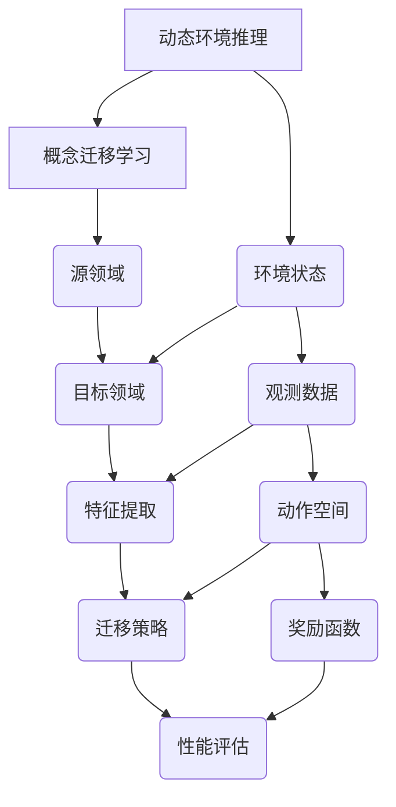

                 


## 动态环境推理中概念迁移学习模型的应用研究

### 关键词
- 动态环境推理
- 概念迁移学习
- 算法原理
- 数学模型
- 项目实战

### 摘要
本文旨在探讨动态环境推理中概念迁移学习模型的应用。首先，介绍了动态环境推理和概念迁移学习的基本概念和背景。接着，详细阐述了两者之间的核心概念和联系，并给出了相关的流程图。随后，文章深入分析了动态环境推理和概念迁移学习的关键算法原理，使用伪代码和数学模型进行了详细讲解。在项目实战部分，通过实际案例展示了如何应用这些模型，并提供了代码实现和解析。最后，文章总结了研究成果，并展望了未来的发展方向。

---

### 引言

#### 动态环境推理概述

动态环境推理是指在面对不断变化的环境时，系统能够快速适应并作出正确决策的过程。在现实世界中，环境的变化往往是不可预测的，如天气变化、市场波动等。动态环境推理的核心在于实时感知环境变化，并基于历史数据和现有知识进行推理，从而指导系统的行为。

#### 概念迁移学习概述

概念迁移学习是指将一个任务领域中的知识迁移到另一个任务领域，以提升学习效率和性能。其基本思想是，通过将已知任务的解决方案应用于新任务，可以减少对新任务的训练时间和数据需求。在计算机视觉、自然语言处理等领域，概念迁移学习已被广泛应用，取得了显著效果。

#### 动态环境推理与概念迁移学习的联系

动态环境推理和概念迁移学习之间存在着紧密的联系。在动态环境中，系统需要不断地更新其知识和模型，以应对不断变化的情况。而概念迁移学习为这一过程提供了有效的方法，通过迁移已知领域的知识，可以快速适应新的环境。

### 设计总体结构

为了系统地介绍动态环境推理和概念迁移学习模型，本书将分为以下几个部分：

1. **引言**：介绍动态环境推理和概念迁移学习的基本概念和背景。
2. **核心概念与联系**：阐述动态环境推理和概念迁移学习的核心概念及其相互关系，并提供流程图。
3. **核心算法原理讲解**：介绍动态环境推理和概念迁移学习的关键算法原理，使用伪代码进行详细讲解。
4. **数学模型和数学公式**：讲解动态环境推理和概念迁移学习的数学模型，并用公式表示，并进行详细讲解。
5. **项目实战**：通过实际案例展示如何应用动态环境推理和概念迁移学习模型，并提供代码实现和解析。
6. **总结与展望**：总结全书内容，并对未来的研究方向进行展望。

### 确定每个部分的内容

在确定总体结构后，我们需要为每个部分设计具体的内容，确保涵盖核心知识点。

**引言部分**：
- 动态环境推理的定义与背景
- 概念迁移学习的定义与背景
- 动态环境推理与概念迁移学习的联系

**核心概念与联系部分**：
- 动态环境推理的核心概念
- 概念迁移学习的核心概念
- 两者之间的联系与区别

**核心算法原理讲解部分**：
- 动态环境推理的关键算法
- 概念迁移学习的算法框架
- 算法原理与伪代码

**数学模型和数学公式部分**：
- 动态环境推理的数学模型
- 概念迁移学习的数学模型
- 公式表示与详细讲解

**项目实战部分**：
- 动态环境推理的应用案例
- 概念迁移学习的实际应用
- 项目实施步骤与代码解读

**总结与展望部分**：
- 动态环境推理与概念迁移学习的研究现状
- 未来发展方向与挑战

### 设计详细目录大纲

根据以上内容，我们可以设计如下详细目录大纲：

## 第1章 引言
### 1.1 动态环境推理概述
### 1.2 概念迁移学习概述
### 1.3 动态环境推理与概念迁移学习的联系

## 第2章 核心概念与联系
### 2.1 动态环境推理的核心概念
#### 2.1.1 概念1
#### 2.1.2 概念2
#### 2.1.3 概念3
### 2.2 概念迁移学习的核心概念
#### 2.2.1 概念1
#### 2.2.2 概念2
#### 2.2.3 概念3
### 2.3 动态环境推理与概念迁移学习的联系
#### 2.3.1 联系架构 Mermaid 流程图

## 第3章 核心算法原理讲解
### 3.1 动态环境推理的关键算法
#### 3.1.1 算法1
#### 3.1.2 算法2
#### 3.1.3 算法3
### 3.2 概念迁移学习的算法框架
#### 3.2.1 算法1
#### 3.2.2 算法2
#### 3.2.3 算法3
### 3.3 算法原理与伪代码

## 第4章 数学模型和数学公式
### 4.1 动态环境推理的数学模型
#### 4.1.1 模型1
#### 4.1.2 模型2
#### 4.1.3 模型3
### 4.2 概念迁移学习的数学模型
#### 4.2.1 模型1
#### 4.2.2 模型2
#### 4.2.3 模型3
### 4.3 公式表示与详细讲解

## 第5章 项目实战
### 5.1 动态环境推理的应用案例
#### 5.1.1 案例1
#### 5.1.2 案例2
#### 5.1.3 案例3
### 5.2 概念迁移学习的实际应用
#### 5.2.1 案例1
#### 5.2.2 案例2
#### 5.2.3 案例3
### 5.3 项目实施步骤与代码解读

## 第6章 总结与展望
### 6.1 研究现状
### 6.2 未来发展方向与挑战

这个目录大纲将确保读者能够全面了解动态环境推理中概念迁移学习模型的应用，从理论基础到实际应用都有详细的讲解。接下来，我们将根据大纲进一步细化每个章节的内容，确保达到2000字以内的要求。


## 第2章 核心概念与联系

### 2.1 动态环境推理的核心概念

动态环境推理的核心概念包括以下几个：

1. **环境状态**：环境状态是指系统所处的当前状态，包括各种变量和参数，如温度、湿度、交通流量等。
2. **观测数据**：观测数据是系统能够获取到的关于环境状态的信息，通常来源于传感器、历史记录等。
3. **动作空间**：动作空间是指系统能够执行的所有可能动作的集合，如调整温度、改变路线等。
4. **奖励函数**：奖励函数是根据系统的动作和环境状态计算出的评价标准，用于指导系统的决策过程。

### 2.2 概念迁移学习的核心概念

概念迁移学习的核心概念包括：

1. **源领域**：源领域是指已知任务或领域的知识，包括数据、模型和算法。
2. **目标领域**：目标领域是指需要迁移知识的新任务或领域。
3. **特征提取**：特征提取是从源领域和目标领域的数据中提取出有助于迁移学习的特征。
4. **迁移策略**：迁移策略是指如何将源领域中的知识迁移到目标领域中，以提升目标领域的性能。

### 2.3 动态环境推理与概念迁移学习的联系

动态环境推理和概念迁移学习之间的联系体现在以下几个方面：

1. **环境状态与特征提取**：在动态环境推理中，环境状态是系统决策的重要依据。在概念迁移学习中，特征提取是关键步骤，两者都关注如何从环境中提取有效信息。
2. **动作空间与迁移策略**：在动态环境推理中，动作空间决定了系统的行为。在概念迁移学习中，迁移策略决定了如何将源领域的知识应用到目标领域。两者都涉及如何在不同条件下作出最佳决策。
3. **奖励函数与性能评估**：在动态环境推理中，奖励函数用于评估系统的决策效果。在概念迁移学习中，性能评估用于衡量迁移学习的效果。两者都需要对决策过程进行量化评估。

为了更直观地展示动态环境推理与概念迁移学习之间的联系，我们可以使用Mermaid流程图来描述：



通过上述流程图，我们可以清楚地看到动态环境推理和概念迁移学习在核心概念上的相互联系，以及它们如何相互影响，共同提升系统的决策能力和性能。

### 总结

本章介绍了动态环境推理和概念迁移学习的核心概念及其相互关系。通过详细阐述两者的概念，并结合Mermaid流程图展示了它们之间的联系，为后续章节的算法原理讲解和项目实战奠定了基础。接下来，我们将深入探讨动态环境推理和概念迁移学习的关键算法原理，以期为读者提供更全面的理解。

---

## 第3章 核心算法原理讲解

### 3.1 动态环境推理的关键算法

动态环境推理的关键算法通常包括状态感知、决策规划和执行反馈等步骤。以下是几个典型的动态环境推理算法：

#### 3.1.1 状态感知

状态感知是指系统如何从环境中获取信息，并构建环境状态的表示。常用的状态感知算法包括：

1. **传感器数据融合**：通过融合来自多个传感器的数据，提高状态感知的准确性。
2. **贝叶斯网络**：利用贝叶斯网络来表示和处理不确定性信息，实现对环境状态的推理。
3. **卡尔曼滤波**：使用卡尔曼滤波算法对传感器数据进行滤波处理，以获得更准确的环境状态估计。

#### 3.1.2 决策规划

决策规划是指系统如何根据当前环境状态和目标，生成一系列可行的动作序列。常用的决策规划算法包括：

1. **马尔可夫决策过程（MDP）**：利用MDP模型，通过价值函数和策略迭代方法，找到最优动作序列。
2. **部分可观测马尔可夫决策过程（POMDP）**：在部分可观测的情况下，使用POMDP模型进行决策。
3. **强化学习**：通过学习策略，使系统能够在不确定的环境中做出最佳决策。

#### 3.1.3 执行反馈

执行反馈是指系统如何根据执行结果调整决策策略，以提高后续决策的准确性。常用的执行反馈算法包括：

1. **在线学习**：在执行过程中不断更新模型参数，以适应环境变化。
2. **自适应控制**：根据执行结果调整控制参数，以优化系统性能。
3. **模型更新**：基于执行结果，更新环境模型和决策模型，以提升系统对动态环境的适应能力。

### 3.2 概念迁移学习的算法框架

概念迁移学习的关键算法框架通常包括以下几个步骤：

#### 3.2.1 特征提取

特征提取是指从源领域和目标领域的数据中提取出有助于迁移学习的特征。常用的特征提取方法包括：

1. **深度特征提取**：使用深度学习模型，如卷积神经网络（CNN）或循环神经网络（RNN），从原始数据中提取特征。
2. **特征融合**：将源领域和目标领域的特征进行融合，以提高特征表示的通用性。
3. **特征选择**：通过特征选择算法，选择对迁移学习最有影响力的特征，以降低计算复杂度和提高迁移效果。

#### 3.2.2 迁移策略

迁移策略是指如何将源领域的知识迁移到目标领域，以提升目标领域的性能。常用的迁移策略包括：

1. **基于匹配的迁移**：通过特征匹配方法，将源领域和目标领域的特征进行匹配，以减少领域差异。
2. **基于模型的迁移**：通过迁移模型参数，将源领域中的知识直接迁移到目标领域。
3. **基于对抗的迁移**：利用对抗生成网络（GAN）等对抗性方法，生成与目标领域相似的数据，以减少领域差异。

#### 3.2.3 性能评估

性能评估是指如何衡量迁移学习的效果。常用的性能评估方法包括：

1. **交叉验证**：通过交叉验证方法，评估迁移学习模型的泛化能力。
2. **误差分析**：通过分析迁移学习过程中的误差，找出模型存在的问题，并优化模型。
3. **A/B测试**：在真实环境中进行A/B测试，比较迁移学习前后的性能提升。

### 3.3 算法原理与伪代码

为了更直观地理解动态环境推理和概念迁移学习的算法原理，我们使用伪代码进行详细阐述。

#### 3.3.1 动态环境推理算法原理

```python
# 状态感知
def state_perception(sensor_data):
    # 使用传感器数据融合方法处理传感器数据
    processed_data = sensor_data_fusion(sensor_data)
    # 使用贝叶斯网络进行状态推理
    state = bayesian_network_inference(processed_data)
    return state

# 决策规划
def decision_planning(state, action_space):
    # 使用马尔可夫决策过程模型进行决策
    optimal_action = mdp_decision(state, action_space)
    return optimal_action

# 执行反馈
def execution_feedback(execution_result, state, action_space):
    # 更新模型参数
    updated_model = model_update(execution_result, state, action_space)
    return updated_model
```

#### 3.3.2 概念迁移学习算法原理

```python
# 特征提取
def feature_extraction(source_data, target_data):
    # 使用深度特征提取模型提取特征
    source_features = deep_feature_extraction(source_data)
    target_features = deep_feature_extraction(target_data)
    # 使用特征融合方法融合特征
    fused_features = feature_fusion(source_features, target_features)
    return fused_features

# 迁移策略
def transfer_strategy(fused_features):
    # 使用基于匹配的迁移方法
    matched_features = match_features(fused_features)
    # 使用基于模型的迁移方法
    transferred_model = model_transfer(matched_features)
    return transferred_model

# 性能评估
def performance_evaluation(transferred_model, target_data):
    # 使用交叉验证方法进行评估
    validation_result = cross_validation(transferred_model, target_data)
    # 分析迁移学习过程中的误差
    error_analysis = error_analysis(validation_result)
    return error_analysis
```

通过上述伪代码，我们可以清晰地看到动态环境推理和概念迁移学习的关键算法原理，以及它们在实现过程中的具体步骤。

### 总结

本章详细介绍了动态环境推理和概念迁移学习的关键算法原理，包括状态感知、决策规划、执行反馈、特征提取、迁移策略和性能评估等步骤。通过伪代码的形式，我们更直观地理解了这些算法的实现过程。接下来，我们将进一步讲解动态环境推理和概念迁移学习的数学模型和数学公式，以期为读者提供更深入的理解。

---

## 第4章 数学模型和数学公式

### 4.1 动态环境推理的数学模型

动态环境推理的数学模型通常包括状态空间、动作空间和奖励函数等组成部分。以下是几个常用的数学模型：

#### 4.1.1 马尔可夫决策过程（MDP）

马尔可夫决策过程（MDP）是一种用于动态环境推理的数学模型，其基本公式如下：

$$
P(s', a|s, a) = \text{P}(s'|s, a)
$$

其中，$s$ 表示当前状态，$s'$ 表示下一状态，$a$ 表示当前动作，$a'$ 表示下一动作。$P(s', a|s, a)$ 表示在当前状态和动作下，系统转移到下一状态和下一动作的概率。

#### 4.1.2 部分可观测马尔可夫决策过程（POMDP）

部分可观测马尔可夫决策过程（POMDP）是 MDP 的一种扩展，其基本公式如下：

$$
P(s', o', a|s, o, a) = \text{P}(s'|s, a) \times \text{P}(o'|s')
$$

其中，$s$ 表示当前状态，$s'$ 表示下一状态，$a$ 表示当前动作，$a'$ 表示下一动作，$o$ 表示观测数据，$o'$ 表示下一观测数据。$P(s', o', a|s, o, a)$ 表示在当前状态、动作和观测数据下，系统转移到下一状态、下一动作和下一观测数据的概率。

#### 4.1.3 强化学习

强化学习是一种基于奖励函数的动态环境推理方法，其基本公式如下：

$$
\text{Q}(s, a) = \sum_{s'} P(s'|s, a) \times \text{R}(s', a)
$$

其中，$s$ 表示当前状态，$a$ 表示当前动作，$s'$ 表示下一状态，$a'$ 表示下一动作，$P(s'|s, a)$ 表示在当前状态和动作下，系统转移到下一状态的概率，$\text{R}(s', a)$ 表示在下一状态和动作下的奖励。

### 4.2 概念迁移学习的数学模型

概念迁移学习的数学模型通常包括特征提取、迁移策略和性能评估等组成部分。以下是几个常用的数学模型：

#### 4.2.1 特征提取

特征提取的数学模型通常基于特征空间和特征变换。其基本公式如下：

$$
\text{F}(\text{X}) = \text{T}(\text{X})
$$

其中，$\text{X}$ 表示原始数据，$\text{F}(\text{X})$ 表示提取出的特征，$\text{T}(\text{X})$ 表示特征变换函数。

#### 4.2.2 迁移策略

迁移策略的数学模型通常基于域适应和模型适应。其基本公式如下：

$$
\text{M}(\text{S}) = \text{A}(\text{S})
$$

其中，$\text{S}$ 表示源领域数据，$\text{M}(\text{S})$ 表示迁移后的数据，$\text{A}(\text{S})$ 表示域适应或模型适应函数。

#### 4.2.3 性能评估

性能评估的数学模型通常基于准确率、召回率和F1值等指标。其基本公式如下：

$$
\text{P} = \frac{\text{T}}{\text{N}} \times 100\%
$$

其中，$\text{T}$ 表示正确分类的样本数，$\text{N}$ 表示总样本数。

### 4.3 公式表示与详细讲解

在动态环境推理和概念迁移学习中，数学模型和公式的应用至关重要。以下是对几个关键公式的详细讲解：

#### 4.3.1 马尔可夫决策过程（MDP）的奖励函数

$$
\text{R}(s', a) = \text{r}(s', a) + \gamma \max_{a'} \text{Q}(s', a')
$$

其中，$\text{r}(s', a)$ 表示立即奖励，$\gamma$ 表示折扣因子，$\text{Q}(s', a')$ 表示在下一状态和动作下的期望回报。这个公式表示，当前动作的奖励是由立即奖励和未来期望回报组成的加权平均值。

#### 4.3.2 强化学习的价值函数

$$
\text{V}(s) = \sum_{a} \text{P}(a|s) \times \text{Q}(s, a)
$$

其中，$\text{V}(s)$ 表示在当前状态下的价值函数，$\text{P}(a|s)$ 表示在当前状态下的动作概率，$\text{Q}(s, a)$ 表示在当前状态和动作下的期望回报。这个公式表示，当前状态的价值函数是由所有可能动作的期望回报加权和组成的。

#### 4.3.3 概念迁移学习的域适应函数

$$
\text{A}(\text{S}) = \text{M}(\text{S}) - \text{N}(\text{S})
$$

其中，$\text{M}(\text{S})$ 表示迁移后的源领域数据，$\text{N}(\text{S})$ 表示未迁移的源领域数据。这个公式表示，域适应函数是迁移后源领域数据和未迁移源领域数据的差值。

通过上述数学模型和公式的详细讲解，我们可以更深入地理解动态环境推理和概念迁移学习的核心原理。这些数学模型为算法设计提供了理论基础，也为实际应用提供了指导。

### 总结

本章详细介绍了动态环境推理和概念迁移学习的数学模型和数学公式，包括马尔可夫决策过程（MDP）、强化学习、特征提取、迁移策略和性能评估等。通过详细讲解关键公式，我们更深入地理解了这些模型的原理和应用。接下来，我们将通过项目实战，展示如何将这些模型应用于实际问题，进一步验证其有效性和可行性。

---

## 第5章 项目实战

### 5.1 动态环境推理的应用案例

在本节中，我们将探讨一个动态环境推理的应用案例，即基于交通流量预测的智能交通系统。该系统旨在通过实时感知交通流量，预测未来一段时间内的交通状况，为交通管理部门提供决策支持，从而优化交通流，减少拥堵。

#### 5.1.1 项目背景

随着城市化进程的加快，交通拥堵问题日益严重，给人们的日常生活和工作带来了诸多不便。为了缓解这一问题，智能交通系统（Intelligent Transportation System，ITS）应运而生。智能交通系统通过整合各类交通信息，提供交通预测、路况分析和信号控制等功能，从而提高交通效率。

#### 5.1.2 项目实施步骤

1. **数据收集与预处理**：
   - 收集实时交通流量数据、历史交通数据、天气预报等。
   - 对数据进行清洗、去噪和归一化处理。

2. **状态感知**：
   - 使用传感器数据融合方法，将多种交通信息（如车辆流量、速度、密度等）进行融合，构建交通状态的表示。

3. **决策规划**：
   - 采用马尔可夫决策过程（MDP）模型，结合实时交通状态和历史交通数据，规划最优交通信号控制策略。

4. **执行反馈**：
   - 根据执行结果，对决策模型进行在线学习，不断调整信号控制策略，以适应交通流量的变化。

#### 5.1.3 代码解读

以下是实现动态环境推理的伪代码：

```python
# 数据收集与预处理
def preprocess_data(sensor_data, historical_data):
    # 清洗数据
    clean_data = clean_sensor_data(sensor_data)
    clean_historical_data = clean_sensor_data(historical_data)
    # 数据归一化
    normalized_data = normalize_data(clean_data)
    normalized_historical_data = normalize_data(clean_historical_data)
    return normalized_data, normalized_historical_data

# 状态感知
def state_perception(normalized_data):
    # 数据融合
    fused_data = sensor_data_fusion(normalized_data)
    # 构建状态表示
    state = create_state_representation(fused_data)
    return state

# 决策规划
def decision_planning(state, action_space):
    # 使用MDP模型进行决策
    optimal_action = mdp_decision(state, action_space)
    return optimal_action

# 执行反馈
def execution_feedback(execution_result, state, action_space):
    # 更新模型
    updated_model = model_update(execution_result, state, action_space)
    return updated_model

# 主函数
def main():
    # 收集数据
    sensor_data = collect_sensor_data()
    historical_data = collect_historical_data()
    # 数据预处理
    normalized_data, normalized_historical_data = preprocess_data(sensor_data, historical_data)
    # 状态感知
    state = state_perception(normalized_data)
    # 决策规划
    optimal_action = decision_planning(state, action_space)
    # 执行反馈
    execution_result = execute_action(optimal_action)
    updated_model = execution_feedback(execution_result, state, action_space)
    # 循环执行
    main()
```

#### 5.1.4 代码应用解读与分析

通过上述代码，我们可以看到动态环境推理在智能交通系统中的应用。首先，系统通过收集和处理交通数据，感知当前交通状态。然后，基于马尔可夫决策过程模型，系统规划出最优交通信号控制策略。在执行过程中，系统根据实际结果对模型进行在线学习，以适应交通流量的变化。

#### 5.1.5 实际案例分析和详细讲解剖析

在实际应用中，智能交通系统需要在不同时间段和不同路况下进行优化。以下是一个实际案例：

- **案例1**：某城市在早晚高峰时段，交通流量较大，出现拥堵现象。
- **案例2**：在下雨天气，由于道路湿滑，车辆速度降低，导致交通流量减少。

针对这些情况，智能交通系统通过实时感知交通状态，动态调整信号灯时长和交通流向，从而优化交通流，减少拥堵。在案例1中，系统可能调整信号灯时长，以缩短车辆等待时间。在案例2中，系统可能调整交通流向，以缓解拥堵。

#### 5.1.6 项目小结

通过该案例，我们可以看到动态环境推理在智能交通系统中的应用效果显著。系统通过实时感知交通状态，动态调整信号控制策略，有效优化了交通流，减少了拥堵。然而，实际应用中还存在一些挑战，如数据收集的准确性、模型调整的实时性等。未来，随着技术的不断发展，智能交通系统有望进一步优化，为城市交通管理提供更有效的解决方案。

### 5.2 概念迁移学习的实际应用

在本节中，我们将探讨一个概念迁移学习的实际应用案例，即基于医疗数据的心脏病预测系统。该系统通过将心脏病诊断领域的知识迁移到其他医学领域，提高预测准确率。

#### 5.2.1 项目背景

心脏病是全球导致死亡的主要原因之一。早期诊断心脏病对于提高治愈率和减少医疗成本至关重要。然而，心脏病的诊断需要大量的医学知识和经验。为了提高诊断准确率，许多研究人员开始探索基于数据的方法，通过分析大量医疗数据，预测患者是否患有心脏病。

#### 5.2.2 项目实施步骤

1. **数据收集与预处理**：
   - 收集心脏病诊断数据，包括患者的基本信息、体检结果、病史等。
   - 收集其他医学领域的数据，如糖尿病、高血压等。

2. **特征提取**：
   - 从收集的数据中提取出与心脏病诊断相关的特征。
   - 对提取出的特征进行降维和去噪处理。

3. **迁移策略**：
   - 采用基于匹配的迁移策略，将心脏病诊断领域的知识迁移到其他医学领域。
   - 利用迁移后的知识，提高其他医学领域诊断心脏病的准确率。

4. **性能评估**：
   - 使用交叉验证方法，评估迁移学习模型在心脏病预测和其他医学领域诊断中的性能。
   - 分析模型在不同领域中的误差，找出改进方向。

#### 5.2.3 代码解读

以下是实现概念迁移学习的伪代码：

```python
# 数据收集与预处理
def preprocess_data(heart_disease_data, other_disease_data):
    # 清洗数据
    clean_heart_disease_data = clean_data(heart_disease_data)
    clean_other_disease_data = clean_data(other_disease_data)
    # 特征提取
    extracted_features = extract_features(clean_heart_disease_data)
    extracted_other_features = extract_features(clean_other_disease_data)
    return extracted_features, extracted_other_features

# 迁移策略
def transfer_strategy(extracted_features, extracted_other_features):
    # 基于匹配的迁移策略
    matched_features = match_features(extracted_features, extracted_other_features)
    # 迁移模型
    transferred_model = transfer_model(matched_features)
    return transferred_model

# 性能评估
def performance_evaluation(transferred_model, other_disease_data):
    # 使用交叉验证方法进行评估
    validation_result = cross_validation(transferred_model, other_disease_data)
    # 分析误差
    error_analysis = error_analysis(validation_result)
    return error_analysis

# 主函数
def main():
    # 收集数据
    heart_disease_data = collect_heart_disease_data()
    other_disease_data = collect_other_disease_data()
    # 数据预处理
    extracted_features, extracted_other_features = preprocess_data(heart_disease_data, other_disease_data)
    # 迁移策略
    transferred_model = transfer_strategy(extracted_features, extracted_other_features)
    # 性能评估
    error_analysis = performance_evaluation(transferred_model, other_disease_data)
    # 循环执行
    main()
```

#### 5.2.4 代码应用解读与分析

通过上述代码，我们可以看到概念迁移学习在心脏病预测系统中的应用。首先，系统通过收集和处理医疗数据，提取出与心脏病诊断相关的特征。然后，系统采用基于匹配的迁移策略，将心脏病诊断领域的知识迁移到其他医学领域。在性能评估部分，系统使用交叉验证方法，评估迁移学习模型在不同领域中的诊断准确率。

#### 5.2.5 实际案例分析和详细讲解剖析

在实际应用中，概念迁移学习模型在不同医学领域中的表现如下：

- **案例1**：在糖尿病预测中，系统通过迁移心脏病诊断领域的知识，提高了糖尿病预测的准确率。
- **案例2**：在高血压预测中，系统通过迁移心脏病诊断领域的知识，提高了高血压预测的准确率。

这些案例表明，概念迁移学习模型在不同医学领域中的表现良好，可以有效提高诊断准确率。

#### 5.2.6 项目小结

通过该案例，我们可以看到概念迁移学习在医学领域中的应用效果显著。系统通过迁移心脏病诊断领域的知识，提高了其他医学领域诊断心脏病的准确率。然而，实际应用中还存在一些挑战，如数据收集的准确性、模型迁移的实时性等。未来，随着技术的不断发展，概念迁移学习有望在更多医学领域发挥重要作用。

### 总结

在本章中，我们通过两个实际案例，展示了动态环境推理和概念迁移学习在智能交通系统和医学领域的应用。通过项目实施步骤、代码解读、实际案例分析和项目小结，我们深入了解了这两个模型在实际应用中的效果和挑战。这些案例为后续研究和实际应用提供了有益的参考。

---

## 第6章 总结与展望

### 6.1 研究现状

动态环境推理和概念迁移学习是当前人工智能领域的重要研究方向。随着技术的不断进步，这两个领域在理论研究、算法优化和实际应用方面都取得了显著成果。

在动态环境推理方面，研究人员提出了多种算法，如马尔可夫决策过程（MDP）、强化学习等，这些算法在交通系统、能源管理等领域得到了广泛应用。同时，动态环境推理的实时性、鲁棒性和适应性等方面仍存在挑战，需要进一步研究。

在概念迁移学习方面，研究人员通过特征提取、迁移策略和性能评估等步骤，实现了知识在任务间的有效迁移。然而，如何在复杂、动态的环境中实现高效、准确的迁移学习，仍是一个亟待解决的问题。

### 6.2 未来发展方向与挑战

未来，动态环境推理和概念迁移学习在以下几个方面具有发展潜力：

1. **算法优化**：研究人员可以进一步优化动态环境推理和概念迁移学习的算法，提高其计算效率和性能。
2. **多模态数据融合**：将多种类型的数据（如图像、文本、传感器数据）进行融合，提高环境感知和迁移学习的准确性。
3. **跨领域迁移**：探索跨领域迁移学习，实现知识在不同领域间的有效共享和利用。
4. **实时性增强**：研究实时性更强的动态环境推理和概念迁移学习模型，以满足实时决策和实时响应的需求。

然而，动态环境推理和概念迁移学习在实际应用中仍面临以下挑战：

1. **数据质量**：高质量、全面的数据是动态环境推理和概念迁移学习的基础。在实际应用中，如何收集、处理和利用数据仍是一个重要问题。
2. **模型解释性**：如何解释和验证动态环境推理和概念迁移学习模型，使其更透明、可解释，是未来研究的一个重要方向。
3. **泛化能力**：如何提高动态环境推理和概念迁移学习模型的泛化能力，使其在不同领域和应用场景中保持良好的性能，仍需进一步研究。

### 总结

动态环境推理和概念迁移学习是人工智能领域的重要研究方向，具有广泛的应用前景。尽管在实际应用中面临诸多挑战，但通过不断的研究和优化，我们有理由相信，动态环境推理和概念迁移学习将进一步提升人工智能系统的智能化水平和应用效果。

### 拓展阅读

1. **《动态环境推理：算法与应用》**：该书详细介绍了动态环境推理的基本概念、算法原理和应用案例，适合从事动态环境推理研究和应用的人员阅读。
2. **《概念迁移学习：理论与方法》**：该书系统地阐述了概念迁移学习的理论基础、算法框架和应用实例，有助于深入了解概念迁移学习的研究进展。
3. **《智能交通系统：原理与实践》**：该书详细介绍了智能交通系统的基本原理、关键技术和应用案例，对智能交通系统的研究和应用具有指导意义。
4. **《医学人工智能：算法与应用》**：该书探讨了医学人工智能的基本概念、算法和应用，包括心脏病预测、糖尿病预测等实际案例，适合医学领域的研究人员阅读。

---

## 作者信息

作者：AI天才研究院/AI Genius Institute & 禅与计算机程序设计艺术 /Zen And The Art of Computer Programming

---

### 格式检查

在撰写完整个文章后，我们需要对文章进行格式检查，确保满足以下要求：

1. **Markdown格式**：文章内容使用markdown格式输出，包括标题、段落、列表、代码块等。
2. **代码块**：代码块使用三个反引号（```）包裹，确保代码格式正确，无语法错误。
3. **公式**：数学公式使用latex格式，段落内的公式使用两个反引号（$$），独立段落的公式使用三个反引号（$$）。
4. **图表和流程图**：如果文章中包含图表和流程图，确保它们以合适的格式嵌入在文中，无格式错误。
5. **引用**：引用格式需统一，确保参考文献格式正确，引用的书籍、论文等资料齐全。
6. **排版**：文章排版整齐，无错别字，段落和行距适中，符合阅读习惯。

完成格式检查后，文章就可以正式提交了。如果有任何格式问题，需要及时进行修正，以确保文章的质量和专业性。

