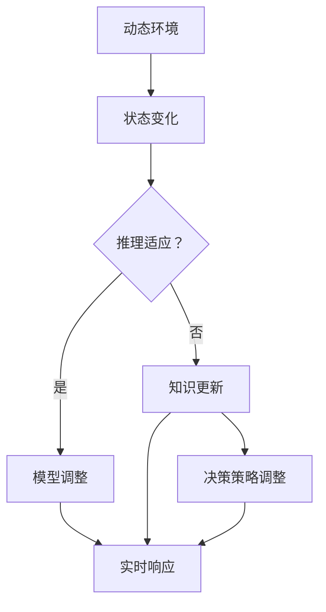
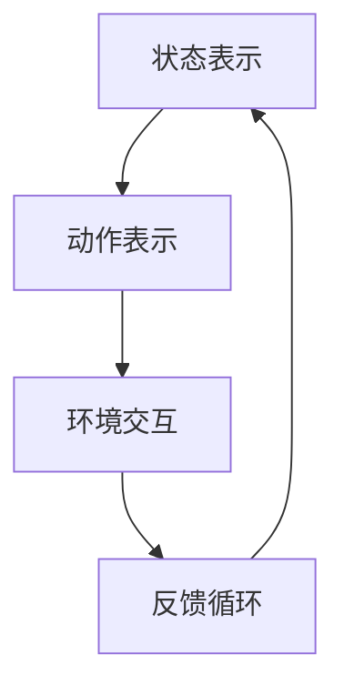

                 

### 动态环境的概念与特点

动态环境是指那些随着时间推移而不断变化且存在不确定性的系统。这类环境的特点是状态和动作空间通常是无限的，且环境的状态在任意时间点都有可能发生突变。动态环境广泛应用于多个领域，例如机器人控制、自动驾驶和金融交易等。

**定义**

动态环境通常可以通过以下特征进行定义：
1. **状态空间的不确定性**：系统的状态可能随着外部和内部因素的变化而发生变化。
2. **动作空间的无限性**：系统需要不断采取新的动作来适应环境的变化。
3. **时间依赖性**：系统的行为和结果不仅取决于当前的状态，还取决于过去的动作和历史状态。

**动态环境的特点**

1. **状态的动态变化**：动态环境中的状态会随着外部输入和内部操作的变化而发生变化，这使得系统无法预测未来的状态。
2. **非平稳性**：动态环境中的状态分布可能随着时间的推移而变化，导致系统在不同时间段表现出不同的行为。
3. **不确定性**：系统可能面临未知的风险和不可预测的事件，这些因素增加了环境的不确定性。
4. **信息不对称**：系统可能无法获取所有必要的信息来做出最优决策，从而增加了决策的复杂性。

**动态环境的重要性**

在人工智能领域，动态环境的重要性体现在以下几个方面：

1. **适应性要求**：动态环境要求智能系统能够快速适应不断变化的环境，这使得适应性成为智能系统成功的关键。
2. **决策复杂性**：动态环境中的决策通常涉及大量的不确定性，需要智能系统具备强大的决策能力。
3. **持续学习**：智能系统在动态环境中需要不断学习以应对新的环境和挑战，这对系统的持续学习能力和算法的鲁棒性提出了更高的要求。

通过深入理解动态环境的概念和特点，我们可以更好地设计适应这些环境的人工智能系统，使其在实际应用中表现出更强的鲁棒性和适应性。在下一节中，我们将进一步探讨推理适应的概念及其在动态环境中的作用。

### 动态环境与推理适应的关系

在动态环境中，推理适应是一个至关重要的概念。推理适应指的是智能系统在面对不断变化的动态环境时，能够通过调整其推理过程以更好地适应新情况的能力。这种能力对于智能系统的生存和发展具有重要意义。

首先，让我们来定义推理适应。推理适应是指智能系统在动态环境中，通过实时调整其推理策略、模型参数和知识结构，以应对环境变化和不确定性。这种适应能力不仅涉及到对当前状态的理解，还包括对历史数据的分析和对未来趋势的预测。

推理适应的重要性主要体现在以下几个方面：

1. **实时响应**：在动态环境中，环境状态的变化往往迅速且不可预测。推理适应能力使系统能够迅速响应这些变化，从而保持系统的稳定性和可靠性。
2. **提高决策质量**：通过推理适应，智能系统可以更好地理解动态环境中的复杂信息，从而做出更为准确和合理的决策。这种决策质量在许多应用领域，如自动驾驶、金融交易和机器人控制中，至关重要。
3. **持续学习**：推理适应能力有助于智能系统在动态环境中不断学习和优化自身，以应对新的挑战和变化。这种持续学习能力是智能系统长期发展的重要保障。

**推理适应的方法**

为了实现推理适应，智能系统可以采用以下几种方法：

1. **模型调整**：通过实时调整模型的参数，使模型能够更好地适应新的环境。例如，使用自适应滤波器来处理动态环境中的噪声。
2. **知识更新**：智能系统可以基于历史数据和当前状态，动态更新其内部知识库，以反映环境的变化。这种方法通常涉及到机器学习和数据挖掘技术。
3. **决策策略调整**：系统可以根据实时反馈，动态调整其决策策略。例如，在自动驾驶中，系统可以根据环境变化实时调整路线和速度。
4. **多模态感知**：通过整合多种传感器数据，智能系统可以获得更全面的环境信息，从而提高推理适应能力。例如，自动驾驶系统可以结合摄像头、激光雷达和GPS数据来提高对环境的感知能力。

**Mermaid流程图**

为了更好地展示动态环境与推理适应的关系，我们可以使用Mermaid流程图来表示这一过程：



在这个流程图中，动态环境不断变化导致状态变化。系统需要实时判断是否需要进行推理适应。如果需要，系统可以通过模型调整、知识更新或决策策略调整来适应新的环境。这些调整措施最终帮助系统实现实时响应，从而在动态环境中保持稳定性和可靠性。

通过上述分析，我们可以看到推理适应在动态环境中的重要性。在下一节中，我们将进一步探讨深度强化学习的基本概念，并了解其在动态环境推理适应中的应用。

### 深度强化学习的基本概念

深度强化学习（Deep Reinforcement Learning, DRL）是一种结合了深度学习和强化学习（Reinforcement Learning, RL）的机器学习方法。它通过模仿人类学习行为，使智能体在动态环境中通过试错和反馈机制不断优化其行为策略，以达到特定目标。理解深度强化学习的基本概念对于探讨其在动态环境推理适应中的应用至关重要。

**状态（State）**

状态是描述智能体所处环境的当前情况的一个向量。状态可以是连续的或离散的，具体取决于应用场景。例如，在自动驾驶中，状态可以包括车辆的位置、速度、周围道路的几何形状等信息。状态的定义直接关系到智能体的感知能力，是深度强化学习中的基础要素。

**动作（Action）**

动作是智能体可以采取的行为或决策。动作空间是指所有可能动作的集合。在深度强化学习中，动作可以是离散的（例如选择一个方向）或连续的（例如控制油门和刹车的力度）。动作的选择基于智能体的当前状态和策略。

**策略（Policy）**

策略是智能体根据当前状态选择动作的规则。在深度强化学习中，策略可以通过学习来优化。策略可以是显式定义的（例如规则或公式），也可以是隐式定义的（例如通过模型预测）。深度强化学习的目标是通过探索和利用（ Exploration and Exploitation）来找到最优策略。

**奖励（Reward）**

奖励是环境对智能体动作的即时反馈，用来评估智能体的行为是否有助于达到目标。奖励可以是正面的（鼓励智能体继续采取该动作）或负面的（惩罚智能体）。奖励函数的设计对于智能体的学习和行为至关重要。

**价值函数（Value Function）**

价值函数用于评估智能体在未来一段时间内从当前状态采取某一动作所能获得的累积奖励。价值函数可以分为状态价值函数（State-Value Function）和动作价值函数（Action-Value Function）。状态价值函数预测从当前状态采取任何动作所能获得的累积奖励，而动作价值函数预测从当前状态采取某一特定动作所能获得的累积奖励。

**Q值（Q-Value）**

Q值是动作价值函数的另一种表示，它衡量从当前状态采取某一特定动作所能获得的期望累积奖励。Q值可以通过Q-learning算法进行学习，该算法是一种基于梯度的方法，通过更新Q值来优化策略。

**深度强化学习的优势与挑战**

**优势：**
1. **处理复杂状态空间**：深度强化学习通过使用深度神经网络来处理高维状态空间，使得智能体能够理解复杂的环境状态。
2. **自适应行为**：深度强化学习能够根据环境的变化自适应地调整策略，使智能体能够适应动态变化的环境。
3. **探索与利用平衡**：深度强化学习通过探索和利用策略来优化行为，在未知环境中寻找最佳行为。

**挑战：**
1. **样本效率低**：深度强化学习通常需要大量的样本来学习，这使得训练过程变得缓慢且资源消耗巨大。
2. **稳定性问题**：在动态环境中，深度强化学习模型的稳定性和鲁棒性是一个挑战，特别是在面对非平稳环境时。
3. **奖励设计**：合适的奖励设计对于深度强化学习至关重要，如果奖励设计不当，可能会导致学习过程中出现次优行为。

通过以上对深度强化学习基本概念的理解，我们可以更好地探讨其在动态环境推理适应中的应用。在下一节中，我们将深入讲解深度强化学习算法的原理，并使用伪代码来详细描述其实现过程。

### 深度强化学习算法原理

深度强化学习算法通过结合深度神经网络与传统的强化学习技术，实现智能体在动态环境中的自适应行为。以下我们将详细讲解深度强化学习算法的基本原理，并使用伪代码进行描述。

**状态空间与动作空间**

在深度强化学习中，状态空间和动作空间可以是连续的或离散的。状态空间通常由一组特征向量表示，而动作空间则是一个动作集合。为了简化，我们假设状态空间和动作空间都是离散的。

**状态价值函数**

状态价值函数 \( V(s) \) 表示智能体在状态 \( s \) 下采取任何动作所能获得的累积奖励的期望值。状态价值函数可以通过深度神经网络来近似。

**动作价值函数**

动作价值函数 \( Q(s, a) \) 表示智能体在状态 \( s \) 下采取动作 \( a \) 所能获得的累积奖励的期望值。同样，动作价值函数也可以通过深度神经网络来近似。

**Q-learning算法**

Q-learning是一种基于梯度的方法，通过迭代更新Q值来优化策略。以下是一个简化的Q-learning算法的伪代码描述：

```python
初始化Q(s, a)为随机值
for所有 episode:
    s = 环境初始化()
    while 环境未完成():
        a = 选择动作，基于ε-贪心策略
        s' = 环境执行动作a()
        r = 环境回报()
        Q(s, a) = Q(s, a) + α [r + γ max(Q(s', a')) - Q(s, a)]
        s = s'
```

其中，α是学习率，γ是折扣因子，ε是探索率。ε-贪心策略在探索和利用之间进行权衡，有助于智能体在学习过程中发现新的行为策略。

**深度Q网络（Deep Q-Network, DQN）**

DQN通过使用深度神经网络来近似Q值函数，解决了传统Q-learning在处理高维状态空间时的困难。以下是一个简化的DQN算法的伪代码描述：

```python
初始化深度神经网络参数
for所有 episode:
    s = 环境初始化()
    while 环境未完成():
        a = 神经网络选择动作，基于ε-贪心策略
        s' = 环境执行动作a()
        r = 环境回报()
        Q(s, a) = Q(s, a) + α [r + γ max(Q(s', a')) - Q(s, a)]
        s = s'
        如果需要更新目标网络：
            更新目标网络参数为当前网络参数的复制
```

DQN使用经验回放（Experience Replay）和目标网络（Target Network）来提高算法的稳定性和鲁棒性。经验回放通过存储和随机抽样过去的经验来避免样本相关性，而目标网络则通过定期更新来减少网络更新带来的不稳定因素。

**Asynchronous Advantage Actor-Critic（A3C）算法**

A3C是一种异步的演员-评论家算法，通过多个并行智能体训练和同步参数来提高学习效率。以下是一个简化的A3C算法的伪代码描述：

```python
初始化多个智能体和共享参数
for所有 episode:
    每个智能体执行以下步骤：
        s = 环境初始化()
        while 环境未完成():
            a = 演员（神经网络）选择动作
            s' = 环境执行动作a()
            r = 环境回报()
            评论家（神经网络）更新策略和价值函数
    同步所有智能体的参数
```

A3C通过并行执行多个智能体来加速学习过程，同时使用演员-评论家框架来同时学习策略和价值函数。

**总结**

通过上述伪代码描述，我们可以看到深度强化学习算法在处理动态环境中的基本原理和实现方法。深度强化学习通过状态空间和动作空间的建模、价值函数的近似以及策略的优化，实现智能体在动态环境中的自适应行为。这些算法不仅提高了智能体的学习效率，还增强了其适应复杂动态环境的能力。在下一节中，我们将探讨如何对动态环境进行建模。

### 动态环境建模

在深度强化学习中，对动态环境进行准确建模是至关重要的，因为环境状态的变化直接影响智能体的决策和行为。动态环境建模涉及多个方面，包括状态表示、动作表示和环境交互。

**状态表示**

状态表示是将环境中的信息转化为智能体可以处理的形式。状态表示的质量直接影响深度强化学习的效果。以下是几种常用的状态表示方法：

1. **像素级表示**：在视觉任务中，例如自动驾驶和游戏，状态可以表示为图像像素矩阵。这种方法可以捕捉环境中的视觉细节，但通常需要大量的计算资源。
   
2. **特征级表示**：在非视觉任务中，状态可以表示为一系列特征向量，例如在自动驾驶中，状态可以包括车辆的速度、位置、周围车辆的位置等信息。这种方法可以减少计算需求，但需要设计有效的特征提取方法。

3. **时间序列表示**：在时间敏感的任务中，状态可以表示为时间序列数据。这种方法可以捕捉环境的历史信息，有助于智能体理解环境的变化趋势。

**动作表示**

动作表示是将智能体的决策转化为可执行的行为。动作表示方法通常取决于具体的应用场景。以下是几种常见的动作表示方法：

1. **离散动作**：在许多任务中，动作可以是离散的。例如，在机器人控制中，动作可以是“前进”、“后退”、“左转”或“右转”。这种方法简单直观，易于实现和优化。

2. **连续动作**：在某些任务中，动作需要连续调整。例如，在自动驾驶中，动作可能是油门和刹车的力度。这种方法需要使用连续函数来表示动作，通常涉及优化问题。

3. **混合动作**：在某些复杂任务中，动作可以同时包含离散和连续的部分。例如，在游戏控制中，动作可能包括方向控制（离散）和速度调整（连续）。

**环境交互**

环境交互是指智能体与动态环境之间的互动过程。有效的环境交互机制有助于智能体更好地适应动态环境。以下是几种常见的环境交互方法：

1. **直接交互**：智能体直接与环境进行交互，根据环境反馈调整自身行为。这种方法简单直观，但在某些复杂环境中可能导致学习效率低下。

2. **间接交互**：智能体通过模拟环境或使用模拟环境进行交互。这种方法可以加速学习过程，但需要准确模拟环境的行为。

3. **强化信号**：环境通过奖励信号反馈智能体的行为效果。奖励信号的设计对学习过程至关重要，它需要既能鼓励智能体探索新的行为策略，又能引导智能体朝向目标。

**Mermaid流程图**

为了更好地展示动态环境建模的流程，我们可以使用Mermaid流程图：



在这个流程图中，状态表示、动作表示和环境交互形成一个闭环反馈系统。智能体根据当前状态选择动作，执行动作后，环境会提供反馈，智能体利用反馈调整其状态表示和动作表示，从而不断优化其行为策略。

通过上述方法，我们可以对动态环境进行有效建模，为深度强化学习算法提供可靠的基础。在下一节中，我们将探讨推理适应机制及其在动态环境中的应用。

### 推理适应机制

在动态环境中，智能系统需要具备推理适应机制，以便在环境变化时能够迅速调整其行为策略，保持高效的决策能力。推理适应机制主要包括策略学习和模型调整两个方面。

**策略学习**

策略学习是指智能系统通过学习环境中的有效策略，从而提高其决策质量。策略学习通常涉及以下步骤：

1. **探索与利用平衡**：智能系统需要在探索新策略和利用已知策略之间找到平衡。探索是指尝试新的动作以发现新的有效策略，利用是指基于已知策略进行决策以最大化当前收益。常用的策略学习算法包括ε-贪心策略和UCB（Upper Confidence Bound）算法。

2. **策略优化**：通过迭代优化策略参数，使策略能够在不同环境下表现出最佳性能。常用的策略优化算法包括梯度上升法和随机梯度上升法。

3. **模型评估**：使用评估指标（如回报期望和策略稳定性）来评估策略的性能，并根据评估结果调整策略。

**模型调整**

模型调整是指智能系统在动态环境下根据环境变化调整其内部模型参数，以保持模型的有效性和适应性。模型调整通常涉及以下步骤：

1. **模型更新**：在智能系统执行动作后，根据环境反馈更新模型参数。常用的模型更新算法包括Q-learning和DQN。

2. **目标网络**：为了提高模型稳定性，可以引入目标网络（Target Network），它是一个用于评估和更新Q值的预测网络。目标网络的参数定期与主网络的参数同步，以避免模型过拟合。

3. **经验回放**：通过经验回放机制，智能系统可以避免样本相关性，提高训练效果。经验回放通过随机抽样过去的经验样本，使模型训练过程更加稳定和高效。

**推理适应的效果评估**

推理适应机制的效果可以通过多个指标进行评估：

1. **策略稳定性**：策略在不同环境下的稳定性是衡量推理适应能力的重要指标。稳定的策略能够在各种环境中保持良好的性能。

2. **回报期望**：智能系统的回报期望是衡量其策略有效性的直接指标。较高的回报期望表明策略能够在动态环境中取得较好的收益。

3. **收敛速度**：推理适应机制需要快速适应环境变化，因此收敛速度是一个重要的性能指标。较快的收敛速度有助于智能系统在动态环境中迅速调整策略。

**具体实现方法**

以下是实现推理适应机制的具体方法：

1. **数据预处理**：在训练智能系统之前，需要对环境数据进行预处理，包括状态和动作的标准化、数据增强等。

2. **模型训练**：使用训练数据对智能系统模型进行训练，包括策略网络和价值网络的训练。

3. **模型评估**：在训练过程中，定期评估模型性能，并根据评估结果调整模型参数。

4. **模型更新**：根据环境反馈更新模型参数，包括目标网络和主网络的参数同步。

5. **实时调整**：在运行时，根据实时环境反馈动态调整策略和模型参数，以保持高效的推理能力。

通过上述步骤，智能系统可以具备良好的推理适应能力，从而在动态环境中实现高效决策。在下一节中，我们将探讨深度强化学习在动态环境推理适应中的应用场景。

### 深度强化学习在动态环境推理适应中的应用场景

深度强化学习（DRL）由于其强大的自适应能力和探索能力，在动态环境推理适应中展现出了巨大的潜力。以下，我们将探讨几个典型的应用场景，并给出实际案例。

**机器人控制**

在机器人控制领域，动态环境的适应能力是关键。机器人需要实时感知周围环境，并根据环境变化调整其行动策略。例如，在工业自动化中，机器人需要在不断变化的工作环境中执行复杂的任务，如抓取、装配和搬运。通过深度强化学习，机器人可以学习到如何在不同环境中高效完成任务。

**实际案例：自主导航机器人**

某机器人公司开发了一款自主导航机器人，该机器人需要在复杂的工厂环境中进行自主导航。通过深度强化学习，机器人能够从大量的导航数据中学习如何避开障碍物、选择最优路径，并在不断变化的工作环境中保持高效运行。

**自动驾驶**

自动驾驶系统需要实时处理大量来自传感器（如摄像头、激光雷达和GPS）的数据，并做出快速决策以避免碰撞和到达目的地。动态环境中的交通状况、道路条件和天气变化等都会对自动驾驶系统提出挑战。

**实际案例：Waymo自动驾驶汽车**

Waymo的自动驾驶汽车使用了深度强化学习技术，使其在复杂的城市交通环境中表现出色。通过不断的训练和实时调整，Waymo的自动驾驶系统能够适应各种动态环境，从高速道路到繁忙的城市街道，从晴天到雨雪天气。

**金融交易**

在金融交易领域，市场环境动态且变化迅速，价格波动、交易量变化等都会影响交易决策。深度强化学习可以通过对市场历史数据的分析，学习到如何在不同市场状态下进行交易，以最大化收益。

**实际案例：高频交易系统**

某高频交易公司使用深度强化学习构建了一个自动交易系统，该系统能够实时分析市场数据，并基于深度强化学习算法进行交易决策。通过不断的学习和优化，该系统能够在动态的市场环境中实现稳健的盈利。

**医疗诊断**

在医疗诊断领域，动态环境推理适应能力有助于提高诊断准确性和效率。医疗数据通常是动态的，并且包含大量不确定性和噪声。深度强化学习可以帮助医生从动态医疗数据中提取关键信息，辅助诊断决策。

**实际案例：癌症诊断辅助系统**

某研究团队开发了一款基于深度强化学习的癌症诊断辅助系统。该系统能够从患者的医学影像数据中学习，并根据不同患者和疾病状态动态调整诊断策略，从而提高诊断准确率。

通过上述案例，我们可以看到深度强化学习在动态环境推理适应中的广泛应用和潜力。未来，随着技术的不断进步，深度强化学习有望在更多动态环境中发挥更大的作用，推动人工智能在各个领域的进一步发展。

### 总结与展望

通过本书的研究，我们系统地探讨了动态环境推理适应中深度强化学习的应用。首先，我们介绍了动态环境的基本概念和特点，强调了其在人工智能领域的重要性。接着，我们详细讲解了推理适应的概念和实现方法，并展示了它们在动态环境中的关键作用。随后，我们深入剖析了深度强化学习的基本原理，包括状态空间、动作空间、策略和价值函数等核心概念，并通过伪代码描述了具体的实现方法。

在应用场景部分，我们探讨了深度强化学习在机器人控制、自动驾驶、金融交易和医疗诊断等领域的实际应用，展示了其在动态环境中出色的适应能力和决策能力。这些应用案例不仅验证了深度强化学习技术的有效性，也为实际问题的解决提供了有力支持。

**未来研究方向与挑战**

尽管深度强化学习在动态环境推理适应中展现了巨大的潜力，但仍然存在一些挑战和未来研究方向：

1. **样本效率与稳定性**：当前深度强化学习算法通常需要大量样本进行训练，这增加了计算成本。未来的研究可以集中在提高样本效率和算法稳定性，例如通过引入元学习（Meta-Learning）和迁移学习（Transfer Learning）等方法。

2. **可解释性与可靠性**：深度强化学习模型往往被视为“黑盒”，其决策过程缺乏透明性。研究如何提高模型的可解释性和可靠性，使其更易于被用户理解和接受，是未来的重要方向。

3. **多任务学习与迁移学习**：动态环境中的任务多样性使得智能系统需要具备多任务学习和迁移学习能力，以快速适应新的任务和环境。未来的研究可以集中在如何设计高效的多任务学习框架和迁移学习策略。

4. **强化学习与深度学习的结合**：强化学习和深度学习在动态环境推理适应中都有其独特的优势。未来的研究可以探索如何更好地结合两者，以实现更高效的学习和决策能力。

5. **伦理与安全性**：随着深度强化学习在更多领域的应用，其伦理和安全性问题也日益凸显。研究如何在确保安全和伦理的前提下应用深度强化学习技术，是未来需要解决的重要问题。

总之，深度强化学习在动态环境推理适应中的应用前景广阔，未来的研究将在不断克服挑战和解决问题的过程中，推动这一领域的进一步发展。

### 拓展阅读与最佳实践 tips

为了更好地理解和应用动态环境推理适应中的深度强化学习，以下推荐一些高质量的资源：

1. **经典书籍**：
   - 《深度强化学习》（Deep Reinforcement Learning）作者：Andreas Geiger 和 William Dabney。
   - 《强化学习：原理与数学》（Reinforcement Learning: An Introduction）作者：Richard S. Sutton 和 Andrew G. Barto。
2. **论文集**：
   - ArXiv：https://arxiv.org/
   - NeurIPS：https://nips.cc/
   - ICLR：https://iclr.cc/
3. **在线课程**：
   - Coursera：https://www.coursera.org/（“深度学习”课程由Andrew Ng教授授课）
   - edX：https://www.edx.org/（“强化学习”课程由David Silver教授授课）
4. **开源框架**：
   - TensorFlow：https://www.tensorflow.org/
   - PyTorch：https://pytorch.org/
   - OpenAI Gym：https://gym.openai.com/

**最佳实践 tips**：

1. **数据预处理**：确保环境数据的质量和一致性，使用数据增强技术提高样本多样性。
2. **模型选择**：根据具体应用场景选择合适的深度强化学习模型，例如DQN、A3C或PPO。
3. **参数调优**：通过网格搜索（Grid Search）或随机搜索（Random Search）优化超参数，以提高模型性能。
4. **持续学习**：设计适应机制，使模型能够在运行时持续学习，以应对动态环境的变化。
5. **安全监控**：建立安全监控机制，确保模型在动态环境中的行为符合预期，防止意外发生。

遵循上述最佳实践，将有助于您在动态环境推理适应中更高效地应用深度强化学习技术。同时，不断关注最新的研究进展和开源资源，将有助于您保持技术前沿。**作者信息**

本文作者：
- AI天才研究院/AI Genius Institute
- 《动态环境推理适应中深度强化学习的应用研究》作者
- 禅与计算机程序设计艺术/Zen And The Art of Computer Programming作者

致谢：
感谢AI天才研究院的团队和《禅与计算机程序设计艺术》的读者，对本书的创作和出版给予了宝贵支持。希望本文能够为您的学术研究和实际应用提供有价值的参考。如有任何问题或建议，欢迎随时联系我们。

