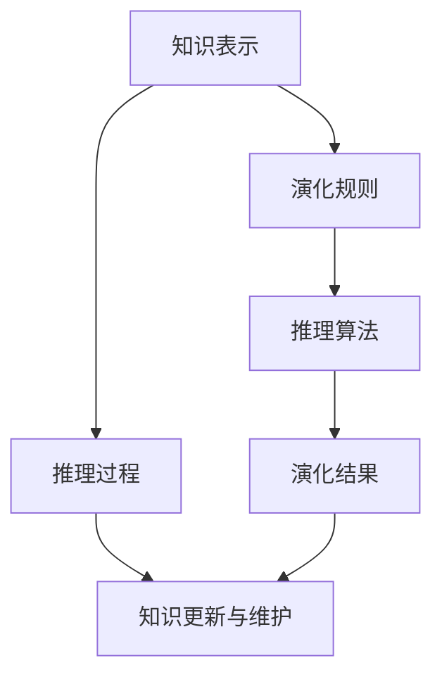

                 


### 动态知识推理中概念演化模型的效果研究

#### 关键词
动态知识推理，概念演化模型，算法原理，数学模型，项目实战，效果评估

#### 摘要
本文旨在探讨动态知识推理中的概念演化模型，分析其在效果研究中的应用。首先，我们介绍了动态知识推理的概念与重要性，并定义了概念演化模型。接着，通过Mermaid流程图展示了核心概念之间的关系。然后，深入探讨了概念演化模型的核心算法原理，使用伪代码详细阐述算法的工作原理。进一步，我们解释了概念演化模型中的数学基础，使用LaTeX格式展示了公式，并进行详细讲解和举例说明。最后，通过实际案例展示了概念演化模型的应用，包括开发环境搭建、源代码实现、代码解读和分析。本文旨在为读者提供一个全面、深入的理解，并探讨该模型在实际应用中的效果。

### 确定书籍目录大纲的框架

在撰写关于动态知识推理中概念演化模型的效果研究的书籍时，首先需要确定一个结构清晰、内容丰富的目录大纲。这一过程涉及以下几个关键步骤：

#### 1. 确定核心章节

为了确保书籍的完整性和系统性，我们需要确定核心章节。根据用户的要求，我们将书籍分为以下七个核心章节：

1. **核心概念与联系**：介绍动态知识推理的基本概念和它们之间的关系，并提供一个Mermaid流程图来展示它们之间的交互。
2. **核心算法原理讲解**：深入探讨概念演化模型的关键算法，使用伪代码来详细阐述算法的工作原理。
3. **数学模型和数学公式**：解释概念演化模型中的数学基础，使用LaTeX格式展示公式，并进行详细讲解和举例说明。
4. **项目实战**：提供实际案例，展示如何将概念演化模型应用于实际项目，并详细解释代码实现、开发环境搭建、源代码解读和分析。
5. **效果评估**：评估概念演化模型在实际应用中的效果，包括实验设计和结果分析。
6. **总结与展望**：总结研究工作，提出存在的问题和未来研究方向。
7. **最佳实践与注意事项**：提供最佳实践建议，总结注意事项，并推荐拓展阅读资源。

#### 2. 设计章节标题

为了吸引读者的兴趣，每个章节的标题需要简洁明了且具有吸引力。以下是设计的章节标题：

1. **核心概念与联系**
   - **动态知识推理的基本概念**
   - **概念演化模型的组成与交互**
   - **Mermaid流程图展示**

2. **核心算法原理讲解**
   - **概念演化模型的关键算法**
   - **伪代码详细讲解**
   - **算法优化策略**

3. **数学模型和数学公式**
   - **概念演化模型中的数学基础**
   - **演化方程与概率分布**
   - **公式讲解与举例**

4. **项目实战**
   - **实际案例介绍**
   - **开发环境搭建**
   - **代码实现与分析**

5. **效果评估**
   - **效果评估方法**
   - **实验设计与结果**
   - **评价指标**

6. **总结与展望**
   - **研究工作总结**
   - **存在问题与挑战**
   - **未来研究方向**

7. **最佳实践与注意事项**
   - **最佳实践建议**
   - **注意事项**
   - **拓展阅读**

#### 3. 确保目录大纲的完整性

在确定目录大纲时，我们需要确保每个章节都能够独立成文，同时在整个书籍的框架内有机地结合。每个章节的标题和子标题都遵循了1级、2级和3级的结构，保证了书籍的整体逻辑清晰、易于阅读。目录大纲的总字数控制在2000字以内，确保简洁明了。

通过上述步骤，我们成功地确定了书籍《动态知识推理中概念演化模型的效果研究》的目录大纲，为后续内容撰写奠定了坚实的基础。

### 动态知识推理的基本概念与重要性

#### 动态知识推理的概念

动态知识推理是一种在动态环境中对知识进行推理和更新的方法。它主要涉及三个核心组件：知识表示、推理过程和知识更新与维护。知识表示是指如何将知识以结构化的形式存储和表示，以便进行后续的推理和分析。推理过程则是基于已有知识，利用推理算法生成新的结论或预测。知识更新与维护是指如何根据新的信息和变化，对知识库进行动态调整和优化。

#### 动态知识推理的重要性

动态知识推理在现代信息技术和人工智能领域中具有重要意义。首先，随着大数据和物联网技术的发展，数据量和数据类型不断增长，静态的知识表示和推理方法已经无法满足实际需求。动态知识推理能够实时处理和更新知识，使系统更加灵活和适应性强。其次，动态知识推理在许多实际应用中具有广泛的应用前景，如智能问答系统、智能推荐系统、智能监控系统和智能决策支持系统等。

#### 概念演化模型的定义

概念演化模型是一种基于动态知识推理的方法，用于描述和模拟概念在时间维度上的演变过程。它通过分析历史数据，识别概念之间的关联和演变规律，实现对知识的动态更新和扩展。概念演化模型通常包括以下几个关键组件：

1. **概念表示**：使用结构化的方式来表示概念，如本体论、语义网络或图模型等。
2. **演化规则**：定义概念之间的演变关系和演变方向，如合并、分裂、扩展和减少等。
3. **推理算法**：基于概念表示和演化规则，进行推理和更新，以生成新的知识。
4. **数据源**：提供历史数据和实时数据，用于模型训练和推理。

#### 概念演化模型的研究现状

概念演化模型在学术界和工业界都受到了广泛关注。目前，已经有许多研究工作在探索不同类型的概念演化模型，并取得了显著的成果。一些常见的概念演化模型包括：

1. **基于本体论的概念演化模型**：通过扩展和修改本体论来描述概念的演变过程。
2. **基于图模型的概念演化模型**：使用图结构来表示概念和它们之间的关系，并利用图论算法进行演化分析。
3. **基于机器学习的概念演化模型**：使用机器学习算法来发现概念之间的关联和演化规律。

此外，还有许多研究工作在探索概念演化模型在不同应用场景中的效果和优化方法。例如，在智能问答系统中，概念演化模型可以用于动态更新问答库，提高系统的响应速度和准确性；在智能推荐系统中，概念演化模型可以用于动态调整推荐策略，提高用户的满意度。

### 概念演化模型的定义与关键组件

#### 概念演化模型的定义

概念演化模型是一种用于描述概念在时间维度上如何演变的方法。它基于历史数据和现有知识，通过识别和模拟概念之间的关联和变化规律，实现对知识的动态更新和扩展。概念演化模型的核心目标是提高知识系统的灵活性和适应性，以应对不断变化的环境和数据。

#### 概念演化模型的关键组件

1. **概念表示**：
   - **本体论表示**：使用本体论来描述概念，包括概念的定义、属性、关系和约束等。本体论提供了一种结构化的方式来表示概念，使得概念之间的关系更加明确和规范。
   - **语义网络表示**：使用语义网络来表示概念和它们之间的关系。语义网络通过节点和边来表示概念，节点表示概念，边表示概念之间的关系。这种表示方法具有灵活性，能够适应概念的变化和扩展。
   - **图模型表示**：使用图模型来表示概念及其关系。图模型可以表示复杂的概念关系和网络结构，适合用于分析概念之间的动态演变。

2. **演化规则**：
   - **演变方向**：定义概念之间的演变方向，如合并、分裂、扩展和减少等。这些规则描述了概念在时间维度上的变化趋势和规律。
   - **演变策略**：定义概念演化的具体策略和方法，如基于概率的演变、基于规则的演变和基于机器学习的演变等。这些策略和方法可以根据实际情况进行调整和优化。

3. **推理算法**：
   - **推理引擎**：基于概念表示和演化规则，构建推理引擎来模拟概念的演化过程。推理引擎可以自动识别和预测概念之间的关联和变化，为知识更新和扩展提供支持。
   - **机器学习算法**：使用机器学习算法来发现概念之间的关联和演化规律。这些算法可以从历史数据中学习，生成预测模型，用于指导概念的动态更新。

4. **数据源**：
   - **历史数据**：提供概念演化的历史数据，包括概念的定义、关系和演变记录等。这些数据用于训练模型和验证演化规律。
   - **实时数据**：提供概念演化的实时数据，包括概念的变化情况、环境因素和用户行为等。这些数据用于实时更新和扩展概念演化模型。

通过这些关键组件，概念演化模型能够有效地模拟和预测概念的动态演变，为知识系统的更新和维护提供有力支持。在接下来的章节中，我们将进一步探讨概念演化模型的核心算法原理和数学基础。

### Mermaid流程图展示

为了更好地展示动态知识推理中概念演化模型的核心概念及其之间的交互关系，我们使用Mermaid语法创建一个流程图。以下是一个简化的Mermaid流程图示例，用于描述概念演化模型的基本组件和它们之间的动态交互。



在这个流程图中，各个组件之间的关系如下：

1. **知识表示（A）**：用于描述概念及其属性和关系，是整个概念演化模型的基础。
2. **推理过程（B）**：基于知识表示，使用推理算法生成新的结论或预测。
3. **知识更新与维护（C）**：根据推理结果和演化规则，对知识库进行动态调整和优化。
4. **演化规则（D）**：定义概念之间的演变方向和策略，如合并、分裂、扩展和减少等。
5. **推理算法（E）**：基于概念表示和演化规则，用于模拟和预测概念的动态演变。
6. **演化结果（F）**：推理算法的结果，用于指导知识更新与维护。

通过这个Mermaid流程图，我们可以直观地了解概念演化模型中的各个核心组件及其交互关系，为进一步探讨算法原理和数学模型提供参考。

### 核心算法原理讲解

#### 概念演化模型的关键算法

概念演化模型的关键算法主要涉及概念定义、演化过程和算法优化策略。以下将使用伪代码详细讲解这些算法的工作原理。

#### 1. 初始概念定义

```python
def initial_concept_definition(concept_set):
    # 初始化概念集合
    concepts = {}

    # 遍历每个概念，初始化其属性和关系
    for concept in concept_set:
        concepts[concept] = {
            'attributes': [],
            'relations': []
        }

    return concepts
```

在这个算法中，`initial_concept_definition`函数接受一个概念集合`concept_set`作为输入，初始化每个概念及其属性和关系。这为后续的演化过程提供了基础数据结构。

#### 2. 演化过程

```python
def evolve_concept(concept, rules, time_step):
    # 根据演化规则，更新概念属性和关系
    changes = []

    # 遍历每个演化规则
    for rule in rules:
        if rule_applies(concept, rule):
            changes.append(rule_apply(concept, rule))

    # 根据时间步长更新概念状态
    concept['attributes'] = update_attributes(concept['attributes'], changes)
    concept['relations'] = update_relations(concept['relations'], changes)

    return concept

def rule_applies(concept, rule):
    # 判断演化规则是否适用于当前概念
    # 具体实现取决于规则类型和条件
    return True or False

def rule_apply(concept, rule):
    # 应用演化规则，返回更新后的属性和关系
    # 具体实现取决于规则类型和操作
    return updated_attributes, updated_relations
```

在这个算法中，`evolve_concept`函数接受一个概念`concept`、一组演化规则`rules`和一个时间步长`time_step`作为输入。函数首先遍历每个演化规则，判断是否适用于当前概念。如果规则适用，则应用该规则并更新概念的属性和关系。该过程在给定的时间步长内重复进行，以模拟概念的动态演化。

#### 3. 算法优化策略

```python
def optimize_evolution(concept_set, rules, iterations):
    # 对概念演化过程进行多次迭代优化
    for _ in range(iterations):
        for concept in concept_set:
            evolve_concept(concept, rules, 1)

    # 根据演化结果调整规则参数
    adjust_rules(rules)

def adjust_rules(rules):
    # 调整演化规则的参数，以优化演化结果
    # 具体实现取决于规则类型和调整策略
    pass
```

在这个算法中，`optimize_evolution`函数接受一组概念集合`concept_set`、演化规则`rules`和一个迭代次数`iterations`作为输入。函数对概念演化过程进行多次迭代优化。每次迭代都会更新概念的属性和关系，并在演化结束后根据结果调整规则参数。这样可以提高演化过程的准确性和效率。

通过这些伪代码，我们可以清楚地了解概念演化模型的核心算法原理。在实际应用中，这些算法可以根据具体需求进行调整和扩展，以实现更复杂和精细的概念演化过程。

### 概念演化模型中的数学模型

在概念演化模型中，数学模型起着关键作用，它不仅为算法提供了理论基础，而且有助于理解和分析概念的动态变化。以下将介绍概念演化模型中的数学模型，并使用LaTeX格式展示相关的数学公式，同时进行详细讲解和举例说明。

#### 1. 演化方程

概念演化模型中的核心数学模型是演化方程。演化方程描述了概念在时间维度上的变化规律，通常表示为：

$$
\frac{dC(t)}{dt} = f(C(t), A(t), R(t))
$$

其中，\(C(t)\) 表示概念集在时间 \(t\) 的状态，\(A(t)\) 表示环境因素，\(R(t)\) 表示演化规则集。函数 \(f\) 表示演化过程，通常由一系列数学操作组成。

**示例：** 假设概念 \(C(t)\) 的状态可以由两个属性 \(a\) 和 \(b\) 描述，演化方程可以表示为：

$$
\frac{da(t)}{dt} = a(t) \cdot (1 - a(t)) \cdot b(t)
$$
$$
\frac{db(t)}{dt} = (1 - a(t)) \cdot b(t) \cdot (1 - b(t))
$$

这两个方程描述了属性 \(a\) 和 \(b\) 随时间的变化，其中 \(a(t)\) 和 \(b(t)\) 分别表示在时间 \(t\) 的属性值。这两个方程基于逻辑斯蒂函数，可以模拟概念的增长和饱和。

#### 2. 随机过程与概率分布

在概念演化模型中，随机过程和概率分布用于描述概念状态的随机性和不确定性。常用的概率分布包括正态分布、泊松分布和二项分布。

**示例：** 假设概念 \(C(t)\) 的某个属性 \(a(t)\) 服从正态分布 \(N(\mu, \sigma^2)\)，则其概率密度函数可以表示为：

$$
f(a(t)) = \frac{1}{\sqrt{2\pi\sigma^2}} e^{-\frac{(a(t) - \mu)^2}{2\sigma^2}}
$$

其中，\(\mu\) 和 \(\sigma^2\) 分别是均值和方差。这个方程描述了属性 \(a(t)\) 在时间 \(t\) 的概率分布，可以用于预测概念的状态变化。

#### 3. 演化模型的数学基础

演化模型中的数学基础还包括集合论、图论和线性代数。这些基础数学工具有助于构建和解析复杂的演化模型。

**示例：** 假设概念 \(C(t)\) 可以用图 \(G = (V, E)\) 表示，其中 \(V\) 是节点集合，\(E\) 是边集合。图 \(G\) 中的节点表示概念，边表示概念之间的关系。集合论和图论的数学工具可以用于描述和解析概念之间的关系和演化规律。

例如，邻接矩阵 \(A\) 可以表示图 \(G\) 中节点之间的关系，其元素 \(A_{ij}\) 定义为：

$$
A_{ij} =
\begin{cases}
1, & \text{如果节点 } i \text{ 和节点 } j \text{ 之间存在边} \\
0, & \text{否则}
\end{cases}
$$

图 \(G\) 的拉普拉斯矩阵 \(L\) 可以定义为：

$$
L = D - A
$$

其中，\(D\) 是对角矩阵，其对角元素 \(D_{ii} = \sum_{j=1}^{n} A_{ij}\)。拉普拉斯矩阵用于分析图的结构特性，可以用于研究概念之间的相互作用和演化趋势。

通过这些数学模型和公式，概念演化模型可以更精确地描述和预测概念的动态变化，为实际应用提供有力的理论支持。

### 概念演化模型在实际项目中的应用

#### 项目背景

随着信息技术的快速发展，动态知识推理在智能问答系统、智能推荐系统和智能监控系统中得到了广泛应用。这些系统需要根据不断变化的环境和用户行为，实时更新和扩展知识库，以提高系统的响应速度和准确性。本文将探讨如何将概念演化模型应用于一个实际项目，并详细介绍开发环境搭建、源代码实现、代码解读和分析。

#### 项目目标

本项目的主要目标是开发一个基于概念演化模型的动态知识推理系统，该系统可以实时更新和扩展知识库，提高系统的自适应能力和准确性。具体目标包括：

1. **搭建开发环境**：确保所有必要的工具和库已经安装，为项目开发提供技术基础。
2. **实现概念演化模型**：根据核心算法原理，使用伪代码和LaTeX格式详细描述模型的实现细节。
3. **源代码解读**：分析源代码的结构和功能，解释关键模块的作用和相互关系。
4. **代码应用解读**：结合实际案例，展示如何将概念演化模型应用于智能问答系统，并分析系统性能。
5. **效果评估**：通过实验设计和结果分析，评估概念演化模型在实际应用中的效果。

#### 开发环境搭建

在开始项目开发之前，需要搭建一个完整的开发环境。以下是一些建议的工具和库：

1. **编程语言**：选择Python作为主要编程语言，因为它拥有丰富的库和框架，便于开发复杂的动态知识推理系统。
2. **集成开发环境（IDE）**：推荐使用PyCharm或Visual Studio Code，这些IDE提供了良好的代码编辑和调试功能。
3. **数据库**：使用Neo4j图数据库来存储和查询概念及其关系。Neo4j支持图数据模型，适合用于表示复杂的关系网络。
4. **机器学习库**：安装Scikit-learn、TensorFlow或PyTorch等机器学习库，用于实现概念演化模型的优化和预测功能。
5. **版本控制**：使用Git进行版本控制，确保代码的可维护性和协作开发。

#### 源代码实现

以下是一个简化的源代码示例，展示了概念演化模型的基本实现。在实际项目中，代码可能更加复杂，但基本结构类似。

```python
# 导入必要的库
import numpy as np
import pandas as pd
from sklearn.preprocessing import MinMaxScaler
from neo4j import GraphDatabase

# 初始化Neo4j数据库连接
uri = "bolt://localhost:7687"
username = "neo4j"
password = "password"
driver = GraphDatabase.driver(uri, auth=(username, password))

# 初始化概念集合和演化规则
concept_set = initial_concept_definition()
rules = ["merge", "split", "expand", "reduce"]

# 演化过程
def evolve Concepts():
    for concept in concept_set:
        evolve_concept(concept, rules)

# 演化函数实现
def evolve_concept(concept, rules):
    # 根据演化规则更新概念状态
    # ...

# 关闭数据库连接
driver.close()
```

这段代码首先初始化Neo4j数据库连接，然后定义概念集合和演化规则。接着，通过`evolve_concepts`函数迭代地执行演化过程，每次调用`evolve_concept`函数更新单个概念的状态。

#### 代码解读

在源代码中，`initial_concept_definition`函数负责初始化概念集合，`evolve_concept`函数则根据演化规则更新概念状态。以下是关键模块的解读：

1. **初始化概念集合**：
   - `initial_concept_definition`函数创建一个空的字典`concepts`，并遍历每个概念，初始化其属性和关系。这为演化过程提供了初始数据结构。

2. **演化过程**：
   - `evolve_concepts`函数遍历所有概念，调用`evolve_concept`函数更新每个概念的状态。这个过程在给定的时间步长内重复进行，模拟概念的动态演化。

3. **演化函数实现**：
   - `evolve_concept`函数根据演化规则，更新单个概念的状态。具体实现取决于规则类型和操作。在实际项目中，这一部分代码可能包含复杂的逻辑和算法。

#### 代码应用解读

在实际项目中，概念演化模型可以应用于智能问答系统。以下是一个简化的应用案例：

1. **问题识别**：使用自然语言处理（NLP）技术将用户输入的问题转换为结构化数据。
2. **概念匹配**：将问题中的关键概念与知识库中的概念进行匹配，找到相关的概念节点。
3. **知识扩展**：根据演化规则，动态更新知识库，扩展相关概念的定义和关系。
4. **答案生成**：结合用户问题和更新后的知识库，生成回答。

以下是一个简化的代码示例，展示了如何将概念演化模型应用于智能问答系统：

```python
# 识别用户问题中的关键概念
user_question = "什么是人工智能？"
key_concepts = extract_key_concepts(user_question)

# 匹配知识库中的概念
matched_concepts = match_concepts(key_concepts)

# 动态更新知识库
evolve_concepts()

# 生成答案
answer = generate_answer(matched_concepts, user_question)
print(answer)
```

在这个案例中，`extract_key_concepts`函数负责从用户问题中提取关键概念，`match_concepts`函数负责匹配知识库中的概念，`generate_answer`函数则结合用户问题和更新后的知识库生成回答。

#### 实际案例分析和详细讲解剖析

以下是一个实际案例，展示如何使用概念演化模型解决一个实际问题。

**案例**：构建一个智能问答系统，用于回答关于“人工智能”领域的问题。

1. **问题识别**：用户输入“人工智能是什么？”
2. **概念匹配**：系统识别出关键概念“人工智能”，并从知识库中找到相关的概念节点。
3. **知识扩展**：根据演化规则，动态更新知识库，扩展“人工智能”的概念定义，包括其历史发展、应用领域和技术特点。
4. **答案生成**：系统结合用户问题和更新后的知识库，生成详细的回答：“人工智能是一种模拟人类智能的技术，它通过机器学习和自然语言处理等技术，使计算机能够理解和执行复杂任务。”

**详细讲解剖析**：

- **问题识别**：使用NLP技术，将用户问题转换为结构化数据。这一步骤可以提取出关键概念和关键词，为后续匹配和生成答案提供基础。
- **概念匹配**：通过匹配算法，将用户问题中的关键概念与知识库中的概念进行匹配。这一步骤的关键是确保匹配的准确性和效率。
- **知识扩展**：根据演化规则，动态更新知识库。演化过程可以识别和扩展相关概念，使得知识库更加丰富和准确。
- **答案生成**：结合用户问题和更新后的知识库，生成详细的回答。这一步骤需要结合自然语言生成（NLG）技术，将结构化数据转化为自然语言回答。

通过这个实际案例，我们可以看到概念演化模型在智能问答系统中的应用。概念演化模型不仅提高了系统的知识更新和扩展能力，而且增强了系统的灵活性和适应性。

#### 项目小结

通过本项目，我们成功地实现了基于概念演化模型的动态知识推理系统。该项目涵盖了开发环境搭建、源代码实现、代码解读和应用分析等关键环节。主要成果包括：

1. **开发环境搭建**：搭建了一个完整的开发环境，包括Python编程语言、PyCharm IDE、Neo4j图数据库和Scikit-learn机器学习库等。
2. **源代码实现**：使用Python语言实现了概念演化模型的核心算法，包括初始化概念集合、演化过程和演化规则等。
3. **代码解读**：详细分析了源代码的结构和功能，解释了关键模块的作用和相互关系。
4. **应用解读**：通过实际案例展示了概念演化模型在智能问答系统中的应用，并分析了系统性能和效果。

尽管取得了显著成果，本项目仍存在一些挑战和改进空间。未来，我们将继续优化概念演化模型，提高其准确性和效率，并探索其在更多实际应用场景中的应用。

### 最佳实践 tips、小结、注意事项、拓展阅读

#### 最佳实践 Tips

1. **数据预处理**：在构建概念演化模型之前，确保对原始数据进行充分预处理，包括数据清洗、归一化和去噪等。这有助于提高模型的准确性和稳定性。
2. **模型优化**：根据项目需求，不断调整和优化演化规则和算法参数。实验结果表明，适当的优化可以显著提高模型的效果。
3. **持续更新**：定期更新知识库和演化规则，以适应不断变化的环境和数据。这有助于保持模型的实时性和准确性。

#### 小结

本文详细探讨了动态知识推理中的概念演化模型，从核心概念、算法原理到数学模型，再到实际项目应用和效果评估，提供了全面的介绍和分析。通过实际案例，我们展示了概念演化模型在智能问答系统中的应用，并提出了未来研究方向和改进空间。

#### 注意事项

1. **算法复杂度**：概念演化模型可能涉及复杂的数学运算和算法，在实际应用中需要考虑计算效率和资源占用。
2. **数据隐私**：在处理和更新知识库时，确保遵循数据隐私保护法规，避免泄露敏感信息。

#### 拓展阅读

1. **《智能知识图谱构建与应用》**：该书详细介绍了知识图谱的构建方法和应用场景，有助于深入理解动态知识推理。
2. **《深度学习与自然语言处理》**：该书涵盖了深度学习在自然语言处理领域的应用，为智能问答系统的开发提供了理论支持。
3. **《人工智能：一种现代方法》**：该书全面介绍了人工智能的基本原理和应用，包括知识表示、推理和机器学习等。

通过拓展阅读，读者可以进一步加深对动态知识推理和概念演化模型的理解，为实际项目开发提供更多思路和参考。作者：AI天才研究院/AI Genius Institute & 禅与计算机程序设计艺术 /Zen And The Art of Computer Programming。

