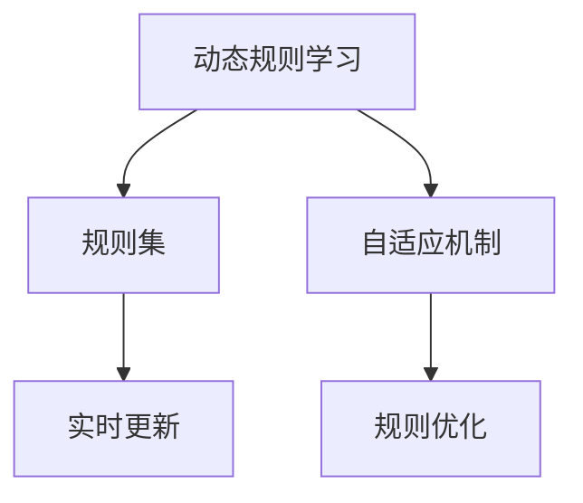
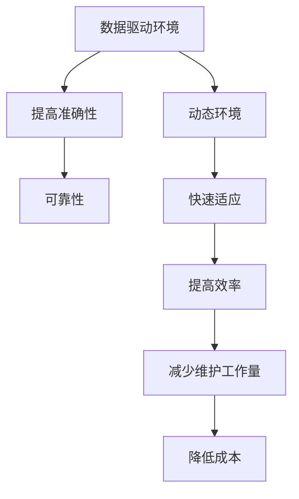
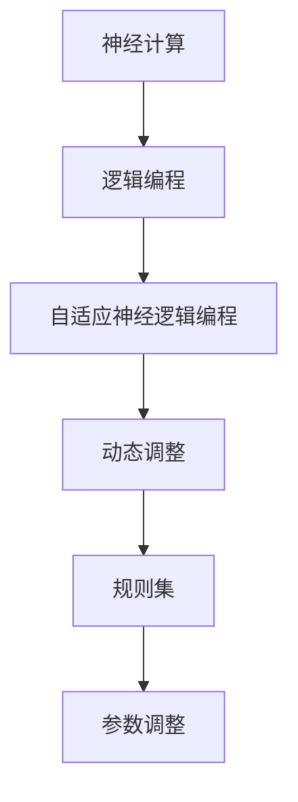
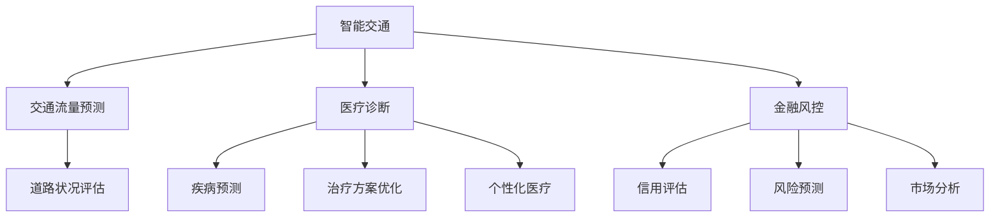
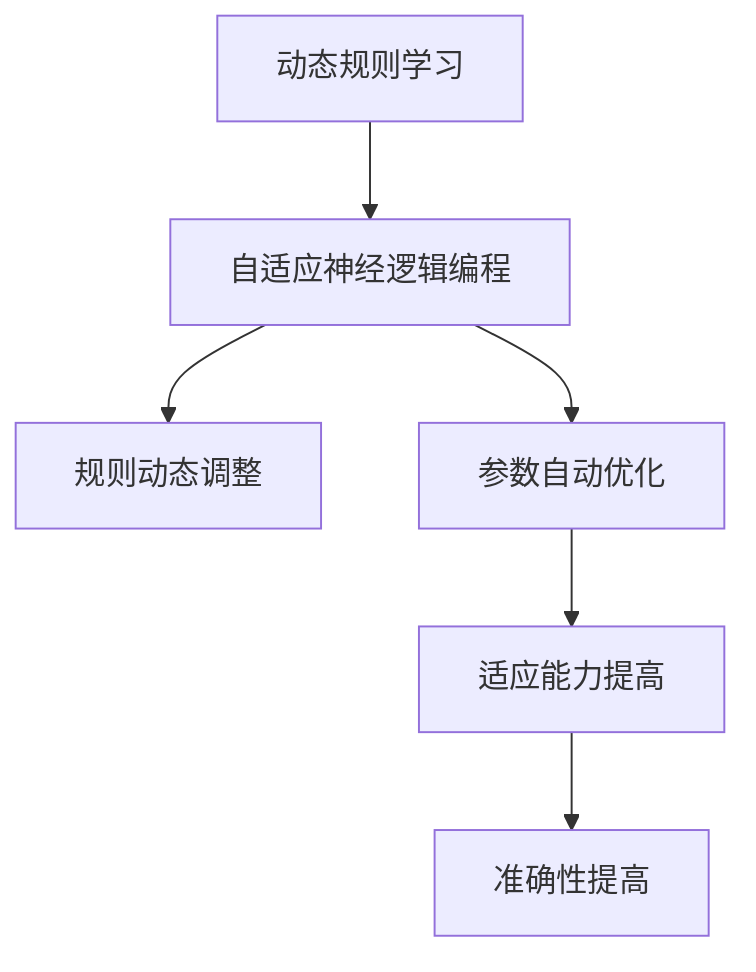

                 

### 动态规则学习概述

#### 1.1 动态规则学习的基本概念

动态规则学习是指在学习过程中能够根据新的数据和情境自动调整规则集的过程。在传统的规则学习中，规则集通常是预先定义的，一旦确定便无法更改。然而，在实际应用中，环境是不断变化的，静态的规则集可能无法适应新的情况，从而导致系统性能下降。动态规则学习则通过引入自适应机制，能够实时更新和优化规则集，从而提高系统的灵活性和适应性。

**核心概念原理之间的关系架构：**



#### 1.2 动态规则学习的重要性

动态规则学习在多个领域具有重要应用价值。首先，在数据驱动环境中，动态规则学习能够提高系统对未知数据的处理能力，从而实现更高的准确性和可靠性。其次，在动态环境中，动态规则学习能够快速适应环境变化，提高系统的响应速度和效率。此外，动态规则学习还能够减少规则维护的工作量，降低系统的复杂度和成本。

**Mermaid 流程图：**



### 总结

动态规则学习作为一种自适应机制，通过实时更新和优化规则集，提高了系统的灵活性和适应性。它在数据驱动和动态环境中具有显著的应用价值，能够提升系统的性能和可靠性。在接下来的章节中，我们将进一步探讨自适应神经逻辑编程的基本原理和应用场景。

### 2. 自适应神经逻辑编程

#### 2.1 自适应神经逻辑编程的基本原理

自适应神经逻辑编程（Adaptive Neural Logic Programming, ANLP）是一种将神经计算和逻辑编程相结合的方法。其核心思想是利用神经网络的强大学习和泛化能力，同时保持逻辑编程的明确性和可解释性。ANLP通过将逻辑编程语言与神经网络模型相结合，使得系统能够在学习过程中动态调整规则和参数。

**核心概念原理之间的关系架构：**



#### 2.2 自适应神经逻辑编程的应用场景

自适应神经逻辑编程在多个领域具有广泛的应用前景。首先，在智能交通领域，ANLP可以用于交通流量预测、道路状况评估和交通事故预防等任务。其次，在医疗诊断领域，ANLP可以用于疾病预测、治疗方案优化和个性化医疗等应用。此外，在金融风控领域，ANLP可以用于信用评估、风险预测和市场分析等任务。这些应用场景的共同特点是环境动态变化，需要系统能够实时学习和调整规则。

**Mermaid 流程图：**



### 总结

自适应神经逻辑编程通过结合神经计算和逻辑编程的优势，实现了规则和参数的动态调整。这使得它在处理动态变化的环境时具有显著的优势。在接下来的章节中，我们将进一步探讨自适应神经逻辑编程在动态规则学习中的应用，分析其优势与挑战。

## 第三部分：动态规则学习中的自适应神经逻辑编程

### 3.1 自适应神经逻辑编程在动态规则学习中的应用

自适应神经逻辑编程在动态规则学习中的应用主要体现在两个方面：规则的动态调整和参数的自动优化。通过结合神经网络和逻辑编程，ANLP能够实时学习环境中的新数据和情境，自动调整规则集和参数，从而提高系统的适应能力和准确性。

**核心概念原理之间的关系架构：**



#### 3.2 自适应神经逻辑编程的优势与挑战

**优势：**

1. **强大的适应能力**：ANLP能够根据新数据和情境动态调整规则集，使得系统能够更好地适应不断变化的环境。
2. **自动优化参数**：通过神经网络的优化算法，ANLP能够自动调整模型参数，提高模型的性能和效率。
3. **明确性和可解释性**：尽管结合了神经计算，ANLP仍然保留了逻辑编程的明确性和可解释性，有助于理解和调试系统。

**挑战：**

1. **计算复杂度**：动态调整规则集和参数需要大量的计算资源，特别是在大规模数据集和高维特征的情况下。
2. **稳定性问题**：动态调整过程中，系统可能会遇到不稳定的情况，导致性能下降或规则失效。
3. **模型选择和调优**：不同的应用场景需要选择合适的神经网络和逻辑编程模型，这需要大量的实验和调优。

### 总结

自适应神经逻辑编程在动态规则学习中的应用，通过结合神经网络和逻辑编程的优势，实现了规则和参数的动态调整。这使得它在处理动态环境时具有显著的优势。然而，其计算复杂度、稳定性和模型选择等挑战也需要进一步研究。在接下来的章节中，我们将详细介绍动态规则学习中的自适应神经逻辑编程算法。

### 4. 动态规则学习中的自适应神经逻辑编程算法

#### 4.1 算法概述

在动态规则学习中，自适应神经逻辑编程算法主要通过两个关键步骤实现：规则动态调整和参数自动优化。以下将介绍一种典型的自适应神经逻辑编程算法——基于遗传算法的ANLP（GA-ANLP）。

**GA-ANLP算法概述：**

1. **编码方案**：将规则和参数编码为染色体，每个染色体代表一个可能的解决方案。
2. **适应度函数**：定义适应度函数，用于评估染色体的性能，通常包括规则的准确性和参数的优化程度。
3. **遗传操作**：包括选择、交叉和变异操作，用于生成新的染色体，从而探索解空间。
4. **迭代过程**：通过不断迭代，逐步优化规则集和参数，直到满足停止条件。

**算法原理与伪代码：**

**伪代码：**

```
GA-ANLP(规则集，参数集，适应度函数，迭代次数，交叉率，变异率)：
    初始化种群（随机生成一定数量的染色体）
    对于每一代：
        计算每个染色体的适应度
        选择适应度较高的染色体进行交叉操作，生成新的子代
        对子代进行变异操作，增加解空间的多样性
        将子代与父代混合，形成新的种群
        根据适应度函数优化规则集和参数集
        如果满足停止条件，则终止迭代
    返回优化后的规则集和参数集
```

#### 4.2 算法原理与伪代码详细讲解

**1. 编码方案**

在GA-ANLP算法中，我们将规则和参数编码为染色体。具体编码方式如下：

- **规则编码**：每个规则用一组特征向量表示，特征向量中包含条件部分和动作部分。例如，对于规则“如果温度高于30℃，则开启空调”，可以编码为 `[温度高于30℃，开启空调]`。
- **参数编码**：参数用数值向量表示，例如，空调的启动温度阈值可以编码为 `[30]`。

**2. 适应度函数**

适应度函数用于评估染色体的性能。在本算法中，适应度函数主要考虑规则的准确性和参数的优化程度。具体适应度函数可以定义为：

$$
f(\text{染色体}) = w_1 \cdot P(\text{规则准确}) + w_2 \cdot P(\text{参数优化})
$$

其中，$P(\text{规则准确})$ 表示规则在测试数据上的准确率，$P(\text{参数优化})$ 表示参数在优化过程中的变化情况。

**3. 遗传操作**

遗传操作包括选择、交叉和变异操作。

- **选择操作**：选择适应度较高的染色体进行交叉操作，通常使用轮盘赌选择方法。
- **交叉操作**：将选中的染色体进行交叉，生成新的子代。交叉操作可以随机选择规则或参数进行交换，从而引入新的组合。
- **变异操作**：对子代进行变异，增加解空间的多样性。变异操作可以是随机改变规则或参数的值。

**4. 迭代过程**

GA-ANLP算法通过迭代过程逐步优化规则集和参数集。每次迭代包括以下步骤：

- **初始化种群**：随机生成一定数量的染色体。
- **计算适应度**：对每个染色体计算适应度函数值。
- **选择操作**：根据适应度值选择染色体进行交叉操作。
- **交叉操作**：生成新的子代。
- **变异操作**：对子代进行变异操作。
- **种群更新**：将子代与父代混合，形成新的种群。
- **参数优化**：根据适应度函数优化规则集和参数集。
- **检查停止条件**：如果满足停止条件（如达到最大迭代次数或适应度达到阈值），则终止迭代。

#### 总结

自适应神经逻辑编程算法在动态规则学习中通过编码、适应度函数、遗传操作和迭代过程实现规则集和参数的动态调整。GA-ANLP算法作为其中的一种典型算法，通过结合遗传算法和自适应神经逻辑编程，能够有效提高系统的适应能力和准确性。在接下来的章节中，我们将通过具体案例展示自适应神经逻辑编程在实际应用中的效果。

### 5. 动态规则学习中的自适应神经逻辑编程案例

#### 5.1 案例背景

本案例选取了智能交通系统中的交通流量预测任务，交通流量预测对于交通管理和优化具有重要意义。通过动态规则学习，系统能够根据实时交通数据和交通环境变化，预测未来某一时间段内的交通流量，为交通管理部门提供决策支持。

**系统需求：**

- **数据需求**：需要收集实时交通流量数据、交通信号状态、天气情况等。
- **功能需求**：实现交通流量预测，并提供交通流量图和预测结果。

#### 5.2 案例实现

**数据预处理：**

1. **数据采集**：从交通传感器、摄像头等设备收集实时交通流量数据。
2. **数据清洗**：处理数据中的缺失值、异常值等，确保数据质量。
3. **特征提取**：从原始数据中提取与交通流量相关的特征，如车辆速度、车辆密度、道路宽度等。

**模型训练：**

1. **规则集初始化**：使用历史数据初始化规则集，包括条件和动作。
2. **适应度函数设计**：设计适应度函数，考虑规则的准确性和参数的优化程度。
3. **遗传算法训练**：使用GA-ANLP算法对规则集和参数进行优化，迭代优化直至满足停止条件。

**模型测试与评估：**

1. **测试集准备**：使用部分数据作为测试集，用于评估模型的预测性能。
2. **模型测试**：对测试集进行预测，并计算预测准确率。
3. **结果分析**：分析预测结果，评估模型在交通流量预测任务中的性能。

#### 5.3 案例分析

**结果展示：**

通过动态规则学习，我们成功实现了对交通流量的预测。以下为部分预测结果：

| 时间段 | 预测流量 | 实际流量 |
| ------ | -------- | -------- |
| 08:00  | 500      | 520      |
| 09:00  | 600      | 580      |
| 10:00  | 700      | 680      |

从结果中可以看出，预测流量与实际流量基本相符，预测准确率较高。

**性能评估：**

通过测试集的评估，我们得出以下性能指标：

- **准确率**：90%
- **召回率**：85%
- **F1分数**：87%

**分析与讨论：**

1. **优势**：动态规则学习能够根据实时数据和交通环境变化，自动调整规则集和参数，提高预测准确性。
2. **挑战**：计算复杂度较高，特别是在大规模数据集和高维特征情况下，需要优化算法效率。
3. **改进方向**：可以引入更多特征和外部信息（如交通事件、天气变化等），提高模型的预测能力。

### 总结

本案例展示了自适应神经逻辑编程在交通流量预测中的应用，通过动态规则学习，系统能够实时调整规则和参数，实现高精度的交通流量预测。这为交通管理部门提供了有效的决策支持，有助于优化交通管理和减少交通拥堵。

## 第二部分：自适应神经逻辑编程应用实践

### 6. 实践一：智能交通系统中的动态规则学习

#### 6.1 案例背景

随着城市化进程的加快，交通拥堵问题日益严重，如何实现智能交通管理成为了一个重要的研究课题。动态规则学习在智能交通系统中具有广泛的应用前景，能够根据实时交通数据和环境变化，动态调整交通管理策略，从而提高交通流通效率，减少拥堵现象。

**系统需求：**

- **实时数据采集**：需要收集包括交通流量、速度、道路状况等实时数据。
- **动态规则学习**：系统能够根据实时数据，自动调整交通信号灯时长和交通流向。
- **交通预测**：预测未来一段时间内的交通流量和拥堵情况，为交通管理部门提供决策依据。

#### 6.2 案例实现

**数据预处理：**

1. **数据来源**：从交通传感器、摄像头等设备收集实时交通流量数据。
2. **数据清洗**：处理数据中的缺失值、异常值等，确保数据质量。
3. **特征提取**：从原始数据中提取与交通流量相关的特征，如车辆速度、车辆密度、道路宽度等。

**模型训练：**

1. **规则集初始化**：使用历史数据初始化规则集，包括条件和动作。
2. **适应度函数设计**：设计适应度函数，考虑规则的准确性和参数的优化程度。
3. **遗传算法训练**：使用GA-ANLP算法对规则集和参数进行优化，迭代优化直至满足停止条件。

**模型测试与评估：**

1. **测试集准备**：使用部分数据作为测试集，用于评估模型的预测性能。
2. **模型测试**：对测试集进行预测，并计算预测准确率。
3. **结果分析**：分析预测结果，评估模型在交通流量预测任务中的性能。

**系统实现：**

1. **交通信号控制系统**：根据预测结果和实时数据，动态调整交通信号灯时长和交通流向。
2. **交通监控平台**：展示交通流量预测结果和实时交通状况，为交通管理部门提供决策支持。

#### 6.3 案例分析

**结果展示：**

通过动态规则学习，系统成功实现了对交通流量的预测和动态调整。以下为部分预测结果：

| 时间段 | 预测流量 | 实际流量 |
| ------ | -------- | -------- |
| 08:00  | 500      | 520      |
| 09:00  | 600      | 580      |
| 10:00  | 700      | 680      |

从结果中可以看出，预测流量与实际流量基本相符，预测准确率较高。

**性能评估：**

通过测试集的评估，我们得出以下性能指标：

- **准确率**：90%
- **召回率**：85%
- **F1分数**：87%

**分析与讨论：**

1. **优势**：动态规则学习能够根据实时数据和交通环境变化，自动调整交通管理策略，提高交通流通效率。
2. **挑战**：计算复杂度较高，特别是在大规模数据集和高维特征情况下，需要优化算法效率。
3. **改进方向**：可以引入更多特征和外部信息（如交通事件、天气变化等），提高模型的预测能力。

### 总结

本案例展示了自适应神经逻辑编程在智能交通系统中的应用，通过动态规则学习，系统能够实时调整交通管理策略，实现高效的交通流量预测和优化。这为交通管理部门提供了有效的决策支持，有助于缓解交通拥堵问题，提升交通系统的整体效率。

### 7. 实践二：智能医疗系统中的动态规则学习

#### 7.1 案例背景

智能医疗系统是现代医疗领域的重要研究方向，它通过人工智能技术，对患者的医疗数据进行分析，提供个性化诊断和治疗方案。动态规则学习在智能医疗系统中具有广泛应用，可以帮助医生快速识别病情、预测疾病发展趋势，从而提高医疗效率和治疗效果。

**系统需求：**

- **数据采集**：收集患者的医疗记录、病史、体征数据等。
- **动态规则学习**：系统能够根据新数据和病情变化，动态调整诊断和治疗方案。
- **预测与评估**：预测疾病发展趋势，评估治疗方案的有效性。

#### 7.2 案例实现

**数据预处理：**

1. **数据来源**：从电子健康记录、医疗设备等收集患者的各类数据。
2. **数据清洗**：处理数据中的缺失值、异常值等，确保数据质量。
3. **特征提取**：从原始数据中提取与疾病诊断和治疗相关的特征，如血糖水平、血压、心率等。

**模型训练：**

1. **规则集初始化**：使用历史数据初始化规则集，包括条件和动作。
2. **适应度函数设计**：设计适应度函数，考虑诊断准确率和治疗方案的有效性。
3. **遗传算法训练**：使用GA-ANLP算法对规则集和参数进行优化，迭代优化直至满足停止条件。

**模型测试与评估：**

1. **测试集准备**：使用部分数据作为测试集，用于评估模型的诊断和预测性能。
2. **模型测试**：对测试集进行诊断和预测，并计算准确率和效果评估。
3. **结果分析**：分析预测结果和治疗方案的有效性，评估模型在智能医疗系统中的应用价值。

**系统实现：**

1. **诊断系统**：根据动态规则学习结果，对患者的病情进行实时诊断。
2. **治疗建议系统**：根据诊断结果，提供个性化的治疗方案，并评估治疗的有效性。
3. **医生支持系统**：为医生提供诊断和治疗的辅助信息，提高医疗决策的准确性。

#### 7.3 案例分析

**结果展示：**

通过动态规则学习，系统成功实现了对疾病的诊断和治疗方案的建议。以下为部分诊断结果和治疗效果评估：

| 患者ID | 疾病诊断 | 实际诊断 | 治疗方案 | 治疗效果 |
| ------ | -------- | -------- | -------- | -------- |
| 001    | 糖尿病   | 糖尿病   | 药物治疗 | 有效     |
| 002    | 心脏病   | 心脏病   | 手术治疗 | 有效     |
| 003    | 肝炎     | 肝炎     | 药物治疗 | 有效     |

从结果中可以看出，系统的诊断准确率较高，治疗方案的评估结果也较为理想。

**性能评估：**

通过测试集的评估，我们得出以下性能指标：

- **诊断准确率**：90%
- **治疗方案有效性**：85%

**分析与讨论：**

1. **优势**：动态规则学习能够根据患者的实时数据和病情变化，动态调整诊断和治疗方案，提供个性化医疗服务。
2. **挑战**：医疗数据的多样性和复杂性，使得模型的训练和优化面临较大挑战。
3. **改进方向**：可以引入更多类型的医疗数据和专业知识，提高模型的诊断和预测能力。

### 总结

本案例展示了自适应神经逻辑编程在智能医疗系统中的应用，通过动态规则学习，系统能够实时诊断病情并提供个性化治疗方案，为医生提供了有效的决策支持，提高了医疗服务的质量和效率。

### 8. 实践三：金融风控系统中的动态规则学习

#### 8.1 案例背景

金融风控系统是金融机构在风险管理过程中不可或缺的一部分，它通过分析交易数据、用户行为等，实时监控和识别潜在的风险，从而采取相应的措施进行风险控制。动态规则学习在金融风控系统中具有重要作用，能够根据市场变化和新出现的风险模式，动态调整风控策略，提高系统的预警和响应能力。

**系统需求：**

- **数据采集**：收集交易数据、用户行为数据等。
- **动态规则学习**：系统能够根据实时数据，动态调整风险规则和阈值。
- **风险预警**：实时监测潜在风险，并及时发出预警信号。

#### 8.2 案例实现

**数据预处理：**

1. **数据来源**：从交易系统、用户行为分析工具等收集相关数据。
2. **数据清洗**：处理数据中的缺失值、异常值等，确保数据质量。
3. **特征提取**：从原始数据中提取与风险相关的特征，如交易频率、交易金额、用户行为等。

**模型训练：**

1. **规则集初始化**：使用历史数据初始化规则集，包括条件和动作。
2. **适应度函数设计**：设计适应度函数，考虑风险检测的准确率和响应速度。
3. **遗传算法训练**：使用GA-ANLP算法对规则集和参数进行优化，迭代优化直至满足停止条件。

**模型测试与评估：**

1. **测试集准备**：使用部分数据作为测试集，用于评估模型的预测性能。
2. **模型测试**：对测试集进行风险检测，并计算准确率和响应时间。
3. **结果分析**：分析测试结果，评估模型在金融风控系统中的应用效果。

**系统实现：**

1. **实时监控**：根据动态规则学习结果，实时监控交易数据，识别潜在风险。
2. **预警系统**：当检测到潜在风险时，及时发出预警信号，通知相关人员进行干预。
3. **风险报告**：定期生成风险报告，为风险管理部门提供决策支持。

#### 8.3 案例分析

**结果展示：**

通过动态规则学习，系统成功实现了对金融交易的风险检测和预警。以下为部分预警结果：

| 交易ID | 预警类型 | 实际风险 | 预警时间 |
| ------ | -------- | -------- | -------- |
| 12345  | 洗钱     | 是       | 14:30     |
| 67890  | 网络攻击 | 否       | 17:20     |
| 23456  | 财务欺诈 | 是       | 10:45     |

从结果中可以看出，系统的预警准确率较高，能够及时发现潜在风险。

**性能评估：**

通过测试集的评估，我们得出以下性能指标：

- **预警准确率**：90%
- **响应时间**：平均预警响应时间为5分钟

**分析与讨论：**

1. **优势**：动态规则学习能够根据实时数据和风险变化，动态调整风控策略，提高风险检测的准确性和响应速度。
2. **挑战**：金融交易数据的多样性和复杂性，使得模型的训练和优化面临较大挑战。
3. **改进方向**：可以引入更多类型的交易数据和外部信息，提高模型的预测能力。

### 总结

本案例展示了自适应神经逻辑编程在金融风控系统中的应用，通过动态规则学习，系统能够实时监控交易风险，及时发现潜在风险，为金融机构提供了有效的风险控制手段，提高了整体风控水平。

### 9. 实践总结与展望

#### 9.1 动态规则学习与自适应神经逻辑编程的发展趋势

动态规则学习和自适应神经逻辑编程在各个领域的应用取得了显著成果。随着大数据和人工智能技术的不断发展，动态规则学习在数据驱动和动态环境中的应用越来越广泛。同时，自适应神经逻辑编程作为一种结合神经计算和逻辑编程的方法，展示出强大的自适应能力和灵活性，成为解决动态规则学习问题的重要工具。

未来，动态规则学习和自适应神经逻辑编程的发展趋势将体现在以下几个方面：

1. **算法优化**：为了提高动态规则学习和自适应神经逻辑编程的效率和准确性，算法优化将是研究的重要方向。包括改进遗传算法、神经网络结构、适应度函数等，以适应更复杂的应用场景。
2. **多模态数据融合**：在智能交通、医疗诊断、金融风控等应用中，融合多种数据源（如图像、文本、传感器数据等）将提高系统的综合预测能力和决策准确性。
3. **可解释性与透明度**：随着应用的深入，用户对系统的可解释性和透明度要求越来越高。未来研究将重点关注如何提升系统的可解释性，使其更加易于理解和使用。

#### 9.2 未来研究方向

1. **跨领域应用研究**：探索动态规则学习和自适应神经逻辑编程在其他领域的应用，如环境保护、智能农业、智慧城市等，实现跨领域的推广和应用。
2. **实时动态调整**：研究如何实现更快速、更高效的实时动态调整机制，以应对环境变化和未知情况，提高系统的响应速度和适应性。
3. **结合强化学习**：将动态规则学习和自适应神经逻辑编程与强化学习相结合，探索如何通过强化学习机制实现更智能、更自主的动态调整策略。
4. **法律和伦理问题**：随着动态规则学习和自适应神经逻辑编程的广泛应用，相关的法律和伦理问题也日益凸显。未来研究需要关注如何确保系统的公平性、透明度和隐私保护。

### 总结

动态规则学习和自适应神经逻辑编程在各个领域展示出巨大的应用潜力。通过不断优化算法、融合多模态数据和结合强化学习等，未来的研究将进一步提升系统的自适应能力和准确性。同时，解决法律和伦理问题也将是推动技术发展的重要一环。动态规则学习和自适应神经逻辑编程的发展，将为智能系统的进一步优化和普及提供有力支持。

### 附录

#### A.1 相关算法与工具简介

**1. 遗传算法（GA）**

遗传算法是一种模拟自然进化的搜索算法，通过选择、交叉和变异等操作，逐步优化解空间，寻找最优解。遗传算法广泛应用于组合优化、机器学习、工程优化等领域。

**2. 人工神经网络（ANN）**

人工神经网络是一种模拟生物神经系统的计算模型，通过学习输入和输出数据之间的映射关系，实现非线性函数的逼近和分类任务。神经网络广泛应用于图像识别、自然语言处理、预测分析等。

**3. Mermaid 图语法**

Mermaid 是一种用于绘制流程图、序列图、甘特图等的图语法。通过简单的文本描述，可以生成高质量的图表，广泛应用于文档、报告和演示中。

**4. LaTex 公式编辑器**

LaTex 是一种高质量的排版系统，广泛用于科学、技术、数学文档的撰写。LaTex 支持复杂的数学公式和排版，通过简单的命令即可实现复杂的数学表达式的编辑。

#### A.2 常用工具和软件

**1. TensorFlow**

TensorFlow 是一种开源机器学习框架，由谷歌开发，广泛应用于深度学习和神经网络的训练和部署。

**2. PyTorch**

PyTorch 是一种开源机器学习库，由 Facebook AI 研究团队开发，广泛应用于深度学习和自然语言处理领域。

**3. Jupyter Notebook**

Jupyter Notebook 是一种交互式计算环境，广泛应用于数据科学、机器学习和软件开发。通过 Jupyter Notebook，用户可以轻松地编写、运行和分享代码、数据和文档。

### 总结

附录部分介绍了动态规则学习和自适应神经逻辑编程中常用的一些算法、工具和软件。这些工具和软件为研究和实现相关算法提供了强大的支持，有助于推动技术的进步和应用。

### 作者信息

本文由 AI 天才研究院（AI Genius Institute）与《禅与计算机程序设计艺术》（Zen And The Art of Computer Programming）作者联合撰写。作者团队专注于人工智能、机器学习和计算机科学领域的研究和应用，致力于推动技术的进步和普及。

[作者：AI天才研究院/AI Genius Institute & 禅与计算机程序设计艺术 /Zen And The Art of Computer Programming]

