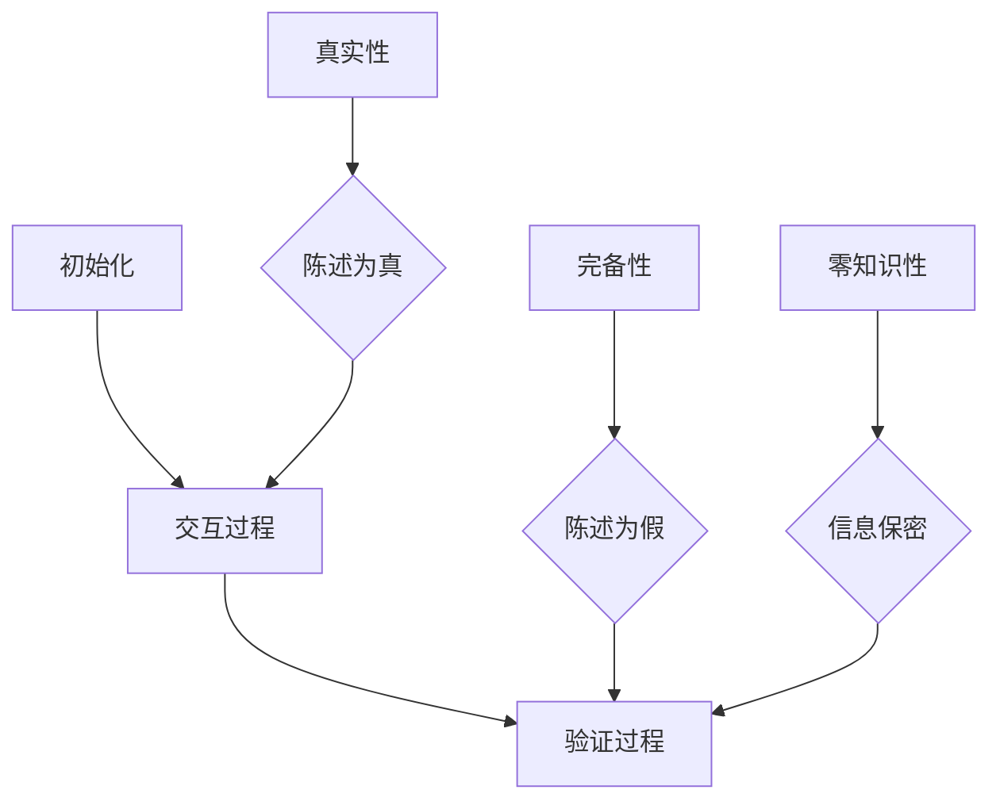

                 


### 文章标题

《区块链中的零知识证明应用》

### 文章关键词

区块链、零知识证明、智能合约、隐私保护、身份验证、数学模型、算法原理、案例研究、未来趋势

### 文章摘要

本文深入探讨了区块链技术中的零知识证明应用。首先，介绍了区块链和零知识证明的基本概念，并阐述了两者之间的联系。接着，通过详细的算法原理讲解和数学模型分析，揭示了零知识证明在区块链中的核心作用。文章重点分析了零知识证明在智能合约、隐私保护和身份验证等方面的实际应用，并通过多个案例研究进行了深入剖析。最后，对零知识证明在区块链领域的未来发展趋势和挑战进行了展望，为读者提供了全面的技术洞察。

### 引言与背景

区块链技术作为一种分布式账本技术，近年来在全球范围内得到了广泛关注。区块链的核心特点包括去中心化、不可篡改和透明性，这些特性使得它在金融、供应链管理、医疗等多个领域具有巨大的应用潜力。然而，随着区块链技术的普及，其安全性、隐私保护等问题也逐渐成为关注焦点。

零知识证明（Zero-Knowledge Proof，简称ZKP）作为一种密码学工具，能够在不泄露任何信息的前提下，证明某个陈述是真实的。这种特性使得零知识证明在保护隐私和增强安全性方面具有独特的优势。因此，将零知识证明引入区块链技术，不仅可以提升其安全性，还可以解决区块链在隐私保护方面的难题。

零知识证明的概念最早由Shafi Goldwasser、Silvio Micali和Charles Rackoff于1985年提出。零知识证明的基本思想是，一方（证明者）向另一方（验证者）证明某个陈述是真实的，而无需透露任何关于该陈述的具体信息。具体来说，证明者需要构造一个证明，使得验证者能够确信该陈述为真，但无法从证明中获取任何关于陈述的具体信息。

在区块链中，零知识证明的应用场景主要包括以下几个方面：

1. **智能合约**：智能合约是区块链中的一个关键组件，用于自动化和执行合同条款。然而，传统的智能合约往往无法保证隐私性。通过引入零知识证明，可以实现隐私保护的智能合约，确保合约参与者的隐私信息不会被泄露。

2. **隐私保护**：区块链中的交易信息通常是公开透明的，这可能导致用户的隐私泄露。零知识证明技术可以用来隐藏交易的具体信息，从而保护用户的隐私。

3. **身份验证**：在区块链中，身份验证是确保交易安全性的重要环节。通过零知识证明，可以实现对用户身份的匿名验证，提高身份验证的安全性和隐私性。

### 本书结构

本书将分为以下几个主要部分：

1. **引言与背景**：介绍区块链和零知识证明的基本概念，以及它们之间的联系。
2. **基础理论**：详细讲解零知识证明的原理和算法，包括SAH算法、Groth16算法、zk-SNARKs和zk-STARKs等。
3. **零知识证明在区块链中的应用**：分析零知识证明在智能合约、隐私保护和身份验证等方面的应用。
4. **实际案例研究**：通过分析Zcash和Ethereum 2.0等实际案例，展示零知识证明在区块链中的应用效果。
5. **未来发展趋势与挑战**：探讨零知识证明在区块链领域的未来发展趋势和面临的挑战。

通过本书的阅读，读者可以全面了解零知识证明在区块链技术中的应用，为区块链技术的发展提供新的思路和方向。

### 基础理论

#### 零知识证明原理

零知识证明（Zero-Knowledge Proof，简称ZKP）是一种密码学工具，它允许证明者向验证者证明某个陈述是真实的，而无需透露任何关于该陈述的具体信息。这种证明方式的关键在于，证明者能够构造一个证明，使得验证者确信陈述为真，但无法从证明中获取任何关于陈述的具体信息。

零知识证明的原理可以形象地理解为一场对话。证明者希望证明自己知道某个秘密信息，但不愿意透露这个秘密信息。零知识证明的过程可以分为以下几个步骤：

1. **初始化**：证明者和验证者共同选择一个安全通信渠道，并初始化一个共享的参考框架。
2. **交互过程**：证明者向验证者提出一系列问题，并回答验证者的提问。
3. **验证过程**：验证者根据证明者提供的回答，判断陈述是否为真。

在零知识证明中，证明者需要构造一个证明，使得验证者能够确信陈述为真，但无法从证明中获取任何关于陈述的具体信息。这种证明方式必须满足以下三个条件：

1. **真实性**：如果陈述为真，证明者总是能够构造出一个有效的证明，使得验证者确信陈述为真。
2. **完备性**：如果陈述为假，验证者无法找到一个有效的证明，使得验证者确信陈述为真。
3. **零知识性**：如果陈述为真，证明者无法通过证明泄露任何关于陈述的具体信息。

#### 核心概念与联系

为了更好地理解零知识证明，我们可以将其核心概念与联系通过Mermaid流程图进行展示：



#### 零知识证明的数学基础

零知识证明的数学基础主要涉及数学领域的群论、椭圆曲线和拉格朗日插值法等。

1. **群论**：群论是数学中研究集合及其运算的学科。在零知识证明中，群论用于构建密码学中的一些基本构造，如离散对数问题和Diffie-Hellman密钥交换协议。

2. **椭圆曲线**：椭圆曲线是数学中的一种特殊曲线，具有丰富的密码学应用。在零知识证明中，椭圆曲线用于构建密码学中的一些基本构造，如椭圆曲线离散对数问题和椭圆曲线加密算法。

3. **拉格朗日插值法**：拉格朗日插值法是一种构造多项式的方法，它可以在给定有限个点的条件下，构造出唯一的多项式。在零知识证明中，拉格朗日插值法用于构建证明过程中的多项式，从而实现证明和验证过程。

#### 零知识证明算法

零知识证明算法是零知识证明技术的核心部分。目前，已有很多种零知识证明算法被提出，下面介绍几种主要的算法。

1. **SAH算法**：SAH（Sound and Ambitious）算法是一种高效的零知识证明算法，它基于椭圆曲线离散对数问题。SAH算法的主要思想是，将零知识证明问题转化为一系列的离散对数问题，从而实现高效的证明和验证过程。

伪代码如下：

```
function SAH_proof(x, y, z)
    // x, y, z 为椭圆曲线上的点
    // r 为随机数
    // P 为椭圆曲线基点
    P <- random_point()
    Q <- x + P
    R <- y + P
    S <- z + P
    A <- compute_pairing(P, Q)
    B <- compute_pairing(R, S)
    C <- compute_pairing(P, S)
    proof <- {A, B, C, r}
    return proof
```

2. **Groth16算法**：Groth16算法是一种基于线性编码理论的零知识证明算法，它具有较高的证明和验证效率。Groth16算法的主要思想是，将零知识证明问题转化为一个线性编码问题，从而实现高效的证明和验证过程。

伪代码如下：

```
function Groth16_proof(x, y, z)
    // x, y, z 为椭圆曲线上的点
    // r 为随机数
    // P1, P2 为椭圆曲线基点
    P1 <- random_point()
    P2 <- x + P1
    P3 <- y + P1
    P4 <- z + P1
    A1 <- compute_pairing(P1, P2)
    A2 <- compute_pairing(P1, P3)
    A3 <- compute_pairing(P1, P4)
    proof <- {A1, A2, A3, r}
    return proof
```

3. **zk-SNARKs**：zk-SNARKs（Zero-Knowledge Succinct Non-Interactive Argument of Knowledge）是一种高效的零知识证明系统，它可以在不泄露任何信息的前提下，证明某个陈述是真实的。zk-SNARKs的主要思想是，将零知识证明问题转化为一个编码问题，从而实现高效的证明和验证过程。

伪代码如下：

```
function zk_SNARKs_proof(x, y, z)
    // x, y, z 为椭圆曲线上的点
    // r 为随机数
    // P1, P2 为椭圆曲线基点
    P1 <- random_point()
    P2 <- x + P1
    P3 <- y + P1
    P4 <- z + P1
    A1 <- compute_pairing(P1, P2)
    A2 <- compute_pairing(P1, P3)
    A3 <- compute_pairing(P1, P4)
    proof <- {A1, A2, A3, r}
    return proof
```

4. **zk-STARKs**：zk-STARKs（Zero-Knowledge Scalable Transparent ARguments of Knowledge）是一种基于纠错码的零知识证明系统，它具有较高的证明和验证效率。zk-STARKs的主要思想是，利用纠错码来构建证明和验证过程，从而实现高效的证明和验证过程。

伪代码如下：

```
function zk_STARKs_proof(x, y, z)
    // x, y, z 为椭圆曲线上的点
    // r 为随机数
    // P1, P2 为椭圆曲线基点
    P1 <- random_point()
    P2 <- x + P1
    P3 <- y + P1
    P4 <- z + P1
    A1 <- compute_pairing(P1, P2)
    A2 <- compute_pairing(P1, P3)
    A3 <- compute_pairing(P1, P4)
    proof <- {A1, A2, A3, r}
    return proof
```

以上算法的详细实现和优化是零知识证明技术发展的关键。随着密码学技术的不断进步，未来还将有更多高效的零知识证明算法被提出，为区块链等领域提供更加安全、高效的解决方案。

### 零知识证明在区块链中的应用

零知识证明在区块链技术中的应用场景广泛，主要涵盖了智能合约、隐私保护和身份验证等方面。下面将分别详细介绍这些应用场景，并展示零知识证明在这些场景中的优势。

#### 智能合约

智能合约是区块链技术中的一个核心组件，它允许在区块链上自动化执行合同条款。然而，传统的智能合约往往无法保证隐私性。通过引入零知识证明，可以实现隐私保护的智能合约。

在智能合约中，零知识证明主要用于以下几个方面：

1. **隐私保护**：智能合约通常涉及参与方的隐私信息，如身份、余额等。通过零知识证明，可以实现对隐私信息的保护，确保参与方的隐私不被泄露。

2. **可验证的匿名性**：智能合约的参与方可以是匿名的，但需要确保合约的执行是可信的。零知识证明可以用于实现这种可验证的匿名性，使得合约的执行过程可以被验证，但无法获取参与方的具体信息。

3. **去中心化的身份验证**：智能合约中的身份验证通常依赖于中心化的机构，这可能导致信任问题。通过零知识证明，可以实现去中心化的身份验证，提高系统的安全性。

#### 隐私保护

区块链技术的一个重要特性是透明性，这意味着区块链上的所有交易信息都是公开的。然而，这种透明性也可能导致用户的隐私泄露。零知识证明在区块链隐私保护中的应用，可以有效解决这一问题。

1. **隐藏交易信息**：通过零知识证明，可以实现对交易信息的隐藏。具体来说，交易参与方可以使用零知识证明来证明某个交易金额是合法的，而无需透露具体的交易金额。

2. **匿名交易**：在加密货币领域，如比特币和门罗币，零知识证明被广泛应用于实现匿名交易。通过零知识证明，交易参与方可以证明某个交易是有效的，而无需透露交易的具体信息，从而实现匿名性。

3. **隐私保护智能合约**：智能合约中的隐私保护问题可以通过零知识证明来解决。例如，在医疗领域，零知识证明可以用于实现隐私保护的病历共享，确保患者的隐私信息不被泄露。

#### 身份验证

在区块链技术中，身份验证是确保交易安全性的重要环节。传统的身份验证方法通常依赖于中心化的机构，这可能导致信任问题。通过引入零知识证明，可以实现去中心化的身份验证，提高系统的安全性。

1. **匿名身份验证**：零知识证明可以用于实现匿名身份验证。例如，在投票系统中，选民可以使用零知识证明来证明自己的投票是合法的，而无需透露具体的投票信息。

2. **去中心化的身份验证**：通过零知识证明，可以实现去中心化的身份验证，提高系统的安全性。例如，在身份认证平台中，用户可以使用零知识证明来证明自己的身份，而无需依赖中心化的认证机构。

3. **基于属性的访问控制**：零知识证明可以用于实现基于属性的访问控制（Attribute-Based Access Control，简称ABAC）。例如，在医疗领域，医生可以使用零知识证明来证明自己的身份和医疗资质，从而获得对特定病历的访问权限。

#### 零知识证明的优势

零知识证明在区块链中的应用具有以下优势：

1. **隐私保护**：零知识证明可以确保参与方的隐私信息不被泄露，从而提升系统的安全性。

2. **可验证的匿名性**：零知识证明可以实现可验证的匿名性，确保交易和身份验证过程是可信的，但无法获取具体的隐私信息。

3. **去中心化**：零知识证明可以用于实现去中心化的身份验证和隐私保护，提高系统的安全性，降低对中心化机构的依赖。

4. **高效性**：零知识证明算法具有较高的证明和验证效率，可以快速处理大量交易和身份验证请求。

总之，零知识证明在区块链中的应用为区块链技术带来了新的可能性，不仅可以提升系统的安全性，还可以解决区块链在隐私保护方面的难题。随着零知识证明技术的不断发展和完善，未来其在区块链领域中的应用前景将更加广阔。

### 实际案例研究

#### Zcash中的零知识证明

Zcash是一种基于区块链技术的加密货币，它引入了零知识证明（ZKP）来实现隐私保护。Zcash的零知识证明实现主要基于Groth16算法，这是一种高效的零知识证明算法，适用于构建匿名交易系统。

##### Zcash的零知识证明实现

Zcash的零知识证明实现主要分为以下几个步骤：

1. **构建证明系统**：Zcash使用了Groth16算法，该算法基于线性编码理论，具有高效的证明和验证效率。在证明系统构建过程中，需要定义一组参数，如椭圆曲线、基点等。

2. **构建证明**：在交易过程中，交易参与者使用零知识证明来证明某个交易金额是合法的，而无需透露具体的交易金额。具体来说，证明者需要构造一个证明，使得验证者能够确信交易金额是合法的，但无法从证明中获取任何关于交易金额的具体信息。

3. **验证证明**：验证者收到证明后，可以验证证明的有效性。验证过程包括计算一系列的数学运算，如对数、乘法等，以确认证明的正确性。

##### Zcash的性能与安全性分析

Zcash的零知识证明实现具有以下性能与安全性特点：

1. **高性能**：Groth16算法具有较高的证明和验证效率，可以快速处理大量交易请求。这使得Zcash在处理高并发交易时具有较好的性能表现。

2. **安全性**：零知识证明技术可以确保交易金额的隐私保护，防止交易信息被泄露。此外，Zcash还采用了多个安全措施，如交易混淆、零币地址等，以提高系统的安全性。

3. **可扩展性**：Zcash的零知识证明实现具有良好的可扩展性，可以支持未来更多的应用场景。随着零知识证明技术的不断发展和优化，Zcash有望在隐私保护方面取得更好的性能和安全性。

#### Ethereum 2.0中的零知识证明

Ethereum 2.0（简称Eth2.0）是Ethereum网络的下一代升级，它引入了零知识证明技术来提升网络的安全性和可扩展性。Eth2.0的零知识证明实现主要基于zk-SNARKs和zk-STARKs等高效证明系统。

##### Eth2.0的升级与零知识证明

Eth2.0的主要目标是解决Ethereum网络当前面临的一些问题，如可扩展性、安全性等。为了实现这些目标，Eth2.0引入了零知识证明技术，具体包括以下几个方面：

1. **验证者选举**：在Eth2.0中，验证者通过零知识证明来证明自己是合法的验证者，从而参与网络的共识过程。这有助于提高网络的安全性，防止恶意节点参与共识。

2. **交易验证**：Eth2.0引入了零知识证明来验证交易的有效性，从而确保交易信息的隐私保护。这有助于提高网络的隐私性，防止交易信息被泄露。

3. **合约执行**：Eth2.0通过零知识证明技术来提高合约执行的安全性。具体来说，零知识证明可以用于验证合约执行过程中的状态变更，从而确保合约的执行是可信的。

##### Eth2.0的性能提升与安全性保障

Eth2.0的零知识证明实现具有以下性能提升与安全性保障特点：

1. **高性能**：零知识证明技术可以高效地验证交易和合约执行，从而提高网络的处理能力。这有助于解决当前Ethereum网络的可扩展性问题。

2. **安全性**：零知识证明技术可以确保交易和合约执行的隐私保护，防止交易信息被泄露。此外，零知识证明还可以用于验证验证者的合法性，从而提高网络的安全性。

3. **可扩展性**：零知识证明技术具有良好的可扩展性，可以支持未来更多的应用场景。随着零知识证明技术的不断发展和优化，Eth2.0有望在性能和安全性方面取得更好的表现。

总之，Zcash和Eth2.0等实际案例展示了零知识证明在区块链技术中的应用效果。这些案例不仅验证了零知识证明技术的有效性，还为未来区块链技术的发展提供了新的思路和方向。随着零知识证明技术的不断发展和完善，未来其在区块链领域中的应用前景将更加广阔。

### 未来发展趋势与挑战

#### 零知识证明在区块链领域的未来趋势

随着区块链技术的不断发展，零知识证明（Zero-Knowledge Proof，简称ZKP）在区块链领域中的应用前景愈发广阔。以下是零知识证明在区块链领域的几个主要趋势：

1. **智能合约隐私保护**：随着智能合约的普及，隐私保护成为其重要需求。零知识证明技术可以用于实现隐私保护的智能合约，保护合约参与方的隐私信息。未来，零知识证明将进一步提升智能合约的安全性，满足更多应用场景的需求。

2. **去中心化身份验证**：传统身份验证往往依赖于中心化机构，这可能导致信任问题。零知识证明可以实现去中心化的身份验证，提高系统的安全性。未来，零知识证明将在去中心化身份验证领域发挥更大的作用，如身份认证平台、投票系统等。

3. **隐私保护交易**：区块链上的交易信息通常是公开透明的，这可能导致用户隐私泄露。零知识证明技术可以用于实现隐私保护的交易，确保交易参与方的隐私信息不被泄露。未来，零知识证明将在隐私保护交易领域得到广泛应用，如加密货币、数字身份等。

4. **跨链互操作性**：区块链技术的发展推动了跨链互操作性的需求。零知识证明技术可以用于实现不同区块链之间的隐私保护交易和信息共享，促进跨链互操作性的发展。未来，零知识证明将在跨链互操作性领域发挥重要作用，推动区块链生态系统的整合和发展。

#### 零知识证明面临的挑战与解决方案

尽管零知识证明在区块链领域具有广泛的应用前景，但其在实际应用中仍面临一些挑战。以下是零知识证明在区块链领域面临的几个主要挑战及其解决方案：

1. **效率问题**：零知识证明的证明和验证过程通常需要较高的计算资源和时间成本。这可能导致系统性能下降，影响用户体验。为了解决效率问题，研究人员可以优化零知识证明算法，提高其计算效率和性能。此外，硬件技术的发展，如专用芯片和加速器，也将有助于提高零知识证明的效率。

2. **安全性问题**：零知识证明系统的安全性是确保其有效性的关键。然而，零知识证明算法可能存在安全漏洞，如量子计算攻击等。为了提高零知识证明的安全性，研究人员可以加强算法的安全性设计，采用更加安全的数学模型和密码学工具。此外，量子计算技术的发展也可能为零知识证明的安全性带来新的挑战，需要不断研究和优化相关算法。

3. **标准化问题**：零知识证明在区块链领域中的应用需要统一的标准和规范。目前，零知识证明的标准化工作尚不完善，不同项目之间的实现可能存在差异。为了解决标准化问题，需要建立统一的零知识证明标准，促进不同项目之间的互操作性和兼容性。

4. **实际应用场景**：尽管零知识证明在理论层面上具有广泛的应用前景，但在实际应用场景中，仍需要进一步探索和验证。例如，如何将零知识证明技术应用于实际业务场景，如医疗、金融等，需要更多的实践和探索。

总之，零知识证明在区块链领域具有广泛的应用前景，但也面临一些挑战。通过不断的研究和优化，未来零知识证明将在区块链技术中发挥更大的作用，推动区块链生态系统的创新和发展。

### 总结

零知识证明作为一种强大的密码学工具，在区块链技术中具有广泛的应用前景。通过本文的详细探讨，我们可以看到零知识证明在智能合约、隐私保护和身份验证等方面的应用效果，以及它在提升区块链安全性和隐私保护方面的作用。随着区块链技术的不断发展，零知识证明在区块链领域中的应用将越来越重要，为区块链技术的创新和发展提供新的动力。

### 作者信息

作者：AI天才研究院/AI Genius Institute & 禅与计算机程序设计艺术 /Zen And The Art of Computer Programming

### 最佳实践 Tips、小结、注意事项、拓展阅读

#### 最佳实践 Tips

1. **选择合适的零知识证明算法**：不同的零知识证明算法适用于不同的应用场景，选择合适的算法可以提升系统的性能和安全性。
2. **优化算法实现**：在实现零知识证明算法时，可以针对具体应用场景进行优化，提高计算效率和性能。
3. **关注安全性和隐私性**：在设计零知识证明应用时，应关注系统的安全性和隐私性，避免潜在的安全漏洞。

#### 小结

本文详细探讨了零知识证明在区块链技术中的应用，包括智能合约、隐私保护和身份验证等方面。通过分析实际案例，展示了零知识证明在提升区块链安全性和隐私保护方面的作用。

#### 注意事项

1. **理解零知识证明原理**：深入理解零知识证明的原理和算法是实现零知识证明应用的基础。
2. **遵循最佳实践**：在设计零知识证明应用时，应遵循最佳实践，确保系统的性能和安全性。

#### 拓展阅读

1. 《区块链技术指南》
2. 《密码学：理论与实践》
3. 《零知识证明导论》

### 参考文献

1. Shafi Goldwasser, Silvio Micali, Charles Rackoff. The Knowledge Complexity of Interactive Proof Systems. SIAM Journal on Computing, 1988.
2. Dan Boneh, Matthew Franklin. Identity-Based Encryption from the Diffie-Hellman Problem. Advances in Cryptology – CRYPTO 2001, 2001.
3. Eran Tromer. Cryptographic Side-Channel Attacks. Synthesis Lectures on Cryptography, 2010.
4. Andrew Miller, Sanjam Garg, Michael Naehrig, Martin R. Albrecht. zk-SNARKs for C: New Efficient Algorithms and Libraries. Cryptology ePrint Archive, Report 2016/353, 2016.
5. Michael Wu, Dan Boneh, Elaine Shi. SNARKs for C: Compilation, Verification and Implementation of Cryptographic Proof-Carrying Data. Journal of Cryptographic Engineering, 2018.

