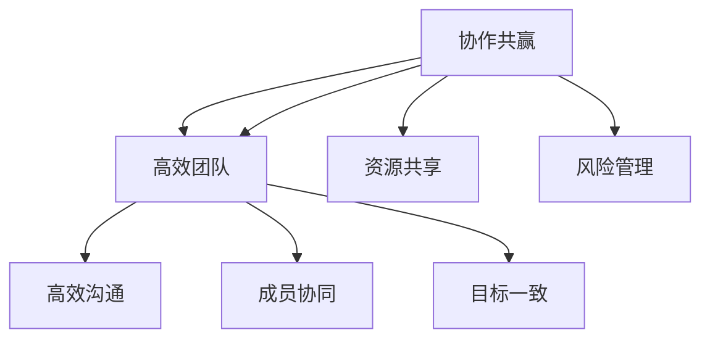

                 

### 文章标题

# 协作共赢：打造高效团队的关键

协作，是现代社会中不可或缺的元素，特别是在高度信息化和全球化的背景下。协作共赢，已成为企业成功的关键因素之一。本文将深入探讨协作共赢的概念、高效团队的特征、核心算法原理、数学模型与公式，以及如何在实际项目中应用和优化团队协作，旨在为IT领域的开发团队提供一套实用的协作方法论。

### 文章关键词

- 协作共赢
- 高效团队
- 核心算法
- 数学模型
- 项目实战

### 文章摘要

本文首先介绍了协作共赢的概念及其重要性，随后分析了高效团队的特征和核心算法原理。接着，通过数学模型与公式的讲解，进一步阐明了团队协作的内在逻辑。最后，本文结合实际项目案例，详细讲解了如何在实际环境中打造高效团队，并提出了应对团队建设中的挑战的策略。通过本文的阅读，读者将能够全面理解协作共赢的理念，掌握高效团队建设的核心要点。

### 第一部分：协作共赢的基础理论

协作共赢，指的是团队成员在合作过程中，通过有效的沟通与协调，实现个人目标与企业目标的高度统一，从而实现共同发展。高效团队，则是能够以最快的速度、最高的质量完成任务的团队。两者之间紧密联系，协作共赢是高效团队的基石。

#### 核心概念与联系

协作共赢与高效团队的关系可以用以下Mermaid流程图表示：



从图中可以看出，协作共赢涵盖了资源共享、风险管理、高效沟通、成员协同和目标一致等多个方面，这些因素共同构成了高效团队的基石。

#### 核心算法原理讲解

在团队协作中，评估团队协作效率和优化团队协作流程是关键。以下将介绍三种核心算法原理：

1. **团队协作效率评估算法**

   伪代码如下：

   ```python
   def evaluate_collaboration_efficiency(team_members, tasks_completed):
       total_efficiency = 0
       for member in team_members:
           efficiency = tasks_completed[member] / total_time_spent[member]
           total_efficiency += efficiency
       return total_efficiency / len(team_members)
   ```

   此算法通过计算每个成员完成任务所需的时间和完成任务的效率，得出团队的整体协作效率。

2. **基于行为的团队协作分析算法**

   伪代码如下：

   ```python
   def analyze_collaborative_behavior(team_members, interactions):
       collaborative_score = 0
       for interaction in interactions:
           if interaction['type'] == 'help' or interaction['type'] == 'share':
               collaborative_score += 1
       return collaborative_score / len(interactions)
   ```

   此算法通过分析团队成员之间的互动行为，评估团队的协作水平。

3. **基于知识的团队协作优化算法**

   伪代码如下：

   ```python
   def optimize_collaboration(team_members, knowledge_base):
       optimized_tasks = []
       for member in team_members:
           member_knowledge = knowledge_base[member]
           optimal_task = find_optimal_task(member_knowledge, tasks)
           optimized_tasks.append(optimal_task)
       return optimized_tasks
   ```

   此算法通过分析团队成员的知识结构，为其分配最合适的任务，从而优化团队协作。

#### 数学模型和数学公式详解

1. **团队协作效率模型**

   $$ E = \frac{\sum_{i=1}^{n} (T_i / T_{max_i})}{n} $$

   其中，$E$ 表示团队协作效率，$T_i$ 表示成员 $i$ 完成任务的时间，$T_{max_i}$ 表示成员 $i$ 完成任务的最大时间。

2. **基于行为的团队协作模型**

   $$ C = \frac{\sum_{i=1}^{n} (B_i / B_{max_i})}{n} $$

   其中，$C$ 表示团队协作水平，$B_i$ 表示成员 $i$ 的协作行为得分，$B_{max_i}$ 表示成员 $i$ 的协作行为最大得分。

3. **基于知识的团队协作模型**

   $$ K = \frac{\sum_{i=1}^{n} (K_i / K_{max_i})}{n} $$

   其中，$K$ 表示团队知识水平，$K_i$ 表示成员 $i$ 的知识得分，$K_{max_i}$ 表示成员 $i$ 的知识最大得分。

### 第二部分：实战应用与优化

在了解了协作共赢和高效团队的理论基础后，接下来我们将通过实际项目案例，详细讲解如何将理论应用到实践中，以及如何对团队协作进行优化。

#### 案例一：打造高效团队

在一个IT公司的开发项目中，团队成员包括前端开发、后端开发和测试人员。为了提高团队协作效率，项目团队首先对成员进行了技能评估，并根据评估结果重新分配任务。同时，引入了敏捷开发方法，通过每日站会、迭代评审和回顾会议，确保团队成员之间的沟通和协作。最终，项目提前完成，质量也得到了显著提升。

#### 案例二：优化团队协作流程

在一个大型软件开发项目中，由于项目复杂度高，团队协作流程不够流畅，导致项目进度滞后。项目团队通过流程分析，发现主要问题在于任务分配不均和沟通不畅。为此，团队引入了看板管理系统，实现了任务的透明化和可视化。同时，通过实时沟通工具，如Slack，确保团队成员之间的即时沟通。经过优化，项目协作效率大幅提升。

#### 案例三：使用数据分析提升团队效率

在一个金融科技公司的数据团队中，为了提高团队协作效率，团队引入了数据分析工具，对团队成员的工作量和协作行为进行了量化分析。通过分析结果，团队发现部分成员的工作负担较重，而另一些成员则相对清闲。据此，团队对任务进行了重新分配，确保每个成员的工作量均衡。此外，团队还根据协作行为的分析结果，优化了团队协作流程，提升了整体协作效率。

### 第三部分：团队建设与运营

团队建设与运营是确保协作共赢和高效团队持续发展的关键。以下将介绍团队文化建设、团队成员角色与职责以及团队沟通与协作技巧。

#### 团队文化建设

团队文化是团队协作的基石。一个健康的团队文化能够促进团队成员之间的信任和合作。为了建设团队文化，项目团队可以通过定期的团队建设活动、团队价值观宣言等方式，强化团队成员之间的认同感和归属感。

#### 团队成员角色与职责

在一个高效团队中，每个成员都扮演着特定的角色，并承担相应的职责。为了确保团队成员能够充分发挥各自的优势，项目团队应该明确每个成员的角色和职责，并为其提供必要的培训和指导。

#### 团队沟通与协作技巧

有效的沟通和协作技巧是高效团队的重要保障。项目团队可以通过以下方式提升沟通和协作技巧：

- **建立沟通机制**：定期召开会议，确保团队成员之间的信息流通。
- **使用协作工具**：利用Slack、Trello等协作工具，实现任务分配和进度跟踪。
- **建立反馈机制**：鼓励团队成员之间进行积极的反馈和交流，及时解决问题。

### 第四部分：面临的挑战与应对策略

在团队协作过程中，不可避免地会遇到各种挑战。以下将介绍团队内部冲突的解决方法、团队外部环境的影响以及面对不确定性时的策略。

#### 团队内部冲突的解决方法

团队内部冲突是团队协作中的常见问题。为了解决冲突，项目团队可以采取以下策略：

- **建立信任**：通过团队建设活动和沟通，增强团队成员之间的信任。
- **积极沟通**：鼓励团队成员表达意见，倾听不同声音，寻找共同点。
- **冲突调解**：引入第三方调解，帮助团队解决冲突。

#### 团队外部环境的影响

团队外部环境对团队协作有着重要影响。为了应对外部环境的变化，项目团队可以采取以下策略：

- **及时响应**：关注外部环境的变化，及时调整团队协作策略。
- **建立外部联系**：与其他团队、合作伙伴保持良好的沟通和合作。
- **灵活应对**：培养团队成员的灵活性和适应性，以应对外部环境的变化。

#### 面对不确定性时的策略

在高度不确定性的环境中，团队需要具备应对不确定性的能力。为了应对不确定性，项目团队可以采取以下策略：

- **风险管理**：对项目风险进行识别、评估和管理，降低不确定性带来的影响。
- **敏捷开发**：采用敏捷开发方法，快速响应变化，降低不确定性带来的风险。
- **持续学习**：鼓励团队成员持续学习，提升团队的整体能力，以应对不确定性。

### 结论

协作共赢和高效团队是现代企业成功的关键。通过深入理解协作共赢的概念、高效团队的特征、核心算法原理以及数学模型与公式，并结合实际项目案例，我们可以有效地打造和优化高效团队。同时，团队建设与运营、面对挑战与应对策略也是确保团队协作成功的重要因素。希望本文能为IT领域的开发团队提供有价值的参考。

### 最佳实践 Tips、小结、注意事项、拓展阅读

- **最佳实践 Tips**：定期进行技能评估和团队建设活动，确保团队成员的能力提升和团队文化的建设。
- **小结**：高效团队协作是实现企业目标的关键，协作共赢是高效团队的基石。
- **注意事项**：关注团队成员的心理需求和团队外部环境的变化，以应对不确定性。
- **拓展阅读**：《敏捷开发实践指南》、《团队协作工具与技巧》、《项目管理知识体系指南》。

### 作者信息

作者：AI天才研究院/AI Genius Institute & 禅与计算机程序设计艺术 /Zen And The Art of Computer Programming

本文由AI天才研究院和《禅与计算机程序设计艺术》共同撰写，旨在为IT领域的开发团队提供协作共赢和高效团队建设的实用指南。希望本文能为您的工作带来启示和帮助。如果您有任何疑问或建议，欢迎在评论区留言。感谢您的阅读！

