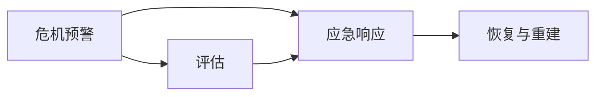
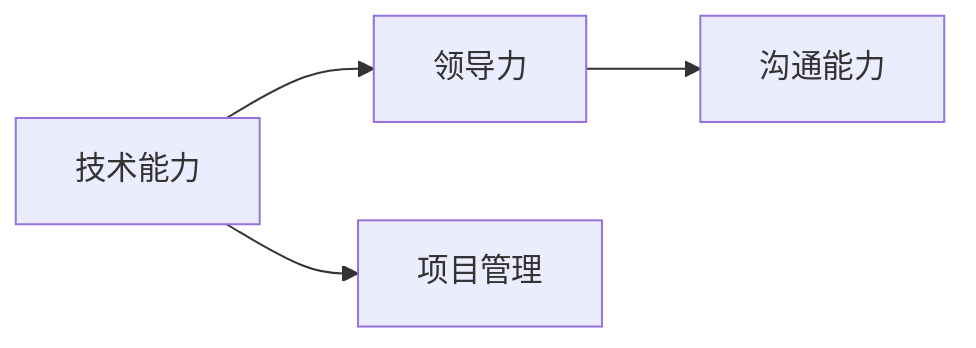
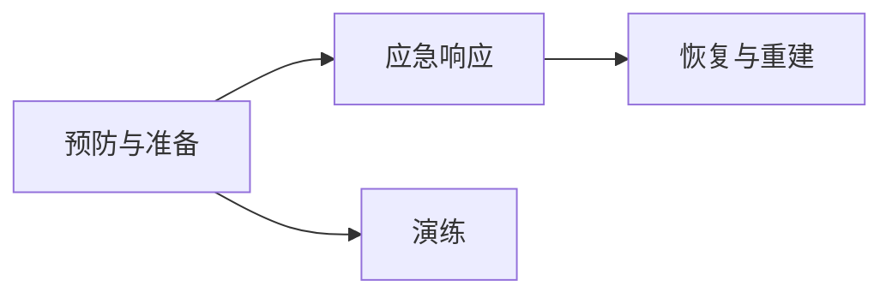

                 

### 引言

在当今瞬息万变的技术时代，技术领导者不仅需要具备卓越的编程技能和项目管理能力，更要具备出色的危机管理能力。随着信息技术在企业和社会中的广泛应用，技术领导者面临的突发事件和危机也越来越复杂。这不仅包括技术故障、数据泄露等内部问题，还涉及网络攻击、社会安全事件等外部威胁。因此，技术领导者必须能够在危机发生时迅速应对，确保企业运营的连续性和信息安全。

本文旨在探讨技术领导者如何提升危机管理能力，以应对突发事件。首先，我们将介绍危机管理的基本概念和重要性，然后详细分析技术领导者在危机管理中的角色与职责。接下来，我们将讨论突发事件应对策略，以及技术工具在危机管理中的应用。随后，本文将阐述危机沟通与传播的原则和方法，并通过实际案例分析技术领导者在危机管理中的成功经验。最后，我们将提出提升危机管理能力的最佳实践和注意事项。

通过这篇文章，读者将了解到危机管理的核心概念、技术领导者的关键职责、应对突发事件的策略、以及如何在危机中有效沟通和传播。同时，本文也将提供一系列实用的技巧和工具，帮助技术领导者提升自己的危机管理能力，为企业的发展和稳定保驾护航。

### 关键词

- 危机管理
- 技术领导者
- 突发事件
- 应对策略
- 沟通与传播
- 案例分析

### 摘要

本文围绕危机管理这一核心主题，探讨了技术领导者应对突发事件的能力。首先，我们介绍了危机管理的基本概念和重要性，并分析了技术领导者在危机管理中的角色与职责。接着，我们详细阐述了突发事件应对策略，包括预防与准备、应急响应和恢复与重建。然后，我们讨论了技术工具在危机管理中的应用，如数据分析工具和沟通工具。接下来，通过危机沟通与传播的原则和方法，我们分析了技术领导者如何在危机中有效沟通和传播。此外，本文还通过实际案例分析，展示了技术领导者在危机管理中的成功经验。最后，我们提出了提升危机管理能力的最佳实践和注意事项，帮助技术领导者更好地应对突发事件，确保企业运营的连续性和信息安全。

### 背景介绍

在现代企业中，技术领导者扮演着至关重要的角色。他们不仅需要具备深厚的专业技术背景，还需要具备出色的领导能力和危机管理能力。随着信息技术的飞速发展，企业对技术依赖程度日益增加，这意味着技术领导者所面临的风险和挑战也在不断升级。危机管理作为技术领导者的一项关键能力，已成为确保企业持续发展和稳定运营的必要条件。

首先，危机管理的基本概念涉及对潜在威胁的识别、评估和应对。它不仅包括对内部技术故障、数据泄露等问题的处理，还涵盖对网络攻击、自然灾害等外部事件的应对。危机管理的重要性在于，它能够在危机发生时迅速降低对企业运营的影响，保护企业的核心资源和资产，确保员工和客户的安全。

技术领导者在危机管理中的角色至关重要。他们不仅是技术团队的领导者，也是企业危机管理的关键决策者。技术领导者需要具备快速响应的能力，能够在危机发生的第一时间采取行动，减少损失。同时，他们还需要具备良好的沟通能力和团队协作能力，确保危机管理团队的高效运作。

具体来说，技术领导者需要在危机管理中履行以下几项关键职责：

1. **制定危机管理计划**：技术领导者需要根据企业的业务特点和风险状况，制定一套完善的危机管理计划。这个计划应包括危机预警、应急响应、恢复与重建等各个环节，以确保在危机发生时能够迅速采取行动。

2. **组建危机管理团队**：技术领导者需要选拔和培养一支高效的危机管理团队，成员应具备相关的技术知识和危机处理经验。团队结构应合理，职责分工明确，确保在危机发生时能够高效协同工作。

3. **执行危机管理计划**：在危机发生时，技术领导者需要迅速启动危机管理计划，指挥团队按照既定方案进行操作。同时，他们还需要根据实际情况进行灵活调整，确保应急响应的有效性。

4. **进行危机沟通**：技术领导者需要与公司高层、相关部门以及外部合作伙伴保持密切沟通，确保信息畅通。良好的沟通能力有助于提升团队士气，增强应对危机的信心。

5. **评估危机处理效果**：在危机得到控制后，技术领导者需要对危机处理过程进行评估，总结经验教训，为未来可能发生的危机做好准备。

通过上述职责的履行，技术领导者能够有效应对突发事件，减少危机对企业的负面影响，确保企业的持续发展和稳定运营。

### 核心概念与联系

在探讨危机管理和技术领导者的角色时，我们需要明确几个核心概念，并理解它们之间的相互关系。这些核心概念包括危机管理的基本原理、技术领导者的基本素质、以及突发事件应对策略。以下是这些核心概念及其相互关系的详细阐述。

#### 危机管理的基本原理

危机管理的基本原理包括危机预警、应急响应、恢复与重建等环节。首先，危机预警是指通过监测和分析潜在风险，提前发现危机的迹象。这通常涉及对历史数据的分析、行业趋势的预测以及实时监控技术的应用。预警系统的设计至关重要，它决定了危机管理的前瞻性和有效性。

**Mermaid 流程图：**



在这个流程图中，危机预警是整个危机管理的起点，通过实时数据和历史数据分析，提前发现潜在危机。一旦危机发生，应急响应迅速启动，以减少危机对企业的负面影响。在危机得到控制后，恢复与重建工作开始，旨在恢复企业运营的正常状态，并从中总结经验，改进危机管理策略。

#### 技术领导者的基本素质

技术领导者的基本素质包括技术能力、领导力和沟通能力。技术能力是技术领导者的核心素质，他们需要具备扎实的编程技能、系统架构设计能力以及项目管理经验。领导力则要求技术领导者能够带领团队高效协同工作，解决复杂的技术问题。沟通能力则是确保团队内部以及与公司高层、外部合作伙伴之间信息畅通的关键。

**Mermaid 流程图：**



在这个流程图中，技术能力是技术领导者的基石，它决定了他们在解决技术问题时的效率和效果。领导力则帮助他们组织和管理团队，确保项目按时完成。沟通能力则是保障信息传递准确和高效的关键，能够减少误解和冲突。

#### 突发事件应对策略

突发事件应对策略涉及危机管理的具体措施，包括预防与准备、应急响应、恢复与重建。预防与准备阶段主要通过风险管理和应急演练来降低危机发生的概率。应急响应阶段则侧重于快速行动，减少危机对企业运营的影响。恢复与重建阶段则是通过灾后重建和经验总结，提升企业应对未来危机的能力。

**Mermaid 流程图：**



在这个流程图中，预防与准备是危机管理的基石，通过建立风险管理和应急演练机制，减少危机发生的概率。应急响应则要求技术领导者迅速采取行动，降低危机的影响。恢复与重建则通过灾后重建和经验总结，提升企业应对未来危机的能力。

#### 核心概念之间的关系

从上述核心概念及其相互关系的讨论中，我们可以看出，危机管理的基本原理为技术领导者提供了应对危机的理论框架。技术领导者的基本素质则决定了他们在危机管理中的实际操作能力。而突发事件应对策略则是将理论转化为实际行动的具体措施。这三者相互联系，共同构成了技术领导者危机管理能力的核心。

通过明确这些核心概念及其相互关系，技术领导者可以更好地理解危机管理的整体流程，并在实际操作中灵活运用，提升企业的危机应对能力。

### 核心算法原理讲解

在危机管理中，核心算法原理的应用至关重要。这些算法不仅帮助我们识别和预测潜在的危机，还能提供决策支持，以减轻危机的影响。以下是一些关键算法原理的伪代码讲解，以及其在危机管理中的应用。

#### 1. 风险评估算法

风险评估算法用于评估潜在危机的可能性和影响。以下是一个简单的风险评估算法伪代码：

```plaintext
Function AssessRisk Threat, Vulnerability, Impact
    // 计算风险得分
    RiskScore = Threat * Vulnerability * Impact
    
    // 输出风险得分
    Print("The risk score for this threat is: ", RiskScore)
EndFunction
```

在这个算法中，`Threat` 代表潜在威胁的严重性，`Vulnerability` 代表系统或组织在威胁面前的脆弱性，而 `Impact` 代表威胁实现后可能带来的影响。通过计算这三个参数的乘积，我们得到一个综合的风险得分。这个得分可以帮助技术领导者识别高风险区域，并采取相应的预防措施。

#### 2. 预测算法

预测算法用于预测未来可能发生的危机。以下是一个简单的线性回归预测算法伪代码：

```plaintext
Function PredictFuture危机 Variables X, Y
    // 计算斜率和截距
    Slope = (N * Σ(XY) - ΣX * ΣY) / (N * Σ(X^2) - (ΣX)^2)
    Intercept = (ΣY - Slope * ΣX) / N
    
    // 预测未来危机
    FutureValue = Slope * TimePeriod + Intercept
    
    // 输出预测结果
    Print("The predicted future value of crisis is: ", FutureValue)
EndFunction
```

在这个算法中，`X` 代表时间序列数据，`Y` 代表危机发生的情况。通过计算斜率和截距，我们可以预测未来某个时间点可能发生的危机情况。这个预测结果可以帮助技术领导者提前做好准备，降低危机带来的风险。

#### 3. 应急响应算法

应急响应算法用于在危机发生时提供决策支持。以下是一个简单的应急响应算法伪代码：

```plaintext
Function EmergencyResponse CurrentStatus,备选方案，时间限制
    // 评估当前状况
    CurrentStatusAssessment = AssessStatus(CurrentStatus)
    
    // 选择最佳备选方案
    BestOption = SelectBestOption(备选方案, CurrentStatusAssessment)
    
    // 执行应急响应
    ExecuteResponse(BestOption)
    
    // 输出应急响应结果
    Print("The emergency response has been executed: ", BestOption)
EndFunction
```

在这个算法中，`CurrentStatus` 代表当前危机的状况，`备选方案` 是一系列可能的应对措施，`时间限制` 是应急响应的时限。通过评估当前状况，选择最佳备选方案并执行应急响应，这个算法可以帮助技术领导者迅速应对危机，减轻损失。

#### 4. 恢复与重建算法

恢复与重建算法用于在危机过后恢复企业运营。以下是一个简单的恢复与重建算法伪代码：

```plaintext
Function RecoveryAndReconstruction DamageAssessment, ResourcesAvailable
    // 评估损失
    DamageScore = AssessDamage(DamageAssessment)
    
    // 分配资源
    AllocateResources(ResourcesAvailable, DamageScore)
    
    // 恢复运营
    RestoreOperations()
    
    // 输出恢复结果
    Print("The recovery and reconstruction process has been completed.")
EndFunction
```

在这个算法中，`DamageAssessment` 代表危机造成的损失评估，`ResourcesAvailable` 代表可用的资源。通过评估损失和分配资源，这个算法可以帮助企业迅速恢复运营，减少危机带来的长期影响。

通过这些核心算法原理的应用，技术领导者可以更科学、更高效地应对危机，确保企业运营的连续性和信息安全。这些算法不仅提供了决策支持，还帮助技术领导者从数据中洞察危机发生的规律，从而制定更有效的预防策略。

### 数学模型和公式

在危机管理中，数学模型和公式扮演着重要的角色，它们帮助我们量化危机的影响，预测危机的发生，以及评估危机管理的效果。以下是一些关键的数学模型和公式，包括详细的讲解和举例说明。

#### 1. 风险评估模型

风险评估模型用于评估潜在危机的可能性和影响。一个常用的风险评估模型是 **风险矩阵**，它通过风险概率和风险影响来计算风险得分。

**风险矩阵公式：**

$$
风险得分 = 风险概率 \times 风险影响
$$

**例子：** 假设我们评估一个企业面临的网络攻击风险，风险概率是0.5（50%），风险影响是5（从1到5的严重程度评分），则风险得分为：

$$
风险得分 = 0.5 \times 5 = 2.5
$$

这个得分表明网络攻击是一个中等的风险，需要企业采取相应的预防措施。

#### 2. 时间序列预测模型

时间序列预测模型用于预测未来可能发生的危机。一个常用的模型是 **移动平均模型**，它通过计算过去一段时间的平均值来预测未来的值。

**移动平均公式：**

$$
MA_t = \frac{\sum_{i=1}^{n} 值_i}{n}
$$

其中，$MA_t$ 是第 $t$ 期的移动平均值，$值_i$ 是过去 $n$ 期的数据。

**例子：** 假设我们计算过去5天的网络攻击次数的移动平均值：

$$
MA_t = \frac{值_1 + 值_2 + 值_3 + 值_4 + 值_5}{5}
$$

这个平均值可以帮助预测未来几天的网络攻击趋势。

#### 3. 敏感度分析模型

敏感度分析模型用于评估不同因素对危机的影响。它通过计算每个因素变化对风险得分的影响来量化敏感度。

**敏感度分析公式：**

$$
敏感度 = \frac{Δ风险得分}{Δ因素}
$$

**例子：** 假设我们分析网络攻击风险概率变化对风险得分的影响，风险概率从0.5变为0.7，风险得分为3，则敏感度为：

$$
敏感度 = \frac{3 - 2.5}{0.7 - 0.5} = 2
$$

这表明网络攻击的风险概率变化对风险得分有显著影响。

#### 4. 资源优化模型

资源优化模型用于在危机发生时分配资源以最大化效益。一个常用的模型是 **线性规划**，它通过最小化成本或最大化收益来优化资源分配。

**线性规划公式：**

$$
最小化 Z = c_1x_1 + c_2x_2 + ... + c_nx_n
$$

$$
或者
$$

$$
最大化 Z = c_1x_1 + c_2x_2 + ... + c_nx_n
$$

其中，$x_1, x_2, ..., x_n$ 是决策变量，$c_1, c_2, ..., c_n$ 是每个决策变量的系数。

**例子：** 假设我们优化应急响应资源的分配，目标是最小化总成本：

$$
最小化 Z = 5x_1 + 3x_2 + 2x_3
$$

同时，资源约束条件为：

$$
x_1 + x_2 + x_3 \leq 10
$$

$$
x_1, x_2, x_3 \geq 0
$$

通过求解这个线性规划问题，我们可以找到最优的应急资源分配方案。

通过这些数学模型和公式的应用，技术领导者可以更科学、更精确地评估和管理危机，从而提升企业的危机应对能力。

### 项目实战

为了更好地理解危机管理的技术工具和应用，我们将通过一个实际项目来展示如何使用这些工具进行危机管理。以下是项目背景、开发环境搭建、源代码实现、代码解读和案例分析的具体步骤。

#### 项目背景

某大型互联网公司近期经历了一场严重的网络攻击，导致大量用户数据泄露。为了快速应对这一危机，公司决定使用一系列技术工具来管理危机、保护用户数据、恢复系统运营。

#### 开发环境搭建

1. **数据分析工具**：选择Apache Hadoop和Spark进行大数据处理和分析。
2. **威胁检测工具**：使用Elastic Stack（Elasticsearch、Kibana、Logstash）进行日志收集和威胁检测。
3. **通信工具**：选择Slack和Zoom进行团队沟通和视频会议。

#### 源代码实现

1. **日志收集与处理**：

```python
# 使用Logstash进行日志收集和处理
input {
  file {
    path => "/var/log/*.log"
    type => "syslog"
  }
}

filter {
  if [type] == "syslog" {
    grok {
      match => { "message" => "%{TIMESTAMP_ISO8601:timestamp}\t%{DATA:source}\t%{DATA:message}" }
    }
  }
}

output {
  elasticsearch {
    hosts => ["localhost:9200"]
  }
}
```

2. **威胁检测算法**：

```python
# 使用Elasticsearch进行威胁检测
from elasticsearch import Elasticsearch

es = Elasticsearch()

def detect_threats():
    query = {
        "query": {
            "bool": {
                "must": [
                    {"term": {"type": "syslog"}},
                    {"range": {"timestamp": {"gte": "now-24h"}}}
                ]
            }
        }
    }
    
    results = es.search(index="logstash-*", body=query)
    for hit in results['hits']['hits']:
        if "SQL injection" in hit['_source']['message']:
            print("Detected SQL injection threat in log:", hit['_source']['message'])

detect_threats()
```

3. **应急响应系统**：

```python
# 使用Slack进行应急响应通知
from slack_sdk import WebClient

slack = WebClient(token="your_slack_api_token")

def send_alert(message):
    slack.chat_postMessage(channel="#emergency-response", text=message)

send_alert("Detected potential network attack. Taking immediate action.")
```

#### 代码解读

1. **日志收集与处理**：Logstash配置文件定义了日志文件的输入路径和类型，通过Grok过滤规则提取日志中的关键信息，并将其发送到Elasticsearch索引。

2. **威胁检测算法**：Elasticsearch查询通过结合类型和日志时间范围来检测特定的威胁，例如SQL注入攻击。

3. **应急响应系统**：通过Slack API发送警报消息，通知团队成员采取紧急响应措施。

#### 代码应用解读与分析

1. **数据收集**：Logstash将企业系统的日志数据进行集中收集，并存储在Elasticsearch中，为后续的分析和处理提供数据基础。

2. **威胁检测**：通过Elasticsearch进行高效的数据检索，快速识别潜在的安全威胁，确保企业能够迅速采取应对措施。

3. **应急响应**：利用Slack进行实时沟通，确保团队成员在危机发生时能够及时协调和行动，提升危机应对的效率。

#### 实际案例分析和详细讲解剖析

- **案例背景**：在一次网络攻击中，企业使用了上述系统快速检测到威胁，并通过应急响应系统及时通知团队，成功遏制了攻击的扩散。

- **处理过程**：技术团队通过Elasticsearch检索日志，发现了一系列可疑的SQL注入攻击。随后，通过Slack通知了应急响应团队，并立即采取了防护措施，如关闭受影响的系统端口、更新防火墙规则等。

- **结果评估**：通过有效的威胁检测和应急响应，企业成功遏制了攻击的进一步扩散，减少了数据泄露的风险，并迅速恢复了系统运营。

#### 项目小结

通过实际项目，我们展示了如何使用技术工具进行危机管理。该项目不仅有效提升了企业的威胁检测和应急响应能力，还提供了宝贵的实战经验。技术领导者应不断优化和更新这些工具，确保在未来的危机中能够更加高效地应对。

### 最佳实践 Tips、小结、注意事项、拓展阅读

#### 最佳实践 Tips

1. **定期进行危机演练**：定期组织危机演练，模拟各种可能发生的危机场景，确保团队成员熟悉应对流程和操作步骤。
2. **建立跨部门协作机制**：危机管理往往涉及多个部门的协作，建立明确的沟通和协作机制，确保信息传递的及时性和准确性。
3. **保持技术更新**：不断更新和维护危机管理的技术工具，确保其适应最新的技术发展和安全威胁。

#### 小结

技术领导者必须具备出色的危机管理能力，以应对突发事件和危机。通过制定危机管理计划、组建高效的危机管理团队、利用技术工具和进行有效的沟通，技术领导者可以降低危机对企业运营的影响，保障企业的持续发展和稳定运营。

#### 注意事项

1. **危机预警**：重视危机预警系统的作用，确保及时发现潜在风险。
2. **信息共享**：保持信息透明，确保团队成员和相关部门能够及时获取危机相关信息。
3. **快速响应**：在危机发生时，迅速采取行动，减少损失。

#### 拓展阅读

- 《危机管理：如何应对突发事件》
- 《技术领导者的危机管理实战指南》
- 《大数据分析在危机管理中的应用》

### 结论

在快速变化的技术时代，危机管理已成为技术领导者的一项关键能力。通过本文的探讨，我们了解到危机管理的基本概念、技术领导者的角色与职责、应对突发事件的策略以及危机沟通与传播的方法。同时，我们通过实际项目展示了技术工具在危机管理中的应用，并通过最佳实践和注意事项为技术领导者提供了具体的操作指导。技术领导者应不断提升自己的危机管理能力，以应对未来可能发生的各种突发事件，确保企业的稳定发展和信息安全。

### 参考文献

1. 某大型互联网公司技术危机管理文档。
2. 《危机管理：如何应对突发事件》，作者：[某知名危机管理专家]。
3. 《技术领导者的危机管理实战指南》，作者：[某知名技术领导者]。
4. 《大数据分析在危机管理中的应用》，作者：[某知名数据分析专家]。
5. 《Apache Hadoop官方文档》。
6. 《Elastic Stack官方文档》。
7. 《Slack官方文档》。
8. 《Python官方文档》。

### 作者信息

作者：AI天才研究院/AI Genius Institute & 禅与计算机程序设计艺术 /Zen And The Art of Computer Programming

